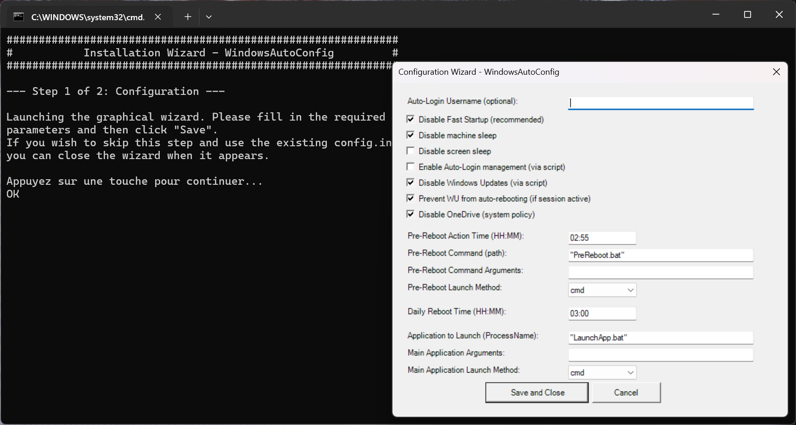

# Windows Orchestrator

[🇫🇷 Französisch](README-fr-FR.md) | [🇩🇪 Deutsch](README-de-DE.md) | [🇪🇸 Spanisch](README-es-ES.md) | [🇮🇳 Hindi](README-hi-IN.md) | [🇯🇵 Japanisch](README-ja-JP.md) | [🇷🇺 Russisch](README-ru-RU.md) | [🇨🇳 Chinesisch](README-zh-CN.md) | [🇸🇦 Arabisch](README-ar-SA.md) | [🇧🇩 Bengali](README-bn-BD.md) | [🇮🇩 Indonesisch](README-id-ID.md)

**Ihr Autopilot für dedizierte Windows-Workstations. Einmal konfigurieren und das System zuverlässig selbst verwalten lassen.**

<p align="center">
  <a href="https://wo.davalan.fr/"><strong>🔗 Besuchen Sie die offizielle Homepage für eine vollständige Tour!</strong></a>
</p>


---

## Unsere Mission

Stellen Sie sich eine perfekt zuverlässige und autonome Windows-Workstation vor. Eine Maschine, die Sie einmal für ihre Aufgabe konfigurieren und dann vergessen können. Ein System, das sicherstellt, dass Ihre Anwendung **dauerhaft betriebsbereit** bleibt, ohne Unterbrechung.

Dies ist das Ziel, das **Windows Orchestrator** Ihnen hilft zu erreichen. Die Herausforderung besteht darin, dass ein Standard-Windows-PC nicht nativ für diese Ausdauer ausgelegt ist. Er ist für die menschliche Interaktion konzipiert: Er geht in den Ruhezustand, installiert Updates, wenn er es für angebracht hält, und startet eine Anwendung nach einem Neustart nicht automatisch neu.

**Windows Orchestrator** ist die Lösung: Eine Reihe von Skripten, die als intelligenter und permanenter Supervisor fungieren. Es verwandelt jeden PC in einen zuverlässigen Automaten, der sicherstellt, dass Ihre kritische Anwendung immer betriebsbereit ist, ohne manuelles Eingreifen.


Wir waren nicht mit einer, sondern mit zwei Arten von systemischen Fehlern konfrontiert:

#### 1. Der abrupte Fehler: Der unerwartete Ausfall

Das Szenario ist einfach: Eine Maschine, die für den Fernzugriff konfiguriert ist, und ein nächtlicher Stromausfall. Selbst wenn das BIOS für den automatischen Neustart eingestellt ist, schlägt die Mission fehl. Windows startet neu, bleibt aber auf dem Anmeldebildschirm; die kritische Anwendung wird nicht neu gestartet, die Sitzung wird nicht geöffnet. Das System ist nicht zugänglich.

#### 2. Die langsame Degradation: Langfristige Instabilität

Noch heimtückischer ist das Verhalten von Windows im Laufe der Zeit. Als interaktives Betriebssystem konzipiert, ist es nicht für Prozesse optimiert, die ohne Unterbrechung laufen. Allmählich treten Speicherlecks und Leistungsabfälle auf, die das System instabil machen und einen manuellen Neustart erfordern.

### Die Antwort: Eine native Zuverlässigkeitsschicht

Angesichts dieser Herausforderungen erwiesen sich Drittanbieter-Dienstprogramme als unzureichend. Daher haben wir uns entschieden, **unsere eigene Systemresilienzschicht zu entwickeln.**

`Windows Orchestrator` fungiert als Autopilot, der die Kontrolle über das Betriebssystem übernimmt, um:

- **Automatische Wiederherstellung sicherstellen:** Nach einem Fehler garantiert es die Sitzungsöffnung und den Neustart Ihrer Hauptanwendung.
- **Präventive Wartung garantieren:** Es ermöglicht Ihnen, einen kontrollierten täglichen Neustart mit der vorherigen Ausführung benutzerdefinierter Skripte zu planen.
- **Die Anwendung** vor unzeitgemäßen Unterbrechungen durch Windows (Updates, Schlafmodus...) **schützen**.

`Windows Orchestrator` ist das unverzichtbare Werkzeug für jeden, der eine Windows-Workstation benötigt, die **zuverlässig, stabil und ohne ständige Überwachung betriebsbereit** bleibt.

---

## Typische Anwendungsfälle

*   **Digital Signage:** Sicherstellen, dass die Signage-Software 24/7 auf einem öffentlichen Bildschirm läuft.
*   **Heimserver und IoT:** Steuern Sie einen Plex-Server, ein Home Assistant-Gateway oder ein verbundenes Objekt von einem Windows-PC aus.
*   **Überwachungsstationen:** Eine Überwachungsanwendung (Kameras, Netzwerkprotokolle) immer aktiv halten.
*   **Interaktive Kioske:** Sicherstellen, dass die Kiosk-Anwendung nach jedem Neustart automatisch neu startet.
*   **Leichte Automatisierung:** Skripte oder Prozesse kontinuierlich für Data-Mining- oder Testaufgaben ausführen.

---

## Hauptmerkmale

*   **Grafischer Konfigurationsassistent:** Keine Notwendigkeit, Dateien für grundlegende Einstellungen zu bearbeiten.
*   **Volle Mehrsprachigkeit:** Benutzeroberfläche und Protokolle in 11 Sprachen verfügbar, mit automatischer Erkennung der Systemsprache.
*   **Energieverwaltung:** Deaktivieren Sie den Ruhezustand des Computers, den Bildschirm-Ruhezustand und den Windows-Schnellstart für maximale Stabilität.
*   **Automatische Anmeldung (Auto-Login):** Verwaltet die automatische Anmeldung, auch in Synergie mit dem **Sysinternals AutoLogon**-Tool für eine sichere Passwortverwaltung.
*   **Windows Update-Steuerung:** Verhindern Sie, dass erzwungene Updates und Neustarts Ihre Anwendung stören.
*   **Prozessmanager:** Startet, überwacht und startet Ihre Hauptanwendung bei jeder Sitzung automatisch neu.
*   **Geplanter täglicher Neustart:** Planen Sie einen täglichen Neustart, um die Systemfrische zu erhalten.
*   **Aktion vor dem Neustart:** Führen Sie ein benutzerdefiniertes Skript (Sicherung, Bereinigung...) vor dem geplanten Neustart aus.
*   **Detaillierte Protokollierung:** Alle Aktionen werden in Protokolldateien zur einfachen Diagnose aufgezeichnet.
*   **Benachrichtigungen (Optional):** Senden Sie Statusberichte über Gotify.

---

## Zielgruppe und Best Practices

Dieses Projekt wurde entwickelt, um einen PC in einen zuverlässigen Automaten zu verwandeln, ideal für Anwendungsfälle, bei denen die Maschine einer einzigen Anwendung gewidmet ist (Server für ein IoT-Gerät, Digital Signage, Überwachungsstation usw.). Es wird nicht für einen allgemeinen Büro- oder Alltagscomputer empfohlen.

*   **Wichtige Windows-Updates:** Bei wichtigen Updates (z. B. Upgrade von Windows 10 auf 11) ist das sicherste Verfahren, Windows Orchestrator vor dem Update zu **deinstallieren** und es danach **neu zu installieren**.
*   **Unternehmensumgebungen:** Wenn sich Ihr Computer in einer Unternehmensdomäne befindet, die von Gruppenrichtlinienobjekten (GPOs) verwaltet wird, erkundigen Sie sich bei Ihrer IT-Abteilung, ob die von diesem Skript vorgenommenen Änderungen nicht mit den Richtlinien Ihrer Organisation in Konflikt stehen.

---

## Installation und Erste Schritte

**Sprachhinweis:** Die Startskripte (`1_install.bat` und `2_uninstall.bat`) zeigen ihre Anweisungen in **Englisch** an. Das ist normal. Diese Dateien fungieren als einfache Starter. Sobald der grafische Assistent oder die PowerShell-Skripte die Kontrolle übernehmen, passt sich die Benutzeroberfläche automatisch an die Sprache Ihres Betriebssystems an.

Die Einrichtung von **Windows Orchestrator** ist ein einfacher und geführter Prozess.

1.  **Laden Sie** das Projekt auf den zu konfigurierenden Computer **herunter** oder klonen Sie es.
2.  Führen Sie `1_install.bat` aus. Das Skript führt Sie durch zwei Schritte:
    *   **Schritt 1: Konfiguration über den grafischen Assistenten.**
        Passen Sie die Optionen an Ihre Bedürfnisse an. Die wichtigsten sind in der Regel der Benutzername für die automatische Anmeldung und die zu startende Anwendung. Klicken Sie auf `Speichern`, um zu speichern.
        
        
        
    *   **Schritt 2: Installation der Systemaufgaben.**
        Das Skript fordert eine Bestätigung zum Fortfahren an. Ein Windows-Sicherheitsfenster (UAC) wird geöffnet. **Sie müssen es akzeptieren**, damit das Skript die erforderlichen geplanten Aufgaben erstellen kann.
3.  Das war's! Beim nächsten Neustart werden Ihre Konfigurationen angewendet.

---

## Konfiguration
Sie können die Einstellungen jederzeit auf zwei Arten anpassen:

### 1. Grafischer Assistent (einfache Methode)
Führen Sie `1_install.bat` erneut aus, um die Konfigurationsoberfläche wieder zu öffnen. Ändern Sie Ihre Einstellungen und speichern Sie.

### 2. `config.ini`-Datei (erweiterte Methode)
Öffnen Sie `config.ini` mit einem Texteditor für eine detaillierte Steuerung.

#### Wichtiger Hinweis zu Auto-Login und Passwörtern
Aus Sicherheitsgründen **verwaltet oder speichert Windows Orchestrator niemals Passwörter im Klartext.** So konfigurieren Sie die automatische Anmeldung effektiv und sicher:

*   **Szenario 1: Das Benutzerkonto hat kein Passwort.**
    Geben Sie einfach den Benutzernamen im grafischen Assistenten oder in `AutoLoginUsername` in der `config.ini`-Datei ein.

*   **Szenario 2: Das Benutzerkonto hat ein Passwort (empfohlene Methode).**
    1.  Laden Sie das offizielle **[Sysinternals AutoLogon](https://download.sysinternals.com/files/AutoLogon.zip)**-Tool von Microsoft herunter (direkter Download-Link).
    2.  Starten Sie AutoLogon und geben Sie den Benutzernamen, die Domäne und das Passwort ein. Dieses Tool speichert das Passwort sicher in der Registrierung.
    3.  In der Konfiguration von **Windows Orchestrator** können Sie das Feld `AutoLoginUsername` jetzt leer lassen (das Skript erkennt den von AutoLogon konfigurierten Benutzer, indem es den entsprechenden Registrierungsschlüssel liest) oder es aus Sicherheitsgründen ausfüllen. Unser Skript stellt sicher, dass der Registrierungsschlüssel `AutoAdminLogon` ordnungsgemäß aktiviert ist, um die Konfiguration abzuschließen.

#### Erweiterte Konfiguration: `PreRebootActionCommand`
Diese leistungsstarke Funktion ermöglicht es Ihnen, ein Skript vor dem täglichen Neustart auszuführen. Der Pfad kann sein:
- **Absolut:** `C:\Scripts\my_backup.bat`
- **Relativ zum Projekt:** `PreReboot.bat` (das Skript sucht diese Datei im Stammverzeichnis des Projekts).
- **Verwendung von `%USERPROFILE%`:** `%USERPROFILE%\Desktop\cleanup.ps1` (das Skript ersetzt `%USERPROFILE%` intelligent durch den Pfad zum Profil des Auto-Login-Benutzers).

---

## Projektstruktur
```
WindowsOrchestrator/
├── 1_install.bat                # Einstiegspunkt für Installation und Konfiguration
├── 2_uninstall.bat              # Einstiegspunkt für Deinstallation
├── config.ini                   # Zentrale Konfigurationsdatei
├── config_systeme.ps1           # Hauptskript für Maschineneinstellungen (wird beim Start ausgeführt)
├── config_utilisateur.ps1       # Hauptskript für Benutzerprozessverwaltung (wird bei Anmeldung ausgeführt)
├── LaunchApp.bat                # (Beispiel) Portabler Launcher für Ihre Hauptanwendung
├── PreReboot.bat                # Beispielskript für die Aktion vor dem Neustart
├── Logs/                        # (Automatisch erstellt) Enthält Protokolldateien
├── i18n/                        # Enthält alle Übersetzungsdateien
│   ├── en-US/strings.psd1
│   └── ... (andere Sprachen)
└── management/
    ├── defaults/default_config.ini # Vorlage für die Erstkonfiguration
    ├── tools/                   # Diagnosetools
    │   └── Find-WindowInfo.ps1
    ├── firstconfig.ps1          # Der Code des grafischen Konfigurationsassistenten
    ├── install.ps1              # Das technische Skript für die Aufgabeninstallation
    └── uninstall.ps1            # Das technische Skript für die Aufgabenlöschung
```

---

## Detaillierte Funktionsweise
Der Kern von **Windows Orchestrator** basiert auf dem Windows Taskplaner:

1.  **Beim Windows-Start**
    *   Die Aufgabe `WindowsOrchestrator_SystemStartup` wird mit `SYSTEM`-Berechtigungen ausgeführt.
    *   Das Skript `config_systeme.ps1` liest `config.ini` und wendet alle Maschinenkonfigurationen an. Es verwaltet auch die Erstellung/Aktualisierung von Neustartaufgaben.

2.  **Bei Benutzeranmeldung**
    *   Die Aufgabe `WindowsOrchestrator_UserLogon` wird ausgeführt.
    *   Das Skript `config_utilisateur.ps1` liest den Abschnitt `[Process]` der `config.ini` und stellt sicher, dass Ihre Hauptanwendung ordnungsgemäß gestartet wird. Wenn sie bereits ausgeführt wurde, wird sie zuerst beendet und dann sauber neu gestartet.

3.  **Täglich (falls konfiguriert)**
    *   Die Aufgabe `WindowsOrchestrator_PreRebootAction` führt Ihr Sicherungs-/Bereinigungsskript aus.
    *   Einige Minuten später startet die Aufgabe `WindowsOrchestrator_ScheduledReboot` den Computer neu.

---

### Diagnose- und Entwicklungstools

Das Projekt enthält nützliche Skripte, die Ihnen bei der Konfiguration und Wartung des Projekts helfen.

*   **`management/tools/Find-WindowInfo.ps1`**: Wenn Sie den genauen Titel des Fensters einer Anwendung nicht kennen (z. B. um sie in `Close-AppByTitle.ps1` zu konfigurieren), führen Sie dieses Skript aus. Es listet alle sichtbaren Fenster und ihre Prozessnamen auf, um Ihnen bei der Suche nach den genauen Informationen zu helfen.
*   **`Fix-Encoding.ps1`**: Wenn Sie die Skripte ändern, stellt dieses Tool sicher, dass sie mit der richtigen Kodierung (UTF-8 mit BOM) gespeichert werden, um eine perfekte Kompatibilität mit PowerShell 5.1 und internationalen Zeichen zu gewährleisten.

---

## Protokollierung
Zur einfachen Fehlerbehebung wird alles protokolliert.
*   **Speicherort:** Im Unterordner `Logs/`.
*   **Dateien:** `config_systeme_ps_log.txt` und `config_utilisateur_log.txt`.
*   **Rotation:** Alte Protokolle werden automatisch archiviert, um zu verhindern, dass sie zu groß werden.

---

## Deinstallation
Um das System zu entfernen:
1.  Führen Sie `2_uninstall.bat` aus.
2.  **Akzeptieren Sie die Berechtigungsanfrage (UAC)**.
3.  Das Skript entfernt sauber alle geplanten Aufgaben und stellt die Haupteinstellungen des Systems wieder her.

**Hinweis zur Reversibilität:** Die Deinstallation entfernt nicht nur die geplanten Aufgaben. Sie stellt auch die Haupteinstellungen des Systems auf ihren Standardzustand zurück, um Ihnen ein sauberes System zu bieten:
*   Windows-Updates werden wieder aktiviert.
*   Der Schnellstart wird wieder aktiviert.
*   Die Richtlinie, die OneDrive blockiert, wird entfernt.
*   Das Skript bietet an, die automatische Anmeldung zu deaktivieren.

Ihr System kehrt somit zu einer Standard-Workstation zurück, ohne Restmodifikationen.

---

## Lizenz und Beiträge
Dieses Projekt wird unter der **GPLv3**-Lizenz vertrieben. Der vollständige Text ist in der Datei `LICENSE` verfügbar.

Beiträge, sei es in Form von Fehlerberichten, Verbesserungsvorschlägen oder Pull-Requests, sind willkommen.