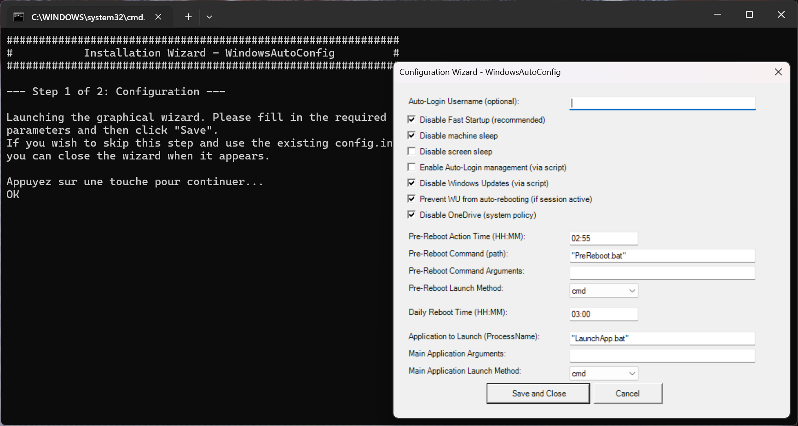

# Windows Orchestrator

[🇫🇷 Французский](README-fr-FR.md) | [🇩🇪 Немецкий](README-de-DE.md) | [🇪🇸 Испанский](README-es-ES.md) | [🇮🇳 Хинди](README-hi-IN.md) | [🇯🇵 Японский](README-ja-JP.md) | [🇷🇺 Русский](README-ru-RU.md) | [🇨🇳 Китайский](README-zh-CN.md) | [🇸🇦 Арабский](README-ar-SA.md) | [🇧🇩 Бенгальский](README-bn-BD.md) | [🇮🇩 Индонезийский](README-id-ID.md)

**Ваш автопилот для выделенных рабочих станций Windows. Настройте один раз и позвольте системе надежно управлять собой.**

<p align="center">
  <a href="https://wo.davalan.fr/"><strong>🔗 Посетите официальную домашнюю страницу для полного обзора!</strong></a>
</p>


---

## Наша миссия

Представьте себе идеально надежную и автономную рабочую станцию Windows. Машину, которую вы настраиваете один раз для выполнения своей миссии, а затем можете забыть о ней. Систему, которая гарантирует, что ваше приложение остается **постоянно работоспособным**, без перебоев.

Именно эту цель помогает вам достичь **Windows Orchestrator**. Проблема в том, что стандартный ПК с Windows изначально не предназначен для такой выносливости. Он разработан для взаимодействия с человеком: он переходит в спящий режим, устанавливает обновления, когда считает это нужным, и не перезапускает приложение автоматически после перезагрузки.

**Windows Orchestrator** — это решение: набор скриптов, который действует как интеллектуальный и постоянный супервизор. Он превращает любой ПК в надежный автомат, гарантируя, что ваше критически важное приложение всегда будет работать без ручного вмешательства.


Мы столкнулись не с одним, а с двумя типами системных сбоев:

#### 1. Резкий сбой: Неожиданное отключение

Сценарий прост: машина, настроенная для удаленного доступа, и ночное отключение электроэнергии. Даже при настройке BIOS на автоматический перезапуск миссия терпит неудачу. Windows перезагружается, но остается на экране входа; критическое приложение не запускается, сеанс не открывается. Система недоступна.

#### 2. Медленная деградация: Долгосрочная нестабильность

Еще более коварным является поведение Windows со временем. Разработанная как интерактивная ОС, она не оптимизирована для процессов, работающих без перерыва. Постепенно появляются утечки памяти и снижение производительности, что делает систему нестабильной и требует ручного перезапуска.

### Ответ: Собственный уровень надежности

Столкнувшись с этими проблемами, сторонние утилиты оказались недостаточными. Поэтому мы приняли решение **разработать собственный уровень устойчивости системы.**

`Windows Orchestrator` действует как автопилот, который берет на себя управление ОС, чтобы:

- **Обеспечить автоматическое восстановление:** После сбоя он гарантирует открытие сеанса и перезапуск вашего основного приложения.
- **Гарантировать профилактическое обслуживание:** Он позволяет планировать контролируемую ежедневную перезагрузку с предварительным выполнением пользовательских скриптов.
- **Защитить приложение** от несвоевременных прерываний со стороны Windows (обновления, спящий режим...).

`Windows Orchestrator` — это незаменимый инструмент для тех, кому нужна рабочая станция Windows, которая остается **надежной, стабильной и работоспособной без постоянного мониторинга.**

---

## Типичные варианты использования

*   **Цифровые вывески:** Обеспечьте круглосуточную работу программного обеспечения для вывесок на общедоступном экране.
*   **Домашние серверы и IoT:** Управляйте сервером Plex, шлюзом Home Assistant или подключенным объектом с ПК под управлением Windows.
*   **Станции наблюдения:** Всегда держите приложение для мониторинга (камеры, сетевые журналы) активным.
*   **Интерактивные киоски:** Убедитесь, что приложение киоска автоматически перезапускается после каждой перезагрузки.
*   **Легкая автоматизация:** Непрерывно запускайте скрипты или процессы для задач интеллектуального анализа данных или тестирования.

---

## Ключевые особенности

*   **Графический мастер настройки:** Нет необходимости редактировать файлы для базовых настроек.
*   **Полная многоязычная поддержка:** Интерфейс и журналы доступны на 11 языках с автоматическим определением языка системы.
*   **Управление питанием:** Отключите спящий режим машины, спящий режим дисплея и быстрый запуск Windows для максимальной стабильности.
*   **Автоматический вход (Auto-Login):** Управляет автоматическим входом, в том числе в синергии с инструментом **Sysinternals AutoLogon** для безопасного управления паролями.
*   **Контроль обновлений Windows:** Предотвратите принудительные обновления и перезагрузки, нарушающие работу вашего приложения.
*   **Диспетчер процессов:** Автоматически запускает, отслеживает и перезапускает ваше основное приложение при каждом сеансе.
*   **Запланированная ежедневная перезагрузка:** Запланируйте ежедневную перезагрузку для поддержания свежести системы.
*   **Действие перед перезагрузкой:** Выполните пользовательский скрипт (резервное копирование, очистка...) перед запланированной перезагрузкой.
*   **Подробное ведение журнала:** Все действия записываются в файлы журнала для легкой диагностики.
*   **Уведомления (необязательно):** Отправляйте отчеты о состоянии через Gotify.

---

## Целевая аудитория и лучшие практики

Этот проект предназначен для превращения ПК в надежный автомат, идеально подходящий для случаев использования, когда машина предназначена для одного приложения (сервер для устройства IoT, цифровые вывески, станция мониторинга и т. д.). Он не рекомендуется для обычного офисного или повседневного компьютера.

*   **Основные обновления Windows:** Для значительных обновлений (например, обновление с Windows 10 до 11) самой безопасной процедурой является **удаление** Windows Orchestrator перед обновлением, а затем его **повторная установка** после.
*   **Корпоративные среды:** Если ваш компьютер находится в корпоративном домене, управляемом объектами групповой политики (GPO), проконсультируйтесь с вашим ИТ-отделом, чтобы убедиться, что изменения, внесенные этим скриптом, не противоречат политике вашей организации.

---

## Установка и начало работы

**Примечание о языке:** Скрипты запуска (`1_install.bat` и `2_uninstall.bat`) отображают свои инструкции на **английском языке**. Это нормально. Эти файлы действуют как простые запускатели. Как только графический мастер или скрипты PowerShell возьмут на себя управление, интерфейс автоматически адаптируется к языку вашей операционной системы.

Настройка **Windows Orchestrator** — это простой и управляемый процесс.

1.  **Загрузите** или клонируйте проект на компьютер, который нужно настроить.
2.  Запустите `1_install.bat`. Скрипт проведет вас через два шага:
    *   **Шаг 1: Настройка с помощью графического мастера.**
        Настройте параметры в соответствии с вашими потребностями. Наиболее важными обычно являются имя пользователя для автоматического входа и запускаемое приложение. Нажмите `Сохранить`, чтобы сохранить.
        
        
        
    *   **Шаг 2: Установка системных задач.**
        Скрипт запросит подтверждение для продолжения. Откроется окно безопасности Windows (UAC). **Вы должны принять его**, чтобы разрешить скрипту создавать необходимые запланированные задачи.
3.  Вот и все! При следующей перезагрузке ваши конфигурации будут применены.

---

## Конфигурация
Вы можете настроить параметры в любое время двумя способами:

### 1. Графический мастер (простой метод)
Повторно запустите `1_install.bat`, чтобы снова открыть интерфейс настройки. Измените свои настройки и сохраните.

### 2. Файл `config.ini` (расширенный метод)
Откройте `config.ini` с помощью текстового редактора для детального контроля.

#### Важное примечание об автоматическом входе и паролях
Из соображений безопасности **Windows Orchestrator никогда не управляет и не хранит пароли в открытом тексте.** Вот как эффективно и безопасно настроить автоматический вход:

*   **Сценарий 1: Учетная запись пользователя не имеет пароля.**
    Просто введите имя пользователя в графическом мастере или в `AutoLoginUsername` в файле `config.ini`.

*   **Сценарий 2: Учетная запись пользователя имеет пароль (рекомендуемый метод).**
    1.  Загрузите официальный инструмент **[Sysinternals AutoLogon](https://download.sysinternals.com/files/AutoLogon.zip)** от Microsoft (прямая ссылка для загрузки).
    2.  Запустите AutoLogon и введите имя пользователя, домен и пароль. Этот инструмент безопасно сохранит пароль в реестре.
    3.  В конфигурации **Windows Orchestrator** вы можете оставить поле `AutoLoginUsername` пустым (скрипт обнаружит пользователя, настроенного AutoLogon, прочитав соответствующий ключ реестра) или заполнить его, чтобы быть уверенным. Наш скрипт обеспечит правильное включение ключа реестра `AutoAdminLogon` для завершения настройки.

#### Расширенная конфигурация: `PreRebootActionCommand`
Эта мощная функция позволяет выполнять скрипт перед ежедневной перезагрузкой. Путь может быть:
- **Абсолютный:** `C:\Scripts\my_backup.bat`
- **Относительно проекта:** `PreReboot.bat` (скрипт будет искать этот файл в корне проекта).
- **Использование `%USERPROFILE%`:** `%USERPROFILE%\Desktop\cleanup.ps1` (скрипт интеллектуально заменит `%USERPROFILE%` на путь к профилю пользователя автоматического входа).

---

## Структура проекта
```
WindowsOrchestrator/
├── 1_install.bat                # Точка входа для установки и настройки
├── 2_uninstall.bat              # Точка входа для удаления
├── config.ini                   # Центральный файл конфигурации
├── config_systeme.ps1           # Основной скрипт для настроек машины (запускается при запуске)
├── config_utilisateur.ps1       # Основной скрипт для управления пользовательскими процессами (запускается при входе в систему)
├── LaunchApp.bat                # (Пример) Портативный лаунчер для вашего основного приложения
├── PreReboot.bat                # Пример скрипта для действия перед перезагрузкой
├── Logs/                        # (Автоматически создается) Содержит файлы журналов
├── i18n/                        # Содержит все файлы перевода
│   ├── en-US/strings.psd1
│   └── ... (другие языки)
└── management/
    ├── defaults/default_config.ini # Шаблон начальной конфигурации
    ├── tools/                   # Инструменты диагностики
    │   └── Find-WindowInfo.ps1
    ├── firstconfig.ps1          # Код графического мастера настройки
    ├── install.ps1              # Технический скрипт для установки задач
    └── uninstall.ps1            # Технический скрипт для удаления задач
```

---

## Подробная работа
Ядро **Windows Orchestrator** основано на планировщике задач Windows:

1.  **При запуске Windows**
    *   Задача `WindowsOrchestrator_SystemStartup` запускается с привилегиями `SYSTEM`.
    *   Скрипт `config_systeme.ps1` считывает `config.ini` и применяет все конфигурации машины. Он также управляет созданием/обновлением задач перезагрузки.

2.  **При входе пользователя**
    *   Задача `WindowsOrchestrator_UserLogon` запускается.
    *   Скрипт `config_utilisateur.ps1` считывает раздел `[Process]` файла `config.ini` и гарантирует правильный запуск вашего основного приложения. Если оно уже работало, оно сначала останавливается, а затем чисто перезапускается.

3.  **Ежедневно (если настроено)**
    *   Задача `WindowsOrchestrator_PreRebootAction` выполняет ваш скрипт резервного копирования/очистки.
    *   Через несколько минут задача `WindowsOrchestrator_ScheduledReboot` перезагружает компьютер.

---

### Инструменты диагностики и разработки

Проект включает полезные скрипты, которые помогут вам настроить и поддерживать проект.

*   **`management/tools/Find-WindowInfo.ps1`**: Если вы не знаете точное название окна приложения (например, чтобы настроить его в `Close-AppByTitle.ps1`), запустите этот скрипт. Он выведет список всех видимых окон и их имен процессов, помогая вам найти точную информацию.
*   **`Fix-Encoding.ps1`**: Если вы изменяете скрипты, этот инструмент гарантирует, что они будут сохранены с правильной кодировкой (UTF-8 с BOM) для идеальной совместимости с PowerShell 5.1 и международными символами.

---

## Ведение журнала
Для облегчения устранения неполадок все записывается в журнал.
*   **Расположение:** В подпапке `Logs/`.
*   **Файлы:** `config_systeme_ps_log.txt` и `config_utilisateur_log.txt`.
*   **Ротация:** Старые журналы автоматически архивируются, чтобы они не становились слишком большими.

---

## Удаление
Чтобы удалить систему:
1.  Запустите `2_uninstall.bat`.
2.  **Примите запрос привилегий (UAC)**.
3.  Скрипт чисто удалит все запланированные задачи и восстановит основные системные настройки.

**Примечание об обратимости:** Удаление не просто удаляет запланированные задачи. Оно также восстанавливает основные системные настройки до их состояния по умолчанию, чтобы предоставить вам чистую систему:
*   Обновления Windows снова включены.
*   Быстрый запуск снова включен.
*   Политика блокировки OneDrive удалена.
*   Скрипт предложит отключить автоматический вход.

Таким образом, ваша система возвращается к стандартной рабочей станции без остаточных изменений.

---

## Лицензия и вклад
Этот проект распространяется под лицензией **GPLv3**. Полный текст доступен в файле `LICENSE`.

Вклад, будь то в виде отчетов об ошибках, предложений по улучшению или запросов на извлечение, приветствуется.