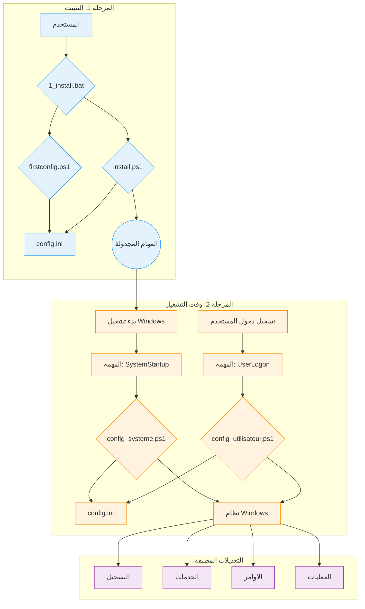

# وثائق WindowsOrchestrator الفنية

هذا المستند هو مرجع فني لمشروع WindowsOrchestrator. يفصل الهندسة المعمارية والمكونات وتسلسل التنفيذ لكل برنامج نصي.

* [1. نظرة عامة على المشروع](#1-نظرة-عامة-على-المشروع)
  * [1.1. غرض المشروع](#11-غرض-المشروع)
  * [1.2. مبادئ التشغيل](#12-مبادئ-التشغيل)
* [2. الهندسة المعمارية والمكونات الرئيسية](#2-الهندسة-المعمارية-والمكونات-الرئيسية)
  * [2.1. مخطط الهندسة المعمارية](#21-مخطط-الهندسة-المعمارية)
  * [2.2. دور مجدول المهام](#22-دور-مجدول-المهام)
  * [2.3. ملف `config.ini`: مصدر التكوين](#23-ملف-configini-مصدر-التكوين)
  * [2.4. نظام التدويل (i18n)](#24-نظام-التدويل-i18n)
* [3. دورة الحياة وتسلسل التنفيذ](#3-دورة-الحياة-وتسلسل-التنفيذ)
  * [3.1. تسلسل التثبيت الكامل](#31-تسلسل-التثبيت-الكامل)
  * [3.2. تسلسل تنفيذ بدء التشغيل (وقت التشغيل - مستوى النظام)](#32-تسلسل-تنفيذ-بدء-التشغيل-وقت-التشغيل-مستوى-النظام)
  * [3.3. تسلسل تنفيذ تسجيل الدخول (وقت التشغيل - مستوى المستخدم)](#33-تسلسل-تنفيذ-تسجيل-الدخول-وقت-التشغيل-مستوى-المستخدم)
  * [3.4. تسلسل إلغاء التثبيت](#34-تسلسل-إلغاء-التثبيت)
* [4. إجراءات التثبيت وإلغاء التثبيت](#4-إجراءات-التثبيت-وإلغاء-التثبيت)
  * [4.1. إجراء التثبيت](#41-إجراء-التثبيت)
    * [4.1.1. المرحلة 1: التكوين (سياق المستخدم)](#411-المرحلة-1-التكوين-سياق-المستخدم)
    * [4.1.2. المرحلة 2: تثبيت المهام (سياق المسؤول)](#412-المرحلة-2-تثبيت-المهام-سياق-المسؤول)
    * [4.1.3. حالة النظام بعد التثبيت](#413-حالة-النظام-بعد-التثبيت)
  * [4.2. إجراء إلغاء التثبيت](#42-إجراء-إلغاء-التثبيت)
    * [4.2.1. رفع الامتيازات](#421-رفع-الامتيازات)
    * [4.2.2. الإجراءات التي ينفذها البرنامج النصي](#422-الإجراءات-التي-ينفذها-البرنامج-النصي)
    * [4.2.3. حالة النظام بعد إلغاء التثبيت](#423-حالة-النظام-بعد-إلغاء-التثبيت)
* [5. دليل التكوين المتعمق (`config.ini`)](#5-دليل-التكوين-المتعمق-configini)
  * [5.1. قسم `[SystemConfig]`](#51-قسم-systemconfig)
  * [5.2. قسم `[Process]`](#52-قسم-process)
  * [5.3. قسم `[Logging]`](#53-قسم-logging)
  * [5.4. قسم `[Gotify]`](#54-قسم-gotify)
* [6. وصف مفصل للبرنامج النصي (مرجع الكود)](#6-وصف-مفصل-للبرنامج-النصي-مرجع-الكود)
  * [6.1. برامج الأوركسترا النصية (`management/`)](#61-برامج-الأوركسترا-النصية-management)
    * [**`firstconfig.ps1`**](#firstconfigps1)
    * [**`install.ps1`**](#installps1)
    * [**`uninstall.ps1`**](#uninstallps1)
  * [6.2. برامج وقت التشغيل النصية (الجذر)](#62-برامج-وقت-التشغيل-النصية-الجذر)
    * [**`config_systeme.ps1`**](#config_systemeps1)
    * [**`config_utilisateur.ps1`**](#config_utilisateurps1)
  * [6.3. برامج الأداة المساعدة وقاذفات التشغيل النصية](#63-برامج-الأداة-المساعدة-وقاذفات-التشغيل-النصية)
    * [**`Close-AppByTitle.ps1`**](#close-appbytitleps1)
    * [**`PreReboot.bat` و `LaunchApp.bat`**](#prerebootbat-و-launchappbat)
    * [**`management/tools/Find-WindowInfo.ps1`**](#managementtoolsfind-windowinfops1)
* [7. إجراءات الصيانة وتصحيح الأخطاء](#7-إجراءات-الصيانة-وتصحيح-الأخطاء)
  * [7.1. فهم واستخدام السجلات (`Logs/`)](#71-فهم-واستخدام-السجلات-logs)
  * [7.2. تصحيح أخطاء البرامج النصية يدويًا](#72-تصحيح-أخطاء-البرامج-النصية-يدويًا)
    * [**تشغيل `config_systeme.ps1` بحقوق `SYSTEM`**](#تشغيل-config_systemeps1-بحقوق-system)
    * [**اختبار `config_utilisateur.ps1` في جلسة مستخدم**](#اختبار-config_utilisateurps1-في-جلسة-مستخدم)
    * [**التحقق من حالة المهام المجدولة**](#التحقق-من-حالة-المهام-المجدولة)
  * [**7.3. اعتبارات أمنية**](#73-اعتبارات-أمنية)
  * [**7.4. القيود المعروفة**](#74-القيود-المعروفة)
* [8. ملحق](#8-ملحق)
  * [8.1. الترخيص](#81-الترخيص)
  * [8.2. مسرد المصطلحات](#82-مسرد-المصطلحات)

## 1. نظرة عامة على المشروع

### 1.1. غرض المشروع

يقوم مشروع WindowsOrchestrator بأتمتة تكوين نظام تشغيل Windows. يقوم بتشغيل البرامج النصية التي تعدل إعدادات النظام وتدير التطبيقات. تحول الإجراءات التي تنفذها البرامج النصية تثبيت Windows القياسي إلى بيئة يتم تحديد سلوكها بواسطة ملف تكوين مركزي.

تقرأ البرامج النصية ملف config.ini لتنفيذ الأوامر التي تعدل مفاتيح التسجيل، وتدير خدمات Windows، وتكوين إعدادات الطاقة، وإنشاء المهام المجدولة، وإدارة دورة حياة عملية المستخدم.

يوفر المشروع مجموعة من البرامج النصية التي تطبق تكوينات لإدارة الطاقة وتحديثات النظام وجلسة المستخدم ودورة حياة التطبيق.

### 1.2. مبادئ التشغيل

يعتمد تشغيل WindowsOrchestrator على أربع آليات رئيسية.

1.  **التنفيذ بواسطة أدوات Windows الأصلية**
    يستخدم المشروع الميزات والأوامر المضمنة في Windows: PowerShell 5.1، وجدول المهام، ومحرر التسجيل، وأدوات سطر الأوامر (`powercfg`، `shutdown`). لا يتطلب المشروع تثبيت أي تبعيات خارجية.

2.  **التكوين عبر ملف مركزي**
    منطق تنفيذ البرامج النصية منفصل عن التكوين. تقرأ البرامج النصية ملف `config.ini` لتحديد الإجراءات التي سيتم تنفيذها. لتغيير سلوك البرامج النصية، يقوم المستخدم بتعديل القيم في `config.ini`.

3.  **فصل سياقات التنفيذ (النظام مقابل المستخدم)**
    يستخدم المشروع سياقين تنفيذيين متميزين:
    *   يعمل البرنامج النصي **`config_systeme.ps1`** بأذونات حساب `NT AUTHORITY\SYSTEM` ويعدل الإعدادات العامة للجهاز (تسجيل HKLM، والخدمات، والمهام المجدولة).
    *   يعمل البرنامج النصي **`config_utilisateur.ps1`** بأذونات المستخدم الذي قام بتسجيل الدخول ويدير عمليات جلسته.

4.  **عدم تكرار الإجراءات**
    تتم كتابة البرامج النصية بحيث يؤدي تشغيلها بشكل متكرر إلى نفس الحالة النهائية مثل تشغيلها مرة واحدة. قبل تعديل الإعداد، يتحقق البرنامج النصي من الحالة الحالية للنظام. إذا تم تطبيق الحالة المطلوبة بالفعل، فلن يكرر البرنامج النصي إجراء التعديل.

## 2. الهندسة المعمارية والمكونات الرئيسية

تستخدم بنية WindowsOrchestrator مكونات Windows الأصلية. لكل مكون دور محدد.

### 2.1. مخطط الهندسة المعمارية

يتم تمثيل تدفق التنفيذ والتفاعلات بين المكونات بالرسم التخطيطي التالي:

يوضح هذا الرسم البياني الفصل بين **مرحلة التثبيت**، التي يبدأها المستخدم، و**مرحلة وقت التشغيل**، وهي دورة آلية يديرها مجدول المهام.

### 2.2. دور مجدول المهام

مجدول مهام Windows هو المكون المركزي للأتمتة. يقوم بتنفيذ البرامج النصية للتكوين في أوقات محددة وبمستويات الامتياز المطلوبة.

المهمتان الرئيسيتان اللتان تم إنشاؤهما بواسطة `install.ps1` هما:

*   **`WindowsOrchestrator-SystemStartup`**
    *   **المشغل:** "عند بدء تشغيل النظام".
    *   **سياق التنفيذ:** `NT AUTHORITY\SYSTEM`. يمتلك هذا الحساب الامتيازات المطلوبة لتعديل مفاتيح التسجيل في `HKEY_LOCAL_MACHINE` (HKLM)، وإدارة الخدمات، وتشغيل أوامر النظام.
    *   **الدور:** تنفيذ جميع التكوينات على مستوى الجهاز.

*   **`WindowsOrchestrator-UserLogon`**
    *   **المشغل:** "عند تسجيل الدخول" للمستخدم المحدد.
    *   **سياق التنفيذ:** حساب المستخدم الذي قام بتسجيل الدخول. يعمل البرنامج النصي بامتيازات هذا المستخدم، مما يسمح له بتشغيل التطبيقات الرسومية في جلسة المستخدم.
    *   **الدور:** تنفيذ جميع التكوينات الخاصة بجلسة المستخدم.

### 2.3. ملف `config.ini`: مصدر التكوين

يحتوي ملف `config.ini` على وصف الحالة النهائية المطلوبة للنظام. تقرأ البرامج النصية PowerShell (`config_systeme.ps1`، `config_utilisateur.ps1`) هذا الملف وتنفذ الأوامر اللازمة لجعل النظام يتوافق مع الإعدادات المحددة.

تتميز هذه الآلية بالعديد من الخصائص الواقعية:
*   يتم تحديد سلوك البرامج النصية بواسطة أزواج المفاتيح والقيم الموجودة في ملف config.ini.
*   يوجد منطق التنفيذ في ملفات البرامج النصية PowerShell (.ps1)، بينما تتم قراءة المعلمات التي تتحكم في هذا المنطق من ملف .ini.
*   تقرأ البرامج النصية ملف config.ini الموجود في دليلها الجذر، مما يسمح لمثيلات منفصلة من المشروع أن يكون لها سلوكيات مختلفة اعتمادًا على محتوى ملف config.ini الخاص بها.

### 2.4. نظام التدويل (i18n)

يقوم المشروع بتحميل السلاسل المترجمة دون تعديل الكود المصدري.

*   **بنية الملف:** يتم تخزين السلاسل في ملفات `.psd1` الموجودة في مجلدات فرعية من دليل `i18n/`. تتم تسمية كل مجلد فرعي على اسم رمز ثقافة (على سبيل المثال، `fr-FR`، `en-US`).

*   **آلية الكشف والتحميل:**
    1.  في بداية تنفيذه، يقوم البرنامج النصي بتشغيل الأمر `(Get-Culture).Name` للحصول على رمز ثقافة النظام (على سبيل المثال، `"fr-FR"`).
    2.  يقوم البرنامج النصي بإنشاء المسار إلى ملف اللغة المقابل (على سبيل المثال، `i18n\fr-FR\strings.psd1`).
    3.  **منطق الرجوع:** إذا لم يكن هذا الملف موجودًا، فسيستخدم البرنامج النصي المسار `i18n\en-US\strings.psd1`.
    4.  تتم قراءة محتوى ملف `.psd1` وتفسيره بواسطة `Invoke-Expression`، الذي يقوم بتحميل جدول تجزئة للسلاسل في متغير `$lang`.

*   **الاستخدام في الكود:**
    لعرض رسالة، يصل الكود إلى جدول تجزئة `$lang` عبر مفتاح (على سبيل المثال، `$lang.Uninstall_StartMessage`). تستخدم وظائف التسجيل معلمة `-DefaultMessage` تحتوي على نص باللغة الإنجليزية إذا لم يتم العثور على مفتاح.

لإضافة لغة جديدة، يجب على المستخدم نسخ مجلد `en-US`، وإعادة تسميته برمز الثقافة الجديد، وترجمة القيم في ملف `strings.psd1`.

## 3. دورة الحياة وتسلسل التنفيذ

يقسم هذا القسم عمليات المشروع إلى تسلسلات تنفيذ زمنية.

### 3.1. تسلسل التثبيت الكامل

1.  **المرحلة 1 - التشغيل والتكوين (سياق المستخدم)**
    *   يقوم المستخدم بتشغيل `1_install.bat`.
    *   يقوم البرنامج النصي الدفعي بتنفيذ `management\firstconfig.ps1`.
    *   **يعمل `firstconfig.ps1`:**
        *   يتحقق من وجود ملف `config.ini`. إذا كان غائبًا، فسيقوم بإنشائه من قالب `management/defaults/default_config.ini`. إذا كان موجودًا، فإنه يسأل المستخدم عما إذا كان يريد استبداله.
        *   يعرض واجهة مستخدم رسومية لـ Windows Forms، مملوءة مسبقًا بالقيم المقروءة من `config.ini`.
        *   عند النقر فوق "حفظ وإغلاق"، يقوم البرنامج النصي بكتابة القيم من حقول الواجهة في `config.ini`.
        *   ينتهي البرنامج النصي `firstconfig.ps1`.

2.  **المرحلة 2 - الرفع والتثبيت (سياق المسؤول)**
    *   يستأنف البرنامج النصي `1_install.bat`.
    *   يقوم بتنفيذ أمر PowerShell يستخدم `Start-Process PowerShell -Verb RunAs` لتشغيل `install.ps1`.
    *   يقوم Windows بتشغيل مطالبة **التحكم في حساب المستخدم (UAC)**. يجب على المستخدم منح الامتيازات.
    *   **يعمل `install.ps1` بامتيازات المسؤول:**
        *   يتحقق من وجود ملفي `config_systeme.ps1` و `config_utilisateur.ps1`.
        *   يقوم بتشغيل الأمر `Register-ScheduledTask` لإنشاء مهمتين:
            *   **`WindowsOrchestrator-SystemStartup`**، الذي يقوم بتشغيل `config_systeme.ps1` عند بدء التشغيل (`-AtStartup`) باستخدام حساب `NT AUTHORITY\SYSTEM`.
            *   **`WindowsOrchestrator-UserLogon`**، الذي يقوم بتشغيل `config_utilisateur.ps1` عند تسجيل الدخول (`-AtLogOn`) للمستخدم.
        *   لتطبيق التكوين، يقوم البرنامج النصي بتشغيل `config_systeme.ps1` ثم `config_utilisateur.ps1` عبر `Start-Process -Wait`.
    *   ينتهي البرنامج النصي `install.ps1`.

### 3.2. تسلسل تنفيذ بدء التشغيل (وقت التشغيل - مستوى النظام)

1.  **المشغل:** يبدأ نظام تشغيل Windows.
2.  **تنفيذ المهمة:** يقوم مجدول المهام بتشغيل مهمة `WindowsOrchestrator-SystemStartup`.
3.  **تشغيل البرنامج النصي:** تقوم المهمة بتنفيذ `powershell.exe` بامتيازات حساب `NT AUTHORITY\SYSTEM` لتشغيل `config_systeme.ps1`.
4.  **إجراءات `config_systeme.ps1`:**
    *   يقوم البرنامج النصي بتحليل `config.ini` وتحميل محتواه.
    *   يتحقق من اتصال الشبكة (`Test-NetConnection 8.8.8.8 -Port 53`).
    *   يقوم بتنفيذ كتل التكوين المحددة في `[SystemConfig]`. لكل إجراء:
        *   يقرأ قيمة المفتاح.
        *   يتحقق من الحالة الحالية للنظام (قيمة التسجيل، حالة الخدمة).
        *   إذا كانت الحالة الحالية مختلفة عن الحالة المطلوبة، فإنه ينفذ أمر التعديل (`Set-ItemProperty`، `powercfg`، إلخ).
        *   يسجل الإجراء أو الخطأ في القوائم.
    *   يرسل إشعار Gotify (إذا تم تمكينه).
5.  **نهاية التسلسل:** ينتهي البرنامج النصي.

### 3.3. تسلسل تنفيذ تسجيل الدخول (وقت التشغيل - مستوى المستخدم)

1.  **المشغل:** يقوم المستخدم بتسجيل الدخول.
2.  **تنفيذ المهمة:** يقوم مجدول المهام بتشغيل مهمة `WindowsOrchestrator-UserLogon`.
3.  **تشغيل البرنامج النصي:** تقوم المهمة بتنفيذ `powershell.exe` بامتيازات المستخدم لتشغيل `config_utilisateur.ps1` (`-WindowStyle Hidden`).
4.  **إجراءات `config_utilisateur.ps1`:**
    *   يقوم البرنامج النصي بتحليل `config.ini`.
    *   يقرأ المعلمات من قسم `[Process]`.
    *   يقوم بتنفيذ منطق إدارة العملية:
        1.  يقوم بحل متغيرات البيئة في مسار العملية.
        2.  يبحث عن العمليات الحالية التي تطابق الاسم وتنتمي إلى المستخدم الحالي (يتم التحقق منها بواسطة SID).
        3.  إذا تم العثور على أي منها، فإنه ينهيها (`Stop-Process -Force`).
        4.  يقوم بتشغيل مثيل جديد من العملية.
    *   يرسل إشعار Gotify (إذا تم تمكينه).
5.  **نهاية التسلسل:** ينتهي البرنامج النصي.

### 3.4. تسلسل إلغاء التثبيت

1.  **المشغل:** يقوم المستخدم بتشغيل `2_uninstall.bat`.
2.  **الرفع:** يقوم البرنامج النصي `2_uninstall.bat` بتشغيل `management\uninstall.ps1`، والذي يعيد تشغيل نفسه باستخدام `Start-Process -Verb RunAs`. يجب على المستخدم قبول مطالبة UAC.
3.  **إجراءات `uninstall.ps1`:**
    *   يسأل البرنامج النصي المستخدم سؤالاً لتعطيل AutoLogon.
    *   يقوم باستعادة مفاتيح تسجيل النظام:
        *   تحديث Windows (`NoAutoUpdate` -> `0`).
        *   بدء التشغيل السريع (`HiberbootEnabled` -> `1`).
        *   OneDrive (حذف `DisableFileSyncNGSC`).
        *   AutoLogon (`AutoAdminLogon` -> `0`) إذا طلب ذلك.
    *   يقوم بتشغيل `Unregister-ScheduledTask` لإزالة المهام المجدولة الأربع.
    *   يعرض ملخصًا ويبلغ بأن الملفات لم يتم حذفها.
4.  **نهاية التسلسل:** ينتهي البرنامج النصي.

## 4. إجراءات التثبيت وإلغاء التثبيت

يصف هذا القسم تسلسل العمليات التي تنفذها البرامج النصية الدفعية لتثبيت النظام وتنشيطه وإلغاء تثبيته واستعادته.

### 4.1. إجراء التثبيت

يبدأ الإجراء بتشغيل ملف `1_install.bat`. وهو مقسم إلى مرحلتين متميزتين.

#### 4.1.1. المرحلة 1: التكوين (سياق المستخدم)

1.  يقوم ملف `1_install.bat` بتنفيذ البرنامج النصي `management\firstconfig.ps1` عبر أمر `powershell.exe`.
2.  يتحقق البرنامج النصي `firstconfig.ps1` من وجود ملف `config.ini` في جذر المشروع.
    *   إذا لم يكن ملف `config.ini` موجودًا، فسيتم إنشاؤه عن طريق نسخ ملف `management/defaults/default_config.ini`.
    *   إذا كان ملف `config.ini` موجودًا، فسيتم عرض مربع حوار `System.Windows.Forms.MessageBox`، يسأل المستخدم عما إذا كان يريد استبدال الملف الموجود بالقالب.
3.  ثم يعرض البرنامج النصي واجهة مستخدم رسومية (Windows Forms) يتم ملء حقولها مسبقًا بالقيم المقروءة من ملف `config.ini`.
4.  عندما ينقر المستخدم على زر "حفظ وإغلاق"، تتم كتابة القيم من حقول الواجهة إلى ملف `config.ini` عبر وظيفة `Set-IniValue`. ينتهي البرنامج النصي.

#### 4.1.2. المرحلة 2: تثبيت المهام (سياق المسؤول)

1.  يعود التحكم إلى البرنامج النصي `1_install.bat`. يقوم بتنفيذ أمر `powershell.exe` الذي يتمثل دوره الوحيد في تشغيل مثيل ثانٍ من PowerShell عبر أمر `Start-Process PowerShell -Verb RunAs`.
2.  يؤدي هذا الإجراء إلى تشغيل مطالبة التحكم في حساب المستخدم (UAC). يجب على المستخدم منح الامتيازات للمتابعة.
3.  يعمل البرنامج النصي `management\install.ps1` بامتيازات المسؤول وينفذ الإجراءات التالية:
    *   يقوم بإنشاء المهمة المجدولة **`WindowsOrchestrator-SystemStartup`** عبر `Register-ScheduledTask`. يتم تعيين المشغل على `-AtStartup` والمسؤول التنفيذي هو `NT AUTHORITY\SYSTEM` (`-UserId "NT AUTHORITY\SYSTEM"`). الإجراء هو تنفيذ البرنامج النصي `config_systeme.ps1`.
    *   يقوم بإنشاء المهمة المجدولة **`WindowsOrchestrator-UserLogon`** عبر `Register-ScheduledTask`. يتم تعيين المشغل على `-AtLogOn` للمستخدم الحالي والمسؤول التنفيذي هو نفس المستخدم (`-UserId "$($env:USERDOMAIN)\$($env:USERNAME)"`). الإجراء هو تنفيذ البرنامج النصي `config_utilisateur.ps1`.

4.  لتطبيق التكوين على الفور، يقوم `install.ps1` بعد ذلك بتنفيذ البرامج النصية `config_systeme.ps1` ثم `config_utilisateur.ps1` بالتتابع وانتظار انتهاء كل عملية (`-Wait`).

#### 4.1.3. حالة النظام بعد التثبيت

*   يتم إنشاء مهمتين مجدولتين، `WindowsOrchestrator-SystemStartup` و `WindowsOrchestrator-UserLogon`، وتكونان نشطتين في مجدول مهام Windows.
*   يوجد ملف `config.ini` في جذر المشروع ويحتوي على التكوين المحدد من قبل المستخدم.
*   يوجد دليل `Logs` في جذر المشروع ويحتوي على ملفات السجل من التنفيذ الأولي.
*   تم تطبيق إعدادات النظام المحددة في `config.ini` لأول مرة.

### 4.2. إجراء إلغاء التثبيت

يبدأ الإجراء بتشغيل ملف `2_uninstall.bat`.

#### 4.2.1. رفع الامتيازات

1.  يقوم ملف `2_uninstall.bat` بتنفيذ البرنامج النصي `management\uninstall.ps1`.
2.  يتحقق البرنامج النصي `uninstall.ps1` من مستوى امتيازه. إذا لم يكن مسؤولاً، فإنه يعيد تشغيل نفسه عبر `Start-Process powershell.exe -Verb RunAs`، مما يؤدي إلى تشغيل مطالبة UAC يجب على المستخدم التحقق من صحتها.

#### 4.2.2. الإجراءات التي ينفذها البرنامج النصي

يقوم البرنامج النصي `management\uninstall.ps1`، الذي يعمل بامتيازات المسؤول، بتنفيذ العمليات التالية:

1.  **تفاعل المستخدم:** يعرض البرنامج النصي مطالبة في وحدة التحكم عبر `Read-Host`، يسأل المستخدم عما إذا كان يريد تعطيل تسجيل الدخول التلقائي. يتم تخزين استجابة المستخدم في متغير.
2.  **استعادة إعدادات النظام:**
    *   إذا أجاب المستخدم بـ `y` أو `yes`، فسيقوم البرنامج النصي بكتابة قيمة السلسلة `"0"` إلى مفتاح التسجيل `HKLM:\SOFTWARE\Microsoft\Windows NT\CurrentVersion\Winlogon\AutoAdminLogon`.
    *   يقوم بكتابة قيمة DWORD `0` إلى مفتاح `HKLM:\...\WindowsUpdate\AU\NoAutoUpdate`.
    *   يقوم بكتابة قيمة DWORD `0` إلى مفتاح `HKLM:\...\WindowsUpdate\AU\NoAutoRebootWithLoggedOnUsers`.
    *   يقوم بكتابة قيمة DWORD `1` إلى مفتاح `HKLM:\...\Power\HiberbootEnabled`.
    *   يقوم بإزالة قيمة `DisableFileSyncNGSC` من مفتاح `HKLM:\...\OneDrive` عبر `Remove-ItemProperty`.
    *   يقوم بتغيير نوع بدء تشغيل خدمة `wuauserv` إلى `Automatic` عبر `Set-Service`.
3.  **حذف المهام المجدولة:**
    *   يتكرر البرنامج النصي عبر قائمة محددة مسبقًا من أسماء المهام وينفذ `Unregister-ScheduledTask -Confirm:$false` لكل منها. المهام المحذوفة هي:
        *   `WindowsOrchestrator-SystemStartup`
        *   `WindowsOrchestrator-UserLogon`
        *   `WindowsOrchestrator-SystemScheduledReboot`
        *   `WindowsOrchestrator-SystemPreRebootAction`

#### 4.2.3. حالة النظام بعد إلغاء التثبيت

*   تتم إزالة المهام المجدولة الأربع المتعلقة بالمشروع من مجدول المهام. يتم إيقاف جميع عمليات الأتمتة.
*   تتم استعادة إعدادات التسجيل والخدمة المذكورة أعلاه إلى قيمها الافتراضية.
*   لا يتم تغيير إعدادات الطاقة التي تم تعديلها بواسطة أمر `powercfg` بواسطة برنامج إلغاء التثبيت.
*   لا يتم حذف دليل المشروع، بما في ذلك جميع البرامج النصية وملف `config.ini` والسجلات، ويظل على القرص.

## 5. دليل التكوين المتعمق (`config.ini`)

ملف `config.ini` هو مركز التحكم التعريفي للمشروع. يصف هذا الدليل كل مفتاح، وتأثيره على تنفيذ البرنامج النصي، وقيمه المحتملة، وتفاعلاته مع الإعدادات الأخرى. القيم الافتراضية هي تلك المحددة في ملف `management/defaults/default_config.ini`.

### 5.1. قسم `[SystemConfig]`

يحكم هذا القسم الإعدادات التي تؤثر على النظام بأكمله ويقرأها `config_systeme.ps1` حصريًا.

---

**`AutoLoginUsername`**

*   **الدور:** يحدد اسم المستخدم الذي سيتم كتابته في مفتاح التسجيل `DefaultUserName`. يستخدم هذا القيمة أيضًا بواسطة منطق إجراء ما قبل إعادة التشغيل لحل مسار `%USERPROFILE%`.
*   **القيم المحتملة:** سلسلة تمثل اسم مستخدم محلي أو مجال (على سبيل المثال، `Admin`، `DOMAIN\User`). إذا تركت القيمة فارغة، فسيحاول البرنامج النصي قراءة القيمة الموجودة بالفعل في مفتاح التسجيل `DefaultUserName`.
*   **القيمة الافتراضية:** "" (سلسلة فارغة)
*   **الترابطات:** هذا المعلمة مطلوبة إذا كان `EnableAutoLogin` هو `true`. من الضروري أيضًا استخدام متغير `%USERPROFILE%` في مفتاح `PreRebootActionCommand`.

---

**`EnableAutoLogin`**

*   **الدور:** يتحكم في حالة تسجيل الدخول التلقائي إلى Windows.
*   **إجراء البرنامج النصي:** إذا كانت القيمة `true`، فسيقوم البرنامج النصي بكتابة `"1"` إلى مفتاح التسجيل `HKLM:\SOFTWARE\Microsoft\Windows NT\CurrentVersion\Winlogon\AutoAdminLogon`. إذا كانت القيمة `false`، فإنه يكتب `"0"`.
*   **القيم المحتملة:** `true`، `false`
*   **القيمة الافتراضية:** `false`
*   **الترابطات:** يتطلب تكوين `AutoLoginUsername` بشكل صحيح ليعمل بشكل كامل. **ملاحظة للمطور:** لا يتعامل البرنامج النصي مع كلمة المرور (`DefaultPassword`)، والتي يجب تكوينها خارج النطاق (على سبيل المثال، باستخدام أداة Sysinternals AutoLogon).

---

**`DisableFastStartup`**

*   **الدور:** يتحكم في ميزة بدء التشغيل السريع في Windows (Hiberboot).
*   **إجراء البرنامج النصي:** إذا كان `true`، فاكتب القيمة `0` (DWORD) إلى مفتاح التسجيل `HKLM:\...\Power\HiberbootEnabled`. إذا كان `false`، فاكتب `1`.
*   **القيم المحتملة:** `true`، `false`
*   **القيمة الافتراضية:** `true`
*   **الترابطات:** لا شيء.

---

**`DisableSleep`** و **`DisableScreenSleep`**

*   **الدور:** إدارة حالة السكون للجهاز والشاشة.
*   **إجراء البرنامج النصي:**
    *   بالنسبة لـ `DisableSleep=true`، قم بتنفيذ الأوامر `powercfg /change standby-timeout-ac 0` و `powercfg /change hibernate-timeout-ac 0`.
    *   بالنسبة لـ `DisableScreenSleep=true`، قم بتنفيذ الأمر `powercfg /change monitor-timeout-ac 0`.
*   **القيم المحتملة:** `true`، `false`
*   **القيم الافتراضية:** `DisableSleep=true`، `DisableScreenSleep=false`
*   **الترابطات:** لا شيء.

---

**`DisableWindowsUpdate`**

*   **الدور:** تعطيل خدمة تحديث Windows تمامًا.
*   **إجراء البرنامج النصي:** إذا كان `true`، فسيقوم البرنامج النصي بتنفيذ ثلاثة إجراءات:
    1.  كتابة القيمة `1` (DWORD) إلى مفتاح `HKLM:\...\WindowsUpdate\AU\NoAutoUpdate`.
    2.  تغيير نوع بدء تشغيل خدمة `wuauserv` إلى `Disabled`.
    3.  إيقاف خدمة `wuauserv` (`Stop-Service`).
*   **القيم المحتملة:** `true`، `false`
*   **القيمة الافتراضية:** `true`
*   **الترابطات:** لا شيء.

---

**`DisableAutoReboot`**

*   **الدور:** يمنع Windows من إعادة التشغيل تلقائيًا بعد التحديث إذا كانت جلسة المستخدم نشطة.
*   **إجراء البرنامج النصي:** إذا كان `true`، فاكتب القيمة `1` (DWORD) إلى مفتاح التسجيل `HKLM:\...\WindowsUpdate\AU\NoAutoRebootWithLoggedOnUsers`.
*   **القيم المحتملة:** `true`، `false`
*   **القيمة الافتراضية:** `true`
*   **الترابطات:** هذا الإعداد مناسب بشكل أساسي عندما يكون `DisableWindowsUpdate` هو `false`.

---

**`ScheduledRebootTime`**

*   **الدور:** جدولة إعادة تشغيل يومية للجهاز.
*   **إجراء البرنامج النصي:** إذا تم توفير قيمة، فسيقوم البرنامج النصي بإنشاء/تحديث مهمة مجدولة (`WindowsOrchestrator-SystemScheduledReboot`) تنفذ `shutdown.exe /r /f /t 60` في الوقت المحدد. إذا كانت القيمة فارغة، فسيتم حذف المهمة المجدولة.
*   **القيم المحتملة:** سلسلة بتنسيق `HH:MM` (على سبيل المثال، `03:00`)، أو سلسلة فارغة للتعطيل.
*   **القيمة الافتراضية:** `03:00`
*   **الترابطات:** يقوم البرنامج النصي بإنشاء مهمتين مجدولتين منفصلتين لإجراء ما قبل إعادة التشغيل وإعادة التشغيل. يقوم مجدول مهام Windows بتنفيذ كل مهمة في الوقت المحدد، دون التحقق من ترتيبها الزمني.

---

**`PreRebootAction...`** (مجموعة من 4 مفاتيح)

*   **الدور:** تنفيذ أمر مخصص قبل إعادة التشغيل المجدولة. لا يكون هذا الكتلة نشطًا إلا إذا كان كل من `PreRebootActionTime` و `PreRebootActionCommand` غير فارغين.
*   **إجراء البرنامج النصي:** إنشاء/تحديث مهمة مجدولة (`WindowsOrchestrator-SystemPreRebootAction`) تنفذ الأمر المحدد. يقوم البرنامج النصي بحل متغيرات البيئة (`%USERPROFILE%`) والمسارات النسبية في `PreRebootActionCommand`.
*   **المفاتيح:**
    *   `PreRebootActionTime`: وقت التشغيل (`HH:MM`).
    *   `PreRebootActionCommand`: المسار إلى الملف التنفيذي أو البرنامج النصي.
    *   `PreRebootActionArguments`: الوسائط التي سيتم تمريرها إلى الأمر.
    *   `PreRebootActionLaunchMethod`: طريقة التنفيذ (`direct`، `powershell`، `cmd`).
*   **القيم الافتراضية:** `02:55`، `"PreReboot.bat"`، `""`، `cmd`
*   **الترابطات:** تنفيذ مهمة 'WindowsOrchestrator-SystemPreRebootAction' مستقل عن وجود مهمة 'WindowsOrchestrator-SystemScheduledReboot'.

---

**`DisableOneDrive`**

*   **الدور:** تعطيل تكامل OneDrive عبر سياسة النظام.
*   **إجراء البرنامج النصي:** إذا كان `true`، فاكتب القيمة `1` (DWORD) إلى مفتاح التسجيل `HKLM:\...\OneDrive\DisableFileSyncNGSC`. إذا كان `false`، فسيتم حذف المفتاح.
*   **القيم المحتملة:** `true`، `false`
*   **القيمة الافتراضية:** `true`
*   **الترابطات:** لا شيء.

### 5.2. قسم `[Process]`

يصف هذا القسم، الذي يقرأه `config_utilisateur.ps1`، كيفية إدارة تطبيق الأعمال الرئيسي. تعتمد العملية على الثلاثي المترابط التالي من المفاتيح:

*   **`ProcessName` ("ماذا")**
    *   **الدور:** يحدد المسار الكامل للملف التنفيذي أو البرنامج النصي الذي سيتم تشغيله. هذا هو الهدف الرئيسي للإجراء.
    *   **إجراء البرنامج النصي:** يستخدم البرنامج النصي هذه القيمة لتحديد العملية التي سيتم إيقافها وكهدف لأمر البدء. وهو يدعم متغيرات بيئة النظام والمستخدم (على سبيل المثال، `%USERPROFILE%`، `%PROGRAMFILES%`) التي يتم حلها ديناميكيًا في وقت التشغيل.

*   **`ProcessArguments` ("بماذا")**
    *   **الدور:** يحدد وسائط سطر الأوامر التي سيتم تمريرها إلى الملف التنفيذي/البرنامج النصي المحدد في `ProcessName`.
    *   **إجراء البرنامج النصي:** تتم إلحاق هذه السلسلة بأمر التنفيذ. إذا كانت فارغة، فلن يتم تمرير أي وسائط.

*   **`LaunchMethod` ("كيف")**
    *   **الدور:** يحدد مترجم الأوامر الذي سيتم استخدامه لتشغيل `ProcessName`. هذا الاختيار حاسم للتوافق.
    *   **إجراء البرنامج النصي:** يقوم البرنامج النصي بإنشاء الأمر النهائي بشكل مختلف اعتمادًا على القيمة:
        *   `direct`: تشغيل الملف التنفيذي مباشرة. الأمر هو `ProcessName "ProcessArguments"`. هذه هي الطريقة القياسية لملفات `.exe`.
        *   `cmd`: التشغيل عبر مترجم أوامر `cmd.exe`. الأمر الذي تم إنشاؤه هو `cmd.exe /c ""ProcessName" ProcessArguments"`. هذه هي الطريقة الموصى بها للبرامج النصية الدفعية (`.bat`، `.cmd`).
        *   `powershell`: التشغيل عبر PowerShell. الأمر الذي تم إنشاؤه هو `powershell.exe -NoProfile -ExecutionPolicy Bypass -Command "& 'ProcessName' ProcessArguments'"`. هذه هي الطريقة المثالية لتشغيل برامج PowerShell النصية الأخرى (`.ps1`).

### 5.3. قسم `[Logging]`

يقوم هذا القسم بتكوين سلوك ملفات السجل.

*   **`EnableLogRotation`**
    *   **الدور:** تمكين أو تعطيل آلية أرشفة السجل.
    *   **إجراء البرنامج النصي:** إذا كان `true`، فقبل الكتابة إلى ملف سجل (`log.txt`)، يتم استدعاء وظيفة `Rotate-LogFile`. تقوم بإعادة تسمية `log.txt` إلى `log.1.txt`، و `log.1.txt` إلى `log.2.txt`، وما إلى ذلك، حتى الحد الأقصى، وتحذف الأقدم. إذا كان `false`، فلن يتم استدعاء هذه الوظيفة وسينمو ملف السجل إلى أجل غير مسمى.
*   **`MaxSystemLogsToKeep` و `MaxUserLogsToKeep`**
    *   **الدور (المقصود):** يتم توفير هذه المفاتيح في `default_config.ini` لتحديد عدد ملفات السجل المؤرشفة التي سيتم الاحتفاظ بها.
    *   **إجراء البرنامج النصي (الحالي):** لا تتم قراءة مفاتيح MaxSystemLogsToKeep و MaxUserLogsToKeep بواسطة البرنامج النصي config_systeme.ps1. يتم استدعاء وظيفة Rotate-LogFile بقيمة ثابتة قدرها 7، يتم تحديدها بواسطة متغير $DefaultMaxLogs.

### 5.4. قسم `[Gotify]`

يتحكم هذا القسم في إرسال إشعارات الحالة إلى خادم Gotify.

*   **`EnableGotify`**: إذا كان `true`، فستحاول البرامج النصية إرسال إشعار في نهاية تنفيذها.
*   **`Url`**: عنوان URL الأساسي لمثيل Gotify (على سبيل المثال، `http://gotify.example.com`).
*   **`Token`**: رمز التطبيق الذي تم إنشاؤه في Gotify للسماح بإرسال الرسائل.
*   **`Priority`**: عدد صحيح يحدد أولوية الرسالة في Gotify.
*   **`GotifyTitle...`** (مجموعة من 4 مفاتيح):
    *   **الدور:** قوالب لعناوين الإشعارات.
    *   **إجراء البرنامج النصي:** قبل إرسال الإشعار، يأخذ البرنامج النصي السلسلة من المفتاح المناسب (على سبيل المثال، `GotifyTitleErrorSystem`) ويستبدل السلاسل الحرفية `%COMPUTERNAME%` و `%USERNAME%` بقيم متغيرات البيئة المقابلة.

## 6. وصف مفصل للبرنامج النصي (مرجع الكود)

يعمل هذا القسم كمرجع للكود المصدري. يقوم بتقسيم منطق وآليات كل برنامج نصي رئيسي في المشروع.

### 6.1. برامج الأوركسترا النصية (`management/`)

تدير هذه البرامج النصية دورة حياة المشروع (التثبيت، التكوين الأولي، إلغاء التثبيت). وهي مصممة ليتم تشغيلها يدويًا بواسطة المستخدم.

#### **`firstconfig.ps1`**

*   **الدور:** توفير واجهة مستخدم رسومية (GUI) لتكوين مساعد لملف `config.ini`.
*   **منطق واجهة المستخدم الرسومية:**
    *   يستخدم البرنامج النصي تجميعات .NET `System.Windows.Forms` و `System.Drawing`، التي يتم تحميلها عبر `Add-Type`، لإنشاء كائنات الواجهة ديناميكيًا (Form، Label، TextBox، CheckBox، Button).
    *   تتم إدارة تحديد موضع عناصر التحكم بواسطة متغيرات (`$xPadding`، `$yCurrent`) يتم زيادتها بعد إضافة كل عنصر.
    *   يتم تحميل لغة الواجهة ديناميكيًا من ملفات `strings.psd1`.
*   **إدارة `config.ini`:**
    *   **القراءة:** عند التشغيل، يقرأ البرنامج النصي القيم الحالية من `config.ini` باستخدام وظيفة `Get-IniValue` محلية. تقوم هذه الوظيفة بقراءة الملف سطرًا بسطر لاستخراج القيم. يتم تحويل قيم `true`/`false` إلى أنواع `[bool]` PowerShell لـ `CheckBoxes`.
    *   **الكتابة:** عند النقر فوق زر "حفظ"، يستدعي حدث `Add_Click` وظيفة `Set-IniValue` المحلية لكل معلمة. تقوم هذه الوظيفة بإعادة إنشاء محتوى الملف في الذاكرة قبل كتابته على القرص بترميز UTF-8.

#### **`install.ps1`**

*   **الدور:** إنشاء استمرارية النظام عن طريق تثبيت المهام المجدولة وإجراء تشغيل أولي للبرامج النصية لوقت التشغيل.
*   **آلية الرفع الذاتي:** يتحقق البرنامج النصي من مستوى امتيازه عبر `New-Object Security.Principal.WindowsPrincipal`. إذا لم يكن "مسؤولاً"، فإنه يعيد تشغيل نفسه باستخدام `Start-Process powershell.exe -Verb RunAs`.
*   **منطق إنشاء المهام:**
    *   يستخدم البرنامج النصي أوامر cmdlets الأصلية `New-ScheduledTaskAction` و `New-ScheduledTaskTrigger` و `New-ScheduledTaskPrincipal` و `New-ScheduledTaskSettingsSet` و `Register-ScheduledTask`.
    *   **إدارة المسؤول:**
        *   بالنسبة لـ `...-SystemStartup`، فإنه يستخدم `-UserId "NT AUTHORITY\SYSTEM" -RunLevel Highest`.
        *   بالنسبة لـ `...-UserLogon`، فإنه يستخدم `-UserId "$($env:USERDOMAIN)\$($env:USERNAME)" -LogonType Interactive`.
*   **تنفيذ ما بعد التثبيت:**
    *   بعد تسجيل المهام، يقوم البرنامج النصي بتنفيذ `config_systeme.ps1` ثم `config_utilisateur.ps1` عبر `Start-Process -Wait`.

#### **`uninstall.ps1`**

*   **الدور:** إزالة مكونات الأتمتة واستعادة إعدادات النظام الهامة.
*   **منطق الاستعادة:**
    *   يحتوي البرنامج النصي على قيم Windows "افتراضية" مشفرة بشكل ثابت في الكود الخاص به لاستعادة حالة النظام.
    *   يستخدم نفس أوامر cmdlets مثل `config_systeme.ps1` (`Set-ItemProperty`، `Set-Service`) ولكن بقيم عكسية.
    *   يتم تغليف العمليات في كتل `try...catch`.
*   **منطق التنظيف:**
    *   يستخدم قائمة محددة مسبقًا (`$TasksToRemove`) تحتوي على أسماء المهام المجدولة الأربع.
    *   يقوم بالتكرار عبر هذه القائمة وتشغيل `Get-ScheduledTask` للتحقق مما إذا كانت المهمة موجودة، ثم `Unregister-ScheduledTask -Confirm:$false` لحذفها.

### 6.2. برامج وقت التشغيل النصية (الجذر)

تحتوي هذه البرامج النصية على منطق الأعمال الرئيسي ويتم تنفيذها تلقائيًا بواسطة المهام المجدولة.

#### **`config_systeme.ps1`**

*   **بنية البرنامج النصي:** يتم تنظيم البرنامج النصي في عدة مناطق: الوظائف الأساسية، ووظائف الأداة المساعدة، والتهيئة، وكتلة التنفيذ الرئيسية (`try...catch...finally`).
*   **الوظائف الرئيسية:**
    *   `Get-IniContent`: تحليل `config.ini` وتحويله إلى جدول تجزئة PowerShell متداخل (`$ini['Section']['Key']`).
    *   `Get-ConfigValue`: هذا غلاف للوصول إلى التكوين. يتعامل مع المفاتيح/الأقسام المفقودة، ويوفر القيم الافتراضية، ويقوم بتحويل النوع.
    *   `Add-Action` / `Add-Error`: تقوم هذه الوظائف بمركزية التسجيل. تقوم بإضافة رسائل إلى القوائم العامة (`$Global:ActionsEffectuees`، `$Global:ErreursRencontrees`) المستخدمة لإنشاء تقرير Gotify.
*   **منطق التنفيذ:** الجسم الرئيسي للبرنامج النصي هو سلسلة من كتل التكوين. كل كتلة غير متكررة: تقرأ أولاً الحالة الحالية للنظام (قيمة التسجيل، حالة الخدمة) قبل الكتابة.

#### **`config_utilisateur.ps1`**

*   **الدور:** التأكد من أن تطبيق الأعمال المحدد في `[Process]` في الحالة المطلوبة (مثيل واحد تم تشغيله حديثًا).
*   **منطق إدارة العملية:**
    1.  **حل المسار:** تتم معالجة `ProcessName` بواسطة `[System.Environment]::ExpandEnvironmentVariables()` لحل متغيرات مثل `%USERPROFILE%`.
    2.  **تحديد المالك:** يستخدم البحث عن العملية الحالية `Get-Process` للعثور على العمليات بالاسم، ثم `Get-CimInstance Win32_Process` لاسترداد مالك كل عملية. يقارن SID لمالك العملية بـ SID للمستخدم الحالي (`[System.Security.Principal.WindowsIdentity]::GetCurrent().User.Value`).
    3.  **الإيقاف وإعادة التشغيل:** إذا تم العثور على عملية مطابقة، فسيتم إنهاؤها عبر `Stop-Process -Force`. ثم يتم تشغيل مثيل جديد باستخدام `Start-Process`. يتم استخدام "Splatting" (`@startProcessSplat`) لاستدعاء `Start-Process`.

### 6.3. برامج الأداة المساعدة وقاذفات التشغيل النصية

هذه البرامج النصية هي إما أدوات دعم أو أمثلة تكامل.

#### **`Close-AppByTitle.ps1`**

*   **التفاعل مع `user32.dll`:**
    *   يقوم بإدخال فئة C# في الذاكرة عبر `Add-Type -TypeDefinition`. يستخدم كود C# هذا سمات `[DllImport("user32.dll")]` لكشف وظائف Windows API لـ PowerShell.
    *   يتم استخدام وظيفة `EnumWindows` مع كتلة برنامج نصي PowerShell كـ "رد اتصال". لكل نافذة يعثر عليها API، يتم تنفيذ كتلة PowerShell هذه. في هذه الكتلة يتم التحقق من عنوان النافذة.
    *   بمجرد تحديد النافذة المستهدفة بواسطة `handle` الخاص بها، يتم استدعاء `SetForegroundWindow` لمنحها التركيز، ثم يقوم `[System.Windows.Forms.SendKeys]::SendWait()` بمحاكاة ضغطات المفاتيح.

#### **`PreReboot.bat` و `LaunchApp.bat`**

*   **قابلية النقل:** يعتمد تشغيل هذه القاذفات على متغير البرنامج النصي الدفعي الخاص `%~dp0`، والذي يتم حله إلى المسار الكامل للدليل حيث يوجد البرنامج النصي.

#### **`management/tools/Find-WindowInfo.ps1`**

*   **الأداة المساعدة:** هذا البرنامج النصي هو أداة تصحيح أخطاء وتكوين.
*   **التشغيل:** يستخدم نفس تقنية إدخال كود C# واستدعاء `EnumWindows` API مثل `Close-AppByTitle.ps1`. يعرض قائمة منسقة من النوافذ المرئية، مع اسم العملية ومعرفها.

## 7. إجراءات الصيانة وتصحيح الأخطاء

يوفر هذا القسم أدلة عملية لتشخيص المشكلات واختبار التغييرات.

### 7.1. فهم واستخدام السجلات (`Logs/`)

*   **الموقع:** يتم إنشاء السجلات في المجلد الفرعي `Logs/`.
    *   `config_systeme_ps_log.txt`: يحتوي على سجلات من البرنامج النصي للنظام.
    *   `config_utilisateur_log.txt`: يحتوي على سجلات من البرنامج النصي للمستخدم.
*   **بنية رسالة السجل:** `YYYY-MM-DD HH:mm:ss [LEVEL] [Context] - Message`
*   **كيفية تحديد الإجراءات والأخطاء:**
    *   **الإجراءات الناجحة:** `ACTION: ...`
    *   **الأخطاء الملتقطة:** `CAPTURED ERROR: ...`
    *   **الأخطاء الفادحة:** `FATAL SCRIPT ERROR ...`

### 7.2. تصحيح أخطاء البرامج النصية يدويًا

#### **تشغيل `config_systeme.ps1` بحقوق `SYSTEM`**

1.  **المتطلبات الأساسية:** قم بتنزيل `PsExec.exe` من مجموعة Microsoft Sysinternals.
2.  **إجراء التنفيذ:**
    *   افتح موجه أوامر كمسؤول.
    *   قم بتشغيل الأمر: `PsExec.exe -s -i powershell.exe`
    *   تفتح نافذة PowerShell جديدة. يعرض الأمر `whoami` `nt authority\system`.
    *   في هذه النافذة، انتقل إلى دليل المشروع وقم بتشغيل `.\config_systeme.ps1`.

#### **اختبار `config_utilisateur.ps1` في جلسة مستخدم**

1.  **إجراء التنفيذ:**
    *   قم بتسجيل الدخول إلى جلسة Windows باستخدام حساب المستخدم المستهدف.
    *   افتح وحدة تحكم PowerShell قياسية.
    *   انتقل إلى دليل المشروع وقم بتشغيل `.\config_utilisateur.ps1`.

#### **التحقق من حالة المهام المجدولة**

1.  **افتح الأداة:** قم بتشغيل `taskschd.msc`.
2.  **ابحث عن المهام:** حدد "مكتبة مجدول المهام".
3.  **حلل المعلومات:**
    *   تحقق من أعمدة "الحالة" و "المشغلات" و "نتيجة التشغيل الأخير" (يشير الرمز `0x0` إلى النجاح).
    *   راجع علامة التبويب "السجل" للحصول على تفاصيل كل تنفيذ.

### **7.3. اعتبارات أمنية**

يفصل هذا القسم الآليات والآثار الأمنية المتعلقة بتشغيل المشروع.

*   **سياق تنفيذ مهام النظام**  
    يقوم البرنامج النصي `install.ps1` بتكوين المهمة المجدولة `WindowsOrchestrator-SystemStartup` للتشغيل بأذونات حساب `NT AUTHORITY\SYSTEM`. يمتلك هذا الحساب امتيازات واسعة على النظام المحلي، وهو أمر ضروري للسماح للبرنامج النصي `config_systeme.ps1` بتعديل مفاتيح التسجيل في خلية `HKEY_LOCAL_MACHINE` (HKLM) وإدارة خدمات النظام.

*   **آلية رفع الامتيازات (UAC)**  
    لا يلزم تشغيل برامج التثبيت (`1_install.bat`) وإلغاء التثبيت (`2_uninstall.bat`) من جلسة مسؤول. تقوم بتنفيذ أمر `Start-Process -Verb RunAs` الذي يؤدي إلى تشغيل مطالبة التحكم في حساب المستخدم (UAC) في Windows. يعتمد استمرار التنفيذ على تحقق المستخدم من صحة هذه المطالبة.

*   **إدارة كلمة مرور الجلسة**  
    لا تقوم برامج المشروع **بمعالجة أو طلب أو تخزين** كلمات مرور المستخدم بأي شكل من الأشكال. يؤدي تنشيط ميزة AutoLogon (`EnableAutoLogin=true`) ببساطة إلى كتابة القيمة `"1"` إلى مفتاح التسجيل `AutoAdminLogon`. لا تتم كتابة مفتاح `DefaultPassword` بواسطة البرامج النصية أبدًا. تقع مسؤولية تخزين كلمة المرور بشكل آمن في السجل على عاتق المستخدم، عبر أداة خارجية مثل `Sysinternals AutoLogon`.

*   **تجاوز سياسة التنفيذ**  
    تستخدم برامج التشغيل (`.bat`) وأوامر إنشاء المهام المجدولة بشكل منهجي وسيطة `-ExecutionPolicy Bypass` عند استدعاء `powershell.exe`. تسمح هذه الوسيطة بتشغيل البرامج النصية بغض النظر عن سياسة التنفيذ المكونة على النظام. ينطبق هذا الإعداد فقط على مثيل العملية التي يتم تشغيلها ولا يعدل سياسة أمان النظام بشكل دائم.

### **7.4. القيود المعروفة**

يوثق هذا القسم السلوكيات التي هي نتيجة لخيارات التصميم أو تمثل ميزات لم يتم تنفيذها في هذه المرحلة.

*   **عدم استعادة إعدادات الطاقة**  
    لا يقوم البرنامج النصي `uninstall.ps1` بتنفيذ أي أوامر `powercfg`. لذلك، لا يتم التراجع عن التغييرات التي أجراها `config_systeme.ps1` فيما يتعلق بسكون الجهاز (`standby-timeout-ac`) أو سكون الشاشة (`monitor-timeout-ac`) أثناء إلغاء التثبيت.

*   **تكوين تدوير السجل غير النشط**  
    يحتوي ملف قالب التكوين (`default_config.ini`) على مفاتيح `MaxSystemLogsToKeep` و `MaxUserLogsToKeep`. ومع ذلك، لا تقرأ وظيفة `Rotate-LogFile` في `config_systeme.ps1` هذه المفاتيح. تستخدم قيمة ثابتة قدرها `7`، يتم تحديدها في البرنامج النصي بواسطة متغير `$DefaultMaxLogs`.

*   **عدم وجود تحقق زمني من مهام إعادة التشغيل**  
    يقوم البرنامج النصي `config_systeme.ps1` بإنشاء المهام المجدولة لإجراء ما قبل إعادة التشغيل وإعادة التشغيل المجدولة ككيانين مستقلين. لا يحتوي البرنامج النصي على أي منطق للتحقق من أن قيمة `PreRebootActionTime` تسبق زمنيًا قيمة `ScheduledRebootTime`.

## 8. ملحق

### 8.1. الترخيص

يتم توزيع هذا المشروع بموجب شروط **رخصة جنو العمومية العامة الإصدار 3 (GPLv3)**. النص الكامل للترخيص متاح في جذر المشروع في ملف `LICENSE`.

### 8.2. مسرد المصطلحات

---
**UAC (التحكم في حساب المستخدم)**
*   **التعريف:** آلية أمان في Windows تتطلب تأكيد المستخدم قبل السماح بإجراء يتطلب امتيازات المسؤول.
*   **السياق في المشروع:** يتم تشغيله بواسطة `install.ps1` و `uninstall.ps1` عبر معلمة `-Verb RunAs` لأمر `Start-Process`.
---
**المهمة المجدولة (Scheduled Task)**
*   **التعريف:** مكون من خدمة Windows "مجدول المهام" يسمح بتنفيذ برنامج نصي أو برنامج تلقائيًا.
*   **السياق في المشروع:** الآلية المركزية للأتمتة.
---
**سجل Windows (Windows Registry)**
*   **التعريف:** قاعدة بيانات هرمية حيث يقوم Windows بتخزين إعدادات التكوين.
*   **السياق في المشروع:** الهدف الرئيسي للتعديلات بواسطة `config_systeme.ps1`.
---
**HKLM (HKEY_LOCAL_MACHINE)**
*   **التعريف:** خلية التسجيل التي تحتوي على الإعدادات التي تنطبق على الجهاز بأكمله.
*   **السياق في المشروع:** توجد جميع تعديلات التسجيل بواسطة `config_systeme.ps1` في HKLM.
---
**SID (معرف الأمان)**

*   **التعريف:** سلسلة فريدة تحدد مبدأ أمان (مستخدم، مجموعة).
*   **السياق في المشروع:** يستخدمه `config_utilisateur.ps1` لتحديد مالك العملية.
---
**`NT AUTHORITY\SYSTEM` (حساب SYSTEM)**
*   **التعريف:** حساب خدمة داخلي في Windows يتمتع بامتيازات واسعة على النظام المحلي.
*   **السياق في المشروع:** سياق تنفيذ `config_systeme.ps1`.
---
**عدم التكرار (Idempotence)**
*   **التعريف:** خاصية لعملية، إذا تم تطبيقها عدة مرات، فإنها تنتج نفس النتيجة كما لو تم تطبيقها مرة واحدة.
*   **السياق في المشروع:** مبدأ تصميم للبرامج النصية لضمان حالة نهائية مستقرة.
---
**سياسة تنفيذ PowerShell (Execution Policy)**
*   **التعريف:** ميزة أمان في PowerShell تحدد ما إذا كان يمكن تشغيل البرامج النصية.
*   **السياق في المشروع:** يتم تجاوزها عبر معلمة `-ExecutionPolicy Bypass` لضمان تنفيذ البرنامج النصي.
