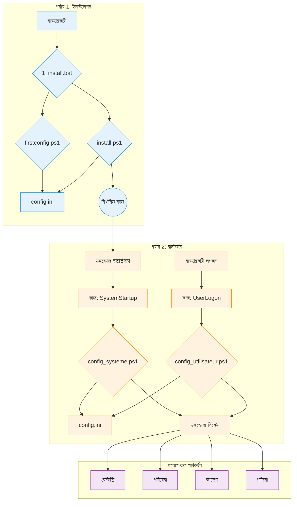

# WindowsOrchestrator প্রযুক্তিগত ডকুমেন্টেশন

এই ডকুমেন্টটি WindowsOrchestrator প্রকল্পের জন্য একটি প্রযুক্তিগত রেফারেন্স। এটি প্রতিটি স্ক্রিপ্টের আর্কিটেকচার, উপাদান এবং এক্সিকিউশন সিকোয়েন্সের বিবরণ দেয়।

[toc]

## 1. প্রকল্প ওভারভিউ

### 1.1. প্রকল্পের উদ্দেশ্য

WindowsOrchestrator প্রকল্পটি একটি উইন্ডোজ অপারেটিং সিস্টেমের কনফিগারেশন স্বয়ংক্রিয় করে। এটি এমন স্ক্রিপ্ট চালায় যা সিস্টেম সেটিংস পরিবর্তন করে এবং অ্যাপ্লিকেশন পরিচালনা করে। স্ক্রিপ্ট দ্বারা সম্পাদিত ক্রিয়াগুলি একটি স্ট্যান্ডার্ড উইন্ডোজ ইনস্টলেশনকে এমন একটি পরিবেশে রূপান্তরিত করে যার আচরণ একটি কেন্দ্রীয় কনফিগারেশন ফাইল দ্বারা সংজ্ঞায়িত করা হয়।

স্ক্রিপ্টগুলি রেজিস্ট্রি কী পরিবর্তন, উইন্ডোজ পরিষেবা পরিচালনা, পাওয়ার সেটিংস কনফিগার, নির্ধারিত কাজ তৈরি এবং ব্যবহারকারী প্রক্রিয়ার জীবনচক্র পরিচালনা করার জন্য config.ini ফাইলটি পড়ে।

প্রকল্পটি পাওয়ার ম্যানেজমেন্ট, সিস্টেম আপডেট, ব্যবহারকারী সেশন এবং একটি অ্যাপ্লিকেশনের জীবনচক্রের জন্য কনফিগারেশন প্রয়োগ করে এমন স্ক্রিপ্টগুলির একটি সেট সরবরাহ করে।

### 1.2. অপারেটিং নীতিমালা

WindowsOrchestrator এর অপারেশন চারটি প্রধান মেকানিজমের উপর ভিত্তি করে।

1.  **নেটিভ উইন্ডোজ সরঞ্জাম দ্বারা এক্সিকিউশন**
    প্রকল্পটি উইন্ডোজে অন্তর্নির্মিত বৈশিষ্ট্য এবং কমান্ড ব্যবহার করে: PowerShell 5.1, টাস্ক ഷെഡ്യൂলার, রেজিস্ট্রি এডিটর এবং কমান্ড-লাইন ইউটিলিটি (`powercfg`, `shutdown`)। প্রকল্পের জন্য কোনো বাহ্যিক নির্ভরতা ইনস্টল করার প্রয়োজন নেই।

2.  **একটি কেন্দ্রীভূত ফাইলের মাধ্যমে কনফিগারেশন**
    স্ক্রিপ্টগুলির এক্সিকিউশন লজিক কনফিগারেশন থেকে পৃথক। স্ক্রিপ্টগুলি `config.ini` ফাইলটি পড়ে সম্পাদিত ক্রিয়াগুলি নির্ধারণ করতে। স্ক্রিপ্টগুলির আচরণ পরিবর্তন করতে, একজন ব্যবহারকারী `config.ini` তে মানগুলি পরিবর্তন করে।

3.  **এক্সিকিউশন কনটেক্সটের পৃথকীকরণ (সিস্টেম বনাম ব্যবহারকারী)**
    প্রকল্পটি দুটি স্বতন্ত্র এক্সিকিউশন কনটেক্সট ব্যবহার করে:
    *   **`config_systeme.ps1`** স্ক্রিপ্টটি `NT AUTHORITY\SYSTEM` অ্যাকাউন্টের অনুমতি নিয়ে চলে এবং মেশিনের গ্লোবাল সেটিংস (HKLM রেজিস্ট্রি, পরিষেবা, নির্ধারিত কাজ) পরিবর্তন করে।
    *   **`config_utilisateur.ps1`** স্ক্রিপ্টটি লগ-ইন করা ব্যবহারকারীর অনুমতি নিয়ে চলে এবং তাদের সেশনের প্রক্রিয়াগুলি পরিচালনা করে।

4.  **ক্রিয়াগুলির আইডেম্পোটেন্সি**
    স্ক্রিপ্টগুলি এমনভাবে লেখা হয়েছে যাতে সেগুলি বারবার চালালে একই চূড়ান্ত অবস্থা তৈরি হয় যেমনটি একবার চালালে হয়। একটি সেটিং পরিবর্তন করার আগে, একটি স্ক্রিপ্ট সিস্টেমের বর্তমান অবস্থা পরীক্ষা করে। যদি ઇચ્છিত অবস্থা ইতিমধ্যে প্রয়োগ করা হয়, স্ক্রিপ্টটি পরিবর্তন ক্রিয়াটি পুনরাবৃত্তি করে না।

## 2. আর্কিটেকচার এবং মূল উপাদান

WindowsOrchestrator এর আর্কিটেকচার নেটিভ উইন্ডোজ উপাদান ব্যবহার করে। প্রতিটি উপাদানের একটি সংজ্ঞায়িত ভূমিকা রয়েছে।

### 2.1. আর্কিটেക്চার ডায়াগ্রাম

উপাদানগুলির মধ্যে এক্সিকিউশন ফ্লো এবং মিথস্ক্রিয়া নিম্নলিখিত ডায়াগ্রাম দ্বারা প্রতিনিধিত্ব করা হয়:

এই ডায়াগ্রামটি ব্যবহারকারী দ্বারা শুরু করা **ইনস্টলেশন পর্যায়** এবং টাস্ক ഷെഡ്യൂলার দ্বারা পরিচালিত একটি স্বয়ংক্রিয় চক্র **রানটাইম পর্যায়** এর মধ্যে পৃথকীকরণ দেখায়।

### 2.2. টাস্ক ഷെഡ്യൂলারের ভূমিকা

উইন্ডোজ টাস্ক ഷെഡ്യൂলার হল অটোমেশনের কেন্দ্রীয় উপাদান। এটি সংজ্ঞায়িত সময়ে এবং প্রয়োজনীয় বিশেষাধিকার স্তরের সাথে কনফিগারেশন স্ক্রিপ্টগুলি সম্পাদন করে।

`install.ps1` দ্বারা তৈরি দুটি প্রধান কাজ হল:

*   **`WindowsOrchestrator-SystemStartup`**
    *   **ট্রিগার:** "সিস্টেম স্টার্টআপে"।
    *   **এক্সিকিউশন কনটেক্সট:** `NT AUTHORITY\SYSTEM`। এই অ্যাকাউন্টের `HKEY_LOCAL_MACHINE` (HKLM) এ রেজিস্ট্রি কী পরিবর্তন, পরিষেবা পরিচালনা এবং সিস্টেম কমান্ড চালানোর জন্য প্রয়োজনীয় বিশেষাধিকার রয়েছে।
    *   **ভূমিকা:** সমস্ত মেশিন-স্তরের কনফিগারেশন সম্পাদন করা।

*   **`WindowsOrchestrator-UserLogon`**
    *   **ট্রিগার:** নির্দিষ্ট ব্যবহারকারীর "লগ অন এ"।
    *   **এক্সিকিউশন কনটেক্সট:** লগ-ইন করা ব্যবহারকারীর অ্যাকাউন্ট। স্ক্রিপ্টটি এই ব্যবহারকারীর বিশেষাধিকার নিয়ে চলে, যা এটিকে ব্যবহারকারীর সেশনে গ্রাফিকাল অ্যাপ্লিকেশন চালু করতে দেয়।
    *   **ভূমিকা:** সমস্ত ব্যবহারকারী-সেশন-নির্দিষ্ট কনফিগারেশন সম্পাদন করা।

### 2.3. `config.ini` ফাইল: কনফিগারেশনের উৎস

`config.ini` ফাইলে সিস্টেমের ઇચ્છিত চূড়ান্ত অবস্থার বিবরণ রয়েছে। PowerShell স্ক্রিপ্ট (`config_systeme.ps1`, `config_utilisateur.ps1`) এই ফাইলটি পড়ে এবং সিস্টেমকে সংজ্ঞায়িত সেটিংসের সাথে সঙ্গতিপূর্ণ করার জন্য প্রয়োজনীয় কমান্ডগুলি সম্পাদন করে।

এই মেকানিজমের বেশ কয়েকটি বাস্তবিক বৈশিষ্ট্য রয়েছে:
*   স্ক্রিপ্টগুলির আচরণ config.ini ফাইলে থাকা কী-মান জোড়া দ্বারা নির্ধারিত হয়।
*   এক্সিকিউশন লজিক PowerShell স্ক্রিপ্ট ফাইলগুলিতে (.ps1) থাকে, जबकि এই লজিক নিয়ন্ত্রণকারী প্যারামিটারগুলি একটি .ini ফাইল থেকে পড়া হয়।
*   স্ক্রিপ্টগুলি তাদের রুট ডিরেক্টরিতে উপস্থিত config.ini ফাইলটি পড়ে, যা প্রকল্পের পৃথক দৃষ্টান্তগুলিকে তাদের নিজস্ব config.ini ফাইলের বিষয়বস্তুর উপর নির্ভর করে বিভিন্ন আচরণ করতে দেয়।

### 2.4. আন্তর্জাতিকীকরণ (i18n) সিস্টেম

প্রকল্পটি সোর্স কোড পরিবর্তন না করে অনুবাদ করা স্ট্রিং লোড করে।

*   **ফাইল কাঠামো:** স্ট্রিংগুলি `i18n/` ডিরেক্টরির সাবফোল্ডারে অবস্থিত `.psd1` ফাইলগুলিতে সংরক্ষণ করা হয়। প্রতিটি সাবফোল্ডারের নামকরণ একটি সংস্কৃতি কোডের (যেমন, `fr-FR`, `en-US`) নামে করা হয়।

*   **শনাক্তকরণ এবং লোডিং মেকানিজম:**
    1.  এর এক্সিকিউশনের শুরুতে, একটি স্ক্রিপ্ট সিস্টেমের সংস্কৃতি কোড (যেমন, `"fr-FR"`) পেতে `(Get-Culture).Name` কমান্ডটি চালায়।
    2.  স্ক্রিপ্টটি संबंधित ভাষা ফাইলের (যেমন, `i18n\fr-FR\strings.psd1`) পথ তৈরি করে।
    3.  **ফলব্যাক লজিক:** যদি এই ফাইলটি موجود না থাকে, স্ক্রিপ্টটি `i18n\en-US\strings.psd1` পথটি ব্যবহার করে।
    4.  `.psd1` ফাইলের বিষয়বস্তু `Invoke-Expression` দ্বারা পড়া এবং ব্যাখ্যা করা হয়, যা স্ট্রিংগুলির একটি হ্যাশ টেবিল `$lang` ভেরিয়েবলে লোড করে।

*   **কোডে ব্যবহার:**
    একটি বার্তা প্রদর্শন করতে, কোডটি একটি কী (যেমন, `$lang.Uninstall_StartMessage`) এর মাধ্যমে `$lang` হ্যাশ টেবিল অ্যাক্সেস করে। যদি একটি কী পাওয়া না যায় তবে লগিং ফাংশনগুলি একটি ইংরেজি পাঠ্য সম্বলিত একটি `-DefaultMessage` প্যারামিটার ব্যবহার করে।

একটি নতুন ভাষা যোগ করতে, একজন ব্যবহারকারীকে `en-US` ফোল্ডারটি অনুলিপি করতে হবে, এটিকে নতুন সংস্কৃতি কোড দিয়ে重命名 করতে হবে এবং `strings.psd1` ফাইলে মানগুলি অনুবাদ করতে হবে।

## 3. জীবনচক্র এবং এক্সিকিউশন সিকোয়েন্স

এই বিভাগটি প্রকল্পের প্রক্রিয়াগুলিকে কালানুক্রমিক এক্সিকিউশন সিকোয়েন্সে বিভক্ত করে।

### 3.1. সম্পূর্ণ ইনস্টলেশন সিকোয়েন্স

1.  **পর্যায় 1 - লঞ্চ এবং কনফিগারেশন (ব্যবহারকারী কনটেক্সট)**
    *   ব্যবহারকারী `1_install.bat` চালায়।
    *   ব্যাচ স্ক্রিপ্ট `management\firstconfig.ps1` সম্পাদন করে।
    *   **`firstconfig.ps1` চলে:**
        *   এটি `config.ini` ফাইলের অস্তিত্ব পরীক্ষা করে। যদি এটি অনুপস্থিত থাকে, তবে এটি `management/defaults/default_config.ini` টেমপ্লেট থেকে এটি তৈরি করে। যদি এটি উপস্থিত থাকে, তবে এটি ব্যবহারকারীকে জিজ্ঞাসা করে যে তারা এটি প্রতিস্থাপন করতে চায় কিনা।
        *   এটি `config.ini` থেকে পড়া মানগুলির সাথে предварительно भरा একটি উইন্ডোজ ফর্ম GUI প্রদর্শন করে।
        *   "সংরক্ষণ করুন এবং বন্ধ করুন" এ ক্লিক করলে, স্ক্রিপ্টটি ইন্টারফেস ক্ষেত্র থেকে মানগুলি `config.ini` তে লেখে।
        *   `firstconfig.ps1` স্ক্রিপ্টটি समाप्त হয়।

2.  **পর্যায় 2 - এলিভেশন এবং ইনস্টলেশন (প্রশাসক কনটেক্সট)**
    *   `1_install.bat` স্ক্রিপ্টটি পুনরায় শুরু হয়।
    *   এটি একটি PowerShell কমান্ড সম্পাদন করে যা `install.ps1` চালু করতে `Start-Process PowerShell -Verb RunAs` ব্যবহার করে।
    *   উইন্ডোজ একটি **ব্যবহারকারী অ্যাকাউন্ট নিয়ন্ত্রণ (UAC)** প্রম্পট ট্রিগার করে। ব্যবহারকারীকে বিশেষাধিকার প্রদান করতে হবে।
    *   **`install.ps1` प्रशासक বিশেষাধিকার নিয়ে চলে:**
        *   এটি `config_systeme.ps1` এবং `config_utilisateur.ps1` ফাইলের উপস্থিতি পরীক্ষা করে।
        *   এটি দুটি কাজ তৈরি করতে `Register-ScheduledTask` কমান্ডটি চালায়:
            *   **`WindowsOrchestrator-SystemStartup`**, যা স্টার্টআপে (`-AtStartup`) `NT AUTHORITY\SYSTEM` অ্যাকাউন্টের সাথে `config_systeme.ps1` চালায়।
            *   **`WindowsOrchestrator-UserLogon`**, যা ব্যবহারকারীর লগঅনে (`-AtLogOn`) `config_utilisateur.ps1` চালায়।
        *   কনফিগারেশন প্রয়োগ করতে, স্ক্রিপ্টটি `config_systeme.ps1` এবং তারপর `config_utilisateur.ps1` `Start-Process -Wait` এর মাধ্যমে চালায়।
    *   `install.ps1` স্ক্রিপ্টটি समाप्त হয়।

### 3.2. স্টার্টআপ এক্সিকিউশন সিকোয়েন্স (রানটাইম - সিস্টেম স্তর)

1.  **ট্রিগার:** উইন্ডোজ অপারেটিং সিস্টেম শুরু হয়।
2.  **টাস্ক এক্সিকিউশন:** টাস্ক ഷെഡ്യൂলার `WindowsOrchestrator-SystemStartup` কাজটি চালায়।
3.  **স্ক্রিপ্ট লঞ্চ:** কাজটি `config_systeme.ps1` চালু করতে `NT AUTHORITY\SYSTEM` অ্যাকাউন্ট বিশেষাধিকার নিয়ে `powershell.exe` সম্পাদন করে।
4.  **`config_systeme.ps1` এর ক্রিয়া:**
    *   স্ক্রিপ্টটি `config.ini` পার্স করে এবং এর বিষয়বস্তু লোড করে।
    *   এটি নেটওয়ার্ক সংযোগ (`Test-NetConnection 8.8.8.8 -Port 53`) পরীক্ষা করে।
    *   এটি `[SystemConfig]` এ সংজ্ঞায়িত কনফিগারেশন ব্লকগুলি সম্পাদন করে। প্রতিটি ক্রিয়ার জন্য:
        *   এটি কী এর মান পড়ে।
        *   এটি সিস্টেমের বর্তমান অবস্থা (রেজিস্ট্রি মান, পরিষেবা অবস্থা) পরীক্ষা করে।
        *   যদি বর্তমান অবস্থা ઇચ્છিত অবস্থা থেকে ভিন্ন হয়, তবে এটি পরিবর্তন কমান্ড (`Set-ItemProperty`, `powercfg`, ইত্যাদি) সম্পাদন করে।
        *   এটি তালিকায় ক্রিয়া বা ত্রুটি রেকর্ড করে।
    *   এটি একটি Gotify বিজ্ঞপ্তি পাঠায় (যদি সক্ষম থাকে)।
5.  **সিকোয়েন্সের अंत:** স্ক্রিপ্টটি समाप्त হয়।

### 3.3. লগঅন এক্সিকিউশন সিকোয়েন্স (রানটাইম - ব্যবহারকারী স্তর)

1.  **ট্রিগার:** ব্যবহারকারী লগ অন করে।
2.  **টাস্ক এক্সিকিউশন:** টাস্ক ഷെഡ്യൂলার `WindowsOrchestrator-UserLogon` কাজটি চালায়।
3.  **স্ক্রিপ্ট লঞ্চ:** কাজটি `config_utilisateur.ps1` (`-WindowStyle Hidden`) চালু করতে ব্যবহারকারীর বিশেষাধিকার নিয়ে `powershell.exe` সম্পাদন করে।
4.  **`config_utilisateur.ps1` এর ক্রিয়া:**
    *   স্ক্রিপ্টটি `config.ini` পার্স করে।
    *   এটি `[Process]` বিভাগ থেকে প্যারামিটারগুলি পড়ে।
    *   এটি প্রক্রিয়া পরিচালনা तर्क সম্পাদন করে:
        1.  এটি প্রক্রিয়া পথে পরিবেশ ভেরিয়েবলগুলি সমাধান করে।
        2.  এটি বিদ্যমান প্রক্রিয়াগুলির জন্য অনুসন্ধান করে যা নামের সাথে মেলে এবং বর্তমান ব্যবহারকারীর অন্তর্গত (SID দ্বারা যাচাই করা হয়েছে)।
        3.  যদি কোনোটি পাওয়া যায়, তবে এটি সেগুলি समाप्त করে (`Stop-Process -Force`)।
        4.  এটি প্রক্রিয়ার একটি নতুন উদাহরণ চালু করে।
    *   এটি একটি Gotify বিজ্ঞপ্তি পাঠায় (যদি সক্ষম থাকে)।
5.  **সিকোয়েন্সের अंत:** স্ক্রিপ্টটি समाप्त হয়।

### 3.4. আনইনস্টলেশন সিকোয়েন্স

1.  **ট্রিগার:** ব্যবহারকারী `2_uninstall.bat` চালায়।
2.  **এলিভেশন:** `2_uninstall.bat` স্ক্রিপ্টটি `management\uninstall.ps1` চালু করে, যা `Start-Process -Verb RunAs` দিয়ে নিজেকে পুনরায় চালু করে। ব্যবহারকারীকে UAC প্রম্পট গ্রহণ করতে হবে।
3.  **`uninstall.ps1` এর ক্রিয়া:**
    *   স্ক্রিপ্টটি ব্যবহারকারীকে AutoLogon अक्षम করার জন্য একটি প্রশ্ন জিজ্ঞাসা করে।
    *   এটি সিস্টেম রেজিস্ট্রি কীগুলি पुनर्स्थापित করে:
        *   উইন্ডোজ আপডেট (`NoAutoUpdate` -> `0`)।
        *   ফাস্ট স্টার্টআপ (`HiberbootEnabled` -> `1`)।
        *   OneDrive (`DisableFileSyncNGSC` এর विलोपन)।
        *   AutoLogon (`AutoAdminLogon` -> `0`) যদি অনুরোধ করা হয়।
    *   এটি চারটি নির্ধারিত কাজ অপসারণ করতে `Unregister-ScheduledTask` চালায়।
    *   এটি একটি सारांश প্রদর্শন করে এবং জানায় যে ফাইলগুলি हटाया হয়নি।
4.  **সিকোয়েন্সের अंत:** স্ক্রিপ্টটি समाप्त হয়।

## 4. ইনস্টলেশন এবং আনইনস্টলেশন পদ্ধতি

এই বিভাগটি সিস্টেম ইনস্টল, সক্রিয়, আনইনস্টল এবং पुनर्स्थापित করার জন্য ব্যাচ স্ক্রিপ্ট দ্বারা সম্পাদিত ক্রিয়াকলাপের ক্রম বর্ণনা করে।

### 4.1. ইনস্টলেশন পদ্ধতি

পদ্ধতিটি `1_install.bat` ফাইলটি চালানোর মাধ্যমে শুরু হয়। এটি দুটি স্বতন্ত্র পর্যায়ে বিভক্ত।

#### 4.1.1. পর্যায় 1: কনফিগারেশন (ব্যবহারকারী কনটেক্সট)

1.  `1_install.bat` ফাইলটি `powershell.exe` কমান্ডের মাধ্যমে `management\firstconfig.ps1` স্ক্রিপ্টটি সম্পাদন করে।
2.  `firstconfig.ps1` স্ক্রিপ্টটি প্রকল্প রুটে `config.ini` ফাইলের অস্তিত্ব পরীক্ষা করে।
    *   যদি `config.ini` ফাইলটি موجود না থাকে, তবে এটি `management/defaults/default_config.ini` ফাইলটি অনুলিপি করে তৈরি করা হয়।
    *   যদি `config.ini` ফাইলটি موجود থাকে, তবে একটি `System.Windows.Forms.MessageBox` ডায়ালগ বক্স প্রদর্শিত হয়, যা ব্যবহারকারীকে জিজ্ঞাসা করে যে তারা বিদ্যমান ফাইলটি টেমপ্লেট দিয়ে প্রতিস্থাপন করতে চায় কিনা।
3.  স্ক্রিপ্টটি তারপর একটি গ্রাফিকাল ইউজার ইন্টারফেস (উইন্ডোজ ফর্ম) প্রদর্শন করে যার ক্ষেত্রগুলি `config.ini` ফাইল থেকে পড়া মানগুলির সাথে предварительно भरा থাকে।
4.  যখন ব্যবহারকারী "সংরক্ষণ করুন এবং বন্ধ করুন" বোতামে ক্লিক করে, তখন ইন্টারফেস ক্ষেত্র থেকে মানগুলি `Set-IniValue` ফাংশনের মাধ্যমে `config.ini` ফাইলে লেখা হয়। স্ক্রিপ্টটি समाप्त হয়।

#### 4.1.2. পর্যায় 2: টাস্ক ইনস্টলেশন (প্রশাসক কনটেক্সট)

1.  নিয়ন্ত্রণ `1_install.bat` স্ক্রিপ্টে ফিরে আসে। এটি একটি `powershell.exe` কমান্ড সম্পাদন করে যার একমাত্র ভূমিকা হল `Start-Process PowerShell -Verb RunAs` কমান্ডের মাধ্যমে PowerShell এর দ্বিতীয় উদাহরণ চালু করা।
2.  এই ক্রিয়াটি একটি ব্যবহারকারী অ্যাকাউন্ট নিয়ন্ত্রণ (UAC) প্রম্পট ট্রিগার করে। চালিয়ে যাওয়ার জন্য ব্যবহারকারীকে বিশেষাধিকার প্রদান করতে হবে।
3.  `management\install.ps1` স্ক্রিপ্টটি प्रशासक বিশেষাধিকার নিয়ে চলে এবং নিম্নলিখিত ক্রিয়াগুলি সম্পাদন করে:
    *   এটি `Register-ScheduledTask` এর মাধ্যমে **`WindowsOrchestrator-SystemStartup`** নির্ধারিত কাজটি তৈরি করে। ট্রিগারটি `-AtStartup` এ সেট করা হয়েছে এবং এক্সিকিউশন প্রিন্সিপাল হল `NT AUTHORITY\SYSTEM` (`-UserId "NT AUTHORITY\SYSTEM"`)। ক্রিয়াটি হল `config_systeme.ps1` স্ক্রিপ্টের এক্সিকিউশন।
    *   এটি `Register-ScheduledTask` এর মাধ্যমে **`WindowsOrchestrator-UserLogon`** নির্ধারিত কাজটি তৈরি করে। ট্রিগারটি বর্তমান ব্যবহারকারীর জন্য `-AtLogOn` এ সেট করা হয়েছে এবং এক্সিকিউশন প্রিন্সিপাল হল সেই একই ব্যবহারকারী (`-UserId "$($env:USERDOMAIN)\$($env:USERNAME)"`)। ক্রিয়াটি হল `config_utilisateur.ps1` স্ক্রিপ্টের এক্সিকিউশন।

4.  কনফিগারেশনটি অবিলম্বে প্রয়োগ করতে, `install.ps1` তারপর ক্রমানুসারে এবং প্রতিটি প্রক্রিয়া (`-Wait`) শেষ হওয়ার জন্য অপেক্ষা করে, `config_systeme.ps1` এবং তারপর `config_utilisateur.ps1` স্ক্রিপ্টগুলি সম্পাদন করে।

#### 4.1.3. ইনস্টলেশন-পরবর্তী সিস্টেম অবস্থা

*   দুটি নির্ধারিত কাজ, `WindowsOrchestrator-SystemStartup` এবং `WindowsOrchestrator-UserLogon`, তৈরি করা হয়েছে এবং উইন্ডোজ টাস্ক ഷെഡ്യൂলারে সক্রিয় রয়েছে।
*   প্রকল্প রুটে একটি `config.ini` ফাইল موجود রয়েছে এবং এতে ব্যবহারকারী-সংজ্ঞায়িত কনفیগারেশন রয়েছে।
*   প্রকল্প রুটে একটি `Logs` ডিরেক্টরি موجود রয়েছে এবং এতে প্রাথমিক এক্সিকিউশন থেকে লগ ফাইল রয়েছে।
*   `config.ini` এ সংজ্ঞায়it সিস্টেম সেটিংস প্রথমবার প্রয়োগ করা হয়েছে।

### 4.2. আনইনস্টলেশন পদ্ধতি

পদ্ধতিটি `2_uninstall.bat` ফাইলটি চালানোর মাধ্যমে শুরু হয়।

#### 4.2.1. বিশেষাধিকার এলিভেশন

1.  `2_uninstall.bat` ফাইলটি `management\uninstall.ps1` স্ক্রিপ্টটি সম্পাদন করে।
2.  `uninstall.ps1` স্ক্রিপ্টটি তার নিজস্ব বিশেষাধিকার স্তর পরীক্ষা করে। যদি এটি प्रशासक না হয়, তবে এটি `Start-Process powershell.exe -Verb RunAs` এর মাধ্যমে নিজেকে পুনরায় চালু করে, যা একটি UAC প্রম্পট ট্রিগার করে যা ব্যবহারকারীকে मान्य করতে হবে।

#### 4.2.2. স্ক্রিপ্ট দ্বারা সম্পাদিত ক্রিয়া

`management\uninstall.ps1` স্ক্রিপ্টটি, प्रशासक বিশেষাধিকার নিয়ে चल रहा है, নিম্নলিখিত অপারেশনগুলি সম্পাদন করে:

1.  **ব্যবহারকারী মিথস্ক্রিয়া:** স্ক্রিপ্টটি `Read-Host` এর মাধ্যমে কনসোলে একটি প্রম্পট প্রদর্শন করে, যা ব্যবহারকারীকে জিজ্ঞাসা করে যে তারা স্বয়ংক্রিয় লগঅন अक्षम করতে চায় কিনা। ব্যবহারকারীর প্রতিক্রিয়া একটি ভেরিয়েবলে সংরক্ষণ করা হয়।
2.  **সিস্টেম সেটিংস पुनर्स्थापना:**
    *   যদি ব্যবহারকারী `y` বা `yes` উত্তর দেয়, স্ক্রিপ্টটি স্ট্রিং মান `"0"` `HKLM:\SOFTWARE\Microsoft\Windows NT\CurrentVersion\Winlogon\AutoAdminLogon` রেজিস্ট্রি কী-তে লেখে।
    *   এটি DWORD মান `0` `HKLM:\...\WindowsUpdate\AU\NoAutoUpdate` কী-তে লেখে।
    *   এটি DWORD মান `0` `HKLM:\...\WindowsUpdate\AU\NoAutoRebootWithLoggedOnUsers` কী-তে লেখে।
    *   এটি DWORD মান `1` `HKLM:\...\Power\HiberbootEnabled` কী-তে লেখে।
    *   এটি `Remove-ItemProperty` এর মাধ্যমে `HKLM:\...\OneDrive` কী থেকে `DisableFileSyncNGSC` মানটি সরিয়ে দেয়।
    *   এটি `Set-Service` এর মাধ্যমে `wuauserv` পরিষেবার স্টার্টআপ प्रकार `Automatic` এ পরিবর্তন করে।
3.  **নির্ধারিত কাজের विलोपन:**
    *   স্ক্রিপ্টটি কাজের নামের একটি পূর্বনির্ধারিত তালিকার উপর পুনরাবৃত্তি করে এবং প্রতিটির জন্য `Unregister-ScheduledTask -Confirm:$false` সম্পাদন করে। মোছা কাজগুলি হল:
        *   `WindowsOrchestrator-SystemStartup`
        *   `WindowsOrchestrator-UserLogon`
        *   `WindowsOrchestrator-SystemScheduledReboot`
        *   `WindowsOrchestrator-SystemPreRebootAction`

#### 4.2.3. আনইনস্টলেশন-পরবর্তী সিস্টেম অবস্থা

*    চারটি প্রকল্প-সম্পর্কিত নির্ধারিত কাজ টাস্ক ഷെഡ്യൂলার থেকে সরানো হয়েছে। সমস্ত অটোমেশন বন্ধ করা হয়েছে।
*   উপরে তালিকাভুক্ত রেজিস্ট্রি এবং পরিষেবা সেটিংস তাদের ডিফল্ট মানগুলিতে पुनर्स्थापित করা হয়েছে।
*   `powercfg` কমান্ড দ্বারা পরিবর্তিত পাওয়ার সেটিংস আনইনস্টলেশন স্ক্রিপ্ট দ্বারা পরিবর্তন করা হয় না।
*   সমস্ত স্ক্রিপ্ট, `config.ini` ফাইল এবং লগ সহ প্রকল্প ডিরেক্টরিটি মোছা হয় না এবং ডিস্কে থাকে।

## 5. गहन কনফিগারেশন গাইড (`config.ini`)

`config.ini` ফাইলটি প্রকল্পের घोषणात्मक নিয়ন্ত্রণ কেন্দ্র। এই গাইডটি প্রতিটি কী, স্ক্রিপ্ট এক্সিকিউশনে এর প্রভাব, এর সম্ভাব্য মান এবং অন্যান্য সেটিংসের সাথে এর মিথস্ক্রিয়া বর্ণনা করে। ডিফল্ট মানগুলি `management/defaults/default_config.ini` ফাইলে निर्दिष्ट করা হয়েছে।

### 5.1. `[SystemConfig]` বিভাগ

এই বিভাগটি পুরো সিস্টেমকে প্রভাবিত করে এমন সেটিংস নিয়ন্ত্রণ করে এবং একচেটিয়াভাবে `config_systeme.ps1` দ্বারা পড়া হয়।

---

**`AutoLoginUsername`**

*   **ভূমিকা:** `DefaultUserName` রেজিস্ট্রি কী-তে লেখা হবে এমন ব্যবহারকারীর নাম निर्दिष्ट করে। এই মানটি `%USERPROFILE%` পথটি সমাধান করার জন্য প্রি-রিবুট অ্যাকশন तर्क দ্বারাও ব্যবহৃত হয়।
*   **সম্ভাব্য মান:** একটি স্থানীয় বা ডোমেন ব্যবহারকারীর নাম প্রতিনিধিত্বকারী একটি স্ট্রিং (যেমন, `Admin`, `DOMAIN\User`)। যদি মানটি খালি রাখা হয়, স্ক্রিপ্টটি `DefaultUserName` রেজিস্ট্রি কী-তে ইতিমধ্যে উপস্থিত মানটি পড়ার চেষ্টা করে।
*   **ডিফল্ট মান:** "" (খালি স্ট্রিং)
*   **আন্তঃনির্ভরশীলতা:** যদি `EnableAutoLogin` `true` হয় তবে এই প্যারামিটারটি आवश्यक। `%USERPROFILE%` ভেরিয়েবলটি `PreRebootActionCommand` কী-তে ব্যবহার করার জন্যও এটি आवश्यक।

---

**`EnableAutoLogin`**

*   **ভূমিকা:** উইন্ডোজ স্বয়ংক্রিয় লগঅনের অবস্থা নিয়ন্ত্রণ করে।
*   **স্ক্রিপ্ট ক্রিয়া:** যদি মানটি `true` হয়, স্ক্রিপ্টটি `"1"` `HKLM:\SOFTWARE\Microsoft\Windows NT\CurrentVersion\Winlogon\AutoAdminLogon` রেজিস্ট্রি কী-তে লেখে। যদি মানটি `false` হয়, তবে এটি `"0"` লেখে।
*   **সম্ভাব্য মান:** `true`, `false`
*   **ডিফল্ট মান:** `false`
*   **আন্তঃনির্ভরশীলতা:** সম্পূর্ণরূপে कार्यात्मक হওয়ার জন্য `AutoLoginUsername` সঠিকভাবে কনফিগার করা প্রয়োজন। **ডেভেলপারের নোট:** স্ক্রিপ্টটি পাসওয়ার্ড (`DefaultPassword`) পরিচালনা করে না, যা আউট-অফ-ব্যান্ড কনফিগার করা আবশ্যক (যেমন, Sysinternals AutoLogon সরঞ্জাম দিয়ে)।

---

**`DisableFastStartup`**

*   **ভূমিকা:** উইন্ডোজ ফাস্ট স্টার্টআপ বৈশিষ্ট্য (হাইবারবুট) নিয়ন্ত্রণ করে।
*   **স্ক্রিপ্ট ক্রিয়া:** যদি `true` হয়, তবে `HKLM:\...\Power\HiberbootEnabled` রেজিস্ট্রি কী-তে `0` (DWORD) মান লেখে। যদি `false` হয়, তবে `1` লেখে।
*   **সম্ভাব্য মান:** `true`, `false`
*   **ডিফল্ট মান:** `true`
*   **আন্তঃনির্ভরশীলতা:** कोई नहीं।

---

**`DisableSleep`** এবং **`DisableScreenSleep`**

*   **ভূমিকা:** মেশিন এবং স্ক্রিনের ঘুমন্ত অবস্থা পরিচালনা করুন।
*   **স্ক্রিপ্ট ক্রিয়া:**
    *   `DisableSleep=true` এর জন্য, `powercfg /change standby-timeout-ac 0` এবং `powercfg /change hibernate-timeout-ac 0` কমান্ডগুলি সম্পাদন করে।
    *   `DisableScreenSleep=true` এর জন্য, `powercfg /change monitor-timeout-ac 0` কমান্ডটি সম্পাদন করে।
*   **সম্ভাব্য মান:** `true`, `false`
*   **ডিফল্ট মান:** `DisableSleep=true`, `DisableScreenSleep=false`
*   **আন্তঃনির্ভরশীলতা:** कोई नहीं।

---

**`DisableWindowsUpdate`**

*   **ভূমিকা:** উইন্ডোজ আপডেট পরিষেবা সম্পূর্ণরূপে अक्षम করে।
*   **স্ক্রিপ্ট ক্রিয়া:** যদি `true` হয়, স্ক্রিপ্টটি তিনটি ক্রিয়া সম্পাদন করে:
    1.  `HKLM:\...\WindowsUpdate\AU\NoAutoUpdate` কী-তে `1` (DWORD) মান লেখে।
    2.  `wuauserv` পরিষেবার স্টার্টআপ प्रकार `Disabled` এ পরিবর্তন করে।
    3.  `wuauserv` পরিষেবা (`Stop-Service`) বন্ধ করে।
*   **সম্ভাব্য মান:** `true`, `false`
*   **ডিফল্ট মান:** `true`
*   **আন্তঃনির্ভরশীলতা:** कोई नहीं।

---

**`DisableAutoReboot`**

*   **ভূমিকা:** যদি কোনো ব্যবহারকারী সেশন সক্রিয় থাকে তবে আপডেটের পরে উইন্ডোজকে স্বয়ংক্রিয়ভাবে पुनरारंभ হতে বাধা দেয়।
*   **স্ক্রিপ্ট ক্রিয়া:** যদি `true` হয়, তবে `HKLM:\...\WindowsUpdate\AU\NoAutoRebootWithLoggedOnUsers` রেজিস্ট্রি কী-তে `1` (DWORD) মান লেখে।
*   **সম্ভাব্য মান:** `true`, `false`
*   **ডিফল্ট মান:** `true`
*   **আন্তঃনির্ভরশীলতা:** এই সেটিংটি প্রধানত तब प्रासंगिक হয় যখন `DisableWindowsUpdate` `false` হয়।

---

**`ScheduledRebootTime`**

*   **ভূমিকা:** মেশিনের একটি দৈনিক पुनरारंभ निर्धारित করে।
*   **স্ক্রিপ্ট ক্রিয়া:** যদি একটি মান সরবরাহ করা হয়, স্ক্রিপ্টটি একটি নির্ধারিত কাজ (`WindowsOrchestrator-SystemScheduledReboot`) তৈরি/আপডেট করে যা নির্দিষ্ট সময়ে `shutdown.exe /r /f /t 60` সম্পাদন করে। যদি মানটি খালি থাকে, তবে নির্ধারিত কাজটি মোছা হয়।
*   **সম্ভাব্য মান:** `HH:MM` বিন্যাসে একটি স্ট্রিং (যেমন, `03:00`), বা अक्षम করার জন্য একটি খালি স্ট্রিং।
*   **ডিফল্ট মান:** `03:00`
*   **আন্তঃনির্ভরশীলতা:** স্ক্রিপ্টটি প্রি-রিবুট অ্যাকশন এবং রিবুটের জন্য দুটি পৃথক নির্ধারিত কাজ তৈরি করে। উইন্ডোজ টাস্ক ഷെഡ്യൂলার প্রতিটি কাজ নির্দিষ্ট সময়ে সম্পাদন করে, তাদের কালানুক্রমিক ক্রম পরীক্ষা না করে।

---

**`PreRebootAction...`** (4 কী এর গ্রুপ)

*   **ভূমিকা:** নির্ধারিত पुनरारंभের আগে একটি কাস্টম কমান্ড সম্পাদন করে। এই ব্লকটি केवल तभी সক্রিয় থাকে যখন `PreRebootActionTime` এবং `PreRebootActionCommand` উভয়ই गैर-খালি থাকে।
*   **স্ক্রিপ্ট ক্রিয়া:** একটি নির্ধারিত কাজ (`WindowsOrchestrator-SystemPreRebootAction`) তৈরি/আপডেট করে যা নির্দিষ্ট কমান্ড সম্পাদন করে। স্ক্রিপ্টটি `PreRebootActionCommand` এ পরিবেশ ভেরিয়েবল (`%USERPROFILE%`) এবং আপেক্ষিক পথগুলি সমাধান করে।
*   **কী:**
    *   `PreRebootActionTime`: ট্রিগার সময় (`HH:MM`)।
    *   `PreRebootActionCommand`: এক্সিকিউটেবল বা স্ক্রিপ্টের পথ।
    *   `PreRebootActionArguments`: কমান্ডে পাস করার জন্য আর্গুমেন্ট।
    *   `PreRebootActionLaunchMethod`: এক্সিকিউশন পদ্ধতি (`direct`, `powershell`, `cmd`)।
*   **ডিফল্ট মান:** `02:55`, `"PreReboot.bat"`, `""`, `cmd`
*   **আন্তঃনির্ভরশীলতা:** 'WindowsOrchestrator-SystemPreRebootAction' কাজের এক্সিকিউশন 'WindowsOrchestrator-SystemScheduledReboot' কাজের অস্তিত্ব থেকে स्वतंत्र।

---

**`DisableOneDrive`**

*   **ভূমিকা:** সিস্টেম নীতির মাধ্যমে OneDrive একীকরণ अक्षम করে।
*   **স্ক্রিপ্ট ক্রিয়া:** যদি `true` হয়, তবে `HKLM:\...\OneDrive\DisableFileSyncNGSC` রেজিস্ট্রি কী-তে `1` (DWORD) মান লেখে। যদি `false` হয়, তবে কীটি মোছা হয়।
*   **সম্ভাব্য মান:** `true`, `false`
*   **ডিফল্ট মান:** `true`
*   **আন্তঃনির্ভরশীলতা:** कोई नहीं।

### 5.2. `[Process]` বিভাগ

এই বিভাগটি, `config_utilisateur.ps1` দ্বারা পড়া, প্রধান ব্যবসায়িক অ্যাপ্লিকেশনটি কীভাবে পরিচালনা করতে হয় তা বর্ণনা করে। অপারেশনটি কীগুলির নিম্নলিখিত अन्योन्याश्रित तिकড়ির উপর ভিত্তি করে:

*   **`ProcessName` ("কী")**
    *   **ভূমিকা:** চালু করা হবে এমন এক্সিকিউটেবল বা স্ক্রিপ্টের সম্পূর্ণ পথ সংজ্ঞায়িত করে। এটি ক্রিয়ার প্রধান লক্ষ্য।
    *   **স্ক্রিপ্ট ক্রিয়া:** স্ক্রিপ্টটি এই মানটি ব্যবহার করে বন্ধ করার জন্য প্রক্রিয়াটি সনাক্ত করতে এবং স্টার্ট কমান্ডের লক্ষ্য হিসাবে। এটি সিস্টেম এবং ব্যবহারকারী পরিবেশ ভেরিয়েবল (যেমন, `%USERPROFILE%`, `%PROGRAMFILES%`) সমর্থন করে যা রানটাইমে গতিশীলভাবে সমাধান করা হয়।

*   **`ProcessArguments` ("কী দিয়ে")**
    *   **ভূমিকা:** `ProcessName` এ সংজ্ঞায়িত এক্সিকিউটেবল/স্ক্রিপ্টে পাস করা হবে এমন কমান্ড-লাইন আর্গুমেন্টগুলি निर्दिष्ट করে।
    *   **স্ক্রিপ্ট ক্রিয়া:** এই স্ট্রিংটি এক্সিকিউশন কমান্ডে যুক্ত করা হয়। যদি এটি খালি থাকে, তবে কোনো আর্গুমেন্ট পাস করা হয় না।

*   **`LaunchMethod` ("কীভাবে")**
    *   **ভূমিকা:** `ProcessName` চালু করতে ব্যবহৃত হবে এমন কমান্ড दुभाषिया निर्दिष्ट করে। এই পছন্দটি সামঞ্জস্যের জন্য महत्वपूर्ण।
    *   **স্ক্রিপ্ট ক্রিয়া:** স্ক্রিপ্টটি মানের উপর নির্ভর করে চূড়ান্ত কমান্ডটি ভিন্নভাবে তৈরি করে:
        *   `direct`: এক্সিকিউটেবলটি সরাসরি চালু করে। কমান্ডটি হল `ProcessName "ProcessArguments"`। এটি `.exe` ফাইলগুলির জন্য স্ট্যান্ডার্ড পদ্ধতি।
        *   `cmd`: `cmd.exe` কমান্ড दुभाषिया এর মাধ্যমে চালু করে। उत्पन्न কমান্ডটি হল `cmd.exe /c ""ProcessName" ProcessArguments"`। এটি ব্যাচ স্ক্রিপ্ট (`.bat`, `.cmd`) এর জন্য প্রস্তাবিত পদ্ধতি।
        *   `powershell`: PowerShell এর মাধ্যমে চালু করে। उत्पन्न কমান্ডটি হল `powershell.exe -NoProfile -ExecutionPolicy Bypass -Command "& 'ProcessName' ProcessArguments'"`। এটি অন্যান্য PowerShell স্ক্রিপ্ট (`.ps1`) চালানোর জন্য আদর্শ পদ্ধতি।

### 5.3. `[Logging]` বিভাগ

এই বিভাগটি লগ ফাইলগুলির আচরণ কনফিগার করে।

*   **`EnableLogRotation`**
    *   **ভূমিকা:** লগ আর্কাইভ মেকানিজম সক্ষম বা अक्षम করে।
    *   **স্ক্রিপ্ট ক্রিয়া:** যদি `true` হয়, তবে একটি লগ ফাইলে (`log.txt`) লেখার আগে, `Rotate-LogFile` ফাংশনটি কল করা হয়। এটি `log.txt` কে `log.1.txt` এ, `log.1.txt` কে `log.2.txt` এ, ইত্যাদি, সীমা পর্যন্ত重命名 করে এবং সবচেয়ে পুরানোটি মুছে দেয়। যদি `false` হয়, তবে এই ফাংশনটি কল করা হয় না এবং লগ ফাইলটি অনির্দিষ্টকালের জন্য বৃদ্ধি পায়।
*   **`MaxSystemLogsToKeep` এবং `MaxUserLogsToKeep`**
    *   **ভূমিকা (উদ্ദേശ্য):** এই কীগুলি `default_config.ini` তে রাখা আর্কাইভ করা লগ ফাইলের সংখ্যা সংজ্ঞায়িত করার জন্য সরবরাহ করা হয়েছে।
    *   **স্ক্রিপ্ট ক্রিয়া (বর্তমান):** MaxSystemLogsToKeep এবং MaxUserLogsToKeep কীগুলি config_systeme.ps1 স্ক্রিপ্ট দ্বারা পড়া হয় না। Rotate-LogFile ফাংশনটি $DefaultMaxLogs ভেরিয়েবল দ্বারা সংজ্ঞায়িত 7 এর একটি নির্দিষ্ট মান দিয়ে কল করা হয়।

### 5.4. `[Gotify]` বিভাগ

এই বিভাগটি Gotify সার্ভারে স্থিতি বিজ্ঞপ্তি পাঠানো নিয়ন্ত্রণ করে।

*   **`EnableGotify`**: যদি `true` হয়, স্ক্রিপ্টগুলি তাদের এক্সিকিউশনের শেষে একটি বিজ্ঞপ্তি পাঠানোর চেষ্টা করবে।
*   **`Url`**: Gotify উদাহরণের आधार URL (যেমন, `http://gotify.example.com`)।
*   **`Token`**: বার্তা পাঠানোর অনুমোদন দেওয়ার জন্য Gotify তে उत्पन्न অ্যাপ্লিকেশন টোকেন।
*   **`Priority`**: Gotify তে বার্তা অগ্রাধিকার সংজ্ঞায়িত করে এমন একটি পূর্ণসংখ্যা।
*   **`GotifyTitle...`** (4 কী এর গ্রুপ):
    *   **ভূমিকা:** বিজ্ঞপ্তি শিরোনামের জন্য টেমপ্লেট।
    *   **স্ক্রIP্ট ক্রিয়া:** বিজ্ঞপ্তি পাঠানোর আগে, স্ক্রিপ্টটি উপযুক্ত কী (যেমন, `GotifyTitleErrorSystem`) থেকে স্ট্রিংটি নেয় এবং शाब्दिक স্ট্রিং `%COMPUTERNAME%` এবং `%USERNAME%` কে संबंधित পরিবেশ ভেরিয়েবলের মান দিয়ে প্রতিস্থাপন করে।

## 6. বিস্তারিত স্ক্রিপ্ট বিবরণ (কোড রেফারেন্স)

এই বিভাগটি সোর্স কোডের জন্য একটি রেফারেন্স হিসাবে কাজ করে। এটি প্রকল্পের প্রতিটি প্রধান স্ক্রিপ্টের तर्क এবং অভ্যন্তরীণ মেকানিজমকে ভেঙে দেয়।

### 6.1. অর্কেস্ট্রেশন স্ক্রিপ্ট (`management/`)

এই স্ক্রিপ্টগুলি প্রকল্পের জীবনচক্র (ইনস্টলেশন, প্রাথমিক কনফিগারেশন, আনইনস্টলেশন) পরিচালনা করে। এগুলি ব্যবহারকারী দ্বারা ম্যানুয়ালি চালানোর জন্য ডিজাইন করা হয়েছে।

#### **`firstconfig.ps1`**

*   **ভূমিকা:** `config.ini` ফাইলের একটি सहायक কনফিগারেশনের জন্য একটি গ্রাফিকাল ইউজার ইন্টারফেস (GUI) সরবরাহ করুন।
*   **GUI तर्क:**
    *   স্ক্রিপ্টটি `Add-Type` এর মাধ্যমে লোড করা .NET অ্যাসেম্বলি `System.Windows.Forms` এবং `System.Drawing` ব্যবহার করে ইন্টারফেস অবজেক্ট (ফর্ম, লেবেল, টেক্সটবক্স, চেকবক্স, বোতাম) গতিশীলভাবে তৈরি করতে।
    *   নিয়ন্ত্রণগুলির অবস্থান ভেরিয়েবল (`$xPadding`, `$yCurrent`) দ্বারা পরিচালিত হয় যা প্রতিটি উপাদান যোগ করার পরে বাড়ানো হয়।
    *   ইন্টারফেস ভাষা `strings.psd1` ফাইল থেকে গতিশীলভাবে লোড করা হয়।
*   **`config.ini` ব্যবস্থাপনা:**
    *   **পড়া:** লঞ্চে, স্ক্রিপ্টটি একটি স্থানীয় `Get-IniValue` ফাংশন ব্যবহার করে `config.ini` থেকে বর্তমান মানগুলি পড়ে। এই ফাংশনটি মানগুলি বের করার জন্য ফাইলের লাইন-বাই-লাইন রিডিং করে। `true`/`false` মানগুলি `CheckBoxes` এর জন্য `[bool]` PowerShell প্রকারে রূপান্তরিত হয়।
    *   **লেখা:** "সংরক্ষণ করুন" বোতামে ক্লিক করলে, `Add_Click` ইভেন্টটি প্রতিটি প্যারামিটারের জন্য স্থানীয় `Set-IniValue` ফাংশনটি কল করে। এই ফাংশনটি UTF-8 এনকোডিং দিয়ে ডিস্কে লেখার আগে মেমরিতে ফাইলের বিষয়বস্তু পুনর্নির্মাণ করে।

#### **`install.ps1`**

*   **ভূমিকা:** নির্ধারিত কাজ ইনস্টল করে এবং রানটাইম স্ক্রিপ্টগুলির একটি প্রাথমিক রান করে সিস্টেম दृढ़তা তৈরি করুন।
*   **স্ব-এলিভেশন মেকানিজম:** স্ক্রিপ্টটি `New-Object Security.Principal.WindowsPrincipal` এর মাধ্যমে তার বিশেষাধিকার স্তর পরীক্ষা করে। যদি এটি "প্রশাসক" না হয়, তবে এটি `Start-Process powershell.exe -Verb RunAs` দিয়ে নিজেকে পুনরায় চালু করে।
*   **টাস্ক निर्माण तर्क:**
    *   স্ক্রিপ্টটি নেটিভ cmdlets `New-ScheduledTaskAction`, `New-ScheduledTaskTrigger`, `New-ScheduledTaskPrincipal`, `New-ScheduledTaskSettingsSet`, এবং `Register-ScheduledTask` ব্যবহার করে।
    *   **প্রিন্সিপাল ব্যবস্থাপনা:**
        *   `...-SystemStartup` এর জন্য, এটি `-UserId "NT AUTHORITY\SYSTEM" -RunLevel Highest` ব্যবহার করে।
        *   `...-UserLogon` এর জন্য, এটি `-UserId "$($env:USERDOMAIN)\$($env:USERNAME)" -LogonType Interactive` ব্যবহার করে।
*   **ইনস্টলেশন-পরবর্তী এক্সিকিউশন:**
    *   কাজগুলি নিবন্ধন করার পরে, স্ক্রিপ্টটি `config_systeme.ps1` এবং তারপর `config_utilisateur.ps1` `Start-Process -Wait` এর মাধ্যমে সম্পাদন করে।

#### **`uninstall.ps1`**

*   **ভূমিকা:** অটোমেশন উপাদানগুলি সরান এবং গুরুত্বপূর্ণ সিস্টেম সেটিংস पुनर्स्थापित করুন।
*   **पुनर्स्थापना तर्क:**
    *   স্ক্রিপ্টটিতে সিস্টেম অবস্থা पुनर्स्थापित করার জন্য এর কোডে হার্ড-কোডেড উইন্ডোজ "ডিফল্ট" মান রয়েছে।
    *   এটি `config_systeme.ps1` (`Set-ItemProperty`, `Set-Service`) এর মতো একই cmdlets ব্যবহার করে কিন্তু বিপরীত মানগুলির সাথে।
    *   অপারেশনগুলি `try...catch` ব্লকে समझाया गया है।
*   **পরিষ্কার করার तर्क:**
    *   এটি চারটি নির্ধারিত কাজের নাম সম্বলিত একটি পূর্বনির্ধারিত তালিকা (`$TasksToRemove`) ব্যবহার করে।
    *   এটি এই তালিকার মাধ্যমে লুপ করে এবং কাজটি موجود কিনা তা পরীক্ষা করার জন্য `Get-ScheduledTask` চালায়, তারপর এটি মোছার জন্য `Unregister-ScheduledTask -Confirm:$false` চালায়।

### 6.2. রানটাইম স্ক্রিপ্ট (রুট)

এই স্ক্রিপ্টগুলিতে প্রধান ব্যবসায়িক तर्क থাকে এবং নির্ধারিত কাজ দ্বারা স্বয়ংক্রিয়ভাবে সম্পাদিত হয়।

#### **`config_systeme.ps1`**

*   **স্ক্রিপ্ট আর্কিটেക്চার:** স্ক্রিপ্টটি 여러 অঞ্চলে संरचित: मूल कार्य, उपयोगिता कार्य, आरंभीकरण, এবং প্রধান এক্সিকিউশন ব্লক (`try...catch...finally`)।
*   **মূল कार्य:**
    *   `Get-IniContent`: `config.ini` পার্স করে এবং এটিকে একটি নেস্টেড PowerShell হ্যাশ টেবিলে (`$ini['Section']['Key']`) রূপান্তরিত করে।
    *   `Get-ConfigValue`: এটি কনফিগারেশন অ্যাক্সেস করার জন্য একটি रैपर। এটি অনুপস্থিত কী/বিভাগগুলি পরিচালনা করে, ডিফল্ট মান সরবরাহ করে এবং प्रकार रूपांतरण করে।
    *   `Add-Action` / `Add-Error`: এই ফাংশনগুলি লগিংকে কেন্দ্রীভূত করে। তারা Gotify रिपोर्ट बनाने জন্য ব্যবহৃত वैश्विक তালিকায় (`$Global:ActionsEffectuees`, `$Global:ErreursRencontrees`) বার্তা যোগ করে।
*   **এক্সিকিউশন तर्क:** স্ক্রিপ্টের मुख्य অংশটি কনফিগারেশন ব্লকগুলির একটি ক্রম। প্রতিটি ব্লক আইডেম্পোটেন্ট: এটি লেখার আগে সিস্টেমের বর্তমান অবস্থা (রেজিস্ট্রি মান, পরিষেবা অবস্থা) পড়ে।

#### **`config_utilisateur.ps1`**

*   **ভূমিকা:** নিশ্চিত করুন যে `[Process]` এ সংজ্ঞায়িত ব্যবসায়িক অ্যাপ্লিকেশনটি ઇચ્છিত অবস্থায় রয়েছে (একটি একক, તાज़ा চালু করা উদাহরণ)।
*   **প্রক্রিয়া পরিচালনা तर्क:**
    1.  **পথ সমাধান:** `ProcessName` `%USERPROFILE%` এর মতো ভেরিয়েবলগুলি সমাধান করার জন্য `[System.Environment]::ExpandEnvironmentVariables()` দ্বারা संसाधित হয়।
    2.  **মালিক সনাক্তকরণ:** বিদ্যমান প্রক্রিয়ার অনুসন্ধান নাম দ্বারা প্রক্রিয়াগুলি খুঁজে পেতে `Get-Process` ব্যবহার করে, তারপর প্রতিটি প্রক্রিয়ার মালিককে पुनः प्राप्त করতে `Get-CimInstance Win32_Process` ব্যবহার করে। এটি প্রক্রিয়া মালিকের SID কে বর্তমান ব্যবহারকারীর SID (`[System.Security.Principal.WindowsIdentity]::GetCurrent().User.Value`) এর সাথে তুলনা করে।
    3.  **বন্ধ করুন এবং पुनरारंभ করুন:** যদি একটি मिलान প্রক্রিয়া পাওয়া যায়, তবে এটি `Stop-Process -Force` এর মাধ্যমে समाप्त করা হয়। তারপর, `Start-Process` ব্যবহার করে একটি নতুন উদাহরণ চালু করা হয়। `Start-Process` এ কলের জন্য "Splatting" (`@startProcessSplat`) ব্যবহৃত হয়।

### 6.3. ইউটিলিটি স্ক্রিপ্ট এবং लॉन्चर

এই স্ক্রিপ্টগুলি হয় সমর্থন সরঞ্জাম বা একীকরণ উদাহরণ।

#### **`Close-AppByTitle.ps1`**

*   **`user32.dll` এর সাথে মিথস্ক্রিয়া:**
    *   এটি `Add-Type -TypeDefinition` এর মাধ্যমে মেমরিতে একটি C# ক্লাস ইনজেক্ট করে। এই C# কোডটি PowerShell এ উইন্ডোজ API ফাংশনগুলি প্রকাশ করতে `[DllImport("user32.dll")]` অ্যাট্রিবিউট ব্যবহার করে।
    *   `EnumWindows` ফাংশনটি একটি PowerShell স্ক্রিপ্ট ব্লক দিয়ে "কলব্যাক" হিসাবে ব্যবহৃত হয়। API দ্বারা পাওয়া প্রতিটি উইন্ডোর জন্য, এই PowerShell ব্লকটি সম্পাদিত হয়। এই ব্লকে উইন্ডো শিরোনামটি পরীক্ষা করা হয়।
    *   একবার লক্ষ্য উইন্ডোটি তার `handle` দ্বারা সনাক্ত করা হলে, এটিকে ফোকাস দেওয়ার জন্য `SetForegroundWindow` কল করা হয়, তারপর `[System.Windows.Forms.SendKeys]::SendWait()` কীস্ট্রোক অনুকরণ করে।

#### **`PreReboot.bat` এবং `LaunchApp.bat`**

*   **पोर्टेबिलिटी:** এই लॉन्चरগুলির অপারেশন বিশেষ ব্যাচ স্ক্রিপ্ট ভেরিয়েবল `%~dp0` এর উপর নির্ভর করে, যা স্ক্রিপ্টটি অবস্থিত ডিরেক্টরির সম্পূর্ণ পথে সমাধান করে।

#### **`management/tools/Find-WindowInfo.ps1`**

*   **ইউটিলিটি:** এই স্ক্রিপ্টটি একটি ডিবাগিং এবং কনফিগারেশন সরঞ্জাম।
*   **অপারেশন:** এটি `Close-AppByTitle.ps1` এর মতো একই C# কোড ইনজেকশন এবং `EnumWindows` API কল কৌশল ব্যবহার করে। এটি প্রক্রিয়া নাম এবং এর PID সহ দৃশ্যমান উইন্ডোগুলির একটি ფორแมટ করা তালিকা প্রদর্শন করে।

## 7. রক্ষণাবেক্ষণ এবং ডিবাগিং পদ্ধতি

এই বিভাগটি সমস্যা নির্ণয় এবং পরিবর্তন পরীক্ষা করার জন্য व्यावहारिक গাইড সরবরাহ করে।

### 7.1. লগ বোঝা এবং ব্যবহার করা (`Logs/`)

*   **অবস্থান:** লগগুলি `Logs/` সাবফোল্ডারে তৈরি করা হয়।
    *   `config_systeme_ps_log.txt`: সিস্টেম স্ক্রিপ্ট থেকে লগ রয়েছে।
    *   `config_utilisateur_log.txt`: ব্যবহারকারী স্ক্রিপ্ট থেকে লগ রয়েছে।
*   **লগ বার্তা কাঠামো:** `YYYY-MM-DD HH:mm:ss [LEVEL] [Context] - Message`
*   **ক্রিয়া এবং ত্রুটিগুলি কীভাবে সনাক্ত করবেন:**
    *   **সফল ক্রিয়া:** `ACTION: ...`
    *   **ক্যাপচার করা ত্রুটি:** `CAPTURED ERROR: ...`
    *   **মারাত্মক ত্রুটি:** `FATAL SCRIPT ERROR ...`

### 7.2. স্ক্রিপ্টগুলি ম্যানুয়ালি ডিবাগ করা

#### **`SYSTEM` অধিকার নিয়ে `config_systeme.ps1` চালানো**

1.  **পূর্বশর্ত:** Microsoft Sysinternals স্যুট থেকে `PsExec.exe` ডাউনলোড করুন।
2.  **এক্সিকিউশন পদ্ধতি:**
    *   একজন प्रशासक হিসাবে একটি কমান্ড প্রম্পট খুলুন।
    *   কমান্ডটি চালান: `PsExec.exe -s -i powershell.exe`
    *   একটি নতুন PowerShell উইন্ডো খোলে। `whoami` কমান্ডটি `nt authority\system` ফেরত দেয়।
    *   এই উইন্ডোতে, প্রকল্প ডিরেক্টরিতে নেভিগেট করুন এবং `.\config_systeme.ps1` চালান।

#### **ব্যবহারকারী সেশনে `config_utilisateur.ps1` পরীক্ষা করা**

1.  **এক্সিকিউশন পদ্ধতি:**
    *   লক্ষ্য ব্যবহারকারী অ্যাকাউন্টের সাথে একটি উইন্ডোজ সেশনে লগ ইন করুন।
    *   একটি স্ট্যান্ডার্ড PowerShell কনসোল খুলুন।
    *   প্রকল্প ডিরেক্টরিতে নেভিগেট করুন এবং `.\config_utilisateur.ps1` চালান।

#### **নির্ধারিত কাজের অবস্থা পরীক্ষা করা**

1.  **সরঞ্জামটি খুলুন:** `taskschd.msc` চালান।
2.  **কাজগুলি খুঁজুন:** "টাস্ক ഷെഡ്യൂলার লাইব্রেরি" নির্বাচন করুন।
3.  **তথ্য বিশ্লেষণ করুন:**
    *   "অবস্থা", "ট্রিগার", এবং "শেষ রান ফলাফল" কলামগুলি পরীক্ষা করুন (`0x0` এর একটি কোড সাফল্য নির্দেশ করে)।
    *   প্রতিটি এক্সিকিউশনের বিবরণের জন্য "ইতিহাস" ট্যাবটি পরামর্শ করুন।

### **7.3. নিরাপত্তা বিবেচনা**

এই বিভাগটি প্রকল্পের অপারেশন সম্পর্কিত নিরাপত্তা মেকানিজম এবং প্রভাবগুলির বিবরণ দেয়।

*   **সিস্টেম কাজের এক্সিকিউশন কনটেক্সট**  
    `install.ps1` স্ক্রিপ্টটি `WindowsOrchestrator-SystemStartup` নির্ধারিত কাজটি `NT AUTHORITY\SYSTEM` অ্যাকাউন্টের অনুমতি নিয়ে চালানোর জন্য কনফিগার করে। এই অ্যাকাউন্টের স্থানীয় সিস্টেমে व्यापक বিশেষাধিকার রয়েছে, যা `config_systeme.ps1` স্ক্রিপ্টকে `HKEY_LOCAL_MACHINE` (HKLM) হাইভে রেজিস্ট্রি কী পরিবর্তন করতে এবং সিস্টেম পরিষেবা পরিচালনা করতে দেওয়ার জন্য आवश्यक।

*   **বিশেষাধিকার এলিভেশন মেকানিজম (UAC)**  
    ইনস্টলেশন (`1_install.bat`) এবং আনইনস্টলেশন (`2_uninstall.bat`) স্ক্রিপ্টগুলি प्रशासक সেশন থেকে চালু করার প্রয়োজন নেই। তারা একটি `Start-Process -Verb RunAs` কমান্ড সম্পাদন করে যা একটি উইন্ডোজ ব্যবহারকারী অ্যাকাউন্ট নিয়ন্ত্রণ (UAC) প্রম্পট ট্রিগার করে। এক্সিকিউশনের ধারাবাহিকতা এই প্রম্পটের ব্যবহারকারীর मान्यতার উপর শর্তসাপেক্ষ।

*   **সেশন পাসওয়ার্ড ব্যবস্থাপনা**  
    প্রকল্পের স্ক্রিপ্টগুলি কোনো আকারে ব্যবহারকারী পাসওয়ার্ড **প্রক্রিয়া, অনুরোধ বা সংরক্ষণ করে না**। AutoLogon বৈশিষ্ট্য (`EnableAutoLogin=true`) সক্রিয় করা केवल `AutoAdminLogon` রেজিস্ট্রি কী-তে `"1"` মান লেখে। `DefaultPassword` কী স্ক্রিপ্ট দ্বারা कभी লেখা হয় না। রেজিস্ট্রি তে পাসওয়ার্ড સુરക്ഷിতভাবে সংরক্ষণ করার দায়িত্ব ব্যবহারকারীর, `Sysinternals AutoLogon` এর মতো একটি বাহ্যিক সরঞ্জামের মাধ্যমে।

*   **এক্সিকিউশন নীতি বাইপাস**  
    লঞ্চ স্ক্রিপ্ট (`.bat`) এবং নির্ধারিত কাজ निर्माण কমান্ড `powershell.exe` কল করার সময় ವ್ಯವಸ್ಥಿತভাবে `-ExecutionPolicy Bypass` আর্গুমেন্ট ব্যবহার করে। এই আর্গুমেন্টটি সিস্টেme কনফিগার করা এক্সিকিউশন নীতি নির্বিশেষে স্ক্রিপ্টগুলিকে চালানোর অনুমতি দেয়। এই সেটিংটি केवल চালু করা হচ্ছে এমন প্রক্রিয়ার उदाहरণে প্রযোজ্য এবং সিস্টেমের নিরাপত্তা নীতি स्थायीভাবে পরিবর্তন করে না।

### **7.4. ज्ञात সীমাবদ্ধতা**

এই বিভাগটি এমন আচরণগুলি নথিভুক্ত করে যা ডিজাইন পছন্দের परिणाम বা এই পর্যায়ে लागू না করা বৈশিষ্ট্যগুলির প্রতিনিধিত্ব করে।

*   **পাওয়ার সেটিংসের गैर-पुनर्स्थापना**  
    `uninstall.ps1` স্ক্রিপ্টটি কোনো `powercfg` কমান্ড সম্পাদন করে না। অতএব, `config_systeme.ps1` দ্বারা মেশিনের ঘুম (`standby-timeout-ac`) বা স্ক্রিন ঘুম (`monitor-timeout-ac`) সম্পর্কিত করা পরিবর্তনগুলি আনইনস্টলেশনের সময় पूर्ववत করা হয় না।

*   **निष्क्रिय লগ রোটেশন কনফিগারেশন**  
    কনফিগারেশন টেমপ্লেট ফাইল (`default_config.ini`) এ `MaxSystemLogsToKeep` এবং `MaxUserLogsToKeep` কী রয়েছে। যাইহোক, `config_systeme.ps1` এ `Rotate-LogFile` ফাংশনটি এই কীগুলি পড়ে না। এটি `7` এর একটি নির্দিষ্ট মান ব্যবহার করে, যা স্ক্রিপ্টে `$DefaultMaxLogs` ভেরিয়েবল দ্বারা সংজ্ঞায়িত করা হয়েছে।

*   **রিবুট কাজের কালানুক্রমিক मान्यতার अभाव**  
    `config_systeme.ps1` স্ক্রিপ্টটি প্রি-রিবুট অ্যাকশন এবং নির্ধারিত রিবুটের জন্য নির্ধারিত কাজগুলিকে দুটি स्वतंत्र সত্তা হিসাবে তৈরি করে। স্ক্রিপ্টটিতে `PreRebootActionTime` এর মান `ScheduledRebootTime` এর মানের চেয়ে কালানুক্রমিকভাবে আগে কিনা তা যাচাই করার জন্য কোনো तर्क নেই।

## 8. পরিશિष्ट

### 8.1. লাইসেন্স

এই প্রকল্পটি **GNU জেনারেল পাবলিক লাইসেন্স v3 (GPLv3)** এর শর্তাবলীর অধীনে বিতরণ করা হয়েছে। লাইসেন্সের সম্পূর্ণ পাঠ্য প্রকল্প রুটে `LICENSE` ফাইলে उपलब्ध।

### 8.2. শব্দের শব্দকোষ

---
**UAC (ব্যবহারকারী অ্যাকাউন্ট নিয়ন্ত্রণ)**
*   **সংজ্ঞা:** একটি উইন্ডোজ নিরাপত্তা মেکানিজম যা प्रशासक বিশেষাধিকার প্রয়োজন এমন একটি ক্রিয়া অনুমতি দেওয়ার আগে ব্যবহারকারীর تأكيد প্রয়োজন।
*   **প্রকল্পে কনটেক্সট:** `install.ps1` এবং `uninstall.ps1` দ্বারা `Start-Process` কমান্ডের `-Verb RunAs` প্যারামিটারের মাধ্যমে ট্রিগার করা হয়েছে।
---
**নির্ধারিত কাজ (Scheduled Task)**
*   **সংজ্ঞা:** উইন্ডোজ "টাস্ক ഷെഡ്യൂলার" পরিষেবার একটি উপাদান যা একটি স্ক্রিপ্ট বা প্রোগ্রাম স্বয়ংক্রিয়ভাবে সম্পাদন করার অনুমতি দেয়।
*   **প্রকল্পে কনটেক্সট:** অটোমেশনের কেন্দ্রীয় মেکানিজম।
---
**উইন্ডোজ রেজিস্ট্রি (Windows Registry)**
*   **সংজ্ঞা:** একটি ಕ್ರಮಾನುಗತ ডাটাবেস যেখানে উইন্ডোজ কনফিগারেশন সেটিংস সংরক্ষণ করে।
*   **প্রকল্পে কনটেক্সট:** `config_systeme.ps1` দ্বারা পরিবর্তনের প্রধান লক্ষ্য।
---
**HKLM (HKEY_LOCAL_MACHINE)**
*   **সংজ্ঞা:** পুরো মেশিনে প্রযোজ্য সেটিংস সম্বলিত রেজিস্ট্রি হাইভ।
*   **প্রকল্পে কনটেক্সট:** `config_systeme.ps1` দ্বারা সমস্ত রেজিস্ট্রি পরিবর্তন HKLM এ অবস্থিত।
---
**SID (নিরাপত্তা শনাক্তকারী)**

*   **সংজ্ঞা:** একটি অনন্য স্ট্রিং যা একটি নিরাপত্তা প্রিন্সিপাল (ব্যবহারকারী, গ্রুপ) সনাক্ত করে।
*   **প্রকল্পে কনটেক্সট:** `config_utilisateur.ps1` দ্বারা একটি প্রক্রিয়ার মালিককে সনাক্ত করতে ব্যবহৃত হয়।
---
**`NT AUTHORITY\SYSTEM` (SYSTEM অ্যাকাউন্ট)**
*   **সংজ্ঞা:** স্থানীয় সিস্টেমে व्यापक বিশেষাধিকার সহ একটি অভ্যন্তরীণ উইন্ডোজ পরিষেবা অ্যাকাউন্ট।
*   **প্রকল্পে কনটেক্সট:** `config_systeme.ps1` এর এক্সিকিউশন কনটেক্সট।
---
**আইডেম্পোটেন্সি (Idempotence)**
*   **সংজ্ঞা:** একটি অপারেশনের একটি বৈশিষ্ট্য যা, যদি একাধিকবার প্রয়োগ করা হয়, তবে একবার প্রয়োগ করার মতো একই परिणाम उत्पन्न করে।
*   **প্রকল্পে কনটেক্সট:** একটি স্থিতিশীল চূড়ান্ত অবস্থা নিশ্চিত করার জন্য স্ক্রিপ্টগুলির একটি ডিজাইন নীতি।
---
**PowerShell এক্সিকিউশন নীতি (Execution Policy)**
*   **সংজ্ঞা:** একটি PowerShell নিরাপত্তা বৈশিষ্ট্য যা নির্ধারণ করে যে স্ক্রিপ্টগুলি চালানো যাবে কিনা।
*   **প্রকল্পে কনটেaxট:** স্ক্রিপ্ট এক্সিকিউশন নিশ্চিত করার জন্য `-ExecutionPolicy Bypass` প্যারামিটারের মাধ্যমে বাইপাস করা হয়েছে।
