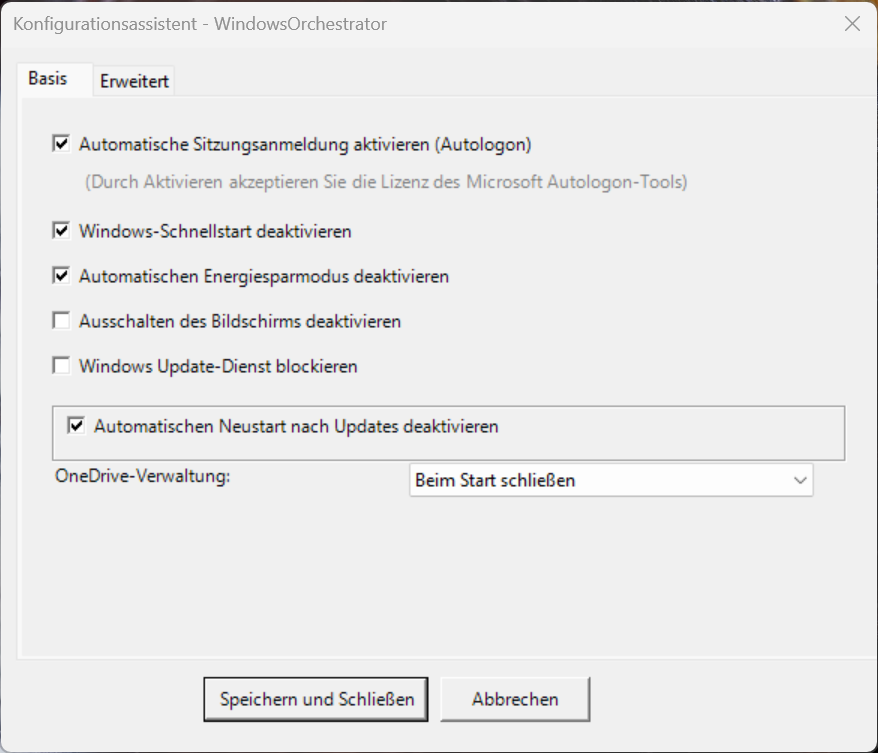
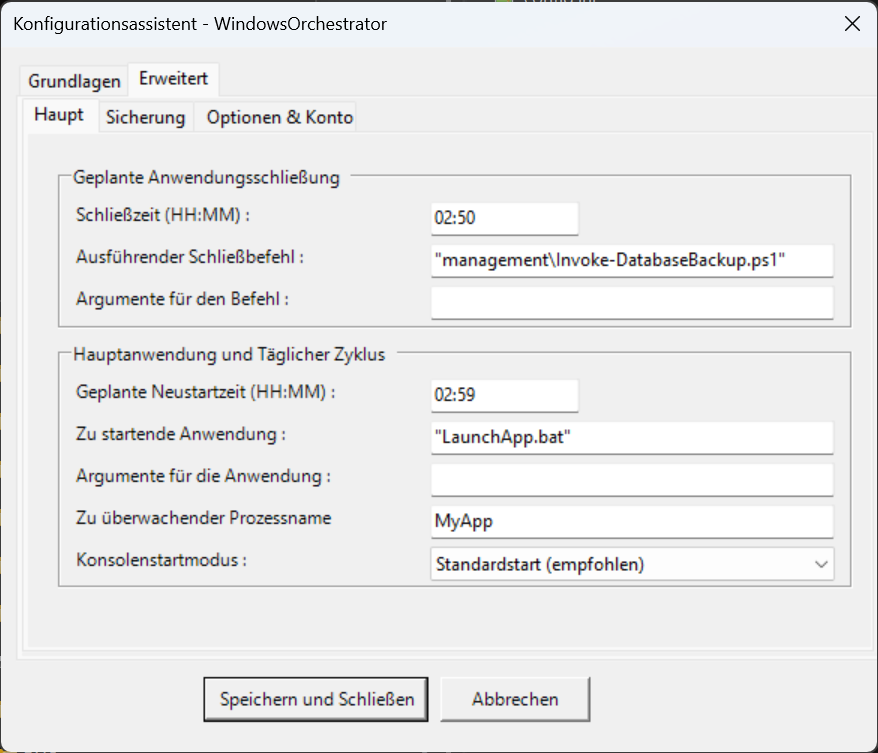
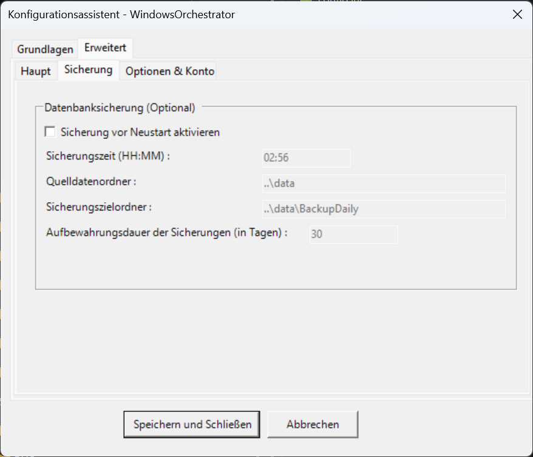
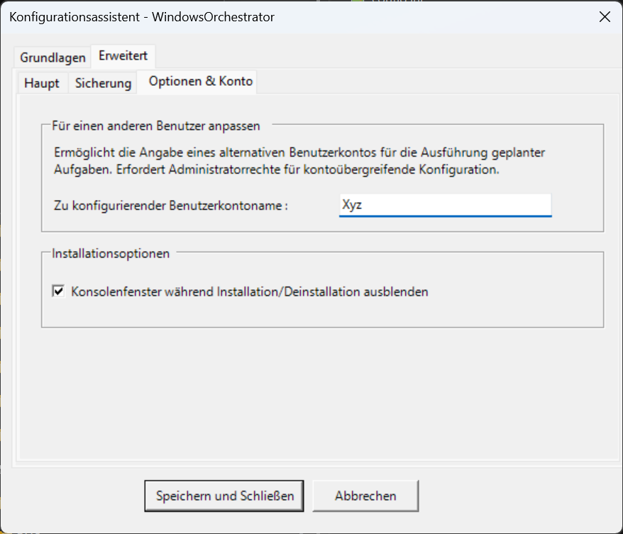

# BENUTZERHANDBUCH - WindowsOrchestrator 1.73

📘 **[ENTWICKLERHANDBUCH](ENTWICKLER_LEITFADEN.md)**
*Zielgruppe: Systemadministratoren.*

🏠 **[Zurück zur Startseite](README.md)**
*Zurück zum Portal der französischen Dokumentation.*

## Inhaltsverzeichnis

1. [Einführung und Projektübersicht](#1-einführung-und-projektübersicht)
    1.1. [Was ist WindowsOrchestrator?](#11-was-ist-windowsorchestrator-)
    1.2. [Technische Natur: Ein Orchestrierungstool, keine klassische Installation](#12-technische-natur-ein-orchestrierungstool-keine-klassische-installation)
    1.3. [Designphilosophie](#13-designphilosophie)
    1.4. [Lizenz und Garantie](#14-lizenz-und-garantie)
2. [Verständnis der Sicherheitsimplikationen](#2-verständnis-der-sicherheitsimplikationen)
    2.1. [Deaktivierung von Windows Update: Stabilität vs Sicherheit](#21-deaktivierung-von-windows-update-stabilität-vs-sicherheit)
        2.1.1. [Der Kompromiss erklärt](#211-der-kompromiss-erklärt)
        2.1.2. [Wann ist es akzeptabel?](#212-wann-ist-es-akzeptabel-)
    2.2. [Autologon: Sofortige Verfügbarkeit vs physische Sicherheit](#22-autologon-sofortige-verfügbarkeit-vs-physische-sicherheit)
        2.2.1. [Technischer Betrieb](#221-technischer-betrieb)
        2.2.2. [Reale Risiken](#222-reale-risiken)
        2.2.3. [Risikominderung](#223-risikominderung)
    2.3. [Andere Konfigurationsoptionen und ihre Implikationen](#23-andere-konfigurationsoptionen-und-ihre-implikationen)
        [Deaktivierung des Schnellstarts](#deaktivierung-des-schnellstarts)
        [Deaktivierung des Ruhezustands](#deaktivierung-des-ruhezustands)
        [Blockierung von OneDrive](#blockierung-von-onedrive)
3. [Integrierte Drittanbietertools](#3-integrierte-drittanbietertools)
    3.1. [Microsoft Sysinternals Autologon](#31-microsoft-sysinternals-autologon)
        3.1.1. [Rolle und Sicherheit](#311-rolle-und-sicherheit)
        3.1.2. [Dokumentation und Support](#312-dokumentation-und-support)
    3.2. [Gotify (Benachrichtigungen - Optional)](#32-gotify-benachrichtigungen---optional)
        3.2.1. [Präsentation und Nutzung](#321-präsentation-und-nutzung)
        3.2.2. [Erforderliche Konfiguration](#322-erforderliche-konfiguration)
        3.2.3. [Ressourcen](#323-ressourcen)
4. [Installation und Konfiguration](#4-installation-und-konfiguration)
    4.1. [Systemvoraussetzungen](#41-systemvoraussetzungen)
        4.1.1. [Betriebssystem](#411-betriebssystem)
        4.1.2. [Berechtigungen und Umgebung](#412-berechtigungen-und-umgebung)
    4.2. [Umgebungsvorbereitung](#42-umgebungsvorbereitung)
        4.2.1. [Download und Extraktion](#421-download-und-extraktion)
        4.2.2. [Integritätsüberprüfung](#422-integritätsüberprüfung)
    4.3. [Starten der Installation](#43-starten-der-installation)
        4.3.1. [Assistent starten](#431-assistent-starten)
    4.4. [Konfiguration über den grafischen Assistenten](#44-konfiguration-über-den-grafischen-assistenten)
        4.4.1. [Registerkarte "Basis" - Wesentliche Einstellungen](#441-registerkarte-basis---wesentliche-einstellungen)
            [Abschnitt: Automatische Sitzungsverwaltung](#abschnitt-automatische-sitzungsverwaltung)
            [Abschnitt: Windows-Einstellungen](#abschnitt-windows-einstellungen)
            [Abschnitt: OneDrive-Verwaltung](#abschnitt-onedrive-verwaltung)
        4.4.2. [Registerkarte "Erweitert" - Unterregisterkarte "Haupt"](#442-registerkarte-erweitert---unterregisterkarte-haupt)
            [GroupBox: Geplante Anwendungsbeendigung](#groupbox-geplante-anwendungsbeendigung)
            [GroupBox: Hauptanwendung und täglicher Zyklus](#groupbox-hauptanwendung-und-täglicher-zyklus)
        4.4.3. [Registerkarte "Erweitert" - Unterregisterkarte "Sicherung"](#443-registerkarte-erweitert---unterregisterkarte-sicherung)
            [GroupBox: Datenbanksicherung (Optional)](#groupbox-datenbanksicherung-optional)
        4.4.4. [Registerkarte "Erweitert" - Unterregisterkarte "Optionen & Konto"](#444-registerkarte-erweitert---unterregisterkarte-optionen--konto)
            [GroupBox: Für einen anderen Benutzer anpassen](#groupbox-für-einen-anderen-benutzer-anpassen)
            [GroupBox: Installationsoptionen](#groupbox-installationsoptionen)
    4.5. [Automatischer Installationsschritt](#45-automatischer-installationsschritt)
        4.5.1. [Validierung und Speicherung](#451-validierung-und-speicherung)
        4.5.2. [Autologon-Assistent (falls aktiviert)](#452-autologon-assistent-falls-aktiviert)
            [Automatischer Download (falls Tool fehlt)](#automatischer-download-falls-tool-fehlt)
            [Lizenzakzeptanz (EULA)](#lizenzakzeptanz-eula)
            [Kontokonfiguration](#kontokonfiguration)
        4.5.3. [Erstellen geplanter Aufgaben](#453-erstellen-geplanter-aufgaben)
        4.5.4. [Erstmalige Ausführung](#454-erstmalige-ausführung)
        4.5.5. [Beenden](#455-beenden)
    4.6. [Überprüfung nach der Installation](#46-überprüfung-nach-der-installation)
        4.6.1. [Visuelle Überprüfung](#461-visuelle-überprüfung)
        4.6.2. [Protokollüberprüfung](#462-protokollüberprüfung)
        4.6.3. [Neustarttest](#463-neustarttest)
5. [Tägliches Leben und Betriebszyklus](#5-tägliches-leben-und-betriebszyklus)
    5.1. [Der automatisierte tägliche Zyklus](#51-der-automatisierte-tägliche-zyklus)
        5.1.1. [Typische Tageschronologie](#511-typische-tageschronologie)
            [Phase 1: Normale Nutzung (00:00 → Beendigungszeit)](#phase-1-normale-nutzung-0000--beendigungszeit)
            [Phase 2: Anwendungsbeendigung (Beispiel: 02:50)](#phase-2-anwendungsbeendigung-beispiel-0250)
            [Phase 3: Datensicherung (Beispiel: 02:57)](#phase-3-datensicherung-beispiel-0257)
            [Phase 4: Geplanter Neustart (Beispiel: 02:59)](#phase-4-geplanter-neustart-beispiel-0259)
            [Phase 5: Kaltstart (00:00+)](#phase-5-kaltstart-0000)
            [Phase 6: Systemkonfiguration (00:01+)](#phase-6-systemkonfiguration-0001)
            [Phase 7: Sitzungseröffnung (00:01+)](#phase-7-sitzungseröffnung-0001)
            [Phase 8: Anwendungsstart (00:02+)](#phase-8-anwendungsstart-0002)
        5.1.2. [Verständnis der Ausführungskontexte](#512-verständnis-der-ausführungskontexte)
            [SYSTEM-Kontext](#system-kontext)
            [Benutzerkontext](#benutzerkontext)
    5.2. [Überwachung und Überprüfung](#52-überwachung-und-überprüfung)
        5.2.1. [Speicherort und Lesen der Protokolldateien](#521-speicherort-und-lesen-der-protokolldateien)
            [Zu konsultierende Dateien](#zu-konsultierende-dateien)
            [Automatische Archivierung](#automatische-archivierung)
            [Manuelles Protokolllesung](#manuelles-protokolllesung)
            [Erweiterte Lesung mit PowerShell](#erweiterte-lesung-mit-powershell)
        5.2.2. [Interpretation von Gotify-Benachrichtigungen](#522-interpretation-von-gotify-benachrichtigungen)
        5.2.3. [Überwachung des täglichen Zyklus](#523-überwachung-des-täglichen-zyklus)
        5.2.4. [Überprüfung des Systemstatus](#524-überprüfung-des-systemstatus)
6. [Wartung und Änderung](#6-wartung-und-änderung)
    6.1. [Ändern von Einstellungen nach der Installation](#61-ändern-von-einstellungen-nach-der-installation)
        6.1.1. [Methode A: Manuelle Bearbeitung von config.ini (Erweitert)](#611-methode-a-manuelle-bearbeitung-von-configini-erweitert)
            [Berücksichtigung der Änderungen](#berücksichtigung-der-änderungen)
        6.1.2. [Methode B: Wiederverwendung der grafischen Oberfläche (Empfohlen)](#612-methode-b-wiederverwendung-der-grafischen-oberfläche-empfohlen)
    6.2. [Hinzufügen oder Entfernen geplanter Aufgaben](#62-hinzufügen-oder-entfernen-geplanter-aufgaben)
        6.2.1. [Hinzufügen einer benutzerdefinierten Aufgabe](#621-hinzufügen-einer-benutzerdefinierten-aufgabe)
        6.2.2. [Entfernen einer Aufgabe](#622-entfernen-einer-aufgabe)
    6.3. [Aktualisierung von WindowsOrchestrator](#63-aktualisierung-von-windowsorchestrator)
7. [Deinstallationsverfahren](#7-deinstallationsverfahren)
    7.1. [Methode A: Saubere Deinstallation (Empfohlen)](#71-methode-a-saubere-deinstallation-empfohlen)
        7.1.1. [Ausführung des Skripts Uninstall.bat](#711-ausführung-des-skripts-uninstallbat)
        7.1.2. [Wiederherstellungsumfang](#712-wiederherstellungsumfang)
            [Geplante Aufgaben](#geplante-aufgaben)
            [Windows Update](#windows-update)
            [OneDrive](#onedrive)
            [Schnellstart](#schnellstart)
        7.1.3. [Verwaltung der Autologon-Bereinigung](#713-verwaltung-der-autologon-bereinigung)
    7.2. [Methode B: Manueller Notstopp](#72-methode-b-manueller-notstopp)
        7.2.1. [Verfahren über den Aufgabenplaner](#721-verfahren-über-den-aufgabenplaner)
        7.2.2. [Warnung vor persistenten Registrierungsänderungen](#722-warnung-vor-persistenten-registrierungsänderungen)
        7.2.3. [Manuelle Parameterwiederherstellung (Erweitert)](#723-manuelle-parameterwiederherstellung-erweitert)
            [Reaktivierung von Windows Update](#reaktivierung-von-windows-update)
            [Reaktivierung des Schnellstarts](#reaktivierung-des-schnellstarts)
            [Reaktivierung von OneDrive](#reaktivierung-von-onedrive)
            [Deaktivierung von Autologon (über Registrierung)](#deaktivierung-von-autologon-über-registrierung)
8. [Fehlerbehebung und FAQ](#8-fehlerbehebung-und-faq)
    8.1. [Anwendung startet nicht beim Boot](#81-anwendung-startet-nicht-beim-boot)
        [Diagnose](#diagnose)
        [Mögliche Ursachen](#mögliche-ursachen)
        [Lösung](#lösung)
    8.2. [Geplanter Neustart funktioniert nicht](#82-geplanter-neustart-funktioniert-nicht)
        [Diagnose](#diagnose-1)
        [Mögliche Ursachen](#mögliche-ursachen-1)
        [Lösung](#lösung-1)
    8.3. [Sicherung schlägt mit "Unzureichende Berechtigungen" fehl](#83-sicherung-schlăgt-mit-unzureichende-berechtigungen-fehl)
        [Diagnose](#diagnose-2)
        [Mögliche Ursachen](#mögliche-ursachen-2)
        [Lösung](#lösung-2)
    8.4. [Autologon funktioniert nicht nach der Installation](#84-autologon-funktioniert-nicht-nach-der-installation)
        [Diagnose](#diagnose-3)
        [Mögliche Ursachen](#mögliche-ursachen-3)
        [Registrierungsüberprüfung](#registrierungsüberprüfung)
        [Lösung](#lösung-3)
    8.5. [Stiller Modus verbirgt keine Fenster](#85-stiller-modus-verbirgt-keine-fenster)
        [Diagnose](#diagnose-4)
        [Mögliche Ursachen](#mögliche-ursachen-4)
        [Lösung](#lösung-4)
    8.6. [Begrüßungsbildschirm bleibt unendlich hängen](#86-begrüßungsbildschirm-bleibt-unendlich-hängen)
        [Diagnose](#diagnose-5)
        [Mögliche Ursachen](#mögliche-ursachen-5)
        [Notlösung](#notlösung)
        [Dauerhafte Lösung](#dauerhafte-lösung)
9. [Anhänge](#9-anhänge)
    9.1. [Vollständige Struktur der config.ini-Datei](#91-vollständige-struktur-der-configini-datei)
    9.2. [Exit-Codes der Skripte](#92-exit-codes-der-skripte)
    9.3. [Speicherorte kritischer Dateien](#93-speicherorte-kritischer-dateien)
    9.4. [Support und Ressourcen](#94-support-und-ressourcen)

---

## 1. Einführung und Projektübersicht

### 1.1. Was ist WindowsOrchestrator?

WindowsOrchestrator ist eine Sammlung von PowerShell-Skripten, die entwickelt wurde, um die Verwaltung eines Windows-Arbeitsplatzes zu automatisieren. Es verwandelt eine Standardmaschine in ein autonomes System, das in der Lage ist:

- Eine Geschäftsanwendung ohne menschliches Eingreifen automatisch zu starten
- Täglich nach einem definierten Zeitplan neu zu starten
- Automatisch sensible Daten zu sichern
- Optimierte Systemeinstellungen für Stabilität zu warten

Das Projekt richtet sich hauptsächlich an professionelle Umgebungen: Interaktive Kioske, digitale Beschilderung, kontinuierliche Produktionsarbeitsplätze oder jedes System, das mit minimalem Wartungsaufwand kontinuierlich funktionieren muss.

### 1.2. Technische Natur: Ein Orchestrierungstool, keine klassische Installation

WindowsOrchestrator installiert sich nicht wie eine traditionelle Software. Es kopiert keine Dateien in `C:\Program Files` oder `C:\Windows`, und es erscheint nicht in der Liste der installierten Anwendungen des Systems.

Die Skripte bleiben im Ordner, den Sie heruntergeladen haben. Die Installation konfiguriert den Windows-Aufgabenplaner, um diese Skripte zu den entsprechenden Zeiten auszuführen. Die geplanten Aufgaben verweisen direkt auf die Dateien in Ihrem Ordner.

Der Projektordner darf nach der Installation niemals verschoben oder gelöscht werden. Wenn Sie ihn verschieben müssen, müssen Sie zuerst deinstallieren, den Ordner verschieben und dann vom neuen Speicherort aus neu installieren.

### 1.3. Designphilosophie

WindowsOrchestrator basiert auf drei grundlegenden Prinzipien.

Keine versteckte Manipulation des Systems. Jede Aktion ist in den Protokollen dokumentiert und nachvollziehbar. Der Quellcode ist offen und auditierbar.

Das Tool wendet nur das an, was Sie explizit konfigurieren. Keine automatischen Entscheidungen über kritische Einstellungen. Deinstallation ist jederzeit möglich.

Einige Optionen reduzieren die Sicherheit nach Design. Das Tool ersetzt keine professionelle Sicherungsstrategie. Der Administrator bleibt für Sicherheit und Nachhaltigkeit der Daten verantwortlich.

### 1.4. Lizenz und Garantie

Diese Software wird unter der GNU General Public License v3.0 (GPLv3) vertrieben. Sie sind frei, sie zu verwenden, zu modifizieren und zu vertreiben gemäß den Bedingungen dieser Lizenz. Der Quellcode ist zugänglich und modifizierbar.

Die Software wird wie besehen bereitgestellt, ohne jegliche Garantie irgendeiner Art. Die Autoren können nicht für direkte oder indirekte Schäden haftbar gemacht werden, die aus ihrer Verwendung resultieren, einschließlich Datenverlust, Serviceunterbrechung oder Kompatibilitätsprobleme.

Sie müssen die Software in einer nicht-kritischen Umgebung testen, bevor Sie sie bereitstellen, externe Sicherungen unabhängig vom System warten und die Kompatibilität mit Ihren Geschäftsanwendungen überprüfen.

---

## 2. Verständnis der Sicherheitsimplikationen

WindowsOrchestrator bietet leistungsstarke Funktionen, die die Deaktivierung bestimmter Windows-Sicherheitsmechanismen erfordern. Dieser Abschnitt erklärt die Risiken und bewährten Praktiken.

### 2.1. Deaktivierung von Windows Update: Stabilität vs Sicherheit

#### 2.1.1. Der Kompromiss erklärt

Die Deaktivierung von Updates garantiert Stabilität: Die Softwareumgebung bleibt eingefroren und vorhersehbar. Sie vermeidet unerwartete Neustarts, die den Service unterbrechen, und verhindert Verhaltensänderungen von Windows zwischen Versionen.

Die eingegangenen Risiken sind real: Sicherheitslücken werden nicht behoben, die Maschine wird anfällig für automatisierte Angriffe, und dies kann zu einer Nichtkonformität mit bestimmten Unternehmens-IT-Richtlinien führen.

#### 2.1.2. Wann ist es akzeptabel?

Die Deaktivierung von Windows Update ist nur akzeptabel, wenn alle diese Bedingungen erfüllt sind.

Die Maschine ist nicht direkt dem Internet ausgesetzt. Sie muss hinter einer professionellen Firewall stehen, auf einem separaten VLAN vom Hauptnetzwerk, ohne Webbrowsing oder E-Mail.

Der Stabilitätsbedarf ist kritisch: Der geringste Neustart verursacht einen Schaden. Dies betrifft permanente Anzeigen am Flughafen oder Bahnhof, industrielle Produktionslinien oder kontinuierliche Überwachungssysteme.

Sie haben ein Verfahren, um Updates manuell anzuwenden: Monatliches Wartungsfenster, temporäre Reaktivierung von Windows Update, Testen von Updates auf einem ähnlichen Posten.

Wenn diese Bedingungen nicht erfüllt sind, lassen Sie Windows Update aktiviert und passen Sie einfach die Neustartrichtlinie über `DisableAutoReboot=true` an.

### 2.2. Autologon: Sofortige Verfügbarkeit vs physische Sicherheit

#### 2.2.1. Technischer Betrieb

Wenn Autologon aktiviert ist, startet Windows direkt auf den Desktop ohne Anmeldebildschirm. Das Passwort wird auf verschlüsselte Weise in der LSA (Local Security Authority) gespeichert. Das offizielle Microsoft Sysinternals Autologon-Tool wird dafür verwendet.

#### 2.2.2. Reale Risiken

Das Passwort bleibt verschlüsselt und nicht sichtbar in der Registrierung. Authentifizierter Netzwerkzugriff ist erhalten. BitLocker-Verschlüsselung (falls aktiviert) schützt Daten im Ruhezustand.

Dennoch kann jeder mit physischem Zugriff die offene Sitzung verwenden. Benutzerdateien und Dokumente sind zugänglich. Offene Anwendungen können manipuliert werden. Ein einfacher Neustart reicht aus, um auf das System zuzugreifen.

#### 2.2.3. Risikominderung

Erstellen Sie ein spezifisches Benutzerkonto für Autologon, ohne lokale Administratorrechte, mit Zugriff begrenzt auf nur die notwendigen Ordner für die Anwendung, und ohne Zugriff auf sensible Netzwerkfreigaben.

Sichern Sie die Maschine physisch: Verschlossenes Gehäuse, eingeschränkter Zugangsbereich, Deaktivierung des USB-Ports im BIOS, um bootfähige USB-Sticks zu verhindern.

Aktivieren Sie BitLocker, um die Festplatte zu verschlüsseln und Daten bei Diebstahl der Maschine zu schützen. Beachten Sie, dass BitLocker nicht schützt, sobald das System gestartet ist.

Autologon ist geeignet für Anzeigekioske in öffentlichen Bereichen mit schreibgeschütztem Konto, Produktionsarbeitsplätze in sicheren Fabriken oder eingebettete Systeme ohne physische Schnittstelle. Es ist für Administratorarbeitsplätze mit erhöhten Berechtigungen, Maschinen, die sensible unverschlüsselte Daten speichern, oder Umgebungen, die der Öffentlichkeit ohne Überwachung zugänglich sind, nicht empfohlen.

### 2.3. Andere Konfigurationsoptionen und ihre Implikationen

#### Deaktivierung des Schnellstarts

Die Deaktivierung des Schnellstarts erzwingt einen vollständigen Neustart ohne teilweise Hibernation. Sie lädt Treiber und Dienste vollständig neu. Die Startzeit ist leicht länger. Sie vermeidet Phantom-Speicherprobleme nach mehreren Wochen ohne vollständigen Neustart.

#### Deaktivierung des Ruhezustands

Bei einem Laptop führt die Deaktivierung des Ruhezustands zu einer vollständigen Batterieentladung, wenn vergessen, kontinuierlicher Maschinenheizung und vorzeitiger Verschleiß von Komponenten. Diese Option ist für feste Produktionsarbeitsplätze in kontinuierlicher Operation reserviert.

#### Blockierung von OneDrive

Die Blockierung von OneDrive hat minimale Auswirkungen, da OneDrive in der Regel nicht kritisch für den Betrieb ist. Der Vorteil ist die Einsparung von Systemressourcen und die Vermeidung unerwarteter Synchronisationen.

---

## 3. Integrierte Drittanbietertools

### 3.1. Microsoft Sysinternals Autologon

#### 3.1.1. Rolle und Sicherheit

WindowsOrchestrator verwaltet niemals direkt Passwörter. Diese kritische Verantwortung wird an das offizielle Microsoft Autologon-Tool delegiert.

Kein Passwort wird jemals in `config.ini` oder PowerShell-Skripten geschrieben. Das Passwort wird über die LSA-API von Windows verschlüsselt, unter Verwendung derselben Methode wie Windows-Dienste. Die Verschlüsselung ist maschinengebunden und nicht exportierbar.

Der Installationsprozess lädt das Tool automatisch von `live.sysinternals.com` (offizielle Microsoft-URL) herunter, verifiziert seine Integrität, indem es die Anwesenheit von `Eula.txt` und der ausführbaren Datei bestätigt, fordert die Benutzerakzeptanz der Lizenz, ermöglicht die interaktive Eingabe von Anmeldedaten in der Autologon-Oberfläche, dann führt die automatische Verschlüsselung durch.

#### 3.1.2. Dokumentation und Support

Offizielle Seite: <https://learn.microsoft.com/sysinternals/downloads/autologon>

Herausgeber: Microsoft Corporation

Lizenz: Proprietär Microsoft (kostenlos)

Unterstützung: Windows 7 bis Windows 11

Bei Downloadfehlern laden Sie manuell `Autologon.zip` von der Microsoft-Seite herunter, extrahieren Sie alle Dateien in `management/tools/Autologon/`, dann starten Sie die Installation neu.

### 3.2. Gotify (Benachrichtigungen - Optional)

#### 3.2.1. Präsentation und Nutzung

Gotify ist ein selbst gehosteter Push-Benachrichtigungsserver, der die Fernüberwachung des Maschinenstatus ermöglicht.

Typische Anwendungsfälle betreffen Maschinen, die in einem Serverraum ohne Bildschirm installiert sind, die Überwachung mehrerer Kioske von einem zentralen Dashboard aus oder Smartphone-Benachrichtigungen über die Gotify-App.

Die Skripte senden HTTP-Nachrichten an Ihren Gotify-Server. Sie erhalten Echtzeitbenachrichtigungen: Erfolgreicher Start, Anwendung gestartet, kritischer Fehler. Detaillierte Protokolle bleiben in lokalen Dateien.

#### 3.2.2. Erforderliche Konfiguration

Um Gotify zu verwenden, müssen Sie Ihre eigene Gotify-Instanz hosten (Linux-Server, Docker usw.), eine Anwendung in der Gotify-Oberfläche erstellen, das Authentifizierungstoken abrufen, dann den Abschnitt `[Gotify]` in `config.ini` ausfüllen.

Keine Daten werden an Drittanbieterserver gesendet. Sie kontrollieren die Benachrichtigungsinfrastruktur vollständig. Das System ist deaktivierbar, indem der Abschnitt einfach leer gelassen wird.

#### 3.2.3. Ressourcen

Offizielle Seite: <https://gotify.net/>

Quellcode: <https://github.com/gotify/server>

Lizenz: MIT (Open Source)

---

## 4. Installation und Konfiguration

### 4.1. Systemvoraussetzungen

#### 4.1.1. Betriebssystem

WindowsOrchestrator ist kompatibel mit Windows 10 (Version 1809 oder später empfohlen), Windows 11 (alle Versionen), Windows Server 2016, 2019, 2022 (inoffizielle Unterstützung nicht getestet).

Professionelle und Enterprise-Editionen sind vollständig unterstützt. Die Home-Edition ist funktional, aber einige GPOs können eingeschränkt sein.

#### 4.1.2. Berechtigungen und Umgebung

Das für die Installation verwendete Konto muss lokale Administratorberechtigungen haben. Diese Rechte sind notwendig, um HKLM-Registrierung zu modifizieren, geplante Aufgaben zu erstellen und Dienste zu verwalten.

PowerShell-Version 5.1 minimum ist erforderlich (standardmäßig in Windows 10+ enthalten). Die Ausführungsrichtlinie wird automatisch von Skripten über `-ExecutionPolicy Bypass` verwaltet.

Eine Internetverbindung ist optional. Sie ist nur notwendig, wenn `UseAutologonAssistant=true` und Autologon.exe fehlt. Das System kann offline funktionieren, wenn das Tool bereits vorhanden ist.

### 4.2. Umgebungsvorbereitung

#### 4.2.1. Download und Extraktion

Laden Sie das Projektarchiv von GitHub herunter. Extrahieren Sie den Inhalt in einen permanenten Ordner, zum Beispiel `C:\WindowsOrchestrator\` oder `D:\Automation\WO\`. Installieren Sie nicht in `C:\Program Files\` aufgrund von Berechtigungsausgaben. Vermeiden Sie Desktop oder Downloads-Ordner, die gereinigt werden könnten.

#### 4.2.2. Integritätsüberprüfung

Erwartete Projektstruktur:

```
WindowsOrchestrator/
├── Install.bat
├── Uninstall.bat
├── config.ini (wird während der Installation erstellt)
├── management/
│   ├── firstconfig.ps1
│   ├── install.ps1
│   ├── uninstall.ps1
│   ├── config_systeme.ps1
│   ├── config_utilisateur.ps1
│   ├── Invoke-DatabaseBackup.ps1
│   ├── Launch-Install.ps1
│   ├── Launch-Uninstall.ps1
│   ├── modules/
│   │   └── WindowsOrchestratorUtils/
│   └── defaults/
│       └── default_config.ini
└── i18n/
    ├── en-US/
    └── fr-FR/
```

### 4.3. Starten der Installation

#### 4.3.1. Assistent starten

Suchen Sie die Datei `Install.bat` im Projektstamm. Doppelklicken Sie auf `Install.bat`. Ein Konsolenfenster öffnet sich und der grafische Konfigurationsassistent `firstconfig.ps1` erscheint.

Konfigurieren Sie die gewünschten Einstellungen über die grafische Oberfläche. Sobald die Konfiguration durch Klicken auf "Speichern und Schließen" validiert ist, erscheint die Benutzerkontensteuerung (UAC). Klicken Sie auf "Ja", um die Ausführung mit Administratorberechtigungen zu autorisieren.

### 4.4. Konfiguration über den grafischen Assistenten

Der `firstconfig.ps1`-Assistent ermöglicht die intuitive Generierung der `config.ini`-Datei. Der Assistent ist nun in **4 Unterregisterkarten** organisiert (Hauptmenü, Sicherung, Optionen & Konto, Installationsoptionen) für optimale Klarheit.

#### 4.4.1. Registerkarte "Basis" - Wesentliche Einstellungen



##### Abschnitt: Automatische Sitzungsverwaltung

Das Kontrollkästchen "Automatische Sitzungseröffnung aktivieren (Autologon)" löst Autologon aus, wenn es aktiviert ist. Wenn es deaktiviert ist, bleibt die klassische manuelle Sitzung mit Anmeldebildschirm erhalten.

Eine Notiz gibt an, dass Sie durch Aktivieren die Lizenz des Microsoft Autologon-Tools akzeptieren.

##### Abschnitt: Windows-Einstellungen

"Schnellstart von Windows deaktivieren" ist empfohlen. Diese Option erzwingt einen vollständigen täglichen Neustart durch Deaktivierung der teilweisen Hibernation von Windows.

"Automatischen Ruhezustand deaktivieren" verhindert, dass das System in den Ruhezustand geht (S3/S4). Vorsicht: Bei einem Laptop entlädt diese Option die Batterie.

"Bildschirm-Ruhezustand deaktivieren" hält den Bildschirm dauerhaft eingeschaltet. Nützlich für digitale Beschilderung oder permanente Dashboards.

"Windows Update-Dienst blockieren" deaktiviert vollständig automatische Updates. Lesen Sie Abschnitt 2.1 erneut, bevor Sie diese Option aktivieren. Wenn Sie sie aktivieren, wird eine Unteroption "Automatischen Neustart nach Update deaktivieren" verfügbar.

##### Abschnitt: OneDrive-Verwaltung

Ein Dropdown-Menü bietet drei Auswahlmöglichkeiten.

"Blockieren (Systemrichtlinie)" verbietet die Ausführung von OneDrive über GPO. Diese Option ist für Kioske und Terminals empfohlen.

"Beim Start schließen" tötet den OneDrive.exe-Prozess beim Boot. OneDrive kann später manuell neu gestartet werden.

"Nichts tun" lässt OneDrive normal funktionieren.

#### Vorkonfigurationsanzeige (Eingefrorene Konfiguration)

Wenn die `ShowContextMessages`-Option aktiv ist, erscheint ein blauer Banner oben im Fenster. Er signalisiert einfach, dass die Konfiguration intern bereits festgelegt wurde, um schlechte Einstellungen zu vermeiden. Die Optimierungsnachricht (blauer Banner) passt sich dynamisch an den Namen der Anwendung an.


#### 4.4.2. Registerkarte "Erweitert" - Unterregisterkarte "Haupt"



##### GroupBox: Geplante Anwendungsbeendigung

"Beendigungszeit (HH:MM)" definiert den Zeitpunkt, zu dem die Anwendung den Beendigungsauftrag erhält (ALT+F4). Diese Zeit muss vor der Neustartzeit liegen. Beispiel: `02:50`.

"Befehl vor Beendigung ausführen" ermöglicht die Angabe eines Skripts oder einer ausführbaren Datei, die vor dem Neustart ausgeführt wird. Leer lassen, wenn keine vorherige Aktion erforderlich ist. Beispiel: `management\Invoke-DatabaseBackup.ps1`.

"Argumente für den Befehl" ist standardmäßig leer.

##### GroupBox: Hauptanwendung und täglicher Zyklus

"Geplante Neustartzeit (HH:MM)" definiert den Zeitpunkt, zu dem das System automatisch neu startet. Leer lassen, um geplanten Neustart zu deaktivieren. Beispiel: `02:59`.

"Zu startende Anwendung" gibt den Pfad zur Startdatei Ihrer Anwendung an. Akzeptierte Formate sind `.exe`, `.bat`, `.cmd`, `.ps1`. Relative Pfade werden vom Projektstamm aus berechnet. Absolute Pfade sind ebenfalls akzeptiert, zum Beispiel `C:\MyApp\start.exe`. Beispiel: `LaunchApp.bat`.

"Argumente für die Anwendung" ermöglicht die Übergabe von Befehlszeilenparametern. Standardmäßig leer.

"Zu überwachender Prozessname (ohne .exe)" ist der genaue Name des endgültigen zu überwachenden Prozesses. Dieser Parameter ist entscheidend, da er die Überprüfung ermöglicht, ob die Anwendung läuft. Leer lassen, wenn ein Wrapper (.bat) ohne Überwachung verwendet wird. Beispiel: `MyApp`.

"Konsolenstartmodus" bietet zwei Optionen. "Standardstart (empfohlen)" verwendet das Standardterminal (Windows Terminal, falls verfügbar). "Legacy-Start (Legacy-Konsole)" erzwingt cmd.exe mit neuem Fenster für Kompatibilität mit älteren Skripten.

Das Kontrollkästchen "Hauptanwendung minimiert in der Taskleiste starten" startet die Anwendung minimiert, wenn aktiviert. Diese Option ist im Legacy-Modus nicht anwendbar.

#### 4.4.3. Registerkarte "Erweitert" - Unterregisterkarte "Sicherung"



##### GroupBox: Datenbanksicherung (Optional)

Das Kontrollkästchen "Sicherung vor Neustart aktivieren" aktiviert das automatische Kopiermodul.

Die folgenden Felder sind ausgegraut, solange das Kontrollkästchen nicht aktiviert ist.

"Sicherungszeit (HH:MM)" muss 5-10 Minuten nach der Beendigungszeit konfiguriert werden, um der Anwendung Zeit für ihre Schreibvorgänge zu geben. Beispiel: `02:57`.

"Quelldatenordner" gibt den relativen oder absoluten Pfad zum zu sichernden Ordner an. Beispiel: `..\data`.

"Zieldatenordner der Sicherung" definiert den Pfad, in dem die Kopien gespeichert werden. Beispiel: `..\data\BackupDaily`.

"Aufbewahrungsdauer der Sicherungen (in Tagen)" gibt an, wie viele Tage Sicherungen aufbewahrt werden. Ältere Sicherungen werden automatisch gelöscht. Beispiel: `10`.

#### 4.4.4. Registerkarte "Erweitert" - Unterregisterkarte "Optionen & Konto"



##### GroupBox: Für einen anderen Benutzer anpassen

"Benutzerkontoname zu konfigurieren" ermöglicht die Angabe eines anderen Kontos als das, das die Installation startet. Standardmäßig ist es der Benutzer, der die Installation ausführt. Diese Option ermöglicht die Konfiguration von Autologon für ein anderes Konto. Beispiel: `AdminLocal`.

##### GroupBox: Installationsoptionen

Das Kontrollkästchen "Konsolenfenster während Installation/Deinstallation ausblenden" aktiviert den stillen Modus. Wenn aktiviert, erscheint ein Splash-Screen anstelle von PowerShell-Konsolen, und eine finale MessageBox gibt das Ergebnis der Operation an.

### 4.5. Automatischer Installationsschritt

#### 4.5.1. Validierung und Speicherung

Sobald Sie auf "Speichern und Schließen" klicken, generiert der Assistent die `config.ini`-Datei im Projektstamm. Ein Dialog bestätigt die Speicherung: "Konfiguration in 'C:\WindowsOrchestrator\config.ini' gespeichert". Der Assistent schließt sich automatisch und das `install.ps1`-Installationsskript startet.

#### 4.5.2. Autologon-Assistent (falls aktiviert)

Wenn Sie "Automatische Sitzungseröffnung aktivieren" im Assistenten aktiviert haben, wird der folgende Prozess ausgelöst.

##### Automatischer Download (falls Tool fehlt)

Ein Splash-Screen gibt "Microsoft Autologon-Tool herunterladen..." an. Das Tool wird in `management/tools/Autologon/` extrahiert.

##### Lizenzakzeptanz (EULA)

Der Editor öffnet das Sysinternals-Lizenzabkommen anzeigend. Lesen Sie das Dokument und schließen Sie das Fenster. Ein Dialog fragt "Akzeptieren Sie die Bedingungen der Sysinternals Autologon-Tool-Lizenz?". Klicken Sie auf "Ja", um fortzufahren, oder "Nein", um abzubrechen.

##### Kontokonfiguration

Das Autologon.exe-Fenster öffnet sich. Die auszufüllenden Felder sind folgende.

"Username" enthält den Kontonamen, normalerweise vorab ausgefüllt mit dem Namen des konfigurierten Benutzers.

"Domain" enthält den Maschinen- oder Domänennamen. Verwenden Sie `.` für ein lokales Konto.

"Password" erfordert die Eingabe des Kontopassworts. Dieses Passwort wird automatisch verschlüsselt.

Klicken Sie auf die Schaltfläche "Enable". Eine Nachricht bestätigt, dass das Passwort verschlüsselt und gespeichert ist. Schließen Sie das Fenster. Der Splash-Screen erscheint erneut für die Installationsfortsetzung.

#### 4.5.3. Erstellen geplanter Aufgaben

Das Skript erstellt automatisch die folgenden Aufgaben im Windows-Aufgabenplaner.

`WindowsOrchestrator-SystemStartup` führt beim Systemstart im SYSTEM-Kontext aus.

`WindowsOrchestrator-UserLogon` führt bei Benutzeranmeldung im Kontext des konfigurierten Benutzers aus.

Dynamische Aufgaben werden erstellt, wenn konfiguriert: `WindowsOrchestrator-SystemBackup`, `WindowsOrchestrator-SystemScheduledReboot`, `WindowsOrchestrator-System-CloseApp`, `WindowsOrchestrator-User-CloseApp`.

Überprüfen Sie ihre Präsenz, indem Sie den Aufgabenplaner öffnen (`Win+R` dann `taskschd.msc`). Die Aufgaben sollten sich im Bibliothekswurzel befinden.

#### 4.5.4. Erstmalige Ausführung

Das Skript startet sofort `config_systeme.ps1`, um die Systemkonfiguration anzuwenden. Es startet dann die Aufgabe `WindowsOrchestrator-UserLogon`, um die Anwendung zu starten.

Im stillen Modus gibt eine finale MessageBox an "WindowsOrchestrator-Installation erfolgreich abgeschlossen! Alle Protokolle wurden im Logs-Ordner gespeichert."

#### 4.5.5. Beenden

Das Beendigungsverhalten hängt von der Konfiguration in `config.ini` ab.

Wenn `RebootOnCompletion=true`, startet das System nach 15 Sekunden neu (konfigurierbar über `RebootGracePeriod`).

Wenn `PowerShellExitMode=automatic`, schließt sich die Konsole nach 15 Sekunden (konfigurierbar über `PowerShellExitDelay`).

Wenn `PowerShellExitMode=manual`, müssen Sie Enter drücken, um die Konsole zu schließen.

### 4.6. Überprüfung nach der Installation

#### 4.6.1. Visuelle Überprüfung

Öffnen Sie den Aufgabenplaner (`Win+R` dann `taskschd.msc`). Überprüfen Sie die Präsenz von `WindowsOrchestrator-SystemStartup` und `WindowsOrchestrator-UserLogon`. Rechtsklicken Sie auf jede Aufgabe, wählen Sie "Eigenschaften", dann die Registerkarte "Trigger", um die Bedingungen zu überprüfen.

#### 4.6.2. Protokollüberprüfung

Greifen Sie auf den Ordner `C:\WindowsOrchestrator\Logs\` zu. Öffnen Sie `config_systeme_ps.txt` und `config_utilisateur_ps.txt`. Überprüfen Sie das Fehlen von Zeilen, die `[ERROR]` enthalten.

#### 4.6.3. Neustarttest

Starten Sie den PC manuell neu. Beobachten Sie, ob die Sitzung automatisch öffnet (wenn Autologon aktiviert ist). Überprüfen Sie, ob die Zielanwendung korrekt startet.

---

## 5. Tägliches Leben und Betriebszyklus

Sobald WindowsOrchestrator installiert ist, tritt die Maschine in einen autonomen Betriebszyklus ein. Sie müssen nicht mehr physisch auf den Arbeitsplatz eingreifen, um ihn zu starten oder die Anwendung zu starten.

### 5.1. Der automatisierte tägliche Zyklus

#### 5.1.1. Typische Tageschronologie

##### Domino-Effekt: Logische Verkettung der Aufgaben

Im Gegensatz zu parallelen Aufgaben verwendet WindowsOrchestrator v1.73 einen sequentiellen "Domino-Effekt"-Fluss, bei dem Zeiten automatisch berechnet werden können, wenn sie nicht explizit definiert sind.

Wenn die Sicherungszeit oder die Neustartzeit nicht explizit definiert ist, verkettet das System sie intelligent nach der Beendigung:
- Anwendungsbeendigung (Beispiel: 02:50)
- Datensicherung (berechnet: Beendigung + 5 Minuten)
- Geplanter Neustart (berechnet: Sicherung + 2 Minuten)

Dies gewährleistet eine logische Verkettung ohne Überlappung, wodurch Datenkorruptionsrisiken eliminiert werden.

##### Phase 1: Normale Nutzung (00:00 → Beendigungszeit)

Das System funktioniert normal. Die Geschäftsanwendung ist aktiv. Kein Eingriff des Orchestrators.

##### Phase 2: Anwendungsbeendigung (Beispiel: 02:50)

Die Aufgabe `WindowsOrchestrator-User-CloseApp` führt aus, wenn konfiguriert. Die Standardaktion besteht darin, das "MyApp"-Fenster zu suchen und ihm die Tastensequenz `{ESC}{ESC}x{ENTER}` (Escape x2, x, Enter) zu senden. Die maximale Wartezeit beträgt 60 Sekunden mit Versuchen alle 5 Sekunden. Das Ergebnis wird in `config_utilisateur_ps.txt` protokolliert.

##### Phase 3: Datensicherung (Beispiel: 02:57)

Die Aufgabe `WindowsOrchestrator-SystemBackup` führt aus, wenn aktiviert. Die Aktion besteht darin, Dateien, die in den letzten 24 Stunden modifiziert wurden, in den Zielordner zu kopieren.
**Wichtiger Hinweis:** Um die Datenbankintegrität zu gewährleisten (z.B. SQLite), wird das Skript gezwungen, auch alle Dateien mit demselben Namen zu sichern (z.B. `.db-wal`, `.db-shm`), auch wenn sie nicht kürzlich modifiziert wurden. Das Ergebnis wird in `Invoke-DatabaseBackup_log.txt` protokolliert.

##### Phase 4: Geplanter Neustart (Beispiel: 02:59)

Die Aufgabe `WindowsOrchestrator-SystemScheduledReboot` führt aus. Die Aktion startet `shutdown.exe /r /t 0`. Das System startet sofort neu.

##### Phase 5: Kaltstart (00:00+)

Schnellstart ist deaktiviert, daher ist die Windows-Kernladung vollständig. Kein Hibernation-Zustand wird beibehalten.

##### Phase 6: Systemkonfiguration (00:01+)

Die Aufgabe `WindowsOrchestrator-SystemStartup` führt beim Start mit dem Trigger "At Startup" aus. Die durchgeführten Aktionen sind Richtlinienüberprüfung und Anwendung (Windows Update, OneDrive usw.), Stromverwaltung über powercfg, und Neuerstellung dynamischer Aufgaben, falls notwendig. Das Ergebnis wird in `config_systeme_ps.txt` protokolliert.

##### Phase 7: Sitzungseröffnung (00:01+)

Wenn Autologon aktiviert ist, öffnet sich die Sitzung automatisch. Wenn Autologon deaktiviert ist, erscheint der klassische Anmeldebildschirm.

##### Phase 8: Anwendungsstart (00:02+)

Die Aufgabe `WindowsOrchestrator-UserLogon` führt mit dem Trigger "At Logon" aus. Die Aktionen sind folgende: Überprüfung, ob der `ProcessToMonitor`-Prozess bereits läuft, Start über die konfigurierte Methode (direct/cmd/powershell/legacy), wenn der Prozess fehlt, keine Aktion, wenn der Prozess vorhanden ist (nur ein Info-Log wird generiert). Das System führt keine kontinuierliche Überwachung durch (kein Watchdog). Das Ergebnis wird in `config_utilisateur_ps.txt` protokolliert.

#### 5.1.2. Verständnis der Ausführungskontexte

##### SYSTEM-Kontext

Das Skript `config_systeme.ps1` führt beim Windows-Start aus, bevor die Sitzungseröffnung. Es läuft mit SYSTEM-Berechtigungen (äquivalent zu root unter Linux). Es kann HKLM-Registrierung modifizieren, Windows-Dienste verwalten und Gruppenrichtlinien anwenden. Es hat keinen Zugriff auf das Benutzerprofil und kann keine grafischen Anwendungen starten.

##### Benutzerkontext

Das Skript `config_utilisateur.ps1` führt bei der Sitzungseröffnung des konfigurierten Benutzers aus. Es läuft mit den Rechten dieses Benutzers. Es kann grafische Anwendungen starten und auf Dateien im Benutzerprofil zugreifen. Es kann keine System-HKLM-Einstellungen ohne erhöhte Rechte modifizieren.

### 5.2. Überwachung und Überprüfung

#### 5.2.1. Watchdog-Überwachung

Das System umfasst nun eine aktive Watchdog-Überwachung, die überprüft, ob die Anwendung vor dem Start der Sicherung geschlossen ist. Der Watchdog verwendet eine While-Schleife mit einem konfigurierbaren Timeout (`MonitorTimeout`, Standard 300 Sekunden), um auf das Verschwinden des Prozesses aus dem Speicher zu warten. Wenn die Anwendung blockiert bleibt, kann das System den erzwungenen Stopp durchführen oder die Sicherung aus Sicherheitsgründen abbrechen, um Datenkorruptionen zu vermeiden.

#### 5.2.2. Speicherort und Lesen der Protokolldateien

Protokolle befinden sich im `Logs/`-Ordner im Projektstamm.

##### Zu konsultierende Dateien

`config_systeme_ps.txt` ermöglicht die Überprüfung, ob Updates korrekt blockiert sind oder ob der PC heute morgen gebootet hat.

`config_utilisateur_ps.txt` ermöglicht die Überprüfung, zu welcher Zeit die Anwendung gestartet oder neu gestartet wurde.

`Invoke-DatabaseBackup_log.txt` ermöglicht die Überprüfung der Liste der gesicherten Dateien und Bestätigung, dass kein Speicherplatzfehler aufgetreten ist.

##### Automatische Archivierung

Um eine Sättigung der Festplatte zu vermeiden, archiviert und löscht der Orchestrator automatisch alte Protokolle. Sie finden nummerierte Dateien (`config_systeme_ps.1.txt`, `config_systeme_ps.2.txt` usw.), die den vorherigen Tagen entsprechen. Die Anzahl der aufbewahrten Dateien ist über `MaxSystemLogsToKeep` und `MaxUserLogsToKeep` in `config.ini` konfigurierbar.

##### Manuelles Protokolllesung

Öffnen Sie Dateien mit Notepad++, VSCode oder Notepad. Suchen Sie nach `[ERROR]`, um Probleme zu identifizieren. Überprüfen Sie Zeitstempel, um die Ereignissequenz zu verstehen.

##### Erweiterte Lesung mit PowerShell

```powershell
# Nur Fehler der letzten 24 Stunden anzeigen
Get-Content "C:\WindowsOrchestrator\Logs\config_systeme_ps.txt" | Select-String "\[ERROR\]" | Select-Object -Last 50

# Nach Datum filtern
$today = Get-Date -Format "yyyy-MM-dd"
Get-Content "C:\WindowsOrchestrator\Logs\config_systeme_ps.txt" | Select-String "^$today"
```

#### 5.2.3. Interpretation von Gotify-Benachrichtigungen

Wenn Sie den Abschnitt `[Gotify]` in `config.ini` konfiguriert haben, müssen Sie die Protokolle nicht überprüfen. Ihr Überwachungsserver erhält Echtzeitnachrichten.

Eine INFO-Level-Nachricht (grün oder blau) gibt an, dass alles nominal ist: "Start abgeschlossen", "Anwendung gestartet", "Sicherung erfolgreich".

Eine ERROR-Level-Nachricht (rot) signalisiert, dass eine Aktion fehlgeschlagen ist: "Anwendung kann nicht gestartet werden", "Voll disk während Sicherung". Ein Eingriff ist erforderlich.

#### 5.2.4. Überwachung des täglichen Zyklus

Überprüfen Sie die Protokolle jeden Morgen, um zu bestätigen, dass die Sicherung korrekt ausgeführt wurde, der Neustart stattgefunden hat und die Anwendung neu gestartet wurde.

#### 5.2.5. Überprüfung des Systemstatus

Öffnen Sie den Aufgabenplaner (`taskschd.msc`). Konsultieren Sie die "Historie"-Registerkarte der `WindowsOrchestrator-*`-Aufgaben. Ein Ergebniscode `0x0` bedeutet Erfolg.

---

## 6. Wartung und Änderung

Ihre Arbeitsplatzbedürfnisse können sich entwickeln: Zeitänderung, neue Anwendung, Sicherungsrichtlinienänderung. WindowsOrchestrator ist so konzipiert, dass es ohne vollständige Deinstallation neu konfigurierbar ist.

### 6.1. Ändern von Einstellungen nach der Installation

#### 6.1.1. Methode A: Manuelle Bearbeitung von `config.ini` (Erweitert)

Diese Methode ist die schnellste für geringfügige Änderungen, zum Beispiel Änderung der Neustartzeit.

Öffnen Sie den Projektordner. Rechtsklicken Sie auf die Datei `config.ini` und wählen Sie "Öffnen mit" dann "Notepad". Modifizieren Sie den gewünschten Wert. Zum Beispiel ändern Sie `ScheduledRebootTime=03:00` zu `ScheduledRebootTime=04:00`. Speichern Sie die Datei (`Strg + S`) und schließen Sie sie.

##### Berücksichtigung der Änderungen

Zeitänderungen werden automatisch beim nächsten Skript-Neustart berücksichtigt, normalerweise beim nächsten PC-Boot. Für sofortige Berücksichtigung ohne Neustart des PCs können Sie das Installationsskript manuell neu starten, indem Sie auf `Install.bat` doppelklicken.

#### 6.1.2. Methode B: Wiederverwendung der grafischen Oberfläche (Empfohlen)

Diese Methode ist sicherer, da sie Ihre Eingabeformate validiert und geplante Aufgaben sofort neu anwendet.

Doppelklicken Sie auf `Install.bat`. Der grafische Assistent erkennt Ihre bestehende `config.ini`-Datei und lädt Ihre aktuellen Einstellungen in die Felder. Nehmen Sie Ihre Änderungen in der Oberfläche vor, zum Beispiel aktivieren oder deaktivieren Sie eine Option. Klicken Sie auf "Speichern und Schließen". Das Skript aktualisiert die geplanten Aufgaben mit Ihren neuen Parametern.

### 6.2. Hinzufügen oder Entfernen geplanter Aufgaben

#### 6.2.1. Hinzufügen einer benutzerdefinierten Aufgabe

Sie möchten ein benutzerdefiniertes Reinigungsskript um 22:00 hinzufügen.

Modifizieren Sie `config.ini`, um `ScheduledCloseTime=22:00` hinzuzufügen. Modifizieren Sie `ScheduledCloseCommand`, um auf Ihr Skript zu verweisen. Starten Sie `Install.bat` neu. Überprüfen Sie in `taskschd.msc`, dass die neue Aufgabe erstellt wurde.

#### 6.2.2. Entfernen einer Aufgabe

Leeren Sie das entsprechende Feld in `config.ini`, zum Beispiel `ScheduledRebootTime=`. Starten Sie `Install.bat` neu. Das Skript entfernt automatisch die veraltete Aufgabe.

### 6.3. Aktualisierung von WindowsOrchestrator

Wenn eine neue Version von WindowsOrchestrator verfügbar ist, ist hier das Verfahren, um Ihre Installation ohne Verlust Ihrer Konfiguration zu aktualisieren.

Sichern Sie Ihre aktuelle `config.ini`-Datei an einem sicheren Ort, zum Beispiel auf dem Desktop. Es ist empfohlen (aber nicht obligatorisch), `Uninstall.bat` vor der Aktualisierung auszuführen, um alte Aufgaben zu bereinigen. Löschen Sie den Inhalt des Projektordners und ersetzen Sie ihn durch die Dateien der neuen Version. Platzieren Sie Ihre gesicherte `config.ini` wieder im Projektstamm. Doppelklicken Sie auf `Install.bat`.

Der Assistent liest Ihre alte Konfiguration. Wenn es neue Optionen in der neuen Version gibt, erscheinen sie, oft mit Standardwerten. Überprüfen Sie sie. Validieren Sie, um das System mit der aktualisierten Engine neu zu installieren.

---

## 7. Deinstallationsverfahren

WindowsOrchestrator ist so konzipiert, dass es reversibel ist. Sie behalten volle Kontrolle über die Maschine und können die Automatisierung jederzeit stoppen.

### 7.1. Methode A: Saubere Deinstallation (Empfohlen)

Dies ist die Standardmethode. Sie verwendet das bereitgestellte Deinstallationsskript, um Änderungen ordnungsgemäß rückgängig zu machen und die Umgebung zu bereinigen.

#### 7.1.1. Ausführung des Skripts `Uninstall.bat`

Öffnen Sie den Projektordner. Doppelklicken Sie auf die Datei `Uninstall.bat`. Ein Windows-Fenster fordert Sie auf, der Anwendung zu erlauben, Änderungen vorzunehmen (UAC). Klicken Sie auf "Ja". Dies ist notwendig, um Systemregistrierungsschlüssel zu löschen.

#### 7.1.2. Wiederherstellungsumfang

Das Skript setzt automatisch vitale Windows-Parameter auf ihren Standardzustand zurück.

##### Geplante Aufgaben

Sofortige Löschung von Start-, Anmeldungs-, Beendigungs- und Sicherungsaufgaben. Die Automatisierung stoppt sofort.

##### Windows Update

Der Dienst ist entsperrt und auf automatischen Start gesetzt. Registrierungsschlüssel, die Updates blockieren, sind gelöscht.

##### OneDrive

Die Ausführungsverbotsrichtlinie ist aufgehoben.

##### Schnellstart

Die "Schnellstart"-Funktionalität von Windows ist reaktiviert.

Protokolldateien (`Logs/`) und Konfigurationsdatei (`config.ini`) werden nicht gelöscht, um Ihnen eine Verlaufstrace zu ermöglichen. Sie können den Projektordner manuell löschen, sobald die Operation abgeschlossen ist.

#### 7.1.3. Verwaltung der Autologon-Bereinigung

Wenn die automatische Anmeldung aktiviert war, erkennt das Deinstallationsskript diesen Zustand und fragt, ob Sie sie deaktivieren möchten.

Wenn Sie "Ja" antworten, startet das Skript das offizielle Microsoft Autologon-Tool neu. Im sich öffnenden Tool-Fenster klicken Sie einfach auf die Schaltfläche "Disable". Dies stellt sicher, dass das verschlüsselte Passwort ordnungsgemäß aus dem sicheren Bereich (LSA) von Windows gelöscht wird. Schließen Sie dann das Fenster.

### 7.2. Methode B: Manueller Notstopp

Wenn aus irgendeinem Grund (beschädigtes Skript, Systemfehler) Methode A nicht funktioniert, können Sie diese manuelle Methode verwenden. Sie ermöglicht die sofortige Wiedererlangung der Kontrolle unter Verwendung nur der in Windows integrierten Tools.

#### 7.2.1. Verfahren über den Aufgabenplaner

Drücken Sie gleichzeitig die Tasten `Windows + R` auf Ihrer Tastatur. Geben Sie `taskschd.msc` in das sich öffnende Fenster ein und validieren Sie mit Enter. Klicken Sie in der linken Spalte auf den Ordner "Aufgabenplaner-Bibliothek". Suchen Sie in der zentralen Liste nach Zeilen, die mit `WindowsOrchestrator` beginnen (es gibt normalerweise zwischen 2 und 6). Rechtsklicken Sie auf jede dieser Zeilen, wählen Sie "Löschen" und bestätigen Sie.

Die Automatisierung ist sofort gestoppt. Beim nächsten Neustart wird kein Skript ausgeführt.

#### 7.2.2. Warnung vor persistenten Registrierungsänderungen

Diese Methode B ist ein Notstopp, kein vollständiges Cleanup.

Was gestoppt wird: Automatischer Start Ihrer Anwendung und geplante Neustarts.

Was bestehen bleibt: Tiefe Systemparameter (blockiertes Windows Update, aktives Autologon, deaktivierter Ruhezustand) bleiben in dem Zustand, in dem der Orchestrator sie gesetzt hat.

Verwenden Sie diese Methode, um die Automatisierung sofort zu stoppen, aber versuchen Sie, Methode A so bald wie möglich auszuführen, um Systemparameter ordnungsgemäß wiederherzustellen, oder modifizieren Sie sie manuell über Windows-Einstellungen.

#### 7.2.3. Manuelle Parameterwiederherstellung (Erweitert)

Wenn die automatische Deinstallation fehlgeschlagen ist oder Sie Methode B verwendet haben, können Sie Systemparameter manuell wiederherstellen.

##### Reaktivierung von Windows Update

```powershell
# GPO-Schlüssel entfernen
Remove-ItemProperty -Path "HKLM:\SOFTWARE\Policies\Microsoft\Windows\WindowsUpdate\AU" -Name "NoAutoUpdate" -ErrorAction SilentlyContinue
Remove-ItemProperty -Path "HKLM:\SOFTWARE\Policies\Microsoft\Windows\WindowsUpdate\AU" -Name "NoAutoRebootWithLoggedOnUsers" -ErrorAction SilentlyContinue

# Dienst reaktivieren
Set-Service -Name "wuauserv" -StartupType Automatic
Start-Service -Name "wuauserv"
```

##### Reaktivierung des Schnellstarts

```powershell
Set-ItemProperty -Path "HKLM:\SYSTEM\CurrentControlSet\Control\Session Manager\Power" -Name "HiberbootEnabled" -Value 1 -Type DWord
```

##### Reaktivierung von OneDrive

```powershell
Remove-ItemProperty -Path "HKLM:\SOFTWARE\Policies\Microsoft\Windows\OneDrive" -Name "DisableFileSyncNGSC" -ErrorAction SilentlyContinue
```

##### Deaktivierung von Autologon (über Registrierung)

```powershell
Set-ItemProperty -Path "HKLM:\SOFTWARE\Microsoft\Windows NT\CurrentVersion\Winlogon" -Name "AutoAdminLogon" -Value "0"
Remove-ItemProperty -Path "HKLM:\SOFTWARE\Microsoft\Windows NT\CurrentVersion\Winlogon" -Name "DefaultPassword" -ErrorAction SilentlyContinue
```

---

## 8. Fehlerbehebung und FAQ

### 8.1. Anwendung startet nicht beim Boot

#### Diagnose

Öffnen Sie `Logs\config_utilisateur_ps.txt`. Suchen Sie nach `[ERROR]` oder `ProcessToLaunch`.

#### Mögliche Ursachen

Der Pfad ist falsch: Überprüfen Sie, dass `ProcessToLaunch` in `config.ini` auf eine existierende Datei verweist.

Unzureichende Berechtigungen: Das Benutzerkonto hat nicht das Recht, die Datei auszuführen.

Der Prozess läuft bereits: Wenn `ProcessToMonitor` erkennt, dass die Anwendung läuft, startet das Skript sie nicht neu.

#### Lösung

```ini
# Beispiel mit absolutem Pfad
ProcessToLaunch=C:\MyApp\start.bat

# Beispiel mit relativem Pfad
# Hinweis: Der Ausgangspunkt ist der 'management/'-Ordner
# Um einen Ordner im Projektstamm zu erreichen:
ProcessToLaunch=..\MyApp\start.bat
# Für eine Datei im management-Ordner:
ProcessToLaunch=LaunchApp.bat
```

### 8.2. Geplanter Neustart funktioniert nicht

#### Diagnose

Öffnen Sie `taskschd.msc`. Überprüfen Sie, dass `WindowsOrchestrator-SystemScheduledReboot` existiert. Gehen Sie zur Registerkarte "Trigger" und überprüfen Sie die konfigurierte Zeit.

#### Mögliche Ursachen

`ScheduledRebootTime` ist in `config.ini` leer. Die Aufgabe wurde manuell deaktiviert. Der "Aufgabenplaner"-Dienst ist gestoppt.

#### Lösung

```powershell
# Aufgabenstatus überprüfen
Get-ScheduledTask -TaskName "WindowsOrchestrator-SystemScheduledReboot"

# Installation neu starten, um die Aufgabe neu zu erstellen
# (Doppelklick auf Install.bat)
```

### 8.3. Sicherung schlägt mit "Unzureichende Berechtigungen" fehl

#### Diagnose

Öffnen Sie `Logs\config_systeme_ps.txt`. Suchen Sie nach "Insufficient permissions".

#### Mögliche Ursachen

Das SYSTEM-Konto hat keinen Zugriff auf den Zielordner. Der Zielordner befindet sich auf einem Netzlaufwerk ohne Anmeldedaten.

#### Lösung

```powershell
# ACLs des Zielordners überprüfen
Get-Acl "C:\Backup\AllSys" | Format-List

# Berechtigungen für SYSTEM hinzufügen
$acl = Get-Acl "C:\Backup\AllSys"
$rule = New-Object System.Security.AccessControl.FileSystemAccessRule("SYSTEM", "Modify", "ContainerInherit,ObjectInherit", "None", "Allow")
$acl.SetAccessRule($rule)
Set-Acl "C:\Backup\AllSys" $acl
```

### 8.4. Autologon funktioniert nicht nach der Installation

#### Diagnose

Starten Sie den PC neu. Beobachten Sie, ob der Anmeldebildschirm erscheint.

#### Mögliche Ursachen

Das in Autologon.exe eingegebene Passwort ist falsch. Eine Active Directory-Gruppenrichtlinie erzwingt den Anmeldebildschirm. Das Benutzerkonto ist deaktiviert.

#### Registrierungsüberprüfung

```powershell
Get-ItemProperty -Path "HKLM:\SOFTWARE\Microsoft\Windows NT\CurrentVersion\Winlogon" -Name "AutoAdminLogon"
# Sollte "1" zurückgeben
```

#### Lösung

Starten Sie `management\tools\Autologon\Autologon64.exe` neu (oder `.exe` je nach Ihrer Architektur). Geben Sie die Informationen erneut ein (Username, Domain, Password). Klicken Sie auf "Enable". Starten Sie neu, um zu testen.

### 8.5. Stiller Modus verbirgt keine Fenster

#### Diagnose

PowerShell-Konsolen erscheinen während der Installation.

#### Mögliche Ursachen

`SilentMode=false` in `config.ini`. Das Skript wurde direkt gestartet, ohne über `Install.bat` zu gehen.

#### Lösung

Öffnen Sie `config.ini`. Überprüfen Sie, dass unter `[Installation]` Sie `SilentMode=true` haben. Starten Sie immer über `Install.bat`, nicht direkt `install.ps1`.

### 8.6. Begrüßungsbildschirm bleibt unendlich hängen

#### Diagnose

Das "Vorgang läuft, bitte warten..."-Fenster schließt sich niemals.

#### Mögliche Ursachen

Netzwerk-Timeout bei Gotify (falls aktiviert). Benutzerinteraktion wartend (EULA Autologon). Unbehandelter fataler Fehler.

#### Notlösung

Öffnen Sie den Task-Manager (`Strg+Umschalt+Esc`). Gehen Sie zur Registerkarte "Details". Suchen Sie nach `powershell.exe` mit einer Befehlszeile, die `EncodedCommand` enthält. Rechtsklicken und wählen Sie "Aufgabe beenden". Überprüfen Sie Protokolle, um den Fehler zu identifizieren.

#### Dauerhafte Lösung

```ini
# Gotify deaktivieren, falls nicht notwendig
[Gotify]
EnableGotify=false
```

---

## 9. Anhänge

### 9.1. Vollständige Struktur der config.ini-Datei

Konsultieren Sie die Datei `management\defaults\default_config.ini` für die vollständige und kommentierte Referenzstruktur.

### 9.2. Exit-Codes der Skripte

Code `0`: Erfolg

Code `1`: Kritischer Fehler oder Benutzerabbruch

### 9.3. Speicherorte kritischer Dateien

Konfiguration: `config.ini` (Projektstamm)

Systemprotokolle: `Logs\config_systeme_ps.txt`

Benutzerprotokolle: `Logs\config_utilisateur_ps.txt`

Sicherungsprotokolle: `Logs\Invoke-DatabaseBackup_log.txt`

Autologon-Tool: `management\tools\Autologon\Autologon64.exe`

Kernmodul: `management\modules\WindowsOrchestratorUtils\WindowsOrchestratorUtils.psm1`

### 9.4. Support und Ressourcen

GitHub Issues: [Link zum GitHub-Repository des Projekts]

Entwicklerdokumentation: `docs/de-DE/ENTWICKLER_LEITFADEN.md`

Lizenz: `LICENSE` (GNU GPLv3)