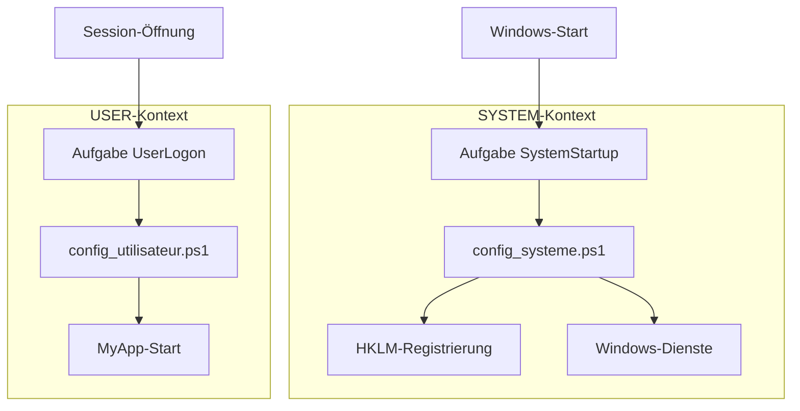

# ENTWICKLER-LEITFADEN - WindowsOrchestrator 1.72

---

📘 **[Benutzerhandbuch](BENUTZERHANDBUCH.md)**
*Zielgerichtet an Systemadministratoren und Bereitstellungstechniker.*
Enthält Schritt-für-Schritt-Anleitungen, Assistenten-Screenshots und Fehlerbehebungsanleitungen.

🏠 **[Zurück zur Startseite](README.md)**
*Zurück zur deutschen Dokumentationsportal.*

---

## Inhaltsverzeichnis

1. [Technische Präambel und Projektumfang](#1-technische-präambel-und-projektumfang)
    1.1. [Nicht-Installierbare Natur und Portabilitätsphilosophie](#11-nicht-installierbare-natur-und-portabilitätsphilosophie)
    1.2. [Technische Haftungsausschluss](#12-technische-haftungsausschluss)
    1.3. [Benennungskonventionen und Terminologie](#13-benennungskonventionen-und-terminologie)
2. [Systemarchitektur und Sicherheitsmodell](#2-systemarchitektur-und-sicherheitsmodell)
    2.1. [Das Modell der Privilegentrennung](#21-das-modell-der-privilegentrennung)
        2.1.1. [Der SYSTEM-Kontext (config_systeme.ps1)](#211-der-system-kontext-config_systemeps1)
        2.1.2. [Der USER-Kontext (config_utilisateur.ps1)](#212-der-user-kontext-config_utilisateurps1)
        2.1.3. [Ausführungsflussdiagramm](#213-ausführungsflussdiagramm)
    2.2. [Geplante Aufgaben-Architektur](#22-geplante-aufgaben-architektur)
        2.2.1. [Hauptaufgaben (Statisch)](#221-hauptaufgaben-statisch)
        2.2.2. [Dynamische Aufgaben (Laufzeitgesteuert)](#222-dynamische-aufgaben-laufzeitgesteuert)
        2.2.3. [Kritische Analyse des LogonType: Interaktiv vs. Passwort vs. S4U](#223-kritische-analyse-des-logontype-interaktiv-vs-passwort-vs-s4u)
    2.3. [Zeitliche Orchestrierung und Parallelität](#23-zeitliche-orchestrierung-und-parallelität)
        2.3.1. [Backup/Close-Entkopplung](#231-backupclose-entkopplung)
        2.3.2. [Typische tägliche Chronologie (Workflow)](#232-typische-tägliche-chronologie-workflow)
3. [Tiefgehende Analyse des Konfigurationsvertrags (config.ini)](#3-tiefgehende-analyse-des-konfigurationsvertrags-configini)
    3.1. [Abschnitt [SystemConfig]: Globale Parameter](#31-abschnitt-systemconfig-globale-parameter)
        3.1.1. [SessionStartupMode: Entscheidungsbaum](#311-sessionstartupmode-entscheidungsbaum)
        3.1.2. [DisableWindowsUpdate: Mechanismus und Verantwortungsübergang](#312-disablewindowsupdate-mechanismus-und-verantwortungsübergang)
        3.1.3. [OneDriveManagementMode: Die 3 Verwaltungsebenen](#313-onedrivemanagementmode-die-3-verwaltungsebenen)
    3.2. [Abschnitt [Process]: Anwendungslebenszyklusverwaltung](#32-abschnitt-process-anwendungslebenszyklusverwaltung)
        3.2.1. [Unterscheidung ProcessToLaunch vs. ProcessToMonitor](#321-unterscheidung-processtolaunch-vs-processtomonitor)
        3.2.2. [LaunchConsoleMode: Standard vs. Legacy](#322-launchconsolemode-standard-vs-legacy)
        3.2.3. [StartProcessMinimized: Splatting-Technik](#323-startprocessminimized-splatting-technik)
    3.3. [Abschnitt [DatabaseBackup]: Backup-Modul](#33-abschnitt-databasebackup-backup-modul)
        3.3.1. [EnableBackup: Der Kill-Schalter](#331-enablebackup-der-kill-schalter)
        3.3.2. [DatabaseKeepDays: Datumsbasierter Löschalgorithmus](#332-databasekeepdays-datumsbasierter-löschalgorithmus)
        3.3.3. [Zeitliche differentielle Logik](#333-zeitliche-differentielle-logik)
    3.4. [Abschnitt [Installation]: Bereitstellung und Resilienz](#34-abschnitt-installation-bereitstellung-und-resilienz)
        3.4.1. [SilentMode: Auswirkungskette](#341-silentmode-auswirkungskette)
        3.4.2. [AutologonDownloadUrl: Link-Rot-Resilienz](#342-autologondownloadurl-link-rot-resilienz)
        3.4.3. [UseAutologonAssistant: Bedingte Logik](#343-useautologonassistant-bedingte-logik)
4. [Code-Struktur und Komponentenanalyse](#4-code-struktur-und-komponentenanalyse)
    4.1. [Detaillierte Projektstruktur](#41-detaillierte-projektstruktur)
    4.2. [Das zentrale Modul: WindowsOrchestratorUtils.psm1](#42-das-zentrale-modul-windowsorchestratorutilspsm1)
        4.2.1. [I/O-Abstraktionsfunktionen (Ein-/Ausgabe)](#421-io-abstraktionsfunktionen-ein-ausgabe)
            [Get-IniContent: Manueller INI-Parser](#get-inicontent-manueller-ini-parser)
            [Set-IniValue: Sichere INI-Schreibung](#set-inivalue-sichere-ini-schreibung)
            [Get-ConfigValue: Typisierte Lesung mit Standardwerten](#get-configvalue-typisierte-lesung-mit-standardwerten)
        4.2.2. [Internationalisierungssystem (i18n)](#422-internationalisierungssystem-i18n)
            [Lokalisierungsstrategie (v1.72+)](#lokalisierungsstrategie-v172)
        4.2.3. [Protokollierungssystem](#423-protokollierungssystem)
            [Write-Log: Strukturierte und resiliente Schreibung](#write-log-strukturierte-und-resiliente-schreibung)
            [Add-Action / Add-Error: Aggregatoren](#add-action-add-error-aggregatoren)
            [Invoke-LogFileRotation: Archivverwaltung](#invoke-logfilerotation-archivverwaltung)
        4.2.4. [Start-OrchestratorProcess: Vereinheitlichte Start-Engine](#424-start-orchestratorprocess-vereinheitlichte-start-engine)
            [Entscheidungsalgorithmus](#entscheidungsalgorithmus)
            [Legacy-Modus- und Konsolenverwaltung](#legacy-modus-und-konsolenverwaltung)
            [Parameterkonstruktion (Splatting)](#parameterkonstruktion-splatting)
        4.2.5. [Warte-UI-Verwaltung (Splash-Screen)](#425-warte-ui-verwaltung-splash-screen)
        4.2.6. [Invoke-ExitLogic: Vereinheitlichte Ausgangsverwaltung](#426-invoke-exitlogic-vereinheitlichte-ausgangsverwaltung)
    4.3. [Eingangspunkte (Wrapper)](#43-eingangspunkte-wrapper)
        4.3.1. [Installationsausführungskette](#431-installationsausführungskette)
        4.3.2. [Launcher-Logik Launch-Install.ps1](#432-launcher-logik-launch-installps1)
    4.4. [Installationsskripte](#44-installationsskripte)
        4.4.1. [firstconfig.ps1: Dynamische grafische Oberfläche](#441-firstconfigps1-dynamische-grafische-oberfläche)
        4.4.2. [install.ps1: Installations-Engine](#442-installps1-installations-engine)
    4.5. [Laufzeit-Skripte](#45-laufzeit-skripte)
        4.5.1. [config_systeme.ps1 (SYSTEM-Kontext)](#451-config_systemeps1-system-kontext)
            [Zielbenutzerbestimmung (Vollständiger Algorithmus)](#zielbenutzerbestimmung-vollständiger-algorithmus)
            [Andere kritische Funktionen](#andere-kritische-funktionen)
        4.5.2. [config_utilisateur.ps1 (USER-Kontext)](#452-config_utilisateurps1-user-kontext)
    4.6. [Spezialisierte Module](#46-spezialisierte-module)
        4.6.1. [Invoke-DatabaseBackup.ps1: Autonomes Backup](#461-invoke-databasebackupps1-autonomes-backup)
            [A. Verriegelungsmechanismus (Lock-Datei)](#a-verriegelungsmechanismus-lock-datei)
            [B. Zeitliche differentielle Logik](#b-zeitliche-differentielle-logik)
            [C. Verwaltung gepaarter Dateien (SQLite)](#c-verwaltung-gepaarter-dateien-sqlite)
            [D. Vorabprüfungen](#d-vorabprüfungen)
        4.6.2. [Close-AppByTitle.ps1: Saubere Schließung via API](#462-close-appbytitleps1-saubere-schließung-via-api)
            [C#-P/Invoke-Injektion: Vollständiger Code](#c-pinvoke-injektion-vollständiger-code)
            [Retry-Logik mit Timeout](#retry-logik-mit-timeout)
5. [Verwaltung externer Abhängigkeiten und Sicherheit](#5-verwaltung-externer-abhängigkeiten-und-sicherheit)
    5.1. [Microsoft Sysinternals Autologon-Tool](#51-microsoft-sysinternals-autologon-tool)
        5.1.1. [Download- und Architekturauswahlmechanismus](#511-download-und-architekturauswahlmechanismus)
        5.1.2. [Anmeldedatensicherheit: LSA-Geheimnisse](#512-anmeldedatensicherheit-lsa-geheimnisse)
            [LSA-Geheimnisse-Bereinigungsprozess (Deinstallation)](#lsa-geheimnisse-bereinigungsprozess-deinstallation)
    5.2. [Gotify-Benachrichtigungen (Optional)](#52-gotify-benachrichtigungen-optional)
        5.2.1. [REST-Implementierung](#521-rest-implementierung)
        5.2.2. [Netzwerkresilienz](#522-netzwerkresilienz)
6. [Lebenszyklus und Nutzungsszenarien](#6-lebenszyklus-und-nutzungsszenarien)
    6.1. [Vollständige Installationssequenz](#61-vollständige-installationssequenz)
        [Logisches Sequenzdiagramm (Mermaid)](#logisches-sequenzdiagramm-mermaid)
        [Detaillierte Flussschritte](#detaillierte-flussschritte)
    6.2. [Detaillierte tägliche Zeitleiste (Timeline)](#62-detaillierte-tägliche-zeitleiste-timeline)
    6.3. [Sitzungsmodi: Vergleichende Analyse](#63-sitzungsmodi-vergleichende-analyse)
        [Technische Vergleichstabelle](#technische-vergleichstabelle)
        [Szenarioanalyse](#szenarioanalyse)
7. [Wartung, Debugging und Ausgangsverfahren](#7-wartung-debugging-und-ausgangsverfahren)
    7.1. [Protokollierungssystem](#71-protokollierungssystem)
        7.1.1. [Speicherort und Format](#711-speicherort-und-format)
        7.1.2. [Rotationsrichtlinie](#712-rotationsrichtlinie)
        7.1.3. [Automatischer Fallback (Sicherheit)](#713-automatischer-fallback-sicherheit)
    7.2. [Manuelle Debugging-Verfahren](#72-manuelle-debugging-verfahren)
        7.2.1. [USER-Kontext-Debugging](#721-user-kontext-debugging)
        7.2.2. [SYSTEM-Kontext-Debugging (via PsExec)](#722-system-kontext-debugging-via-psexec)
        7.2.3. [Geplante Aufgaben-Analyse](#723-geplante-aufgaben-analyse)
    7.3. [Ausgangscodes und Fehlererkennung](#73-ausgangscodes-und-fehlererkennung)
        7.3.1. [Standardcodes](#731-standardcodes)
        7.3.2. [Interne Erkennung](#732-interne-erkennung)
    7.4. [Häufige Probleme und Lösungen](#74-häufige-probleme-und-lösungen)
        7.4.1. [Die Anwendung startet nicht](#741-die-anwendung-startet-nicht)
        7.4.2. [Der Neustart funktioniert nicht](#742-der-neustart-funktioniert-nicht)
        7.4.3. [Backup schlägt fehl ("Access Denied")](#743-backup-schlägt-fehl-access-denied)
        7.4.4. [Splash-Screen bleibt hängen (Silent-Modus)](#744-splash-screen-bleibt-hängen-silent-modus)
8. [Anhänge](#8-anhänge)
    8.1. [Lizenz](#81-lizenz)
    8.2. [Vollständiges technisches Glossar](#82-vollständiges-technisches-glossar)
    8.3. [Entwicklungsstandards](#83-entwicklungsstandards)
        8.3.1. [Konvention relativer Pfade](#831-konvention-relativer-pfade)
        8.3.2. [Formatierungskonvention (i18n)](#832-formatierungskonvention-i18n)
        8.3.3. [Fehlerbehandlung](#833-fehlerbehandlung)
    8.4. [Credits](#84-credits)
    8.5. [Schnelle diagnostische PowerShell-Befehle](#85-schnelle-diagnostische-powershell-befehle)

## 1. Technische Präambel und Projektumfang

### 1.1. Nicht-Installierbare Natur und Portabilitätsphilosophie

Die Architektur von WindowsOrchestrator wurde entwickelt, um die Einschränkungen traditioneller Softwareinstallationen (MSI, EXE, AppX) zu umgehen. Sie verfolgt das Paradigma der **Portablen Anwendung**.

*   **Abwesenheit von Fußabdruck in Systemverzeichnissen**:
    *   Das Projekt stellt keine Dateien in `%PROGRAMFILES%` (`C:\Programme`), `%PROGRAMDATA%` oder `%APPDATA%` bereit.
    *   Es erstellt keine Registrierungsschlüssel, um sich in "Programme hinzufügen/entfernen" zu referenzieren.
    *   Die Gesamtheit des Codes, der Konfiguration und der Protokolle befindet sich im ursprünglichen Extraktionsordner.

*   **Dynamische Pfadauflösung (Relative Pfade)**:
    *   Um diese Portabilität zu gewährleisten, ist die Verwendung absoluter Pfade (z. B.: `C:\WindowsOrchestrator\...`) im Quellcode strengstens verboten.
    *   **PowerShell**: Alle Skripte verwenden die automatische Variable `$PSScriptRoot` in Kombination mit dem Cmdlet `Join-Path`, um Module, Sprachdateien und Tools zu lokalisieren.
        *   *Beispiel*: `$ConfigFile = Join-Path (Split-Path $PSScriptRoot -Parent) "config.ini"`
    *   **Batch**: Launcher-Skripte (`.bat`) verwenden die Erweiterungsvariable `%~dp0`, um ihr aktuelles Ausführungsverzeichnis zu identifizieren.

*   **Operative Konsequenzen**:
    *   **Verschiebung**: Der Stammordner kann von einem `C:\`-Laufwerk zu einem `D:\`-Volume, einem USB-Stick oder einem zugeordneten Netzwerkfreigabe verschoben werden, ohne die interne Funktionalität zu brechen. Nur geplante Aufgaben (die absolute Pfade bei ihrer Erstellung enthalten) müssen über das `install.ps1`-Skript neu erstellt werden.
    *   **Update**: Wartung erfolgt "In-Place". Um den Orchestrator zu aktualisieren, ersetzen Sie einfach die `.ps1`- und `.psm1`-Dateien. Benutzerdaten (`config.ini`) und Audit-Trails (`Logs\`) werden beibehalten, da sie sich außerhalb der Geschäftslogikordner befinden.

### 1.2. Technische Haftungsausschluss

Diese Software wird unter **GPLv3**-Lizenz bereitgestellt, nach dem "AS IS"-Prinzip. Als Entwickler oder Integrator müssen Sie die folgenden Implikationen beherrschen:

*   **Kritische Systemabhängigkeiten**:
    *   Der Orchestrator ist kein selbstständiges Binary, das seine eigenen Bibliotheken enthält. Es handelt sich um eine Orchestrierungs-Engine, die direkt native Windows-Komponenten manipuliert.
    *   Es hängt von der Stabilität von **WMI/CIM** (für Prozessüberwachung), dem **Service Control Manager** (für Windows Update) und der **Win32**-API (für Fensterverwaltung) ab.
    *   Ein Windows-System, dessen WMI-Subsysteme beschädigt sind oder dessen Sicherheitsrichtlinien (Domänen-GPO) den Zugriff auf die HKLM-Registrierung blockieren, wird das Tool am Funktionieren hindern.

*   **Grenzen der Idempotenz und Wiederherstellung**:
    *   Die Deinstallationsprozedur funktioniert nicht wie ein "Snapshot" oder ein Systemwiederherstellungspunkt.
    *   Sie wendet eine "Reset to Defaults"-Logik an: Sie setzt Parameter (Windows Update, Fast Startup, OneDrive) auf ihre standardmäßigen Microsoft-Werte zurück.
    *   *Auswirkung*: Wenn die Zielmaschine vor der Installation des Orchestrators spezifische Konfiguration hatte (z. B.: Windows Update manuell deaktiviert), wird die Deinstallation des Orchestrators den Dienst reaktivieren, wodurch der ursprüngliche Zustand der Maschine geändert wird.

### 1.3. Benennungskonventionen und Terminologie

Um Konsistenz zwischen Quellcode, Konfigurationsdateien und dieser technischen Dokumentation zu gewährleisten, wird eine strenge Konvention angewendet:

*   **`MyApp`**: Dieser generische Begriff bezeichnet die Ziel-Geschäftsanwendung, die der Orchestrator verwalten muss.
    *   Er ersetzt alle Referenzen zu spezifischen internen Projekten (ehemals `Allv023-05`, `AllSys`, etc.).
    *   In der `config.ini`-Datei entspricht dies dem Wert des `ProcessToMonitor`-Schlüssels.
*   **Orchestrator**: Bezeichnet die Gesamtheit der PowerShell-Skripte, Module und geplanten Aufgaben, die die Lösung bilden.

---

## 2. Systemarchitektur und Sicherheitsmodell

Das Design von WindowsOrchestrator beruht auf der sicheren Umgehung der Einschränkungen, die das Sicherheitsmodell von Windows auferlegt, insbesondere die Isolation des SYSTEM-Kontexts.

### 2.1. Das Modell der Privilegentrennung

Um seine Funktionen zu erfüllen (Systemkonfiguration UND Anwendungsstart), kann sich das Tool nicht auf ein einzelnes Skript stützen. Es verwendet zwei separate und hermetische Ausführungskontexte.

#### 2.1.1. Der SYSTEM-Kontext (`config_systeme.ps1`)

Dieses Skript fungiert als "Low-Level-Engine" der Lösung.

*   **Ausführungsidentität**: `NT AUTHORITY\SYSTEM` (auch bekannt als *LocalSystem*).
*   **Startmechanismus**: Geplante Aufgabe `WindowsOrchestrator-SystemStartup`.
*   **Technische Notwendigkeit**:
    *   Es ist das einzige Konto, das die erforderlichen Berechtigungen hat, um kritische Registrierungshives (`HKEY_LOCAL_MACHINE\SYSTEM`, `HKEY_LOCAL_MACHINE\SOFTWARE\Policies`) zu modifizieren.
    *   Es hat das Recht, den Zustand von Windows-Diensten (Start, Stopp, Deaktivierung) zu kontrollieren, ohne UAC-Eingabeaufforderungen auszulösen.
    *   Es kann globale Stromversorgungspläne über `powercfg.exe` modifizieren.
*   **Kritische Einschränkungen (Erhöhte Berechtigungen ohne grafische Session)**:
    *   Aufgaben, die im SYSTEM-Kontext ausgeführt werden, haben alle administrativen Berechtigungen, aber sie werden **ohne Benutzer-Desktop-Umgebung** ausgeführt.
    *   **Konsequenz**: Dieses Skript ist für den Benutzer unsichtbar. Jeder Versuch, eine grafische Benutzeroberfläche anzuzeigen (`MessageBox`, Formulare), schlägt fehl oder bleibt unsichtbar. Das Skript kann grafische Anwendungen nur über dedizierte geplante Aufgaben im USER-Kontext starten.

#### 2.1.2. Der USER-Kontext (`config_utilisateur.ps1`)

Dieses Skript fungiert als "Interaktive Engine" und verwaltet die Benutzererfahrung.

*   **Ausführungsidentität**: Der angemeldete Benutzer (Interaktiv). Dies kann der für Autologon definierte Benutzer oder jeder Benutzer sein, der eine Session öffnet.
*   **Startmechanismus**: Geplante Aufgabe `WindowsOrchestrator-UserLogon` mit Trigger `At Logon` und LogonType `Interactive`.
*   **Technische Notwendigkeit**:
    *   Es wird **in der interaktiven Session des angemeldeten Benutzers** ausgeführt (aktive Desktop-Umgebung).
    *   Im Gegensatz zum SYSTEM-Kontext hat es Zugriff auf den Desktop, sichtbare Fenster und Benutzerressourcen.
    *   Es ist der einzige Kontext, der in der Lage ist, die Geschäftsanwendung (`MyApp`) so zu starten, dass sie auf dem Desktop sichtbar ist.
    *   Es hat Zugriff auf die Hive `HKEY_CURRENT_USER` (HKCU), um Benutzereinstellungen zu konfigurieren.
    *   Es hat Zugriff auf zugeordnete Netzwerkressourcen (Z:, Y:) und Drucker des Benutzers, die das SYSTEM-Konto nicht sieht.
*   **Einschränkungen**:
    *   Es kann globale Systemparameter nicht modifizieren (Dienste, HKLM) ohne Berechtigungserhöhung (UAC), was die Automatisierung brechen würde.

#### 2.1.3. Ausführungsflussdiagramm

Das Diagramm unten veranschaulicht die Dichotomie zwischen den beiden Kontexten vom Moment des Windows-Starts an.



---

## 2.2. Geplante Aufgaben-Architektur

Der Orchestrator stützt sich nicht auf veraltete Startmethoden, die unzuverlässig sind, wie den "Startup"-Ordner oder Run-Registrierungsschlüssel. Er verwendet ausschließlich den **Windows-Aufgabenplaner**, der die notwendige Granularität in Bezug auf Sicherheit, Kontext und Trigger bietet.

### 2.2.1. Hauptaufgaben (Statisch)

Diese Aufgaben bilden die unveränderliche Infrastruktur des Orchestrators. Sie werden einmal während der Ausführung des `install.ps1`-Skripts erstellt und danach nicht mehr modifiziert, außer bei Neuinstallation.

| Aufgabenname | Trigger (Trigger) | Sicherheitskontext | Technische Rolle |
| :-------------------------------------- | :------------------------------------- | :----------------------------------------------- | :----------------------------------------------------------- |
| **`WindowsOrchestrator-SystemStartup`** | `At Startup` (Beim Systemstart) | `NT AUTHORITY\SYSTEM` (RunLevel Highest) | Einstiegspunkt für die Maschinenkonfiguration. Es stellt sicher, dass die Umgebung vor jeder Benutzersession sicher ist (GPO, Power). Es fungiert als Selbstreparaturmechanismus beim Boot. |
| **`WindowsOrchestrator-UserLogon`** | `At Logon` (Bei Session-Öffnung) | Interaktiver Benutzer (`LogonType Interactive`) | Einstiegspunkt für die Session. Es ist verantwortlich für die Initialisierung der Benutzerumgebung und den Start der Geschäftsanwendung (`MyApp`). |

### 2.2.2. Dynamische Aufgaben (Laufzeitgesteuert)

Im Gegensatz zu Hauptaufgaben werden diese Aufgaben dynamisch vom `config_systeme.ps1`-Skript bei jedem Systemstart verwaltet.

*   **Mechanismus**: Das Skript liest die `config.ini`-Datei, prüft, ob sich Zeiten geändert haben, und verwendet `Register-ScheduledTask` (mit der Option `-Force`) oder `Unregister-ScheduledTask`, um den Planer zu aktualisieren.
*   **Vorteil**: Dies ermöglicht es einem Administrator, die Neustart- oder Backup-Zeit einfach durch Bearbeitung der INI-Datei zu ändern, ohne den vollständigen Installer erneut auszuführen.

Liste der dynamischen Aufgaben:
1.  **`WindowsOrchestrator-SystemBackup`**: Wird täglich zur durch `ScheduledBackupTime` definierten Zeit ausgelöst. Führt `Invoke-DatabaseBackup.ps1` im SYSTEM-Kontext aus.
2.  **`WindowsOrchestrator-SystemScheduledReboot`**: Wird täglich zur durch `ScheduledRebootTime` definierten Zeit ausgelöst. Führt `shutdown.exe` aus.
3.  **`WindowsOrchestrator-User-CloseApp`**: Wird täglich zur durch `ScheduledCloseTime` definierten Zeit ausgelöst. Führt `Close-AppByTitle.ps1` im interaktiven Benutzerkontext aus (notwendig, um Tasten an das Anwendungsfenster zu senden).

### 2.2.3. Kritische Analyse des LogonType: Interaktiv vs. Passwort vs. S4U

Die Wahl des `LogonType` für die `UserLogon`-Aufgabe ist eine zentrale architektonische Entscheidung der Version 1.72, die die Passwortverwaltungsprobleme früherer Versionen löst.

| LogonType | Passwort erforderlich? | Grafische Session? | Technische Analyse |
| :---------------- | :-------------------: | :-----------------: | :----------------------------------------------------------- |
| **`Interactive`** | ❌ Nein | ✅ Ja | **Für v1.72 gewählt**. Die Aufgabe erstellt keine eigene Session; sie injiziert sich **in** die Benutzersession zum präzisen Moment ihrer Öffnung. Sie erbt das Zugriffstoken (Token), das vom Winlogon-Prozess generiert wird (oder Autologon). Dies ist der Grund, warum der Orchestrator **nicht** das Passwort des Benutzers kennen muss, um die grafische Anwendung zu starten. |
| **`Password`** | ✅ Ja | ✅ Ja | Klassischer Modus "Run whether user is logged on or not". Erfordert die Speicherung des Passworts im Windows Credential Store (weniger sicher) und erfordert zwingend, dass das Konto die lokale Berechtigung `SeBatchLogonRight` hat ("Log on as a batch job"), die oft durch Sicherheits-GPOs in Unternehmen blockiert ist. |
| **`S4U`** | ❌ Nein | ❌ Nein | "Service for User". Ermöglicht die Ausführung einer Aufgabe unter der Identität des Benutzers ohne Passwort, aber ohne Laden seines vollständigen Profils und **ohne authentifizierten Netzwerkzugriff** (Kerberos/NTLM). Außerdem kann dieser Modus keine grafische Benutzeroberfläche anzeigen. Unbrauchbar für `MyApp`. |
**Kritische architektonische Klarstellung**:

Die Wahl des LogonType `Interactive` ist der Eckpfeiler der Architektur. Hier ist, warum es **obligatorisch** für WindowsOrchestrator ist:

1. **Session-Token-Vererbung**: Wenn die Aufgabe "At Logon" ausgelöst wird, **erbt sie automatisch** das Zugriffstoken (Security Token) der Benutzersession, die geöffnet wird. Dies umfasst:
   - Zugriff auf das Benutzerprofil (`HKCU`, `%APPDATA%`)
   - Desktop-Sichtbarkeit (Desktop Window Manager)
   - Zugeordnete Netzlaufwerke (Z:, Y:, etc.)

2. **Keine neue Session**: Im Gegensatz zu `Password` oder `S4U` versucht dieser Modus nicht, eine neue Session zu erstellen. Er injiziert sich in die bestehende Session, daher die Abwesenheit von Passwortbedarf.

3. **Legacy-Anwendungskompatibilität**: Viele Drittanbieter-Anwendungen (insbesondere Geschäftsanwendungen) prüfen, ob sie in einer realen "interaktiven" Session laufen. Der LogonType `Interactive` erfüllt diese Prüfungen.

**Was dieser Modus NICHT tut**:
- Er umgeht UAC nicht (die Anwendung bleibt in Standardbenutzerberechtigungen)
- Er funktioniert NICHT, wenn kein Benutzer angemeldet ist (die Aufgabe wartet auf Session-Öffnung)
- Er erstellt keine virtuelle oder unsichtbare Terminal

## 2.3. Zeitliche Orchestrierung und Parallelität

Der Orchestrator stützt sich nicht auf ein einzelnes Skript, das "schläft" (Schleife `Start-Sleep`), während es auf eine Aktion wartet. Er stützt sich auf den Planer, um punktuelle und unabhängige Aktionen auszulösen.

### 2.3.1. Backup/Close-Entkopplung

Es ist zwingend notwendig zu beachten, dass die **Schließ**-Aufgabe (`User-CloseApp`) und die **Backup**-Aufgabe (`SystemBackup`) architektonisch vollständig entkoppelt sind.

*   **Technische Unabhängigkeit**: Dies sind zwei separate "Scheduled Task"-Objekte mit ihren eigenen Zeit-Triggern und ihren eigenen Ausführungskontexten (USER für die eine, SYSTEM für die andere).
*   **Entkopplung Technisch aber Nicht Logisch**:
   - **Technisch**: Die beiden Aufgaben sind separate Objekte im Scheduler. Wenn `Close-AppByTitle.ps1` abstürzt, wird die Backup-Aufgabe trotzdem ausgeführt.
   - **Reales Risiko**: Wenn die Anwendung nicht zur Backup-Zeit (02:57) geschlossen ist, können Dateien gesperrt sein (offene Datei-Handles). In diesem Fall:
       - SQLite-Dateien (`.db`) werden kopiert, aber **potenziell in einem inkonsistenten Zustand**
       - WAL-Dateien (`.db-wal`) können nicht committete Transaktionen enthalten
       - Die Wiederherstellung eines solchen Backups kann fehlschlagen oder eine beschädigte Datenbank produzieren
   - **Aktuelle Abschwächung**: Keine automatische Garde im Code. Der Administrator muss:
       1. Einen ausreichenden Abstand zwischen Close und Backup lassen (empfohlen: 2 Minuten Minimum)
       2. Manuell Backup-Protokolle auf Fehler prüfen
       3. Regelmäßig Backup-Wiederherstellungen testen
*   **Datenkonsistenz**: Obwohl entkoppelt, sind diese Aufgaben zeitlich sequenziert (Schließung vor Backup), um sicherzustellen, dass Dateien nicht gesperrt sind (Open File Handles) während der Kopie. Das Backup funktioniert jedoch auch bei offenen Dateien (obwohl die Anwendungskonsistenz weniger garantiert ist in diesem spezifischen Fall).

### 2.3.2. Typische tägliche Chronologie (Workflow)

Hier ist der genaue Lebenszyklus einer vom Orchestrator verwalteten Maschine, basierend auf der empfohlenen Konfiguration im Benutzerhandbuch.

1.  **02:55** → Auslösung von **`WindowsOrchestrator-User-CloseApp`**
    *   **Skript**: `Close-AppByTitle.ps1`
    *   **Aktion**: Sucht nach dem Fenster mit "MyApp" (Standardwert) und sendet die Sequenz `{ESC}{ESC}x{ENTER}` (Escape x 2, 'x', Enter). Dies ist ein anpassbares Beispiel je nach Anwendung.
2.  **02:57** → Auslösung von **`WindowsOrchestrator-SystemBackup`**
    *   **Skript**: `Invoke-DatabaseBackup.ps1`
    *   **Aktion**: Analysiert den Datenordner, identifiziert Dateien, die in den letzten 24 Stunden modifiziert wurden, und führt differentielle Kopie zum sicheren Ziel durch.
3.  **03:00** → Auslösung von **`WindowsOrchestrator-SystemScheduledReboot`**
    *   **Binary**: `shutdown.exe`
    *   **Argumente**: `/r /t 0` (Sofortiger Neustart).
    *   **Aktion**: Windows initiiert die Shutdown-Prozedur.
4.  **03:01** → **Cold Boot (Kaltstart)**
    *   **Spezifikation**: Dank der vom Orchestrator erzwungenen Deaktivierung von *Fast Startup*, erzwingt dieser Start eine vollständige Neuladung des Kernels, der Treiber und der Hardware, wodurch jeglicher residualer Speicherzustand eliminiert wird (im Gegensatz zu Hibernation-Ausgang).
5.  **03:02** → Auslösung von **`WindowsOrchestrator-SystemStartup`**
    *   **Skript**: `config_systeme.ps1`
    *   **Aktion**: Integritätsprüfung der Konfiguration (Windows Update GPO, Power-Einstellungen, Existenz dynamischer Aufgaben).
6.  **03:02:30** → **Autologon** (falls aktiviert)
    *   **Aktion**: Das Winlogon-Subsystem verwendet LSA-Geheimnisse, um die Benutzersession automatisch zu öffnen.
7.  **03:03** → Auslösung von **`WindowsOrchestrator-UserLogon`**
    *   **Skript**: `config_utilisateur.ps1`
    *   **Aktion**: Erkennung, dass `MyApp` nicht läuft, dann Start der Anwendung über die konfigurierte Methode (Direkt, PowerShell oder Legacy).

---

## 3. Tiefgehende Analyse des Konfigurationsvertrags (`config.ini`)

Die `config.ini`-Datei ist das Herz des Orchestrators. Es handelt sich nicht um eine einfache Einstellungsdatei, sondern um einen **Zustandsvertrag** (State Contract), den die Skripte sich verpflichten, bei jeder Ausführung anzuwenden. Der verwendete Parser (`Get-IniContent` im Utils-Modul) ist case-insensitive, aber sensitiv für die Abschnittsstruktur.

### 3.1. Abschnitt [SystemConfig]: Globale Parameter

Dieser Abschnitt steuert ausschließlich das Verhalten des Skripts `config_systeme.ps1`, das mit SYSTEM-Berechtigungen ausgeführt wird.

#### 3.1.1. `SessionStartupMode`: Entscheidungsbaum

Dieser Parameter bestimmt die Zugriffsstrategie zum System. Der Code implementiert eine strenge Umschaltlogik:

*   **`Standard`**:
    *   **Technische Aktion**: Erzwingt den Registrierungswert `AutoAdminLogon` auf `"0"` in `HKLM:\SOFTWARE\Microsoft\Windows NT\CurrentVersion\Winlogon`.
    *   **Ergebnis**: Der PC stoppt am Windows-Anmeldebildschirm (LogonUI). Der Benutzer muss sein Passwort eingeben oder Windows Hello verwenden.
    *   **Anwendungsfall**: Verwaltungsarbeitsstationen, Server, die bei jedem physischen Zugriff eine starke Authentifizierung erfordern.

*   **`Autologon`**:
    *   **Technische Aktion**:
       *   Erzwingt `AutoAdminLogon` auf `"1"`.
       *   Setzt `DefaultUserName` mit dem Wert von `AutoLoginUsername` (oder aktueller Benutzer, falls bei Installation leer).
       *   Setzt `DefaultDomainName` mit dem Computernamen (oder AD-Domäne).
    *   **Sicherheit**: Beachten Sie, dass das Passwort **nicht** hier verwaltet wird. Es wird vom externen Tool `Autologon.exe` verwaltet, das Anmeldedaten in LSA-Geheimnisse injiziert. Das `config_systeme.ps1`-Skript kümmert sich nur um die Aktivierung des Mechanismus.
    *   **Anwendungsfall**: Interaktive Kioske, Displayscreens, autonome Terminals.

#### 3.1.2. `DisableWindowsUpdate`: Mechanismus und Verantwortungsübergang

Der Orchestrator wendet eine "Defense in Depth"-Strategie an, um sicherzustellen, dass Windows Update die Produktion nicht stört.

*   **Sperrung durch lokale GPO (Registrierung)**:
    *   Das Skript schreibt `NoAutoUpdate = 1` in `HKLM:\SOFTWARE\Policies\Microsoft\Windows\WindowsUpdate\AU`.
    *   Es schreibt `NoAutoRebootWithLoggedOnUsers = 1` in denselben Schlüssel.
    *   **Warum?** Die `Policies`-Schlüssel werden vom OS als Unternehmensrichtlinien respektiert und sind schwieriger zu umgehen als einfache Konfigurationsschlüssel durch die Selbstreparaturmechanismen von Windows.

*   **Dienst-Deaktivierung**:
    *   Der `wuauserv`-Dienst wird auf `StartupType = Disabled` gesetzt.
    *   Der Dienst wird sofort über `Stop-Service -Force` gestoppt.

*   **Permanenz**: Bei jedem Start prüft und reaktiviert `config_systeme.ps1` diese Schlüssel. Wenn eine manuelle Aktualisierung oder ein Drittanbieter-Tool den Dienst reaktiviert hat, wird der Orchestrator ihn beim nächsten Boot wieder abschalten.

#### 3.1.3. `OneDriveManagementMode`: Die 3 Verwaltungsebenen

Dieser Parameter verwaltet das Verhalten gegenüber dem Microsoft OneDrive-Synchronisationsclient, der oft unerwünscht auf autonomen Kiosken ist.

*   **`Block` (Empfohlen)**:
    *   **GPO-Aktion**: Erstellt den Schlüssel `DisableFileSyncNGSC = 1` in `HKLM:\SOFTWARE\Policies\Microsoft\Windows\OneDrive`. Dies verhindert, dass die OneDrive-Executable startet, auch wenn der Benutzer manuell versucht.
    *   **Aufräumen**: Versucht auch, den automatischen Starteintrag im Run-Schlüssel des Benutzers zu entfernen.
    *   **Kill**: Tötet jeden aktiven `OneDrive.exe`-Prozess.

*   **`Close`**:
    *   **Aktion**: Tötet nur den `OneDrive.exe`-Prozess, falls erkannt.
    *   **Einschränkung**: OneDrive kann sich automatisch über seine Wartungsaufgaben neu starten. Dies ist eine korrektive temporäre Maßnahme, keine definitive Lösung.

*   **`Ignore`**:
    *   **Aktion**: Entfernt den `DisableFileSyncNGSC`-Richtlinienschlüssel, falls vorhanden, und gibt die Kontrolle an den Benutzer oder das OS zurück.

### 3.2. Abschnitt [Process]: Anwendungslebenszyklusverwaltung

Dieser Abschnitt steuert das Verhalten des Skripts `config_utilisateur.ps1` (USER-Kontext) und der zentralen Funktion `Start-OrchestratorProcess`.

#### 3.2.1. Unterscheidung `ProcessToLaunch` vs. `ProcessToMonitor`

Dies ist ein fundamentales Konzept für die Idempotenz des Launchers.

*   **`ProcessToLaunch`**: Dies ist der **Trigger**.
    *   Beispiel: `LaunchApp.bat`, `Start.ps1`, oder `C:\Program Files\App\Loader.exe`.
    *   Dies ist die Datei, die der Orchestrator ausführt.

*   **`ProcessToMonitor`**: Dies ist das **Ziel**.
    *   Beispiel: `MyApp` (für `MyApp.exe`) oder `java` (für eine Java-App).
    *   Dies ist der Prozessname, der im RAM geladen ist.

**Ausführungslogik**:
1.  Das Skript prüft: "Existiert `ProcessToMonitor` in der Prozessliste?"
2.  **Wenn JA**: Die Anwendung läuft bereits. Der Orchestrator tut nichts. Dies vermeidet das Starten von 50 Instanzen der Anwendung, wenn der Benutzer seine Session schließt und wieder öffnet, oder wenn das Skript manuell neu ausgeführt wird.
3.  **Wenn NEIN**: Der Orchestrator führt `ProcessToLaunch` aus.

> **Entwicklerhinweis**: Wenn `ProcessToMonitor` leer gelassen wird, verliert der Orchestrator seine Erkennungsfähigkeit und wird `ProcessToLaunch` bei jeder Ausführung starten, was Duplikate verursachen kann.

#### 3.2.2. `LaunchConsoleMode`: Standard vs. Legacy

Dieser Parameter löst Kompatibilitätsprobleme mit verschiedenen Windows-Konsolenhosts (conhost, Windows Terminal).

*   **`Standard`** (Standard):
    *   Verwendet `Start-Process -FilePath ...`.
    *   Lässt Windows den Host entscheiden. Auf Windows 11 kann dies einen neuen Tab in Windows Terminal öffnen. Dies ist die moderne und empfohlene Methode.

*   **`Legacy`**:
    *   Konstruiert einen expliziten Befehl: `cmd.exe /c start "Titel" "Pfad" Argumente`.
    *   **Notwendigkeit**: Einige alte Batch-Skripte (Legacy) oder bestimmte Anwendungen stürzen ab, wenn sie nicht in ihrem eigenen dedizierten `conhost.exe`-Fenster ausgeführt werden (klassisches schwarzes Bildschirm). Dieser Modus erzwingt dieses Verhalten.

**Konkretes Beispiel: Wann Legacy verwenden?**

Einige historische Batch-Skripte sind mit modernen Terminals inkompatibel. Hier ist ein typischer Fall:

**Problematisches Skript (`LaunchApp.bat`)**:
```batch
@echo off
REM Dieses Skript stürzt im Standardmodus auf Windows 11 ab
cd /d %~dp0
echo Anwendung starten...

REM Startet die App in einem neuen detached Prozess
start "" "MyApp.exe" -config production.ini

REM Wartet 5 Sekunden, um den Start zu überprüfen
timeout /t 5 /nobreak > nul

REM Prüft, ob der Prozess läuft
tasklist | find /i "MyApp.exe" > nul
if errorlevel 1 (
    echo FEHLER: Anwendung ist nicht gestartet!
    pause
    exit /b 1
)

echo Anwendung erfolgreich gestartet.
exit /b 0
```

**Symptome im Standardmodus**:

- Auf Windows 11 mit Windows Terminal führt das Skript in einem geteilten Tab aus
- Der `start ""`-Befehl versucht, ein Fenster zu erstellen, aber schlägt stillschweigend fehl
- `MyApp.exe` startet niemals
- Das Skript wartet 5 Sekunden dann zeigt "FEHLER"

**Lösung**: Aktivieren Sie den Legacy-Modus in `config.ini`

```ini
[Process]
LaunchConsoleMode=Legacy
```

**Was dann passiert**:

```powershell
# Anstatt:
Start-Process -FilePath "LaunchApp.bat"

# Führt der Orchestrator aus:
cmd.exe /c start "WindowsOrchestrator Launch" "C:\Pfad\Zu\LaunchApp.bat"
```

Dies erzwingt die Öffnung eines **neuen dedizierten `conhost.exe`-Fensters**, isoliert vom PowerShell-Prozess, in dem das Batch korrekt ausgeführt wird.

**Wann NICHT Legacy verwenden**:

- PowerShell-Skripte (`.ps1`) → Immer Standard
- Direkte Executables (`.exe`) → Immer Standard
- Moderne Batch-Skripte ohne `start` → Standard funktioniert

#### 3.2.3. `StartProcessMinimized`: Splatting-Technik

Die Option ermöglicht das Starten der Anwendung minimiert in der Taskleiste (nützlich für Hintergrundanwendungen, die eine GUI haben, aber nicht stören sollen).

Der Code verwendet die **Splatting**-PowerShell-Technik, um diesen Parameter bedingt anzuwenden:

```powershell
# Dynamische Parameterkonstruktion
$startParams = @{
    FilePath = $exePath
    ArgumentList = $args
}

if ($StartProcessMinimized) {
    # Fügt den WindowStyle-Schlüssel nur hinzu, wenn angefordert
    $startParams.Add("WindowStyle", "Minimized")
}

# Saubere Ausführung
Start-Process @startParams
```

---

## 3. Tiefgehende Analyse des Konfigurationsvertrags (`config.ini`) (Fortsetzung)

### 3.3. Abschnitt [DatabaseBackup]: Backup-Modul

Dieser Abschnitt steuert das Verhalten des Skripts `Invoke-DatabaseBackup.ps1`. Die Backup-Logik wurde so konzipiert, dass sie **atomisch** und **resilient** ist.

#### 3.3.1. `EnableBackup`: Der Kill-Schalter

Diese boolesche Variable fungiert als Hauptschalter.
*   **Mechanismus**: Sie wird an der allerersten logischen Zeile der Hauptfunktion des Backup-Skripts überprüft.
*   **Verhalten**:
    *   Wenn `false`: Das Skript protokolliert "Backup disabled" und kehrt sofort zurück, ohne jegliche Festplatten- oder Netzwerkoperationen durchzuführen.
    *   Wenn `true`: Das Skript fährt mit der Initialisierung der Pfadvariablen (`Source`, `Destination`) und dem Start der Vorabprüfungen fort.

#### 3.3.2. `DatabaseKeepDays`: Datumsbasierter Löschalgorithmus

Die Aufbewahrungsverwaltung stützt sich nicht auf Dateimetadaten (Erstellungs-/Änderungsdatum der Backup-Datei), die bei Kopien geändert werden können, sondern auf eine strenge Benennungskonvention.

*   **Benennungsformat**: Dateien, die vom Orchestrator generiert werden, folgen dem Muster: `YYYYMMDD_HHMMSS_OriginalName.ext`.
*   **Algorithmus**:
    1.  Das Skript listet Dateien in `DatabaseDestinationPath` auf.
    2.  Es wendet eine Regex `^(\d{8})_` an, um die ersten 8 Ziffern (das Datum) zu extrahieren.
    3.  Es konvertiert diese Zeichenkette in ein `DateTime`-Objekt.
    4.  Wenn `DateiDatum < (HeuteDatum - DatabaseKeepDays)`, wird die Datei über `Remove-Item -Force` gelöscht.

#### 3.3.3. Zeitliche differentielle Logik

Um zu vermeiden, dass der Datenträger und das Netzwerk mit unnötigen Kopien gesättigt werden (insbesondere bei großen Datenbanken von mehreren GB), führt das Skript keine systematische vollständige Backups durch.

*   **Der Filter**: `LastWriteTime > (Get-Date).AddHours(-24)`
*   **Funktionsweise**:
    *   Das Skript scannt rekursiv den Quellordner.
    *   Es behält nur Dateien, deren letzte Änderungszeitstempel weniger als 24 Stunden beträgt.
    *   **Konsequenz**: Der Orchestrator führt ein **tägliches differentielles Backup** basierend auf Zeit durch. Es vergleicht keine Hashes (MD5/SHA) aus Performancegründen.
*   **SQLite-Paare-Integrität**: Eine Ausnahme zu dieser Regel existiert für `.db`-Dateien. Wenn eine `.db`-Datei für das Backup qualifiziert ist, erzwingt das Skript die Einbeziehung ihrer Begleitdateien `.db-wal` und `.db-shm` (auch wenn älter), um die transaktionale Kopieintegrität zu garantieren.

### 3.4. Abschnitt [Installation]: Bereitstellung und Resilienz

Diese Parameter beeinflussen ausschließlich das Verhalten der Skripte `install.ps1`, `uninstall.ps1` und ihrer Launcher.

#### 3.4.1. `SilentMode`: Auswirkungskette

Der Silent-Modus ist nicht eine einfache Option von `install.ps1`. Es ist eine Auswirkungskette, die bis zum Launcher zurückgeht.

1.  **Erkennung**: Der Wrapper `Launch-Install.ps1` (oder `Launch-Uninstall.ps1`) liest diesen Wert in der INI-Datei über eine leichte Regex, bevor PowerShell überhaupt vollständig geladen wird.
2.  **Maskierung**: Wenn `true`, startet der Wrapper das Haupt-Skript mit dem Argument `-WindowStyle Hidden`.
3.  **Kompensation (Feedback)**: Das Haupt-Skript (`install.ps1`) erkennt, dass es im versteckten Modus läuft. Um den Benutzer nicht im Ungewissen zu lassen ("Läuft es?"), startet es sofort die Funktion `Start-WaitingUI`, die den WinForms Splash Screen anzeigt (unbestimmte Fortschrittsleiste).
4.  **Abschluss**: Am Ende der Ausführung verwendet das Skript den **P/Invoke GhostParent**-Fix (Klasse `MessageBoxFixer`), um die Anzeige der Endbenachrichtigung im Vordergrund zu erzwingen, trotz Abwesenheit eines sichtbaren Konsolenfensters.

#### 3.4.2. `AutologonDownloadUrl`: Link-Rot-Resilienz

Um zu vermeiden, dass der Orchestrator veraltet wird, wenn Microsoft seine URLs ändert, ist der Link zum Download des Sysinternals-Tools nicht hartcodiert ("Hardcoded") im `.ps1`-Skript.

*   **Prinzip**: Die URL ist in `config.ini` gespeichert.
*   **Vorteil**: Wenn der Link bricht (Link Rot), kann ein Administrator ihn einfach durch Bearbeitung der Textdatei reparieren, ohne den Quellcode zu modifizieren oder die digitalen Signaturen der Skripte zu brechen.

#### 3.4.3. `UseAutologonAssistant`: Bedingte Logik

Der Autologon-Konfigurationsassistent (Download + GUI) wird nur gestartet, wenn **zwei** Bedingungen erfüllt sind (AND-Operator):
1.  `SessionStartupMode` ist auf `Autologon` gesetzt.
2.  `UseAutologonAssistant` ist auf `true` gesetzt.

Dies ermöglicht es erfahrenen Administratoren, Autologon manuell zu konfigurieren (oder über ein Master-Image), während sie den Orchestrator für den Rest verwenden, ohne durch den Assistenten unterbrochen zu werden.

---

## 4. Code-Struktur und Komponentenanalyse

### 4.1. Detaillierte Projektstruktur

Die Ordnerstruktur wurde so gedacht, um Verantwortlichkeiten klar zu trennen: was vom Benutzer ausführbar ist, was intern ist, und was dynamisch ist.

```text
/ (Projekt-Root)
│
├── config.ini                     # [GENERIERT] Master-Konfigurationsdatei (erstellt post-Installation).
├── Install.bat                    # [BENUTZER] Installationseinstiegspunkt (Launcher).
├── Uninstall.bat                  # [BENUTZER] Deinstallationseinstiegspunkt (Launcher).
│
├── management/                    # [CORE] Technischer Kern (Geschäftslogik). Nicht modifizieren.
│   ├── modules/
│   │   └── WindowsOrchestratorUtils/
│   │       └── WindowsOrchestratorUtils.psm1  # Zentrale Funktionsbibliothek (DRY).
│   │
│   │   ├── defaults/
│   │   │   └── default_config.ini     # [REF] Konfigurationsvorlage (Fallback wenn config.ini fehlt).
│   │   │
│   │   ├── tools/                     # [BIN] Ordner für Drittanbieter-Binaries.
│   │   │   └── Autologon/             # (Dynamisch generiert während Download).
│   │   │
│   │   ├── firstconfig.ps1            # GUI-Assistent (WinForms) für erste Konfiguration.
│   │   ├── install.ps1                # Installations-Engine (Hauptlogik).
│   │   ├── uninstall.ps1               # Deinstallations-Engine (Hauptlogik).
│   │   ├── Launch-Install.ps1         # UAC-Elevations-Wrapper für Installation.
│   │   ├── Launch-Uninstall.ps1       # UAC-Elevations-Wrapper für Deinstallation.
│   │   │
│   │   ├── config_systeme.ps1         # Runtime SYSTEM (Ausgeführt von SystemStartup-Aufgabe).
│   │   ├── config_utilisateur.ps1     # Runtime USER (Ausgeführt von UserLogon-Aufgabe).
│   │   ├── Invoke-DatabaseBackup.ps1  # Runtime Backup (Ausgeführt von SystemBackup-Aufgabe).
│   │   └── Close-AppByTitle.ps1       # Utility für saubere Schließung (SendKeys).
│   │
├── i18n/                          # [LOC] Lokalisierungsdateien.
│   ├── en-US/strings.psd1
│   ├── fr-FR/strings.psd1
│   └── [CultureCode]/strings.psd1 # Erweiterbare Architektur.
│
└── Logs/                          # [DATA] Ausführungsprotokolle (Runtime generiert).
    ├── config_systeme_ps_log.txt
    ├── config_systeme_ps.1.txt    # Rotationsarchive.
    ├── config_utilisateur_ps_log.txt
    └── ...
```

### 4.2. Das zentrale Modul: `WindowsOrchestratorUtils.psm1`

Diese `.psm1`-Datei wird von **allen** Projekt-Skripten geladen (`Import-Module`). Sie zentralisiert Code, um das DRY-Prinzip (*Don't Repeat Yourself*) zu respektieren und einheitliches Verhalten zu garantieren.

#### 4.2.1. I/O-Abstraktionsfunktionen (Ein-/Ausgabe)

##### `Get-IniContent`: Manueller INI-Parser
PowerShell hat keine native Cmdlet, um INI-Dateien strukturiert zu lesen. Diese Funktion implementiert einen leichten Parser.
*   **Methode**: Zeilenweise Lesung (`Get-Content`).
*   **Logik**:
    *   Erkennt Abschnitte über Regex `^\[(.+)\]$`.
    *   Erkennt Schlüssel=Wert-Paare über Regex `^([^=]+)=(.*)$`.
*   **Rückgabe**: Eine verschachtelte Hashtable `@{ Abschnitt = @{ Schlüssel = Wert } }`, die direkten Zugriff ermöglicht wie `$config['SystemConfig']['DisableFastStartup']`.

##### `Set-IniValue`: Sichere INI-Schreibung
Das Schreiben in eine INI-Datei ohne Strukturbruch oder Kommentarlöschung ist komplex.
*   **Logik**:
    1.  Lädt die Datei in den Speicher.
    2.  Durchläuft Zeilen, um den Zielabschnitt zu finden.
    3.  Wenn der Abschnitt existiert: sucht den Schlüssel. Wenn der Schlüssel existiert, aktualisiert den Wert. Andernfalls fügt den Schlüssel am Ende des Abschnitts ein.
    4.  Wenn der Abschnitt nicht existiert: erstellt den Abschnitt und den Schlüssel am Ende der Datei.
*   **Kodierung**: Erzwingt UTF-8, um akzentuierte Zeichen in Pfaden oder Kommentaren zu unterstützen.

##### `Get-ConfigValue`: Typisierte Lesung mit Standardwerten
Dies ist die am meisten verwendete Funktion im Code. Sie sichert die Konfigurationslesung.
*   **Signatur**: `Get-ConfigValue -Section "S" -Key "K" -Type ([type]) -DefaultValue $val`
*   **Robustheit**:
    *   Wenn der Schlüssel nicht existiert: Gibt `DefaultValue` zurück.
    *   Wenn der Schlüssel existiert, aber leer ist: Gibt `DefaultValue` zurück (oder `$false` für einen Boolean).
    *   Wenn die Typkonvertierung fehlschlägt (z. B.: Text "abc" für `[int]`-Typ): Protokolliert einen nicht-blockierenden Fehler und gibt `DefaultValue` zurück.

#### 4.2.2. Internationalisierungssystem (i18n)

Der Orchestrator ist von seiner Konzeption an mehrsprachig. Es gibt keine hartkodierte Benutzertext-Zeichenkette in den logischen Skripten.

*   **`Set-OrchestratorLanguage`**: Dies ist die Initialisierungsfunktion, die zu Beginn jedes Skripts aufgerufen wird.
    1.  **Erkennung**: Sie fragt die Kultur des Host-Systems ab über `(Get-Culture).Name` (z. B.: `fr-FR`).
    2.  **Ladung**: Sie versucht, die entsprechende Wörterbuchdatei zu laden: `i18n\fr-FR\strings.psd1`.
    3.  **Fallback (Sicherheit)**: Wenn die spezifische Datei nicht existiert (z. B.: System in `es-ES` aber keine spanische Übersetzung), lädt sie automatisch `i18n\en-US\strings.psd1`.
    4.  **Validierung**: Wenn das Laden vollständig fehlschlägt (beschädigte Datei), wirft sie eine blockierende Ausnahme, um leere Oberflächen zu vermeiden.

*   **Struktur der `.psd1`-Dateien**:
    Dies sind standardmäßige PowerShell-HashTables.
    ```powershell
    @{
        Install_Welcome = "Willkommen bei der Installation"
        Log_Error = "Kritischer Fehler: {0}"
    }
    ```

*   **Verwendung im Code**:
    Skripte verwenden die .NET-Zeichenketten-Substitution:
    ```powershell
    # Injizieren von Argumenten in die Vorlage
    $msg = $lang.Log_Error -f $ErrorDetails
    ```

#### 4.2.3. Protokollierungssystem

Das Protokollierungssystem ist kritisch für die postmortale Diagnose, da Skripte oft unsichtbar ausgeführt werden.

##### `Write-Log`: Strukturierte und resiliente Schreibung
Diese Funktion tut nicht nur eine Textdatei schreiben. Sie implementiert eine Überlebenslogik.

1.  **Formatierung**: Jede Zeile wird mit einem ISO-ähnlichen Zeitstempel und einem Schweregrad vorangestellt.
    `YYYY-MM-DD HH:MM:SS [LEVEL] - Nachricht`
2.  **Primäres Ziel**: Schreibung in die durch `$Global:LogFile` definierte Datei (im `Logs/`-Ordner).
3.  **Fail-Safe-Fallback**:
    *   Wenn die Schreibung in den `Logs/`-Ordner fehlschlägt (voller Datenträger, Korruption, versehentliche Löschung), versucht die Funktion, in `C:\ProgramData\StartupScriptLogs\*_FATAL_LOG_ERROR.txt` zu schreiben.
    *   Dieser Systemordner ist normalerweise schreibbar für Dienste und Administratoren, garantiert also, dass eine Spur des fatalen Fehlers erhalten bleibt, selbst wenn die Anwendungsumgebung beschädigt ist.

##### `Add-Action` / `Add-Error`: Aggregatoren
Diese Funktionen kapseln `Write-Log`, aber fügen eine Speicherfunktionalität hinzu.
*   Sie speichern Nachrichten in globalen Listen im Speicher (`$Global:ActionsPerformed`, `$Global:ErrorsEncountered`).
*   **Verwendung**: Diese Listen werden am Skriptende verwendet, um:
    1.  Den Exit-Code zu bestimmen (Exit Code 1 bei Fehlern).
    2.  Den Körper der **Gotify**-Benachrichtigung zusammenzustellen (Aktionszusammenfassung).

##### `Invoke-LogFileRotation`: Archivverwaltung
Um zu verhindern, dass Protokolldateien den Datenträger über die Zeit sättigen (insbesondere bei Kiosken, die jahrelang laufen).
*   **Algorithmus**: Index-Verschiebung.
    `log.txt` → `log.1.txt` → `log.2.txt` ... → `log.N.txt`.
*   **Aufräumen**: Wenn die Anzahl der Dateien den Index `MaxSystemLogsToKeep` oder `MaxUserLogsToKeep` überschreitet (definiert in `config.ini`, Standard 7), werden die ältesten dauerhaft gelöscht.

#### 4.2.4. `Start-OrchestratorProcess`: Vereinheitlichte Start-Engine

Diese Funktion ist das "Schweizer Taschenmesser" des Anwendungsstarts. Sie abstrahiert die Komplexität im Zusammenhang mit verschiedenen Windows-Executable-Typen.

##### Entscheidungsalgorithmus
Die Funktion analysiert die Zieldatei (`ProcessToLaunch`) und bestimmt die optimale Aufrufmethode:

1.  **Pfadauflösung**: Wenn der Pfad relativ ist (z. B.: `..\App\bin\start.bat`), wird er in einen absoluten Pfad relativ zur Skript-Root konvertiert.
2.  **Variablenerweiterung**: Windows-Umgebungsvariablen (z. B.: `%APPDATA%`, `%ProgramFiles%`) werden aufgelöst.
3.  **Typ-Erkennung**:
    *   **`.ps1`**: Ausgeführt über `powershell.exe -ExecutionPolicy Bypass -File ...`.
    *   **`.bat` / `.cmd`**: Ausgeführt über `cmd.exe /c "..."`.
    *   **`.exe` (und andere)**: Direkt ausgeführt.

##### Legacy-Modus- und Konsolenverwaltung
*   Wenn `LaunchConsoleMode` auf `Legacy` gesetzt ist **UND** die Datei ein Batch ist, ändert die Funktion die Strategie:
    *   Sie verwendet `cmd.exe /c start "Titel" ...`.
    *   Dies erzwingt die Öffnung eines neuen Konsolenfensters (conhost), unerlässlich für Legacy-Skripte, die nicht an einen übergeordneten PowerShell-Prozess angehängt werden können.

##### Parameterkonstruktion (Splatting)
Die Funktion konstruiert dynamisch eine Hashtable für `Start-Process`.
```powershell
$startProcessSplat = @{
    FilePath = ...
    ArgumentList = ...
    WorkingDirectory = ... # Abgeleitet vom Dateipfad oder Projekt-Root
}

# Minimiert-Modus-Verwaltung
if ($launchMinimized) {
    $startProcessSplat.Add("WindowStyle", "Minimized")
}
```

#### 4.2.5. Warte-UI-Verwaltung (Splash-Screen)

Im Silent-Modus (`SilentMode=true`) wird die PowerShell-Konsole maskiert. Um zu vermeiden, dass der Benutzer denkt, die Installation sei abgestürzt, zeigt der Orchestrator eine minimale grafische Oberfläche (Splash Screen) über WinForms an.

**A. Der Splash Screen (`Start-WaitingUI`)**

Das Starten eines GUI-Skripts von einem anderen PowerShell-Skript ohne externe Dateiabhängigkeit ist komplex.
*   **Problem**: Das Übergeben eines komplexen Codeblocks über `-Command` ist anfällig für Interpretationsfehler.
*   **Lösung**: Der Splash Screen-Code wird in eine Zeichenkette eingekapselt, in **Base64** kodiert, dann an einen neuen `powershell.exe`-Prozess über `-EncodedCommand` übergeben.

**B. Der "Ghost Parent"-Korrektur (P/Invoke MessageBox)**

Im Silent-Modus oder SYSTEM-Kontext kann eine standardmäßige `MessageBox` im Hintergrund geöffnet werden. Um die Anzeige im Vordergrund zu erzwingen, verwendet der Orchestrator eine C#-Code-Injektion (P/Invoke), um die Windows-API zu manipulieren.

**Technische Implementierung:**

```powershell
# Injizieren von Code zur Manipulation von Fenstern
Add-Type @"
using System;
using System.Runtime.InteropServices;

public class MessageBoxFixer {
    [DllImport("user32.dll")]
    public static extern bool SetForegroundWindow(IntPtr hWnd);
    
    [DllImport("user32.dll")]
    public static extern IntPtr GetForegroundWindow();
    
    [DllImport("user32.dll", SetLastError = true)]
    public static extern uint GetWindowThreadProcessId(IntPtr hWnd, out uint lpdwProcessId);
    
    [DllImport("user32.dll")]
    public static extern bool AttachThreadInput(uint idAttach, uint idAttachTo, bool fAttach);
    
    [DllImport("user32.dll")]
    public static extern uint GetCurrentThreadId();
    
    [DllImport("user32.dll")]
    public static extern bool ShowWindow(IntPtr hWnd, int nCmdShow);
    
    public const int SW_RESTORE = 9;
    
    public static void ForceForeground() {
        uint currentThread = GetCurrentThreadId();
        uint lpdwProcessId = 0;
        uint foregroundThread = GetWindowThreadProcessId(GetForegroundWindow(), out lpdwProcessId);
        IntPtr targetHwnd = GetForegroundWindow();
        
        if (targetHwnd != IntPtr.Zero && currentThread != foregroundThread) {
            AttachThreadInput(currentThread, foregroundThread, true);
            ShowWindow(targetHwnd, SW_RESTORE);
            SetForegroundWindow(targetHwnd);
            AttachThreadInput(currentThread, foregroundThread, false);
        }
    }
}
"@

# Erstellen der ghost parent Form
$ghostParent = New-Object System.Windows.Forms.Form
$ghostParent.TopMost = $true
$ghostParent.TopLevel = $true
$ghostParent.ShowInTaskbar = $false
$ghostParent.Opacity = 0
$ghostParent.StartPosition = "CenterScreen"
$ghostParent.Size = New-Object System.Drawing.Size(1, 1)

# Forcieren des Fokus vor Anzeige
$ghostParent.Show()
$ghostParent.Activate()
[MessageBoxFixer]::ForceForeground()

# Anzeigen der MessageBox angehängt an die ghost Form
$result = [System.Windows.Forms.MessageBox]::Show(
    $ghostParent,
    $message,
    "WindowsOrchestrator - Installation",
    [System.Windows.Forms.MessageBoxButtons]::OK,
    $icon
)

# Aufräumen
$ghostParent.Close()
$ghostParent.Dispose()
```

**Warum diese Technik funktioniert**:

- `AttachThreadInput` verbindet temporär den PowerShell-Thread mit dem aktiven Fenster-Thread
- Dies gibt dem Skript das "Recht", den Fokus über `SetForegroundWindow` zu stehlen
- Die `TopMost`-Form erzwingt dann die MessageBox im Vordergrund
- Die Anbindung wird sofort danach getrennt, um das System nicht zu stören

#### 4.2.6. `Invoke-ExitLogic`: Vereinheitlichte Ausgangsverwaltung

Anstatt die Ausgangslogik in `install.ps1` und `uninstall.ps1` zu duplizieren, zentralisiert diese Funktion die "Post-Ausführung"-Entscheidung.

**Entscheidungsbaum:**

1.  **Neustart-Prüfung**:
    *   Sie liest den `RebootOnCompletion`-Schlüssel im Konfigurationsobjekt.
    *   **Wenn True**: Sie zeigt eine Warnung an und startet `shutdown.exe -r -t $RebootGracePeriod` (konfigurierbarer Verzug, Standard 15s).

2.  **Schließungsverwaltung (Wenn kein Neustart)**:
    *   Sie liest den `PowerShellExitMode`-Schlüssel.
    *   **Automatischer Modus**: Zeigt einen Countdown an ("Dieses Fenster schließt sich in X Sekunden...") dann beendet den Prozess. Nützlich für automatisierte Bereitstellungen, bei denen offene Fenster nicht gewünscht sind.
    *   **Manueller Modus** (Standard): Führt `Read-Host` aus ("Drücken Sie Enter..."). Ermöglicht dem Benutzer, die Logs auf dem Bildschirm zu lesen, bevor er beendet.

---

### 4.3. Eingangspunkte (Wrapper)

Um eine reibungslose Benutzererfahrung zu garantieren (Doppelklick) und gleichzeitig die Sicherheitsbeschränkungen von Windows zu verwalten (UAC), verwendet der Orchestrator eine kaskadierende Ausführungskette.

#### 4.3.1. Installationsausführungskette

Der Aufrufablauf ist folgender:

1.  **`Install.bat`**: Einfacher Einstiegspunkt. Es startet `firstconfig.ps1` über PowerShell mit `-ExecutionPolicy Bypass`.
2.  **`firstconfig.ps1`**: Grafische Konfigurationsoberfläche. Wenn der Benutzer validiert (ExitCode 0), fährt das Batch fort.
3.  **`Install.bat`** (Fortsetzung): Startet den Wrapper `Launch-Install.ps1`.
4.  **`Launch-Install.ps1`**: Elevations-Wrapper. Es analysiert `config.ini` für den Silent-Modus, dann startet es `install.ps1` mit Administratorrechten (UAC) und korrekten Fensterparametern.
5.  **`install.ps1`**: Endskript, das Systemänderungen durchführt.

#### 4.3.2. Launcher-Logik `Launch-Install.ps1`

Dieses Zwischenskript hat zwei kritische Verantwortlichkeiten: UAC-Elevation und Fenstervisibilität.

*   **Ultra-leichte Konfigurationslesung**:
    Es importiert nicht das `WindowsOrchestratorUtils`-Modul, um Verlangsamungen zu vermeiden. Es verwendet eine Regex, um den `SilentMode`-Parameter direkt aus dem INI-Dateitext zu lesen.
    ```powershell
    $content = Get-Content $configFile -Raw
    if ($content -match "(?m)^SilentMode\s*=\s*true") { $silentMode = $true }
    ```

*   **Elevation und Maskierung**:
    Es konstruiert die Parameter für `Start-Process` dynamisch.
    *   `Verb = "RunAs"`: Löst das UAC-Fenster aus "Möchten Sie erlauben...".
    *   `WindowStyle = "Hidden"`: Hinzugefügt nur, wenn `SilentMode` erkannt wird.

---

### 4.4. Installationsskripte

#### 4.4.1. `firstconfig.ps1`: Dynamische grafische Oberfläche

Dieses Skript verwendet **WinForms** (`System.Windows.Forms`), um die Oberfläche zu generieren.

*   **Reaktive Logik**:
    *   Kontrollkästchen ändern den Zustand anderer Steuerelemente in Echtzeit (z. B.: Abwählen von "Windows Update blockieren" aktiviert die Gruppe "Auto-Neustart deaktivieren").
*   **Datenvalidierung**:
    *   **Zeitformat**: Validiert über Regex `^\d{2}:\d{2}$`.
    *   **Zeitliche Logik**: Berechnet mathematisch, dass die Schließzeit gut *vor* der Neustartzeit liegt.
*   **Konfigurationsfusion**:
    *   Das Skript liest `config.ini` (falls vorhanden), um Felder vorab auszufüllen, was die Änderung einer bestehenden Konfiguration ohne alles neu einzugeben ermöglicht.

#### 4.4.2. `install.ps1`: Installations-Engine

Dies ist das komplexeste Skript in der Bereitstellungsphase.

**A. Intelligenter Autologon-Assistent**
Wenn der Autologon-Modus erforderlich ist, folgt das Skript einem rigorosen Workflow:
1.  **Prüfung**: Schaut, ob `AutoAdminLogon` bereits in der Registrierung aktiv ist.
2.  **Download**: Ruft das Archiv von der konfigurierten URL ab.
3.  **Architekturauswahl**: Bestimmt dynamisch, ob `Autologon.exe` (x86), `Autologon64.exe` (x64) oder `Autologon64a.exe` (ARM64) verwendet werden soll.
4.  **EULA-Anzeige**: Zeigt den Lizenzvertrag an (Notepad) und fordert zur Bestätigung auf, es sei denn `SkipEulaPrompt=true`.
5.  **Ausführung**: Startet das Sysinternals-Tool. Im Silent-Modus stoppt das Skript temporär den Splash Screen (`Stop-WaitingUI`), um dem Benutzer zu erlauben, mit dem Passworteingabefenster zu interagieren, dann startet es ihn sofort wieder.

**B. Erstellung geplanter Aufgaben**
Das Skript installiert zwei Master-Aufgaben:
*   **SYSTEM-Aufgabe (`SystemStartup`)**: `NT AUTHORITY\SYSTEM`, Trigger `AtStartup`.
*   **USER-Aufgabe (`UserLogon`)**: Principal `$TargetUserForUserTask`, Trigger `AtLogon`, LogonType **Interactive** (Kritisch: ermöglicht Ausführung ohne Passwort in grafischer Session).

**C. Finale Benachrichtigung**
Verwendet den "Ghost Parent"-Fix (P/Invoke), der in Abschnitt 4.2.5 beschrieben ist, um die Anzeige von Erfolg/Fehler im Vordergrund zu erzwingen.

---

### 4.5. Laufzeit-Skripte

#### 4.5.1. `config_systeme.ps1` (SYSTEM-Kontext)

Dieses Skript stellt sicher, dass die Maschine bei jedem Start im gewünschten Zustand ist ("State Enforcement").

##### Zielbenutzerbestimmung (Vollständiger Algorithmus)

Die Logik für die Auswahl des Zielkontos folgt einer strengen Prioritätskaskade, um Fälle manueller oder automatisierter Installation zu handhaben.

**Technische Implementierung:**

```powershell
function Get-TargetUsername {
    param([hashtable]$Config)

    # 1. Explizite Lesung in config.ini
    $configUsername = Get-ConfigValue -Section "SystemConfig" -Key "AutoLoginUsername"

    if (-not [string]::IsNullOrWhiteSpace($configUsername)) {
        Write-Log "Using AutoLoginUsername from config.ini: '$configUsername'."
        return $configUsername
    }

    Write-Log "AutoLoginUsername empty. Checking Registry..."

    # 2. Lesung in Winlogon Registry (Bestehende Konfiguration)
    try {
        $winlogonPath = "HKLM:\SOFTWARE\Microsoft\Windows NT\CurrentVersion\Winlogon"
        $regUsername = (Get-ItemProperty -Path $winlogonPath -Name "DefaultUserName" -ErrorAction Stop).DefaultUserName

        if (-not [string]::IsNullOrWhiteSpace($regUsername)) {
            Write-Log "Using Registry DefaultUserName: '$regUsername'."
            return $regUsername
        }
    } catch {
        Write-Log "Registry DefaultUserName not found."
    }

    Write-Log "WARNING: No target user defined."
    return $null
}
```

##### Andere kritische Funktionen
*   **Netzwerkprüfung (Gotify)**: 3-Versuchs-Schleife, um auf die Netzwerkstapel-Erhöhung zu warten, bevor eine Benachrichtigung gesendet wird.
*   **Windows Update-Verwaltung (GPO)**: Erstellt den Registrierungsschlüssel `HKLM:\SOFTWARE\Policies\...\AU` neu, falls er gelöscht wurde.
*   **Dynamische Aufgaben**: Erstellt/Löscht Backup- und Reboot-Aufgaben on-the-fly gemäß `config.ini`.

#### 4.5.2. `config_utilisateur.ps1` (USER-Kontext)

Dieses Skript verwaltet die Benutzererfahrung und den Anwendungsstart.

*   **"Single-Shot"-Mechanismus (Kein Watchdog)**:
    Das Skript prüft, ob `ProcessToMonitor` (z. B.: `MyApp`) läuft.
    *   Wenn **Ja**: Es protokolliert "Already running" und beendet sich sofort (`Exit 0`).
    *   Wenn **Nein**: Es startet die Anwendung.
    *   *Grund*: Der Orchestrator ist kein Service-Überwacher. Er sollte die Anwendung nicht neu starten, wenn der Benutzer sie freiwillig für Wartung schließt.

*   **Pfaderweiterung**:
    Es unterstützt Umgebungsvariablen (`%APPDATA%`) und löst relative Pfade (`..\MyApp\run.exe`) zu absoluten Pfaden auf.

*   **Erstellung der USER-Schließaufgabe**:
    Dieses Skript (im Benutzerkontext laufend) erstellt die geplante Aufgabe `WindowsOrchestrator-User-CloseApp`.
    *   *Warum?* Damit die Aufgabe dem Benutzer gehört und in seiner interaktiven Session ausgeführt wird, Bedingung sine qua non, um Tasten (`SendKeys`) an das Anwendungsfenster senden zu können.

    > **⚠️ Warnung: Abhängigkeit von Standardwerten**
    > In der aktuellen Version des Codes wird die geplante Aufgabe `WindowsOrchestrator-User-CloseApp` **ohne dynamische Argumente** erstellt.
    > *   **Konsequenz**: Das Skript `Close-AppByTitle.ps1` wird mit seinen hartkodierten Standardwerten ausgeführt (`$WindowTitle = "MyApp"` und `$KeysToSend = "{ESC}{ESC}x{ENTER}"`).
    > *   **Auswirkung**: Wenn Ihre Anwendung nicht "MyApp" heißt oder nicht mit dieser Tastensequenz schließt, wird die automatische Schließung fehlschlagen, auch wenn Sie `config.ini` ändern, solange das Skript `config_utilisateur.ps1` nicht modifiziert wird, um diese Argumente zu übergeben.

---

### 4.6. Spezialisierte Module

Diese Skripte führen spezifische und kritische Aufgaben aus: Datenbackup und saubere Anwendungsschließung. Sie werden von dynamischen geplanten Aufgaben aufgerufen.

#### 4.6.1. `Invoke-DatabaseBackup.ps1`: Autonomes Backup

Dieses Skript ist so konzipiert, dass es robust gegenüber Abstürzen und effizient bei großen Datenmengen ist.

##### A. Verriegelungsmechanismus (Lock-Datei)
Um zu vermeiden, dass zwei Backups gleichzeitig starten (z. B.: wenn das vorherige sehr langsam ist oder stecken bleibt), implementiert das Skript einen Datei-Semaphor-Mechanismus.
1.  Prüft die Existenz von `.backup_running.lock` im Zielordner.
2.  **Anti-Blockierungs-Sicherheit**: Es prüft das Alter der Lock-Datei. Wenn sie mehr als 60 Minuten alt ist (willkürlicher Wert, der einen wahrscheinlichen Absturz des vorherigen Skripts annimmt), löscht es die Lock und erzwingt die Ausführung.
3.  Erstellt die Lock-Datei.
4.  Führt das Backup aus.
5.  Löscht die Lock-Datei im `Finally`-Block.

##### B. Zeitliche differentielle Logik
Es verwendet nicht das Archiv-Bit (unzuverlässig) noch MD5-Hashing (zu langsam für GB Daten).
*   **Filter**: `Where-Object { $_.LastWriteTime -gt (Get-Date).AddHours(-24) }`
*   **Ergebnis**: Nur Dateien, die seit gestern modifiziert wurden, werden kopiert.

##### C. Verwaltung gepaarter Dateien (SQLite)
Das Skript gewährleistet die Integrität von Dateigruppen (z. B.: Shapefiles `.shp/.shx/.dbf` oder SQLite `.db/.wal`).
*   **Algorithmus**:
    1. Identifiziert modifizierte Dateien < 24h.
    2. Extrahiert ihren "Basisnamen" (Dateiname ohne Erweiterung).
    3. Erzwingt das Backup von **allen** Dateien im Quellordner, die diesen exakten Basisnamen teilen, unabhängig von Erweiterung oder Änderungsdatum.

##### D. Vorabprüfungen
*   **Schreibtest**: Versucht, eine temporäre Datei im Ziel zu erstellen/löschen, um NTFS-/Netzwerkberechtigungen vor dem Start zu validieren.
*   **Datenträgerplatz**: Berechnet die gesamte erforderliche Größe und vergleicht sie mit dem freien Speicherplatz des Ziellaufwerks. Wirft eine explizite Ausnahme, wenn der Speicherplatz unzureichend ist.

---

#### 4.6.2. `Close-AppByTitle.ps1`: Saubere Schließung via API

Im Gegensatz zu einem brutalen `Stop-Process` (Kill) versucht dieses Skript eine "saubere" Schließung, indem es menschliche Interaktion simuliert, indem es Tasten sendet. PowerShell hat keine nativen Befehle, um Fenster zu listen oder Fokus zuverlässig zu verwalten, daher verwendet das Skript eine C#-Code-Injektion (P/Invoke).

##### C#-P/Invoke-Injektion: Vollständiger Code

Das Skript kompiliert on-the-fly eine Klasse namens `WindowInteraction`, um Funktionen von `user32.dll` zuzugreifen. Im Gegensatz zu früheren Versionen enthält diese Klasse die Verwaltung des "minimierten" Zustands (`IsIconic`), um das Fenster vor der Interaktion wiederherzustellen.

```powershell
$code = @"
using System;
using System.Text;
using System.Runtime.InteropServices;
public class WindowInteraction {
    public delegate bool EnumWindowsProc(IntPtr hWnd, IntPtr lParam);
    [DllImport("user32.dll")] public static extern bool EnumWindows(EnumWindowsProc lpEnumFunc, IntPtr lParam);
    [DllImport("user32.dll")] public static extern bool IsWindowVisible(IntPtr hWnd);
    [DllImport("user32.dll", CharSet = CharSet.Unicode)] public static extern int GetWindowText(IntPtr hWnd, StringBuilder lpString, int nMaxCount);
    [DllImport("user32.dll")] public static extern bool SetForegroundWindow(IntPtr hWnd);
    [DllImport("user32.dll")] public static extern bool ShowWindow(IntPtr hWnd, int nCmdShow);
    [DllImport("user32.dll")] public static extern bool IsIconic(IntPtr hWnd);
    public const int SW_RESTORE = 9;
}
"@
```

##### Such- und Normalisierungsalgorithmus

Das Skript vergleicht nicht nur rohe Zeichenketten. Es wendet **Normalisierung** an, um unsichtbare Zeichen zu handhaben (wie nicht brechender Leerraum `U+00A0`), die oft in Fenstertiteln von Legacy-Anwendungen oder schlecht kodierten Anwendungen vorkommen.

```powershell
$enumWindowsCallback = {
    param($hWnd, $lParam)

    if ([WindowInteraction]::IsWindowVisible($hWnd)) {
        $sb = New-Object System.Text.StringBuilder 256
        [WindowInteraction]::GetWindowText($hWnd, $sb, $sb.Capacity) | Out-Null

        # Bereinigung: Ersetzen von nicht brechenden Leerzeichen und Entfernen von doppelten Leerzeichen
        $cleanedTitle = $sb.ToString().Replace([char]0x00A0, ' ').Replace('  ', ' ').Trim()

        if ($cleanedTitle -like "*$($WindowTitle)*") {
            $script:foundWindowHandle = $hWnd
            return $false  # Fenster gefunden, Enumeration stoppen
        }
    }
    return $true
}
```

##### Aktivierungs- und Tastensendesequenz

Sobald das Fenster gefunden ist, führt das Skript eine strenge Sequenz aus, um sicherzustellen, dass die Tasten von der korrekten Anwendung empfangen werden:

1.  **Wiederherstellung**: Prüft, ob das Fenster in der Taskleiste minimiert ist (`IsIconic`). Wenn ja, sendet es den `SW_RESTORE`-Befehl und pausiert 250ms.
2.  **Fokus**: Erzwingt das Fenster im Vordergrund (`SetForegroundWindow`) und pausiert 500ms.
3.  **Ausgangssequenz**: Sendet eine spezifische Sequenz, die standardmäßig definiert ist als `{ESC}{ESC}x{ENTER}` (Escape zweimal, um Popups zu schließen, 'x' zum Beenden, Enter zur Bestätigung).

```powershell
if ($script:foundWindowHandle -ne [System.IntPtr]::Zero) {
    # Wiederherstellung falls minimiert
    if ([WindowInteraction]::IsIconic($handle)) {
        [WindowInteraction]::ShowWindow($handle, [WindowInteraction]::SW_RESTORE)
        Start-Sleep -Milliseconds 250
    }

    # Fokus
    [WindowInteraction]::SetForegroundWindow($handle)
    Start-Sleep -Milliseconds 500

    # Senden der Standardsequenz (Hardcoded)
    Write-StyledHost "Erste Taste senden {ESC}..." "INFO"
    [System.Windows.Forms.SendKeys]::SendWait("{ESC}")
    Start-Sleep -Seconds 1

    Write-StyledHost "Zweite Taste senden {ESC}..." "INFO"
    [System.Windows.Forms.SendKeys]::SendWait("{ESC}")
    Start-Sleep -Seconds 1

    Write-StyledHost "Endsequenz senden 'x' und {ENTER}..." "INFO"
    [System.Windows.Forms.SendKeys]::SendWait("x{ENTER}")
}
```

---

## 5. Verwaltung externer Abhängigkeiten und Sicherheit

Der Orchestrator ist so konzipiert, dass er autonom ist, aber er stützt sich auf zwei kritische externe Komponenten für erweiterte Funktionalitäten: das Autologon-Tool von Microsoft und den Gotify-Benachrichtigungsdienst.

### 5.1. Microsoft Sysinternals Autologon-Tool

Der Orchestrator delegiert die sensible Verwaltung von Anmeldedaten für automatische Session-Öffnung an das standardmäßige **Autologon**-Tool der Sysinternals-Suite, das Passwörter über LSA-Geheimnisse verschlüsselt.

#### 5.1.1. Download- und Architekturauswahlmechanismus

Das Tool wird on-demand heruntergeladen ("Lazy Loading") während der `install.ps1`-Ausführung.

*   **Konfigurierbare Quelle**: Die URL ist in `config.ini` definiert.
*   **Architekturerkennung**: Das Skript erkennt die Prozessorarchitektur (`$env:PROCESSOR_ARCHITECTURE`) und extrahiert das entsprechende Binary aus dem ZIP-Archiv:
    *   `x86` → `Autologon.exe`
    *   `AMD64` → `Autologon64.exe`
    *   `ARM64` → `Autologon64a.exe` (Native ARM-Unterstützung)
*   **"Splash Gap"-Verwaltung**: Im Silent-Modus (`SilentMode=true`) stoppt das Skript temporär die Warteoberfläche (`Stop-WaitingUI`) kurz vor dem Start von Autologon, damit das Passworteingabefenster sichtbar und interaktiv ist, dann startet es sie sofort wieder.

#### 5.1.2. Anmeldedatensicherheit (Zero Knowledge)

*   **Installation**: Der Orchestrator manipuliert das Passwort niemals. Er startet `Autologon.exe -accepteula` und lässt den Administrator die Anmeldedaten direkt im Microsoft-Tool eingeben.
*   **Deinstallation**: Das Skript `uninstall.ps1` erkennt, ob Autologon aktiv ist. Wenn ja, startet es das Tool neu und fordert den Benutzer auf, manuell auf die Schaltfläche **Disable** zu klicken. Diese Aktion erzwingt den API-Aufruf `LsaStorePrivateData` mit einem Nullwert, wodurch das Geheimnis aus der Registrierung gelöscht wird.

### 5.2. Gotify-Benachrichtigungen (Optional)

Dieses Modul ermöglicht es dem Orchestrator, Statusberichte ("Erfolg", "Kritischer Fehler") an einen selbst gehosteten Benachrichtigungsserver über HTTP REST zu senden.

#### 5.2.1. REST-Implementierung

Die Integration erfolgt über `Invoke-RestMethod` in `config_systeme.ps1` und `config_utilisateur.ps1`.

*   **Anfragekonstruktion**:
    ```powershell
    $payload = @{
        message  = $messageBody
        title    = $finalMessageTitle
        priority = $gotifyPriority
    } | ConvertTo-Json -Depth 3 -Compress
    ```

#### 5.2.2. Netzwerkresilienz

Vor jedem Sendeversuch prüfen die Skripte die Konnektivität, um zu vermeiden, dass die Ausführung auf HTTP-Timeout blockiert wird.

*   **DNS/Port-Test**: Das Skript verwendet `Test-NetConnection -ComputerName "8.8.8.8" -Port 53` (Google DNS), um zu validieren, dass der Netzwerkstapel aktiv ist.
*   **Fail-Safe**: Wenn der Test fehlschlägt oder die Gotify-API einen Fehler zurückgibt, wird die Ausnahme gefangen und lokal protokolliert (`Add-Error`), aber das Skript setzt seine Hauptausführung fort.

---

## 6. Lebenszyklus und Nutzungsszenarien

Dieser Abschnitt detailliert sequenzielle Ausführungsabläufe, von der anfänglichen Installation bis zum täglichen Betrieb. Er explicitiert die Orchestrierung zwischen verschiedenen Komponenten (BAT, PS1, EXE) und Sicherheitskontexten (Benutzer vs. SYSTEM).

### 6.1. Vollständige Installationssequenz

Der Installationsprozess verwendet eine kaskadierende Architektur ("Process Hopping"), um Berechtigungserhöhung (UAC) und Kontextanzeige-Persistenz zu verwalten.

#### Logische Sequenzdiagramm

1.  **Bootstrapping (Benutzerkontext)**:
    *   `Install.bat` startet `firstconfig.ps1` (GUI).
    *   Wenn der Benutzer validiert (Exit Code 0), startet das Batch den Wrapper `Launch-Install.ps1`.

2.  **Elevation und Vorbereitung (Launcher)**:
    *   `Launch-Install.ps1` führt eine leichte Lesung (Regex) von `config.ini` durch, um `SilentMode` zu erkennen.
    *   Es konstruiert Startup-Parameter: `Verb="RunAs"` (löst UAC aus) und `WindowStyle="Hidden"` (falls silent).
    *   Es startet `install.ps1` in einem neuen erhöhten Prozess.

3.  **Installations-Engine (Admin-Kontext)**:
    *   `install.ps1` initialisiert die Umgebung und lädt Sprachen.
    *   **UI-Verwaltung**: Wenn `SilentMode=true`, startet es `Start-WaitingUI` (Splash Screen) über einen separaten PowerShell-Prozess (Base64).
    *   **Autologon**: Wenn erforderlich, stoppt es den Splash Screen, startet `Autologon.exe` (interaktiv), dann startet es ihn wieder.
    *   **Aufgabenerstellung**:
       *   `WindowsOrchestrator-SystemStartup` (SYSTEM, AtStartup).
       *   `WindowsOrchestrator-UserLogon` (Interactive, AtLogon).

4.  **Sofortige Ausführung (Post-Installation)**:
    *   Das Skript erzwingt die sofortige Ausführung von `config_systeme.ps1`, um GPO- und Stromversorgungseinstellungen anzuwenden, ohne auf Neustart zu warten.
    *   Es löst dann die `UserLogon`-Aufgabe aus, um die Anwendung sofort zu starten.

5.  **Abschluss**:
    *   Im Silent-Modus verwendet das Skript den **P/Invoke GhostParent**-Fix (Klasse `MessageBoxFixer`), um die Anzeige der Endbenachrichtigung im Vordergrund zu erzwingen, trotz Abwesenheit eines sichtbaren Konsolenfensters.

### 6.2. Detaillierte tägliche Zeitleiste (Timeline)

Hier ist der genaue Lebenszyklus einer vom Orchestrator verwalteten Produktionsmaschine, basierend auf den Standardwerten, die in `default_config.ini` definiert sind, und der Skriptlogik.

```text
--[ ENDE DES TAGES (T) ]-------------------------------------------------------

02:50:00 ─┬─ BEGINN AUFGABE: WindowsOrchestrator-User-CloseApp
          │  Kontext: USER (Aktive interaktive Session)
          │  Skript: Close-AppByTitle.ps1
          │  Aktion: Sucht nach Fenster über Win32 API, sendet {ESC}{ESC}x{ENTER}.
          │  Ergebnis: Saubere Anwendungsschließung.
          │
02:57:00 ─┼─ BEGINN AUFGABE: WindowsOrchestrator-SystemBackup
          │  Kontext: SYSTEM (Hintergrund)
          │  Skript: Invoke-DatabaseBackup.ps1
          │  Aktion: Differentielle Scannung modifizierter Dateien (< 24h).
          │  Sicherheit: Verwaltung der .backup_running.lock-Sperre.
          │
02:59:00 ─┼─ BEGINN AUFGABE: WindowsOrchestrator-SystemScheduledReboot
          │  Kontext: SYSTEM
          │  Aktion: shutdown.exe /r /f /t 60
          │  Ergebnis: Vollständige Systemabschaltung.
          
--[ BEGINN DES TAGES (T+1) ]---------------------------------------------------

03:00:xx ─┼─ KALTE BOOT-SEQUENZ
          │  Hinweis: Fast Startup wird durch config_systeme.ps1 erzwungen auf OFF.
          │
03:01:00 ─┼─ BEGINN AUFGABE: WindowsOrchestrator-SystemStartup
          │  Kontext: SYSTEM
          │  Skript: config_systeme.ps1
          │  1. Prüfen/Anwenden: Windows Update GPO, PowerCfg.
          │  2. Log-Rotation (log.txt -> log.1.txt).
          │  3. Regenerierung dynamischer Aufgaben (Backup/Reboot) gemäß config.ini.
          │  4. Konfiguration von Autologon (Winlogon Registry) falls aktiviert.
          │
03:01:15 ─┼─ WINLOGON-SUBSYSTEM
          │  Aktion: AutoAdminLogon=1 erkannt.
          │  Aktion: LSA-Geheimnisse-Dekodierung.
          │  Ergebnis: Automatische Benutzersession-Öffnung.
          │
03:01:20 ─┼─ BEGINN AUFGABE: WindowsOrchestrator-UserLogon
          │  Kontext: USER (Interaktive Session)
          │  Skript: config_utilisateur.ps1
          │  1. Prüfen, ob "MyApp" läuft (über WMI).
          │  2. Wenn nicht, starten "LaunchApp.bat" über Start-OrchestratorProcess.
          │  3. Erstellen der "User-CloseApp"-Schließaufgabe für den nächsten Tag.
          │
03:01:25 ─┴─ BETRIEBSSYSTEM
```

### 6.3. Session-Modi: Vergleichende Analyse

Der Parameter `SessionStartupMode` in `config.ini` modifiziert die Zugriffsstrategie zum System.

#### Technische Vergleichstabelle

| Modus | `Standard` | `Autologon` |
| :--- | :--- | :--- |
| **Registry-Schlüssel** | `HKLM\...\Winlogon` `AutoAdminLogon = "0"` | `HKLM\...\Winlogon` `AutoAdminLogon = "1"` |
| **Boot-Verhalten** | Stoppt am Windows-Anmeldebildschirm (LogonUI). | Öffnet den Windows-Desktop automatisch. |
| **Anmeldedaten-Verwaltung** | Manuell durch Benutzer bei jedem Boot. | Automatisch über LSA-Geheimnisse (konfiguriert durch externes Tool). |
| **App-Start** | Zum Zeitpunkt, wenn der Benutzer sich anmeldet (Trigger `AtLogon`). | Sofort nach Boot (Automatischer `AtLogon`-Trigger). |
| **Anwendungsfall** | Verwaltungsarbeitsstation, Server, Bürodesktop. | Interaktiver Kiosk, Displayscreen, Autonomer Terminal. |

**Sicherheitshinweis:**
Im `Autologon`-Modus, obwohl die Session-Öffnung automatisch ist, wird das Passwort **niemals** in Klartext gespeichert. Der Orchestrator stützt sich ausschließlich auf den nativen Windows-Mechanismus (verschlüsselte LSA-Geheimnisse), der über das Sysinternals-Tool während der Installation konfiguriert wird.

---

## 7. Wartung, Debugging und Ausgangsverfahren

Dieser Abschnitt bietet die notwendigen Methodologien, um Vorfälle in Produktion zu diagnostizieren und den Lebenszyklus des Orchestrators zu warten. Er stützt sich auf die Analyse der Logs, die von `WindowsOrchestratorUtils.psm1` generiert werden, und die Standardmechanismen von Windows.

### 7.1. Protokollierungssystem

Der Orchestrator implementiert zentralisierte und rotierende Protokollierung, um Nachverfolgbarkeit ohne Datenträger-Sättigung zu garantieren.

#### 7.1.1. Speicherort und Format

Alle Logs werden im `Logs/`-Ordner gespeichert, der sich auf der Projekt-Root befindet (gleiche Ebene wie `config.ini`).

*   **`config_systeme_ps_log.txt`**: Verfolgt die SYSTEM-Kontext-Ausführung (Startup, GPO, Power, Dynamische Aufgaben).
*   **`config_utilisateur_log.txt`**: Verfolgt die USER-Kontext-Ausführung (App-Start, Prozesserkennung).
*   **`Invoke-DatabaseBackup_log.txt`**: Spezifische Backup-Operationstraces (kopierte Dateien, Löschung).

**Standardisiertes Zeilenformat:**
`YYYY-MM-DD HH:MM:SS [LEVEL] - Nachricht`

*   `[INFO]`: Normale Operation (z. B.: "FastStartup disabled.").
*   `[WARN]`: Nicht-blockierendes Problem (z. B.: "Target user not specified in config.ini").
*   `[ERROR]`: Kritischer Funktionsfehler oder gefangene Ausnahme.

#### 7.1.2. Rotationsrichtlinie

Um die langfristige Systemnachhaltigkeit zu garantieren, wird die Funktion `Invoke-LogFileRotation` zu Beginn jedes Skripts aufgerufen:
1.  **Archivierung**: Bestehende Dateien werden verschoben (`log.txt` → `log.1.txt` → `log.2.txt`).
2.  **Aufräumen**: Dateien, die den Index `MaxSystemLogsToKeep` oder `MaxUserLogsToKeep` überschreiten (definiert in `config.ini`, Standard 7), werden dauerhaft gelöscht.
3.  **Erneuerung**: Eine neue leere `.txt`-Datei wird für die aktuelle Ausführung erstellt.

#### 7.1.3. Automatischer Fallback (Sicherheit)

Wenn der `Logs/`-Ordner schreibgeschützt wird (voller Datenträger, Korruption, versehentliche Löschung), aktiviert das System einen Überlebensmechanismus (Fail-Safe):
*   **Mechanismus**: Der `Catch`-Block der Funktion `Write-Log` leitet die Schreibung zu einem temporären Systemverzeichnis um.
*   **Fallback-Speicherort**: `C:\ProgramData\StartupScriptLogs\*_FATAL_LOG_ERROR.txt`
*   **Verwendung**: Bei Abwesenheit von Logs im Anwendungsordner muss der Administrator systematisch diesen Systemordner überprüfen.

### 7.2. Manuelle Debugging-Verfahren

#### 7.2.1. USER-Kontext-Debugging

Um Probleme mit Anwendungsstart oder Prozesserkennung zu diagnostizieren:
1.  Öffnen Sie eine Session mit dem Zielbenutzer.
2.  Öffnen Sie PowerShell (ISE oder VS Code).
3.  Führen Sie das Skript aus: `.\management\config_utilisateur.ps1`
4.  **Schlüsselpunkte**:
    *   Wenn das Skript angibt "Process is already running", überprüfen Sie über den Task-Manager, ob eine Phantom-Instanz der Anwendung im Hintergrund läuft.
    *   Überprüfen Sie, ob zugeordnete Netzlaufwerke in dieser Konsolensession zugänglich sind.

#### 7.2.2. SYSTEM-Kontext-Debugging (via PsExec)

Das Simulieren der `NT AUTHORITY\SYSTEM`-Umgebung ist unerlässlich, um zu verstehen, warum ein Skript manuell funktioniert, aber beim Startup fehlschlägt (Umgebungsvariablenprobleme oder Netzwerkzugriff).

**Erforderliches Tool**: [PsExec](https://learn.microsoft.com/en-us/sysinternals/downloads/psexec) (Sysinternals).

**Verfahren:**
1.  Öffnen Sie `cmd.exe` als Administrator.
2.  Starten Sie eine interaktive PowerShell-Konsole im SYSTEM-Modus:
    ```cmd
    psexec -i -s powershell.exe
    ```
3.  Überprüfen Sie die Identität:
    ```powershell
    whoami
    # Erwartetes Ergebnis: nt authority\system
    ```
4.  Navigieren Sie zum Ordner und führen Sie das Skript aus:
    ```powershell
    cd C:\WindowsOrchestrator\management
    .\config_systeme.ps1
    ```

**Kritischer Unterschied**: Mit `psexec -i` haben Sie Desktop-Zugriff (GUI). Die reale SYSTEM-geplante Aufgabe hat **keinen** Desktop-Zugriff. Wenn ein modales Fenster oder ein blockierender Fehler über PsExec erscheint, blockiert es die reale Aufgabe in Produktion endlos.

#### 7.2.3. Geplante Aufgaben-Analyse

Wenn Logs leer oder nicht vorhanden sind, liegt das Problem auf Ebene des Aufgabenplaners.
1.  Öffnen Sie `taskschd.msc`.
2.  Inspizieren Sie die Aufgabe `WindowsOrchestrator-SystemStartup`.
3.  Überprüfen Sie die Spalte **"Ergebnis der letzten Ausführung"**:
    *   `0x0`: Erfolg.
    *   `0x1`: Fehler im PowerShell-Skript (Exit Code 1).
    *   `0xC0000...`: Windows-Fehler (Unzureichende Rechte, Datei nicht gefunden, abgelaufenes Konto-Passwort).

### 7.3. Ausgangscodes und Fehlererkennung

Der Orchestrator aggregiert Fehler über die globale Liste `$Global:ErreursRencontrees`.

*   **Exit Code 0 (Erfolg)**: Das Skript wurde abgeschlossen, auch wenn Warnungen (`[WARN]`) ausgegeben wurden (z. B.: Netzwerk für Gotify nicht verfügbar).
*   **Exit Code 1 (Fehler)**:
    *   Eine unbehandelte Ausnahme hat das Skript gestoppt (`Throw`).
    *   Ein kritischer Fehler wurde gefangen (z. B.: Fehler beim Laden von `config.ini`).
    *   Die Schreibung in `Logs/` und in den Fallback-Ordner ist gleichzeitig fehlgeschlagen.

### 7.4. Häufige Probleme und Lösungen

#### 7.4.1. Die Anwendung startet nicht

**Symptome**: Session geöffnet, aber keine Anwendung. Benutzer-Log: "Process not found. Starting..." aber nichts passiert.
**Diagnose**:
*   Überprüfen Sie den `ProcessToLaunch`-Pfad in `config.ini`.
*   Überprüfen Sie den Konsolenmodus: Wenn Sie ein altes `.bat` starten, stellen Sie sicher, dass `LaunchConsoleMode=Legacy` gesetzt ist. Der `Standard`-Modus (Standard) verwendet `Start-Process`, der bei missgeformten Batch-Skripten fehlschlagen kann, die eine dedizierte Konsole erwarten.

#### 7.4.2. Der Neustart funktioniert nicht

**Symptome**: Der PC bleibt nach der geplanten Zeit eingeschaltet.
**Diagnose**:
*   Überprüfen Sie, ob die Aufgabe `WindowsOrchestrator-SystemScheduledReboot` in `taskschd.msc` existiert.
*   Wenn abwesend: Überprüfen Sie, ob `ScheduledRebootTime` in `config.ini` nicht leer ist.
*   Hinweis: Diese Aufgabe ist **dynamisch**. Sie wird von `config_systeme.ps1` bei jedem Startup neu erstellt. Wenn `config_systeme.ps1` vor diesem Schritt abstürzt, wird die Neustart-Aufgabe nicht aktualisiert.

#### 7.4.3. Backup schlägt fehl ("Access Denied")

**Symptome**: Backup-Log: "Insufficient permissions to write to backup destination".
**Ursache**: Backup zu Netzwerkfreigabe (NAS) im SYSTEM-Kontext.
**Erklärung**: Das SYSTEM-Konto (`NT AUTHORITY\SYSTEM`) authentifiziert sich am Netzwerk als `DOMAIN\MACHINE_NAME$`.
*   **In Domäne**: Sie müssen dem Computer-Konto Schreibrechte auf dem NAS geben.
*   **In Workgroup**: Es ist unmöglich (das NAS kennt die Maschinenidentität nicht).
**Lösung**: Verwenden Sie lokalen Datenträger, USB-Stick oder konfigurieren Sie eine Backup-Aufgabe, die unter einem Benutzerkonto mit Netzwerkanmeldedaten läuft.

#### 7.4.4. Splash-Screen bleibt hängen (Silent-Modus)

**Symptome**: "Operation in progress"-Fenster friert endlos während der Installation ein.
**Diagnose**: Ein modales Fenster (Bestätigung, Fehler) ist *hinter* dem Splash Screen geöffnet, der als `TopMost` konfiguriert ist.
**Lösung**:
1.  Töten Sie den `powershell.exe`-Prozess über den Task-Manager.
2.  Modifizieren Sie `config.ini`: `SilentMode=false`.
3.  Starten Sie die Installation neu, um die blockierende Nachricht zu visualisieren.

---

## 8. Anhänge

### 8.1. Lizenz

Dieses Projekt wird unter den Bedingungen der **GNU General Public License v3 (GPLv3)** vertrieben.

*   **Freiheiten**: Sie sind frei, diese Software zu verwenden, zu studieren, zu modifizieren und zu vertreiben.
*   **Verpflichtungen**: Bei Weitervertrieb (auch modifiziert), müssen Sie den Quellcode unter derselben Lizenz (Copyleft) bereitstellen und die Urheberrechtsvermerke beibehalten.

### 8.2. Vollständiges technisches Glossar

| Begriff | Definition im WindowsOrchestrator-Kontext |
| :--- | :--- |
| **Add-Type** | PowerShell-Cmdlet, das C#-Code on-the-fly kompiliert. Es ist unerlässlich hier, um auf Win32-API-Funktionen zuzugreifen, die nicht nativ exponiert sind (z. B.: `user32.dll` für Fensterverwaltung über die `WindowInteraction`-Klasse). |
| **Autologon** | Windows-Mechanismus, der automatische Session-Öffnung ohne Passworteingabe ermöglicht. Der Orchestrator konfiguriert dies sicher unter Verwendung des Sysinternals-Tools und LSA-Geheimnisse. |
| **Base64 (Kodierung)** | Technik, die von `Start-WaitingUI` verwendet wird, um ein vollständiges PowerShell-Skript als Parameter `-EncodedCommand` zu übergeben, wodurch Interpretationsfehler von Anführungszeichen und Leerzeichen in komplexen Befehlen vermieden werden. |
| **Cold Boot** | Vollständiger Systemstart, erzwungen durch Deaktivierung von *Fast Startup* (`HiberbootEnabled=0`). Im Gegensatz zu Hibernation-Exit garantiert es vollständige Neuladung des Kernels, der Treiber und der Hardware, wodurch jeglicher residualer Speicherzustand eliminiert wird. |
| **DPAPI (Data Protection API)** | Windows-Verschlüsselungs-API, die vom LSA-Subsystem verwendet wird, um Autologon-Passwörter zu schützen. Verschlüsselte Daten sind an die Maschine gebunden und bei Kopie auf ein anderes System unbrauchbar. |
| **Evil Maid Attack** | Bedrohungsszenario, bei dem ein Angreifer mit physischem Zugriff auf die Maschine auf einem alternativen OS bootet, um Daten zu stehlen. Der Orchestrator mildert dieses Risiko, indem er keine Passwörter in Klartext in seinen Konfigurationsdateien speichert. |
| **Idempotenz** | Eigenschaft eines Skripts, das mehrmals ausgeführt werden kann, ohne das Ergebnis über die anfängliche Anwendung hinaus zu ändern, und ohne Fehler zu produzieren. (z. B.: `config_systeme.ps1` prüft den Zustand vor der Anwendung einer Änderung). |
| **Interactive (LogonType)** | Spezifischer Typ geplanter Aufgabe, der **in** der Session des angemeldeten Benutzers ausgeführt wird. Es ist der Eckpfeiler der Architektur von Version 1.72, der den Start einer grafischen Anwendung ohne Kenntnis des Benutzerpassworts ermöglicht. |
| **Kill-Schalter** | Sicherheitsmechanismus (`EnableBackup`, `EnableGotify`), der eine komplexe Funktionalität instantan deaktiviert via einem einfachen Boolean in `config.ini`, ohne Code oder zugehörige Konfiguration zu löschen. |
| **LSA-Geheimnisse** | *Local Security Authority*. Geschützte Registry-Zone (`HKLM\SECURITY`), die sensible Anmeldedaten speichert. Nur über System-APIs zugänglich, nicht über standardmäßiges Registry-Editor. |
| **P/Invoke** | *Platform Invoke*. Technologie, die es verwaltetem Code (PowerShell, .NET) ermöglicht, unmanaged Funktionen in nativen DLLs aufzurufen (Win32-API). Verwendet für Fensterverwaltung (`Close-AppByTitle`) und Vordergrund-Anzeige (`MessageBoxFixer`). |
| **Splatting** | PowerShell-Technik, die darin besteht, die Parameter eines Befehls über eine Hash-Tabelle zu übergeben (`@params`). Sie macht den Code lesbarer und ermöglicht bedingte Parameteraddition (z. B.: `-WindowStyle Minimized`). |
| **Watchdog** | Kontinuierlicher Überwachungsprozess, der eine Anwendung neu startet, wenn sie abstürzt. **Abwesend vom Orchestrator** by Design: `config_utilisateur.ps1` führt einen einmaligen Start aus ("Fire and Forget"), um die Hand an den Benutzer bei Wartung zu lassen. |
| **WinForms** | .NET-grafisches Framework, das von `firstconfig.ps1` für den Konfigurationsassistenten und von `Start-WaitingUI` für den Wartebildschirm verwendet wird. |
| **Wrapper** | "Envelope"-Skript (z. B.: `Launch-Install.ps1`), dessen einzige Rolle es ist, die technische Umgebung vorzubereiten (UAC-Elevation, Fenstermaskierung), bevor die Hand an das Haupt-Geschäftslogik-Skript übergeben wird. |

### 8.3. Entwicklungsstandards

Jede zukünftige Entwicklung an diesem Projekt muss imperativ die folgenden Regeln respektieren, um Stabilität und Portabilität zu garantieren.

#### 8.3.1. Konvention relativer Pfade

*   **Verbot**: Kein absoluter Pfad (z. B.: `C:\Programme\...`) darf hartkodiert werden.
*   **Verpflichtung**: Verwenden Sie ausschließlich `$PSScriptRoot`, `%~dp0` und `Join-Path`, um Pfade zu konstruieren.
*   **Grund**: Der Orchestrator muss von jedem Speicherort aus funktionieren (Laufwerk D:, USB-Stick, Netzwerk).

#### 8.3.2. Formatierungskonvention (i18n)

*   **Verbot**: Keine Benutzertext-Zeichenkette darf "hart" in Skripten geschrieben werden.
*   **Verpflichtung**:
    *   Definieren Sie Zeichenketten in `i18n\[Sprache]\strings.psd1`.
    *   Laden Sie das Wörterbuch über `Set-OrchestratorLanguage`.
    *   Verwenden Sie den `-f`-Formatierungsoperator, um Variablen zu injizieren.

#### 8.3.3. Fehlerbehandlung

*   **Verbot**: Niemals einen kritischen Fehler stillschweigend lassen (außer spezifischen dokumentierten Fällen von `SilentlyContinue`).
*   **Verpflichtung**:
    *   Verwenden Sie `Try...Catch`-Blöcke.
    *   Verwenden Sie `-ErrorAction Stop`, um Fehler abzufangen.
    *   Immer die Ausnahme über `Add-Error` mit `$_.Exception.Message` protokollieren.

### 8.4. Credits

Dieses Projekt (v1.72) ist das Ergebnis einer hybriden Mensch-KI-Kollaboration:

*   **Ronan Davalan**: Projektmanager, Principal-Architekt, Qualitätssicherung (QA).
*   **Google Gemini**: KI-Architekt, Planer, Technischer Schriftsteller.
*   **Grok**: KI-Entwickler (Implementierung).
*   **Claude**: KI-Technischer Berater (Code-Review & P/Invoke-Lösungen).

### 8.5. Schnelle diagnostische PowerShell-Befehle

Kopieren Sie diese Befehle in eine **Administrator**-PowerShell-Konsole, um den Zustand des Orchestrators zu auditieren.

#### Geplante Aufgaben-Status
```powershell
# Zeigt Status, letzte Ausführung und nächsten Trigger an
Get-ScheduledTask | Where-Object { $_.TaskName -like "WindowsOrchestrator-*" } |
    Get-ScheduledTaskInfo |
    Select-Object TaskName, LastRunTime, LastTaskResult, NextRunTime |
    Format-Table -AutoSize
```

#### Prozessverifikation
```powershell
# Prüft, ob die Zielanwendung läuft und identifiziert ihren Besitzer
Get-CimInstance Win32_Process |
    Where-Object { $_.Name -eq "MyApp.exe" } |
    Select-Object ProcessId, Name, @{N="Benutzer";E={$_.GetOwner().User}}
```

#### Log-Audit (Letzte Fehler)
```powershell
# Zeigt die letzten 10 SYSTEM-Kontext-Fehler an
Get-Content "C:\WindowsOrchestrator\Logs\config_systeme_ps_log.txt" -ErrorAction SilentlyContinue |
    Select-String "\[ERROR\]" | Select-Object -Last 10
```

#### Schneller Launcher-Test
```powershell
# Simuliert die Aktion der USER-Aufgabe (startet den Wrapper)
Start-Process -FilePath "C:\WindowsOrchestrator\management\LaunchApp.bat"
```</content>
</xai:function_call<xai:function_call name="bash">
<parameter name="command">git add docs/de-DE/ENTWICKLER_LEITFADEN.md