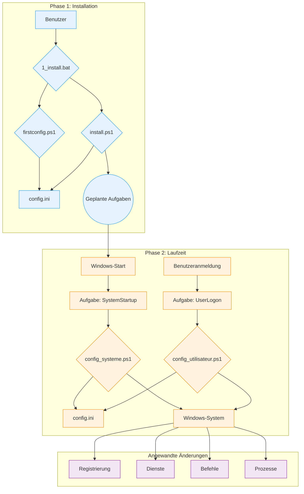

# Technische Dokumentation für WindowsOrchestrator

Dieses Dokument ist eine technische Referenz für das WindowsOrchestrator-Projekt. Es beschreibt die Architektur, die Komponenten und die Ausführungssequenz jedes Skripts.

[toc]

## 1. Projektübersicht

### 1.1. Zweck des Projekts

Das WindowsOrchestrator-Projekt automatisiert die Konfiguration eines Windows-Betriebssystems. Es führt Skripte aus, die Systemeinstellungen ändern und Anwendungen verwalten. Die von den Skripten durchgeführten Aktionen verwandeln eine Standard-Windows-Installation in eine Umgebung, deren Verhalten durch eine zentrale Konfigurationsdatei definiert wird.

Die Skripte lesen die Datei config.ini, um Befehle auszuführen, die Registrierungsschlüssel ändern, Windows-Dienste verwalten, Energieeinstellungen konfigurieren, geplante Aufgaben erstellen und den Lebenszyklus eines Benutzerprozesses verwalten.

Das Projekt stellt eine Reihe von Skripten zur Verfügung, die Konfigurationen für die Energieverwaltung, System-Updates, die Benutzersitzung und den Lebenszyklus einer Anwendung anwenden.

### 1.2. Funktionsprinzipien

Die Funktionsweise von WindowsOrchestrator basiert auf vier Hauptmechanismen.

1.  **Ausführung durch native Windows-Tools**
    Das Projekt verwendet in Windows integrierte Funktionen und Befehle: PowerShell 5.1, Aufgabenplanung, Registrierungs-Editor und Befehlszeilen-Dienstprogramme (`powercfg`, `shutdown`). Das Projekt erfordert keine Installation externer Abhängigkeiten.

2.  **Konfiguration über eine zentralisierte Datei**
    Die Ausführungslogik der Skripte ist von der Konfiguration getrennt. Die Skripte lesen die Datei `config.ini`, um die auszuführenden Aktionen zu bestimmen. Um das Verhalten der Skripte zu ändern, ändert ein Benutzer die Werte in der `config.ini`.

3.  **Trennung der Ausführungskontexte (System vs. Benutzer)**
    Das Projekt verwendet zwei unterschiedliche Ausführungskontexte:
    *   Das Skript **`config_systeme.ps1`** wird mit den Berechtigungen des Kontos `NT AUTHORITY\SYSTEM` ausgeführt und ändert die globalen Einstellungen des Computers (HKLM-Registrierung, Dienste, geplante Aufgaben).
    *   Das Skript **`config_utilisateur.ps1`** wird mit den Berechtigungen des angemeldeten Benutzers ausgeführt und verwaltet die Prozesse seiner Sitzung.

4.  **Idempotenz der Aktionen**
    Die Skripte sind so geschrieben, dass ihre wiederholte Ausführung denselben Endzustand erzeugt wie ihre einmalige Ausführung. Bevor eine Einstellung geändert wird, prüft ein Skript den aktuellen Zustand des Systems. Wenn der gewünschte Zustand bereits angewendet wurde, wiederholt das Skript die Änderungsaktion nicht.

## 2. Architektur und Schlüsselkomponenten

Die Architektur von WindowsOrchestrator verwendet native Windows-Komponenten. Jede Komponente hat eine definierte Rolle.

### 2.1. Architekturdiagramm

Der Ausführungsfluss und die Interaktionen zwischen den Komponenten werden durch das folgende Diagramm dargestellt:

Dieses Diagramm zeigt die Trennung zwischen der **Installationsphase**, die vom Benutzer initiiert wird, und der **Laufzeitphase**, einem automatisierten Zyklus, der von der Aufgabenplanung verwaltet wird.

### 2.2. Die Rolle der Aufgabenplanung

Die Windows-Aufgabenplanung ist die zentrale Komponente der Automatisierung. Sie führt die Konfigurationsskripte zu definierten Zeiten und mit den erforderlichen Berechtigungsstufen aus.

Die beiden Hauptaufgaben, die von `install.ps1` erstellt werden, sind:

*   **`WindowsOrchestrator-SystemStartup`**
    *   **Auslöser:** "Beim Systemstart".
    *   **Ausführungskontext:** `NT AUTHORITY\SYSTEM`. Dieses Konto verfügt über die erforderlichen Berechtigungen, um Registrierungsschlüssel in `HKEY_LOCAL_MACHINE` (HKLM) zu ändern, Dienste zu verwalten und Systembefehle auszuführen.
    *   **Rolle:** Alle Konfigurationen auf Maschinenebene ausführen.

*   **`WindowsOrchestrator-UserLogon`**
    *   **Auslöser:** "Bei Anmeldung" des angegebenen Benutzers.
    *   **Ausführungskontext:** Das Konto des angemeldeten Benutzers. Das Skript wird mit den Berechtigungen dieses Benutzers ausgeführt, was es ihm ermöglicht, grafische Anwendungen in der Sitzung des Benutzers zu starten.
    *   **Rolle:** Alle benutzersitzungsspezifischen Konfigurationen ausführen.

### 2.3. Die Datei `config.ini`: Quelle der Konfiguration

Die Datei `config.ini` enthält die Beschreibung des gewünschten Endzustands des Systems. Die PowerShell-Skripte (`config_systeme.ps1`, `config_utilisateur.ps1`) lesen diese Datei und führen die notwendigen Befehle aus, damit das System den definierten Einstellungen entspricht.

Dieser Mechanismus hat mehrere faktische Merkmale:
*   Das Verhalten der Skripte wird durch die in der Datei config.ini enthaltenen Schlüssel-Wert-Paare bestimmt.
*   Die Ausführungslogik ist in PowerShell-Skriptdateien (.ps1) enthalten, während die Parameter, die diese Logik steuern, aus einer .ini-Datei gelesen werden.
*   Die Skripte lesen die im Stammverzeichnis vorhandene Datei config.ini, was es separaten Instanzen des Projekts ermöglicht, je nach Inhalt ihrer eigenen config.ini-Datei unterschiedliche Verhaltensweisen aufzuweisen.

### 2.4. Das Internationalisierungssystem (i18n)

Das Projekt lädt übersetzte Texte, ohne den Quellcode zu ändern.

*   **Dateistruktur:** Die Texte werden in `.psd1`-Dateien gespeichert, die sich in Unterordnern des `i18n/`-Verzeichnisses befinden. Jeder Unterordner ist nach einem Kulturcode benannt (z. B. `fr-FR`, `en-US`).

*   **Erkennungs- und Lademechanismus:**
    1.  Zu Beginn seiner Ausführung führt ein Skript den Befehl `(Get-Culture).Name` aus, um den Kulturcode des Systems zu erhalten (z. B. `"fr-FR"`).
    2.  Das Skript erstellt den Pfad zur entsprechenden Sprachdatei (z. B. `i18n\fr-FR\strings.psd1`).
    3.  **Fallback-Logik:** Wenn diese Datei nicht existiert, verwendet das Skript den Pfad `i18n\en-US\strings.psd1`.
    4.  Der Inhalt der `.psd1`-Datei wird von `Invoke-Expression` gelesen und interpretiert, wodurch eine Hashtabelle mit Texten in eine `$lang`-Variable geladen wird.

*   **Verwendung im Code:**
    Um eine Nachricht anzuzeigen, greift der Code über einen Schlüssel auf die `$lang`-Hashtabelle zu (z. B. `$lang.Uninstall_StartMessage`). Die Protokollierungsfunktionen verwenden einen `-DefaultMessage`-Parameter, der einen englischen Text enthält, wenn ein Schlüssel nicht gefunden wird.

Um eine neue Sprache hinzuzufügen, muss ein Benutzer den Ordner `en-US` kopieren, ihn mit dem neuen Kulturcode umbenennen und die Werte in der Datei `strings.psd1` übersetzen.

## 3. Lebenszyklus und Ausführungssequenzen

Dieser Abschnitt unterteilt die Prozesse des Projekts in chronologische Ausführungssequenzen.

### 3.1. Vollständige Installationssequenz

1.  **Phase 1 - Start und Konfiguration (Benutzerkontext)**
    *   Der Benutzer führt `1_install.bat` aus.
    *   Das Batch-Skript führt `management\firstconfig.ps1` aus.
    *   **`firstconfig.ps1` wird ausgeführt:**
        *   Es prüft die Existenz der Datei `config.ini`. Wenn sie nicht vorhanden ist, wird sie aus der Vorlage `management/defaults/default_config.ini` erstellt. Wenn sie vorhanden ist, fragt es den Benutzer, ob er sie ersetzen möchte.
        *   Es zeigt eine Windows Forms-GUI an, die mit den aus `config.ini` gelesenen Werten vorausgefüllt ist.
        *   Wenn auf "Speichern und Schließen" geklickt wird, schreibt das Skript die Werte aus den Feldern der Benutzeroberfläche in `config.ini`.
        *   Das Skript `firstconfig.ps1` wird beendet.

2.  **Phase 2 - Erhöhung und Installation (Administratorkontext)**
    *   Das Skript `1_install.bat` wird fortgesetzt.
    *   Es führt einen PowerShell-Befehl aus, der `Start-Process PowerShell -Verb RunAs` verwendet, um `install.ps1` zu starten.
    *   Windows löst eine **Benutzerkontensteuerung (UAC)**-Aufforderung aus. Der Benutzer muss die Berechtigungen erteilen.
    *   **`install.ps1` wird mit Administratorrechten ausgeführt:**
        *   Es prüft das Vorhandensein der Dateien `config_systeme.ps1` und `config_utilisateur.ps1`.
        *   Es führt den Befehl `Register-ScheduledTask` aus, um zwei Aufgaben zu erstellen:
            *   **`WindowsOrchestrator-SystemStartup`**, das `config_systeme.ps1` beim Start (`-AtStartup`) mit dem Konto `NT AUTHORITY\SYSTEM` ausführt.
            *   **`WindowsOrchestrator-UserLogon`**, das `config_utilisateur.ps1` bei der Anmeldung (`-AtLogOn`) des Benutzers ausführt.
        *   Um die Konfiguration anzuwenden, führt das Skript `config_systeme.ps1` und dann `config_utilisateur.ps1` über `Start-Process -Wait` aus.
    *   Das Skript `install.ps1` wird beendet.

### 3.2. Ausführungssequenz beim Start (Laufzeit - Systemebene)

1.  **Auslöser:** Das Windows-Betriebssystem startet.
2.  **Aufgabenausführung:** Die Aufgabenplanung führt die Aufgabe `WindowsOrchestrator-SystemStartup` aus.
3.  **Skriptstart:** Die Aufgabe führt `powershell.exe` mit den Berechtigungen des Kontos `NT AUTHORITY\SYSTEM` aus, um `config_systeme.ps1` zu starten.
4.  **Aktionen von `config_systeme.ps1`:**
    *   Das Skript analysiert `config.ini` und lädt dessen Inhalt.
    *   Es prüft die Netzwerkverbindung (`Test-NetConnection 8.8.8.8 -Port 53`).
    *   Es führt die in `[SystemConfig]` definierten Konfigurationsblöcke aus. Für jede Aktion:
        *   Es liest den Wert des Schlüssels.
        *   Es prüft den aktuellen Zustand des Systems (Registrierungswert, Dienststatus).
        *   Wenn der aktuelle Zustand vom gewünschten Zustand abweicht, führt es den Änderungsbefehl aus (`Set-ItemProperty`, `powercfg`, etc.).
        *   Es zeichnet die Aktion oder den Fehler in Listen auf.
    *   Es sendet eine Gotify-Benachrichtigung (falls aktiviert).
5.  **Ende der Sequenz:** Das Skript wird beendet.

### 3.3. Ausführungssequenz bei der Anmeldung (Laufzeit - Benutzerebene)

1.  **Auslöser:** Der Benutzer meldet sich an.
2.  **Aufgabenausführung:** Die Aufgabenplanung führt die Aufgabe `WindowsOrchestrator-UserLogon` aus.
3.  **Skriptstart:** Die Aufgabe führt `powershell.exe` mit den Berechtigungen des Benutzers aus, um `config_utilisateur.ps1` zu starten (`-WindowStyle Hidden`).
4.  **Aktionen von `config_utilisateur.ps1`:**
    *   Das Skript analysiert `config.ini`.
    *   Es liest die Parameter aus dem Abschnitt `[Process]`.
    *   Es führt die Prozessverwaltungslogik aus:
        1.  Es löst Umgebungsvariablen im Prozesspfad auf.
        2.  Es sucht nach vorhandenen Prozessen, die dem Namen entsprechen und dem aktuellen Benutzer gehören (überprüft durch SID).
        3.  Wenn welche gefunden werden, beendet es sie (`Stop-Process -Force`).
        4.  Es startet eine neue Instanz des Prozesses.
    *   Es sendet eine Gotify-Benachrichtigung (falls aktiviert).
5.  **Ende der Sequenz:** Das Skript wird beendet.

### 3.4. Deinstallationssequenz

1.  **Auslöser:** Der Benutzer führt `2_uninstall.bat` aus.
2.  **Erhöhung:** Das Skript `2_uninstall.bat` startet `management\uninstall.ps1`, das sich selbst mit `Start-Process -Verb RunAs` neu startet. Der Benutzer muss die UAC-Aufforderung akzeptieren.
3.  **Aktionen von `uninstall.ps1`:**
    *   Das Skript stellt dem Benutzer eine Frage, um AutoLogon zu deaktivieren.
    *   Es stellt die Systemregistrierungsschlüssel wieder her:
        *   Windows Update (`NoAutoUpdate` -> `0`).
        *   Schnellstart (`HiberbootEnabled` -> `1`).
        *   OneDrive (Löschen von `DisableFileSyncNGSC`).
        *   AutoLogon (`AutoAdminLogon` -> `0`) falls angefordert.
    *   Es führt `Unregister-ScheduledTask` aus, um die vier geplanten Aufgaben zu entfernen.
    *   Es zeigt eine Zusammenfassung an und informiert, dass die Dateien nicht gelöscht werden.
4.  **Ende der Sequenz:** Das Skript wird beendet.

## 4. Installations- und Deinstallationsverfahren

Dieser Abschnitt beschreibt die Abfolgen von Operationen, die von den Batch-Skripten ausgeführt werden, um das System zu installieren, zu aktivieren, zu deinstallieren und wiederherzustellen.

### 4.1. Installationsverfahren

Das Verfahren wird durch Ausführen der Datei `1_install.bat` eingeleitet. Es ist in zwei verschiedene Phasen unterteilt.

#### 4.1.1. Phase 1: Konfiguration (Benutzerkontext)

1.  Die Datei `1_install.bat` führt das Skript `management\firstconfig.ps1` über den Befehl `powershell.exe` aus.
2.  Das Skript `firstconfig.ps1` prüft die Existenz der Datei `config.ini` im Projektstammverzeichnis.
    *   Wenn die Datei `config.ini` nicht existiert, wird sie durch Kopieren der Datei `management/defaults/default_config.ini` erstellt.
    *   Wenn die Datei `config.ini` existiert, wird ein `System.Windows.Forms.MessageBox`-Dialogfeld angezeigt, in dem der Benutzer gefragt wird, ob er die vorhandene Datei durch die Vorlage ersetzen möchte.
3.  Das Skript zeigt dann eine grafische Benutzeroberfläche (Windows Forms) an, deren Felder mit den aus der Datei `config.ini` gelesenen Werten vorausgefüllt sind.
4.  Wenn der Benutzer auf die Schaltfläche "Speichern und Schließen" klickt, werden die Werte aus den Feldern der Benutzeroberfläche über die Funktion `Set-IniValue` in die Datei `config.ini` geschrieben. Das Skript wird beendet.

#### 4.1.2. Phase 2: Installation der Aufgaben (Administratorkontext)

1.  Die Kontrolle kehrt zum Skript `1_install.bat` zurück. Es führt einen `powershell.exe`-Befehl aus, dessen einzige Aufgabe darin besteht, eine zweite Instanz von PowerShell über den Befehl `Start-Process PowerShell -Verb RunAs` zu starten.
2.  Diese Aktion löst eine UAC-Aufforderung (User Account Control) aus. Der Benutzer muss die Berechtigungen erteilen, um fortzufahren.
3.  Das Skript `management\install.ps1` wird mit Administratorrechten ausgeführt und führt die folgenden Aktionen aus:
    *   Es erstellt die geplante Aufgabe **`WindowsOrchestrator-SystemStartup`** über `Register-ScheduledTask`. Der Auslöser ist auf `-AtStartup` und der Ausführungsprinzipal ist `NT AUTHORITY\SYSTEM` (`-UserId "NT AUTHORITY\SYSTEM"`) gesetzt. Die Aktion ist die Ausführung des Skripts `config_systeme.ps1`.
    *   Es erstellt die geplante Aufgabe **`WindowsOrchestrator-UserLogon`** über `Register-ScheduledTask`. Der Auslöser ist auf `-AtLogOn` für den aktuellen Benutzer und der Ausführungsprinzipal ist derselbe Benutzer (`-UserId "$($env:USERDOMAIN)\$($env:USERNAME)"`) gesetzt. Die Aktion ist die Ausführung des Skripts `config_utilisateur.ps1`.

4.  Um die Konfiguration sofort anzuwenden, führt `install.ps1` nacheinander und unter Warten auf das Ende jedes Prozesses (`-Wait`) die Skripte `config_systeme.ps1` und dann `config_utilisateur.ps1` aus.

#### 4.1.3. Systemzustand nach der Installation

*   Zwei geplante Aufgaben, `WindowsOrchestrator-SystemStartup` und `WindowsOrchestrator-UserLogon`, werden in der Windows-Aufgabenplanung erstellt und sind aktiv.
*   Eine `config.ini`-Datei existiert im Stammverzeichnis des Projekts und enthält die vom Benutzer definierte Konfiguration.
*   Ein `Logs`-Verzeichnis ist im Stammverzeichnis des Projekts vorhanden und enthält die Protokolldateien der ursprünglichen Ausführung.
*   Die in `config.ini` definierten Systemeinstellungen wurden zum ersten Mal angewendet.

### 4.2. Deinstallationsverfahren

Das Verfahren wird durch Ausführen der Datei `2_uninstall.bat` eingeleitet.

#### 4.2.1. Erhöhung der Berechtigungen

1.  Die Datei `2_uninstall.bat` führt das Skript `management\uninstall.ps1` aus.
2.  Das Skript `uninstall.ps1` prüft seine eigene Berechtigungsstufe. Wenn es kein Administrator ist, startet es sich selbst über `Start-Process powershell.exe -Verb RunAs` neu, was eine UAC-Aufforderung auslöst, die der Benutzer bestätigen muss.

#### 4.2.2. Vom Skript ausgeführte Aktionen

Das Skript `management\uninstall.ps1`, das mit Administratorrechten ausgeführt wird, führt die folgenden Operationen aus:

1.  **Benutzerinteraktion:** Das Skript zeigt eine Aufforderung in der Konsole über `Read-Host` an und fragt den Benutzer, ob er die automatische Anmeldung deaktivieren möchte. Die Antwort des Benutzers wird in einer Variablen gespeichert.
2.  **Wiederherstellung der Systemeinstellungen:**
    *   Wenn der Benutzer mit `j` oder `y` geantwortet hat, schreibt das Skript den Zeichenfolgenwert `"0"` in den Registrierungsschlüssel `HKLM:\SOFTWARE\Microsoft\Windows NT\CurrentVersion\Winlogon\AutoAdminLogon`.
    *   Es schreibt den DWORD-Wert `0` in den Schlüssel `HKLM:\...\WindowsUpdate\AU\NoAutoUpdate`.
    *   Es schreibt den DWORD-Wert `0` in den Schlüssel `HKLM:\...\WindowsUpdate\AU\NoAutoRebootWithLoggedOnUsers`.
    *   Es schreibt den DWORD-Wert `1` in den Schlüssel `HKLM:\...\Power\HiberbootEnabled`.
    *   Es entfernt den Wert `DisableFileSyncNGSC` aus dem Schlüssel `HKLM:\...\OneDrive` über `Remove-ItemProperty`.
    *   Es ändert den Starttyp des `wuauserv`-Dienstes über `Set-Service` auf `Automatic`.
3.  **Löschen von geplanten Aufgaben:**
    *   Das Skript durchläuft eine vordefinierte Liste von Aufgabennamen und führt für jede `Unregister-ScheduledTask -Confirm:$false` aus. Die gelöschten Aufgaben sind:
        *   `WindowsOrchestrator-SystemStartup`
        *   `WindowsOrchestrator-UserLogon`
        *   `WindowsOrchestrator-SystemScheduledReboot`
        *   `WindowsOrchestrator-SystemPreRebootAction`

#### 4.2.3. Systemzustand nach der Deinstallation

*   Die vier projektbezogenen geplanten Aufgaben werden aus der Aufgabenplanung entfernt. Jede Automatisierung wird gestoppt.
*   Die oben aufgeführten Registrierungs- und Diensteinstellungen werden auf ihre Standardwerte zurückgesetzt.
*   Die durch den Befehl `powercfg` geänderten Energieeinstellungen werden vom Deinstallationsskript nicht geändert.
*   Das Projektverzeichnis, einschließlich aller Skripte, der Datei `config.ini` und der Protokolle, wird nicht gelöscht und verbleibt auf der Festplatte.

## 5. Detaillierte Konfigurationsanleitung (`config.ini`)

Die Datei `config.ini` ist das deklarative Kontrollzentrum des Projekts. Diese Anleitung beschreibt jeden Schlüssel, seine Auswirkung auf die Skriptausführung, seine möglichen Werte und seine Interaktionen mit anderen Einstellungen. Die Standardwerte sind die in der Datei `management/defaults/default_config.ini` angegebenen.

### 5.1. Abschnitt `[SystemConfig]`

Dieser Abschnitt regelt die Einstellungen, die das gesamte System betreffen, und wird ausschließlich von `config_systeme.ps1` gelesen.

---

**`AutoLoginUsername`**

*   **Rolle:** Gibt den Benutzernamen an, der in den Registrierungsschlüssel `DefaultUserName` geschrieben wird. Dieser Wert wird auch von der Logik der Vor-Neustart-Aktion verwendet, um den Pfad `%USERPROFILE%` aufzulösen.
*   **Mögliche Werte:** Eine Zeichenfolge, die einen lokalen oder Domänenbenutzernamen darstellt (z. B. `Admin`, `DOMÄNE\Benutzer`). Wenn der Wert leer gelassen wird, versucht das Skript, den bereits im Registrierungsschlüssel `DefaultUserName` vorhandenen Wert zu lesen.
*   **Standardwert:** "" (leere Zeichenfolge)
*   **Abhängigkeiten:** Dieser Parameter ist erforderlich, wenn `EnableAutoLogin` auf `true` gesetzt ist. Er ist auch notwendig, damit die Variable `%USERPROFILE%` im Schlüssel `PreRebootActionCommand` verwendet werden kann.

---

**`EnableAutoLogin`**

*   **Rolle:** Steuert den Zustand der automatischen Windows-Anmeldung.
*   **Skriptaktion:** Wenn der Wert `true` ist, schreibt das Skript `"1"` in den Registrierungsschlüssel `HKLM:\SOFTWARE\Microsoft\Windows NT\CurrentVersion\Winlogon\AutoAdminLogon`. Wenn der Wert `false` ist, schreibt es `"0"`.
*   **Mögliche Werte:** `true`, `false`
*   **Standardwert:** `false`
*   **Abhängigkeiten:** Erfordert, dass `AutoLoginUsername` korrekt konfiguriert ist, um voll funktionsfähig zu sein. **Hinweis für Entwickler:** Das Skript verwaltet nicht das Passwort (`DefaultPassword`), das außerhalb des Bandes konfiguriert werden muss (z. B. mit dem Sysinternals AutoLogon-Tool).

---

**`DisableFastStartup`**

*   **Rolle:** Steuert die Windows-Schnellstartfunktion (Hiberboot).
*   **Skriptaktion:** Wenn `true`, schreibt den Wert `0` (DWORD) in den Registrierungsschlüssel `HKLM:\...\Power\HiberbootEnabled`. Wenn `false`, schreibt `1`.
*   **Mögliche Werte:** `true`, `false`
*   **Standardwert:** `true`
*   **Abhängigkeiten:** Keine.

---

**`DisableSleep`** und **`DisableScreenSleep`**

*   **Rolle:** Verwalten den Ruhezustand des Computers und des Bildschirms.
*   **Skriptaktion:**
    *   Für `DisableSleep=true` werden die Befehle `powercfg /change standby-timeout-ac 0` und `powercfg /change hibernate-timeout-ac 0` ausgeführt.
    *   Für `DisableScreenSleep=true` wird der Befehl `powercfg /change monitor-timeout-ac 0` ausgeführt.
*   **Mögliche Werte:** `true`, `false`
*   **Standardwerte:** `DisableSleep=true`, `DisableScreenSleep=false`
*   **Abhängigkeiten:** Keine.

---

**`DisableWindowsUpdate`**

*   **Rolle:** Deaktiviert den Windows Update-Dienst vollständig.
*   **Skriptaktion:** Wenn `true`, führt das Skript drei Aktionen aus:
    1.  Schreibt den Wert `1` (DWORD) in den Schlüssel `HKLM:\...\WindowsUpdate\AU\NoAutoUpdate`.
    2.  Ändert den Starttyp des `wuauserv`-Dienstes auf `Disabled`.
    3.  Stoppt den `wuauserv`-Dienst (`Stop-Service`).
*   **Mögliche Werte:** `true`, `false`
*   **Standardwert:** `true`
*   **Abhängigkeiten:** Keine.

---

**`DisableAutoReboot`**

*   **Rolle:** Verhindert, dass Windows nach einem Update automatisch neu startet, wenn eine Benutzersitzung aktiv ist.
*   **Skriptaktion:** Wenn `true`, schreibt den Wert `1` (DWORD) in den Registrierungsschlüssel `HKLM:\...\WindowsUpdate\AU\NoAutoRebootWithLoggedOnUsers`.
*   **Mögliche Werte:** `true`, `false`
*   **Standardwert:** `true`
*   **Abhängigkeiten:** Diese Einstellung ist hauptsächlich relevant, wenn `DisableWindowsUpdate` auf `false` gesetzt ist.

---

**`ScheduledRebootTime`**

*   **Rolle:** Plant einen täglichen Neustart des Computers.
*   **Skriptaktion:** Wenn ein Wert angegeben wird, erstellt/aktualisiert das Skript eine geplante Aufgabe (`WindowsOrchestrator-SystemScheduledReboot`), die `shutdown.exe /r /f /t 60` zur angegebenen Zeit ausführt. Wenn der Wert leer ist, wird die geplante Aufgabe gelöscht.
*   **Mögliche Werte:** Eine Zeichenfolge im Format `HH:MM` (z. B. `03:00`) oder eine leere Zeichenfolge zum Deaktivieren.
*   **Standardwert:** `03:00`
*   **Abhängigkeiten:** Das Skript erstellt zwei separate geplante Aufgaben für die Vor-Neustart-Aktion und den Neustart. Die Windows-Aufgabenplanung führt jede Aufgabe zur angegebenen Zeit aus, ohne ihre chronologische Reihenfolge zu überprüfen.

---

**`PreRebootAction...`** (Gruppe von 4 Schlüsseln)

*   **Rolle:** Führt einen benutzerdefinierten Befehl vor dem geplanten Neustart aus. Dieser Block ist nur aktiv, wenn `PreRebootActionTime` und `PreRebootActionCommand` beide nicht leer sind.
*   **Skriptaktion:** Erstellt/aktualisiert eine geplante Aufgabe (`WindowsOrchestrator-SystemPreRebootAction`), die den angegebenen Befehl ausführt. Das Skript löst Umgebungsvariablen (`%USERPROFILE%`) und relative Pfade in `PreRebootActionCommand` auf.
*   **Schlüssel:**
    *   `PreRebootActionTime`: Auslösezeit (`HH:MM`).
    *   `PreRebootActionCommand`: Pfad zur ausführbaren Datei oder zum Skript.
    *   `PreRebootActionArguments`: An den Befehl zu übergebende Argumente.
    *   `PreRebootActionLaunchMethod`: Ausführungsmethode (`direct`, `powershell`, `cmd`).
*   **Standardwerte:** `02:55`, `"PreReboot.bat"`, `""`, `cmd`
*   **Abhängigkeiten:** Die Ausführung der Aufgabe 'WindowsOrchestrator-SystemPreRebootAction' ist unabhängig von der Existenz der Aufgabe 'WindowsOrchestrator-SystemScheduledReboot'.

---

**`DisableOneDrive`**

*   **Rolle:** Deaktiviert die OneDrive-Integration über eine Systemrichtlinie.
*   **Skriptaktion:** Wenn `true`, schreibt den Wert `1` (DWORD) in den Registrierungsschlüssel `HKLM:\...\OneDrive\DisableFileSyncNGSC`. Wenn `false`, wird der Schlüssel gelöscht.
*   **Mögliche Werte:** `true`, `false`
*   **Standardwert:** `true`
*   **Abhängigkeiten:** Keine.

### 5.2. Abschnitt `[Process]`

Dieser Abschnitt, der von `config_utilisateur.ps1` gelesen wird, beschreibt, wie die Hauptgeschäftsanwendung verwaltet wird. Die Funktionsweise basiert auf dem folgenden voneinander abhängigen Trio von Schlüsseln:

*   **`ProcessName` (Das "Was")**
    *   **Rolle:** Definiert den vollständigen Pfad zur ausführbaren Datei oder zum zu startenden Skript. Dies ist das Hauptziel der Aktion.
    *   **Skriptaktion:** Das Skript verwendet diesen Wert, um den zu beendenden Prozess zu identifizieren und als Ziel des Startbefehls. Es unterstützt System- und Benutzerumgebungsvariablen (z. B. `%USERPROFILE%`, `%PROGRAMFILES%`), die zur Laufzeit dynamisch aufgelöst werden.

*   **`ProcessArguments` (Das "Womit")**
    *   **Rolle:** Gibt die Befehlszeilenargumente an, die an die in `ProcessName` definierte ausführbare Datei/das Skript übergeben werden sollen.
    *   **Skriptaktion:** Diese Zeichenfolge wird an den Ausführungsbefehl angehängt. Wenn sie leer ist, werden keine Argumente übergeben.

*   **`LaunchMethod` (Das "Wie")**
    *   **Rolle:** Gibt den Befehlsinterpreter an, der zum Starten von `ProcessName` verwendet werden soll. Diese Wahl ist entscheidend für die Kompatibilität.
    *   **Skriptaktion:** Das Skript erstellt den endgültigen Befehl je nach Wert unterschiedlich:
        *   `direct`: Startet die ausführbare Datei direkt. Der Befehl lautet `ProcessName "ProcessArguments"`. Dies ist die Standardmethode für `.exe`-Dateien.
        *   `cmd`: Startet über den `cmd.exe`-Befehlsinterpreter. Der generierte Befehl lautet `cmd.exe /c ""ProcessName" ProcessArguments"`. Dies ist die empfohlene Methode für Batch-Skripte (`.bat`, `.cmd`).
        *   `powershell`: Startet über PowerShell. Der generierte Befehl lautet `powershell.exe -NoProfile -ExecutionPolicy Bypass -Command "& 'ProcessName' ProcessArguments'"`. Dies ist die ideale Methode zum Ausführen anderer PowerShell-Skripte (`.ps1`).

### 5.3. Abschnitt `[Logging]`

Dieser Abschnitt konfiguriert das Verhalten von Protokolldateien.

*   **`EnableLogRotation`**
    *   **Rolle:** Aktiviert oder deaktiviert den Mechanismus zur Archivierung von Protokollen.
    *   **Skriptaktion:** Wenn `true`, wird vor dem Schreiben in eine Protokolldatei (`log.txt`) die Funktion `Rotate-LogFile` aufgerufen. Sie benennt `log.txt` in `log.1.txt`, `log.1.txt` in `log.2.txt` usw. um, bis zum Limit, und löscht die älteste. Wenn `false`, wird diese Funktion nicht aufgerufen und die Protokolldatei wächst unbegrenzt.
*   **`MaxSystemLogsToKeep` und `MaxUserLogsToKeep`**
    *   **Rolle (beabsichtigt):** Diese Schlüssel sind in `default_config.ini` vorgesehen, um die Anzahl der zu behaltenden archivierten Protokolldateien zu definieren.
    *   **Skriptaktion (aktuell):** Die Schlüssel MaxSystemLogsToKeep und MaxUserLogsToKeep werden vom Skript config_systeme.ps1 nicht gelesen. Die Funktion Rotate-LogFile wird mit einem festen Wert von 7 aufgerufen, der durch die Variable $DefaultMaxLogs definiert ist.

### 5.4. Abschnitt `[Gotify]`

Dieser Abschnitt steuert das Senden von Statusbenachrichtigungen an einen Gotify-Server.

*   **`EnableGotify`**: Wenn `true`, versuchen die Skripte am Ende ihrer Ausführung eine Benachrichtigung zu senden.
*   **`Url`**: Die Basis-URL der Gotify-Instanz (z. B. `http://gotify.example.com`).
*   **`Token`**: Das in Gotify generierte Anwendungs-Token zur Autorisierung des Nachrichtenversands.
*   **`Priority`**: Eine Ganzzahl, die die Nachrichtenpriorität in Gotify definiert.
*   **`GotifyTitle...`** (Gruppe von 4 Schlüsseln):
    *   **Rolle:** Vorlagen für Benachrichtigungstitel.
    *   **Skriptaktion:** Vor dem Senden der Benachrichtigung nimmt das Skript die Zeichenfolge aus dem entsprechenden Schlüssel (z. B. `GotifyTitleErrorSystem`) und ersetzt die literalen Zeichenfolgen `%COMPUTERNAME%` und `%USERNAME%` durch die Werte der entsprechenden Umgebungsvariablen.

## 6. Detaillierte Skriptbeschreibung (Code-Referenz)

Dieser Abschnitt dient als Referenz für den Quellcode. Er zerlegt die Logik und die internen Mechanismen jedes Hauptskripts des Projekts.

### 6.1. Orchestrierungsskripte (`management/`)

Diese Skripte verwalten den Lebenszyklus des Projekts (Installation, Erstkonfiguration, Deinstallation). Sie sind für die manuelle Ausführung durch den Benutzer konzipiert.

#### **`firstconfig.ps1`**

*   **Rolle:** Bereitstellung einer grafischen Benutzeroberfläche (GUI) für eine unterstützte Konfiguration der Datei `config.ini`.
*   **GUI-Logik:**
    *   Das Skript verwendet die .NET-Assemblys `System.Windows.Forms` und `System.Drawing`, die über `Add-Type` geladen werden, um die Objekte der Benutzeroberfläche (Form, Label, TextBox, CheckBox, Button) dynamisch zu erstellen.
    *   Die Positionierung der Steuerelemente wird durch Variablen (`$xPadding`, `$yCurrent`) verwaltet, die nach dem Hinzufügen jedes Elements inkrementiert werden.
    *   Die Sprache der Benutzeroberfläche wird dynamisch aus den `strings.psd1`-Dateien geladen.
*   **`config.ini`-Verwaltung:**
    *   **Lesen:** Beim Start liest das Skript die aktuellen Werte aus `config.ini` mit einer lokalen `Get-IniValue`-Funktion. Diese Funktion liest die Datei Zeile für Zeile, um die Werte zu extrahieren. `true`/`false`-Werte werden für die `CheckBoxes` in `[bool]`-PowerShell-Typen konvertiert.
    *   **Schreiben:** Beim Klick auf die Schaltfläche "Speichern" ruft das `Add_Click`-Ereignis die lokale `Set-IniValue`-Funktion für jeden Parameter auf. Diese Funktion baut den Inhalt der Datei im Speicher neu auf, bevor sie ihn mit UTF-8-Kodierung auf die Festplatte schreibt.

#### **`install.ps1`**

*   **Rolle:** Erstellen der Systempersistenz durch Installation geplanter Aufgaben und erstmalige Ausführung der Laufzeitskripte.
*   **Selbsterhöhungsmechanismus:** Das Skript prüft seine Berechtigungsstufe über `New-Object Security.Principal.WindowsPrincipal`. Wenn es nicht "Administrator" ist, startet es sich selbst mit `Start-Process powershell.exe -Verb RunAs` neu.
*   **Logik zur Aufgabenerstellung:**
    *   Das Skript verwendet die nativen Cmdlets `New-ScheduledTaskAction`, `New-ScheduledTaskTrigger`, `New-ScheduledTaskPrincipal`, `New-ScheduledTaskSettingsSet` und `Register-ScheduledTask`.
    *   **Prinzipalverwaltung:**
        *   Für `...-SystemStartup` verwendet es `-UserId "NT AUTHORITY\SYSTEM" -RunLevel Highest`.
        *   Für `...-UserLogon` verwendet es `-UserId "$($env:USERDOMAIN)\$($env:USERNAME)" -LogonType Interactive`.
*   **Ausführung nach der Installation:**
    *   Nach der Registrierung der Aufgaben führt das Skript `config_systeme.ps1` und dann `config_utilisateur.ps1` über `Start-Process -Wait` aus.

#### **`uninstall.ps1`**

*   **Rolle:** Entfernen von Automatisierungskomponenten und Wiederherstellen kritischer Systemeinstellungen.
*   **Wiederherstellungslogik:**
    *   Das Skript enthält hartcodierte Windows-"Standard"-Werte in seinem Code, um den Systemzustand wiederherzustellen.
    *   Es verwendet dieselben Cmdlets wie `config_systeme.ps1` (`Set-ItemProperty`, `Set-Service`), aber mit den umgekehrten Werten.
    *   Die Operationen sind in `try...catch`-Blöcken gekapselt.
*   **Bereinigungslogik:**
    *   Es verwendet eine vordefinierte Liste (`$TasksToRemove`), die die Namen der vier geplanten Aufgaben enthält.
    *   Es durchläuft diese Liste und führt `Get-ScheduledTask` aus, um zu prüfen, ob die Aufgabe existiert, und dann `Unregister-ScheduledTask -Confirm:$false`, um sie zu löschen.

### 6.2. Laufzeitskripte (Stammverzeichnis)

Diese Skripte enthalten die Hauptgeschäftslogik und werden automatisch von den geplanten Aufgaben ausgeführt.

#### **`config_systeme.ps1`**

*   **Skriptarchitektur:** Das Skript ist in mehrere Bereiche gegliedert: Grundfunktionen, Hilfsfunktionen, Initialisierung und der Hauptausführungsblock (`try...catch...finally`).
*   **Schlüsselfunktionen:**
    *   `Get-IniContent`: Analysiert `config.ini` und wandelt es in eine verschachtelte PowerShell-Hashtabelle um (`$ini['Section']['Key']`).
    *   `Get-ConfigValue`: Dies ist ein Wrapper für den Zugriff auf die Konfiguration. Er behandelt fehlende Schlüssel/Abschnitte, stellt Standardwerte bereit und führt eine Typkonvertierung durch.
    *   `Add-Action` / `Add-Error`: Diese Funktionen zentralisieren die Protokollierung. Sie fügen Nachrichten zu globalen Listen hinzu (`$Global:ActionsEffectuees`, `$Global:ErreursRencontrees`), die zum Erstellen des Gotify-Berichts verwendet werden.
*   **Ausführungslogik:** Der Hauptteil des Skripts ist eine Sequenz von Konfigurationsblöcken. Jeder Block ist idempotent: Er liest zuerst den aktuellen Zustand des Systems (Registrierungswert, Dienststatus), bevor er schreibt.

#### **`config_utilisateur.ps1`**

*   **Rolle:** Sicherstellen, dass die in `[Process]` definierte Geschäftsanwendung im gewünschten Zustand ist (eine einzige, frisch gestartete Instanz).
*   **Prozessverwaltungslogik:**
    1.  **Pfadauflösung:** Der `ProcessName` wird von `[System.Environment]::ExpandEnvironmentVariables()` verarbeitet, um Variablen wie `%USERPROFILE%` aufzulösen.
    2.  **Besitzeridentifikation:** Die Suche nach dem vorhandenen Prozess verwendet `Get-Process`, um Prozesse nach Namen zu finden, und dann `Get-CimInstance Win32_Process`, um den Besitzer jedes Prozesses abzurufen. Es vergleicht die SID des Prozessbesitzers mit der SID des aktuellen Benutzers (`[System.Security.Principal.WindowsIdentity]::GetCurrent().User.Value`).
    3.  **Stoppen und Neustarten:** Wenn ein passender Prozess gefunden wird, wird er über `Stop-Process -Force` beendet. Anschließend wird eine neue Instanz mit `Start-Process` gestartet. Für den Aufruf von `Start-Process` wird "Splatting" (`@startProcessSplat`) verwendet.

### 6.3. Hilfsskripte und Starter

Diese Skripte sind entweder Support-Tools oder Integrationsbeispiele.

#### **`Close-AppByTitle.ps1`**

*   **Interaktion mit `user32.dll`:**
    *   Es injiziert eine C#-Klasse über `Add-Type -TypeDefinition` in den Speicher. Dieser C#-Code verwendet `[DllImport("user32.dll")]`-Attribute, um Windows-API-Funktionen für PowerShell verfügbar zu machen.
    *   Die `EnumWindows`-Funktion wird mit einem PowerShell-Skriptblock als "Callback" verwendet. Für jedes von der API gefundene Fenster wird dieser PowerShell-Block ausgeführt. In diesem Block wird der Fenstertitel überprüft.
    *   Sobald das Zielfenster durch sein `Handle` identifiziert ist, wird `SetForegroundWindow` aufgerufen, um ihm den Fokus zu geben, und dann simuliert `[System.Windows.Forms.SendKeys]::SendWait()` Tastatureingaben.

#### **`PreReboot.bat` und `LaunchApp.bat`**

*   **Portabilität:** Die Funktionsweise dieser Starter beruht auf der speziellen Batch-Skript-Variable `%~dp0`, die sich zum vollständigen Pfad des Verzeichnisses auflöst, in dem sich das Skript befindet.

#### **`management/tools/Find-WindowInfo.ps1`**

*   **Nützlichkeit:** Dieses Skript ist ein Debugging- und Konfigurationstool.
*   **Funktionsweise:** Es verwendet dieselbe C#-Code-Injektions- und `EnumWindows`-API-Aufruftechnik wie `Close-AppByTitle.ps1`. Es zeigt eine formatierte Liste der sichtbaren Fenster mit dem Prozessnamen und seiner PID an.

## 7. Wartungs- und Debugging-Verfahren

Dieser Abschnitt enthält praktische Anleitungen zur Diagnose von Problemen und zum Testen von Änderungen.

### 7.1. Verstehen und Verwenden von Protokollen (`Logs/`)

*   **Speicherort:** Protokolle werden im Unterordner `Logs/` erstellt.
    *   `config_systeme_ps_log.txt`: Enthält Protokolle des Systemskripts.
    *   `config_utilisateur_log.txt`: Enthält Protokolle des Benutzerskripts.
*   **Struktur der Protokollnachrichten:** `JJJJ-MM-TT HH:mm:ss [EBENE] [Kontext] - Nachricht`
*   **So identifizieren Sie Aktionen und Fehler:**
    *   **Erfolgreiche Aktionen:** `ACTION: ...`
    *   **Erfasste Fehler:** `CAPTURED ERROR: ...`
    *   **Fatale Fehler:** `FATAL SCRIPT ERROR ...`

### 7.2. Manuelles Debuggen von Skripten

#### **Ausführen von `config_systeme.ps1` mit `SYSTEM`-Rechten**

1.  **Voraussetzung:** Laden Sie `PsExec.exe` aus der Microsoft Sysinternals-Suite herunter.
2.  **Ausführungsverfahren:**
    *   Öffnen Sie eine Eingabeaufforderung als Administrator.
    *   Führen Sie den Befehl aus: `PsExec.exe -s -i powershell.exe`
    *   Ein neues PowerShell-Fenster wird geöffnet. Der Befehl `whoami` gibt `nt authority\system` zurück.
    *   Navigieren Sie in diesem Fenster zum Projektverzeichnis und führen Sie `.\config_systeme.ps1` aus.

#### **Testen von `config_utilisateur.ps1` in einer Benutzersitzung**

1.  **Ausführungsverfahren:**
    *   Melden Sie sich mit dem Zielbenutzerkonto bei einer Windows-Sitzung an.
    *   Öffnen Sie eine Standard-PowerShell-Konsole.
    *   Navigieren Sie zum Projektverzeichnis und führen Sie `.\config_utilisateur.ps1` aus.

#### **Überprüfen des Status von geplanten Aufgaben**

1.  **Öffnen Sie das Tool:** Führen Sie `taskschd.msc` aus.
2.  **Finden Sie die Aufgaben:** Wählen Sie "Aufgabenplanungsbibliothek".
3.  **Analysieren Sie die Informationen:**
    *   Überprüfen Sie die Spalten "Status", "Auslöser" und "Ergebnis des letzten Laufs" (ein Code von `0x0` bedeutet Erfolg).
    *   Konsultieren Sie die Registerkarte "Verlauf" für Details zu jeder Ausführung.

### **7.3. Sicherheitsaspekte**

Dieser Abschnitt beschreibt die Sicherheitsmechanismen und -auswirkungen im Zusammenhang mit dem Betrieb des Projekts.

*   **Ausführungskontext von Systemaufgaben**  
    Das Skript `install.ps1` konfiguriert die geplante Aufgabe `WindowsOrchestrator-SystemStartup` so, dass sie mit den Berechtigungen des Kontos `NT AUTHORITY\SYSTEM` ausgeführt wird. Dieses Konto verfügt über weitreichende Berechtigungen auf dem lokalen System, was erforderlich ist, damit das Skript `config_systeme.ps1` Registrierungsschlüssel im Hive `HKEY_LOCAL_MACHINE` (HKLM) ändern und Systemdienste verwalten kann.

*   **Mechanismus zur Erhöhung der Berechtigungen (UAC)**  
    Die Installations- (`1_install.bat`) und Deinstallationsskripte (`2_uninstall.bat`) müssen nicht aus einer Administratorsitzung gestartet werden. Sie führen einen `Start-Process -Verb RunAs`-Befehl aus, der eine UAC-Aufforderung (User Account Control) von Windows auslöst. Die Fortsetzung der Ausführung ist von der Bestätigung dieser Aufforderung durch den Benutzer abhängig.

*   **Verwaltung von Sitzungskennwörtern**  
    Die Skripte des Projekts **verarbeiten, fordern oder speichern keine** Benutzerkennwörter in irgendeiner Form. Die Aktivierung der AutoLogon-Funktion (`EnableAutoLogin=true`) schreibt lediglich den Wert `"1"` in den Registrierungsschlüssel `AutoAdminLogon`. Der Schlüssel `DefaultPassword` wird von den Skripten niemals geschrieben. Die Verantwortung für die sichere Speicherung des Kennworts in der Registrierung liegt beim Benutzer, über ein externes Tool wie `Sysinternals AutoLogon`.

*   **Umgehung der Ausführungsrichtlinie**  
    Die Startskripte (`.bat`) und die Befehle zur Erstellung geplanter Aufgaben verwenden systematisch das Argument `-ExecutionPolicy Bypass` beim Aufruf von `powershell.exe`. Dieses Argument ermöglicht die Ausführung der Skripte unabhängig von der auf dem System konfigurierten Ausführungsrichtlinie. Diese Einstellung gilt nur für die Instanz des gestarteten Prozesses und ändert die Sicherheitsrichtlinie des Systems nicht dauerhaft.

### **7.4. Bekannte Einschränkungen**

Dieser Abschnitt dokumentiert Verhaltensweisen, die das Ergebnis von Designentscheidungen sind oder zu diesem Zeitpunkt nicht implementierte Funktionen darstellen.

*   **Keine Wiederherstellung der Energieeinstellungen**  
    Das Skript `uninstall.ps1` führt keine `powercfg`-Befehle aus. Daher werden die von `config_systeme.ps1` vorgenommenen Änderungen bezüglich des Ruhezustands des Computers (`standby-timeout-ac`) oder des Bildschirms (`monitor-timeout-ac`) bei der Deinstallation nicht rückgängig gemacht.

*   **Inaktive Konfiguration der Protokollrotation**  
    Die Konfigurationsvorlagendatei (`default_config.ini`) enthält die Schlüssel `MaxSystemLogsToKeep` und `MaxUserLogsToKeep`. Die Funktion `Rotate-LogFile` in `config_systeme.ps1` liest diese Schlüssel jedoch nicht. Sie verwendet einen festen Wert von `7`, der im Skript durch die Variable `$DefaultMaxLogs` definiert ist.

*   **Fehlen einer chronologischen Validierung von Neustartaufgaben**  
    Das Skript `config_systeme.ps1` erstellt die geplanten Aufgaben für die Vor-Neustart-Aktion und den geplanten Neustart als zwei unabhängige Entitäten. Das Skript enthält keine Logik, um zu überprüfen, ob der Wert von `PreRebootActionTime` chronologisch vor dem von `ScheduledRebootTime` liegt.

## 8. Anhang

### 8.1. Lizenz

Dieses Projekt wird unter den Bedingungen der **GNU General Public License v3 (GPLv3)** vertrieben. Der vollständige Text der Lizenz ist im Stammverzeichnis des Projekts in der Datei `LICENSE` verfügbar.

### 8.2. Glossar der Begriffe

---
**UAC (User Account Control / Benutzerkontensteuerung)**
*   **Definition:** Ein Sicherheitsmechanismus von Windows, der eine Bestätigung des Benutzers erfordert, bevor eine Aktion zugelassen wird, die Administratorrechte erfordert.
*   **Kontext im Projekt:** Wird von `install.ps1` und `uninstall.ps1` über den Parameter `-Verb RunAs` des Befehls `Start-Process` ausgelöst.
---
**Geplante Aufgabe (Scheduled Task)**
*   **Definition:** Eine Komponente des Windows-Dienstes "Aufgabenplanung", die die automatische Ausführung eines Skripts oder Programms ermöglicht.
*   **Kontext im Projekt:** Der zentrale Mechanismus der Automatisierung.
---
**Windows-Registrierung (Windows Registry)**
*   **Definition:** Eine hierarchische Datenbank, in der Windows Konfigurationseinstellungen speichert.
*   **Kontext im Projekt:** Das Hauptziel der Änderungen von `config_systeme.ps1`.
---
**HKLM (HKEY_LOCAL_MACHINE)**
*   **Definition:** Der Registrierungs-Hive, der Einstellungen enthält, die für den gesamten Computer gelten.
*   **Kontext im Projekt:** Alle Registrierungsänderungen von `config_systeme.ps1` befinden sich in HKLM.
---
**SID (Security Identifier / Sicherheitskennung)**

*   **Definition:** Eine eindeutige Zeichenfolge, die einen Sicherheitsprinzipal (Benutzer, Gruppe) identifiziert.
*   **Kontext im Projekt:** Wird von `config_utilisateur.ps1` verwendet, um den Besitzer eines Prozesses zu identifizieren.
---
**`NT AUTHORITY\SYSTEM` (SYSTEM-Konto)**
*   **Definition:** Ein internes Windows-Dienstkonto mit weitreichenden Berechtigungen auf dem lokalen System.
*   **Kontext im Projekt:** Der Ausführungskontext von `config_systeme.ps1`.
---
**Idempotenz**
*   **Definition:** Eine Eigenschaft einer Operation, die bei mehrfacher Anwendung dasselbe Ergebnis liefert wie bei einmaliger Anwendung.
*   **Kontext im Projekt:** Ein Designprinzip der Skripte, um einen stabilen Endzustand zu gewährleisten.
---
**PowerShell-Ausführungsrichtlinie (Execution Policy)**
*   **Definition:** Eine Sicherheitsfunktion von PowerShell, die bestimmt, ob Skripte ausgeführt werden können.
*   **Kontext im Projekt:** Wird über den Parameter `-ExecutionPolicy Bypass` umgangen, um die Ausführung von Skripten sicherzustellen.
