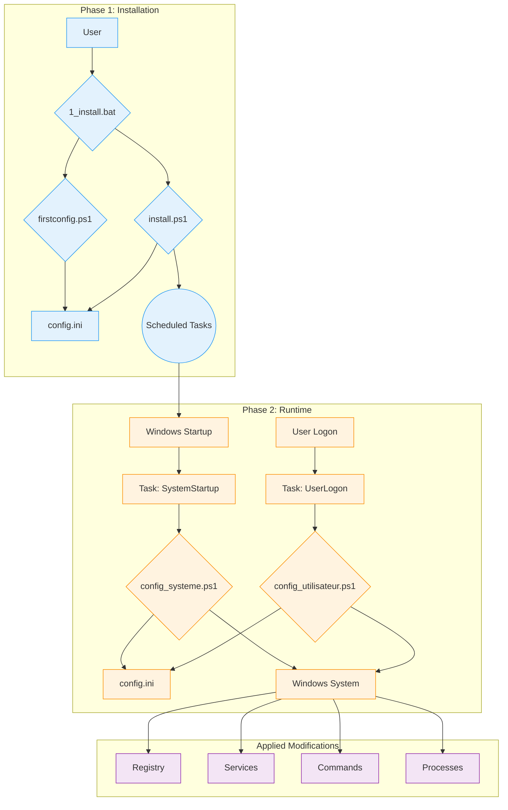

# WindowsOrchestrator Technical Documentation

This document is a technical reference for the WindowsOrchestrator project. It details the architecture, components, and execution sequence of each script.

[toc]

## 1. Project Overview

### 1.1. Project's Purpose

The WindowsOrchestrator project automates the configuration of a Windows operating system. It runs scripts that modify system settings and manage applications. The actions performed by the scripts transform a standard Windows installation into an environment whose behavior is defined by a central configuration file.

The scripts read the config.ini file to execute commands that modify Registry keys, manage Windows services, configure power settings, create scheduled tasks, and manage the lifecycle of a user process.

The project provides a set of scripts that apply configurations for power management, system updates, user session, and an application's lifecycle.

### 1.2. Operating Principles

The operation of WindowsOrchestrator is based on four main mechanisms.

1.  **Execution by Native Windows Tools**
    The project uses features and commands built into Windows: PowerShell 5.1, Task Scheduler, Registry Editor, and command-line utilities (`powercfg`, `shutdown`). The project does not require the installation of any external dependencies.

2.  **Configuration via a Centralized File**
    The execution logic of the scripts is separate from the configuration. The scripts read the `config.ini` file to determine the actions to be performed. To change the behavior of the scripts, a user modifies the values in `config.ini`.

3.  **Separation of Execution Contexts (System vs. User)**
    The project uses two distinct execution contexts:
    *   The **`config_systeme.ps1`** script runs with the permissions of the `NT AUTHORITY\SYSTEM` account and modifies the machine's global settings (HKLM Registry, services, scheduled tasks).
    *   The **`config_utilisateur.ps1`** script runs with the permissions of the logged-in user and manages the processes of their session.

4.  **Idempotence of Actions**
    The scripts are written so that running them repeatedly produces the same final state as running them once. Before modifying a setting, a script checks the current state of the system. If the desired state is already applied, the script does not repeat the modification action.

## 2. Architecture and Key Components

The architecture of WindowsOrchestrator uses native Windows components. Each component has a defined role.

### 2.1. Architecture Diagram

The execution flow and interactions between components are represented by the following diagram:

This diagram shows the separation between the **installation phase**, initiated by the user, and the **runtime phase**, an automated cycle managed by the Task Scheduler.

### 2.2. The Role of the Task Scheduler

The Windows Task Scheduler is the central component of the automation. It executes the configuration scripts at defined times and with the required privilege levels.

The two main tasks created by `install.ps1` are:

*   **`WindowsOrchestrator-SystemStartup`**
    *   **Trigger:** "At system startup".
    *   **Execution Context:** `NT AUTHORITY\SYSTEM`. This account has the required privileges to modify Registry keys in `HKEY_LOCAL_MACHINE` (HKLM), manage services, and run system commands.
    *   **Role:** To execute all machine-level configurations.

*   **`WindowsOrchestrator-UserLogon`**
    *   **Trigger:** "At log on" of the specified user.
    *   **Execution Context:** The logged-in user's account. The script runs with this user's privileges, allowing it to launch graphical applications in the user's session.
    *   **Role:** To execute all user-session-specific configurations.

### 2.3. The `config.ini` File: Source of Configuration

The `config.ini` file contains the description of the desired final state of the system. The PowerShell scripts (`config_systeme.ps1`, `config_utilisateur.ps1`) read this file and execute the necessary commands to make the system conform to the defined settings.

This mechanism has several factual characteristics:
*   The behavior of the scripts is determined by the key-value pairs contained in the config.ini file.
*   The execution logic is contained in PowerShell script files (.ps1), while the parameters that control this logic are read from an .ini file.
*   The scripts read the config.ini file present in their root directory, which allows separate instances of the project to have different behaviors depending on the content of their own config.ini file.

### 2.4. The Internationalization (i18n) System

The project loads translated strings without modifying the source code.

*   **File Structure:** The strings are stored in `.psd1` files located in subfolders of the `i18n/` directory. Each subfolder is named after a culture code (e.g., `fr-FR`, `en-US`).

*   **Detection and Loading Mechanism:**
    1.  At the beginning of its execution, a script runs the `(Get-Culture).Name` command to get the system's culture code (e.g., `"fr-FR"`).
    2.  The script constructs the path to the corresponding language file (e.g., `i18n\fr-FR\strings.psd1`).
    3.  **Fallback Logic:** If this file does not exist, the script uses the path `i18n\en-US\strings.psd1`.
    4.  The content of the `.psd1` file is read and interpreted by `Invoke-Expression`, which loads a hash table of strings into a `$lang` variable.

*   **Usage in Code:**
    To display a message, the code accesses the `$lang` hash table via a key (e.g., `$lang.Uninstall_StartMessage`). The logging functions use a `-DefaultMessage` parameter containing an English text if a key is not found.

To add a new language, a user must copy the `en-US` folder, rename it with the new culture code, and translate the values in the `strings.psd1` file.

## 3. Lifecycle and Execution Sequences

This section breaks down the project's processes into chronological execution sequences.

### 3.1. Complete Installation Sequence

1.  **Phase 1 - Launch and Configuration (User Context)**
    *   The user runs `1_install.bat`.
    *   The batch script executes `management\firstconfig.ps1`.
    *   **`firstconfig.ps1` runs:**
        *   It checks for the existence of the `config.ini` file. If it is absent, it creates it from the `management/defaults/default_config.ini` template. If it is present, it asks the user if they want to replace it.
        *   It displays a Windows Forms GUI, pre-filled with the values read from `config.ini`.
        *   When "Save and Close" is clicked, the script writes the values from the interface fields into `config.ini`.
        *   The `firstconfig.ps1` script terminates.

2.  **Phase 2 - Elevation and Installation (Administrator Context)**
    *   The `1_install.bat` script resumes.
    *   It executes a PowerShell command that uses `Start-Process PowerShell -Verb RunAs` to launch `install.ps1`.
    *   Windows triggers a **User Account Control (UAC)** prompt. The user must grant privileges.
    *   **`install.ps1` runs with Administrator privileges:**
        *   It checks for the presence of `config_systeme.ps1` and `config_utilisateur.ps1` files.
        *   It runs the `Register-ScheduledTask` command to create two tasks:
            *   **`WindowsOrchestrator-SystemStartup`**, which runs `config_systeme.ps1` at startup (`-AtStartup`) with the `NT AUTHORITY\SYSTEM` account.
            *   **`WindowsOrchestrator-UserLogon`**, which runs `config_utilisateur.ps1` at logon (`-AtLogOn`) of the user.
        *   To apply the configuration, the script runs `config_systeme.ps1` and then `config_utilisateur.ps1` via `Start-Process -Wait`.
    *   The `install.ps1` script terminates.

### 3.2. Startup Execution Sequence (Runtime - System Level)

1.  **Trigger:** The Windows operating system starts.
2.  **Task Execution:** The Task Scheduler runs the `WindowsOrchestrator-SystemStartup` task.
3.  **Script Launch:** The task executes `powershell.exe` with `NT AUTHORITY\SYSTEM` account privileges to launch `config_systeme.ps1`.
4.  **Actions of `config_systeme.ps1`:**
    *   The script parses `config.ini` and loads its content.
    *   It checks network connectivity (`Test-NetConnection 8.8.8.8 -Port 53`).
    *   It executes the configuration blocks defined in `[SystemConfig]`. For each action:
        *   It reads the key's value.
        *   It checks the current state of the system (registry value, service state).
        *   If the current state is different from the desired state, it executes the modification command (`Set-ItemProperty`, `powercfg`, etc.).
        *   It records the action or error in lists.
    *   It sends a Gotify notification (if enabled).
5.  **End of Sequence:** The script terminates.

### 3.3. Logon Execution Sequence (Runtime - User Level)

1.  **Trigger:** The user logs on.
2.  **Task Execution:** The Task Scheduler runs the `WindowsOrchestrator-UserLogon` task.
3.  **Script Launch:** The task executes `powershell.exe` with the user's privileges to launch `config_utilisateur.ps1` (`-WindowStyle Hidden`).
4.  **Actions of `config_utilisateur.ps1`:**
    *   The script parses `config.ini`.
    *   It reads the parameters from the `[Process]` section.
    *   It executes the process management logic:
        1.  It resolves environment variables in the process path.
        2.  It searches for existing processes that match the name and belong to the current user (verified by SID).
        3.  If any are found, it terminates them (`Stop-Process -Force`).
        4.  It launches a new instance of the process.
    *   It sends a Gotify notification (if enabled).
5.  **End of Sequence:** The script terminates.

### 3.4. Uninstallation Sequence

1.  **Trigger:** The user runs `2_uninstall.bat`.
2.  **Elevation:** The `2_uninstall.bat` script launches `management\uninstall.ps1`, which relaunches itself with `Start-Process -Verb RunAs`. The user must accept the UAC prompt.
3.  **Actions of `uninstall.ps1`:**
    *   The script asks the user a question to disable AutoLogon.
    *   It restores system Registry keys:
        *   Windows Update (`NoAutoUpdate` -> `0`).
        *   Fast Startup (`HiberbootEnabled` -> `1`).
        *   OneDrive (deletion of `DisableFileSyncNGSC`).
        *   AutoLogon (`AutoAdminLogon` -> `0`) if requested.
    *   It runs `Unregister-ScheduledTask` to remove the four scheduled tasks.
    *   It displays a summary and informs that the files are not deleted.
4.  **End of Sequence:** The script terminates.

## 4. Installation and Uninstallation Procedures

This section describes the sequences of operations performed by the batch scripts to install, activate, uninstall, and restore the system.

### 4.1. Installation Procedure

The procedure is initiated by running the `1_install.bat` file. It is divided into two distinct phases.

#### 4.1.1. Phase 1: Configuration (User Context)

1.  The `1_install.bat` file executes the `management\firstconfig.ps1` script via the `powershell.exe` command.
2.  The `firstconfig.ps1` script checks for the existence of the `config.ini` file at the project root.
    *   If the `config.ini` file does not exist, it is created by copying the `management/defaults/default_config.ini` file.
    *   If the `config.ini` file exists, a `System.Windows.Forms.MessageBox` dialog box is displayed, asking the user if they want to replace the existing file with the template.
3.  The script then displays a graphical user interface (Windows Forms) whose fields are pre-filled with the values read from the `config.ini` file.
4.  When the user clicks the "Save and Close" button, the values from the interface fields are written to the `config.ini` file via the `Set-IniValue` function. The script terminates.

#### 4.1.2. Phase 2: Task Installation (Administrator Context)

1.  Control returns to the `1_install.bat` script. It executes a `powershell.exe` command whose sole role is to launch a second instance of PowerShell via the `Start-Process PowerShell -Verb RunAs` command.
2.  This action triggers a User Account Control (UAC) prompt. The user must grant privileges to continue.
3.  The `management\install.ps1` script runs with administrator privileges and performs the following actions:
    *   It creates the **`WindowsOrchestrator-SystemStartup`** scheduled task via `Register-ScheduledTask`. The trigger is set to `-AtStartup` and the execution principal is `NT AUTHORITY\SYSTEM` (`-UserId "NT AUTHORITY\SYSTEM"`). The action is the execution of the `config_systeme.ps1` script.
    *   It creates the **`WindowsOrchestrator-UserLogon`** scheduled task via `Register-ScheduledTask`. The trigger is set to `-AtLogOn` for the current user and the execution principal is that same user (`-UserId "$($env:USERDOMAIN)\$($env:USERNAME)"`). The action is the execution of the `config_utilisateur.ps1` script.

4.  To apply the configuration immediately, `install.ps1` then executes, sequentially and waiting for each process to finish (`-Wait`), the `config_systeme.ps1` and then `config_utilisateur.ps1` scripts.

#### 4.1.3. Post-Installation System State

*   Two scheduled tasks, `WindowsOrchestrator-SystemStartup` and `WindowsOrchestrator-UserLogon`, are created and active in the Windows Task Scheduler.
*   A `config.ini` file exists at the project root and contains the user-defined configuration.
*   A `Logs` directory is present at the project root and contains the log files from the initial execution.
*   The system settings defined in `config.ini` have been applied for the first time.

### 4.2. Uninstallation Procedure

The procedure is initiated by running the `2_uninstall.bat` file.

#### 4.2.1. Privilege Elevation

1.  The `2_uninstall.bat` file executes the `management\uninstall.ps1` script.
2.  The `uninstall.ps1` script checks its own privilege level. If it is not an administrator, it relaunches itself via `Start-Process powershell.exe -Verb RunAs`, which triggers a UAC prompt that the user must validate.

#### 4.2.2. Actions Performed by the Script

The `management\uninstall.ps1` script, running with administrator privileges, performs the following operations:

1.  **User Interaction:** The script displays a prompt in the console via `Read-Host`, asking the user if they want to disable automatic logon. The user's response is stored in a variable.
2.  **Restoration of System Settings:**
    *   If the user answered `y` or `yes`, the script writes the string value `"0"` to the `HKLM:\SOFTWARE\Microsoft\Windows NT\CurrentVersion\Winlogon\AutoAdminLogon` Registry key.
    *   It writes the DWORD value `0` to the `HKLM:\...\WindowsUpdate\AU\NoAutoUpdate` key.
    *   It writes the DWORD value `0` to the `HKLM:\...\WindowsUpdate\AU\NoAutoRebootWithLoggedOnUsers` key.
    *   It writes the DWORD value `1` to the `HKLM:\...\Power\HiberbootEnabled` key.
    *   It removes the `DisableFileSyncNGSC` value from the `HKLM:\...\OneDrive` key via `Remove-ItemProperty`.
    *   It changes the startup type of the `wuauserv` service to `Automatic` via `Set-Service`.
3.  **Deletion of Scheduled Tasks:**
    *   The script iterates over a predefined list of task names and executes `Unregister-ScheduledTask -Confirm:$false` for each. The deleted tasks are:
        *   `WindowsOrchestrator-SystemStartup`
        *   `WindowsOrchestrator-UserLogon`
        *   `WindowsOrchestrator-SystemScheduledReboot`
        *   `WindowsOrchestrator-SystemPreRebootAction`

#### 4.2.3. Post-Uninstallation System State

*   The four project-related scheduled tasks are removed from the Task Scheduler. All automation is stopped.
*   The Registry and service settings listed above are restored to their default values.
*   The power settings modified by the `powercfg` command are not changed by the uninstallation script.
*   The project directory, including all scripts, the `config.ini` file, and the logs, is not deleted and remains on the disk.

## 5. In-Depth Configuration Guide (`config.ini`)

The `config.ini` file is the declarative control center of the project. This guide describes each key, its impact on script execution, its possible values, and its interactions with other settings. The default values are those specified in the `management/defaults/default_config.ini` file.

### 5.1. `[SystemConfig]` Section

This section governs the settings that affect the entire system and is exclusively read by `config_systeme.ps1`.

---

**`AutoLoginUsername`**

*   **Role:** Specifies the username that will be written to the `DefaultUserName` Registry key. This value is also used by the pre-reboot action logic to resolve the `%USERPROFILE%` path.
*   **Possible values:** A string representing a local or domain username (e.g., `Admin`, `DOMAIN\User`). If the value is left empty, the script attempts to read the value already present in the `DefaultUserName` Registry key.
*   **Default value:** "" (empty string)
*   **Interdependencies:** This parameter is required if `EnableAutoLogin` is `true`. It is also necessary for the `%USERPROFILE%` variable to be used in the `PreRebootActionCommand` key.

---

**`EnableAutoLogin`**

*   **Role:** Controls the state of Windows automatic logon.
*   **Script action:** If the value is `true`, the script writes `"1"` to the `HKLM:\SOFTWARE\Microsoft\Windows NT\CurrentVersion\Winlogon\AutoAdminLogon` Registry key. If the value is `false`, it writes `"0"`.
*   **Possible values:** `true`, `false`
*   **Default value:** `false`
*   **Interdependencies:** Requires `AutoLoginUsername` to be correctly configured to be fully functional. **Developer's Note:** The script does not handle the password (`DefaultPassword`), which must be configured out-of-band (e.g., with the Sysinternals AutoLogon tool).

---

**`DisableFastStartup`**

*   **Role:** Controls the Windows Fast Startup feature (Hiberboot).
*   **Script action:** If `true`, writes the value `0` (DWORD) to the `HKLM:\...\Power\HiberbootEnabled` Registry key. If `false`, writes `1`.
*   **Possible values:** `true`, `false`
*   **Default value:** `true`
*   **Interdependencies:** None.

---

**`DisableSleep`** and **`DisableScreenSleep`**

*   **Role:** Manage the sleep state of the machine and the screen.
*   **Script action:**
    *   For `DisableSleep=true`, executes the commands `powercfg /change standby-timeout-ac 0` and `powercfg /change hibernate-timeout-ac 0`.
    *   For `DisableScreenSleep=true`, executes the command `powercfg /change monitor-timeout-ac 0`.
*   **Possible values:** `true`, `false`
*   **Default values:** `DisableSleep=true`, `DisableScreenSleep=false`
*   **Interdependencies:** None.

---

**`DisableWindowsUpdate`**

*   **Role:** Completely disables the Windows Update service.
*   **Script action:** If `true`, the script performs three actions:
    1.  Writes the value `1` (DWORD) to the `HKLM:\...\WindowsUpdate\AU\NoAutoUpdate` key.
    2.  Changes the startup type of the `wuauserv` service to `Disabled`.
    3.  Stops the `wuauserv` service (`Stop-Service`).
*   **Possible values:** `true`, `false`
*   **Default value:** `true`
*   **Interdependencies:** None.

---

**`DisableAutoReboot`**

*   **Role:** Prevents Windows from automatically restarting after an update if a user session is active.
*   **Script action:** If `true`, writes the value `1` (DWORD) to the `HKLM:\...\WindowsUpdate\AU\NoAutoRebootWithLoggedOnUsers` Registry key.
*   **Possible values:** `true`, `false`
*   **Default value:** `true`
*   **Interdependencies:** This setting is primarily relevant when `DisableWindowsUpdate` is `false`.

---

**`ScheduledRebootTime`**

*   **Role:** Schedules a daily reboot of the machine.
*   **Script action:** If a value is provided, the script creates/updates a scheduled task (`WindowsOrchestrator-SystemScheduledReboot`) that executes `shutdown.exe /r /f /t 60` at the specified time. If the value is empty, the scheduled task is deleted.
*   **Possible values:** A string in `HH:MM` format (e.g., `03:00`), or an empty string to disable.
*   **Default value:** `03:00`
*   **Interdependencies:** The script creates two separate scheduled tasks for the pre-reboot action and the reboot. The Windows Task Scheduler executes each task at the specified time, without checking their chronological order.

---

**`PreRebootAction...`** (group of 4 keys)

*   **Role:** Executes a custom command before the scheduled reboot. This block is only active if `PreRebootActionTime` and `PreRebootActionCommand` are both non-empty.
*   **Script action:** Creates/updates a scheduled task (`WindowsOrchestrator-SystemPreRebootAction`) that executes the specified command. The script resolves environment variables (`%USERPROFILE%`) and relative paths in `PreRebootActionCommand`.
*   **Keys:**
    *   `PreRebootActionTime`: Trigger time (`HH:MM`).
    *   `PreRebootActionCommand`: Path to the executable or script.
    *   `PreRebootActionArguments`: Arguments to pass to the command.
    *   `PreRebootActionLaunchMethod`: Execution method (`direct`, `powershell`, `cmd`).
*   **Default values:** `02:55`, `"PreReboot.bat"`, `""`, `cmd`
*   **Interdependencies:** The execution of the 'WindowsOrchestrator-SystemPreRebootAction' task is independent of the existence of the 'WindowsOrchestrator-SystemScheduledReboot' task.

---

**`DisableOneDrive`**

*   **Role:** Disables OneDrive integration via a system policy.
*   **Script action:** If `true`, writes the value `1` (DWORD) to the `HKLM:\...\OneDrive\DisableFileSyncNGSC` Registry key. If `false`, the key is deleted.
*   **Possible values:** `true`, `false`
*   **Default value:** `true`
*   **Interdependencies:** None.

### 5.2. `[Process]` Section

This section, read by `config_utilisateur.ps1`, describes how to manage the main business application. The operation is based on the following interdependent trio of keys:

*   **`ProcessName` (The "What")**
    *   **Role:** Defines the full path to the executable or script to be launched. This is the main target of the action.
    *   **Script action:** The script uses this value to identify the process to stop and as the target of the start command. It supports system and user environment variables (e.g., `%USERPROFILE%`, `%PROGRAMFILES%`) which are resolved dynamically at runtime.

*   **`ProcessArguments` (The "With What")**
    *   **Role:** Specifies the command-line arguments to be passed to the executable/script defined in `ProcessName`.
    *   **Script action:** This string is appended to the execution command. If it is empty, no arguments are passed.

*   **`LaunchMethod` (The "How")**
    *   **Role:** Specifies the command interpreter to use to launch the `ProcessName`. This choice is crucial for compatibility.
    *   **Script action:** The script constructs the final command differently depending on the value:
        *   `direct`: Launches the executable directly. The command is `ProcessName "ProcessArguments"`. This is the standard method for `.exe` files.
        *   `cmd`: Launches via the `cmd.exe` command interpreter. The generated command is `cmd.exe /c ""ProcessName" ProcessArguments"`. This is the recommended method for batch scripts (`.bat`, `.cmd`).
        *   `powershell`: Launches via PowerShell. The generated command is `powershell.exe -NoProfile -ExecutionPolicy Bypass -Command "& 'ProcessName' ProcessArguments'"`. This is the ideal method for running other PowerShell scripts (`.ps1`).

### 5.3. `[Logging]` Section

This section configures the behavior of log files.

*   **`EnableLogRotation`**
    *   **Role:** Enables or disables the log archiving mechanism.
    *   **Script action:** If `true`, before writing to a log file (`log.txt`), the `Rotate-LogFile` function is called. It renames `log.txt` to `log.1.txt`, `log.1.txt` to `log.2.txt`, etc., up to the limit, and deletes the oldest one. If `false`, this function is not called and the log file grows indefinitely.
*   **`MaxSystemLogsToKeep` and `MaxUserLogsToKeep`**
    *   **Role (Intended):** These keys are provided in `default_config.ini` to define the number of archived log files to keep.
    *   **Script action (Current):** The MaxSystemLogsToKeep and MaxUserLogsToKeep keys are not read by the config_systeme.ps1 script. The Rotate-LogFile function is called with a fixed value of 7, defined by the $DefaultMaxLogs variable.

### 5.4. `[Gotify]` Section

This section controls the sending of status notifications to a Gotify server.

*   **`EnableGotify`**: If `true`, the scripts will attempt to send a notification at the end of their execution.
*   **`Url`**: The base URL of the Gotify instance (e.g., `http://gotify.example.com`).
*   **`Token`**: The application token generated in Gotify to authorize sending messages.
*   **`Priority`**: An integer defining the message priority in Gotify.
*   **`GotifyTitle...`** (group of 4 keys):
    *   **Role:** Templates for notification titles.
    *   **Script action:** Before sending the notification, the script takes the string from the appropriate key (e.g., `GotifyTitleErrorSystem`) and substitutes the literal strings `%COMPUTERNAME%` and `%USERNAME%` with the values of the corresponding environment variables.

## 6. Detailed Script Description (Code Reference)

This section serves as a reference for the source code. It breaks down the logic and internal mechanisms of each major script in the project.

### 6.1. Orchestration Scripts (`management/`)

These scripts manage the project's lifecycle (installation, initial configuration, uninstallation). They are designed to be run manually by the user.

#### **`firstconfig.ps1`**

*   **Role:** Provide a graphical user interface (GUI) for an assisted configuration of the `config.ini` file.
*   **GUI Logic:**
    *   The script uses the .NET assemblies `System.Windows.Forms` and `System.Drawing`, loaded via `Add-Type`, to dynamically build the interface objects (Form, Label, TextBox, CheckBox, Button).
    *   The positioning of controls is managed by variables (`$xPadding`, `$yCurrent`) which are incremented after each element is added.
    *   The interface language is loaded dynamically from the `strings.psd1` files.
*   **`config.ini` Management:**
    *   **Reading:** On launch, the script reads the current values from `config.ini` using a local `Get-IniValue` function. This function performs a line-by-line reading of the file to extract the values. `true`/`false` values are converted to `[bool]` PowerShell types for the `CheckBoxes`.
    *   **Writing:** When the "Save" button is clicked, the `Add_Click` event calls the local `Set-IniValue` function for each parameter. This function rebuilds the file's content in memory before writing it to disk with UTF-8 encoding.

#### **`install.ps1`**

*   **Role:** Create system persistence by installing scheduled tasks and performing an initial run of the runtime scripts.
*   **Self-Elevation Mechanism:** The script checks its privilege level via `New-Object Security.Principal.WindowsPrincipal`. If it is not "Administrator", it relaunches itself with `Start-Process powershell.exe -Verb RunAs`.
*   **Task Creation Logic:**
    *   The script uses the native cmdlets `New-ScheduledTaskAction`, `New-ScheduledTaskTrigger`, `New-ScheduledTaskPrincipal`, `New-ScheduledTaskSettingsSet`, and `Register-ScheduledTask`.
    *   **Principal Management:**
        *   For `...-SystemStartup`, it uses `-UserId "NT AUTHORITY\SYSTEM" -RunLevel Highest`.
        *   For `...-UserLogon`, it uses `-UserId "$($env:USERDOMAIN)\$($env:USERNAME)" -LogonType Interactive`.
*   **Post-Installation Execution:**
    *   After registering the tasks, the script executes `config_systeme.ps1` and then `config_utilisateur.ps1` via `Start-Process -Wait`.

#### **`uninstall.ps1`**

*   **Role:** Remove automation components and restore critical system settings.
*   **Restoration Logic:**
    *   The script contains hard-coded Windows "default" values in its code to restore the system state.
    *   It uses the same cmdlets as `config_systeme.ps1` (`Set-ItemProperty`, `Set-Service`) but with the inverse values.
    *   The operations are encapsulated in `try...catch` blocks.
*   **Cleanup Logic:**
    *   It uses a predefined list (`$TasksToRemove`) containing the names of the four scheduled tasks.
    *   It loops through this list and runs `Get-ScheduledTask` to check if the task exists, then `Unregister-ScheduledTask -Confirm:$false` to delete it.

### 6.2. Runtime Scripts (Root)

These scripts contain the main business logic and are executed automatically by the scheduled tasks.

#### **`config_systeme.ps1`**

*   **Script Architecture:** The script is structured into several regions: basic functions, utility functions, initialization, and the main execution block (`try...catch...finally`).
*   **Key Functions:**
    *   `Get-IniContent`: Parses `config.ini` and transforms it into a nested PowerShell hash table (`$ini['Section']['Key']`).
    *   `Get-ConfigValue`: This is a wrapper for accessing the configuration. It handles missing keys/sections, provides default values, and performs type conversion.
    *   `Add-Action` / `Add-Error`: These functions centralize logging. They add messages to global lists (`$Global:ActionsEffectuees`, `$Global:ErreursRencontrees`) used to build the Gotify report.
*   **Execution Logic:** The main body of the script is a sequence of configuration blocks. Each block is idempotent: it first reads the current state of the system (registry value, service state) before writing.

#### **`config_utilisateur.ps1`**

*   **Role:** Ensure that the business application defined in `[Process]` is in the desired state (a single, freshly launched instance).
*   **Process Management Logic:**
    1.  **Path Resolution:** The `ProcessName` is processed by `[System.Environment]::ExpandEnvironmentVariables()` to resolve variables like `%USERPROFILE%`.
    2.  **Owner Identification:** The search for the existing process uses `Get-Process` to find processes by name, then `Get-CimInstance Win32_Process` to retrieve the owner of each process. It compares the SID of the process owner with the SID of the current user (`[System.Security.Principal.WindowsIdentity]::GetCurrent().User.Value`).
    3.  **Stop and Restart:** If a matching process is found, it is terminated via `Stop-Process -Force`. Then, a new instance is launched using `Start-Process`. "Splatting" (`@startProcessSplat`) is used for the call to `Start-Process`.

### 6.3. Utility Scripts and Launchers

These scripts are either support tools or integration examples.

#### **`Close-AppByTitle.ps1`**

*   **Interaction with `user32.dll`:**
    *   It injects a C# class into memory via `Add-Type -TypeDefinition`. This C# code uses `[DllImport("user32.dll")]` attributes to expose Windows API functions to PowerShell.
    *   The `EnumWindows` function is used with a PowerShell script block as a "callback". For each window found by the API, this PowerShell block is executed. It is in this block that the window title is checked.
    *   Once the target window is identified by its `handle`, `SetForegroundWindow` is called to give it focus, then `[System.Windows.Forms.SendKeys]::SendWait()` simulates keystrokes.

#### **`PreReboot.bat` and `LaunchApp.bat`**

*   **Portability:** The operation of these launchers relies on the special batch script variable `%~dp0`, which resolves to the full path of the directory where the script is located.

#### **`management/tools/Find-WindowInfo.ps1`**

*   **Utility:** This script is a debugging and configuration tool.
*   **Operation:** It uses the same C# code injection and `EnumWindows` API call technique as `Close-AppByTitle.ps1`. It displays a formatted list of visible windows, with the process name and its PID.

## 7. Maintenance and Debugging Procedures

This section provides practical guides for diagnosing problems and testing changes.

### 7.1. Understanding and Using Logs (`Logs/`)

*   **Location:** Logs are created in the `Logs/` subfolder.
    *   `config_systeme_ps_log.txt`: Contains logs from the system script.
    *   `config_utilisateur_log.txt`: Contains logs from the user script.
*   **Log Message Structure:** `YYYY-MM-DD HH:mm:ss [LEVEL] [Context] - Message`
*   **How to Identify Actions and Errors:**
    *   **Successful Actions:** `ACTION: ...`
    *   **Captured Errors:** `CAPTURED ERROR: ...`
    *   **Fatal Errors:** `FATAL SCRIPT ERROR ...`

### 7.2. Debugging Scripts Manually

#### **Running `config_systeme.ps1` with `SYSTEM` rights**

1.  **Prerequisite:** Download `PsExec.exe` from the Microsoft Sysinternals suite.
2.  **Execution Procedure:**
    *   Open a command prompt as an administrator.
    *   Run the command: `PsExec.exe -s -i powershell.exe`
    *   A new PowerShell window opens. The `whoami` command returns `nt authority\system`.
    *   In this window, navigate to the project directory and run `.\config_systeme.ps1`.

#### **Testing `config_utilisateur.ps1` in a user session**

1.  **Execution Procedure:**
    *   Log in to a Windows session with the target user account.
    *   Open a standard PowerShell console.
    *   Navigate to the project directory and run `.\config_utilisateur.ps1`.

#### **Checking the Status of Scheduled Tasks**

1.  **Open the tool:** Run `taskschd.msc`.
2.  **Find the tasks:** Select "Task Scheduler Library".
3.  **Analyze the information:**
    *   Check the "Status", "Triggers", and "Last Run Result" columns (a code of `0x0` indicates success).
    *   Consult the "History" tab for details of each execution.

### **7.3. Security Considerations**

This section details the security mechanisms and implications related to the project's operation.

*   **Execution Context of System Tasks**  
    The `install.ps1` script configures the `WindowsOrchestrator-SystemStartup` scheduled task to run with the permissions of the `NT AUTHORITY\SYSTEM` account. This account has extensive privileges on the local system, which is necessary to allow the `config_systeme.ps1` script to modify Registry keys in the `HKEY_LOCAL_MACHINE` (HKLM) hive and manage system services.

*   **Privilege Elevation Mechanism (UAC)**  
    The installation (`1_install.bat`) and uninstallation (`2_uninstall.bat`) scripts do not need to be launched from an administrator session. They execute a `Start-Process -Verb RunAs` command which triggers a Windows User Account Control (UAC) prompt. The continuation of the execution is conditional on the user's validation of this prompt.

*   **Session Password Management**  
    The project's scripts **do not process, request, or store** user passwords in any form. Activating the AutoLogon feature (`EnableAutoLogin=true`) simply writes the value `"1"` to the `AutoAdminLogon` Registry key. The `DefaultPassword` key is never written by the scripts. The responsibility for securely storing the password in the Registry lies with the user, via an external tool such as `Sysinternals AutoLogon`.

*   **Execution Policy Bypass**  
    The launch scripts (`.bat`) and the scheduled task creation commands systematically use the `-ExecutionPolicy Bypass` argument when calling `powershell.exe`. This argument allows the scripts to run regardless of the execution policy configured on the system. This setting only applies to the instance of the process being launched and does not permanently modify the system's security policy.

### **7.4. Known Limitations**

This section documents behaviors that are the result of design choices or represent features not implemented at this stage.

*   **Non-restoration of Power Settings**  
    The `uninstall.ps1` script does not execute any `powercfg` commands. Therefore, the changes made by `config_systeme.ps1` regarding the machine's sleep (`standby-timeout-ac`) or screen sleep (`monitor-timeout-ac`) are not undone during uninstallation.

*   **Inactive Log Rotation Configuration**  
    The configuration template file (`default_config.ini`) contains the `MaxSystemLogsToKeep` and `MaxUserLogsToKeep` keys. However, the `Rotate-LogFile` function in `config_systeme.ps1` does not read these keys. It uses a fixed value of `7`, defined in the script by the `$DefaultMaxLogs` variable.

*   **Absence of Chronological Validation of Reboot Tasks**  
    The `config_systeme.ps1` script creates the scheduled tasks for the pre-reboot action and the scheduled reboot as two independent entities. The script contains no logic to verify that the value of `PreRebootActionTime` is chronologically earlier than that of `ScheduledRebootTime`.

## 8. Appendix

### 8.1. License

This project is distributed under the terms of the **GNU General Public License v3 (GPLv3)**. The full text of the license is available at the project root in the `LICENSE` file.

### 8.2. Glossary of Terms

---
**UAC (User Account Control)**
*   **Definition:** A Windows security mechanism that requires user confirmation before allowing an action that requires administrator privileges.
*   **Context in the project:** Triggered by `install.ps1` and `uninstall.ps1` via the `-Verb RunAs` parameter of the `Start-Process` command.
---
**Scheduled Task**
*   **Definition:** A component of the Windows "Task Scheduler" service that allows a script or program to be executed automatically.
*   **Context in the project:** The central mechanism of automation.
---
**Windows Registry**
*   **Definition:** A hierarchical database where Windows stores configuration settings.
*   **Context in the project:** The main target of modifications by `config_systeme.ps1`.
---
**HKLM (HKEY_LOCAL_MACHINE)**
*   **Definition:** The Registry hive containing settings that apply to the entire machine.
*   **Context in the project:** All Registry modifications by `config_systeme.ps1` are located in HKLM.
---
**SID (Security Identifier)**

*   **Definition:** A unique string that identifies a security principal (user, group).
*   **Context in the project:** Used by `config_utilisateur.ps1` to identify the owner of a process.
---
**`NT AUTHORITY\SYSTEM` (SYSTEM Account)**
*   **Definition:** An internal Windows service account with extensive privileges on the local system.
*   **Context in the project:** The execution context of `config_systeme.ps1`.
---
**Idempotence**
*   **Definition:** A property of an operation that, if applied multiple times, produces the same result as if applied once.
*   **Context in the project:** A design principle of the scripts to ensure a stable final state.
---
**PowerShell Execution Policy**
*   **Definition:** A PowerShell security feature that determines whether scripts can be run.
*   **Context in the project:** Bypassed via the `-ExecutionPolicy Bypass` parameter to ensure script execution.
