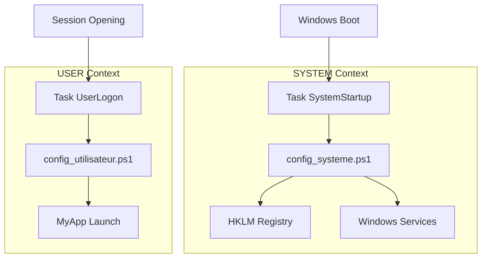

# DEVELOPER GUIDE - WindowsOrchestrator 1.73

---

📘 **[User Guide](USER_GUIDE.md)**
*Intended for system administrators and deployment technicians.*
Contains step-by-step procedures, wizard screenshots, and troubleshooting guides.

🏠 **[Back to home](../../README.md)**
*Back to the English documentation portal.*

---

## Table of Contents

1. [Technical Preamble and Project Scope](#1-technical-preamble-and-project-scope)
    1.1. [Non-Installable Nature and Portability Philosophy](#11-non-installable-nature-and-portability-philosophy)
    1.2. [Technical Disclaimer](#12-technical-disclaimer)
    1.3. [Naming Conventions and Terminology](#13-naming-conventions-and-terminology)
2. [System Architecture and Security Model](#2-system-architecture-and-security-model)
    2.1. [The Privilege Separation Model](#21-the-privilege-separation-model)
        2.1.1. [The SYSTEM Context (config_systeme.ps1)](#211-the-system-context-config_systemeps1)
        2.1.2. [The USER Context (config_utilisateur.ps1)](#212-the-user-context-config_utilisateurps1)
        2.1.3. [Execution Flow Diagram](#213-execution-flow-diagram)
    2.2. [Scheduled Tasks Architecture](#22-scheduled-tasks-architecture)
        2.2.1. [Main Tasks (Static)](#221-main-tasks-static)
        2.2.2. [Dynamic Tasks (Runtime Managed)](#222-dynamic-tasks-runtime-managed)
        2.2.3. [Critical Analysis of LogonType: Interactive vs Password vs S4U](#223-critical-analysis-of-logontype-interactive-vs-password-vs-s4u)
    2.3. [Temporal Orchestration and Parallelism](#23-temporal-orchestration-and-parallelism)
        2.3.1. [Temporal Inference Algorithm](#231-temporal-inference-algorithm)
        2.3.2. [Backup/Close Decoupling](#232-backupclose-decoupling)
        2.3.3. [Typical Daily Chronology (Workflow)](#233-typical-daily-chronology-workflow)
3. [In-Depth Analysis of Configuration Contract (config.ini)](#3-in-depth-analysis-of-configuration-contract-configini)
    3.1. [Section [SystemConfig]: Global Parameters](#31-section-systemconfig-global-parameters)
        3.1.1. [SessionStartupMode: Decision Tree](#311-sessionstartupmode-decision-tree)
        3.1.2. [DisableWindowsUpdate: Mechanism and Responsibility Transfer](#312-disablewindowsupdate-mechanism-and-responsibility-transfer)
        3.1.3. [OneDriveManagementMode: The 3 Management Levels](#313-onedrivemanagementmode-the-3-management-levels)
    3.2. [Section [Process]: Application Lifecycle Management](#32-section-process-application-lifecycle-management)
        3.2.1. [Distinction ProcessToLaunch vs ProcessToMonitor](#321-distinction-processtolaunch-vs-processtomonitor)
        3.2.2. [LaunchConsoleMode: Standard vs Legacy](#322-launchconsolemode-standard-vs-legacy)
        3.2.3. [StartProcessMinimized: Splatting Technique](#323-startprocessminimized-splatting-technique)
    3.3. [Section [DatabaseBackup]: Backup Module](#33-section-databasebackup-backup-module)
        3.3.1. [EnableBackup: The Kill Switch](#331-enablebackup-the-kill-switch)
        3.3.2. [DatabaseKeepDays: Date-Based Purge Algorithm](#332-databasekeepdays-date-based-purge-algorithm)
        3.3.3. [Temporal Differential Logic](#333-temporal-differential-logic)
    3.4. [Section [Installation]: Deployment and Resilience](#34-section-installation-deployment-and-resilience)
        3.4.1. [SilentMode: Impact Chain](#341-silentmode-impact-chain)
        3.4.2. [AutologonDownloadUrl: Link Rot Resilience](#342-autologondownloadurl-link-rot-resilience)
        3.4.3. [UseAutologonAssistant: Conditional Logic](#343-useautologonassistant-conditional-logic)
4. [Code Structure and Component Analysis](#4-code-structure-and-component-analysis)
    4.1. [Detailed Project Tree](#41-detailed-project-tree)
    4.2. [The Central Module: WindowsOrchestratorUtils.psm1](#42-the-central-module-windowsorchestratorutilspsm1)
        4.2.1. [I/O Abstraction Functions (Input/Output)](#421-io-abstraction-functions-inputoutput)
            [Get-IniContent: Manual INI Parser](#get-inicontent-manual-ini-parser)
            [Set-IniValue: Secure INI Writing](#set-inivalue-secure-ini-writing)
            [Get-ConfigValue: Typed Reading with Default Values](#get-configvalue-typed-reading-with-default-values)
        4.2.2. [Internationalization System (i18n)](#422-internationalization-system-i18n)
            [Localization Strategy (v1.73)](#localization-strategy-v172)
        4.2.3. [Logging System](#423-logging-system)
            [Write-Log: Structured and Resilient Writing](#write-log-structured-and-resilient-writing)
            [Add-Action / Add-Error: Aggregators](#add-action-add-error-aggregators)
            [Invoke-LogFileRotation: Archive Management](#invoke-logfilerotation-archive-management)
        4.2.4. [Start-OrchestratorProcess: Unified Launch Engine](#424-start-orchestratorprocess-unified-launch-engine)
            [Decision Algorithm](#decision-algorithm)
            [Legacy Mode and Console Management](#legacy-mode-and-console-management)
            [Parameter Construction (Splatting)](#parameter-construction-splatting)
        4.2.5. [Waiting UI Management (Splash Screen)](#425-waiting-ui-management-splash-screen)
        4.2.6. [Invoke-ExitLogic: Unified Exit Management](#426-invoke-exitlogic-unified-exit-management)
    4.3. [Entry Points (Wrappers)](#43-entry-points-wrappers)
        4.3.1. [Installation Execution Chain](#431-installation-execution-chain)
        4.3.2. [Launcher Logic Launch-Install.ps1](#432-launcher-logic-launch-installps1)
    4.4. [Installation Scripts](#44-installation-scripts)
        4.4.1. [firstconfig.ps1: Dynamic Graphical Interface](#441-firstconfigps1-dynamic-graphical-interface)
        4.4.2. [install.ps1: Installation Engine](#442-installps1-installation-engine)
    4.5. [Runtime Scripts](#45-runtime-scripts)
        4.5.1. [config_systeme.ps1 (SYSTEM Context)](#451-config_systemeps1-system-context)
            [Target User Determination (Complete Algorithm)](#target-user-determination-complete-algorithm)
            [Other Critical Functions](#other-critical-functions)
        4.5.2. [config_utilisateur.ps1 (USER Context)](#452-config_utilisateurps1-user-context)
    4.6. [Specialized Modules](#46-specialized-modules)
        4.6.1. [Invoke-DatabaseBackup.ps1: Autonomous Backup](#461-invoke-databasebackupps1-autonomous-backup)
            [A. Lock Mechanism (Lock File)](#a-lock-mechanism-lock-file)
            [B. Temporal Differential Logic](#b-temporal-differential-logic)
            [C. Paired Files Management (SQLite)](#c-paired-files-management-sqlite)
            [D. Preliminary Checks](#d-preliminary-checks)
        4.6.2. [Close-AppByTitle.ps1: Clean Closure via API](#462-close-appbytitleps1-clean-closure-via-api)
            [C# P/Invoke Injection: Complete Code](#c-pinvoke-injection-complete-code)
            [Retry Logic with Timeout](#retry-logic-with-timeout)
5. [External Dependencies Management and Security](#5-external-dependencies-management-and-security)
    5.1. [Microsoft Sysinternals Autologon Tool](#51-microsoft-sysinternals-autologon-tool)
        5.1.1. [Download and Architecture Selection Mechanism](#511-download-and-architecture-selection-mechanism)
        5.1.2. [Credentials Security: LSA Secrets](#512-credentials-security-lsa-secrets)
            [LSA Secrets Cleanup Process (Uninstallation)](#lsa-secrets-cleanup-process-uninstallation)
    5.2. [Gotify Notifications (Optional)](#52-gotify-notifications-optional)
        5.2.1. [REST Implementation](#521-rest-implementation)
        5.2.2. [Network Resilience](#522-network-resilience)
6. [Lifecycle and Usage Scenarios](#6-lifecycle-and-usage-scenarios)
    6.1. [Complete Installation Sequence](#61-complete-installation-sequence)
        [Logical Sequence Diagram (Mermaid)](#logical-sequence-diagram-mermaid)
        [Detailed Flow Steps](#detailed-flow-steps)
    6.2. [Detailed Daily Timeline (Timeline)](#62-detailed-daily-timeline-timeline)
    6.3. [Session Modes: Comparative Analysis](#63-session-modes-comparative-analysis)
        [Technical Comparative Table](#technical-comparative-table)
        [Scenario Analysis](#scenario-analysis)
7. [Maintenance, Debugging and Exit Procedures](#7-maintenance-debugging-and-exit-procedures)
    7.1. [Logging System](#71-logging-system)
        7.1.1. [Location and Format](#711-location-and-format)
        7.1.2. [Rotation Policy](#712-rotation-policy)
        7.1.3. [Automatic Fallback (Security)](#713-automatic-fallback-security)
    7.2. [Manual Debugging Procedures](#72-manual-debugging-procedures)
        7.2.1. [USER Context Debugging](#721-user-context-debugging)
        7.2.2. [SYSTEM Context Debugging (via PsExec)](#722-system-context-debugging-via-psexec)
        7.2.3. [Scheduled Tasks Analysis](#723-scheduled-tasks-analysis)
    7.3. [Exit Codes and Error Detection](#73-exit-codes-and-error-detection)
        7.3.1. [Standard Codes](#731-standard-codes)
        7.3.2. [Internal Detection](#732-internal-detection)
    7.4. [Common Problems and Solutions](#74-common-problems-and-solutions)
        7.4.1. [The Application Does Not Start](#741-the-application-does-not-start)
        7.4.2. [The Reboot Does Not Work](#742-the-reboot-does-not-work)
        7.4.3. [Backup Fails ("Access Denied")](#743-backup-fails-access-denied)
        7.4.4. [Splash Screen Stays Stuck (Silent Mode)](#744-splash-screen-stays-stuck-silent-mode)
8. [Appendices](#8-appendices)
    8.1. [License](#81-license)
    8.2. [Complete Technical Glossary](#82-complete-technical-glossary)
    8.3. [Development Standards](#83-development-standards)
        8.3.1. [Relative Paths Convention](#831-relative-paths-convention)
        8.3.2. [Formatting Convention (i18n)](#832-formatting-convention-i18n)
        8.3.3. [Error Handling](#833-error-handling)
    8.4. [Credits](#84-credits)
    8.5. [Quick Diagnostic PowerShell Commands](#85-quick-diagnostic-powershell-commands)

## 1. Technical Preamble and Project Scope

### 1.1. Non-Installable Nature and Portability Philosophy

The architecture of WindowsOrchestrator has been designed to bypass the constraints of traditional software installations (MSI, EXE, AppX). It adopts the paradigm of the **Portable Application**.

*   **Absence of footprint in system directories**:
    *   The project does not deploy any files in `%PROGRAMFILES%` (`C:\Program Files`), `%PROGRAMDATA%` or `%APPDATA%`.
    *   It does not create registry keys to reference itself in "Add/Remove Programs".
    *   The entirety of the code, configuration and logs resides in the initial extraction folder.

*   **Dynamic path resolution (Relative Paths)**:
    *   To ensure this portability, the use of absolute paths (e.g.: `C:\WindowsOrchestrator\...`) is strictly forbidden in the source code.
    *   **PowerShell**: All scripts use the automatic variable `$PSScriptRoot` combined with the cmdlet `Join-Path` to locate modules, language files and tools.
        *   *Example*: `$ConfigFile = Join-Path (Split-Path $PSScriptRoot -Parent) "config.ini"`
    *   **Batch**: Launcher scripts (`.bat`) use the expansion variable `%~dp0` to identify their current execution directory.

*   **Operational consequences**:
    *   **Displacement**: The root folder can be moved from a `C:\` drive to a `D:\` volume, a USB key or a mapped network share without breaking internal functioning. Only scheduled tasks (which contain absolute paths when created) will need to be recreated via the `install.ps1` script.
    *   **Update**: Maintenance is done "In-Place". To update the orchestrator, simply replace the `.ps1` and `.psm1` files. User data (`config.ini`) and audit traces (`Logs\`) are preserved as they are located outside the business logic folders.

### 1.2. Technical Disclaimer

This software is provided under **GPLv3** license, according to the "AS IS" principle. As a developer or integrator, you must master the following implications:

*   **Critical System Dependencies**:
    *   The orchestrator is not a self-contained binary containing its own libraries. It is an orchestration engine that directly manipulates native Windows components.
    *   It depends on the stability of **WMI/CIM** (for process monitoring), the **Service Control Manager** (for Windows Update), and the **Win32** API (for window management).
    *   A Windows system whose WMI subsystems are corrupted or whose security policies (Domain GPO) block access to the HKLM registry will prevent the tool from functioning.

*   **Limits of Idempotence and Restoration**:
    *   The uninstallation procedure does not work like a "Snapshot" or system restore point.
    *   It applies a "Reset to Defaults" logic: it resets parameters (Windows Update, Fast Startup, OneDrive) to their default Microsoft values.
    *   *Impact*: If the target machine had specific configuration *before* installing the orchestrator (e.g.: Windows Update manually disabled), uninstalling the orchestrator will reactivate the service, thus modifying the machine's initial state.

### 1.3. Naming Conventions and Terminology

To ensure consistency between source code, configuration files and this technical documentation, a strict convention is applied:

*   **`MyApp`**: This generic term designates the target business application that the orchestrator must manage.
    *   It replaces all references to specific internal projects (formerly `Allv023-05`, `AllSys`, etc.).
    *   In the `config.ini` file, this corresponds to the value of the `ProcessToMonitor` key.
*   **Orchestrator**: Designates the set of PowerShell scripts, modules and scheduled tasks constituting the solution.

---

## 2. System Architecture and Security Model

The design of WindowsOrchestrator relies on the secure bypassing of limitations imposed by Windows' security architecture, particularly the SYSTEM context isolation.

### 2.1. The Privilege Separation Model

To fulfill its functions (system configuration AND application launching), the tool cannot rely on a single script. It uses two distinct and hermetic execution contexts.

#### 2.1.1. The SYSTEM Context (`config_systeme.ps1`)

This script acts as the "Low-Level Engine" of the solution.

*   **Execution Identity**: `NT AUTHORITY\SYSTEM` (also called *LocalSystem*).
*   **Launch Mechanism**: Scheduled task `WindowsOrchestrator-SystemStartup`.
*   **Technical Necessity**:
    *   It is the only account with the privileges necessary to modify critical registry hives (`HKEY_LOCAL_MACHINE\SYSTEM`, `HKEY_LOCAL_MACHINE\SOFTWARE\Policies`).
    *   It has the right to control Windows Services states (Start, Stop, Disable) without triggering UAC prompts.
    *   It can modify global power plans via `powercfg.exe`.
*   **Critical Limitations (Elevated Privileges without Graphical Session)**:
    *   Tasks executed in SYSTEM context have all administrative privileges but execute **without user desktop environment**.
    *   **Consequence**: This script is invisible to the user. Any attempt to display graphical interface (`MessageBox`, forms) fails or remains invisible. The script can only launch graphical applications via dedicated scheduled tasks in USER context.

#### 2.1.2. The USER Context (`config_utilisateur.ps1`)

This script acts as the "Interactive Engine" and manages the user experience.

*   **Execution Identity**: The logged-in user (Interactive). This can be the user defined for Autologon or any user opening a session.
*   **Launch Mechanism**: Scheduled task `WindowsOrchestrator-UserLogon` with trigger `At Logon` and LogonType `Interactive`.
*   **Technical Necessity**:
    *   It executes **in the logged-in user's interactive session** (active desktop environment).
    *   Unlike SYSTEM context, it has access to the desktop, visible windows, and user resources.
    *   It is the only context capable of launching the business application (`MyApp`) in a way that it is visible on the desktop.
    *   It has access to the `HKEY_CURRENT_USER` (HKCU) hive to configure user preferences.
    *   It has access to mapped network resources (Z:, Y:) and user printers, which the SYSTEM account does not see.
*   **Limitations**:
    *   It cannot modify global system parameters (Services, HKLM) without privilege elevation (UAC), which would break automation.

#### 2.1.3. Execution Flow Diagram

The diagram below illustrates the dichotomy between the two contexts from the moment Windows boots.



---

## 2.2. Scheduled Tasks Architecture

The orchestrator does not rely on legacy launch methods that are unreliable like the "Startup" folder or Run registry keys. It exclusively uses the **Windows Task Scheduler**, which offers the necessary granularity in terms of security, context and triggers.

### 2.2.1. Main Tasks (Static)

These tasks constitute the immutable infrastructure of the orchestrator. They are created once during the execution of the `install.ps1` script and are not modified thereafter, except in case of reinstallation.

| Task Name | Trigger (Trigger) | Security Context | Technical Role |
| :-------------------------------------- | :------------------------------------- | :----------------------------------------------- | :----------------------------------------------------------- |
| **`WindowsOrchestrator-SystemStartup`** | `At Startup` (At system startup) | `NT AUTHORITY\SYSTEM` (RunLevel Highest) | Entry point for machine configuration. It ensures the environment is secure (GPO, Power) before any user session is opened. It acts as a self-repair mechanism at boot. |
| **`WindowsOrchestrator-UserLogon`** | `At Logon` (At session opening) | Interactive User (`LogonType Interactive`) | Entry point for the session. It is responsible for initializing the user environment and launching the business application (`MyApp`). |

### 2.2.2. Dynamic Tasks (Runtime Managed)

Unlike main tasks, these tasks are dynamically managed by the `config_systeme.ps1` script at each system startup.

*   **Mechanism**: The script reads the `config.ini` file, checks if times have changed, and uses `Register-ScheduledTask` (with the `-Force` option) or `Unregister-ScheduledTask` to update the scheduler.
*   **Advantage**: This allows an administrator to modify the reboot or backup time simply by editing the INI file, without having to re-run the complete installer.

List of dynamic tasks:
1.  **`WindowsOrchestrator-SystemBackup`**: Triggered daily at the time defined by `ScheduledBackupTime`. Executes `Invoke-DatabaseBackup.ps1` in SYSTEM context.
2.  **`WindowsOrchestrator-SystemScheduledReboot`**: Triggered daily at the time defined by `ScheduledRebootTime`. Executes `shutdown.exe`.
3.  **`WindowsOrchestrator-User-CloseApp`**: Triggered daily at the time defined by `ScheduledCloseTime`. Executes `Close-AppByTitle.ps1` in the interactive user context (necessary to send keys to the application window).

### 2.2.3. Critical Analysis of LogonType: Interactive vs Password vs S4U

The choice of `LogonType` for the `UserLogon` task is a central architectural decision of version 1.73, which resolves the password management problems of previous versions.

| LogonType | Password Required? | Graphical Session? | Technical Analysis |
| :---------------- | :-------------------: | :-----------------: | :----------------------------------------------------------- |
| **`Interactive`** | ❌ No | ✅ Yes | **Chosen for v1.73**. The task does not create its own session; it injects **into** the user session at the precise moment it opens. It inherits the access token (Token) generated by the Winlogon process (or Autologon). This is why the orchestrator does **not** need to know the user's password to launch the graphical application. |
| **`Password`** | ✅ Yes | ✅ Yes | Classic mode "Run whether user is logged on or not". Requires storing the password in Windows' Credential Store (less secure) and imperatively requires the account to have the local privilege `SeBatchLogonRight` ("Log on as a batch job"), which is often blocked by security GPOs in enterprise. |
| **`S4U`** | ❌ No | ❌ No | "Service for User". Allows executing a task under the user's identity without password, but without loading their complete profile and **without authenticated network access** (Kerberos/NTLM). Moreover, this mode cannot display a graphical interface. Unusable for `MyApp`. |
**Critical Architectural Clarification**:

The choice of LogonType `Interactive` is the cornerstone of the architecture. Here is why it is **mandatory** for WindowsOrchestrator:

1. **Session Token Inheritance**: When the task triggers "At Logon", it **automatically inherits** the access token (Security Token) of the user session that is opening. This includes:
   - Access to the user profile (`HKCU`, `%APPDATA%`)
   - Desktop visibility (Desktop Window Manager)
   - Mapped network drives (Z:, Y:, etc.)

2. **No New Session**: Unlike `Password` or `S4U`, this mode does not try to create a new session. It injects into the existing session, hence the absence of password need.

3. **Legacy Applications Compatibility**: Many third-party applications (notably business applications) check that they are running in a real "interactive" session. The LogonType `Interactive` satisfies these checks.

**What this mode DOES NOT do**:
- It does not bypass UAC (the application remains in standard user privileges)
- It does not work if no user is logged in (the task waits for session opening)
- It does not create a virtual or invisible terminal

## 2.3. Temporal Intelligence

The orchestrator uses a temporal inference algorithm to automatically calculate missing times and create a sequential "Domino Effect" flow.

### 2.3.1. Temporal Inference Algorithm

The system calculates times by descending priority:
1. **Backup Time** = `ScheduledCloseTime` (if empty, inferred to close + 5 minutes)
2. **Reboot Time** = `ScheduledRebootTime` (if empty, automatically triggered after backup)

This ensures that if the backup or reboot time is not explicitly defined, the system intelligently chains them without overlap.

### 2.3.2. Backup/Close Decoupling

It is imperative to note that the **Closure** task (`User-CloseApp`) and the **Backup** task (`SystemBackup`) are totally decoupled architecturally.

*   **Technical Independence**: These are two distinct "Scheduled Task" objects with their own time triggers and their own execution contexts (USER for one, SYSTEM for the other).
*   **Decoupling Technically but Not Logically**:
   - **Technically**: The two tasks are distinct objects in the Scheduler. If `Close-AppByTitle.ps1` crashes, the backup task will still execute.
   - **Real Risk**: If the application is not closed at backup time (02:57), files may be locked (open file handles). In this case:
       - SQLite files (`.db`) will be copied but **potentially in an inconsistent state**
       - WAL files (`.db-wal`) may contain uncommitted transactions
       - Restoring such a backup may fail or produce corrupted database
   - **Current Mitigation**: No automatic guard in the code. The administrator must:
       1. Leave a sufficient delay between Close and Backup (recommended: 2 minutes minimum)
       2. Manually check backup logs for failures
       3. Regularly test backup restorations
*   **Data Consistency**: Although decoupled, these tasks are sequenced temporally (Closure before Backup) to ensure files are not locked (Open File Handles) during copying. However, backup will work even on open files (although application consistency is less guaranteed in this specific case).

### 2.3.3. Typical Daily Chronology (Workflow)

Here is the exact lifecycle of a machine managed by the orchestrator, based on the recommended configuration in the User Guide.

1.  **02:55** → Triggering of **`WindowsOrchestrator-User-CloseApp`**
    *   **Script**: `Close-AppByTitle.ps1`
    *   **Action**: Searches for the window containing "MyApp" (default value) and sends the sequence `{ESC}{ESC}x{ENTER}` (Escape x 2, 'x', Enter). This is an adaptable example depending on the application.
2.  **02:57** → Triggering of **`WindowsOrchestrator-SystemBackup`**
    *   **Script**: `Invoke-DatabaseBackup.ps1`
    *   **Action**: Analyzes the data folder, identifies files modified in the last 24 hours, and performs differential copying to the secure destination.
3.  **03:00** → Triggering of **`WindowsOrchestrator-SystemScheduledReboot`**
    *   **Binary**: `shutdown.exe`
    *   **Arguments**: `/r /t 0` (Immediate reboot).
    *   **Action**: Windows initiates the shutdown procedure.
4.  **03:01** → **Cold Boot (Cold Start)**
    *   **Specificity**: Thanks to the orchestrator's disabling of *Fast Startup*, this boot forces a complete reload of the kernel, drivers and hardware, eliminating any residual memory state (unlike hibernation exit).
5.  **03:02** → Triggering of **`WindowsOrchestrator-SystemStartup`**
    *   **Script**: `config_systeme.ps1`
    *   **Action**: Integrity check of the configuration (Windows Update GPO, Power settings, existence of dynamic tasks).
6.  **03:02:30** → **Autologon** (if activated)
    *   **Action**: The Winlogon subsystem uses LSA secrets to open the user session automatically.
7.  **03:03** → Triggering of **`WindowsOrchestrator-UserLogon`**
    *   **Script**: `config_utilisateur.ps1`
    *   **Action**: Detection that `MyApp` is not running, then startup of the application via the configured method (Direct, PowerShell or Legacy).

---

## 3. In-Depth Analysis of Configuration Contract (`config.ini`)

The `config.ini` file is the heart of the orchestrator. It is not a simple preferences file, but a **state contract** (State Contract) that scripts commit to applying at each execution. The parser used (`Get-IniContent` in the utils module) is case-insensitive but sensitive to section structure.

### 3.1. Section `[SystemConfig]`: Global Parameters

This section exclusively drives the behavior of the script `config_systeme.ps1`, executed with SYSTEM privileges.

#### 3.1.1. `SessionStartupMode`: Decision Tree

This parameter determines the access strategy to the system. The code implements a strict switching logic:

*   **`Standard`**:
    *   **Technical Action**: Forces the registry value `AutoAdminLogon` to `"0"` in `HKLM:\SOFTWARE\Microsoft\Windows NT\CurrentVersion\Winlogon`.
    *   **Result**: The PC stops at the Windows login screen (LogonUI). The user must enter their password or use Windows Hello.
    *   **Use case**: Administration workstations, servers requiring strong authentication at each physical access.

*   **`Autologon`**:
    *   **Technical Action**:
       *   Forces `AutoAdminLogon` to `"1"`.
       *   Sets `DefaultUserName` with the value of `AutoLoginUsername` (or current user if empty during installation).
       *   Sets `DefaultDomainName` with the computer name (or AD domain).
    *   **Security**: Note that the password is **not** managed here. It is managed by the external tool `Autologon.exe` which injects credentials into LSA secrets. The `config_systeme.ps1` script only activates the mechanism.
    *   **Use case**: Interactive kiosks, display screens, autonomous terminals.

#### 3.1.2. `DisableWindowsUpdate`: Mechanism and Responsibility Transfer

The orchestrator applies a "Defense in Depth" strategy to ensure Windows Update does not disrupt production.

*   **Locking by Local GPO (Registry)**:
    *   The script writes `NoAutoUpdate = 1` in `HKLM:\SOFTWARE\Policies\Microsoft\Windows\WindowsUpdate\AU`.
    *   It writes `NoAutoRebootWithLoggedOnUsers = 1` in the same key.
    *   **Why?** The `Policies` keys are respected by the OS as enterprise directives and are more difficult to override by Windows' self-repair mechanisms than simple configuration keys.

*   **Service Disabling**:
    *   The `wuauserv` service is set to `StartupType = Disabled`.
    *   The service is stopped immediately via `Stop-Service -Force`.

*   **Permanence**: At each startup, `config_systeme.ps1` checks and re-applies these keys. If a manual update or third-party tool has reactivated the service, the orchestrator will shut it down again at the next boot.

#### 3.1.3. `OneDriveManagementMode`: The 3 Management Levels

This parameter manages the behavior towards the Microsoft OneDrive synchronization client, often undesirable on autonomous kiosks.

*   **`Block` (Recommended)**:
    *   **GPO Action**: Creates the key `DisableFileSyncNGSC = 1` in `HKLM:\SOFTWARE\Policies\Microsoft\Windows\OneDrive`. This prevents the OneDrive executable from launching, even if the user tries manually.
    *   **Cleanup**: Also attempts to remove the automatic startup entry in the user's Run key.
    *   **Kill**: Kills any active `OneDrive.exe` process.

*   **`Close`**:
    *   **Action**: Only kills the `OneDrive.exe` process if detected.
    *   **Limit**: OneDrive may restart automatically via its maintenance scheduled tasks. This is corrective temporary measure, not a definitive solution.

*   **`Ignore`**:
    *   **Action**: Removes the `DisableFileSyncNGSC` policy key if it exists, returning control to the user or OS.

### 3.2. Section `[Process]`: Application Lifecycle Management

This section drives the behavior of the script `config_utilisateur.ps1` (USER Context) and the central function `Start-OrchestratorProcess`.

#### 3.2.1. Distinction `ProcessToLaunch` vs `ProcessToMonitor`

This is a fundamental concept for launcher idempotence.

*   **`ProcessToLaunch`**: This is the **trigger**.
    *   Example: `LaunchApp.bat`, `Start.ps1`, or `C:\Program Files\App\Loader.exe`.
    *   This is the file the orchestrator will execute.

*   **`ProcessToMonitor`**: This is the **target**.
    *   Example: `MyApp` (for `MyApp.exe`) or `java` (for a Java app).
    *   This is the process name loaded in RAM.

**Execution Logic**:
1.  The script checks: "Does `ProcessToMonitor` exist in the process list?"
2.  **If YES**: The application is already running. The orchestrator does nothing. This avoids launching 50 instances of the application if the user closes their session and reopens it, or if the script is run manually.
3.  **If NO**: The orchestrator executes `ProcessToLaunch`.

> **Developer Note**: If `ProcessToMonitor` is left empty, the orchestrator loses its detection capability and will launch `ProcessToLaunch` at each execution, which may create duplicates.

The new `LaunchApp.bat` uses `findstr` to parse the `.ini` and `!VALUE:"=!` to remove quotes, allowing dynamic launching without manual modifications.

#### 3.2.2. `LaunchConsoleMode`: Standard vs Legacy

This parameter resolves compatibility issues with different Windows console hosts (conhost, Windows Terminal).

*   **`Standard`** (Default):
    *   Uses `Start-Process -FilePath ...`.
    *   Lets Windows decide the host. On Windows 11, this may open a new tab in Windows Terminal. This is the modern and recommended method.

*   **`Legacy`**:
    *   Constructs an explicit command: `cmd.exe /c start "Title" "Path" Arguments`.
    *   **Necessity**: Some old Batch scripts (Legacy) or certain applications crash if not executed in their own dedicated `conhost.exe` window (classic black screen). This mode forces this behavior.

**Concrete Example: When to Use Legacy?**

Some historical Batch scripts are incompatible with modern terminals. Here is a typical case:

**Problematic Script (`LaunchApp.bat`)**:
```batch
@echo off
REM This script crashes in Standard mode on Windows 11
cd /d %~dp0
echo Starting application...

REM Launches the app in a new detached process
start "" "MyApp.exe" -config production.ini

REM Waits 5 seconds to verify startup
timeout /t 5 /nobreak > nul

REM Checks if the process is running
tasklist | find /i "MyApp.exe" > nul
if errorlevel 1 (
    echo ERROR: Application did not start!
    pause
    exit /b 1
)

echo Application started successfully.
exit /b 0
```

**Symptoms in Standard Mode**:

- On Windows 11 with Windows Terminal, the script executes in a shared tab
- The `start ""` command tries to create a window but fails silently
- `MyApp.exe` never starts
- The script waits 5 seconds then displays "ERROR"

**Solution**: Activate Legacy mode in `config.ini`

```ini
[Process]
LaunchConsoleMode=Legacy
```

**What happens then**:

```powershell
# Instead of:
Start-Process -FilePath "LaunchApp.bat"

# The orchestrator executes:
cmd.exe /c start "WindowsOrchestrator Launch" "C:\Path\To\LaunchApp.bat"
```

This forces the opening of a **new dedicated `conhost.exe` window**, isolated from the PowerShell process, in which the Batch executes correctly.

**When NOT to use Legacy**:

- PowerShell scripts (`.ps1`) → Always Standard
- Direct executables (`.exe`) → Always Standard
- Modern Batch scripts without `start` → Standard works

#### 3.2.3. `StartProcessMinimized`: Splatting Technique

The option allows launching the application minimized in the taskbar (useful for background applications that have a GUI but should not disturb).

The code uses the **Splatting** PowerShell technique to apply this parameter conditionally:

```powershell
# Dynamic parameter construction
$startParams = @{
    FilePath = $exePath
    ArgumentList = $args
}

if ($StartProcessMinimized) {
    # Adds the WindowStyle key only if requested
    $startParams.Add("WindowStyle", "Minimized")
}

# Clean execution
Start-Process @startParams
```

---

## 3. In-Depth Analysis of Configuration Contract (`config.ini`) (Continued)

### 3.3. Section `[DatabaseBackup]`: Backup Module

This section controls the behavior of the script `Invoke-DatabaseBackup.ps1`. The backup logic has been designed to be **atomic** and **resilient**.

#### 3.3.1. `EnableBackup`: The Kill Switch

This boolean variable acts as the main disconnector.
*   **Mechanism**: It is checked at the very first logical line of the backup script's main function.
*   **Behavior**:
    *   If `false`: The script logs "Backup disabled" and returns immediately without performing any disk or network operations.
    *   If `true`: The script proceeds to initialize path variables (`Source`, `Destination`) and launches prerequisite checks.

#### 3.3.2. `DatabaseKeepDays`: Date-Based Purge Algorithm

The retention management does not rely on file metadata (creation/modification date of the backup file), which can be altered during copies, but on a strict naming convention.

*   **Naming Format**: Files generated by the orchestrator follow the pattern: `YYYYMMDD_HHMMSS_OriginalName.ext`.
*   **Algorithm**:
    1.  The script lists files in `DatabaseDestinationPath`.
    2.  It applies a Regex `^(\d{8})_` to extract the first 8 digits (the date).
    3.  It converts this string into a `DateTime` object.
    4.  If `FileDate < (TodayDate - DatabaseKeepDays)`, the file is deleted via `Remove-Item -Force`.

#### 3.3.3. Temporal Differential Logic

To avoid saturating the disk and network with unnecessary copies (especially for large databases of several GB), the script does not perform systematic full backups.

*   **The Filter**: `LastWriteTime > (Get-Date).AddHours(-24)`
*   **Functioning**:
    *   The script recursively scans the source folder.
    *   It only retains files whose last modification timestamp is less than 24 hours.
    *   **Consequence**: The orchestrator performs a **daily differential backup** based on time. It does not compare hashes (MD5/SHA) for performance reasons.
*   **SQLite Pairs Integrity**: An exception to this rule exists for `.db` files. If a `.db` file is qualified for backup, the script forces the inclusion of its companion `.db-wal` and `.db-shm` files (even if older), guaranteeing transactional copy integrity.

### 3.4. Section `[Installation]`: Deployment and Resilience

These parameters exclusively influence the behavior of the scripts `install.ps1`, `uninstall.ps1` and their launchers.

#### 3.4.1. `SilentMode`: Impact Chain

Silent mode is not a simple option of `install.ps1`. It is an impact chain that goes back up to the launcher.

1.  **Detection**: The wrapper `Launch-Install.ps1` (or `Launch-Uninstall.ps1`) reads this value in the INI file via a light Regex, before even loading PowerShell completely.
2.  **Masking**: If `true`, the wrapper launches the main script with the argument `-WindowStyle Hidden`.
3.  **Compensation (Feedback)**: The main script (`install.ps1`) detects that it is running hidden. To avoid leaving the user in doubt ("Is it working?"), it immediately launches the `Start-WaitingUI` function which displays the WinForms Splash Screen (indeterminate progress bar).
4.  **Closure**: At the end of execution, the script uses a complex P/Invoke call (see Section 4.2.5) to force the display of a `MessageBox` at the forefront, confirming success or failure.

#### 3.4.2. `AutologonDownloadUrl`: Link Rot Resilience

To avoid the orchestrator becoming obsolete if Microsoft changes its URLs, the link to download the Sysinternals tool is not hardcoded ("Hardcoded") in the `.ps1` script.

*   **Principle**: The URL is stored in `config.ini`.
*   **Advantage**: If the link breaks (Link Rot), an administrator can fix it simply by editing the text file, without having to modify the source code or break the scripts' digital signature.

#### 3.4.3. `UseAutologonAssistant`: Conditional Logic

The Autologon configuration assistant (download + GUI) only launches if **two** conditions are met (AND operator):
1.  `SessionStartupMode` is set to `Autologon`.
2.  `UseAutologonAssistant` is set to `true`.

This allows expert administrators to configure Autologon manually (or via master image) while using the orchestrator for the rest, without being interrupted by the assistant.

---

## 4. Code Structure and Component Analysis

### 4.1. Detailed Project Tree

The folder structure has been thought to clearly separate responsibilities: what is executable by the user, what is internal, and what is dynamic.

```text
/ (Project Root)
│
├── config.ini                     # [GENERATED] Master configuration file (created post-install).
├── Install.bat                    # [USER] Installation entry point (Launcher).
├── Uninstall.bat                  # [USER] Uninstallation entry point (Launcher).
│
├── management/                    # [CORE] Technical core (Business Logic). Do not modify.
│   ├── modules/
│   │   └── WindowsOrchestratorUtils/
│   │       └── WindowsOrchestratorUtils.psm1  # Central functions library (DRY).
│   │
│   │   ├── defaults/
│   │   │   └── default_config.ini     # [REF] Configuration template (Fallback if config.ini missing).
│   │   │
│   │   ├── tools/                     # [BIN] Folder for third-party binaries.
│   │   │   └── Autologon/             # (Dynamically generated during download).
│   │   │
│   │   ├── firstconfig.ps1            # GUI assistant (WinForms) for first config.
│   │   ├── install.ps1                # Installation engine (Main logic).
│   │   ├── uninstall.ps1              # Uninstallation engine (Main logic).
│   │   ├── Launch-Install.ps1         # UAC elevation wrapper for install.
│   │   ├── Launch-Uninstall.ps1       # UAC elevation wrapper for uninstall.
│   │   │
│   │   ├── config_systeme.ps1         # Runtime SYSTEM (Executed by SystemStartup task).
│   │   ├── config_utilisateur.ps1     # Runtime USER (Executed by UserLogon task).
│   │   ├── Invoke-DatabaseBackup.ps1  # Runtime Backup (Executed by SystemBackup task).
│   │   └── Close-AppByTitle.ps1       # Utility for clean closure (SendKeys).
│   │
├── i18n/                          # [LOC] Localization files.
│   ├── en-US/strings.psd1
│   ├── fr-FR/strings.psd1
│   └── [CultureCode]/strings.psd1 # Extensible architecture.
│
└── Logs/                          # [DATA] Execution logs (Runtime generated).
    ├── config_systeme_ps_log.txt
    ├── config_systeme_ps.1.txt    # Rotation archives.
    ├── config_utilisateur_ps_log.txt
    └── ...
```

### 4.2. The Central Module: `WindowsOrchestratorUtils.psm1`

This `.psm1` file is loaded (`Import-Module`) by **all** project scripts. It centralizes code to respect the DRY principle (*Don't Repeat Yourself*) and guarantee uniform behavior.

#### 4.2.1. I/O Abstraction Functions (Input/Output)

##### `Get-IniContent`: Manual INI Parser
PowerShell does not have a native cmdlet to read INI files in a structured way. This function implements a light parser.
*   **Method**: Line-by-line reading (`Get-Content`).
*   **Logic**:
    *   Detects sections via Regex `^\[(.+)\]$`.
    *   Detects Key=Value pairs via Regex `^([^=]+)=(.*)$`.
*   **Return**: A nested Hashtable `@{ Section = @{ Key = Value } }` allowing direct access like `$config['SystemConfig']['DisableFastStartup']`.

##### `Set-IniValue`: Secure INI Writing
Writing to an INI file without breaking the structure or deleting comments is complex.
*   **Logic**:
    1.  Loads the file into memory.
    2.  Parses lines to find the target section.
    3.  If the section exists: looks for the key. If the key exists, updates the value. Otherwise, inserts the key at the end of the section.
    4.  If the section does not exist: creates the section and the key at the end of the file.
*   **Encoding**: Forces UTF-8 to support accented characters in paths or comments.

##### `Get-ConfigValue`: Typed Reading with Default Values
This is the most used function in the code. It secures configuration reading.
*   **Signature**: `Get-ConfigValue -Section "S" -Key "K" -Type ([type]) -DefaultValue $val`
*   **Robustness**:
    *   If the key does not exist: Returns `DefaultValue`.
    *   If the key exists but is empty: Returns `DefaultValue` (or `$false` for a boolean).
    *   If type conversion fails (e.g.: text "abc" for `[int]` type): Logs a non-blocking error and returns `DefaultValue`.

#### 4.2.2. Internationalization System (i18n)

The orchestrator is designed to be multilingual from its conception. There is no user text string hardcoded in the logical scripts.

*   **`Set-OrchestratorLanguage`**: This is the initialization function called at the beginning of each script.
    1.  **Detection**: It queries the host system's culture via `(Get-Culture).Name` (e.g.: `fr-FR`).
    2.  **Loading**: It attempts to load the corresponding dictionary file: `i18n\fr-FR\strings.psd1`.
    3.  **Fallback (Security)**: If the specific file does not exist (e.g.: system in `es-ES` but no Spanish translation), it automatically loads `i18n\en-US\strings.psd1`.
    4.  **Validation**: If loading fails completely (corrupted file), it throws a blocking exception to avoid displaying empty interfaces.

*   **Structure of `.psd1` files**:
    These are standard PowerShell HashTables.
    ```powershell
    @{
        Install_Welcome = "Welcome to installation"
        Log_Error = "Critical error: {0}"
    }
    ```

*   **Usage in code**:
    Scripts use .NET string substitution:
    ```powershell
    # Injecting arguments into the template
    $msg = $lang.Log_Error -f $ErrorDetails
    ```

#### 4.2.3. Logging System

The logging system is critical for post-mortem diagnostics, as scripts often execute invisibly.

##### `Write-Log`: Structured and Resilient Writing
This function does not just write to a text file. It implements a survival logic.

1.  **Formatting**: Each line is prefixed with an ISO-like timestamp and a severity level.
    `YYYY-MM-DD HH:MM:SS [LEVEL] - Message`
2.  **Primary Target**: Writing to the file defined by `$Global:LogFile` (in the `Logs/` folder).
3.  **Fail-Safe Fallback**:
    *   If writing to the `Logs/` folder fails (full disk, corrupted folder, NTFS permissions broken), the function attempts writing to `C:\ProgramData\StartupScriptLogs\*_FATAL_LOG_ERROR.txt`.
    *   This system folder is generally writable by services and administrators, guaranteeing that a trace of the fatal error will be preserved even if the application's environment is corrupted.

##### `Add-Action` / `Add-Error`: Aggregators
These functions encapsulate `Write-Log` but add a memorization functionality.
*   They store messages in global lists in memory (`$Global:ActionsPerformed`, `$Global:ErrorsEncountered`).
*   **Usage**: These lists are used at script end to:
    1.  Determine the Exit Code (Exit Code 1 if there are errors).
    2.  Build the body of the **Gotify** notification message (actions summary).

##### `Invoke-LogFileRotation`: Archive Management
To avoid log files saturating the disk over time (especially for kiosks running for years).
*   **Algorithm**: Index shifting.
    `log.txt` → `log.1.txt` → `log.2.txt` ... → `log.N.txt`.
*   **Cleanup**: If the number of files exceeds `MaxSystemLogsToKeep` (defined in `config.ini`, default 7), the oldest are permanently deleted.

#### 4.2.4. `Start-OrchestratorProcess`: Unified Launch Engine

This function is the "Swiss Army Knife" of application launching. It abstracts the complexity related to different Windows executable types.

##### Decision Algorithm
The function analyzes the target file (`ProcessToLaunch`) and determines the optimal invocation method:

1.  **Path Resolution**: If the path is relative (e.g.: `..\App\bin\start.bat`), it is converted to an absolute path relative to the script root.
2.  **Variable Expansion**: Windows environment variables (e.g.: `%APPDATA%`, `%ProgramFiles%`) are resolved.
3.  **Type Detection**:
    *   **`.ps1`**: Executed via `powershell.exe -ExecutionPolicy Bypass -File ...`.
    *   **`.bat` / `.cmd`**: Executed via `cmd.exe /c "..."`.
    *   **`.exe` (and others)**: Executed directly.

##### Legacy Mode and Console Management
*   If `LaunchConsoleMode` is set to `Legacy` **AND** the file is a Batch, the function changes strategy:
    *   It uses `cmd.exe /c start "Title" ...`.
    *   This forces the opening of a new console window (conhost), indispensable for legacy scripts that do not support being attached to a parent PowerShell process.

##### Parameter Construction (Splatting)
The function constructs dynamically a Hashtable for `Start-Process`.
```powershell
$startProcessSplat = @{
    FilePath = ...
    ArgumentList = ...
    WorkingDirectory = ... # Deduced from file path or project root
}

# Minimized mode management
if ($launchMinimized) {
    $startProcessSplat.Add("WindowStyle", "Minimized")
}
```

#### 4.2.5. Waiting UI Management (Splash Screen)

In silent mode (`SilentMode=true`), the PowerShell console is masked. To avoid the user thinking the installation crashed, the orchestrator displays a minimal graphical interface (Splash Screen) via WinForms.

**A. The Splash Screen (`Start-WaitingUI`)**

Launching a GUI script from another PowerShell script without external file dependency is complex.
*   **Problem**: Passing a complex code block via `-Command` is subject to escaping errors.
*   **Solution**: The Splash Screen code is encapsulated in a string, encoded in **Base64**, then passed to a new `powershell.exe` process via `-EncodedCommand`.

**B. The "Ghost Parent" Correctif (P/Invoke MessageBox)**

In silent mode or SYSTEM context, a standard `MessageBox` may open in the background. To force display at the forefront, the orchestrator uses a C# code injection (P/Invoke) to manipulate the Windows API.

**Technical Implementation:**

```powershell
# Injecting code to manipulate windows
Add-Type @"
using System;
using System.Runtime.InteropServices;

public class MessageBoxFixer {
    [DllImport("user32.dll")]
    public static extern bool SetForegroundWindow(IntPtr hWnd);
    
    [DllImport("user32.dll")]
    public static extern IntPtr GetForegroundWindow();
    
    [DllImport("user32.dll", SetLastError = true)]
    public static extern uint GetWindowThreadProcessId(IntPtr hWnd, out uint lpdwProcessId);
    
    [DllImport("user32.dll")]
    public static extern bool AttachThreadInput(uint idAttach, uint idAttachTo, bool fAttach);
    
    [DllImport("user32.dll")]
    public static extern uint GetCurrentThreadId();
    
    [DllImport("user32.dll")]
    public static extern bool ShowWindow(IntPtr hWnd, int nCmdShow);
    
    public const int SW_RESTORE = 9;
    
    public static void ForceForeground() {
        uint currentThread = GetCurrentThreadId();
        uint lpdwProcessId = 0;
        uint foregroundThread = GetWindowThreadProcessId(GetForegroundWindow(), out lpdwProcessId);
        IntPtr targetHwnd = GetForegroundWindow();
        
        if (targetHwnd != IntPtr.Zero && currentThread != foregroundThread) {
            AttachThreadInput(currentThread, foregroundThread, true);
            ShowWindow(targetHwnd, SW_RESTORE);
            SetForegroundWindow(targetHwnd);
            AttachThreadInput(currentThread, foregroundThread, false);
        }
    }
}
"@

# Creating the ghost parent Form
$ghostParent = New-Object System.Windows.Forms.Form
$ghostParent.TopMost = $true
$ghostParent.TopLevel = $true
$ghostParent.ShowInTaskbar = $false
$ghostParent.Opacity = 0
$ghostParent.StartPosition = "CenterScreen"
$ghostParent.Size = New-Object System.Drawing.Size(1, 1)

# Forcing focus before display
$ghostParent.Show()
$ghostParent.Activate()
[MessageBoxFixer]::ForceForeground()

# Displaying the MessageBox attached to the ghost Form
$result = [System.Windows.Forms.MessageBox]::Show(
    $ghostParent,
    $message,
    "WindowsOrchestrator - Installation",
    [System.Windows.Forms.MessageBoxButtons]::OK,
    $icon
)

# Cleanup
$ghostParent.Close()
$ghostParent.Dispose()
```

**Why this technique works**:

- `AttachThreadInput` temporarily links the PowerShell thread to the active window thread
- This gives the script the "right" to steal focus via `SetForegroundWindow`
- The `TopMost` Form then forces the MessageBox to the forefront
- The attachment is detached immediately after to not disturb the system

#### 4.2.6. `Invoke-ExitLogic`: Unified Exit Management

Rather than duplicating exit logic in `install.ps1` and `uninstall.ps1`, this function centralizes the "post-execution" decision.

**Decision Tree:**

1.  **Reboot Check**:
    *   It reads the `RebootOnCompletion` key in the configuration object.
    *   **If True**: It displays a warning and launches `shutdown.exe -r -t $RebootGracePeriod` (configurable delay, default 15s).

2.  **Closure Management (If no reboot)**:
    *   It reads the `PowerShellExitMode` key.
    *   **Automatic mode**: Displays a countdown ("This window will close in X seconds...") then terminates the process. Useful for automated deployments where open windows are not wanted.
    *   **Manual mode** (Default): Executes `Read-Host` ("Press Enter..."). Allows the user to read logs on screen before quitting.

---

### 4.3. Entry Points (Wrappers)

To guarantee a smooth user experience (double-click) while managing Windows security constraints (UAC), the orchestrator uses a cascading execution chain.

#### 4.3.1. Installation Execution Chain

The call flow is as follows:

1.  **`Install.bat`**: Simple entry point. It launches `firstconfig.ps1` via PowerShell with `-ExecutionPolicy Bypass`.
2.  **`firstconfig.ps1`**: Graphical configuration interface. If the user validates (ExitCode 0), the batch continues.
3.  **`Install.bat`** (continued): Launches the wrapper `Launch-Install.ps1`.
4.  **`Launch-Install.ps1`**: Elevation wrapper. It analyzes `config.ini` for silent mode, then relaunches `install.ps1` with administrator rights (UAC) and correct window parameters.
5.  **`install.ps1`**: Final script that performs system modifications.

#### 4.3.2. Launcher Logic `Launch-Install.ps1`

This intermediate script has two critical responsibilities: UAC elevation and window visibility management.

*   **Ultra-Light Config Reading**:
    It does not import the `WindowsOrchestratorUtils` module to avoid slowdowns. It uses a Regex to read the `SilentMode` parameter directly from the INI file text.
    ```powershell
    $content = Get-Content $configFile -Raw
    if ($content -match "(?m)^SilentMode\s*=\s*true") { $silentMode = $true }
    ```

*   **Elevation and Masking**:
    It constructs `Start-Process` parameters dynamically.
    *   `Verb = "RunAs"`: Triggers the UAC window "Do you want to allow...".
    *   `WindowStyle = "Hidden"`: Added only if `SilentMode` is detected.

---

### 4.4. Installation Scripts

#### 4.4.1. `firstconfig.ps1`: Dynamic Graphical Interface

This script uses **WinForms** (`System.Windows.Forms`) to generate the interface.

*   **Reactive Logic**:
    *   Checkboxes modify other controls' state in real time (e.g.: unchecking "Block Windows Update" activates the "Disable Auto Reboot" group).
*   **Data Validation**:
    *   **Time Format**: Validates by Regex `^\d{2}:\d{2}$`.
    *   **Temporal Logic**: Mathematically verifies that the close time is well *prior* to the reboot time.
*   **Configuration Fusion**:
    *   The script reads `config.ini` (if present) to pre-fill fields, allowing modification of an existing configuration without re-entering everything.

#### 4.4.2. `install.ps1`: Installation Engine

This is the most complex script in the deployment phase.

**A. Intelligent Autologon Assistant**
If Autologon mode is required, the script follows a rigorous workflow:
1.  **Check**: Looks if `AutoAdminLogon` is already active in the registry.
2.  **Download**: Retrieves the archive from the configured URL.
3.  **Architecture Selection**: Dynamically determines whether to use `Autologon.exe` (x86), `Autologon64.exe` (x64) or `Autologon64a.exe` (ARM64).
4.  **EULA Display**: Displays the license agreement (Notepad) and asks for confirmation, unless `SkipEulaPrompt=true`.
5.  **Execution**: Launches the Sysinternals tool. In silent mode, the script temporarily stops the Splash Screen (`Stop-WaitingUI`) to allow the user to interact with the password entry window, then relaunches it immediately after.

**B. Scheduled Tasks Creation**
The script installs two master tasks:
*   **SYSTEM Task (`SystemStartup`)**: `NT AUTHORITY\SYSTEM`, Trigger `AtStartup`.
*   **USER Task (`UserLogon`)**: Principal `$TargetUserForUserTask`, Trigger `AtLogon`, LogonType **Interactive** (Critical: allows execution without password in graphical session).

**C. Final Notification**
Uses the "Ghost Parent" fix (P/Invoke) described in section 4.2.5 to display success/failure at the forefront.

---

### 4.5. Runtime Scripts

#### 4.5.1. `config_systeme.ps1` (SYSTEM Context)

This script ensures the machine is in the desired state at each startup ("State Enforcement").

##### Target User Determination (Complete Algorithm)

The logic for selecting the target account follows a strict priority cascade to handle manual or automated installation cases.

**Technical Implementation:**

```powershell
function Get-TargetUsername {
    param([hashtable]$Config)

    # 1. Explicit reading in config.ini
    $configUsername = Get-ConfigValue -Section "SystemConfig" -Key "AutoLoginUsername"

    if (-not [string]::IsNullOrWhiteSpace($configUsername)) {
        Write-Log "Using AutoLoginUsername from config.ini: '$configUsername'."
        return $configUsername
    }

    Write-Log "AutoLoginUsername empty. Checking Registry..."

    # 2. Reading in Winlogon Registry (Existing configuration)
    try {
        $winlogonPath = "HKLM:\SOFTWARE\Microsoft\Windows NT\CurrentVersion\Winlogon"
        $regUsername = (Get-ItemProperty -Path $winlogonPath -Name "DefaultUserName" -ErrorAction Stop).DefaultUserName

        if (-not [string]::IsNullOrWhiteSpace($regUsername)) {
            Write-Log "Using Registry DefaultUserName: '$regUsername'."
            return $regUsername
        }
    } catch {
        Write-Log "Registry DefaultUserName not found."
    }

    Write-Log "WARNING: No target user defined."
    return $null
}
```

##### Other Critical Functions
*   **Network Check (Gotify)**: 3-attempt loop to wait for network stack rise before sending notification.
*   **Windows Update Management (GPO)**: Recreates the registry key `HKLM:\SOFTWARE\Policies\...\AU` if it has been deleted.
*   **Dynamic Tasks**: Creates/Deletes Backup and Reboot tasks on the fly according to `config.ini`.

#### 4.5.2. `config_utilisateur.ps1` (USER Context)

This script manages the user experience and application launching.

*   **"Single-Shot" Mechanism (No Watchdog)**:
    The script checks if `ProcessToMonitor` (e.g.: `MyApp`) is running.
    *   If **Yes**: It logs "Already running" and terminates immediately (`Exit 0`).
    *   If **No**: It launches the application.
    *   *Reason*: The orchestrator is not a service supervisor. It should not relaunch the application if the user closes it voluntarily for maintenance.

*   **Path Expansion**:
    It supports environment variables (`%APPDATA%`) and resolves relative paths (`..\MyApp\run.exe`) to absolute paths.

*   **User Close Task Creation**:
    This script (running in user context) creates the scheduled task `WindowsOrchestrator-User-CloseApp`.
    *   *Why?* So that the task belongs to the user and executes in their interactive session, sine qua non condition to be able to send keys (`SendKeys`) to the application window.

    > **⚠️ Warning: Default Values Dependency**
    > In the current version of the code, the scheduled task `WindowsOrchestrator-User-CloseApp` is created **without dynamic arguments**.
    > *   **Consequence**: The script `Close-AppByTitle.ps1` will execute with its hardcoded default values (`$WindowTitle = "MyApp"` and `$KeysToSend = "{ESC}{ESC}x{ENTER}"`).
    > *   **Impact**: If your application is not called "MyApp" or does not close with this key sequence, automatic closure will fail, even if you change `config.ini`, as long as the script `config_utilisateur.ps1` is not modified to pass these arguments.

---

### 4.6. Specialized Modules

These scripts execute specific and critical tasks: data backup and clean application closure. They are called by dynamic scheduled tasks.

#### 4.6.1. `Invoke-DatabaseBackup.ps1`: Autonomous Backup

This script is designed to be robust against crashes and efficient on large data volumes.

##### A. Lock Mechanism (Lock File)
To avoid two backups launching simultaneously (e.g.: if the previous one is very slow or stuck), the script implements a file semaphore mechanism.
1.  Checks for existence of `.backup_running.lock` in the destination folder.
2.  **Anti-Blockage Security**: It checks the lock file's age. If it is more than 60 minutes (arbitrary value considering a probable crash of the previous script), it deletes the lock and forces execution.
3.  Creates the lock file.
4.  Executes the backup.
5.  Deletes the lock file in the `Finally` block.

##### B. Temporal Differential Logic
It does not use the archive bit (unreliable) nor MD5 hashing (too slow for GB data).
*   **Filter**: `Where-Object { $_.LastWriteTime -gt (Get-Date).AddHours(-24) }`
*   **Result**: Only files modified since yesterday are copied.

##### C. Paired Files Management (SQLite)
The script ensures integrity of file groups (e.g.: Shapefiles `.shp/.shx/.dbf` or SQLite `.db/.wal`).
*   **Algorithm**:
    1. Identifies modified files < 24h.
    2. Extracts their "Base Name" (filename without extension).
    3. Forces backup of **all** files in the source folder sharing this exact base name, regardless of extension or modification date.

##### D. Watchdog Loop and MonitorTimeout

The system uses a While loop to monitor application closure:
```powershell
$timeout = (Get-Date).AddSeconds($MonitorTimeout)
while ((Get-Date) -lt $timeout) {
    if (-not (Get-Process -Name $ProcessToMonitor -ErrorAction SilentlyContinue)) {
        break
    }
    Start-Sleep -Seconds 5
}
```
If the application remains blocked after the timeout, the backup can be canceled to avoid corruptions.

##### E. Preliminary Checks
*   **Write Test**: Attempts to create/delete a temporary file on the destination to validate NTFS/Network permissions before starting.
*   **Disk Space**: Calculates total required size and compares it to the destination drive's free space. Raises an explicit exception if space is insufficient.

---

#### 4.6.2. `Close-AppByTitle.ps1`: Clean Closure via API

Unlike a brutal `Stop-Process` (Kill), this script attempts a "soft" closure by simulating human interaction via key sending. PowerShell having no native commands to list windows or reliably manage focus, the script uses a C# code injection (P/Invoke).

##### C# P/Invoke Injection: Complete Code

The script compiles on the fly a class named `WindowInteraction` to access `user32.dll` functions. Unlike previous versions, this class includes management of the "minimized" state (`IsIconic`) to restore the window before interacting.

```powershell
$code = @"
using System;
using System.Text;
using System.Runtime.InteropServices;
public class WindowInteraction {
    public delegate bool EnumWindowsProc(IntPtr hWnd, IntPtr lParam);
    [DllImport("user32.dll")] public static extern bool EnumWindows(EnumWindowsProc lpEnumFunc, IntPtr lParam);
    [DllImport("user32.dll")] public static extern bool IsWindowVisible(IntPtr hWnd);
    [DllImport("user32.dll", CharSet = CharSet.Unicode)] public static extern int GetWindowText(IntPtr hWnd, StringBuilder lpString, int nMaxCount);
    [DllImport("user32.dll")] public static extern bool SetForegroundWindow(IntPtr hWnd);
    [DllImport("user32.dll")] public static extern bool ShowWindow(IntPtr hWnd, int nCmdShow);
    [DllImport("user32.dll")] public static extern bool IsIconic(IntPtr hWnd);
    public const int SW_RESTORE = 9;
}
"@
```

##### Search and Normalization Algorithm

The script does not just compare raw strings. It applies **normalization** to handle invisible characters (like non-breaking space `U+00A0`) often present in legacy application window titles or poorly encoded ones.

```powershell
$enumWindowsCallback = {
    param($hWnd, $lParam)

    if ([WindowInteraction]::IsWindowVisible($hWnd)) {
        $sb = New-Object System.Text.StringBuilder 256
        [WindowInteraction]::GetWindowText($hWnd, $sb, $sb.Capacity) | Out-Null

        # Cleaning: Replacing non-breaking spaces and removing double spaces
        $cleanedTitle = $sb.ToString().Replace([char]0x00A0, ' ').Replace('  ', ' ').Trim()

        if ($cleanedTitle -like "*$($WindowTitle)*") {
            $script:foundWindowHandle = $hWnd
            return $false  # Window found, stopping enumeration
        }
    }
    return $true
}
```

##### Activation and Key Sending Sequence

Once the window is found, the script executes a strict sequence to ensure keys are received by the correct application:

1.  **Restoration**: Checks if the window is minimized in the taskbar (`IsIconic`). If yes, sends the `SW_RESTORE` command and pauses for 250ms.
2.  **Focus**: Forces the window to the forefront (`SetForegroundWindow`) and pauses for 500ms.
3.  **Exit Sequence**: Sends a specific sequence defined by default to `{ESC}{ESC}x{ENTER}` (Escape twice to close popups, 'x' to quit, Enter to validate).

```powershell
if ($script:foundWindowHandle -ne [System.IntPtr]::Zero) {
    # Restoration if minimized
    if ([WindowInteraction]::IsIconic($handle)) {
        [WindowInteraction]::ShowWindow($handle, [WindowInteraction]::SW_RESTORE)
        Start-Sleep -Milliseconds 250
    }

    # Focus
    [WindowInteraction]::SetForegroundWindow($handle)
    Start-Sleep -Milliseconds 500

    # Sending default sequence (Hardcoded)
    Write-StyledHost "Sending first key {ESC}..." "INFO"
    [System.Windows.Forms.SendKeys]::SendWait("{ESC}")
    Start-Sleep -Seconds 1

    Write-StyledHost "Sending second key {ESC}..." "INFO"
    [System.Windows.Forms.SendKeys]::SendWait("{ESC}")
    Start-Sleep -Seconds 1

    Write-StyledHost "Sending final sequence 'x' and {ENTER}..." "INFO"
    [System.Windows.Forms.SendKeys]::SendWait("x{ENTER}")
}
```

---

## 5. External Dependencies Management and Security

The orchestrator is designed to be autonomous, but it relies on two critical external components for advanced functionalities: the Autologon tool from Microsoft and the Gotify notification service.

### 5.1. Microsoft Sysinternals Autologon Tool

The orchestrator delegates sensitive credentials management for automatic session opening to the standard **Autologon** tool from the Sysinternals suite, ensuring passwords are encrypted via LSA secrets (Local Security Authority).

#### 5.1.1. Download and Architecture Selection Mechanism

The tool is downloaded on demand ("Lazy Loading") during `install.ps1` execution.

*   **Configurable Source**: The URL is defined by `AutologonDownloadUrl` in `config.ini`.
*   **Architecture Detection**: The script detects the processor architecture (`$env:PROCESSOR_ARCHITECTURE`) to extract the appropriate binary from the ZIP archive:
    *   `x86` → `Autologon.exe`
    *   `AMD64` → `Autologon64.exe`
    *   `ARM64` → `Autologon64a.exe` (Native ARM support)
*   **"Splash Gap" Management**: In silent mode (`SilentMode=true`), the script temporarily suspends the waiting interface (`Stop-WaitingUI`) just before launching Autologon, so that the password entry window is visible and interactive, then relaunches it immediately after.

#### 5.1.2. Credentials Security (Zero Knowledge)

*   **Installation**: The orchestrator never manipulates the password. It launches `Autologon.exe -accepteula` and lets the administrator enter credentials directly in the Microsoft tool.
*   **Uninstallation**: The script `uninstall.ps1` detects if Autologon is active. If yes, it relaunches the tool and asks the user to manually click the **Disable** button. This action forces the API call `LsaStorePrivateData` with a null value, purging the secret from the registry.

### 5.2. Gotify Notifications (Optional)

This module allows the orchestrator to send status reports ("Success", "Critical Error") to a self-hosted notification server via HTTP REST.

#### 5.2.1. REST Implementation

Integration is done via `Invoke-RestMethod` in `config_systeme.ps1` and `config_utilisateur.ps1`.

*   **Request Construction**:
    ```powershell
    $payload = @{
        message  = $messageBody
        title    = $finalMessageTitle
        priority = $gotifyPriority
    } | ConvertTo-Json -Depth 3 -Compress
    ```

#### 5.2.2. Network Resilience

Before any sending attempt, scripts check connectivity to avoid blocking execution on HTTP timeout.

*   **DNS/Port Test**: The script uses `Test-NetConnection -ComputerName "8.8.8.8" -Port 53` (Google DNS) to validate that the network stack is active.
*   **Fail-Safe**: If the test fails or the Gotify API returns an error, the exception is caught and logged locally (`Add-Error`), but the script continues its main execution.

---

## 6. Lifecycle and Usage Scenarios

This section details sequential execution flows, from initial installation to daily operation. It explicits the orchestration between different components (BAT, PS1, EXE) and security contexts (User vs SYSTEM).

### 6.1. Complete Installation Sequence

The installation process uses a cascading architecture ("Process Hopping") to manage privilege elevation (UAC) and context display persistence.

#### Logical Sequence Diagram

1.  **Bootstrapping (User Context)**:
    *   `Install.bat` launches `firstconfig.ps1` (GUI).
    *   If the user validates (Exit Code 0), the batch launches the wrapper `Launch-Install.ps1`.

2.  **Elevation and Preparation (Launcher)**:
    *   `Launch-Install.ps1` performs light reading (Regex) of `config.ini` to detect `SilentMode`.
    *   It constructs startup parameters: `Verb="RunAs"` (triggers UAC) and `WindowStyle="Hidden"` (if silent).
    *   It launches `install.ps1` in a new elevated process.

3.  **Installation Engine (Admin Context)**:
    *   `install.ps1` initializes the environment and loads languages.
    *   **UI Management**: If `SilentMode=true`, it launches `Start-WaitingUI` (Splash Screen) via a separate PowerShell process (Base64).
    *   **Autologon**: If required, it suspends the Splash Screen, launches `Autologon.exe` (interactive), then relaunches the Splash Screen.
    *   **Task Creation**:
       *   `WindowsOrchestrator-SystemStartup` (SYSTEM, AtStartup).
       *   `WindowsOrchestrator-UserLogon` (Interactive, AtLogon).

4.  **Immediate Execution (Post-Install)**:
    *   The script forces immediate execution of `config_systeme.ps1` to apply GPO and power settings without waiting for reboot.
    *   It then triggers the `UserLogon` task to launch the application immediately.

5.  **Closure**:
    *   In silent mode, the script uses the **P/Invoke GhostParent** fix (class `MessageBoxFixer`) to force display of the end notification at the forefront, despite the absence of visible console window.

### 6.2. Detailed Daily Timeline (Timeline)

Here is the exact lifecycle of a production machine, based on default values defined in `default_config.ini` and script logic.

```text
--[ END OF DAY (D) ]-------------------------------------------------------

02:50:00 ─┬─ BEGIN TASK: WindowsOrchestrator-User-CloseApp
          │  Context: USER (Active interactive session)
          │  Script: Close-AppByTitle.ps1
          │  Action: Searches for window via Win32 API, sends {ESC}{ESC}x{ENTER}.
          │  Result: Clean application closure.
          │
02:57:00 ─┼─ BEGIN TASK: WindowsOrchestrator-SystemBackup
          │  Context: SYSTEM (Background)
          │  Script: Invoke-DatabaseBackup.ps1
          │  Action: Differential scanning of modified files (< 24h).
          │  Security: Management of .backup_running.lock lock.
          │
02:59:00 ─┼─ BEGIN TASK: WindowsOrchestrator-SystemScheduledReboot
          │  Context: SYSTEM
          │  Action: shutdown.exe /r /f /t 60
          │  Result: Complete system shutdown.
          
--[ BEGINNING OF DAY (D+1) ]---------------------------------------------------

03:00:xx ─┼─ COLD BOOT SEQUENCE
          │  Note: Fast Startup is forced to OFF by config_systeme.ps1.
          │
03:01:00 ─┼─ BEGIN TASK: WindowsOrchestrator-SystemStartup
          │  Context: SYSTEM
          │  Script: config_systeme.ps1
          │  1. Check/Apply: Windows Update GPO, PowerCfg.
          │  2. Log rotation (log.txt -> log.1.txt).
          │  3. Regenerate dynamic tasks (Backup/Reboot) according to config.ini.
          │  4. Configure Autologon (Winlogon Registry) if activated.
          │
03:01:15 ─┼─ WINLOGON SUBSYSTEM
          │  Action: AutoAdminLogon=1 detected.
          │  Action: LSA secrets decryption.
          │  Result: Automatic user session opening.
          │
03:01:20 ─┼─ BEGIN TASK: WindowsOrchestrator-UserLogon
          │  Context: USER (Interactive Session)
          │  Script: config_utilisateur.ps1
          │  1. Check if "MyApp" is running (via WMI).
          │  2. If not, launch "LaunchApp.bat" via Start-OrchestratorProcess.
          │  3. Recreate the "User-CloseApp" closure task for the next day.
          │
03:01:25 ─┴─ OPERATIONAL SYSTEM
```

### 6.3. Session Modes: Comparative Analysis

The parameter `SessionStartupMode` in `config.ini` modifies the system access strategy.

#### Technical Comparative Table

| Mode | `Standard` | `Autologon` |
| :--- | :--- | :--- |
| **Registry Key** | `HKLM\...\Winlogon` `AutoAdminLogon = "0"` | `HKLM\...\Winlogon` `AutoAdminLogon = "1"` |
| **Boot Behavior** | Stops at Windows login screen (LogonUI). | Opens Windows desktop automatically. |
| **Credentials Management** | Manual by user at each boot. | Automatic via LSA secrets (configured by external tool). |
| **App Launch** | At the moment the user logs in (Trigger `AtLogon`). | Immediately after boot (Automatic `AtLogon` trigger). |
| **Use case** | Administration workstation, Server, Office desktop. | Interactive kiosk, Display screen, Autonomous terminal. |

**Security note:**
In `Autologon` mode, although session opening is automatic, the password is **never** stored in plain text. The orchestrator exclusively relies on the native Windows mechanism (encrypted LSA secrets) configured via the Sysinternals tool during installation.

---

## 7. Maintenance, Debugging and Exit Procedures

This section provides methodologies necessary for diagnosing incidents in production and maintaining the orchestrator's lifecycle. It relies on analysis of logs generated by `WindowsOrchestratorUtils.psm1` and standard Windows mechanisms.

### 7.1. Logging System

The orchestrator implements centralized and rotating logging to guarantee traceability without saturating disk space.

#### 7.1.1. Location and Format

All logs are stored in the `Logs/` folder located at the project root (same level as `config.ini`).

*   **`config_systeme_ps_log.txt`**: Traces SYSTEM context execution (Startup, GPO, Power, Dynamic tasks).
*   **`config_utilisateur_log.txt`**: Traces USER context execution (App launch, process detection).
*   **`Invoke-DatabaseBackup_log.txt`**: Specific backup operation traces (copied files, purge).

**Standardized line format:**
`YYYY-MM-DD HH:MM:SS [LEVEL] - Message`

*   `[INFO]`: Normal operation (e.g.: "FastStartup disabled.").
*   `[WARN]`: Non-blocking issue (e.g.: "Target user not specified in config.ini").
*   `[ERROR]`: Critical function failure or caught exception.

#### 7.1.2. Rotation Policy

To guarantee long-term system sustainability, the `Invoke-LogFileRotation` function is called at the beginning of each script:
1.  **Archiving**: Existing files are shifted (`log.txt` → `log.1.txt` → `log.2.txt`).
2.  **Cleanup**: Files exceeding the `MaxSystemLogsToKeep` or `MaxUserLogsToKeep` index (defined in `config.ini`, default 7) are permanently deleted.
3.  **Renewal**: A new empty `.txt` file is created for the current execution.

#### 7.1.3. Automatic Fallback (Security)

If the `Logs/` folder becomes unwritable (full disk, corruption, accidental deletion), the system activates a survival mechanism (Fail-Safe):
*   **Mechanism**: The `Catch` block of the `Write-Log` function redirects writing to a temporary system directory.
*   **Fallback Location**: `C:\ProgramData\StartupScriptLogs\*_FATAL_LOG_ERROR.txt`
*   **Usage**: In case of absence of logs in the application folder, the administrator must systematically check this system folder.

### 7.2. Manual Debugging Procedures

#### 7.2.1. USER Context Debugging

To diagnose application launch or process detection issues:
1.  Open a session with the target user.
2.  Open PowerShell (ISE or VS Code).
3.  Execute the script: `.\management\config_utilisateur.ps1`
4.  **Key Points**:
    *   If the script indicates "Process is already running", verify via Task Manager if a phantom instance of the application is running in the background.
    *   Verify that mapped network drives are well accessible in this console session.

#### 7.2.2. SYSTEM Context Debugging (via PsExec)

Simulating the `NT AUTHORITY\SYSTEM` environment is indispensable to understand why a script works manually but fails at startup (environment variables issues or network access).

**Required Tool**: [PsExec](https://learn.microsoft.com/en-us/sysinternals/downloads/psexec) (Sysinternals).

**Procedure:**
1.  Open `cmd.exe` as Administrator.
2.  Launch an interactive PowerShell console in SYSTEM mode:
    ```cmd
    psexec -i -s powershell.exe
    ```
3.  Verify identity:
    ```powershell
    whoami
    # Expected result: nt authority\system
    ```
4.  Navigate to the folder and launch the script:
    ```powershell
    cd C:\WindowsOrchestrator\management
    .\config_systeme.ps1
    ```

**Critical Difference**: With `psexec -i`, you have desktop access (GUI). The real SYSTEM scheduled task has **no** desktop access. If a modal window or blocking error appears via PsExec, it will block indefinitely in production.

#### 7.2.3. Scheduled Tasks Analysis

If logs are empty or non-existent, the problem lies at the Task Scheduler level.
1.  Open `taskschd.msc`.
2.  Inspect the `WindowsOrchestrator-SystemStartup` task.
3.  Check the **"Last execution result"** column:
    *   `0x0`: Success.
    *   `0x1`: Error in PowerShell script (Exit Code 1).
    *   `0xC0000...`: Windows error (Insufficient rights, file not found, expired account password).

### 7.3. Exit Codes and Error Detection

The orchestrator aggregates errors via the global list `$Global:ErreursRencontrees`.

*   **Exit Code 0 (Success)**: The script completed, even if warnings (`[WARN]`) were issued (e.g.: Network unavailable for Gotify).
*   **Exit Code 1 (Error)**:
    *   An unhandled exception stopped the script (`Throw`).
    *   A critical error was captured (e.g.: failure to load `config.ini`).
    *   Writing to `Logs/` and to the Fallback folder failed simultaneously.

### 7.4. Common Problems and Solutions

#### 7.4.1. The Application Does Not Start

**Symptoms**: Session opened, but no application. User log: "Process not found. Starting..." but nothing happens.
**Diagnosis**:
*   Verify the `ProcessToLaunch` path in `config.ini`.
*   Verify the console mode: If you are launching an old `.bat`, ensure `LaunchConsoleMode=Legacy` is set. The `Standard` mode (default) uses `Start-Process` which may fail on malformed Batch scripts expecting a dedicated console.

#### 7.4.2. The Reboot Does Not Work

**Symptoms**: The PC stays on after the scheduled time.
**Diagnosis**:
*   Verify that the `WindowsOrchestrator-SystemScheduledReboot` task exists in `taskschd.msc`.
*   If absent: Verify that `ScheduledRebootTime` is not empty in `config.ini`.
*   Note: This task is **dynamic**. It is recreated by `config_systeme.ps1` at each startup. If `config_systeme.ps1` crashes before this step, the reboot task will not be updated.

#### 7.4.3. Backup Fails ("Access Denied")

**Symptoms**: Backup log: "Insufficient permissions to write to backup destination".
**Cause**: Backup to network share (NAS) in SYSTEM context.
**Explanation**: The SYSTEM account (`NT AUTHORITY\SYSTEM`) authenticates on the network as `DOMAIN\MACHINE_NAME$`.
*   **In Domain**: You need to give the computer account write rights on the NAS.
*   **In Workgroup**: It is impossible (the NAS does not know the machine identity).
**Solution**: Use local disk, USB key, or configure a backup task running under a user account with network credentials.

#### 7.4.4. Splash Screen Stays Stuck (Silent Mode)

**Symptoms**: "Operation in progress" window frozen indefinitely during installation.
**Diagnosis**: A modal window (confirmation, error) is open *behind* the Splash Screen which is configured as `TopMost`.
**Solution**:
1.  Kill the `powershell.exe` process via Task Manager.
2.  Modify `config.ini`: `SilentMode=false`.
3.  Relaunch installation to visualize the blocking message.

---

## 8. Appendices

### 8.1. License

This project is distributed under the **GNU General Public License v3 (GPLv3)** terms.

*   **Freedoms**: You are free to use, study, modify and redistribute this software.
*   **Obligations**: In case of redistribution (even modified), you must provide the source code under the same license (Copyleft) and preserve copyright notices.

### 8.2. Complete Technical Glossary

| Term | Definition in WindowsOrchestrator context |
| :--- | :--- |
| **Add-Type** | PowerShell cmdlet used to compile C# code on the fly. It is essential here to access Win32 API functions not natively exposed (e.g.: `user32.dll` for window management via the `WindowInteraction` class). |
| **Autologon** | Windows mechanism allowing automatic session opening without password entry. The orchestrator configures this securely using the Sysinternals tool and LSA secrets. |
| **Base64 (Encoding)** | Technique used by `Start-WaitingUI` to pass a complete PowerShell script as a parameter `-EncodedCommand`, avoiding interpretation errors of quotes and spaces in complex commands. |
| **Cold Boot** | Complete system startup, forced by disabling *Fast Startup* (`HiberbootEnabled=0`). Unlike hibernation exit, it guarantees complete kernel, driver and hardware reloading, eliminating residual memory states. |
| **DPAPI (Data Protection API)** | Windows encryption API used by the LSA subsystem to protect Autologon passwords. Encrypted data is tied to the machine and unusable if copied to another system. |
| **Evil Maid Attack** | Threat scenario where an attacker with physical access to the machine boots on an alternative OS to steal data. The orchestrator mitigates this risk by not storing any password in plain text in its configuration files. |
| **Idempotence** | Property of a script that can be executed multiple times without changing the result beyond the initial application, and without producing errors. (e.g.: `config_systeme.ps1` checks state before applying a modification). |
| **Interactive (LogonType)** | Specific type of scheduled task that executes **in** the logged-in user's session. It is the cornerstone of version 1.73's architecture, allowing graphical application launch without knowing the user's password. |
| **Kill Switch** | Security mechanism (`EnableBackup`, `EnableGotify`) allowing instant deactivation of a complex functionality via a simple boolean in `config.ini`, without having to delete code or associated configuration. |
| **LSA Secrets** | *Local Security Authority*. Protected registry zone (`HKLM\SECURITY`) used to store sensitive credentials. Accessible only via system APIs, not by standard registry editor. |
| **P/Invoke** | *Platform Invoke*. Technology allowing managed code (PowerShell, .NET) to call unmanaged functions in native DLLs (Win32 API). Used for window management (`Close-AppByTitle`) and forefront display (`MessageBoxFixer`). |
| **Splatting** | PowerShell technique consisting of passing command parameters via a hash table (`@params`). It makes code more readable and allows conditional parameter addition (e.g.: `-WindowStyle Minimized`). |
| **Watchdog** | Continuous monitoring process that relaunches an application if it crashes. **Absent from the orchestrator** by design: `config_utilisateur.ps1` performs a single launch ("Fire and Forget") to leave the hand to the user in case of maintenance. |
| **WinForms** | .NET graphical framework used by `firstconfig.ps1` for the configuration wizard and by `Start-WaitingUI` for the waiting screen. |
| **Wrapper** | "Envelope" script (e.g.: `Launch-Install.ps1`) whose sole role is to prepare the technical environment (UAC elevation, window masking) before passing the hand to the main business logic script. |

### 8.3. Development Standards

All future development on this project must imperatively respect the following rules to guarantee stability and portability.

#### 8.3.1. Relative Paths Convention

*   **Prohibition**: No absolute path (e.g.: `C:\Program Files\...`) must be hardcoded.
*   **Obligation**: Use exclusively `$PSScriptRoot`, `%~dp0`, and `Join-Path` to construct paths.
*   **Reason**: The orchestrator must be able to function from any location (Drive D:, USB key, Network).

#### 8.3.2. Formatting Convention (i18n)

*   **Prohibition**: No user text string must be written "hard" in scripts.
*   **Obligation**:
    *   Define strings in `i18n\[Lang]\strings.psd1`.
    *   Load the dictionary via `Set-OrchestratorLanguage`.
    *   Use the `-f` formatting operator to inject variables.

#### 8.3.3. Error Handling

*   **Prohibition**: Never leave a critical error silent (except specific documented cases of `SilentlyContinue`).
*   **Obligation**:
    *   Use `Try...Catch` blocks.
    *   Use `-ErrorAction Stop` to intercept errors.
    *   Always log the exception via `Add-Error` with `$_.Exception.Message`.

### 8.4. Credits

This project (v1.73) is the result of a hybrid Human-AI collaboration:

*   **Christophe Lévêque**: Product direction and business specifications.
*   **Ronan Davalan**: Project manager, lead architect, quality assurance (QA).
*   **Google Gemini**: AI architect, planner, technical writer.
*   **Grok (xAI)**: Lead AI developer (implementation).
*   **Claude (Anthropic)**: AI technical consultant (code review and P/Invoke solutions).

### 8.5. Quick Diagnostic PowerShell Commands

Copy-paste these commands into an **Administrator** PowerShell console to audit the orchestrator's state.

#### Scheduled Tasks Status
```powershell
# Displays status, last execution and next trigger
Get-ScheduledTask | Where-Object { $_.TaskName -like "WindowsOrchestrator-*" } |
    Get-ScheduledTaskInfo |
    Select-Object TaskName, LastRunTime, LastTaskResult, NextRunTime |
    Format-Table -AutoSize
```

#### Process Verification
```powershell
# Checks if the target application is running and identifies its owner
Get-CimInstance Win32_Process |
    Where-Object { $_.Name -eq "MyApp.exe" } |
    Select-Object ProcessId, Name, @{N="User";E={$_.GetOwner().User}}
```

#### Log Audit (Last Errors)
```powershell
# Displays the last 10 SYSTEM context errors
Get-Content "C:\WindowsOrchestrator\Logs\config_systeme_ps_log.txt" -ErrorAction SilentlyContinue |
    Select-String "\[ERROR\]" | Select-Object -Last 10
```

#### Quick Launcher Test
```powershell
# Simulates the USER task action (launches the wrapper)
Start-Process -FilePath "C:\WindowsOrchestrator\management\LaunchApp.bat"
```