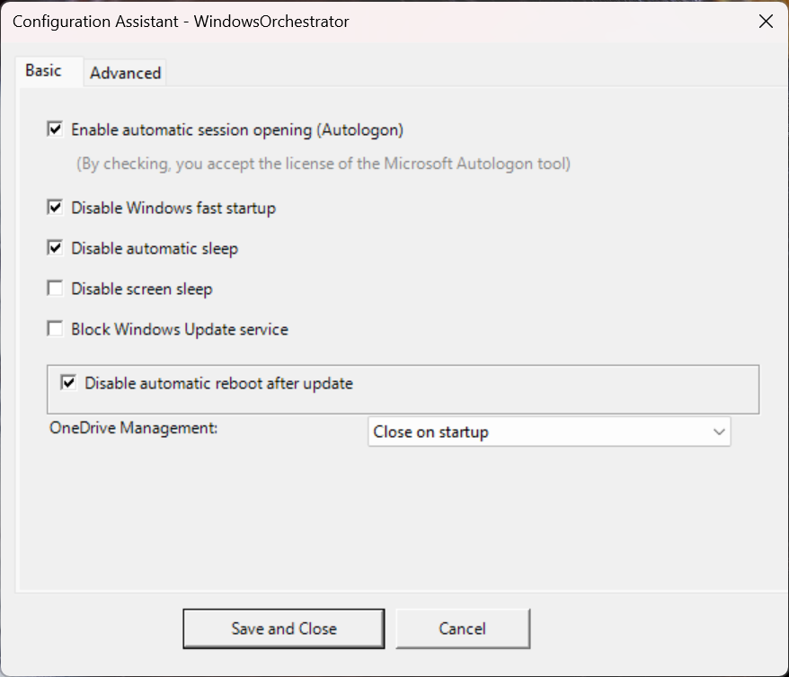
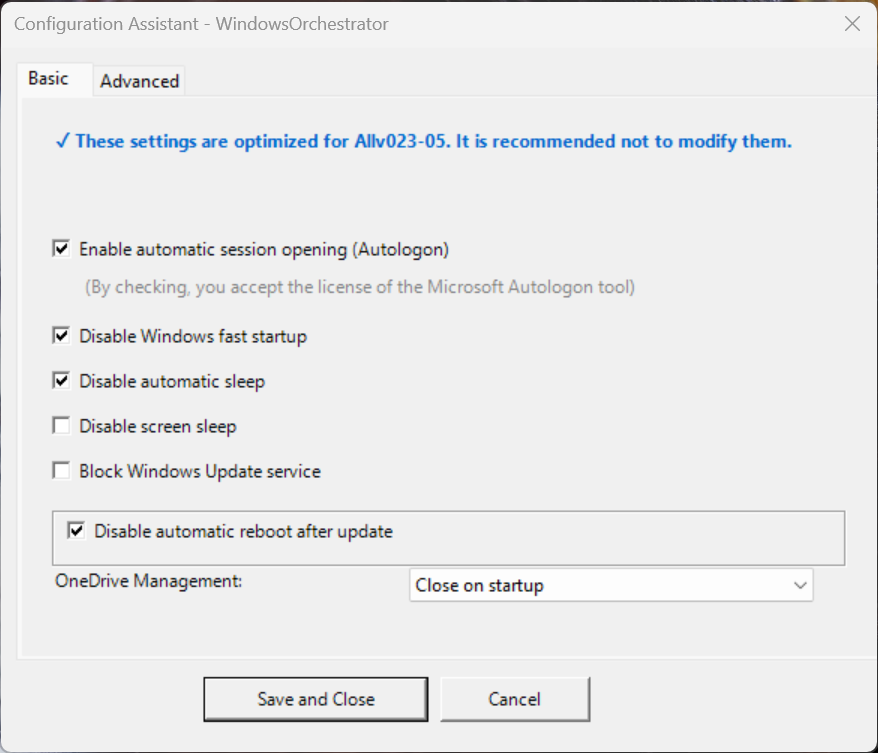
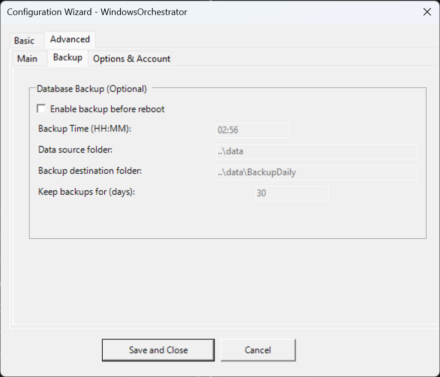
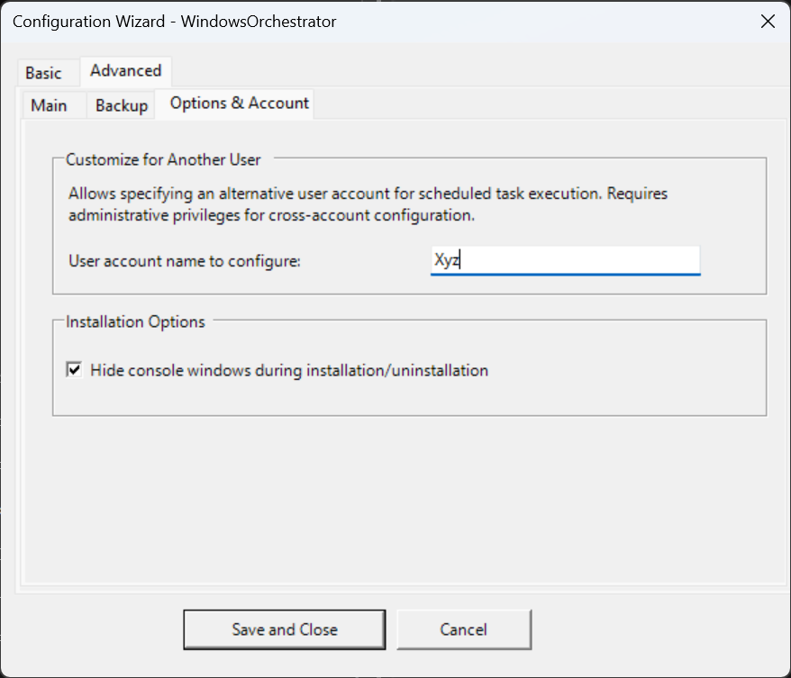

# User Guide - WindowsOrchestrator 1.72

📘 **[DEVELOPER GUIDE](DEVELOPER_GUIDE.md)**
*Intended for system administrators.*

🏠 **[Back to Home](../../README.md)**
*Back to the French documentation portal.*

## Table of Contents

1. [Introduction and Project Overview](#1-introduction-and-project-overview)
    1.1. [What is WindowsOrchestrator?](#11-what-is-windowsorchestrator-)
    1.2. [Technical Nature: An Orchestration Tool, Not a Classic Installation](#12-technical-nature-an-orchestration-tool-not-a-classic-installation)
    1.3. [Design Philosophy](#13-design-philosophy)
    1.4. [License and Warranty](#14-license-and-warranty)
2. [Understanding Security Implications](#2-understanding-security-implications)
    2.1. [Disabling Windows Update: Stability vs Security](#21-disabling-windows-update-stability-vs-security)
        2.1.1. [The Trade-Off Explained](#211-the-trade-off-explained)
        2.1.2. [When is it Acceptable?](#212-when-is-it-acceptable-)
    2.2. [Autologon: Immediate Availability vs Physical Security](#22-autologon-immediate-availability-vs-physical-security)
        2.2.1. [Technical Operation](#221-technical-operation)
        2.2.2. [Real Risks](#222-real-risks)
        2.2.3. [Risk Mitigation](#223-risk-mitigation)
    2.3. [Other Configuration Options and Their Implications](#23-other-configuration-options-and-their-implications)
        [Disabling Fast Startup](#disabling-fast-startup)
        [Disabling Sleep](#disabling-sleep)
        [Blocking OneDrive](#blocking-onedrive)
3. [Integrated Third-Party Tools](#3-integrated-third-party-tools)
    3.1. [Microsoft Sysinternals Autologon](#31-microsoft-sysinternals-autologon)
        3.1.1. [Role and Security](#311-role-and-security)
        3.1.2. [Documentation and Support](#312-documentation-and-support)
    3.2. [Gotify (Notifications - Optional)](#32-gotify-notifications---optional)
        3.2.1. [Presentation and Usage](#321-presentation-and-usage)
        3.2.2. [Required Configuration](#322-required-configuration)
        3.2.3. [Resources](#323-resources)
4. [Installation and Configuration](#4-installation-and-configuration)
    4.1. [System Prerequisites](#41-system-prerequisites)
        4.1.1. [Operating System](#411-operating-system)
        4.1.2. [Privileges and Environment](#412-privileges-and-environment)
    4.2. [Environment Preparation](#42-environment-preparation)
        4.2.1. [Download and Extraction](#421-download-and-extraction)
        4.2.2. [Integrity Verification](#422-integrity-verification)
    4.3. [Launching the Installation](#43-launching-the-installation)
        4.3.1. [Starting the Wizard](#431-starting-the-wizard)
    4.4. [Configuration via the Graphical Wizard](#44-configuration-via-the-graphical-wizard)
        4.4.1. [Basic Tab - Essential Settings](#441-basic-tab---essential-settings)
            [Session Automatic Management Section](#session-automatic-management-section)
            [Windows Settings Section](#windows-settings-section)
            [OneDrive Management Section](#onedrive-management-section)
        4.4.2. [Advanced Tab - Main Sub-Tab](#442-advanced-tab---main-sub-tab)
            [Scheduled Application Closure GroupBox](#scheduled-application-closure-groupbox)
            [Main Application and Daily Cycle GroupBox](#main-application-and-daily-cycle-groupbox)
        4.4.3. [Advanced Tab - Backup Sub-Tab](#443-advanced-tab---backup-sub-tab)
            [Database Backup GroupBox (Optional)](#database-backup-groupbox-optional)
        4.4.4. [Advanced Tab - Options & Account Sub-Tab](#444-advanced-tab---options--account-sub-tab)
            [Customize for Another User GroupBox](#customize-for-another-user-groupbox)
            [Installation Options GroupBox](#installation-options-groupbox)
    4.5. [Automatic Installation Step](#45-automatic-installation-step)
        4.5.1. [Validation and Saving](#451-validation-and-saving)
        4.5.2. [Autologon Assistant (If Enabled)](#452-autologon-assistant-if-enabled)
            [Automatic Download (If Tool is Missing)](#automatic-download-if-tool-is-missing)
            [License Acceptance (EULA)](#license-acceptance-eula)
            [Account Configuration](#account-configuration)
        4.5.3. [Creating Scheduled Tasks](#453-creating-scheduled-tasks)
        4.5.4. [Initial Execution](#454-initial-execution)
        4.5.5. [Exit](#455-exit)
    4.6. [Post-Installation Verification](#46-post-installation-verification)
        4.6.1. [Visual Check](#461-visual-check)
        4.6.2. [Log Check](#462-log-check)
        4.6.3. [Reboot Test](#463-reboot-test)
5. [Daily Life and Operating Cycle](#5-daily-life-and-operating-cycle)
    5.1. [The Automated Daily Cycle](#51-the-automated-daily-cycle)
        5.1.1. [Typical Day Timeline](#511-typical-day-timeline)
            [Phase 1: Normal Usage (00:00 → Closure Time)](#phase-1-normal-usage-0000--closure-time)
            [Phase 2: Application Closure (Example: 02:50)](#phase-2-application-closure-example-0250)
            [Phase 3: Data Backup (Example: 02:57)](#phase-3-data-backup-example-0257)
            [Phase 4: Scheduled Reboot (Example: 02:59)](#phase-4-scheduled-reboot-example-0259)
            [Phase 5: Cold Boot (00:00+)](#phase-5-cold-boot-0000)
            [Phase 6: System Configuration (00:01+)](#phase-6-system-configuration-0001)
            [Phase 7: Session Opening (00:01+)](#phase-7-session-opening-0001)
            [Phase 8: Application Launch (00:02+)](#phase-8-application-launch-0002)
        5.1.2. [Understanding Execution Contexts](#512-understanding-execution-contexts)
            [SYSTEM Context](#system-context)
            [User Context](#user-context)
    5.2. [Monitoring and Verification](#52-monitoring-and-verification)
        5.2.1. [Log Files Location and Reading](#521-log-files-location-and-reading)
            [Files to Consult](#files-to-consult)
            [Automatic Archiving](#automatic-archiving)
            [Manual Log Reading](#manual-log-reading)
            [Advanced Reading with PowerShell](#advanced-reading-with-powershell)
        5.2.2. [Interpreting Gotify Notifications](#522-interpreting-gotify-notifications)
        5.2.3. [Monitoring the Daily Cycle](#523-monitoring-the-daily-cycle)
        5.2.4. [Verifying System Status](#524-verifying-system-status)
6. [Maintenance and Modification](#6-maintenance-and-modification)
    6.1. [Modifying Settings After Installation](#61-modifying-settings-after-installation)
        6.1.1. [Method A: Manual Editing of config.ini (Advanced)](#611-method-a-manual-editing-of-configini-advanced)
            [Taking Changes into Account](#taking-changes-into-account)
        6.1.2. [Method B: Reusing the Graphical Interface (Recommended)](#612-method-b-reusing-the-graphical-interface-recommended)
    6.2. [Adding or Removing Scheduled Tasks](#62-adding-or-removing-scheduled-tasks)
        6.2.1. [Adding a Custom Task](#621-adding-a-custom-task)
        6.2.2. [Removing a Task](#622-removing-a-task)
    6.3. [Updating WindowsOrchestrator](#63-updating-windowsorchestrator)
7. [Uninstallation Procedures](#7-uninstallation-procedures)
    7.1. [Method A: Clean Uninstallation (Recommended)](#71-method-a-clean-uninstallation-recommended)
        7.1.1. [Executing the Uninstall.bat Script](#711-executing-the-uninstallbat-script)
        7.1.2. [Restoration Scope](#712-restoration-scope)
            [Scheduled Tasks](#scheduled-tasks)
            [Windows Update](#windows-update)
            [OneDrive](#onedrive)
            [Fast Startup](#fast-startup)
        7.1.3. [Autologon Cleanup Management](#713-autologon-cleanup-management)
    7.2. [Method B: Manual Emergency Shutdown](#72-method-b-manual-emergency-shutdown)
        7.2.1. [Procedure via Task Scheduler](#721-procedure-via-task-scheduler)
        7.2.2. [Warning on Persistent Registry Modifications](#722-warning-on-persistent-registry-modifications)
        7.2.3. [Manual Parameter Restoration (Advanced)](#723-manual-parameter-restoration-advanced)
            [Re-enabling Windows Update](#re-enabling-windows-update)
            [Re-enabling Fast Startup](#re-enabling-fast-startup)
            [Re-enabling OneDrive](#re-enabling-onedrive)
            [Disabling Autologon (via Registry)](#disabling-autologon-via-registry)
8. [Troubleshooting and FAQ](#8-troubleshooting-and-faq)
    8.1. [Application Does Not Start at Boot](#81-application-does-not-start-at-boot)
        [Diagnostic](#diagnostic)
        [Possible Causes](#possible-causes)
        [Solution](#solution)
    8.2. [Scheduled Reboot Does Not Work](#82-scheduled-reboot-does-not-work)
        [Diagnostic](#diagnostic-1)
        [Possible Causes](#possible-causes-1)
        [Solution](#solution-1)
    8.3. [Backup Fails with "Insufficient Permissions"](#83-backup-fails-with-insufficient-permissions)
        [Diagnostic](#diagnostic-2)
        [Possible Causes](#possible-causes-2)
        [Solution](#solution-2)
    8.4. [Autologon Does Not Work After Installation](#84-autologon-does-not-work-after-installation)
        [Diagnostic](#diagnostic-3)
        [Possible Causes](#possible-causes-3)
        [Registry Verification](#registry-verification)
        [Solution](#solution-3)
    8.5. [Silent Mode Does Not Hide Windows](#85-silent-mode-does-not-hide-windows)
        [Diagnostic](#diagnostic-4)
        [Possible Causes](#possible-causes-4)
        [Solution](#solution-4)
    8.6. [Splash Screen Remains Stuck Indefinitely](#86-splash-screen-remains-stuck-indefinitely)
        [Diagnostic](#diagnostic-5)
        [Possible Causes](#possible-causes-5)
        [Emergency Solution](#emergency-solution)
        [Permanent Solution](#permanent-solution)
9. [Appendices](#9-appendices)
    9.1. [Complete Structure of the config.ini File](#91-complete-structure-of-the-configini-file)
    9.2. [Script Exit Codes](#92-script-exit-codes)
    9.3. [Critical File Locations](#93-critical-file-locations)
    9.4. [Support and Resources](#94-support-and-resources)

---

## 1. Introduction and Project Overview

### 1.1. What is WindowsOrchestrator?

WindowsOrchestrator is a set of PowerShell scripts designed to automate the management of a Windows workstation. It transforms a standard machine into an autonomous system capable of:

- Automatically starting a business application without human intervention
- Rebooting daily according to a defined schedule
- Automatically backing up sensitive data
- Maintaining optimized system settings for stability

The project is primarily intended for professional environments: interactive kiosks, digital signage, continuous production workstations, or any system that must operate continuously with minimal maintenance.

### 1.2. Technical Nature: An Orchestration Tool, Not a Classic Installation

WindowsOrchestrator does not install like a traditional software. It does not copy any files to `C:\Program Files` or `C:\Windows`, and does not appear in the system's installed applications list.

The scripts remain in the folder you downloaded. The installation configures Windows Task Scheduler to execute these scripts at appropriate times. The scheduled tasks point directly to the files present in your folder.

The project folder must never be moved or deleted after installation. If you need to move it, you must first uninstall, move the folder, then reinstall from the new location.

### 1.3. Design Philosophy

WindowsOrchestrator is based on three fundamental principles.

No hidden manipulation of the system. Every action is documented and traceable in logs. The source code is open and auditable.

The tool only applies what you explicitly configure. No automatic decisions on critical settings. Uninstallation is possible at any time.

Some options reduce security by design. The tool does not replace a professional backup strategy. The administrator remains responsible for security and data sustainability.

### 1.4. License and Warranty

This software is distributed under the GNU General Public License v3.0 (GPLv3). You are free to use, modify, and redistribute it according to the terms of this license. The source code is accessible and modifiable.

The software is provided as-is, without any warranty of any kind. The authors cannot be held responsible for direct or indirect damages resulting from its use, including data loss, service interruption, or compatibility issues.

You must test the software in a non-critical environment before deployment, maintain external backups independent of the system, and verify compatibility with your business applications.

---

## 2. Understanding Security Implications

WindowsOrchestrator offers powerful features that require disabling certain Windows security mechanisms. This section explains the risks and best practices.

### 2.1. Disabling Windows Update: Stability vs Security

#### 2.1.1. The Trade-Off Explained

Disabling updates guarantees stability: the software environment remains frozen and predictable. It avoids unexpected reboots that interrupt service and prevents Windows behavior changes between versions.

The incurred risks are real: security vulnerabilities are not corrected, the machine becomes vulnerable to automated attacks, and this may create non-compliance with certain enterprise IT policies.

#### 2.1.2. When is it Acceptable?

Disabling Windows Update is acceptable only if all these conditions are met.

The machine is not directly exposed to the Internet. It must be behind a professional firewall, on a separate VLAN from the main network, without web browsing or email.

The stability need is critical: the slightest reboot causes harm. This concerns permanent airport displays, industrial production lines, or continuous surveillance systems.

You have a procedure to apply updates manually: monthly maintenance window, temporary reactivation of Windows Update, testing updates on a similar post.

If these conditions are not met, leave Windows Update enabled and only adjust the reboot policy via `DisableAutoReboot=true`.

### 2.2. Autologon: Immediate Availability vs Physical Security

#### 2.2.1. Technical Operation

When autologon is enabled, Windows starts directly on the desktop without a login screen. The password is stored in an encrypted manner in the LSA (Local Security Authority). The official Microsoft Sysinternals Autologon tool is used for this operation.

#### 2.2.2. Real Risks

The password remains encrypted and not visible in the registry. Authenticated network access is preserved. BitLocker encryption (if enabled) protects data at rest.

However, anyone with physical access can use the open session. User files and documents are accessible. Open applications can be manipulated. A simple reboot is enough to access the system.

#### 2.2.3. Risk Mitigation

Create a specific user account for autologon, without local administrator rights, with access limited to only the necessary folders for the application, and without access to sensitive network shares.

Secure the machine physically: locked enclosure, restricted access room, disabling USB port in BIOS to prevent bootable USB keys.

Enable BitLocker to encrypt the hard drive and protect data in case of machine theft. Note that BitLocker does not protect once the system is booted.

Autologon is suitable for display kiosks in public areas with read-only accounts, production workstations in secure factories, or embedded systems without physical interface. It is discouraged on administrator workstations with elevated privileges, machines storing sensitive unencrypted data, or environments accessible to the public without supervision.

### 2.3. Other Configuration Options and Their Implications

#### Disabling Fast Startup

Disabling fast startup forces a complete reboot without hibernation. It reloads drivers and services completely. The boot time is slightly longer. It avoids phantom memory issues after several weeks without a complete reboot.

#### Disabling Sleep

On a laptop, disabling sleep causes complete battery drain if forgotten, continuous machine heating, and premature wear of components. This option is reserved for fixed production workstations in continuous operation.

#### Blocking OneDrive

Blocking OneDrive has minimal impact as OneDrive is generally not critical for operation. The advantage is saving system resources and avoiding untimely synchronizations.

---

## 3. Integrated Third-Party Tools

### 3.1. Microsoft Sysinternals Autologon

#### 3.1.1. Role and Security

WindowsOrchestrator never directly manages passwords. This critical responsibility is delegated to the official Microsoft Autologon tool.

No password is ever written in `config.ini` or PowerShell scripts. The password is encrypted via Windows' LSA API, using the same method as Windows services. The encryption is machine-bound and not exportable.

The installation process automatically downloads the tool from `live.sysinternals.com` (official Microsoft URL), verifies its integrity by confirming the presence of `Eula.txt` and the executable, requests user acceptance of the license, allows interactive entry of credentials in the Autologon interface, then performs automatic encryption.

#### 3.1.2. Documentation and Support

Official page: <https://learn.microsoft.com/sysinternals/downloads/autologon>

Publisher: Microsoft Corporation

License: Proprietary Microsoft (free)

Support: Windows 7 to Windows 11

If download fails, manually download `Autologon.zip` from the Microsoft site, extract all files into `management/tools/Autologon/`, then relaunch installation.

### 3.2. Gotify (Notifications - Optional)

#### 3.2.1. Presentation and Usage

Gotify is a self-hosted push notification server that allows remote monitoring of the machine's status.

Typical use cases concern machines installed in a server room without a screen, supervision of multiple kiosks from a central dashboard, or smartphone alerts via the Gotify app.

The scripts send HTTP messages to your Gotify server. You receive real-time notifications: successful startup, application launched, critical error. Detailed logs remain in local files.

#### 3.2.2. Required Configuration

To use Gotify, you must host your own Gotify instance (Linux server, Docker, etc.), create an application in the Gotify interface, retrieve the authentication token, then fill in the `[Gotify]` section in `config.ini`.

No data is sent to third-party servers. You fully control the notification infrastructure. The system is disableable by simply leaving the section empty.

#### 3.2.3. Resources

Official site: <https://gotify.net/>

Source code: <https://github.com/gotify/server>

License: MIT (Open Source)

---

## 4. Installation and Configuration

### 4.1. System Prerequisites

#### 4.1.1. Operating System

WindowsOrchestrator is compatible with Windows 10 (version 1809 or later recommended), Windows 11 (all versions), Windows Server 2016, 2019, 2022 (unofficial support not tested).

Professional and Enterprise editions are fully supported. Home edition is functional but some GPOs may be limited.

#### 4.1.2. Privileges and Environment

The account used for installation must have local Administrator privileges. These rights are necessary to modify HKLM registry, create scheduled tasks, and manage services.

PowerShell version 5.1 minimum is required (included by default in Windows 10+). Execution policy is managed automatically by scripts via `-ExecutionPolicy Bypass`.

Internet connection is optional. It is only necessary if `UseAutologonAssistant=true` and Autologon.exe is missing. The system can operate offline if the tool is already present.

### 4.2. Environment Preparation

#### 4.2.1. Download and Extraction

Download the project archive from GitHub. Extract the contents into a permanent folder, for example `C:\WindowsOrchestrator\` or `D:\Automation\WO\`. Do not install in `C:\Program Files\` due to permission issues. Avoid Desktop or Downloads folder which may be cleaned.

#### 4.2.2. Integrity Verification

Expected project structure:

```
WindowsOrchestrator/
├── Install.bat
├── Uninstall.bat
├── config.ini (will be created during installation)
├── management/
│   ├── firstconfig.ps1
│   ├── install.ps1
│   ├── uninstall.ps1
│   ├── config_systeme.ps1
│   ├── config_utilisateur.ps1
│   ├── Invoke-DatabaseBackup.ps1
│   ├── Launch-Install.ps1
│   ├── Launch-Uninstall.ps1
│   ├── modules/
│   │   └── WindowsOrchestratorUtils/
│   └── defaults/
│       └── default_config.ini
└── i18n/
    ├── en-US/
    └── fr-FR/
```

### 4.3. Launching the Installation

#### 4.3.1. Starting the Wizard

Locate the file `Install.bat` at the project root. Double-click on `Install.bat`. A console window opens and the graphical configuration wizard `firstconfig.ps1` appears.

Configure the desired settings via the graphical interface. Once the configuration is validated by clicking "Save and Close", the User Account Control (UAC) appears. Click "Yes" to authorize execution with administrator privileges.

### 4.4. Configuration via the Graphical Wizard

The `firstconfig.ps1` wizard allows generating the `config.ini` file intuitively. It is organized into two main tabs.

#### 4.4.1. Basic Tab - Essential Settings



##### Session Automatic Management Section

The checkbox "Enable automatic session opening (Autologon)" triggers autologon if checked. If unchecked, the classic manual session with login screen is maintained.

A note indicates that by checking, you accept the Microsoft Autologon tool license.

##### Windows Settings Section

"Disable Windows Fast Startup" is recommended. This option forces a complete daily reboot by disabling Windows' partial hibernation.

"Disable automatic sleep" prevents the system from entering sleep (S3/S4). Be careful: on a laptop, this option drains the battery.

"Disable screen sleep" keeps the screen on permanently. Useful for digital signage or permanent dashboards.

"Block Windows Update service" completely disables automatic updates. Re-read section 2.1 before enabling this option. If you check it, a sub-option "Disable automatic reboot after update" becomes available.

##### OneDrive Management Section

A dropdown menu offers three choices.

"Block (system policy)" prohibits OneDrive execution via GPO. This option is recommended for kiosks and terminals.

"Close at startup" kills the OneDrive.exe process at boot. OneDrive can be relaunched manually afterward.

"Do nothing" leaves OneDrive functioning normally.

#### Pre-Configuration Indication (Frozen Configuration)

When the `ShowContextMessages` option is active, a blue banner appears at the top of the window. It simply signals that the configuration has already been set internally, to avoid bad settings.



#### 4.4.2. Advanced Tab - Main Sub-Tab


##### Scheduled Application Closure GroupBox

"Closure time (HH:MM)" defines the moment when the application will receive the closure order (ALT+F4). This time must be before the reboot time. Example: `02:50`.

"Command to execute before closure" allows specifying a script or executable to launch before reboot. Leave empty if no prior action is needed. Example: `management\Invoke-DatabaseBackup.ps1`.

"Arguments for the command" is empty by default.

##### Main Application and Daily Cycle GroupBox

"Scheduled reboot time (HH:MM)" defines the moment when the system reboots automatically. Leave empty to disable scheduled reboot. Example: `02:59`.

"Application to launch" specifies the path to your application's startup file. Accepted formats are `.exe`, `.bat`, `.cmd`, `.ps1`. Relative paths are calculated from the project root. Absolute paths are also accepted, for example `C:\MyApp\start.exe`. Example: `LaunchApp.bat`.

"Arguments for the application" allows passing command-line parameters. Empty by default.

"Process name to monitor (without .exe)" is the exact name of the final process to monitor. This parameter is crucial as it allows verifying if the application is already running. Leave empty if using a wrapper (.bat) without monitoring. Example: `MyApp`.

"Console launch mode" offers two options. "Standard launch (recommended)" uses the default terminal (Windows Terminal if available). "Legacy launch (legacy console)" forces cmd.exe with new window for older script compatibility.

The checkbox "Launch main application minimized in taskbar" starts the application minimized if checked. This option is not applicable in legacy mode.

#### 4.4.3. Advanced Tab - Backup Sub-Tab



##### Database Backup GroupBox (Optional)

The checkbox "Enable backup before reboot" activates the automatic copy module.

The following fields are grayed out until the checkbox is checked.

"Backup time (HH:MM)" must be configured 5-10 minutes after closure time to allow the application to complete its writes. Example: `02:57`.

"Source data folder" specifies the relative or absolute path to the folder to backup. Example: `..\data`.

"Backup destination folder" defines the path where copies will be stored. Example: `..\data\BackupDaily`.

"Backup retention period (in days)" indicates how many days backups are kept. Older backups are automatically deleted. Example: `10`.

#### 4.4.4. Advanced Tab - Options & Account Sub-Tab



##### Customize for Another User GroupBox

"User account name to configure" allows specifying a different account from the one launching the installation. By default, it is the user executing the installation. This option allows configuring autologon for another account. Example: `AdminLocal`.

##### Installation Options GroupBox

The checkbox "Hide console windows during installation/uninstallation" activates silent mode. When checked, a splash screen appears instead of PowerShell consoles, and a final MessageBox indicates the operation result.

### 4.5. Automatic Installation Step

#### 4.5.1. Validation and Saving

Once you click "Save and Close", the wizard generates the `config.ini` file at the project root. A dialog box confirms the save: "Configuration saved in 'C:\WindowsOrchestrator\config.ini'". The wizard closes automatically and the `install.ps1` installation script starts.

#### 4.5.2. Autologon Assistant (If Enabled)

If you checked "Enable automatic session opening" in the wizard, the following process is triggered.

##### Automatic Download (If Tool is Missing)

A splash screen indicates "Downloading Microsoft Autologon tool...". The tool is extracted into `management/tools/Autologon/`.

##### License Acceptance (EULA)

Notepad opens displaying the Sysinternals license agreement. Read the document then close the window. A dialog asks "Do you accept the terms of the Sysinternals Autologon tool license?". Click "Yes" to continue or "No" to cancel.

##### Account Configuration

The Autologon.exe window opens. The fields to fill are as follows.

"Username" contains the account name, usually pre-filled with the configured user's name.

"Domain" contains the machine or domain name. Use `.` for a local account.

"Password" requires entering the account password. This password will be encrypted automatically.

Click the "Enable" button. A message confirms the password is encrypted and stored. Close the window. The splash screen reappears for the installation continuation.

#### 4.5.3. Creating Scheduled Tasks

The script automatically creates the following tasks in Windows Task Scheduler.

`WindowsOrchestrator-SystemStartup` executes at system startup in SYSTEM context.

`WindowsOrchestrator-UserLogon` executes at user logon in the configured user's context.

Dynamic tasks are created if configured: `WindowsOrchestrator-SystemBackup`, `WindowsOrchestrator-SystemScheduledReboot`, `WindowsOrchestrator-System-CloseApp`, `WindowsOrchestrator-User-CloseApp`.

Check their presence by opening Task Scheduler (`Win+R` then `taskschd.msc`). The tasks should appear at the library root.

#### 4.5.4. Initial Execution

The script immediately launches `config_systeme.ps1` to apply system configuration. It then starts the `WindowsOrchestrator-UserLogon` task to launch the application.

In silent mode, a final MessageBox indicates "WindowsOrchestrator installation completed successfully! All logs have been saved in the Logs folder."

#### 4.5.5. Exit

The exit behavior depends on the configuration in `config.ini`.

If `RebootOnCompletion=true`, the system reboots after 15 seconds (configurable via `RebootGracePeriod`).

If `PowerShellExitMode=automatic`, the console closes after 15 seconds (configurable via `PowerShellExitDelay`).

If `PowerShellExitMode=manual`, you must press Enter to close the console.

### 4.6. Post-Installation Verification

#### 4.6.1. Visual Check

Open Task Scheduler (`Win+R` then `taskschd.msc`). Check the presence of `WindowsOrchestrator-SystemStartup` and `WindowsOrchestrator-UserLogon`. Right-click on each task, select "Properties", then the "Triggers" tab to verify conditions.

#### 4.6.2. Log Check

Access the `C:\WindowsOrchestrator\Logs\` folder. Open `config_systeme_ps.txt` and `config_utilisateur_ps.txt`. Check for the absence of lines containing `[ERROR]`.

#### 4.6.3. Reboot Test

Manually reboot the PC. Observe if the session opens automatically (if Autologon is enabled). Check that the target application launches correctly.

---

## 5. Daily Life and Operating Cycle

Once WindowsOrchestrator is installed, the machine enters an autonomous operating cycle. You no longer need to physically intervene on the workstation to start it or launch the application.

### 5.1. The Automated Daily Cycle

#### 5.1.1. Typical Day Timeline

##### Phase 1: Normal Usage (00:00 → Closure Time)

The system operates normally. The business application is active. No orchestrator intervention.

##### Phase 2: Application Closure (Example: 02:50)

The `WindowsOrchestrator-User-CloseApp` task executes if configured. The default action consists of searching for the "MyApp" window and sending the key sequence `{ESC}{ESC}x{ENTER}` (Escape x2, x, Enter). The maximum wait time is 60 seconds with attempts every 5 seconds. The result is logged in `config_utilisateur_ps.txt`.

##### Phase 3: Data Backup (Example: 02:57)

The `WindowsOrchestrator-SystemBackup` task executes if enabled. The action consists of copying files modified in the last 24 hours to the destination folder.
**Important note:** To ensure database integrity (e.g., SQLite), if a file is detected as modified, the script also forces backup of all files with the same name (e.g., `.db-wal`, `.db-shm`), even if not recently modified. The result is logged in `Invoke-DatabaseBackup_log.txt`.

##### Phase 4: Scheduled Reboot (Example: 02:59)

The `WindowsOrchestrator-SystemScheduledReboot` task executes. The action launches `shutdown.exe /r /t 0`. The system reboots immediately.

##### Phase 5: Cold Boot (00:00+)

Fast Startup is disabled, so Windows kernel loading is complete. No hibernation state is preserved.

##### Phase 6: System Configuration (00:01+)

The `WindowsOrchestrator-SystemStartup` task executes at startup with the "At Startup" trigger. The actions performed are policy verification and application (Windows Update, OneDrive, etc.), power management via powercfg, and recreation of dynamic tasks if necessary. The result is logged in `config_systeme_ps.txt`.

##### Phase 7: Session Opening (00:01+)

If autologon is enabled, the session opens automatically. If autologon is disabled, the classic login screen appears.

##### Phase 8: Application Launch (00:02+)

The `WindowsOrchestrator-UserLogon` task executes with the "At Logon" trigger. The actions are as follows: check if the `ProcessToMonitor` process is already running, launch via the configured method (direct/cmd/powershell/legacy) if the process is absent, no action if the process is present (only an info log is generated). The system does not perform continuous monitoring (no watchdog). The result is logged in `config_utilisateur_ps.txt`.

#### 5.1.2. Understanding Execution Contexts

##### SYSTEM Context

The `config_systeme.ps1` script executes at Windows startup, before session opening. It runs with SYSTEM privileges (equivalent to root under Linux). It can modify HKLM registry, manage Windows services, and apply group policies. It has no access to the user profile and cannot launch graphical applications.

##### User Context

The `config_utilisateur.ps1` script executes at the configured user's session opening. It runs with that user's rights. It can launch graphical applications and access files in the user profile. It cannot modify system HKLM settings without elevated rights.

### 5.2. Monitoring and Verification

#### 5.2.1. Log Files Location and Reading

Logs are located in the `Logs/` folder at the project root.

##### Files to Consult

`config_systeme_ps.txt` allows checking if updates are properly blocked or if the PC booted this morning.

`config_utilisateur_ps.txt` allows checking at what time the application was launched or relaunched.

`Invoke-DatabaseBackup_log.txt` allows checking the list of backed up files and confirming no disk space error.

##### Automatic Archiving

To avoid saturating the disk, the orchestrator automatically archives and deletes old logs. You will find numbered files (`config_systeme_ps.1.txt`, `config_systeme_ps.2.txt`, etc.) corresponding to previous days. The number of files kept is configurable via `MaxSystemLogsToKeep` and `MaxUserLogsToKeep` in `config.ini`.

##### Manual Log Reading

Open files with Notepad++, VSCode, or Notepad. Search for `[ERROR]` to identify problems. Check timestamps to understand the event sequence.

##### Advanced Reading with PowerShell

```powershell
# Display only errors from the last 24 hours
Get-Content "C:\WindowsOrchestrator\Logs\config_systeme_ps.txt" | Select-String "\[ERROR\]" | Select-Object -Last 50

# Filter by date
$today = Get-Date -Format "yyyy-MM-dd"
Get-Content "C:\WindowsOrchestrator\Logs\config_systeme_ps.txt" | Select-String "^$today"
```

#### 5.2.2. Interpreting Gotify Notifications

If you configured the `[Gotify]` section in `config.ini`, you don't need to check logs. Your monitoring server will receive real-time messages.

An INFO level message (green or blue) indicates everything is nominal: "Startup completed", "Application launched", "Backup successful".

An ERROR level message (red) signals that an action failed: "Unable to launch application", "Full disk during backup". Intervention is required.

#### 5.2.3. Monitoring the Daily Cycle

Check logs every morning to verify the backup executed correctly, the reboot occurred, and the application relaunched.

#### 5.2.4. Verifying System Status

Open Task Scheduler (`taskschd.msc`). Consult the "History" tab of the `WindowsOrchestrator-*` tasks. A result code `0x0` means success.

---

## 6. Maintenance and Modification

Your workstation needs may evolve: time change, new application, backup policy modification. WindowsOrchestrator is designed to be reconfigurable without requiring complete uninstallation.

### 6.1. Modifying Settings After Installation

#### 6.1.1. Method A: Manual Editing of `config.ini` (Advanced)

This method is the fastest for minor modifications, for example changing reboot time.

Open the project folder. Right-click on the `config.ini` file and choose "Open with" then "Notepad". Modify the desired value. For example, change `ScheduledRebootTime=03:00` to `ScheduledRebootTime=04:00`. Save the file (`Ctrl + S`) and close it.

##### Taking Changes into Account

Time changes will be taken into account automatically at the next script restart, usually at the next PC boot. For immediate effect without rebooting the PC, you can manually relaunch the installation script by double-clicking on `Install.bat`.

#### 6.1.2. Method B: Reusing the Graphical Interface (Recommended)

This method is safer as it validates your input formats and reapplies scheduled tasks immediately.

Double-click on `Install.bat`. The graphical wizard will detect your existing `config.ini` file and load your current settings into the fields. Make your modifications in the interface, for example checking or unchecking an option. Click "Save and Close". The script will update the scheduled tasks with your new parameters.

### 6.2. Adding or Removing Scheduled Tasks

#### 6.2.1. Adding a Custom Task

You want to add a custom cleanup script at 22:00.

Modify `config.ini` to add `ScheduledCloseTime=22:00`. Modify `ScheduledCloseCommand` to point to your script. Relaunch `Install.bat`. Check in `taskschd.msc` that the new task is created.

#### 6.2.2. Removing a Task

Empty the corresponding field in `config.ini`, for example `ScheduledRebootTime=`. Relaunch `Install.bat`. The script automatically deletes the obsolete task.

### 6.3. Updating WindowsOrchestrator

If a new version of WindowsOrchestrator is available, here's the procedure to update your installation without losing your configuration.

Back up your current `config.ini` file to a safe place, for example on the Desktop. It is recommended (but not mandatory) to run `Uninstall.bat` to clean up before updating. Delete the project folder contents and replace with the new version files. Put your backed up `config.ini` back at the project root. Double-click on `Install.bat`.

The wizard will read your old configuration. If there are new options in the new version, they will appear, often with default values. Check them. Validate to reinstall the system with the updated engine.

---

## 7. Uninstallation Procedures

WindowsOrchestrator is designed to be reversible. You keep full control over the machine and can stop automation at any time.

### 7.1. Method A: Clean Uninstallation (Recommended)

This is the standard method. It uses the provided uninstallation script to properly undo modifications and clean the environment.

#### 7.1.1. Executing the `Uninstall.bat` Script

Open the project folder. Double-click on the `Uninstall.bat` file. A Windows window will ask you to authorize the application to make changes (UAC). Click "Yes". This is necessary to delete system registry keys.

#### 7.1.2. Restoration Scope

The script automatically resets vital Windows parameters to their default state.

##### Scheduled Tasks

Immediate deletion of startup, logon, closure, and backup tasks. Automation stops instantly.

##### Windows Update

The service is unblocked and set to automatic startup. Registry keys blocking updates are deleted.

##### OneDrive

The execution prohibition policy is lifted.

##### Fast Startup

Windows' "Fast Startup" feature is re-enabled.

Log files (`Logs/`) and configuration file (`config.ini`) are not deleted to allow you to keep a history trace. You can manually delete the project folder once the operation is completed.

#### 7.1.3. Autologon Cleanup Management

If automatic login was enabled, the uninstallation script will detect this state and ask if you wish to disable it.

If you answer "Yes", the script will relaunch the official Microsoft Autologon tool. In the tool window that opens, simply click the "Disable" button. This ensures the encrypted password is properly erased from Windows' secure area (LSA). Then close the window.

### 7.2. Method B: Manual Emergency Shutdown

If, for some reason (corrupted script, system error), method A does not work, you can use this manual method. It allows regaining control immediately by using only Windows built-in tools.

#### 7.2.1. Procedure via Task Scheduler

Press the `Windows + R` keys on your keyboard simultaneously. Type `taskschd.msc` in the window that opens and validate with Enter. In the left column, click on the "Task Scheduler Library" folder. In the central list, search for lines starting with `WindowsOrchestrator` (there are usually between 2 and 6). Right-click on each of these lines, select "Delete" and confirm.

Automation is immediately cut. At the next reboot, no script will launch.

#### 7.2.2. Warning on Persistent Registry Modifications

This method B is an emergency shutdown, not a complete cleanup.

What is stopped: automatic launch of your application and scheduled reboots.

What remains modified: deep system parameters (blocked Windows Update, active Autologon, disabled sleep) remain in the state the orchestrator put them in.

Use this method to stop automation immediately, but try to run method A as soon as possible to restore system parameters properly, or modify them manually via Windows settings.

#### 7.2.3. Manual Parameter Restoration (Advanced)

If the automatic uninstallation failed or you used method B, you can manually restore system parameters.

##### Re-enabling Windows Update

```powershell
# Remove GPO keys
Remove-ItemProperty -Path "HKLM:\SOFTWARE\Policies\Microsoft\Windows\WindowsUpdate\AU" -Name "NoAutoUpdate" -ErrorAction SilentlyContinue
Remove-ItemProperty -Path "HKLM:\SOFTWARE\Policies\Microsoft\Windows\WindowsUpdate\AU" -Name "NoAutoRebootWithLoggedOnUsers" -ErrorAction SilentlyContinue

# Reactivate service
Set-Service -Name "wuauserv" -StartupType Automatic
Start-Service -Name "wuauserv"
```

##### Re-enabling Fast Startup

```powershell
Set-ItemProperty -Path "HKLM:\SYSTEM\CurrentControlSet\Control\Session Manager\Power" -Name "HiberbootEnabled" -Value 1 -Type DWord
```

##### Re-enabling OneDrive

```powershell
Remove-ItemProperty -Path "HKLM:\SOFTWARE\Policies\Microsoft\Windows\OneDrive" -Name "DisableFileSyncNGSC" -ErrorAction SilentlyContinue
```

##### Disabling Autologon (via Registry)

```powershell
Set-ItemProperty -Path "HKLM:\SOFTWARE\Microsoft\Windows NT\CurrentVersion\Winlogon" -Name "AutoAdminLogon" -Value "0"
Remove-ItemProperty -Path "HKLM:\SOFTWARE\Microsoft\Windows NT\CurrentVersion\Winlogon" -Name "DefaultPassword" -ErrorAction SilentlyContinue
```

---

## 8. Troubleshooting and FAQ

### 8.1. Application Does Not Start at Boot

#### Diagnostic

Open `Logs\config_utilisateur_ps.txt`. Search for `[ERROR]` or `ProcessToLaunch`.

#### Possible Causes

The path is incorrect: verify that `ProcessToLaunch` in `config.ini` points to an existing file.

Insufficient permissions: the user account does not have the right to execute the file.

The process is already running: if `ProcessToMonitor` detects the application is running, the script does not relaunch it.

#### Solution

```ini
# Example with absolute path
ProcessToLaunch=C:\MyApp\start.bat

# Example with relative path
# Note: The starting point is the 'management/' folder
# To reach a folder at the project root:
ProcessToLaunch=..\MyApp\start.bat
# For a file in the management folder:
ProcessToLaunch=LaunchApp.bat
```

### 8.2. Scheduled Reboot Does Not Work

#### Diagnostic

Open `taskschd.msc`. Check that `WindowsOrchestrator-SystemScheduledReboot` exists. Go to the "Triggers" tab and verify the configured time.

#### Possible Causes

`ScheduledRebootTime` is empty in `config.ini`. The task was manually disabled. The "Task Scheduler" service is stopped.

#### Solution

```powershell
# Check task status
Get-ScheduledTask -TaskName "WindowsOrchestrator-SystemScheduledReboot"

# Relaunch installation to recreate the task
# (double-click on Install.bat)
```

### 8.3. Backup Fails with "Insufficient Permissions"

#### Diagnostic

Open `Logs\config_systeme_ps.txt`. Search for "Insufficient permissions".

#### Possible Causes

The SYSTEM account has no access to the destination folder. The destination folder is on a network drive without credentials.

#### Solution

```powershell
# Check destination folder ACLs
Get-Acl "C:\Backup\AllSys" | Format-List

# Add permissions for SYSTEM
$acl = Get-Acl "C:\Backup\AllSys"
$rule = New-Object System.Security.AccessControl.FileSystemAccessRule("SYSTEM", "Modify", "ContainerInherit,ObjectInherit", "None", "Allow")
$acl.SetAccessRule($rule)
Set-Acl "C:\Backup\AllSys" $acl
```

### 8.4. Autologon Does Not Work After Installation

#### Diagnostic

Reboot the PC. Observe if the login screen appears.

#### Possible Causes

The password entered in Autologon.exe is incorrect. An Active Directory Group Policy forces the login screen. The user account is disabled.

#### Registry Verification

```powershell
Get-ItemProperty -Path "HKLM:\SOFTWARE\Microsoft\Windows NT\CurrentVersion\Winlogon" -Name "AutoAdminLogon"
# Should return "1"
```

#### Solution

Relaunch `management\tools\Autologon\Autologon64.exe` (or `.exe` depending on your architecture). Re-enter the information (Username, Domain, Password). Click "Enable". Reboot to test.

### 8.5. Silent Mode Does Not Hide Windows

#### Diagnostic

PowerShell consoles appear during installation.

#### Possible Causes

`SilentMode=false` in `config.ini`. The script was launched directly without going through `Install.bat`.

#### Solution

Open `config.ini`. Verify that under `[Installation]`, you have `SilentMode=true`. Always launch via `Install.bat`, not directly `install.ps1`.

### 8.6. Splash Screen Remains Stuck Indefinitely

#### Diagnostic

The "Operation in progress, please wait..." window never closes.

#### Possible Causes

Network timeout on Gotify (if enabled). User interaction waiting (EULA Autologon). Unhandled fatal error.

#### Emergency Solution

Open Task Manager (`Ctrl+Shift+Esc`). Go to the "Details" tab. Search for `powershell.exe` with a command line containing `EncodedCommand`. Right-click and select "End Task". Check logs to identify the error.

#### Permanent Solution

```ini
# Disable Gotify if not needed
[Gotify]
EnableGotify=false
```

---

## 9. Appendices

### 9.1. Complete Structure of the config.ini File

Refer to the `management\defaults\default_config.ini` file for the complete and commented reference structure.

### 9.2. Script Exit Codes

Code `0`: Success

Code `1`: Critical error or user cancellation

### 9.3. Critical File Locations

Configuration: `config.ini` (project root)

System logs: `Logs\config_systeme_ps.txt`

User logs: `Logs\config_utilisateur_ps.txt`

Backup logs: `Logs\Invoke-DatabaseBackup_log.txt`

Autologon tool: `management\tools\Autologon\Autologon64.exe`

Core module: `management\modules\WindowsOrchestratorUtils\WindowsOrchestratorUtils.psm1`

### 9.4. Support and Resources

GitHub Issues: [Link to the project's GitHub repository]

Developer documentation: `docs/en-US/DEVELOPER_GUIDE.md`

License: `LICENSE` (GNU GPLv3)