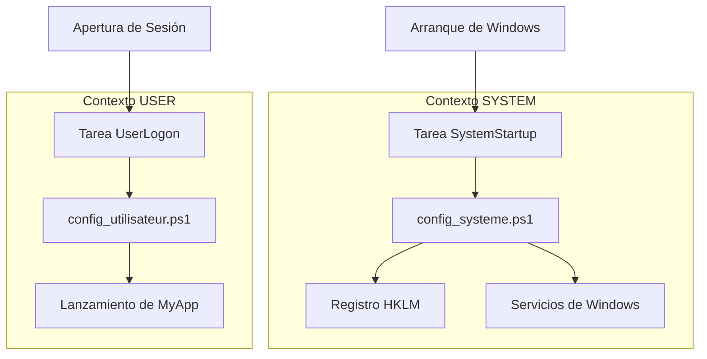

# GUÍA DEL DESARROLLADOR - WindowsOrchestrator 1.73

---

📘 **[Guía del Usuario](GUIA_DEL_USUARIO.md)**
*Dirigida a administradores de sistemas y técnicos de implementación.*
Contiene procedimientos paso a paso, capturas de pantalla del asistente y guías de resolución de problemas.

🏠 **[Volver al inicio](README.md)**
*Volver al portal de documentación española.*

---

## Tabla de Contenidos

1. [Preámbulo Técnico y Alcance del Proyecto](#1-preámbulo-técnico-y-alcance-del-proyecto)
    1.1. [Naturaleza No Instalable y Filosofía de Portabilidad](#11-naturaleza-no-instalable-y-filosofía-de-portabilidad)
    1.2. [Descargo de Responsabilidad Técnica](#12-descargo-de-responsabilidad-técnica)
    1.3. [Convenciones de Nomenclatura y Terminología](#13-convenciones-de-nomenclatura-y-terminología)
2. [Arquitectura del Sistema y Modelo de Seguridad](#2-arquitectura-del-sistema-y-modelo-de-seguridad)
    2.1. [El Modelo de Separación de Privilegios](#21-el-modelo-de-separación-de-privilegios)
        2.1.1. [El Contexto SYSTEM (config_systeme.ps1)](#211-el-contexto-system-config_systemeps1)
        2.1.2. [El Contexto USER (config_utilisateur.ps1)](#212-el-contexto-user-config_utilisateurps1)
        2.1.3. [Diagrama de Flujo de Ejecución](#213-diagrama-de-flujo-de-ejecución)
    2.2. [Arquitectura de Tareas Programadas](#22-arquitectura-de-tareas-programadas)
        2.2.1. [Tareas Principales (Estáticas)](#221-tareas-principales-estáticas)
        2.2.2. [Tareas Dinámicas (Gestionadas por el Runtime)](#222-tareas-dinámicas-gestionadas-por-el-runtime)
        2.2.3. [Análisis Crítico del LogonType: Interactivo vs. Contraseña vs. S4U](#223-análisis-crítico-del-logontype-interactivo-vs-contraseña-vs-s4u)
    2.3. [Orquestación Temporal y Paralelismo](#23-orquestación-temporal-y-paralelismo)
        2.3.1. [Desacoplamiento Backup/Close](#231-desacoplamiento-backupclose)
        2.3.2. [Cronología Diaria Típica (Workflow)](#232-cronología-diaria-típica-workflow)
3. [Análisis Profundo del Contrato de Configuración (config.ini)](#3-análisis-profundo-del-contrato-de-configuración-configini)
    3.1. [Sección [SystemConfig]: Parámetros Globales](#31-sección-systemconfig-parámetros-globales)
        3.1.1. [SessionStartupMode: Árbol de Decisión](#311-sessionstartupmode-árbol-de-decisión)
        3.1.2. [DisableWindowsUpdate: Mecanismo y Transferencia de Responsabilidad](#312-disablewindowsupdate-mecanismo-y-transferencia-de-responsabilidad)
        3.1.3. [OneDriveManagementMode: Los 3 Niveles de Gestión](#313-onedrivemanagementmode-los-3-niveles-de-gestión)
    3.2. [Sección [Process]: Gestión del Ciclo de Vida de la Aplicación](#32-sección-process-gestión-del-ciclo-de-vida-de-la-aplicación)
        3.2.1. [Distinción ProcessToLaunch vs. ProcessToMonitor](#321-distinción-processtolaunch-vs-processtomonitor)
        3.2.2. [LaunchConsoleMode: Estándar vs. Legacy](#322-launchconsolemode-estándar-vs-legacy)
        3.2.3. [StartProcessMinimized: Técnica de Splatting](#323-startprocessminimized-técnica-de-splatting)
    3.3. [Sección [DatabaseBackup]: Módulo de Respaldo](#33-sección-databasebackup-módulo-de-respaldo)
        3.3.1. [EnableBackup: El Interruptor de Seguridad](#331-enablebackup-el-interruptor-de-seguridad)
        3.3.2. [DatabaseKeepDays: Algoritmo de Purga por Fecha](#332-databasekeepdays-algoritmo-de-purge-por-fecha)
        3.3.3. [Lógica Diferencial Temporal](#333-lógica-diferencial-temporal)
    3.4. [Sección [Installation]: Despliegue y Resiliencia](#34-sección-installation-despliegue-y-resiliencia)
        3.4.1. [SilentMode: Cadena de Impacto](#341-silentmode-cadena-de-impacto)
        3.4.2. [AutologonDownloadUrl: Resiliencia Link Rot](#342-autologondownloadurl-resiliencia-link-rot)
        3.4.3. [UseAutologonAssistant: Lógica Condicional](#343-useautologonassistant-lógica-condicional)
4. [Estructura del Código y Análisis de Componentes](#4-estructura-del-código-y-análisis-de-componentes)
    4.1. [Árbol Detallado del Proyecto](#41-árbol-detallado-del-proyecto)
    4.2. [El Módulo Central: WindowsOrchestratorUtils.psm1](#42-el-módulo-central-windowsorchestratorutilspsm1)
        4.2.1. [Funciones de Abstracción I/O (Entrada/Salida)](#421-funciones-de-abstracción-io-entrada-salida)
            [Get-IniContent: Parser INI Manual](#get-inicontent-parser-ini-manual)
            [Set-IniValue: Escritura Segura INI](#set-inivalue-escritura-segura-ini)
            [Get-ConfigValue: Lectura Tipificada con Valores Predeterminados](#get-configvalue-lectura-tipificada-con-valores-predeterminados)
        4.2.2. [Sistema de Internacionalización (i18n)](#422-sistema-de-internacionalización-i18n)
            [Estrategia de Localización (v1.73)](#estrategia-de-localización-v172)
        4.2.3. [Sistema de Registro](#423-sistema-de-registro)
            [Write-Log: Escritura Estructurada y Resiliente](#write-log-escritura-estructurada-y-resiliente)
            [Add-Action / Add-Error: Agregadores](#add-action-add-error-agregadores)
            [Invoke-LogFileRotation: Gestión de Archivos](#invoke-logfilerotation-gestión-de-archivos)
        4.2.4. [Start-OrchestratorProcess: Motor de Lanzamiento Unificado](#424-start-orchestratorprocess-motor-de-lanzamiento-unificado)
            [Algoritmo de Decisión](#algoritmo-de-decisión)
            [Gestión del Modo Legacy y Consola](#gestión-del-modo-legacy-y-consola)
            [Construcción de Parámetros (Splatting)](#construcción-de-parámetros-splatting)
        4.2.5. [Gestión de la Interfaz de Espera (Splash Screen)](#425-gestión-de-la-interfaz-de-espera-splash-screen)
        4.2.6. [Invoke-ExitLogic: Gestión Unificada de Salida](#426-invoke-exitlogic-gestión-unificada-de-salida)
    4.3. [Puntos de Entrada (Wrappers)](#43-puntos-de-entrada-wrappers)
        4.3.1. [Cadena de Ejecución de Instalación](#431-cadena-de-ejecución-de-instalación)
        4.3.2. [Lógica del Lanzador Launch-Install.ps1](#432-lógica-del-lanzador-launch-installps1)
    4.4. [Scripts de Instalación](#44-scripts-de-instalación)
        4.4.1. [firstconfig.ps1: Interfaz Gráfica Dinámica](#441-firstconfigps1-interfaz-gráfica-dinámica)
        4.4.2. [install.ps1: Motor de Instalación](#442-installps1-motor-de-instalación)
    4.5. [Scripts de Runtime](#45-scripts-de-runtime)
        4.5.1. [config_systeme.ps1 (Contexto SYSTEM)](#451-config_systemeps1-contexto-system)
            [Determinación del Usuario Objetivo (Algoritmo Completo)](#determinación-del-usuario-objetivo-algoritmo-completo)
            [Otras Funciones Críticas](#otras-funciones-críticas)
        4.5.2. [config_utilisateur.ps1 (Contexto USER)](#452-config_utilisateurps1-contexto-user)
    4.6. [Módulos Especializados](#46-módulos-especializados)
        4.6.1. [Invoke-DatabaseBackup.ps1: Respaldo Autónomo](#461-invoke-databasebackupps1-respaldo-autónomo)
            [A. Mecanismo de Bloqueo (Lock File)](#a-mecanismo-de-bloqueo-lock-file)
            [B. Lógica Diferencial Temporal](#b-lógica-diferencial-temporal)
            [C. Gestión de Archivos Emparejados (SQLite)](#c-gestión-de-archivos-emparejados-sqlite)
            [D. Verificaciones Previas](#d-verificaciones-previas)
        4.6.2. [Close-AppByTitle.ps1: Cierre Limpio vía API](#462-close-appbytitleps1-cierre-limpio-vía-api)
            [Inyección C# (P/Invoke): Código Completo](#inyección-c-pinvoke-código-completo)
            [Lógica de Reintento con Timeout](#lógica-de-reintento-con-timeout)
5. [Gestión de Dependencias Externas y Seguridad](#5-gestión-de-dependencias-externas-y-seguridad)
    5.1. [Herramienta Microsoft Sysinternals Autologon](#51-herramienta-microsoft-sysinternals-autologon)
        5.1.1. [Mecanismo de Descarga y Selección de Arquitectura](#511-mecanismo-de-descarga-y-selección-de-arquitectura)
        5.1.2. [Seguridad de Credenciales: Secretos LSA](#512-seguridad-de-credenciales-secretos-lsa)
            [Proceso de Limpieza de Secretos LSA (Desinstalación)](#proceso-de-limpieza-de-secretos-lsa-desinstalación)
    5.2. [Notificaciones Gotify (Opcional)](#52-notificaciones-gotify-opcional)
        5.2.1. [Implementación REST](#521-implementación-rest)
        5.2.2. [Resiliencia de Red](#522-resiliencia-de-red)
6. [Ciclo de Vida y Escenarios de Uso](#6-ciclo-de-vida-y-escenarios-de-uso)
    6.1. [Secuencia Completa de Instalación](#61-secuencia-completa-de-instalación)
        [Diagrama de Secuencia Lógica (Mermaid)](#diagrama-de-secuencia-lógica-mermaid)
        [Pasos Detallados del Flujo](#pasos-detallados-del-flujo)
    6.2. [Línea de Tiempo Diaria Detallada (Timeline)](#62-línea-de-tiempo-diaria-detallada-timeline)
    6.3. [Modos de Sesión: Análisis Comparativo](#63-modos-de-sesión-análisis-comparativo)
        [Tabla Comparativa Técnica](#tabla-comparativa-técnica)
        [Análisis de Escenarios](#análisis-de-escenarios)
7. [Mantenimiento, Depuración y Procedimientos de Salida](#7-mantenimiento-depuración-y-procedimientos-de-salida)
    7.1. [Sistema de Registro](#71-sistema-de-registro)
        7.1.1. [Ubicación y Formato](#711-ubicación-y-formato)
        7.1.2. [Política de Rotación](#712-política-de-rotación)
        7.1.3. [Fallback Automático (Seguridad)](#713-fallback-automático-seguridad)
    7.2. [Procedimientos de Depuración Manual](#72-procedimientos-de-depuración-manual)
        7.2.1. [Depuración de Contexto USER](#721-depuración-de-contexto-user)
        7.2.2. [Depuración de Contexto SYSTEM (vía PsExec)](#722-depuración-de-contexto-system-vía-psexec)
        7.2.3. [Análisis de Tareas Programadas](#723-análisis-de-tareas-programadas)
    7.3. [Códigos de Salida y Detección de Errores](#73-códigos-de-salida-y-detección-de-errores)
        7.3.1. [Códigos Estándar](#731-códigos-estándar)
        7.3.2. [Detección Interna](#732-detección-interna)
    7.4. [Problemas Comunes y Soluciones](#74-problemas-comunes-y-soluciones)
        7.4.1. [La Aplicación No Se Inicia](#741-la-aplicación-no-se-inicia)
        7.4.2. [El Reinicio No Funciona](#742-el-reinicio-no-funciona)
        7.4.3. [El Respaldo Falla ("Access Denied")](#743-el-respaldo-falla-access-denied)
        7.4.4. [La Pantalla de Splash Se Congela (Modo Silencioso)](#744-la-pantalla-de-splash-se-congela-modo-silencioso)
8. [Apéndices](#8-apéndices)
    8.1. [Licencia](#81-licencia)
    8.2. [Glosario Técnico Completo](#82-glosario-técnico-completo)
    8.3. [Estándares de Desarrollo](#83-estándares-de-desarrollo)
        8.3.1. [Convención de Rutas Relativas](#831-convención-de-rutas-relativas)
        8.3.2. [Convención de Formateo (i18n)](#832-convención-de-formateo-i18n)
        8.3.3. [Manejo de Errores](#833-manejo-de-errores)
    8.4. [Créditos](#84-créditos)
    8.5. [Comandos Rápidos de Diagnóstico en PowerShell](#85-comandos-rápidos-de-diagnóstico-en-powershell)

## 1. Preámbulo Técnico y Alcance del Proyecto

### 1.1. Naturaleza No Instalable y Filosofía de Portabilidad

La arquitectura de WindowsOrchestrator ha sido diseñada para eludir las restricciones de las instalaciones tradicionales de software (MSI, EXE, AppX). Adopta el paradigma de la **Aplicación Portable**.

*   **Ausencia de huella en directorios del sistema**:
    *   El proyecto no despliega ningún archivo en `%PROGRAMFILES%` (`C:\Program Files`), `%PROGRAMDATA%` o `%APPDATA%`.
    *   No crea claves de registro para referenciarse en "Agregar o quitar programas".
    *   La totalidad del código, configuración y registros reside en la carpeta de extracción inicial.

*   **Resolución dinámica de rutas (Rutas Relativas)**:
    *   Para garantizar esta portabilidad, el uso de rutas absolutas (ej.: `C:\WindowsOrchestrator\...`) está estrictamente prohibido en el código fuente.
    *   **PowerShell**: Todos los scripts utilizan la variable automática `$PSScriptRoot` combinada con el cmdlet `Join-Path` para localizar módulos, archivos de idioma y herramientas.
        *   *Ejemplo*: `$ConfigFile = Join-Path (Split-Path $PSScriptRoot -Parent) "config.ini"`
    *   **Batch**: Los scripts lanzadores (`.bat`) utilizan la variable de expansión `%~dp0` para identificar su directorio de ejecución actual.

*   **Consecuencias operativas**:
    *   **Desplazamiento**: La carpeta raíz puede ser movida de una unidad `C:\` a un volumen `D:\`, una llave USB o un recurso compartido de red mapeado sin romper la funcionalidad interna. Solo las tareas programadas (que contienen rutas absolutas al crearse) necesitarán ser recreadas vía el script `install.ps1`.
    *   **Actualización**: El mantenimiento se realiza "In-Place". Para actualizar el orquestador, simplemente reemplace los archivos `.ps1` y `.psm1`. Los datos de usuario (`config.ini`) y los rastros de auditoría (`Logs\`) se preservan ya que se ubican fuera de las carpetas de lógica de negocio.

### 1.2. Descargo de Responsabilidad Técnica

Este software se proporciona bajo licencia **GPLv3**, según el principio "AS IS". Como desarrollador o integrador, debe dominar las siguientes implicaciones:

*   **Dependencias Críticas del Sistema**:
    *   El orquestador no es un binario autónomo que contiene sus propias bibliotecas. Es un motor de orquestación que manipula directamente componentes nativos de Windows.
    *   Depende de la estabilidad de **WMI/CIM** (para monitoreo de procesos), el **Administrador de Control de Servicios** (para Windows Update), y la **API Win32** (para gestión de ventanas).
    *   Un sistema Windows cuyos subsistemas WMI estén corruptos o cuyas políticas de seguridad (GPO de Dominio) bloqueen el acceso al registro HKLM impedirá el funcionamiento de la herramienta.

*   **Límites de la Idempotencia y Restauración**:
    *   El procedimiento de desinstalación no funciona como un "Snapshot" o punto de restauración del sistema.
    *   Aplica una lógica de "Reset to Defaults": restablece parámetros (Windows Update, Fast Startup, OneDrive) a sus valores predeterminados de Microsoft.
    *   *Impacto*: Si la máquina objetivo tenía configuración específica *antes* de instalar el orquestador (ej.: Windows Update deshabilitado manualmente), la desinstalación del orquestador reactivará el servicio, modificando así el estado inicial de la máquina.

### 1.3. Convenciones de Nomenclatura y Terminología

Para asegurar consistencia entre código fuente, archivos de configuración y esta documentación técnica, se aplica una convención estricta:

*   **`MyApp`**: Este término genérico designa la aplicación de negocio objetivo que el orquestador debe gestionar.
    *   Reemplaza todas las referencias a proyectos internos específicos (anteriormente `Allv023-05`, `AllSys`, etc.).
    *   En el archivo `config.ini`, esto corresponde al valor de la clave `ProcessToMonitor`.
*   **Orquestador**: Designa el conjunto de scripts PowerShell, módulos y tareas programadas que constituyen la solución.

---

## 2. Arquitectura del Sistema y Modelo de Seguridad

El diseño de WindowsOrchestrator se basa en el desvío seguro de las limitaciones impuestas por la arquitectura de seguridad de Windows, particularmente el aislamiento del contexto SYSTEM.

### 2.1. El Modelo de Separación de Privilegios

Para cumplir sus funciones (configuración del sistema Y lanzamiento de aplicación gráfica), la herramienta no puede apoyarse en un solo script. Utiliza dos contextos de ejecución distintos y herméticos.

#### 2.1.1. El Contexto SYSTEM (`config_systeme.ps1`)

Este script actúa como el "Motor de Bajo Nivel" de la solución.

*   **Identidad de Ejecución**: `NT AUTHORITY\SYSTEM` (también llamado *LocalSystem*).
*   **Mecanismo de Lanzamiento**: Tarea programada `WindowsOrchestrator-SystemStartup`.
*   **Necesidad Técnica**:
    *   Es la única cuenta que dispone de los privilegios necesarios para modificar las ruches críticas del registro (`HKEY_LOCAL_MACHINE\SYSTEM`, `HKEY_LOCAL_MACHINE\SOFTWARE\Policies`).
    *   Tiene el derecho de controlar el estado de Servicios de Windows (Inicio, Detención, Deshabilitación) sin desencadenar prompts UAC.
    *   Puede modificar planes de alimentación globales vía `powercfg.exe`.
*   **Limitaciones Críticas (Privilegios Elevados sin Sesión Gráfica)**:
    *   Las tareas ejecutadas en contexto SYSTEM disponen de todos los privilegios administrativos pero se ejecutan **sin entorno de escritorio de usuario**.
    *   **Consecuencia**: Este script es invisible para el usuario. Cualquier intento de mostrar interfaz gráfica (`MessageBox`, formularios) falla o permanece invisible. El script solo puede lanzar aplicaciones gráficas visibles vía tareas programadas dedicadas en contexto USER.

#### 2.1.2. El Contexto USER (`config_utilisateur.ps1`)

Este script actúa como el "Motor Interactivo" y gestiona la experiencia del usuario.

*   **Identidad de Ejecución**: El usuario conectado (Interactivo). Puede ser el usuario definido para Autologon o cualquier usuario que abra una sesión.
*   **Mecanismo de Lanzamiento**: Tarea programada `WindowsOrchestrator-UserLogon` con trigger `At Logon` y LogonType `Interactive`.
*   **Necesidad Técnica**:
    *   Se ejecuta **en la sesión interactiva del usuario conectado** (entorno de escritorio activo).
    *   A diferencia del contexto SYSTEM, tiene acceso al escritorio, ventanas visibles, y recursos del usuario.
    *   Es el único contexto capaz de lanzar la aplicación de negocio (`MyApp`) de manera que sea visible en el escritorio.
    *   Tiene acceso a la hive `HKEY_CURRENT_USER` (HKCU) para configurar preferencias de usuario.
    *   Tiene acceso a recursos de red mapeados (Z:, Y:) y impresoras del usuario, que la cuenta SYSTEM no ve.
*   **Limitaciones**:
    *   No puede modificar parámetros globales del sistema (Servicios, HKLM) sin elevación de privilegios (UAC), lo que rompería la automatización.

#### 2.1.3. Diagrama de Flujo de Ejecución

El diagrama a continuación ilustra la dicotomía entre los dos contextos desde el momento del arranque de Windows.



---

## 2.2. Arquitectura de Tareas Programadas

El orquestador no se apoya en métodos de lanzamiento heredados y poco fiables como la carpeta "Inicio" (Startup folder) o claves de registro Run. Utiliza exclusivamente el **Programador de Tareas de Windows**, que ofrece la granularidad necesaria en términos de seguridad, contexto y triggers.

### 2.2.1. Tareas Principales (Estáticas)

Estas tareas constituyen la infraestructura inmutable del orquestador. Son creadas una sola vez durante la ejecución del script `install.ps1` y no son modificadas posteriormente, salvo en caso de reinstalación.

| Nombre de la Tarea | Trigger (Trigger) | Contexto de Seguridad | Rol Técnico |
| :-------------------------------------- | :------------------------------------- | :----------------------------------------------- | :----------------------------------------------------------- |
| **`WindowsOrchestrator-SystemStartup`** | `At Startup` (Al inicio del sistema) | `NT AUTHORITY\SYSTEM` (RunLevel Highest) | Punto de entrada de la configuración de máquina. Se asegura de que el entorno esté seguro (GPO, Power) antes de que cualquier sesión de usuario sea abierta. Actúa como un mecanismo de auto-reparación al arranque. |
| **`WindowsOrchestrator-UserLogon`** | `At Logon` (Al abrir sesión) | Usuario Interactivo (`LogonType Interactive`) | Punto de entrada de la sesión. Es responsable de la inicialización del entorno de usuario y del lanzamiento de la aplicación de negocio (`MyApp`). |

### 2.2.2. Tareas Dinámicas (Gestionadas por el Runtime)

A diferencia de las tareas principales, estas tareas son gestionadas dinámicamente por el script `config_systeme.ps1` en cada arranque del sistema.

*   **Mecanismo**: El script lee el archivo `config.ini`, verifica si los horarios han cambiado, y utiliza `Register-ScheduledTask` (con la opción `-Force`) o `Unregister-ScheduledTask` para actualizar el programador.
*   **Ventaja**: Esto permite a un administrador modificar la hora de reinicio o respaldo simplemente editando el archivo INI, sin tener que volver a ejecutar el instalador completo.

Lista de tareas dinámicas:
1.  **`WindowsOrchestrator-SystemBackup`**: Se activa diariamente a la hora definida por `ScheduledBackupTime`. Ejecuta `Invoke-DatabaseBackup.ps1` en contexto SYSTEM.
2.  **`WindowsOrchestrator-SystemScheduledReboot`**: Se activa diariamente a la hora definida por `ScheduledRebootTime`. Ejecuta `shutdown.exe`.
3.  **`WindowsOrchestrator-User-CloseApp`**: Se activa diariamente a la hora definida por `ScheduledCloseTime`. Ejecuta `Close-AppByTitle.ps1` en el contexto del usuario interactivo (necesario para enviar teclas a la ventana de la aplicación).

### 2.2.3. Análisis Crítico del LogonType: Interactivo vs. Contraseña vs. S4U

La elección del `LogonType` para la tarea `UserLogon` es una decisión arquitectural central de la versión 1.73, que resuelve los problemas de gestión de contraseñas de las versiones anteriores.

| LogonType | ¿Contraseña Requerida? | ¿Sesión Gráfica? | Análisis Técnico |
| :---------------- | :-------------------: | :-----------------: | :----------------------------------------------------------- |
| **`Interactive`** | ❌ No | ✅ Sí | **Elegido para v1.73**. La tarea no crea su propia sesión; se inyecta **en** la sesión de usuario en el momento preciso en que se abre. Hereda el token de acceso (Token) generado por el proceso Winlogon (o Autologon). Es por eso que el orquestador **no** necesita conocer la contraseña del usuario para lanzar la aplicación gráfica. |
| **`Password`** | ✅ Sí | ✅ Sí | Modo clásico "Run whether user is logged on or not". Requiere almacenar la contraseña en el Credential Store de Windows (menos seguro) y requiere imperativamente que la cuenta disponga del privilegio local `SeBatchLogonRight` ("Log on as a batch job"), que a menudo está bloqueado por GPOs de seguridad en empresa. |
| **`S4U`** | ❌ No | ❌ No | "Service for User". Permite ejecutar una tarea bajo la identidad del usuario sin contraseña, pero sin cargar su perfil completo y **sin acceso a red autenticada** (Kerberos/NTLM). Además, este modo no puede mostrar interfaz gráfica. Inutilizable para `MyApp`. |
**Aclaración Arquitectural Crítica**:

La elección del LogonType `Interactive` es la piedra angular de la arquitectura. Aquí está por qué es **obligatorio** para WindowsOrchestrator:

1. **Herencia del Token de Sesión**: Cuando la tarea se activa "At Logon", **hereda automáticamente** el token de acceso (Security Token) de la sesión de usuario que se está abriendo. Esto incluye:
   - Acceso al perfil de usuario (`HKCU`, `%APPDATA%`)
   - Visibilidad del escritorio (Desktop Window Manager)
   - Unidades de red mapeadas (Z:, Y:, etc.)

2. **Sin Nueva Sesión**: A diferencia de `Password` o `S4U`, este modo no intenta crear una nueva sesión. Se inyecta en la sesión existente, de ahí la ausencia de necesidad de contraseña.

3. **Compatibilidad con Aplicaciones Legacy**: Muchas aplicaciones de terceros (particularmente aplicaciones de negocio) verifican que se ejecuten en una sesión "real" interactiva. El LogonType `Interactive` satisface estas verificaciones.

**Lo que este modo NO hace**:
- No bypass UAC (la aplicación permanece en privilegios de usuario estándar)
- No funciona si ningún usuario está conectado (la tarea espera la apertura de sesión)
- No crea una sesión virtual o terminal invisible

## 2.3. Inteligencia Temporal

El orquestador utiliza un algoritmo de inferencia temporal para calcular automáticamente tiempos faltantes y crear un flujo secuencial "Efecto Dominó".

### 2.3.1. Algoritmo de Inferencia Temporal

El sistema calcula tiempos por prioridad descendente:
1. **Tiempo de Respaldo** = `ScheduledCloseTime` (si vacío, inferido a cierre + 5 minutos)
2. **Tiempo de Reinicio** = `ScheduledRebootTime` (si vacío, activado automáticamente después del respaldo)

Esto garantiza que si el tiempo de respaldo o reinicio no está definido explícitamente, el sistema los encadene inteligentemente sin superposiciones.

### 2.3.2. Desacoplamiento Backup/Close

Es imperativo notar que la tarea de **Cierre** (`User-CloseApp`) y la tarea de **Respaldo** (`SystemBackup`) están totalmente desacopladas arquitecturalmente.

*   **Independencia Técnica**: Son dos objetos "Tarea Programada" distintos con sus propios triggers horarios y sus propios contextos de ejecución (USER para uno, SYSTEM para el otro).
*   **Desacoplamiento Técnico pero No Lógico**:
   - **Técnicamente**: Las dos tareas son objetos distintos en el Programador. Si `Close-AppByTitle.ps1` falla, la tarea de respaldo se ejecutará de todos modos.
   - **Riesgo Real**: Si la aplicación no está cerrada a la hora del respaldo (02:57), los archivos pueden estar bloqueados (handles de archivos abiertos). En este caso:
       - Los archivos SQLite (`.db`) serán copiados pero **potencialmente en un estado inconsistente**
       - Los archivos WAL (`.db-wal`) pueden contener transacciones no committadas
       - La restauración de tal respaldo puede fallar o producir una base corrupta
   - **Mitigación Actual**: No hay guardia automática en el código. El administrador debe:
       1. Dejar un margen suficiente entre Close y Backup (recomendado: 2 minutos mínimo)
       2. Verificar manualmente los logs de respaldo para detectar fallos
       3. Probar regularmente las restauraciones de respaldo
*   **Consistencia de Datos**: Aunque desacopladas, estas tareas están secuenciadas temporalmente (Cierre antes de Respaldo) para asegurar que los archivos no estén bloqueados (Open File Handles) durante la copia. Sin embargo, el respaldo funcionará incluso en archivos abiertos (aunque la consistencia de aplicación sea menos garantizada en este caso específico).

### 2.3.3. Cronología Diaria Típica (Workflow)

Aquí está el ciclo de vida exacto de una máquina gestionada por el orquestador, basado en la configuración recomendada en la Guía del Usuario.

1.  **02:55** → Activación de **`WindowsOrchestrator-User-CloseApp`**
    *   **Script**: `Close-AppByTitle.ps1`
    *   **Acción**: Busca la ventana que contiene "MyApp" (valor predeterminado) y envía la secuencia `{ESC}{ESC}x{ENTER}` (Escape x 2, 'x', Enter). Esto es un ejemplo adaptable según la aplicación.
2.  **02:57** → Activación de **`WindowsOrchestrator-SystemBackup`**
    *   **Script**: `Invoke-DatabaseBackup.ps1`
    *   **Acción**: Analiza la carpeta de datos, identifica archivos modificados en las últimas 24 horas, y realiza copia diferencial hacia el destino seguro.
3.  **03:00** → Activación de **`WindowsOrchestrator-SystemScheduledReboot`**
    *   **Binario**: `shutdown.exe`
    *   **Argumentos**: `/r /t 0` (Reinicio inmediato).
    *   **Acción**: Windows inicia el procedimiento de apagado.
4.  **03:01** → **Cold Boot (Arranque en Frío)**
    *   **Especificidad**: Gracias a la desactivación forzada del *Fast Startup* por el orquestador, este arranque fuerza una recarga completa del kernel, controladores y hardware, eliminando cualquier estado residual de memoria (a diferencia de una salida de hibernación).
5.  **03:02** → Activación de **`WindowsOrchestrator-SystemStartup`**
    *   **Script**: `config_systeme.ps1`
    *   **Acción**: Verificación de integridad de la configuración (GPO de Windows Update, configuraciones de Power, existencia de tareas dinámicas).
6.  **03:02:30** → **Autologon** (si activado)
    *   **Acción**: El subsistema Winlogon utiliza secretos LSA para abrir la sesión de usuario automáticamente.
7.  **03:03** → Activación de **`WindowsOrchestrator-UserLogon`**
    *   **Script**: `config_utilisateur.ps1`
    *   **Acción**: Detección de que `MyApp` no está ejecutándose, luego inicio de la aplicación vía el método configurado (Directo, PowerShell o Legacy).

---

## 3. Análisis Profundo del Contrato de Configuración (`config.ini`)

El archivo `config.ini` es el corazón del orquestador. No se trata de un simple archivo de preferencias, sino de un **contrato de estado** (State Contract) que los scripts se comprometen a aplicar en cada ejecución. El parser utilizado (`Get-IniContent` en el módulo utils) es insensible a mayúsculas pero sensible a la estructura de secciones.

### 3.1. Sección [SystemConfig]: Parámetros Globales

Esta sección controla exclusivamente el comportamiento del script `config_systeme.ps1`, ejecutado con privilegios SYSTEM.

#### 3.1.1. `SessionStartupMode`: Árbol de Decisión

Este parámetro determina la estrategia de acceso al sistema. El código implementa una lógica de conmutación estricta:

*   **`Standard`**:
    *   **Acción Técnica**: Fuerza el valor del registro `AutoAdminLogon` a `"0"` en `HKLM:\SOFTWARE\Microsoft\Windows NT\CurrentVersion\Winlogon`.
    *   **Resultado**: La PC se detiene en la pantalla de inicio de sesión de Windows (LogonUI). El usuario debe ingresar su contraseña o usar Windows Hello.
    *   **Caso de uso**: Estaciones de administración, servidores que requieren autenticación fuerte en cada acceso físico.

*   **`Autologon`**:
    *   **Acción Técnica**:
       *   Fuerza `AutoAdminLogon` a `"1"`.
       *   Establece `DefaultUserName` con el valor de `AutoLoginUsername` (o usuario actual si vacío durante la instalación).
       *   Establece `DefaultDomainName` con el nombre del computador (o dominio AD).
    *   **Seguridad**: Tenga en cuenta que la contraseña **no** se gestiona aquí. Es gestionada por la herramienta externa `Autologon.exe` que inyecta credenciales en secretos LSA. El script `config_systeme.ps1` solo activa el mecanismo.
    *   **Caso de uso**: Kioscos interactivos, pantallas de visualización, terminales autónomos.

#### 3.1.2. `DisableWindowsUpdate`: Mecanismo y Transferencia de Responsabilidad

El orquestador aplica una estrategia de "Defensa en Profundidad" para asegurar que Windows Update no perturbe la producción.

*   **Bloqueo por GPO Local (Registro)**:
    *   El script escribe `NoAutoUpdate = 1` en `HKLM:\SOFTWARE\Policies\Microsoft\Windows\WindowsUpdate\AU`.
    *   Escribe `NoAutoRebootWithLoggedOnUsers = 1` en la misma clave.
    *   **Por qué?** Las claves `Policies` son respetadas por el OS como directivas empresariales y son más difíciles de anular que claves simples de configuración de usuario por los mecanismos de auto-reparación de Windows.

*   **Deshabilitación del Servicio**:
    *   El servicio `wuauserv` se establece en `StartupType = Disabled`.
    *   El servicio se detiene inmediatamente vía `Stop-Service -Force`.

*   **Permanencia**: En cada arranque, `config_systeme.ps1` verifica y re-aplica estas claves. Si una actualización manual o herramienta de terceros reactivó el servicio, el orquestador lo apagará nuevamente en el próximo boot.

#### 3.1.3. `OneDriveManagementMode`: Los 3 Niveles de Gestión

Este parámetro gestiona el comportamiento hacia el cliente de sincronización Microsoft OneDrive, a menudo indeseable en kioscos autónomos.

*   **`Block` (Recomendado)**:
    *   **Acción GPO**: Crea la clave `DisableFileSyncNGSC = 1` en `HKLM:\SOFTWARE\Policies\Microsoft\Windows\OneDrive`. Esto impide que el ejecutable OneDrive se lance, incluso si el usuario intenta manualmente.
    *   **Limpieza**: También intenta eliminar la entrada de inicio automático en la clave Run del usuario.
    *   **Kill**: Mata cualquier proceso `OneDrive.exe` activo.

*   **`Close`**:
    *   **Acción**: Solo mata el proceso `OneDrive.exe` si detectado.
    *   **Limitación**: OneDrive puede reiniciarse automáticamente vía sus tareas de mantenimiento programadas. Esta es una medida correctiva temporal, no una solución definitiva.

*   **`Ignore`**:
    *   **Acción**: Elimina la clave de política `DisableFileSyncNGSC` si existe, devolviendo el control al usuario o al OS.

### 3.2. Sección [Process]: Gestión del Ciclo de Vida de la Aplicación

Esta sección controla el comportamiento del script `config_utilisateur.ps1` (Contexto USER) y la función central `Start-OrchestratorProcess`.

#### 3.2.1. Distinción `ProcessToLaunch` vs. `ProcessToMonitor`

Este es un concepto fundamental para la idempotencia del lanzador.

*   **`ProcessToLaunch`**: Este es el **trigger**.
    *   Ejemplo: `LaunchApp.bat`, `Start.ps1`, o `C:\Program Files\App\Loader.exe`.
    *   Este es el archivo que el orquestador ejecutará.

*   **`ProcessToMonitor`**: Este es el **objetivo**.
    *   Ejemplo: `MyApp` (para `MyApp.exe`) o `java` (para una app Java).
    *   Este es el nombre del proceso cargado en RAM.

**Lógica de Ejecución**:
1.  El script verifica: "¿Existe `ProcessToMonitor` en la lista de procesos?"
2.  **Si SÍ**: La aplicación ya está ejecutándose. El orquestador no hace nada. Esto evita lanzar 50 instancias de la aplicación si el usuario cierra su sesión y la reabre, o si el script se ejecuta manualmente nuevamente.
3.  **Si NO**: El orquestador ejecuta `ProcessToLaunch`.

> **Nota del Desarrollador**: Si `ProcessToMonitor` se deja vacío, el orquestador pierde su capacidad de detección y lanzará `ProcessToLaunch` en cada ejecución, lo que puede crear duplicados.

El nuevo `LaunchApp.bat` utiliza `findstr` para analizar el `.ini` y `!VALUE:"=!` para eliminar las comillas, permitiendo un lanzamiento dinámico sin modificaciones manuales.

#### 3.2.2. `LaunchConsoleMode`: Estándar vs. Legacy

Este parámetro resuelve problemas de compatibilidad con diferentes hosts de consola de Windows (conhost, Windows Terminal).

*   **`Standard`** (Predeterminado):
    *   Utiliza `Start-Process -FilePath ...`.
    *   Deja que Windows decida el host. En Windows 11, esto puede abrir una nueva pestaña en Windows Terminal. Este es el método moderno y recomendado.

*   **`Legacy`**:
    *   Construye un comando explícito: `cmd.exe /c start "Título" "Ruta" Argumentos`.
    *   **Necesidad**: Algunos scripts Batch antiguos (Legacy) o ciertas aplicaciones fallan si no se ejecutan en su propia ventana dedicada `conhost.exe` (pantalla negra clásica). Este modo fuerza ese comportamiento.

**Ejemplo Concreto: Cuándo Usar Legacy?**

Algunos scripts Batch históricos son incompatibles con terminales modernos. Aquí hay un caso típico:

**Script Problemático (`LaunchApp.bat`)**:
```batch
@echo off
REM Este script falla en modo Standard en Windows 11
cd /d %~dp0
echo Iniciando aplicación...

REM Lanza la app en un proceso nuevo detached
start "" "MyApp.exe" -config production.ini

REM Espera 5 segundos para verificar el inicio
timeout /t 5 /nobreak > nul

REM Verifica si el proceso está ejecutándose
tasklist | find /i "MyApp.exe" > nul
if errorlevel 1 (
    echo ERROR: La aplicación no se inició!
    pause
    exit /b 1
)

echo Aplicación iniciada exitosamente.
exit /b 0
```

**Síntomas en Modo Standard**:

- En Windows 11 con Windows Terminal, el script se ejecuta en una pestaña compartida
- El comando `start ""` intenta crear una ventana pero falla silenciosamente
- `MyApp.exe` nunca se inicia
- El script espera 5 segundos luego muestra "ERROR"

**Solución**: Activar el modo Legacy en `config.ini`

```ini
[Process]
LaunchConsoleMode=Legacy
```

**Lo que sucede entonces**:

```powershell
# En lugar de:
Start-Process -FilePath "LaunchApp.bat"

# El orquestador ejecuta:
cmd.exe /c start "WindowsOrchestrator Launch" "C:\Ruta\A\LaunchApp.bat"
```

Esto fuerza la apertura de una **nueva ventana dedicada `conhost.exe`**, aislada del proceso PowerShell, en la que el Batch se ejecuta correctamente.

**Cuándo NO usar Legacy**:

- Scripts PowerShell (`.ps1`) → Siempre Standard
- Ejecutables directos (`.exe`) → Siempre Standard
- Scripts Batch modernos sin `start` → Standard funciona

#### 3.2.3. `StartProcessMinimized`: Técnica de Splatting

La opción permite iniciar la aplicación minimizada en la barra de tareas (útil para aplicaciones de fondo que tienen una GUI pero no deben molestar).

El código utiliza la técnica **Splatting** de PowerShell para aplicar este parámetro condicionalmente:

```powershell
# Construcción dinámica de parámetros
$startParams = @{
    FilePath = $exePath
    ArgumentList = $args
}

if ($StartProcessMinimized) {
    # Agrega la clave WindowStyle solo si solicitado
    $startParams.Add("WindowStyle", "Minimized")
}

# Ejecución limpia
Start-Process @startParams
```

---

## 3. Análisis Profundo del Contrato de Configuración (`config.ini`) (Continuación)

### 3.3. Sección [DatabaseBackup]: Módulo de Respaldo

Esta sección controla el comportamiento del script `Invoke-DatabaseBackup.ps1`. La lógica de respaldo ha sido diseñada para ser **atómica** y **resiliente**.

#### 3.3.1. `EnableBackup`: El Interruptor de Seguridad

Esta variable booleana actúa como el conmutador principal.
*   **Mecanismo**: Se verifica en la línea más lógica del script de respaldo.
*   **Comportamiento**:
    *   Si `false`: El script registra "Backup disabled" y regresa inmediatamente sin realizar ninguna operación de disco o red.
    *   Si `true`: El script procede a la inicialización de variables de ruta (`Source`, `Destination`) y lanza las verificaciones de prerrequisitos.

#### 3.3.2. `DatabaseKeepDays`: Algoritmo de Purga por Fecha

La gestión de retención no se basa en metadatos de archivo (fecha de creación/modificación del archivo de respaldo), que pueden alterarse durante copias, sino en una convención de nomenclatura estricta.

*   **Formato de Nomenclatura**: Los archivos generados por el orquestador siguen el patrón: `YYYYMMDD_HHMMSS_NombreOriginal.ext`.
*   **Algoritmo**:
    1.  El script lista archivos en `DatabaseDestinationPath`.
    2.  Aplica una Regex `^(\d{8})_` para extraer los primeros 8 dígitos (la fecha).
    3.  Convierte esta cadena en un objeto `DateTime`.
    4.  Si `FechaArchivo < (FechaHoy - DatabaseKeepDays)`, el archivo se elimina vía `Remove-Item -Force`.

#### 3.3.3. Lógica Diferencial Temporal

Para evitar saturar el disco y la red con copias innecesarias (especialmente para bases de datos grandes de varios GB), el script no realiza respaldos completos sistemáticos.

*   **El Filtro**: `LastWriteTime > (Get-Date).AddHours(-24)`
*   **Funcionamiento**:
    *   El script escanea recursivamente la carpeta fuente.
    *   Solo retiene archivos cuya marca de tiempo de última modificación es inferior a 24 horas.
    *   **Consecuencia**: El orquestador realiza un **respaldo diferencial diario** basado en tiempo. No compara hashes (MD5/SHA) por razones de rendimiento.
*   **Integridad de Pares (SQLite)**: Una excepción a esta regla existe para archivos `.db`. Si un archivo `.db` está calificado para respaldo, el script fuerza la inclusión de sus archivos compañeros `.db-wal` y `.db-shm` (incluso si más antiguos), garantizando la integridad de copia transaccional.

### 3.4. Sección [Installation]: Despliegue y Resiliencia

Estos parámetros influyen exclusivamente en el comportamiento de los scripts `install.ps1`, `uninstall.ps1` y sus lanzadores.

#### 3.4.1. `SilentMode`: Cadena de Impacto

El modo silencioso no es una simple opción de `install.ps1`. Es una cadena de decisiones que retrocede hasta el lanzador.

1.  **Detección**: El wrapper `Launch-Install.ps1` (o `Launch-Uninstall.ps1`) lee este valor en el archivo INI vía una Regex ligera, antes de cargar PowerShell completamente.
2.  **Enmascaramiento**: Si `true`, el wrapper lanza el script principal con el argumento `-WindowStyle Hidden`.
3.  **Compensación (Feedback)**: El script principal (`install.ps1`) detecta que se ejecuta en modo oculto. Para no dejar al usuario en la duda ("¿Está funcionando?"), lanza inmediatamente la función `Start-WaitingUI`, que muestra la pantalla Splash de WinForms (barra de progreso indeterminada).
4.  **Cierre**: Al final de la ejecución, el script utiliza el **P/Invoke GhostParent**-Fix (clase `MessageBoxFixer`), para forzar la visualización de la notificación de fin en primer plano, a pesar de la ausencia de ventana de consola visible.

#### 3.4.2. `AutologonDownloadUrl`: Resiliencia Link Rot

Para evitar que el orquestador se vuelva obsoleto si Microsoft cambia sus URLs, el enlace para descargar la herramienta Sysinternals no está hardcodeado ("Hardcoded") en el script `.ps1`.

*   **Principio**: La URL se almacena en `config.ini`.
*   **Ventaja**: Si el enlace se rompe (Link Rot), un administrador puede repararlo simplemente editando el archivo de texto, sin modificar el código fuente o romper las firmas digitales de los scripts.

#### 3.4.3. `UseAutologonAssistant`: Lógica Condicional

El asistente de configuración Autologon (descarga + GUI) solo se lanza si **dos** condiciones se cumplen (operador AND):
1.  `SessionStartupMode` está establecido en `Autologon`.
2.  `UseAutologonAssistant` está establecido en `true`.

Esto permite a administradores expertos configurar Autologon manualmente (o vía imagen maestra), mientras usan el orquestador para el resto, sin ser interrumpidos por el asistente.

---

## 4. Estructura del Código y Análisis de Componentes

### 4.1. Árbol Detallado del Proyecto

La estructura de carpetas ha sido pensada para separar claramente responsabilidades: lo que es ejecutable por el usuario, lo que es interno, y lo que es dinámico.

```text
/ (Raíz del proyecto)
│
├── config.ini                     # [GENERADO] Archivo de configuración maestro (creado post-instalación).
├── Install.bat                    # [USUARIO] Punto de entrada de instalación (Lanzador).
├── Uninstall.bat                  # [USUARIO] Punto de entrada de desinstalación (Lanzador).
│
├── management/                    # [CORE] Núcleo técnico (Lógica de Negocio). No modificar.
│   ├── modules/
│   │   └── WindowsOrchestratorUtils/
│   │       └── WindowsOrchestratorUtils.psm1  # Biblioteca de funciones central (DRY).
│   │
│   │   ├── defaults/
│   │   │   └── default_config.ini     # [REF] Plantilla de configuración (Fallback si config.ini falta).
│   │   │
│   │   ├── tools/                     # [BIN] Carpeta para binarios de terceros.
│   │   │   └── Autologon/             # (Generado dinámicamente durante descarga).
│   │   │
│   │   ├── firstconfig.ps1            # Asistente GUI (WinForms) para primera configuración.
│   │   ├── install.ps1                # Motor de instalación (Lógica principal).
│   │   ├── uninstall.ps1              # Motor de desinstalación (Lógica principal).
│   │   ├── Launch-Install.ps1         # Wrapper de elevación UAC para instalación.
│   │   ├── Launch-Uninstall.ps1       # Wrapper de elevación UAC para desinstalación.
│   │   │
│   │   ├── config_systeme.ps1         # Runtime SYSTEM (Ejecutado por tarea SystemStartup).
│   │   ├── config_utilisateur.ps1     # Runtime USER (Ejecutado por tarea UserLogon).
│   │   ├── Invoke-DatabaseBackup.ps1  # Runtime Backup (Ejecutado por tarea SystemBackup).
│   │   └── Close-AppByTitle.ps1       # Utilidad para cierre limpio (SendKeys).
│   │
├── i18n/                          # [LOC] Archivos de localización.
│   ├── en-US/strings.psd1
│   ├── fr-FR/strings.psd1
│   └── [CultureCode]/strings.psd1 # Arquitectura extensible.
│
└── Logs/                          # [DATA] Registros de ejecución (Generados en runtime).
    ├── config_systeme_ps_log.txt
    ├── config_systeme_ps.1.txt    # Archivos de rotación.
    ├── config_utilisateur_ps_log.txt
    └── ...
```

### 4.2. El Módulo Central: `WindowsOrchestratorUtils.psm1`

Este archivo `.psm1` es cargado (`Import-Module`) por **todos** los scripts del proyecto. Centraliza código para respetar el principio DRY (*Don't Repeat Yourself*) y garantizar un comportamiento uniforme.

#### 4.2.1. Funciones de Abstracción I/O (Entrada/Salida)

##### `Get-IniContent`: Parser INI Manual
PowerShell no tiene un cmdlet nativo para leer archivos INI de manera estructurada. Esta función implementa un parser ligero.
*   **Método**: Lectura línea por línea (`Get-Content`).
*   **Lógica**:
    *   Detecta secciones vía Regex `^\[(.+)\]$`.
    *   Detecta pares Clave=Valor vía Regex `^([^=]+)=(.*)$`.
*   **Retorno**: Una hashtable anidada `@{ Sección = @{ Clave = Valor } }` permitiendo acceso directo como `$config['SystemConfig']['DisableFastStartup']`.

##### `Set-IniValue`: Escritura Segura INI
Escribir en un archivo INI sin romper la estructura o eliminar comentarios es complejo.
*   **Lógica**:
    1.  Carga el archivo en memoria.
    2.  Recorre líneas para encontrar la sección objetivo.
    3.  Si la sección existe: busca la clave. Si la clave existe, actualiza el valor. De lo contrario, inserta la clave al final de la sección.
    4.  Si la sección no existe: crea la sección y la clave al final del archivo.
*   **Codificación**: Fuerza UTF-8 para soportar caracteres acentuados en rutas o comentarios.

##### `Get-ConfigValue`: Lectura Tipificada con Valores Predeterminados
Esta es la función más utilizada en el código. Asegura la lectura de configuración.
*   **Firma**: `Get-ConfigValue -Section "S" -Key "K" -Type ([type]) -DefaultValue $val`
*   **Robustez**:
    *   Si la clave no existe: Devuelve `DefaultValue`.
    *   Si la clave existe pero está vacía: Devuelve `DefaultValue` (o `$false` para un booleano).
    *   Si la conversión de tipo falla (ej.: texto "abc" para tipo `[int]`): Registra un error no bloqueante y devuelve `DefaultValue`.

#### 4.2.2. Sistema de Internacionalización (i18n)

El orquestador está diseñado para ser multilingüe desde su concepción. No hay cadena de texto de usuario hardcodeada en los scripts lógicos.

*   **`Set-OrchestratorLanguage`**: Esta es la función de inicialización llamada al inicio de cada script.
    1.  **Detección**: Consulta la cultura del sistema host vía `(Get-Culture).Name` (ej.: `fr-FR`).
    2.  **Carga**: Intenta cargar el archivo de diccionario correspondiente: `i18n\fr-FR\strings.psd1`.
    3.  **Fallback (Seguridad)**: Si el archivo específico no existe (ej.: sistema en `es-ES` pero sin traducción española), carga automáticamente `i18n\en-US\strings.psd1`.
    4.  **Validación**: Si la carga falla completamente (archivo corrupto), lanza una excepción bloqueante para evitar mostrar interfaces vacías.

*   **Estructura de archivos `.psd1`**:
    Estos son hashtables estándar de PowerShell.
    ```powershell
    @{
        Install_Welcome = "Bienvenido a la instalación"
        Log_Error = "Error crítico: {0}"
    }
    ```

*   **Uso en el código**:
    Los scripts usan la sustitución de cadenas .NET:
    ```powershell
    # Inyectando argumentos en la plantilla
    $msg = $lang.Log_Error -f $ErrorDetails
    ```

#### 4.2.3. Sistema de Registro

El sistema de logs es crítico para el diagnóstico post-mortem, ya que los scripts a menudo se ejecutan de manera invisible.

##### `Write-Log`: Escritura Estructurada y Resiliente
Esta función no solo escribe en un archivo de texto. Implementa una lógica de supervivencia.

1.  **Formateo**: Cada línea está prefijada con una marca de tiempo ISO-like y un nivel de severidad.
    `YYYY-MM-DD HH:MM:SS [LEVEL] - Mensaje`
2.  **Objetivo Primario**: Escritura en el archivo definido por `$Global:LogFile` (en la carpeta `Logs/`).
3.  **Fallback de Supervivencia**:
    *   Si la escritura en la carpeta `Logs/` falla (disco lleno, corrupción, eliminación accidental), la función intenta escribir en `C:\ProgramData\StartupScriptLogs\*_FATAL_LOG_ERROR.txt`.
    *   Esta carpeta del sistema es generalmente escribible por servicios y administradores, garantizando que un rastro del error fatal se preserve incluso si el entorno de la aplicación está corrupto.

##### `Add-Action` / `Add-Error`: Agregadores
Estas funciones encapsulan `Write-Log`, pero agregan una funcionalidad de memorización.
*   Almacenan mensajes en listas globales en memoria (`$Global:ActionsPerformed`, `$Global:ErrorsEncountered`).
*   **Uso**: Estas listas se utilizan al final del script para:
    1.  Determinar el Código de Salida (Exit Code 1 si hay errores).
    2.  Construir el cuerpo del mensaje de notificación **Gotify** (resumen de acciones).

##### `Invoke-LogFileRotation`: Gestión de Archivos
Para evitar que los archivos de log saturen el disco con el tiempo (especialmente para kioscos ejecutándose años).
*   **Algoritmo**: Desplazamiento de índice.
    `log.txt` → `log.1.txt` → `log.2.txt` ... → `log.N.txt`.
*   **Limpieza**: Si el número de archivos excede el índice `MaxSystemLogsToKeep` o `MaxUserLogsToKeep` (definido en `config.ini`, predeterminado 7), los más antiguos se eliminan permanentemente.

#### 4.2.4. `Start-OrchestratorProcess`: Motor de Lanzamiento Unificado

Esta función es el "Cuchillo Suizo" del lanzamiento de aplicaciones. Abstrae la complejidad relacionada con diferentes tipos de ejecutables de Windows.

##### Algoritmo de Decisión
La función analiza el archivo objetivo (`ProcessToLaunch`) y determina el método de invocación óptimo:

1.  **Resolución de Ruta**: Si la ruta es relativa (ej.: `..\App\bin\start.bat`), se convierte en una ruta absoluta relativa a la raíz del script.
2.  **Expansión de Variables**: Las variables de entorno de Windows (ej.: `%APPDATA%`, `%ProgramFiles%`) se resuelven.
3.  **Detección de Tipo**:
    *   **`.ps1`**: Ejecutado vía `powershell.exe -ExecutionPolicy Bypass -File ...`.
    *   **`.bat` / `.cmd`**: Ejecutado vía `cmd.exe /c "..."`.
    *   **`.exe` (y otros)**: Ejecutado directamente.

##### Gestión del Modo Legacy y Consola
*   Si `LaunchConsoleMode` está establecido en `Legacy` **Y** el archivo es un Batch, la función cambia estrategia:
    *   Utiliza `cmd.exe /c start "Título" ...`.
    *   Esto fuerza la apertura de una nueva ventana de consola (conhost), indispensable para scripts heredados que no soportan ser adjuntados a un proceso padre PowerShell.

##### Construcción de Parámetros (Splatting)
La función construye dinámicamente una hashtable para `Start-Process`.
```powershell
$startProcessSplat = @{
    FilePath = ...
    ArgumentList = ...
    WorkingDirectory = ... # Deducido de la ruta del archivo o raíz del proyecto
}

# Gestión del modo minimizado
if ($launchMinimized) {
    $startProcessSplat.Add("WindowStyle", "Minimized")
}
```

#### 4.2.5. Gestión de la Interfaz de Espera (Splash Screen)

En modo silencioso (`SilentMode=true`), la consola de PowerShell se enmascara. Para evitar que el usuario piense que la instalación se ha colgado, el orquestador muestra una interfaz gráfica mínima (Splash Screen) vía WinForms.

**A. La Pantalla Splash (`Start-WaitingUI`)**

Lanzar un script GUI desde otro script de PowerShell sin dependencia de archivo externo es complejo.
*   **Problema**: Pasar un bloque de código complejo vía `-Command` está sujeto a errores de interpretación.
*   **Solución**: El código de la pantalla Splash se encapsula en una cadena, codificada en **Base64**, luego pasada a un nuevo proceso `powershell.exe` vía `-EncodedCommand`.

**B. El Correctivo "Parent Fantasma" (P/Invoke MessageBox)**

En modo silencioso o contexto SYSTEM, una `MessageBox` estándar puede abrirse en segundo plano. Para forzar la visualización en primer plano, el orquestador utiliza una inyección de código C# (P/Invoke) para manipular la API de Windows.

**Implementación Técnica:**

```powershell
# Inyectando código para manipular ventanas
Add-Type @"
using System;
using System.Runtime.InteropServices;

public class MessageBoxFixer {
    [DllImport("user32.dll")]
    public static extern bool SetForegroundWindow(IntPtr hWnd);
    
    [DllImport("user32.dll")]
    public static extern IntPtr GetForegroundWindow();
    
    [DllImport("user32.dll", SetLastError = true)]
    public static extern uint GetWindowThreadProcessId(IntPtr hWnd, out uint lpdwProcessId);
    
    [DllImport("user32.dll")]
    public static extern bool AttachThreadInput(uint idAttach, uint idAttachTo, bool fAttach);
    
    [DllImport("user32.dll")]
    public static extern uint GetCurrentThreadId();
    
    [DllImport("user32.dll")]
    public static extern bool ShowWindow(IntPtr hWnd, int nCmdShow);
    
    public const int SW_RESTORE = 9;
    
    public static void ForceForeground() {
        uint currentThread = GetCurrentThreadId();
        uint lpdwProcessId = 0;
        uint foregroundThread = GetWindowThreadProcessId(GetForegroundWindow(), out lpdwProcessId);
        IntPtr targetHwnd = GetForegroundWindow();
        
        if (targetHwnd != IntPtr.Zero && currentThread != foregroundThread) {
            AttachThreadInput(currentThread, foregroundThread, true);
            ShowWindow(targetHwnd, SW_RESTORE);
            SetForegroundWindow(targetHwnd);
            AttachThreadInput(currentThread, foregroundThread, false);
        }
    }
}
"@

# Creando la form parent fantasma
$ghostParent = New-Object System.Windows.Forms.Form
$ghostParent.TopMost = $true
$ghostParent.TopLevel = $true
$ghostParent.ShowInTaskbar = $false
$ghostParent.Opacity = 0
$ghostParent.StartPosition = "CenterScreen"
$ghostParent.Size = New-Object System.Drawing.Size(1, 1)

# Forzando el foco antes de mostrar
$ghostParent.Show()
$ghostParent.Activate()
[MessageBoxFixer]::ForceForeground()

# Mostrando la MessageBox adjunta a la form fantasma
$result = [System.Windows.Forms.MessageBox]::Show(
    $ghostParent,
    $message,
    "WindowsOrchestrator - Instalación",
    [System.Windows.Forms.MessageBoxButtons]::OK,
    $icon
)

# Limpieza
$ghostParent.Close()
$ghostParent.Dispose()
```

**Por qué esta técnica funciona**:

- `AttachThreadInput` conecta temporalmente el hilo de PowerShell al hilo de la ventana activa
- Esto da al script el "derecho" de robar el foco vía `SetForegroundWindow`
- La form `TopMost` fuerza entonces la MessageBox al primer plano
- La conexión se desconecta inmediatamente después para no perturbar el sistema

#### 4.2.6. `Invoke-ExitLogic`: Gestión Unificada de Salida

En lugar de duplicar la lógica de salida en `install.ps1` y `uninstall.ps1`, esta función centraliza la decisión "post-ejecución".

**Árbol de Decisión:**

1.  **Verificación de Reinicio**:
    *   Lee la clave `RebootOnCompletion` en el objeto de configuración.
    *   **Si True**: Muestra una advertencia y lanza `shutdown.exe -r -t $RebootGracePeriod` (retraso configurable, predeterminado 15s).

2.  **Gestión de Cierre (Si no reinicio)**:
    *   Lee la clave `PowerShellExitMode`.
    *   **Modo `automatic`**: Muestra una cuenta regresiva ("Esta ventana se cerrará en X segundos...") luego termina el proceso. Útil para despliegues automatizados donde no se quieren ventanas abiertas.
    *   **Modo `manual`** (Predeterminado): Ejecuta `Read-Host` ("Presione Enter..."). Permite al usuario leer los logs en pantalla antes de salir.

---

### 4.3. Puntos de Entrada (Wrappers)

Para garantizar una experiencia de usuario fluida (doble clic) mientras gestionar las restricciones de seguridad de Windows (UAC), el orquestador utiliza una cadena de ejecución en cascada.

#### 4.3.1. Cadena de Ejecución de Instalación

El flujo de llamada es el siguiente:

1.  **`Install.bat`**: Punto de entrada simple. Lanza `firstconfig.ps1` vía PowerShell con `-ExecutionPolicy Bypass`.
2.  **`firstconfig.ps1`**: Interfaz gráfica de configuración. Si el usuario valida (ExitCode 0), el batch continúa.
3.  **`Install.bat`** (continuación): Lanza el wrapper `Launch-Install.ps1`.
4.  **`Launch-Install.ps1`**: Wrapper de elevación. Analiza `config.ini` para el modo silencioso, luego relanza `install.ps1` con derechos de administrador (UAC) y parámetros de ventana correctos.
5.  **`install.ps1`**: Script final que realiza modificaciones del sistema.

#### 4.3.2. Lógica del Lanzador `Launch-Install.ps1`

Este script intermedio tiene dos responsabilidades críticas: elevación UAC y gestión de visibilidad de ventana.

*   **Lectura de Configuración Ultra-Ligera**:
    No importa el módulo `WindowsOrchestratorUtils` para evitar ralentizaciones. Utiliza una Regex para leer el parámetro `SilentMode` directamente del texto del archivo INI.
    ```powershell
    $content = Get-Content $configFile -Raw
    if ($content -match "(?m)^SilentMode\s*=\s*true") { $silentMode = $true }
    ```

*   **Elevación y Enmascaramiento**:
    Construye los parámetros para `Start-Process` dinámicamente.
    *   `Verb = "RunAs"`: Desencadena la ventana UAC "Quiere permitir...".
    *   `WindowStyle = "Hidden"`: Agregado solo si `SilentMode` es detectado.

---

### 4.4. Scripts de Instalación

#### 4.4.1. `firstconfig.ps1`: Interfaz Gráfica Dinámica

Este script utiliza **WinForms** (`System.Windows.Forms`) para generar la interfaz.

*   **Lógica Reactiva**:
    *   Las casillas de verificación modifican el estado de otros controles en tiempo real (ej.: desmarcar "Bloquear Windows Update" activa el grupo "Deshabilitar Reinicio Auto").
*   **Validación de Datos**:
    *   **Formato de Hora**: Valida vía Regex `^\d{2}:\d{2}$`.
    *   **Lógica Temporal**: Calcula matemáticamente que la hora de cierre es bien *anterior* a la hora de reinicio.
*   **Fusión de Configuración**:
    *   El script lee `config.ini` (si presente), para pre-llenar campos, permitiendo la modificación de una configuración existente sin reingresar todo.

#### 4.4.2. `install.ps1`: Motor de Instalación

Este es el script más complejo en la fase de despliegue.

**A. Asistente Autologon Inteligente**
Si el modo Autologon es requerido, el script sigue un flujo riguroso:
1.  **Verificación**: Mira si `AutoAdminLogon` ya está activo en el registro.
2.  **Descarga**: Recupera el archivo desde la URL configurada.
3.  **Selección de Arquitectura**: Determina dinámicamente si usar `Autologon.exe` (x86), `Autologon64.exe` (x64) o `Autologon64a.exe` (ARM64).
4.  **EULA-Mostrar**: Muestra el contrato de licencia (Notepad) y pide confirmación, a menos que `SkipEulaPrompt=true`.
5.  **Ejecución**: Lanza la herramienta Sysinternals. En modo silencioso, el script detiene temporalmente la pantalla Splash (`Stop-WaitingUI`), para permitir al usuario interactuar con la ventana de entrada de contraseña, luego la relanza inmediatamente.

**B. Creación de Tareas Programadas**
El script instala dos tareas maestras:
*   **Tarea SYSTEM (`SystemStartup`)**: `NT AUTHORITY\SYSTEM`, Trigger `AtStartup`.
*   **Tarea USER (`UserLogon`)**: Principal `$TargetUserForUserTask`, Trigger `AtLogon`, LogonType **Interactive** (Crítico: permite ejecución sin contraseña en sesión gráfica).

**C. Notificación Final**
Utiliza el fix "Parent Fantasma" (P/Invoke), descrito en la sección 4.2.5, para forzar la visualización de éxito/error en primer plano.

---

### 4.5. Scripts de Runtime

#### 4.5.1. `config_systeme.ps1` (Contexto SYSTEM)

Este script asegura que la máquina esté en el estado deseado en cada arranque ("State Enforcement").

##### Determinación del Usuario Objetivo (Algoritmo Completo)

La lógica para seleccionar la cuenta objetivo sigue una cascada de prioridad estricta para manejar casos de instalación manual o automatizada.

**Implementación Técnica:**

```powershell
function Get-TargetUsername {
    param([hashtable]$Config)

    # 1. Lectura explícita en config.ini
    $configUsername = Get-ConfigValue -Section "SystemConfig" -Key "AutoLoginUsername"

    if (-not [string]::IsNullOrWhiteSpace($configUsername)) {
        Write-Log "Using AutoLoginUsername from config.ini: '$configUsername'."
        return $configUsername
    }

    Write-Log "AutoLoginUsername empty. Checking Registry..."

    # 2. Lectura en Registry Winlogon (Configuración existente)
    try {
        $winlogonPath = "HKLM:\SOFTWARE\Microsoft\Windows NT\CurrentVersion\Winlogon"
        $regUsername = (Get-ItemProperty -Path $winlogonPath -Name "DefaultUserName" -ErrorAction Stop).DefaultUserName

        if (-not [string]::IsNullOrWhiteSpace($regUsername)) {
            Write-Log "Using Registry DefaultUserName: '$regUsername'."
            return $regUsername
        }
    } catch {
        Write-Log "Registry DefaultUserName not found."
    }

    Write-Log "WARNING: No target user defined."
    return $null
}
```

##### Otras Funciones Críticas
*   **Verificación de Red (Gotify)**: Bucle de 3 intentos para esperar el ascenso de la pila de red antes de enviar una notificación.
*   **Gestión de Windows Update (GPO)**: Recrea la clave de registro `HKLM:\SOFTWARE\Policies\...\AU` si ha sido eliminada.
*   **Tareas Dinámicas**: Crea/Elimina tareas de Backup y Reboot on-the-fly según `config.ini`.

#### 4.5.2. `config_utilisateur.ps1` (Contexto USER)

Este script gestiona la experiencia del usuario y el lanzamiento de aplicaciones.

*   **Mecanismo "Single-Shot" (Sin Watchdog)**:
    El script verifica si `ProcessToMonitor` (ej.: `MyApp`) está ejecutándose.
    *   Si **Sí**: Registra "Already running" y termina inmediatamente (`Exit 0`).
    *   Si **No**: Lanza la aplicación.
    *   *Razón*: El orquestador no es un supervisor de servicio. No debería relanzar la aplicación si el usuario la cierra voluntariamente para mantenimiento.

*   **Expansión de Rutas**:
    Soporta variables de entorno (`%APPDATA%`) y resuelve rutas relativas (`..\MyApp\run.exe`) a absolutas.

*   **Creación de Tarea de Cierre de Usuario**:
    Este script (ejecutándose en contexto usuario) crea la tarea programada `WindowsOrchestrator-User-CloseApp`.
    *   *Por qué?* Para que la tarea pertenezca al usuario y se ejecute en su sesión interactiva, condición sine qua non para poder enviar teclas (`SendKeys`) a la ventana de la aplicación.

    > **⚠️ Advertencia: Dependencia de Valores Predeterminados**
    > En la versión actual del código, la tarea programada `WindowsOrchestrator-User-CloseApp` se crea **sin argumentos dinámicos**.
    > *   **Consecuencia**: El script `Close-AppByTitle.ps1` se ejecutará con sus valores predeterminados hardcodeados (`$WindowTitle = "MyApp"` y `$KeysToSend = "{ESC}{ESC}x{ENTER}"`).
    > *   **Impacto**: Si su aplicación no se llama "MyApp" o no se cierra con esta secuencia de teclas, el cierre automático fallará, incluso si cambia `config.ini`, siempre que el script `config_utilisateur.ps1` no se modifique para pasar estos argumentos.

---

### 4.6. Módulos Especializados

Estos scripts ejecutan tareas específicas y críticas: respaldo de datos y cierre limpio de la aplicación. Son llamados por tareas programadas dinámicas.

#### 4.6.1. `Invoke-DatabaseBackup.ps1`: Respaldo Autónomo

Este script está diseñado para ser robusto contra fallos y eficiente en volúmenes de datos grandes.

##### A. Mecanismo de Bloqueo (Lock File)
Para evitar que dos respaldos se lancen simultáneamente (ej.: si el anterior es muy lento o se atasca), el script implementa un mecanismo de semáforo de archivo.
1.  Verifica la existencia de `.backup_running.lock` en la carpeta de destino.
2.  **Seguridad Anti-Bloqueo**: Verifica la edad del archivo lock. Si tiene más de 60 minutos (valor arbitrario considerando un crash probable del script anterior), lo elimina y fuerza la ejecución.
3.  Crea el archivo lock.
4.  Ejecuta el respaldo.
5.  Elimina el archivo lock en el bloque `Finally`.

##### B. Lógica Diferencial Temporal
No utiliza el bit de archivo (no confiable) ni hashing MD5 (demasiado lento para GB de datos).
*   **Filtro**: `Where-Object { $_.LastWriteTime -gt (Get-Date).AddHours(-24) }`
*   **Resultado**: Solo archivos modificados desde ayer se copian.

##### C. Gestión de Archivos Emparejados (SQLite)
El script garantiza la integridad de grupos de archivos (ej.: Shapefiles `.shp/.shx/.dbf` o SQLite `.db/.wal`).
*   **Algoritmo**:
    1. Identifica archivos modificados < 24h.
    2. Extrae su "Nombre Base" (nombre de archivo sin extensión).
    3. Fuerza el respaldo de **todos** los archivos en la carpeta fuente que comparten ese nombre base exacto, independientemente de extensión o fecha de modificación.

##### D. Bucle Watchdog y MonitorTimeout

El sistema utiliza un bucle While para monitorear el cierre de la aplicación:
```powershell
$timeout = (Get-Date).AddSeconds($MonitorTimeout)
while ((Get-Date) -lt $timeout) {
    if (-not (Get-Process -Name $ProcessToMonitor -ErrorAction SilentlyContinue)) {
        break
    }
    Start-Sleep -Seconds 5
}
```
Si la aplicación permanece bloqueada después del timeout, el respaldo puede cancelarse para evitar corrupciones.

##### E. Verificaciones Previas
*   **Prueba de Escritura**: Intenta crear/eliminar un archivo temporal en el destino para validar permisos NTFS/Red antes de comenzar.
*   **Espacio en Disco**: Calcula el tamaño total requerido y lo compara con el espacio libre de la unidad de destino. Lanza una excepción explícita si el espacio es insuficiente.

---

#### 4.6.2. `Close-AppByTitle.ps1`: Cierre Limpio vía API

A diferencia de un brutal `Stop-Process` (Kill), este script intenta un cierre "limpio" simulando interacción humana enviando teclas. PowerShell no tiene comandos nativos para listar ventanas o gestionar foco de manera confiable, por lo que el script utiliza una inyección de código C# (P/Invoke).

##### Inyección C# (P/Invoke): Código Completo

El script compila on-the-fly una clase llamada `WindowInteraction` para acceder a funciones de `user32.dll`. A diferencia de versiones anteriores, esta clase incluye gestión del estado "minimizado" (`IsIconic`) para restaurar la ventana antes de interactuar.

```powershell
$code = @"
using System;
using System.Text;
using System.Runtime.InteropServices;
public class WindowInteraction {
    public delegate bool EnumWindowsProc(IntPtr hWnd, IntPtr lParam);
    [DllImport("user32.dll")] public static extern bool EnumWindows(EnumWindowsProc lpEnumFunc, IntPtr lParam);
    [DllImport("user32.dll")] public static extern bool IsWindowVisible(IntPtr hWnd);
    [DllImport("user32.dll", CharSet = CharSet.Unicode)] public static extern int GetWindowText(IntPtr hWnd, StringBuilder lpString, int nMaxCount);
    [DllImport("user32.dll")] public static extern bool SetForegroundWindow(IntPtr hWnd);
    [DllImport("user32.dll")] public static extern bool ShowWindow(IntPtr hWnd, int nCmdShow);
    [DllImport("user32.dll")] public static extern bool IsIconic(IntPtr hWnd);
    public const int SW_RESTORE = 9;
}
"@
```

##### Algoritmo de Búsqueda y Normalización

El script no compara solo cadenas crudas. Aplica **normalización** para manejar caracteres invisibles (como espacio no separable `U+00A0`) que a menudo están presentes en títulos de ventanas de aplicaciones legacy o mal codificadas.

```powershell
$enumWindowsCallback = {
    param($hWnd, $lParam)

    if ([WindowInteraction]::IsWindowVisible($hWnd)) {
        $sb = New-Object System.Text.StringBuilder 256
        [WindowInteraction]::GetWindowText($hWnd, $sb, $sb.Capacity) | Out-Null

        # Limpieza: Reemplazando espacios no separables y eliminando espacios dobles
        $cleanedTitle = $sb.ToString().Replace([char]0x00A0, ' ').Replace('  ', ' ').Trim()

        if ($cleanedTitle -like "*$($WindowTitle)*") {
            $script:foundWindowHandle = $hWnd
            return $false  # Ventana encontrada, deteniendo enumeración
        }
    }
    return $true
}
```

##### Secuencia de Activación y Envío de Teclas

Una vez encontrada la ventana, el script ejecuta una secuencia estricta para asegurar que las teclas sean recibidas por la aplicación correcta:

1.  **Restauración**: Verifica si la ventana está minimizada en la barra de tareas (`IsIconic`). Si es así, envía el comando `SW_RESTORE` y pausa 250ms.
2.  **Foco**: Fuerza la ventana al primer plano (`SetForegroundWindow`) y pausa 500ms.
3.  **Secuencia de Salida**: Envía una secuencia específica definida por defecto como `{ESC}{ESC}x{ENTER}` (Escape dos veces para cerrar popups, 'x' para salir, Enter para confirmar).

```powershell
if ($script:foundWindowHandle -ne [System.IntPtr]::Zero) {
    # Restauración si minimizada
    if ([WindowInteraction]::IsIconic($handle)) {
        [WindowInteraction]::ShowWindow($handle, [WindowInteraction]::SW_RESTORE)
        Start-Sleep -Milliseconds 250
    }

    # Foco
    [WindowInteraction]::SetForegroundWindow($handle)
    Start-Sleep -Milliseconds 500

    # Enviando secuencia predeterminada (Hardcoded)
    Write-StyledHost "Enviando primera tecla {ESC}..." "INFO"
    [System.Windows.Forms.SendKeys]::SendWait("{ESC}")
    Start-Sleep -Seconds 1

    Write-StyledHost "Enviando segunda tecla {ESC}..." "INFO"
    [System.Windows.Forms.SendKeys]::SendWait("{ESC}")
    Start-Sleep -Seconds 1

    Write-StyledHost "Enviando secuencia final 'x' y {ENTER}..." "INFO"
    [System.Windows.Forms.SendKeys]::SendWait("x{ENTER}")
}
```

---

## 5. Gestión de Dependencias Externas y Seguridad

El orquestador está diseñado para ser autónomo, pero se apoya en dos componentes externos críticos para funcionalidades avanzadas: la herramienta Autologon de Microsoft y el servicio de notificaciones Gotify.

### 5.1. Herramienta Microsoft Sysinternals Autologon

El orquestador delega la gestión sensible de credenciales para apertura automática de sesión a la herramienta estándar **Autologon** de la suite Sysinternals, asegurando que las contraseñas sean encriptadas vía secretos LSA (Local Security Authority).

#### 5.1.1. Mecanismo de Descarga y Selección de Arquitectura

La herramienta se descarga on-demand ("Lazy Loading") durante la ejecución de `install.ps1`.

*   **Fuente Configurable**: La URL está definida por `AutologonDownloadUrl` en `config.ini`.
*   **Detección de Arquitectura**: El script detecta la arquitectura del procesador (`$env:PROCESSOR_ARCHITECTURE`) y extrae el binario apropiado del archivo ZIP:
    *   `x86` → `Autologon.exe`
    *   `AMD64` → `Autologon64.exe`
    *   `ARM64` → `Autologon64a.exe` (Soporte nativo ARM)
*   **Gestión del "Splash Gap"**: En modo silencioso (`SilentMode=true`), el script suspende temporalmente la interfaz de espera (`Stop-WaitingUI`) justo antes de lanzar Autologon, para que la ventana de entrada de contraseña sea visible e interactiva, luego la relanza inmediatamente después.

#### 5.1.2. Seguridad de Credenciales (Zero Knowledge)

*   **Instalación**: El orquestador nunca manipula la contraseña. Lanza `Autologon.exe -accepteula` y deja al administrador ingresar las credenciales directamente en la herramienta de Microsoft.
*   **Desinstalación**: El script `uninstall.ps1` detecta si Autologon está activo. Si es así, relanza la herramienta y pide al usuario hacer clic manualmente en el botón **Disable**. Esta acción fuerza la llamada API `LsaStorePrivateData` con un valor nulo, purgando el secreto del registro.

### 5.2. Notificaciones Gotify (Opcional)

Este módulo permite al orquestador enviar reportes de estado ("Éxito", "Error Crítico") a un servidor de notificaciones auto-hospedado vía HTTP REST.

#### 5.2.1. Implementación REST

La integración se hace vía `Invoke-RestMethod` en `config_systeme.ps1` y `config_utilisateur.ps1`.

*   **Construcción de la Solicitud**:
    ```powershell
    $payload = @{
        message  = $messageBody
        title    = $finalMessageTitle
        priority = $gotifyPriority
    } | ConvertTo-Json -Depth 3 -Compress
    ```

#### 5.2.2. Resiliencia de Red

Antes de cualquier intento de envío, los scripts verifican la conectividad para evitar que la ejecución se bloquee en timeout HTTP.

*   **Prueba DNS/Puerto**: El script utiliza `Test-NetConnection -ComputerName "8.8.8.8" -Port 53` (DNS de Google), para validar que la pila de red esté activa.
*   **Fail-Safe**: Si la prueba falla o la API Gotify retorna un error, la excepción es capturada y registrada localmente (`Add-Error`), pero el script continúa su ejecución principal.

---

## 6. Ciclo de Vida y Escenarios de Uso

Esta sección detalla flujos de ejecución secuenciales, de la instalación inicial al funcionamiento diario. Explicita la orquestación entre diferentes componentes (BAT, PS1, EXE) y contextos de seguridad (Usuario vs. SYSTEM).

### 6.1. Secuencia Completa de Instalación

El proceso de instalación utiliza una arquitectura en cascada ("Process Hopping"), para gestionar elevación de privilegios (UAC) y persistencia de contexto de visualización.

#### Diagrama de Secuencia Lógica

1.  **Bootstrapping (Contexto Usuario)**:
    *   `Install.bat` lanza `firstconfig.ps1` (GUI).
    *   Si el usuario valida (Exit Code 0), el batch lanza el wrapper `Launch-Install.ps1`.

2.  **Elevación y Preparación (Launcher)**:
    *   `Launch-Install.ps1` realiza una lectura ligera (Regex) de `config.ini` para detectar `SilentMode`.
    *   Construye parámetros de inicio: `Verb="RunAs"` (desencadena UAC) y `WindowStyle="Hidden"` (si silencioso).
    *   Lanza `install.ps1` en un nuevo proceso elevado.

3.  **Motor de Instalación (Contexto Admin)**:
    *   `install.ps1` inicializa el entorno y carga idiomas.
    *   **Gestión UI**: Si `SilentMode=true`, lanza `Start-WaitingUI` (Splash Screen) vía un proceso PowerShell separado (Base64).
    *   **Autologon**: Si requerido, suspende el Splash Screen, lanza `Autologon.exe` (interactivo), luego relanza el Splash Screen.
    *   **Creación de Tareas**:
       *   `WindowsOrchestrator-SystemStartup` (SYSTEM, AtStartup).
       *   `WindowsOrchestrator-UserLogon` (Interactive, AtLogon).

4.  **Ejecución Inmediata (Post-Instalación)**:
    *   El script fuerza la ejecución inmediata de `config_systeme.ps1` para aplicar GPO y configuraciones de alimentación sin esperar reinicio.
    *   Luego activa la tarea `UserLogon` para lanzar la aplicación inmediatamente.

5.  **Cierre**:
    *   En modo silencioso, el script utiliza el **P/Invoke GhostParent**-Fix (clase `MessageBoxFixer`), para forzar la visualización de la notificación de fin en primer plano, a pesar de la ausencia de ventana de consola visible.

### 6.2. Línea de Tiempo Diaria Detallada (Timeline)

Aquí está el ciclo de vida exacto de una máquina gestionada por el orquestador, basado en los valores predeterminados definidos en `default_config.ini` y la lógica de scripts.

```text
--[ FIN DEL DÍA (D) ]-------------------------------------------------------

02:50:00 ─┬─ INICIO TAREA: WindowsOrchestrator-User-CloseApp
          │  Contexto: USER (Sesión interactiva activa)
          │  Script: Close-AppByTitle.ps1
          │  Acción: Busca ventana vía API Win32, envía {ESC}{ESC}x{ENTER}.
          │  Resultado: Cierre limpio de la aplicación.
          │
02:57:00 ─┼─ INICIO TAREA: WindowsOrchestrator-SystemBackup
          │  Contexto: SYSTEM (Fondo)
          │  Script: Invoke-DatabaseBackup.ps1
          │  Acción: Escaneo diferencial de archivos modificados (< 24h).
          │  Seguridad: Gestión del bloqueo .backup_running.lock.
          │
02:59:00 ─┼─ INICIO TAREA: WindowsOrchestrator-SystemScheduledReboot
          │  Contexto: SYSTEM
          │  Acción: shutdown.exe /r /f /t 60
          │  Resultado: Apagado completo del sistema operativo.
          
--[ INICIO DEL DÍA (D+1) ]---------------------------------------------------

03:00:xx ─┼─ SECUENCIA DE BOOT (Cold Boot)
          │  Nota: Fast Startup es forzado a OFF por config_systeme.ps1.
          │
03:01:00 ─┼─ INICIO TAREA: WindowsOrchestrator-SystemStartup
          │  Contexto: SYSTEM
          │  Script: config_systeme.ps1
          │  1. Verificar/Aplicar: GPO Windows Update, PowerCfg.
          │  2. Rotación de logs (log.txt -> log.1.txt).
          │  3. Regenerar tareas dinámicas (Backup/Reboot) según config.ini.
          │  4. Configurar Autologon (Registry Winlogon) si activado.
          │
03:01:15 ─┼─ SUBSISTEMA WINLOGON
          │  Acción: AutoAdminLogon=1 detectado.
          │  Acción: Descifrado de secretos LSA.
          │  Resultado: Apertura automática de sesión de usuario.
          │
03:01:20 ─┼─ INICIO TAREA: WindowsOrchestrator-UserLogon
          │  Contexto: USER (Sesión Interactiva)
          │  Script: config_utilisateur.ps1
          │  1. Verificar si "MyApp" está ejecutándose (vía WMI).
          │  2. Si no, lanzar "LaunchApp.bat" vía Start-OrchestratorProcess.
          │  3. Recrear la tarea de cierre "User-CloseApp" para el día siguiente.
          │
03:01:25 ─┴─ SISTEMA OPERATIVO
```

### 6.3. Modos de Sesión: Análisis Comparativo

El parámetro `SessionStartupMode` en `config.ini` modifica la estrategia de acceso al sistema.

#### Tabla Comparativa Técnica

| Modo | `Standard` | `Autologon` |
| :--- | :--- | :--- |
| **Clave de Registro** | `HKLM\...\Winlogon` `AutoAdminLogon = "0"` | `HKLM\...\Winlogon` `AutoAdminLogon = "1"` |
| **Comportamiento de Boot** | Se detiene en la pantalla de inicio de sesión de Windows (LogonUI). | Abre el escritorio de Windows automáticamente. |
| **Gestión de Credenciales** | Manual por usuario en cada boot. | Automática vía secretos LSA (configurado por herramienta externa). |
| **Lanzamiento de App** | Al momento en que el usuario se conecta (Trigger `AtLogon`). | Inmediatamente después del boot (Trigger `AtLogon` automático). |
| **Caso de uso** | Estación de administración, Servidor, Escritorio de oficina. | Kiosco interactivo, Pantalla de visualización, Terminal autónomo. |

**Nota de seguridad:**
En modo `Autologon`, aunque la apertura de sesión es automática, la contraseña **nunca** se almacena en texto plano. El orquestador se apoya exclusivamente en el mecanismo nativo de Windows (secretos LSA encriptados), configurado vía la herramienta Sysinternals durante la instalación.

---

## 7. Mantenimiento, Depuración y Procedimientos de Salida

Esta sección proporciona las metodologías necesarias para diagnosticar incidentes en producción y mantener el ciclo de vida del orquestador. Se apoya en el análisis de logs generados por `WindowsOrchestratorUtils.psm1` y los mecanismos estándar de Windows.

### 7.1. Sistema de Registro

El orquestador implementa registro centralizado y rotativo para garantizar trazabilidad sin saturar el espacio en disco.

#### 7.1.1. Ubicación y Formato

Todos los logs se almacenan en la carpeta `Logs/` ubicada en la raíz del proyecto (mismo nivel que `config.ini`).

*   **`config_systeme_ps_log.txt`**: Rastrea la ejecución del contexto SYSTEM (Startup, GPO, Power, Tareas dinámicas).
*   **`config_utilisateur_log.txt`**: Rastrea la ejecución del contexto USER (Lanzamiento de app, detección de proceso).
*   **`Invoke-DatabaseBackup_log.txt`**: Rastros específicos de operaciones de respaldo (archivos copiados, purga).

**Formato de línea estandarizado:**
`YYYY-MM-DD HH:MM:SS [LEVEL] - Mensaje`

*   `[INFO]`: Operación normal (ej.: "FastStartup disabled.").
*   `[WARN]`: Problema no bloqueante (ej.: "Target user not specified in config.ini").
*   `[ERROR]`: Falla de función crítica o excepción capturada.

#### 7.1.2. Política de Rotación

Para garantizar la sostenibilidad a largo plazo del sistema, la función `Invoke-LogFileRotation` se llama al inicio de cada script:
1.  **Archivado**: Los archivos existentes se desplazan (`log.txt` → `log.1.txt` → `log.2.txt`).
2.  **Limpieza**: Los archivos que exceden el índice `MaxSystemLogsToKeep` o `MaxUserLogsToKeep` (definido en `config.ini`, predeterminado 7), se eliminan permanentemente.
3.  **Renovación**: Un nuevo archivo `.txt` vacío se crea para la ejecución actual.

#### 7.1.3. Fallback Automático (Seguridad)

Si la carpeta `Logs/` se vuelve no escribible (disco lleno, corrupción, eliminación accidental), el sistema activa un mecanismo de supervivencia (Fail-Safe):
*   **Mecanismo**: El bloque `Catch` de la función `Write-Log` redirige la escritura a un directorio temporal del sistema.
*   **Ubicación de Fallback**: `C:\ProgramData\StartupScriptLogs\*_FATAL_LOG_ERROR.txt`
*   **Uso**: En caso de ausencia de logs en la carpeta de la aplicación, el administrador debe verificar sistemáticamente esta carpeta del sistema.

### 7.2. Procedimientos de Depuración Manual

#### 7.2.1. Depuración de Contexto USER

Para diagnosticar problemas de lanzamiento de aplicación o detección de proceso:
1.  Abrir una sesión con el usuario objetivo.
2.  Abrir PowerShell (ISE o VS Code).
3.  Ejecutar el script: `.\management\config_utilisateur.ps1`
4.  **Puntos clave**:
    *   Si el script indica "Process is already running", verificar vía Administrador de Tareas si una instancia fantasma de la aplicación está ejecutándose en segundo plano.
    *   Verificar que las unidades de red mapeadas sean accesibles en esta sesión de consola.

#### 7.2.2. Depuración de Contexto SYSTEM (vía PsExec)

Simular el entorno `NT AUTHORITY\SYSTEM` es indispensable para entender por qué un script funciona manualmente pero falla al arranque (problemas de variables de entorno o acceso de red).

**Herramienta Requerida**: [PsExec](https://learn.microsoft.com/en-us/sysinternals/downloads/psexec) (Sysinternals).

**Procedimiento:**
1.  Abrir `cmd.exe` como Administrador.
2.  Lanzar una consola PowerShell interactiva en modo SYSTEM:
    ```cmd
    psexec -i -s powershell.exe
    ```
3.  Verificar la identidad:
    ```powershell
    whoami
    # Resultado esperado: nt authority\system
    ```
4.  Navegar a la carpeta y ejecutar el script:
    ```powershell
    cd C:\WindowsOrchestrator\management
    .\config_systeme.ps1
    ```

**Diferencia Crítica**: Con `psexec -i`, tienes acceso al escritorio (GUI). La tarea programada SYSTEM real **no** tiene acceso al escritorio. Si una ventana modal o error bloqueante aparece vía PsExec, bloqueará la tarea real en producción indefinidamente.

#### 7.2.3. Análisis de Tareas Programadas

Si los logs están vacíos o inexistentes, el problema se encuentra a nivel del Programador de Tareas.
1.  Abrir `taskschd.msc`.
2.  Inspeccionar la tarea `WindowsOrchestrator-SystemStartup`.
3.  Verificar la columna **"Resultado de la última ejecución"**:
    *   `0x0`: Éxito.
    *   `0x1`: Error en el script PowerShell (Exit Code 1).
    *   `0xC0000...`: Error de Windows (Derechos insuficientes, archivo no encontrado, contraseña de cuenta expirada).

### 7.3. Códigos de Salida y Detección de Errores

El orquestador agrega errores vía la lista global `$Global:ErreursRencontrees`.

*   **Código de Salida 0 (Éxito)**: El script se completó, incluso si se emitieron advertencias (`[WARN]`) (ej.: Red no disponible para Gotify).
*   **Código de Salida 1 (Error)**:
    *   Una excepción no manejada detuvo el script (`Throw`).
    *   Un error crítico fue capturado (ej.: falla al cargar `config.ini`).
    *   La escritura en `Logs/` y en la carpeta de Fallback falló simultáneamente.

### 7.4. Problemas Comunes y Soluciones

#### 7.4.1. La Aplicación No Se Inicia

**Síntomas**: Sesión abierta, pero no aplicación. Log de usuario: "Process not found. Starting..." pero nada sucede.
**Diagnóstico**:
*   Verificar la ruta `ProcessToLaunch` en `config.ini`.
*   Verificar el modo de consola: Si estás lanzando un `.bat` antiguo, asegurar que `LaunchConsoleMode=Legacy` esté establecido. El modo `Standard` (predeterminado) utiliza `Start-Process`, que puede fallar en scripts Batch malformados que esperan una consola dedicada.

#### 7.4.2. El Reinicio No Funciona

**Síntomas**: La PC permanece encendida después de la hora programada.
**Diagnóstico**:
*   Verificar que la tarea `WindowsOrchestrator-SystemScheduledReboot` exista en `taskschd.msc`.
*   Si ausente: Verificar que `ScheduledRebootTime` no esté vacío en `config.ini`.
*   Nota: Esta tarea es **dinámica**. Es recreada por `config_systeme.ps1` en cada arranque. Si `config_systeme.ps1` falla antes de este paso, la tarea de reinicio no se actualizará.

#### 7.4.3. El Respaldo Falla ("Access Denied")

**Síntomas**: Log de respaldo: "Insufficient permissions to write to backup destination".
**Causa**: Respaldo a recurso compartido de red (NAS) en contexto SYSTEM.
**Explicación**: La cuenta SYSTEM (`NT AUTHORITY\SYSTEM`) se autentica en la red como `DOMAIN\MACHINE_NAME$`.
*   **En Dominio**: Necesitas dar derechos de escritura a la cuenta de computador en el NAS.
*   **En Workgroup**: Es imposible (el NAS no conoce la identidad de la máquina).
**Solución**: Usar disco local, llave USB, o configurar una tarea de respaldo que se ejecute bajo una cuenta de usuario con credenciales de red.

#### 7.4.4. La Pantalla de Splash Se Congela (Modo Silencioso)

**Síntomas**: Ventana "Operación en progreso" congelada indefinidamente durante la instalación.
**Diagnóstico**: Una ventana modal (confirmación, error) está abierta *detrás* de la pantalla Splash que está configurada como `TopMost`.
**Solución**:
1.  Matar el proceso `powershell.exe` vía Administrador de Tareas.
2.  Modificar `config.ini`: `SilentMode=false`.
3.  Relanzar la instalación para visualizar el mensaje bloqueante.

---

## 8. Apéndices

### 8.1. Licencia

Este proyecto se distribuye bajo los términos de la **Licencia Pública General de GNU v3 (GPLv3)**.

*   **Libertades**: Eres libre de usar, estudiar, modificar y redistribuir este software.
*   **Obligaciones**: En caso de redistribución (incluso modificada), debes proporcionar el código fuente bajo la misma licencia (Copyleft) y preservar los avisos de derechos de autor.

### 8.2. Glosario Técnico Completo

| Término | Definición en el contexto de WindowsOrchestrator |
| :--- | :--- |
| **Add-Type** | Cmdlet de PowerShell utilizado para compilar código C# on-the-fly. Es esencial aquí para acceder a funciones de API Win32 no expuestas nativamente (ej.: `user32.dll` para gestión de ventanas vía la clase `WindowInteraction`). |
| **Autologon** | Mecanismo de Windows que permite apertura automática de sesión sin entrada de contraseña. El orquestador configura esto de manera segura utilizando la herramienta Sysinternals y secretos LSA. |
| **Base64 (Codificación)** | Técnica utilizada por `Start-WaitingUI` para pasar un script completo de PowerShell como parámetro `-EncodedCommand`, evitando errores de interpretación de comillas y espacios en comandos complejos. |
| **Cold Boot** | Arranque completo del sistema, forzado por desactivación de *Fast Startup* (`HiberbootEnabled=0`). A diferencia de la salida de hibernación, garantiza recarga completa del kernel, controladores y hardware, eliminando cualquier estado residual de memoria. |
| **DPAPI (Data Protection API)** | API de encriptación de Windows utilizada por el subsistema LSA para proteger contraseñas de Autologon. Los datos encriptados están ligados a la máquina y son inutilizables si se copian a otro sistema. |
| **Evil Maid Attack** | Escenario de amenaza donde un atacante con acceso físico a la máquina arranca en un OS alternativo para robar datos. El orquestador mitiga este riesgo al no almacenar contraseñas en texto plano en sus archivos de configuración. |
| **Idempotencia** | Propiedad de un script que puede ejecutarse múltiples veces sin cambiar el resultado más allá de la aplicación inicial, y sin producir errores. (ej.: `config_systeme.ps1` verifica el estado antes de aplicar un cambio). |
| **Interactive (LogonType)** | Tipo específico de tarea programada que se ejecuta **en** la sesión del usuario conectado. Es la piedra angular de la arquitectura de la versión 1.73, permitiendo el lanzamiento de una aplicación gráfica sin conocer la contraseña del usuario. |
| **Kill-Schalter** | Mecanismo de seguridad (`EnableBackup`, `EnableGotify`) que desactiva instantáneamente una funcionalidad compleja vía un booleano simple en `config.ini`, sin tener que eliminar código o configuración asociada. |
| **LSA-Geheimnisse** | *Local Security Authority*. Zona protegida del registro (`HKLM\SECURITY`), utilizada para almacenar credenciales sensibles. Accesible solo vía APIs del sistema, no vía editor de registro estándar. |
| **P/Invoke** | *Platform Invoke*. Tecnología que permite al código administrado (PowerShell, .NET) llamar a funciones no administradas en DLLs nativas (Win32 API). Utilizada para gestión de ventanas (`Close-AppByTitle`) y visualización en primer plano (`MessageBoxFixer`). |
| **Splatting** | Técnica de PowerShell que consiste en pasar parámetros de un comando vía una tabla de hash (`@params`). Hace el código más legible y permite adición condicional de parámetros (ej.: `-WindowStyle Minimized`). |
| **Watchdog** | Proceso de monitoreo continuo que relanza una aplicación si se bloquea. **Ausente del orquestador** by design: `config_utilisateur.ps1` realiza un lanzamiento único ("Fire and Forget"), para dejar la mano al usuario en caso de mantenimiento. |
| **WinForms** | Framework gráfico .NET utilizado por `firstconfig.ps1` para el asistente de configuración y por `Start-WaitingUI` para la pantalla de espera. |
| **Wrapper** | Script "envoltorio" (ej.: `Launch-Install.ps1`), cuyo único rol es preparar el entorno técnico (elevación UAC, enmascaramiento de ventana), antes de pasar la mano al script de lógica de negocio principal. |

### 8.3. Estándares de Desarrollo

Todo desarrollo futuro en este proyecto debe respetar imperativamente las siguientes reglas para garantizar estabilidad y portabilidad.

#### 8.3.1. Convención de Rutas Relativas

*   **Prohibición**: Ninguna ruta absoluta (ej.: `C:\Program Files\...`) debe estar hardcodeada.
*   **Obligación**: Utilizar exclusivamente `$PSScriptRoot`, `%~dp0` y `Join-Path` para construir rutas.
*   **Razón**: El orquestador debe funcionar desde cualquier ubicación (Unidad D:, Llave USB, Red).

#### 8.3.2. Convención de Formateo (i18n)

*   **Prohibición**: Ninguna cadena de texto de usuario debe escribirse "hard" en scripts.
*   **Obligación**:
    *   Definir cadenas en `i18n\[Idioma]\strings.psd1`.
    *   Cargar el diccionario vía `Set-OrchestratorLanguage`.
    *   Utilizar el operador de formateo `-f` para inyectar variables.

#### 8.3.3. Manejo de Errores

*   **Prohibición**: Nunca dejar un error crítico silencioso (excepto casos específicos documentados de `SilentlyContinue`).
*   **Obligación**:
    *   Utilizar bloques `Try...Catch`.
    *   Utilizar `-ErrorAction Stop` para interceptar errores.
    *   Siempre registrar la excepción vía `Add-Error` con `$_.Exception.Message`.

### 8.4. Créditos

Este proyecto (v1.73) es el resultado de una colaboración híbrida Humano-IA:

*   **Christophe Lévêque**: Dirección de producto y especificaciones de negocio.
*   **Ronan Davalan**: Jefe de proyecto, arquitecto principal, control de calidad (QA).
*   **Google Gemini**: Arquitecto de IA, planificador, redactor técnico.
*   **Grok (xAI)**: Desarrollador principal de IA (implementación).
*   **Claude (Anthropic)**: Consultor técnico de IA (revisión de código y soluciones P/Invoke).

### 8.5. Comandos Rápidos de Diagnóstico en PowerShell

Copia-pega estos comandos en una consola de PowerShell **Administrador** para auditar el estado del orquestador.

#### Estado de Tareas Programadas
```powershell
# Muestra estado, última ejecución y próximo trigger
Get-ScheduledTask | Where-Object { $_.TaskName -like "WindowsOrchestrator-*" } |
    Get-ScheduledTaskInfo |
    Select-Object TaskName, LastRunTime, LastTaskResult, NextRunTime |
    Format-Table -AutoSize
```

#### Verificación de Procesos
```powershell
# Verifica si la aplicación objetivo está ejecutándose e identifica su propietario
Get-CimInstance Win32_Process |
    Where-Object { $_.Name -eq "MyApp.exe" } |
    Select-Object ProcessId, Name, @{N="Usuario";E={$_.GetOwner().User}}
```

#### Auditoría de Logs (Últimos Errores)
```powershell
# Muestra los últimos 10 errores del contexto SYSTEM
Get-Content "C:\WindowsOrchestrator\Logs\config_systeme_ps_log.txt" -ErrorAction SilentlyContinue |
    Select-String "\[ERROR\]" | Select-Object -Last 10
```

#### Prueba Rápida del Lanzador
```powershell
# Simula la acción de la tarea USER (lanza el wrapper)
Start-Process -FilePath "C:\WindowsOrchestrator\management\LaunchApp.bat"
```</content>
</xai:function_call<xai:function_call name="bash">
<parameter name="command">git add docs/es-ES/GUIA_DEL_DESARROLLADOR.md
