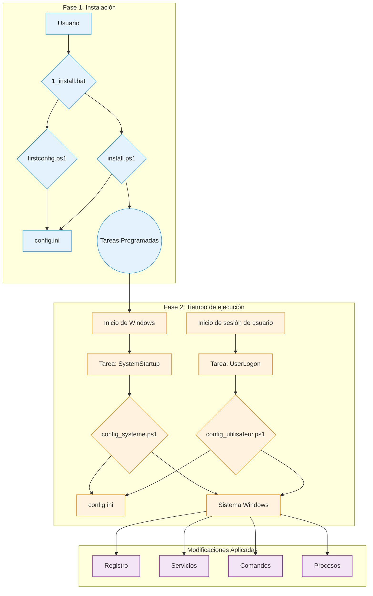

# Documentación Técnica de WindowsOrchestrator

Este documento es una descripción técnica de referencia para el proyecto WindowsOrchestrator. Detalla la arquitectura, los componentes y la secuencia de ejecución de cada script.

* [1. Vista General del Proyecto](#1-vista-general-del-proyecto)
  * [1.1. Propósito del Proyecto](#11-proposito-del-proyecto)
  * [1.2. Principios de Funcionamiento](#12-principios-de-funcionamiento)
* [2. Arquitectura y Componentes Clave](#2-arquitectura-y-componentes-clave)
  * [2.1. Diagrama de la Arquitectura](#21-diagrama-de-la-arquitectura)
  * [2.2. El Rol del Programador de Tareas](#22-el-rol-del-programador-de-tareas)
  * [2.3. El Archivo `config.ini`: Fuente de la Configuración](#23-el-archivo-configini-fuente-de-la-configuracion)
  * [2.4. El Sistema de Internacionalización (i18n)](#24-el-sistema-de-internacionalizacion-i18n)
* [3. Ciclo de Vida y Secuencias de Ejecución](#3-ciclo-de-vida-y-secuencias-de-ejecucion)
  * [3.1. Secuencia de Instalación Completa](#31-secuencia-de-instalacion-completa)
  * [3.2. Secuencia de Ejecución al Inicio (Tiempo de ejecución - Nivel de Sistema)](#32-secuencia-de-ejecucion-al-inicio-tiempo-de-ejecucion-nivel-de-sistema)
  * [3.3. Secuencia de Ejecución al Iniciar Sesión (Tiempo de ejecución - Nivel de Usuario)](#33-secuencia-de-ejecucion-al-iniciar-sesion-tiempo-de-ejecucion-nivel-de-usuario)
  * [3.4. Secuencia de Desinstalación](#34-secuencia-de-desinstalacion)
* [4. Procedimientos de Instalación y Desinstalación](#4-procedimientos-de-instalacion-y-desinstalacion)
  * [4.1. Procedimiento de Instalación](#41-procedimiento-de-instalacion)
    * [4.1.1. Fase 1: Configuración (Contexto de Usuario)](#411-fase-1-configuracion-contexto-de-usuario)
    * [4.1.2. Fase 2: Instalación de Tareas (Contexto de Administrador)](#412-fase-2-instalacion-de-tareas-contexto-de-administrador)
    * [4.1.3. Estado del Sistema Post-Instalación](#413-estado-del-sistema-post-instalacion)
  * [4.2. Procedimiento de Desinstalación](#42-procedimiento-de-desinstalacion)
    * [4.2.1. Elevación de Privilegios](#421-elevacion-de-privilegios)
    * [4.2.2. Acciones Realizadas por el Script](#422-acciones-realizadas-por-el-script)
    * [4.2.3. Estado del Sistema Post-Desinstalación](#423-estado-del-sistema-post-desinstalacion)
* [5. Guía de Configuración Detallada (`config.ini`)](#5-guia-de-configuracion-detallada-configini)
  * [5.1. Sección `[SystemConfig]`](#51-seccion-systemconfig)
  * [5.2. Sección `[Process]`](#52-seccion-process)
  * [5.3. Sección `[Logging]`](#53-seccion-logging)
  * [5.4. Sección `[Gotify]`](#54-seccion-gotify)
* [6. Descripción Detallada de los Scripts (Referencia del Código)](#6-descripcion-detallada-de-los-scripts-referencia-del-codigo)
  * [6.1. Scripts de Orquestación (`management/`)](#61-scripts-de-orquestacion-management)
    * [**`firstconfig.ps1`**](#firstconfigps1)
    * [**`install.ps1`**](#installps1)
    * [**`uninstall.ps1`**](#uninstallps1)
  * [6.2. Scripts de Tiempo de Ejecución (Raíz)](#62-scripts-de-tiempo-de-ejecucion-raiz)
    * [**`config_systeme.ps1`**](#config_systemeps1)
    * [**`config_utilisateur.ps1`**](#config_utilisateurps1)
  * [6.3. Scripts de Utilidad y Lanzadores](#63-scripts-de-utilidad-y-lanzadores)
    * [**`Close-AppByTitle.ps1`**](#close-appbytitleps1)
    * [**`PreReboot.bat` y `LaunchApp.bat`**](#prerebootbat-y-launchappbat)
    * [**`management/tools/Find-WindowInfo.ps1`**](#managementtoolsfind-windowinfops1)
* [7. Procedimientos de Mantenimiento y Depuración](#7-procedimientos-de-mantenimiento-y-depuracion)
  * [7.1. Entender y Usar los Registros (`Logs/`)](#71-entender-y-usar-los-registros-logs)
  * [7.2. Depurar Scripts Manualmente](#72-depurar-scripts-manualmente)
    * [**Ejecutar `config_systeme.ps1` con derechos de `SYSTEM`**](#ejecutar-config_systemeps1-con-derechos-de-system)
    * [**Probar `config_utilisateur.ps1` en una sesión de usuario**](#probar-config_utilisateurps1-en-una-sesion-de-usuario)
    * [**Comprobar el Estado de las Tareas Programadas**](#comprobar-el-estado-de-las-tareas-programadas)
  * [**7.3. Consideraciones de Seguridad**](#73-consideraciones-de-seguridad)
  * [**7.4. Limitaciones Conocidas**](#74-limitaciones-conocidas)
* [8. Apéndice](#8-apendice)
  * [8.1. Licencia](#81-licencia)
  * [8.2. Glosario de Términos](#82-glosario-de-terminos)

## 1. Vista General del Proyecto

### 1.1. Propósito del Proyecto

El proyecto WindowsOrchestrator automatiza la configuración de un sistema operativo Windows. Ejecuta scripts que modifican la configuración del sistema y gestionan aplicaciones. Las acciones realizadas por los scripts transforman una instalación estándar de Windows en un entorno cuyo comportamiento está definido por un archivo de configuración central.

Los scripts leen el archivo config.ini para ejecutar comandos que modifican claves del Registro, gestionan servicios de Windows, configuran los ajustes de energía, crean tareas programadas y gestionan el ciclo de vida de un proceso de usuario.

El proyecto proporciona un conjunto de scripts que aplican configuraciones para la gestión de energía, las actualizaciones del sistema, la sesión de usuario y el ciclo de vida de una aplicación.

### 1.2. Principios de Funcionamiento

El funcionamiento de WindowsOrchestrator se basa en cuatro mecanismos principales.

1.  **Ejecución por Herramientas Nativas de Windows**
    El proyecto utiliza características y comandos integrados en Windows: PowerShell 5.1, el Programador de Tareas, el Editor del Registro y utilidades de línea de comandos (`powercfg`, `shutdown`). El proyecto no requiere la instalación de ninguna dependencia externa.

2.  **Configuración por Archivo Centralizado**
    La lógica de ejecución de los scripts está separada de la configuración. Los scripts leen el archivo `config.ini` para determinar las acciones a realizar. Para cambiar el comportamiento de los scripts, un usuario modifica los valores en `config.ini`.

3.  **Separación de Contextos de Ejecución (Sistema vs. Usuario)**
    El proyecto utiliza dos contextos de ejecución distintos:
    *   El script **`config_systeme.ps1`** se ejecuta con los permisos de la cuenta `NT AUTHORITY\SYSTEM` y modifica la configuración global de la máquina (Registro HKLM, servicios, tareas programadas).
    *   El script **`config_utilisateur.ps1`** se ejecuta con los permisos del usuario que ha iniciado sesión y gestiona los procesos de su sesión.

4.  **Idempotencia de las Acciones**
    Los scripts están escritos de tal manera que su ejecución repetida produce el mismo estado final que su ejecución única. Antes de modificar una configuración, un script comprueba el estado actual del sistema. Si el estado deseado ya está aplicado, el script no repite la acción de modificación.

## 2. Arquitectura y Componentes Clave

La arquitectura de WindowsOrchestrator utiliza componentes nativos de Windows. Cada componente tiene un rol definido.

### 2.1. Diagrama de la Arquitectura

El flujo de ejecución y las interacciones entre los componentes se representan en el siguiente diagrama:

Este diagrama muestra la separación entre la **fase de instalación**, iniciada por el usuario, y la **fase de tiempo de ejecución**, un ciclo automatizado gestionado por el Programador de Tareas.

### 2.2. El Rol del Programador de Tareas

El Programador de Tareas de Windows es el componente central de la automatización. Ejecuta los scripts de configuración en los momentos definidos y con los niveles de privilegio requeridos.

Las dos tareas principales creadas por `install.ps1` son:

*   **`WindowsOrchestrator-SystemStartup`**
    *   **Desencadenador:** "Al iniciar el sistema".
    *   **Contexto de ejecución:** `NT AUTHORITY\SYSTEM`. Esta cuenta tiene los privilegios necesarios para modificar las claves del Registro en `HKEY_LOCAL_MACHINE` (HKLM), gestionar servicios y ejecutar comandos del sistema.
    *   **Rol:** Ejecutar todas las configuraciones a nivel de máquina.

*   **`WindowsOrchestrator-UserLogon`**
    *   **Desencadenador:** "Al iniciar sesión" del usuario especificado.
    *   **Contexto de ejecución:** La cuenta del usuario que ha iniciado sesión. El script se ejecuta con los privilegios de este usuario, lo que le permite lanzar aplicaciones gráficas en la sesión del usuario.
    *   **Rol:** Ejecutar todas las configuraciones específicas de la sesión del usuario.

### 2.3. El Archivo `config.ini`: Fuente de la Configuración

El archivo `config.ini` contiene la descripción del estado final deseado del sistema. Los scripts de PowerShell (`config_systeme.ps1`, `config_utilisateur.ps1`) leen este archivo y ejecutan los comandos necesarios para que el sistema se ajuste a la configuración definida.

Este mecanismo tiene varias características fácticas:
*   El comportamiento de los scripts está determinado por los pares clave-valor contenidos en el archivo config.ini.
*   La lógica de ejecución está contenida en archivos de script de PowerShell (.ps1), mientras que los parámetros que controlan esta lógica se leen desde un archivo .ini.
*   Los scripts leen el archivo config.ini presente en su directorio raíz, lo que permite que instancias separadas del proyecto tengan comportamientos diferentes según el contenido de su propio archivo config.ini.

### 2.4. El Sistema de Internacionalización (i18n)

El proyecto carga textos traducidos sin modificar el código fuente.

*   **Estructura de Archivos:** Los textos se almacenan en archivos `.psd1` ubicados en subcarpetas del directorio `i18n/`. Cada subcarpeta lleva el nombre de un código de cultura (p. ej., `fr-FR`, `en-US`).

*   **Mecanismo de Detección y Carga:**
    1.  Al principio de su ejecución, un script ejecuta el comando `(Get-Culture).Name` para obtener el código de cultura del sistema (p. ej., `"fr-FR"`).
    2.  El script construye la ruta al archivo de idioma correspondiente (p. ej., `i18n\fr-FR\strings.psd1`).
    3.  **Lógica de Respaldo (Fallback):** Si este archivo no existe, el script utiliza la ruta `i18n\en-US\strings.psd1`.
    4.  El contenido del archivo `.psd1` es leído e interpretado por `Invoke-Expression`, que carga una tabla hash de textos en una variable `$lang`.

*   **Uso en el Código:**
    Para mostrar un mensaje, el código accede a la tabla hash `$lang` a través de una clave (p. ej., `$lang.Uninstall_StartMessage`). Las funciones de registro utilizan un parámetro `-DefaultMessage` que contiene un texto en inglés si no se encuentra una clave.

Para añadir un nuevo idioma, un usuario debe copiar la carpeta `en-US`, renombrarla con el nuevo código de cultura y traducir los valores en el archivo `strings.psd1`.

## 3. Ciclo de Vida y Secuencias de Ejecución

Esta sección desglosa los procesos del proyecto en secuencias de ejecución cronológicas.

### 3.1. Secuencia de Instalación Completa

1.  **Fase 1 - Lanzamiento y Configuración (Contexto de Usuario)**
    *   El usuario ejecuta `1_install.bat`.
    *   El script por lotes ejecuta `management\firstconfig.ps1`.
    *   **`firstconfig.ps1` se ejecuta:**
        *   Comprueba la existencia del archivo `config.ini`. Si no existe, lo crea a partir de la plantilla `management/defaults/default_config.ini`. Si existe, pregunta al usuario si desea reemplazarlo.
        *   Muestra una GUI de Windows Forms, pre-rellenada con los valores leídos de `config.ini`.
        *   Al hacer clic en "Guardar y Cerrar", el script escribe los valores de los campos de la interfaz en `config.ini`.
        *   El script `firstconfig.ps1` finaliza.

2.  **Fase 2 - Elevación e Instalación (Contexto de Administrador)**
    *   El script `1_install.bat` se reanuda.
    *   Ejecuta un comando de PowerShell que utiliza `Start-Process PowerShell -Verb RunAs` para lanzar `install.ps1`.
    *   Windows activa un aviso de **Control de Cuentas de Usuario (UAC)**. El usuario debe conceder los privilegios.
    *   **`install.ps1` se ejecuta con privilegios de Administrador:**
        *   Comprueba la presencia de los archivos `config_systeme.ps1` y `config_utilisateur.ps1`.
        *   Ejecuta el comando `Register-ScheduledTask` para crear dos tareas:
            *   **`WindowsOrchestrator-SystemStartup`**, que ejecuta `config_systeme.ps1` al inicio (`-AtStartup`) con la cuenta `NT AUTHORITY\SYSTEM`.
            *   **`WindowsOrchestrator-UserLogon`**, que ejecuta `config_utilisateur.ps1` al iniciar sesión (`-AtLogOn`) del usuario.
        *   Para aplicar la configuración, el script ejecuta `config_systeme.ps1` y luego `config_utilisateur.ps1` a través de `Start-Process -Wait`.
    *   El script `install.ps1` finaliza.

### 3.2. Secuencia de Ejecución al Inicio (Tiempo de ejecución - Nivel de Sistema)

1.  **Desencadenador:** El sistema operativo Windows se inicia.
2.  **Ejecución de la Tarea:** El Programador de Tareas ejecuta la tarea `WindowsOrchestrator-SystemStartup`.
3.  **Lanzamiento del Script:** La tarea ejecuta `powershell.exe` con privilegios de la cuenta `NT AUTHORITY\SYSTEM` para lanzar `config_systeme.ps1`.
4.  **Acciones de `config_systeme.ps1`:**
    *   El script analiza `config.ini` y carga su contenido.
    *   Comprueba la conectividad de red (`Test-NetConnection 8.8.8.8 -Port 53`).
    *   Ejecuta los bloques de configuración definidos en `[SystemConfig]`. Para cada acción:
        *   Lee el valor de la clave.
        *   Comprueba el estado actual del sistema (valor del registro, estado del servicio).
        *   Si el estado actual es diferente del estado deseado, ejecuta el comando de modificación (`Set-ItemProperty`, `powercfg`, etc.).
        *   Registra la acción o el error en listas.
    *   Envía una notificación de Gotify (si está habilitado).
5.  **Fin de la Secuencia:** El script finaliza.

### 3.3. Secuencia de Ejecución al Iniciar Sesión (Tiempo de ejecución - Nivel de Usuario)

1.  **Desencadenador:** El usuario inicia sesión.
2.  **Ejecución de la Tarea:** El Programador de Tareas ejecuta la tarea `WindowsOrchestrator-UserLogon`.
3.  **Lanzamiento del Script:** La tarea ejecuta `powershell.exe` con los privilegios del usuario para lanzar `config_utilisateur.ps1` (`-WindowStyle Hidden`).
4.  **Acciones de `config_utilisateur.ps1`:**
    *   El script analiza `config.ini`.
    *   Lee los parámetros de la sección `[Process]`.
    *   Ejecuta la lógica de gestión de procesos:
        1.  Resuelve las variables de entorno en la ruta del proceso.
        2.  Busca procesos existentes que coincidan con el nombre y pertenezcan al usuario actual (verificado por SID).
        3.  Si encuentra alguno, los finaliza (`Stop-Process -Force`).
        4.  Lanza una nueva instancia del proceso.
    *   Envía una notificación de Gotify (si está habilitado).
5.  **Fin de la Secuencia:** El script finaliza.

### 3.4. Secuencia de Desinstalación

1.  **Desencadenador:** El usuario ejecuta `2_uninstall.bat`.
2.  **Elevación:** El script `2_uninstall.bat` lanza `management\uninstall.ps1`, que se relanza a sí mismo con `Start-Process -Verb RunAs`. El usuario debe aceptar el aviso de UAC.
3.  **Acciones de `uninstall.ps1`:**
    *   El script hace una pregunta al usuario para desactivar el AutoLogon.
    *   Restaura las claves del Registro del sistema:
        *   Windows Update (`NoAutoUpdate` -> `0`).
        *   Inicio Rápido (`HiberbootEnabled` -> `1`).
        *   OneDrive (eliminación de `DisableFileSyncNGSC`).
        *   AutoLogon (`AutoAdminLogon` -> `0`) si se solicita.
    *   Ejecuta `Unregister-ScheduledTask` para eliminar las cuatro tareas programadas.
    *   Muestra un resumen e informa que los archivos no se eliminan.
4.  **Fin de la Secuencia:** El script finaliza.

## 4. Procedimientos de Instalación y Desinstalación

Esta sección describe las secuencias de operaciones realizadas por los scripts por lotes para instalar, activar, desinstalar y restaurar el sistema.

### 4.1. Procedimiento de Instalación

El procedimiento se inicia ejecutando el archivo `1_install.bat`. Se divide en dos fases distintas.

#### 4.1.1. Fase 1: Configuración (Contexto de Usuario)

1.  El archivo `1_install.bat` ejecuta el script `management\firstconfig.ps1` a través del comando `powershell.exe`.
2.  El script `firstconfig.ps1` comprueba la existencia del archivo `config.ini` en la raíz del proyecto.
    *   Si el archivo `config.ini` no existe, se crea copiando el archivo `management/defaults/default_config.ini`.
    *   Si el archivo `config.ini` existe, se muestra un cuadro de diálogo `System.Windows.Forms.MessageBox`, preguntando al usuario si desea reemplazar el archivo existente con la plantilla.
3.  A continuación, el script muestra una interfaz gráfica de usuario (Windows Forms) cuyos campos están pre-rellenados con los valores leídos del archivo `config.ini`.
4.  Cuando el usuario hace clic en el botón "Guardar y Cerrar", los valores de los campos de la interfaz se escriben en el archivo `config.ini` a través de la función `Set-IniValue`. El script finaliza.

#### 4.1.2. Fase 2: Instalación de Tareas (Contexto de Administrador)

1.  El control vuelve al script `1_install.bat`. Ejecuta un comando `powershell.exe` cuya única función es lanzar una segunda instancia de PowerShell a través del comando `Start-Process PowerShell -Verb RunAs`.
2.  Esta acción desencadena un aviso de Control de Cuentas de Usuario (UAC). El usuario debe conceder los privilegios para continuar.
3.  El script `management\install.ps1` se ejecuta con privilegios de administrador y realiza las siguientes acciones:
    *   Crea la tarea programada **`WindowsOrchestrator-SystemStartup`** a través de `Register-ScheduledTask`. El desencadenador se establece en `-AtStartup` y el principal de ejecución es `NT AUTHORITY\SYSTEM` (`-UserId "NT AUTHORITY\SYSTEM"`). La acción es la ejecución del script `config_systeme.ps1`.
    *   Crea la tarea programada **`WindowsOrchestrator-UserLogon`** a través de `Register-ScheduledTask`. El desencadenador se establece en `-AtLogOn` para el usuario actual y el principal de ejecución es ese mismo usuario (`-UserId "$($env:USERDOMAIN)\$($env:USERNAME)"`). La acción es la ejecución del script `config_utilisateur.ps1`.

4.  Para aplicar la configuración inmediatamente, `install.ps1` ejecuta a continuación, de forma secuencial y esperando a que finalice cada proceso (`-Wait`), los scripts `config_systeme.ps1` y luego `config_utilisateur.ps1`.

#### 4.1.3. Estado del Sistema Post-Instalación

*   Dos tareas programadas, `WindowsOrchestrator-SystemStartup` y `WindowsOrchestrator-UserLogon`, se crean y están activas en el Programador de Tareas de Windows.
*   Existe un archivo `config.ini` en la raíz del proyecto que contiene la configuración definida por el usuario.
*   Hay un directorio `Logs` en la raíz del proyecto que contiene los archivos de registro de la ejecución inicial.
*   La configuración del sistema definida en `config.ini` se ha aplicado por primera vez.

### 4.2. Procedimiento de Desinstalación

El procedimiento se inicia ejecutando el archivo `2_uninstall.bat`.

#### 4.2.1. Elevación de Privilegios

1.  El archivo `2_uninstall.bat` ejecuta el script `management\uninstall.ps1`.
2.  El script `uninstall.ps1` comprueba su propio nivel de privilegio. Si no es administrador, se relanza a sí mismo a través de `Start-Process powershell.exe -Verb RunAs`, lo que desencadena un aviso de UAC que el usuario debe validar.

#### 4.2.2. Acciones Realizadas por el Script

El script `management\uninstall.ps1`, ejecutándose con privilegios de administrador, realiza las siguientes operaciones:

1.  **Interacción con el Usuario:** El script muestra un aviso en la consola a través de `Read-Host`, preguntando al usuario si desea desactivar el inicio de sesión automático. La respuesta del usuario se almacena en una variable.
2.  **Restauración de la Configuración del Sistema:**
    *   Si el usuario respondió `s` o `y`, el script escribe el valor de cadena `"0"` en la clave del Registro `HKLM:\SOFTWARE\Microsoft\Windows NT\CurrentVersion\Winlogon\AutoAdminLogon`.
    *   Escribe el valor DWORD `0` en la clave `HKLM:\...\WindowsUpdate\AU\NoAutoUpdate`.
    *   Escribe el valor DWORD `0` en la clave `HKLM:\...\WindowsUpdate\AU\NoAutoRebootWithLoggedOnUsers`.
    *   Escribe el valor DWORD `1` en la clave `HKLM:\...\Power\HiberbootEnabled`.
    *   Elimina el valor `DisableFileSyncNGSC` de la clave `HKLM:\...\OneDrive` a través de `Remove-ItemProperty`.
    *   Cambia el tipo de inicio del servicio `wuauserv` a `Automatic` a través de `Set-Service`.
3.  **Eliminación de Tareas Programadas:**
    *   El script itera sobre una lista predefinida de nombres de tareas y ejecuta `Unregister-ScheduledTask -Confirm:$false` para cada una. Las tareas eliminadas son:
        *   `WindowsOrchestrator-SystemStartup`
        *   `WindowsOrchestrator-UserLogon`
        *   `WindowsOrchestrator-SystemScheduledReboot`
        *   `WindowsOrchestrator-SystemPreRebootAction`

#### 4.2.3. Estado del Sistema Post-Desinstalación

*   Las cuatro tareas programadas relacionadas con el proyecto se eliminan del Programador de Tareas. Toda la automatización se detiene.
*   La configuración del Registro y de los servicios enumerada anteriormente se restaura a sus valores predeterminados.
*   La configuración de energía modificada por el comando `powercfg` no se cambia con el script de desinstalación.
*   El directorio del proyecto, incluidos todos los scripts, el archivo `config.ini` y los registros, no se elimina y permanece en el disco.

## 5. Guía de Configuración Detallada (`config.ini`)

El archivo `config.ini` es el centro de control declarativo del proyecto. Esta guía describe cada clave, su impacto en la ejecución de los scripts, sus posibles valores y sus interacciones con otras configuraciones. Los valores predeterminados son los especificados en el archivo `management/defaults/default_config.ini`.

### 5.1. Sección `[SystemConfig]`

Esta sección gobierna la configuración que afecta a todo el sistema y es leída exclusivamente por `config_systeme.ps1`.

---

**`AutoLoginUsername`**

*   **Rol:** Especifica el nombre de usuario que se escribirá en la clave del Registro `DefaultUserName`. Este valor también es utilizado por la lógica de la acción previa al reinicio para resolver la ruta `%USERPROFILE%`.
*   **Valores posibles:** Una cadena que representa un nombre de usuario local o de dominio (p. ej., `Admin`, `DOMINIO\Usuario`). Si el valor se deja en blanco, el script intenta leer el valor ya presente en la clave del Registro `DefaultUserName`.
*   **Valor predeterminado:** "" (cadena vacía)
*   **Interdependencias:** Este parámetro es obligatorio si `EnableAutoLogin` es `true`. También es necesario para que la variable `%USERPROFILE%` se pueda utilizar en la clave `PreRebootActionCommand`.

---

**`EnableAutoLogin`**

*   **Rol:** Controla el estado del inicio de sesión automático de Windows.
*   **Acción del script:** Si el valor es `true`, el script escribe `"1"` en la clave del Registro `HKLM:\SOFTWARE\Microsoft\Windows NT\CurrentVersion\Winlogon\AutoAdminLogon`. Si el valor es `false`, escribe `"0"`.
*   **Valores posibles:** `true`, `false`
*   **Valor predeterminado:** `false`
*   **Interdependencias:** Requiere que `AutoLoginUsername` esté correctamente configurado para ser completamente funcional. **Nota para el desarrollador:** El script no gestiona la contraseña (`DefaultPassword`), que debe configurarse fuera de banda (p. ej., con la herramienta Sysinternals AutoLogon).

---

**`DisableFastStartup`**

*   **Rol:** Controla la función de Inicio Rápido de Windows (Hiberboot).
*   **Acción del script:** Si es `true`, escribe el valor `0` (DWORD) en la clave del Registro `HKLM:\...\Power\HiberbootEnabled`. Si es `false`, escribe `1`.
*   **Valores posibles:** `true`, `false`
*   **Valor predeterminado:** `true`
*   **Interdependencias:** Ninguna.

---

**`DisableSleep`** y **`DisableScreenSleep`**

*   **Rol:** Gestionan el estado de suspensión de la máquina y de la pantalla.
*   **Acción del script:**
    *   Para `DisableSleep=true`, ejecuta los comandos `powercfg /change standby-timeout-ac 0` y `powercfg /change hibernate-timeout-ac 0`.
    *   Para `DisableScreenSleep=true`, ejecuta el comando `powercfg /change monitor-timeout-ac 0`.
*   **Valores posibles:** `true`, `false`
*   **Valores predeterminados:** `DisableSleep=true`, `DisableScreenSleep=false`
*   **Interdependencias:** Ninguna.

---

**`DisableWindowsUpdate`**

*   **Rol:** Desactiva completamente el servicio de Windows Update.
*   **Acción del script:** Si es `true`, el script realiza tres acciones:
    1.  Escribe el valor `1` (DWORD) en la clave `HKLM:\...\WindowsUpdate\AU\NoAutoUpdate`.
    2.  Cambia el tipo de inicio del servicio `wuauserv` a `Disabled`.
    3.  Detiene el servicio `wuauserv` (`Stop-Service`).
*   **Valores posibles:** `true`, `false`
*   **Valor predeterminado:** `true`
*   **Interdependencias:** Ninguna.

---

**`DisableAutoReboot`**

*   **Rol:** Evita que Windows se reinicie automáticamente después de una actualización si hay una sesión de usuario activa.
*   **Acción del script:** Si es `true`, escribe el valor `1` (DWORD) en la clave del Registro `HKLM:\...\WindowsUpdate\AU\NoAutoRebootWithLoggedOnUsers`.
*   **Valores posibles:** `true`, `false`
*   **Valor predeterminado:** `true`
*   **Interdependencias:** Esta configuración es relevante principalmente cuando `DisableWindowsUpdate` es `false`.

---

**`ScheduledRebootTime`**

*   **Rol:** Programa un reinicio diario de la máquina.
*   **Acción del script:** Si se proporciona un valor, el script crea/actualiza una tarea programada (`WindowsOrchestrator-SystemScheduledReboot`) que ejecuta `shutdown.exe /r /f /t 60` a la hora especificada. Si el valor está vacío, la tarea programada se elimina.
*   **Valores posibles:** Una cadena en formato `HH:MM` (p. ej., `03:00`), o una cadena vacía para desactivar.
*   **Valor predeterminado:** `03:00`
*   **Interdependencias:** El script crea dos tareas programadas separadas para la acción previa al reinicio y el reinicio. El Programador de Tareas de Windows ejecuta cada tarea a la hora especificada, sin comprobar su orden cronológico.

---

**`PreRebootAction...`** (grupo de 4 claves)

*   **Rol:** Ejecuta un comando personalizado antes del reinicio programado. Este bloque solo está activo si `PreRebootActionTime` y `PreRebootActionCommand` no están vacíos.
*   **Acción del script:** Crea/actualiza una tarea programada (`WindowsOrchestrator-SystemPreRebootAction`) que ejecuta el comando especificado. El script resuelve las variables de entorno (`%USERPROFILE%`) y las rutas relativas en `PreRebootActionCommand`.
*   **Claves:**
    *   `PreRebootActionTime`: Hora de activación (`HH:MM`).
    *   `PreRebootActionCommand`: Ruta al ejecutable o script.
    *   `PreRebootActionArguments`: Argumentos para pasar al comando.
    *   `PreRebootActionLaunchMethod`: Método de ejecución (`direct`, `powershell`, `cmd`).
*   **Valores predeterminados:** `02:55`, `"PreReboot.bat"`, `""`, `cmd`
*   **Interdependencias:** La ejecución de la tarea 'WindowsOrchestrator-SystemPreRebootAction' es independiente de la existencia de la tarea 'WindowsOrchestrator-SystemScheduledReboot'.

---

**`DisableOneDrive`**

*   **Rol:** Desactiva la integración de OneDrive a través de una política del sistema.
*   **Acción del script:** Si es `true`, escribe el valor `1` (DWORD) en la clave del Registro `HKLM:\...\OneDrive\DisableFileSyncNGSC`. Si es `false`, la clave se elimina.
*   **Valores posibles:** `true`, `false`
*   **Valor predeterminado:** `true`
*   **Interdependencias:** Ninguna.

### 5.2. Sección `[Process]`

Esta sección, leída por `config_utilisateur.ps1`, describe cómo gestionar la aplicación empresarial principal. El funcionamiento se basa en el siguiente trío de claves interdependientes:

*   **`ProcessName` (El "Qué")**
    *   **Rol:** Define la ruta completa al ejecutable o script que se va a lanzar. Es el objetivo principal de la acción.
    *   **Acción del script:** El script utiliza este valor para identificar el proceso a detener y como objetivo del comando de inicio. Admite variables de entorno del sistema y del usuario (p. ej., `%USERPROFILE%`, `%PROGRAMFILES%`) que se resuelven dinámicamente en tiempo de ejecución.

*   **`ProcessArguments` (El "Con Qué")**
    *   **Rol:** Especifica los argumentos de la línea de comandos que se pasarán al ejecutable/script definido en `ProcessName`.
    *   **Acción del script:** Esta cadena se añade al comando de ejecución. Si está vacía, no se pasan argumentos.

*   **`LaunchMethod` (El "Cómo")**
    *   **Rol:** Especifica el intérprete de comandos que se utilizará para lanzar el `ProcessName`. Esta elección es crucial para la compatibilidad.
    *   **Acción del script:** El script construye el comando final de forma diferente según el valor:
        *   `direct`: Lanza el ejecutable directamente. El comando es `ProcessName "ProcessArguments"`. Es el método estándar para los archivos `.exe`.
        *   `cmd`: Lanza a través del intérprete de comandos `cmd.exe`. El comando generado es `cmd.exe /c ""ProcessName" ProcessArguments"`. Es el método recomendado para los scripts por lotes (`.bat`, `.cmd`).
        *   `powershell`: Lanza a través de PowerShell. El comando generado es `powershell.exe -NoProfile -ExecutionPolicy Bypass -Command "& 'ProcessName' ProcessArguments'"`. Es el método ideal para ejecutar otros scripts de PowerShell (`.ps1`).

### 5.3. Sección `[Logging]`

Esta sección configura el comportamiento de los archivos de registro.

*   **`EnableLogRotation`**
    *   **Rol:** Activa o desactiva el mecanismo de archivado de registros.
    *   **Acción del script:** Si es `true`, antes de escribir en un archivo de registro (`log.txt`), se llama a la función `Rotate-LogFile`. Renombra `log.txt` a `log.1.txt`, `log.1.txt` a `log.2.txt`, etc., hasta el límite, y elimina el más antiguo. Si es `false`, no se llama a esta función y el archivo de registro crece indefinidamente.
*   **`MaxSystemLogsToKeep` y `MaxUserLogsToKeep`**
    *   **Rol (Previsto):** Estas claves se proporcionan en `default_config.ini` para definir el número de archivos de registro archivados que se deben conservar.
    *   **Acción del script (Actual):** Las claves MaxSystemLogsToKeep y MaxUserLogsToKeep no son leídas por el script config_systeme.ps1. La función Rotate-LogFile se llama con un valor fijo de 7, definido por la variable $DefaultMaxLogs.

### 5.4. Sección `[Gotify]`

Esta sección controla el envío de notificaciones de estado a un servidor Gotify.

*   **`EnableGotify`**: Si es `true`, los scripts intentarán enviar una notificación al final de su ejecución.
*   **`Url`**: La URL base de la instancia de Gotify (p. ej., `http://gotify.example.com`).
*   **`Token`**: El token de aplicación generado en Gotify para autorizar el envío de mensajes.
*   **`Priority`**: Un entero que define la prioridad del mensaje en Gotify.
*   **`GotifyTitle...`** (grupo de 4 claves):
    *   **Rol:** Plantillas para los títulos de las notificaciones.
    *   **Acción del script:** Antes de enviar la notificación, el script toma la cadena de la clave apropiada (p. ej., `GotifyTitleErrorSystem`) y sustituye las cadenas literales `%COMPUTERNAME%` y `%USERNAME%` por los valores de las variables de entorno correspondientes.

## 6. Descripción Detallada de los Scripts (Referencia del Código)

Esta sección sirve como referencia para el código fuente. Desglosa la lógica y los mecanismos internos de cada script principal del proyecto.

### 6.1. Scripts de Orquestación (`management/`)

Estos scripts gestionan el ciclo de vida del proyecto (instalación, configuración inicial, desinstalación). Están diseñados para ser ejecutados manualmente por el usuario.

#### **`firstconfig.ps1`**

*   **Rol:** Proporcionar una interfaz gráfica de usuario (GUI) para una configuración asistida del archivo `config.ini`.
*   **Lógica de la GUI:**
    *   El script utiliza los ensamblados .NET `System.Windows.Forms` y `System.Drawing`, cargados a través de `Add-Type`, para construir dinámicamente los objetos de la interfaz (Form, Label, TextBox, CheckBox, Button).
    *   El posicionamiento de los controles se gestiona mediante variables (`$xPadding`, `$yCurrent`) que se incrementan después de añadir cada elemento.
    *   El idioma de la interfaz se carga dinámicamente desde los archivos `strings.psd1`.
*   **Gestión de `config.ini`:**
    *   **Lectura:** Al iniciarse, el script lee los valores actuales de `config.ini` utilizando una función local `Get-IniValue`. Esta función realiza una lectura línea por línea del archivo para extraer los valores. Los valores `true`/`false` se convierten a tipos `[bool]` de PowerShell para los `CheckBoxes`.
    *   **Escritura:** Al hacer clic en el botón "Guardar", el evento `Add_Click` llama a la función local `Set-IniValue` para cada parámetro. Esta función reconstruye el contenido del archivo en memoria antes de escribirlo en el disco con codificación UTF-8.

#### **`install.ps1`**

*   **Rol:** Crear la persistencia del sistema instalando tareas programadas y realizando una ejecución inicial de los scripts de tiempo de ejecución.
*   **Mecanismo de Auto-Elevación:** El script comprueba su nivel de privilegio a través de `New-Object Security.Principal.WindowsPrincipal`. Si no es "Administrator", se relanza a sí mismo con `Start-Process powershell.exe -Verb RunAs`.
*   **Lógica de Creación de Tareas:**
    *   El script utiliza los cmdlets nativos `New-ScheduledTaskAction`, `New-ScheduledTaskTrigger`, `New-ScheduledTaskPrincipal`, `New-ScheduledTaskSettingsSet` y `Register-ScheduledTask`.
    *   **Gestión de Principales:**
        *   Para `...-SystemStartup`, utiliza `-UserId "NT AUTHORITY\SYSTEM" -RunLevel Highest`.
        *   Para `...-UserLogon`, utiliza `-UserId "$($env:USERDOMAIN)\$($env:USERNAME)" -LogonType Interactive`.
*   **Ejecución Post-Instalación:**
    *   Después de registrar las tareas, el script ejecuta `config_systeme.ps1` y luego `config_utilisateur.ps1` a través de `Start-Process -Wait`.

#### **`uninstall.ps1`**

*   **Rol:** Eliminar los componentes de automatización y restaurar la configuración crítica del sistema.
*   **Lógica de Restauración:**
    *   El script contiene valores "predeterminados" de Windows codificados en su código para restaurar el estado del sistema.
    *   Utiliza los mismos cmdlets que `config_systeme.ps1` (`Set-ItemProperty`, `Set-Service`) pero con los valores inversos.
    *   Las operaciones están encapsuladas en bloques `try...catch`.
*   **Lógica de Limpieza:**
    *   Utiliza una lista predefinida (`$TasksToRemove`) que contiene los nombres de las cuatro tareas programadas.
    *   Recorre esta lista y ejecuta `Get-ScheduledTask` para comprobar si la tarea existe, y luego `Unregister-ScheduledTask -Confirm:$false` para eliminarla.

### 6.2. Scripts de Tiempo de Ejecución (Raíz)

Estos scripts contienen la lógica empresarial principal y son ejecutados automáticamente por las tareas programadas.

#### **`config_systeme.ps1`**

*   **Arquitectura del Script:** El script está estructurado en varias regiones: funciones básicas, funciones de utilidad, inicialización y el bloque de ejecución principal (`try...catch...finally`).
*   **Funciones Clave:**
    *   `Get-IniContent`: Analiza `config.ini` y lo transforma en una tabla hash de PowerShell anidada (`$ini['Sección']['Clave']`).
    *   `Get-ConfigValue`: Es un envoltorio para acceder a la configuración. Gestiona claves/secciones ausentes, proporciona valores predeterminados y realiza la conversión de tipos.
    *   `Add-Action` / `Add-Error`: Estas funciones centralizan el registro. Añaden mensajes a listas globales (`$Global:ActionsEffectuees`, `$Global:ErreursRencontrees`) utilizadas para construir el informe de Gotify.
*   **Lógica de Ejecución:** El cuerpo principal del script es una secuencia de bloques de configuración. Cada bloque es idempotente: primero lee el estado actual del sistema (valor del registro, estado del servicio) antes de escribir.

#### **`config_utilisateur.ps1`**

*   **Rol:** Asegurar que la aplicación empresarial definida en `[Process]` esté en el estado deseado (una única instancia, recién lanzada).
*   **Lógica de Gestión de Procesos:**
    1.  **Resolución de Ruta:** El `ProcessName` es procesado por `[System.Environment]::ExpandEnvironmentVariables()` para resolver variables como `%USERPROFILE%`.
    2.  **Identificación del Propietario:** La búsqueda del proceso existente utiliza `Get-Process` para encontrar procesos por nombre, y luego `Get-CimInstance Win32_Process` para recuperar el propietario de cada proceso. Compara el SID del propietario del proceso con el SID del usuario actual (`[System.Security.Principal.WindowsIdentity]::GetCurrent().User.Value`).
    3.  **Detención y Reinicio:** Si se encuentra un proceso coincidente, se finaliza a través de `Stop-Process -Force`. A continuación, se lanza una nueva instancia utilizando `Start-Process`. Se utiliza "splatting" (`@startProcessSplat`) para la llamada a `Start-Process`.

### 6.3. Scripts de Utilidad y Lanzadores

Estos scripts son herramientas de soporte o ejemplos de integración.

#### **`Close-AppByTitle.ps1`**

*   **Interacción con `user32.dll`:**
    *   Inyecta una clase de C# en memoria a través de `Add-Type -TypeDefinition`. Este código C# utiliza atributos `[DllImport("user32.dll")]` para exponer las funciones de la API de Windows a PowerShell.
    *   La función `EnumWindows` se utiliza con un bloque de script de PowerShell como "callback". Por cada ventana encontrada por la API, se ejecuta este bloque de PowerShell. Es en este bloque donde se comprueba el título de la ventana.
    *   Una vez que la ventana de destino se identifica por su `handle`, se llama a `SetForegroundWindow` para darle el foco, y luego `[System.Windows.Forms.SendKeys]::SendWait()` simula la pulsación de teclas.

#### **`PreReboot.bat` y `LaunchApp.bat`**

*   **Portabilidad:** El funcionamiento de estos lanzadores se basa en la variable especial de los scripts por lotes `%~dp0`, que se resuelve en la ruta completa del directorio donde se encuentra el script.

#### **`management/tools/Find-WindowInfo.ps1`**

*   **Utilidad:** Este script es una herramienta de depuración y configuración.
*   **Funcionamiento:** Utiliza la misma técnica de inyección de código C# y llamada a la API `EnumWindows` que `Close-AppByTitle.ps1`. Muestra una lista formateada de las ventanas visibles, con el nombre del proceso y su PID.

## 7. Procedimientos de Mantenimiento y Depuración

Esta sección proporciona guías prácticas para diagnosticar problemas y probar cambios.

### 7.1. Entender y Usar los Registros (`Logs/`)

*   **Ubicación:** Los registros se crean en la subcarpeta `Logs/`.
    *   `config_systeme_ps_log.txt`: Contiene los registros del script del sistema.
    *   `config_utilisateur_log.txt`: Contiene los registros del script del usuario.
*   **Estructura de los Mensajes de Registro:** `AAAA-MM-DD HH:mm:ss [NIVEL] [Contexto] - Mensaje`
*   **Cómo Identificar Acciones y Errores:**
    *   **Acciones Exitosas:** `ACTION: ...`
    *   **Errores Capturados:** `CAPTURED ERROR: ...`
    *   **Errores Fatales:** `FATAL SCRIPT ERROR ...`

### 7.2. Depurar Scripts Manualmente

#### **Ejecutar `config_systeme.ps1` con derechos de `SYSTEM`**

1.  **Requisito previo:** Descargar `PsExec.exe` de la suite Sysinternals de Microsoft.
2.  **Procedimiento de ejecución:**
    *   Abrir un símbolo del sistema como administrador.
    *   Ejecutar el comando: `PsExec.exe -s -i powershell.exe`
    *   Se abre una nueva ventana de PowerShell. El comando `whoami` devuelve `nt authority\system`.
    *   En esta ventana, navegar al directorio del proyecto y ejecutar `.\config_systeme.ps1`.

#### **Probar `config_utilisateur.ps1` en una sesión de usuario**

1.  **Procedimiento de ejecución:**
    *   Iniciar sesión en Windows con la cuenta de usuario de destino.
    *   Abrir una consola de PowerShell estándar.
    *   Navegar al directorio del proyecto y ejecutar `.\config_utilisateur.ps1`.

#### **Comprobar el Estado de las Tareas Programadas**

1.  **Abrir la herramienta:** Ejecutar `taskschd.msc`.
2.  **Encontrar las tareas:** Seleccionar "Biblioteca del Programador de Tareas".
3.  **Analizar la información:**
    *   Comprobar las columnas "Estado", "Desencadenadores" y "Resultado de la última ejecución" (un código `0x0` indica éxito).
    *   Consultar la pestaña "Historial" para ver los detalles de cada ejecución.

### **7.3. Consideraciones de Seguridad**

Esta sección detalla los mecanismos y las implicaciones de seguridad relacionados con el funcionamiento del proyecto.

*   **Contexto de Ejecución de las Tareas del Sistema**  
    El script `install.ps1` configura la tarea programada `WindowsOrchestrator-SystemStartup` para que se ejecute con los permisos de la cuenta `NT AUTHORITY\SYSTEM`. Esta cuenta tiene privilegios extendidos en el sistema local, lo cual es necesario para permitir que el script `config_systeme.ps1` modifique las claves del Registro en el subárbol `HKEY_LOCAL_MACHINE` (HKLM) y gestione los servicios del sistema.

*   **Mecanismo de Elevación de Privilegios (UAC)**  
    Los scripts de instalación (`1_install.bat`) y desinstalación (`2_uninstall.bat`) no necesitan ser lanzados desde una sesión de administrador. Ejecutan un comando `Start-Process -Verb RunAs` que desencadena un aviso del Control de Cuentas de Usuario (UAC) de Windows. La continuación de la ejecución está condicionada a la validación de este aviso por parte del usuario.

*   **Gestión de Contraseñas de Sesión**  
    Los scripts del proyecto **no procesan, solicitan ni almacenan** contraseñas de usuario de ninguna forma. La activación de la función de AutoLogon (`EnableAutoLogin=true`) simplemente escribe el valor `"1"` en la clave del Registro `AutoAdminLogon`. La clave `DefaultPassword` nunca es escrita por los scripts. La responsabilidad de almacenar la contraseña de forma segura en el Registro recae en el usuario, a través de una herramienta externa como `Sysinternals AutoLogon`.

*   **Omisión de la Política de Ejecución**  
    Los scripts de lanzamiento (`.bat`) y los comandos de creación de tareas programadas utilizan sistemáticamente el argumento `-ExecutionPolicy Bypass` al llamar a `powershell.exe`. Este argumento permite que los scripts se ejecuten independientemente de la política de ejecución configurada en el sistema. Esta configuración solo se aplica a la instancia del proceso que se está lanzando y no modifica de forma permanente la política de seguridad del sistema.

### **7.4. Limitaciones Conocidas**

Esta sección documenta comportamientos que son el resultado de decisiones de diseño o representan características no implementadas en esta etapa.

*   **No restauración de la Configuración de Energía**  
    El script `uninstall.ps1` no ejecuta ningún comando `powercfg`. Por lo tanto, las modificaciones realizadas por `config_systeme.ps1` con respecto a la suspensión de la máquina (`standby-timeout-ac`) o de la pantalla (`monitor-timeout-ac`) no se deshacen durante la desinstalación.

*   **Configuración de Rotación de Registros Inactiva**  
    El archivo de plantilla de configuración (`default_config.ini`) contiene las claves `MaxSystemLogsToKeep` y `MaxUserLogsToKeep`. Sin embargo, la función `Rotate-LogFile` en `config_systeme.ps1` no lee estas claves. Utiliza un valor fijo de `7`, definido en el script por la variable `$DefaultMaxLogs`.

*   **Ausencia de Validación Cronológica de las Tareas de Reinicio**  
    El script `config_systeme.ps1` crea las tareas programadas para la acción previa al reinicio y el reinicio programado como dos entidades independientes. El script no contiene ninguna lógica para verificar que el valor de `PreRebootActionTime` sea cronológicamente anterior al de `ScheduledRebootTime`.

## 8. Apéndice

### 8.1. Licencia

Este proyecto se distribuye bajo los términos de la **Licencia Pública General de GNU v3 (GPLv3)**. El texto completo de la licencia está disponible en la raíz del proyecto en el archivo `LICENSE`.

### 8.2. Glosario de Términos

---
**UAC (User Account Control / Control de Cuentas de Usuario)**
*   **Definición:** Un mecanismo de seguridad de Windows que requiere la confirmación del usuario antes de permitir una acción que requiera privilegios de administrador.
*   **Contexto en el proyecto:** Desencadenado por `install.ps1` y `uninstall.ps1` a través del parámetro `-Verb RunAs` del comando `Start-Process`.
---
**Tarea Programada (Scheduled Task)**
*   **Definición:** Un componente del servicio de Windows "Programador de Tareas" que permite ejecutar automáticamente un script o programa.
*   **Contexto en el proyecto:** El mecanismo central de la automatización.
---
**Registro de Windows (Windows Registry)**
*   **Definición:** Una base de datos jerárquica donde Windows almacena la configuración.
*   **Contexto en el proyecto:** El objetivo principal de las modificaciones de `config_systeme.ps1`.
---
**HKLM (HKEY_LOCAL_MACHINE)**
*   **Definición:** Subárbol del Registro que contiene la configuración que se aplica a toda la máquina.
*   **Contexto en el proyecto:** Todas las modificaciones del Registro de `config_systeme.ps1` se encuentran en HKLM.
---
**SID (Security Identifier / Identificador de Seguridad)**

*   **Definición:** Una cadena única que identifica a un principal de seguridad (usuario, grupo).
*   **Contexto en el proyecto:** Utilizado por `config_utilisateur.ps1` para identificar al propietario de un proceso.
---
**`NT AUTHORITY\SYSTEM` (Cuenta SYSTEM)**
*   **Definición:** Una cuenta de servicio interna de Windows con privilegios extendidos en el sistema local.
*   **Contexto en el proyecto:** El contexto de ejecución de `config_systeme.ps1`.
---
**Idempotencia**
*   **Definición:** Una propiedad de una operación que, si se aplica varias veces, produce el mismo resultado que una sola vez.
*   **Contexto en el proyecto:** Un principio de diseño de los scripts para asegurar un estado final estable.
---
**Política de Ejecución de PowerShell (Execution Policy)**
*   **Definición:** Una característica de seguridad de PowerShell que determina si se pueden ejecutar scripts.
*   **Contexto en el proyecto:** Se omite a través del parámetro `-ExecutionPolicy Bypass` para asegurar la ejecución de los scripts.
