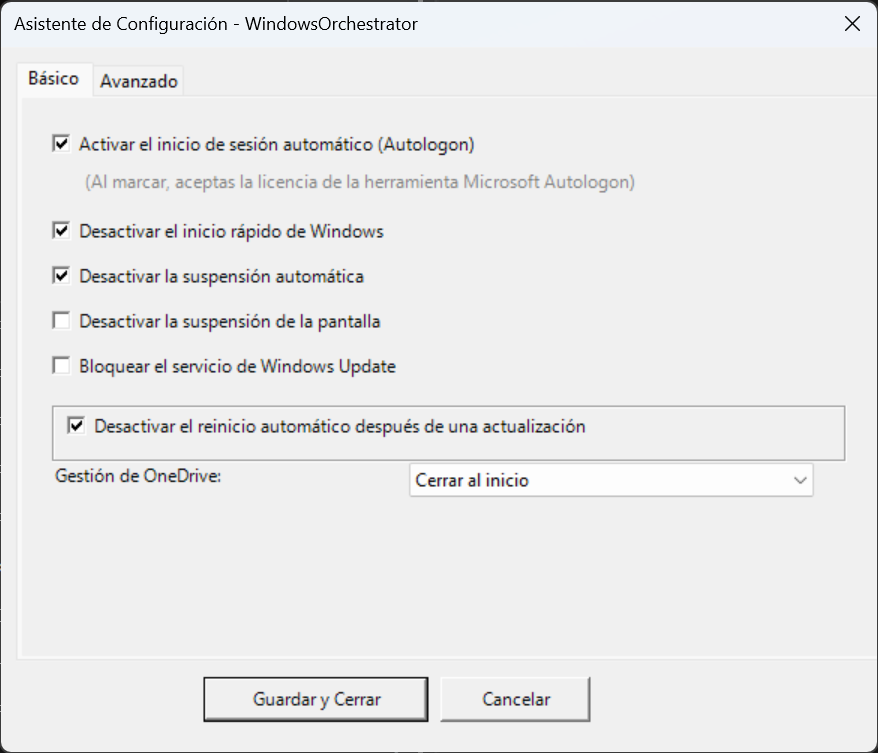
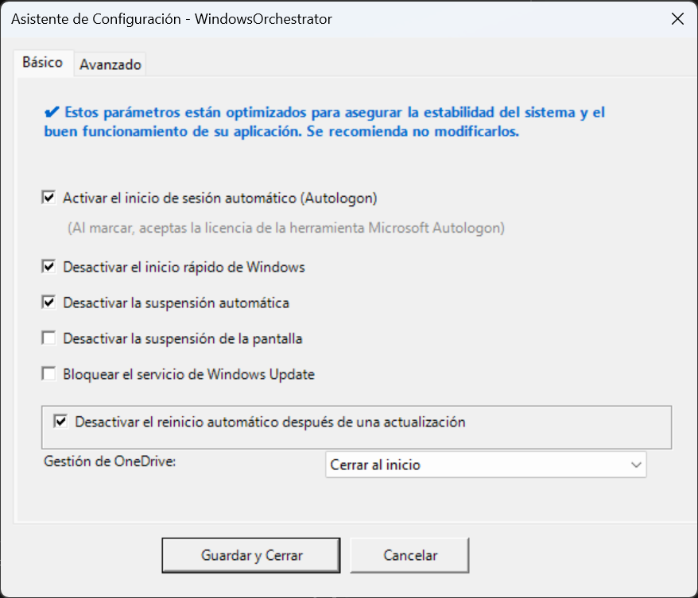
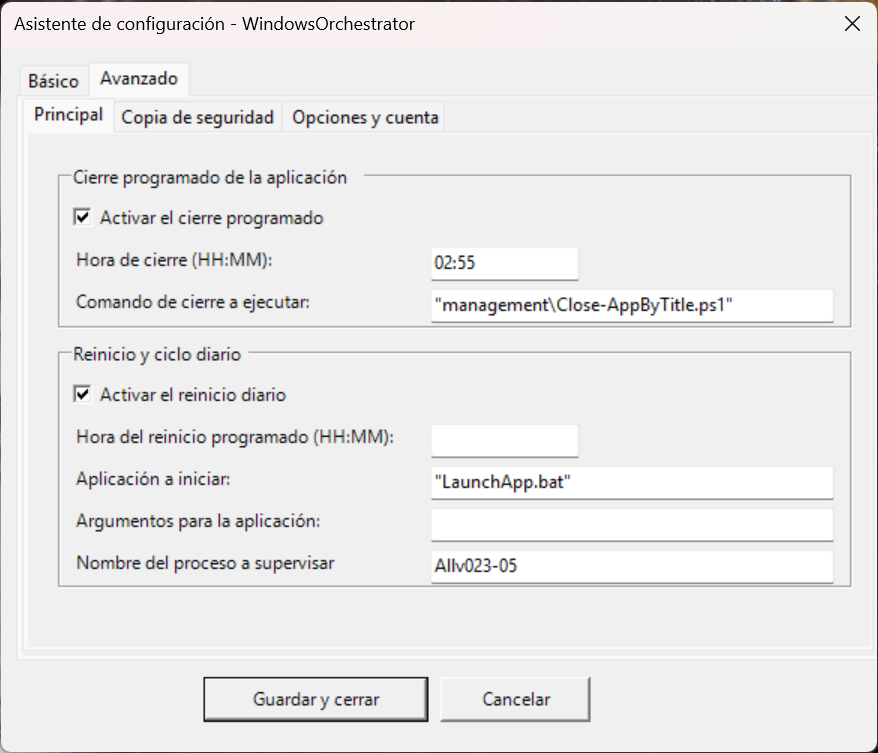
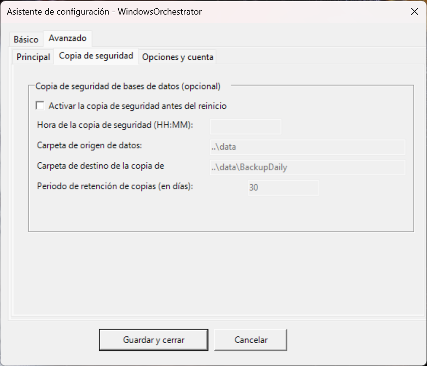
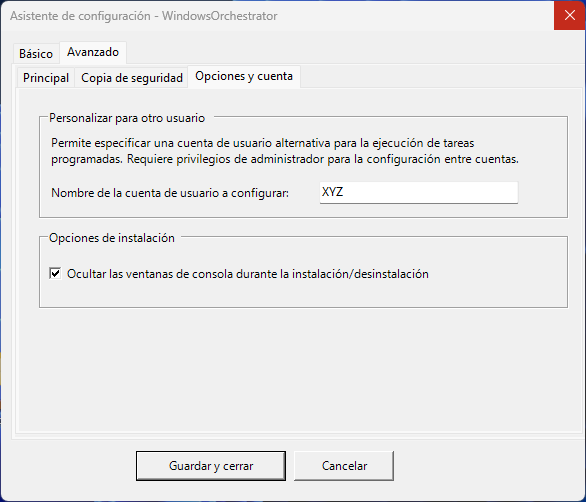

# Guía del Usuario - WindowsOrchestrator 1.72

📘 **[GUÍA DEL DESARROLLADOR](GUIA_DEL_DESARROLLADOR.md)**
*Destinado a administradores de sistemas.*

🏠 **[Volver al inicio](README.md)**
*Volver al portal de la documentación francesa.*

## Tabla de contenidos

1. [Introducción y presentación del proyecto](#1-introducción-y-presentación-del-proyecto)
    1.1. [¿Qué es WindowsOrchestrator?](#11-qué-es-windowsorchestrator-)
    1.2. [Naturaleza técnica: una herramienta de orquestación, no una instalación clásica](#12-naturaleza-técnica-una-herramienta-de-orquestación-no-una-instalación-clásica)
    1.3. [Filosofía de diseño](#13-filosofía-de-diseño)
    1.4. [Licencia y garantía](#14-licencia-y-garantía)
2. [Comprender las implicaciones de seguridad](#2-comprender-las-implicaciones-de-seguridad)
    2.1. [Desactivación de Windows Update: estabilidad vs seguridad](#21-desactivación-de-windows-update-estabilidad-vs-seguridad)
        2.1.1. [El compromiso explicado](#211-el-compromiso-explicado)
        2.1.2. [Cuándo es aceptable](#212-cuándo-es-aceptable-)
    2.2. [Autologon: disponibilidad inmediata vs seguridad física](#22-autologon-disponibilidad-inmediata-vs-seguridad-física)
        2.2.1. [Funcionamiento técnico](#221-funcionamiento-técnico)
        2.2.2. [Los riesgos reales](#222-los-riesgos-reales)
        2.2.3. [Mitigación de riesgos](#223-mitigación-de-riesgos)
    2.3. [Otras opciones de configuración y sus implicaciones](#23-otras-opciones-de-configuración-y-sus-implicaciones)
        [Desactivación del inicio rápido](#desactivación-del-inicio-rápido)
        [Desactivación del modo de suspensión](#desactivación-del-modo-de-suspensión)
        [Bloqueo de OneDrive](#bloqueo-de-onedrive)
3. [Herramientas de terceros integradas](#3-herramientas-de-terceros-integradas)
    3.1. [Microsoft Sysinternals Autologon](#31-microsoft-sysinternals-autologon)
        3.1.1. [Rol y seguridad](#311-rol-y-seguridad)
        3.1.2. [Documentación y soporte](#312-documentación-y-soporte)
    3.2. [Gotify (notificaciones - opcional)](#32-gotify-notificaciones---opcional)
        3.2.1. [Presentación y uso](#321-presentación-y-uso)
        3.2.2. [Configuración requerida](#322-configuración-requerida)
        3.2.3. [Recursos](#323-recursos)
4. [Instalación y configuración](#4-instalación-y-configuración)
    4.1. [Requisitos del sistema](#41-requisitos-del-sistema)
        4.1.1. [Sistema operativo](#411-sistema-operativo)
        4.1.2. [Privilegios y entorno](#412-privilegios-y-entorno)
    4.2. [Preparación del entorno](#42-preparación-del-entorno)
        4.2.1. [Descarga y extracción](#421-descarga-y-extracción)
        4.2.2. [Verificación de integridad](#422-verificación-de-integridad)
    4.3. [Lanzamiento de la instalación](#43-lanzamiento-de-la-instalación)
        4.3.1. [Inicio del asistente](#431-inicio-del-asistente)
    4.4. [Configuración mediante el asistente gráfico](#44-configuración-mediante-el-asistente-gráfico)
        4.4.1. [Pestaña "Básico" - Configuraciones esenciales](#441-pestaña-básico---configuraciones-esenciales)
            [Sección: Gestión de la sesión automática](#sección-gestión-de-la-sesión-automática)
            [Sección: Configuraciones de Windows](#sección-configuraciones-de-windows)
            [Sección: Gestión de OneDrive](#sección-gestión-de-onedrive)
        4.4.2. [Pestaña "Avanzado" - Subpestaña "Principal"](#442-pestaña-avanzado---subpestaña-principal)
            [GroupBox: Cierre programado de la aplicación](#groupbox-cierre-programado-de-la-aplicación)
            [GroupBox: Aplicación principal y ciclo diario](#groupbox-aplicación-principal-y-ciclo-diario)
        4.4.3. [Pestaña "Avanzado" - Subpestaña "Copia de seguridad"](#443-pestaña-avanzado---subpestaña-copia-de-seguridad)
            [GroupBox: Copia de seguridad de bases de datos (Opcional)](#groupbox-copia-de-seguridad-de-bases-de-datos-opcional)
        4.4.4. [Pestaña "Avanzado" - Subpestaña "Opciones y Cuenta"](#444-pestaña-avanzado---subpestaña-opciones-y-cuenta)
            [GroupBox: Personalizar para otro usuario](#groupbox-personalizar-para-otro-usuario)
            [GroupBox: Opciones de instalación](#groupbox-opciones-de-instalación)
    4.5. [Paso de instalación automática](#45-paso-de-instalación-automática)
        4.5.1. [Validación y guardado](#451-validación-y-guardado)
        4.5.2. [Asistente Autologon (si está activado)](#452-asistente-autologon-si-está-activado)
            [Descarga automática (si la herramienta falta)](#descarga-automática-si-la-herramienta-falta)
            [Aceptación de la licencia (EULA)](#aceptación-de-la-licencia-eula)
            [Configuración de la cuenta](#configuración-de-la-cuenta)
        4.5.3. [Creación de tareas programadas](#453-creación-de-tareas-programadas)
        4.5.4. [Ejecución inicial](#454-ejecución-inicial)
        4.5.5. [Salida](#455-salida)
    4.6. [Verificación posterior a la instalación](#46-verificación-posterior-a-la-instalación)
        4.6.1. [Verificación visual](#461-verificación-visual)
        4.6.2. [Verificación de registros](#462-verificación-de-registros)
        4.6.3. [Prueba de reinicio](#463-prueba-de-reinicio)
5. [Vida diaria y ciclo operativo](#5-vida-diaria-y-ciclo-operativo)
    5.1. [El ciclo automatizado diario](#51-el-ciclo-automatizado-diario)
        5.1.1. [Cronología típica de un día](#511-cronología-típica-de-un-día)
            [Fase 1: Uso normal (00:00 → Hora de cierre)](#fase-1-uso-normal-0000--hora-de-cierre)
            [Fase 2: Cierre de la aplicación (ejemplo: 02:50)](#fase-2-cierre-de-la-aplicación-ejemplo-0250)
            [Fase 3: Copia de seguridad de datos (ejemplo: 02:57)](#fase-3-copia-de-seguridad-de-datos-ejemplo-0257)
            [Fase 4: Reinicio programado (ejemplo: 02:59)](#fase-4-reinicio-programado-ejemplo-0259)
            [Fase 5: Arranque en frío (00:00+)](#fase-5-arranque-en-frío-0000)
            [Fase 6: Configuración del sistema (00:01+)](#fase-6-configuración-del-sistema-0001)
            [Fase 7: Apertura de sesión (00:01+)](#fase-7-apertura-de-sesión-0001)
            [Fase 8: Lanzamiento de la aplicación (00:02+)](#fase-8-lanzamiento-de-la-aplicación-0002)
        5.1.2. [Comprender los contextos de ejecución](#512-comprender-los-contextos-de-ejecución)
            [Contexto SYSTEM](#contexto-system)
            [Contexto de usuario](#contexto-de-usuario)
    5.2. [Monitoreo y verificación](#52-monitoreo-y-verificación)
        5.2.1. [Ubicación y lectura de los archivos de registro](#521-ubicación-y-lectura-de-los-archivos-de-registro)
            [Archivos a consultar](#archivos-a-consultar)
            [Archivado automático](#archivado-automático)
            [Lectura manual de registros](#lectura-manual-de-registros)
            [Lectura avanzada con PowerShell](#lectura-avanzada-con-powershell)
        5.2.2. [Interpretación de las notificaciones de Gotify](#522-interpretación-de-las-notificaciones-de-gotify)
        5.2.3. [Monitoreo del ciclo diario](#523-monitoreo-del-ciclo-diario)
        5.2.4. [Verificación del estado del sistema](#524-verificación-del-estado-del-sistema)
6. [Mantenimiento y modificación](#6-mantenimiento-y-modificación)
    6.1. [Modificar configuraciones después de la instalación](#61-modificar-configuraciones-después-de-la-instalación)
        6.1.1. [Método A: Edición manual de config.ini (avanzado)](#611-método-a-edición-manual-de-configini-avanzado)
            [Consideración de los cambios](#consideración-de-los-cambios)
        6.1.2. [Método B: Reutilización de la interfaz gráfica (recomendado)](#612-método-b-reutilización-de-la-interfaz-gráfica-recomendado)
    6.2. [Agregar o eliminar tareas programadas](#62-agregar-o-eliminar-tareas-programadas)
        6.2.1. [Agregar una tarea personalizada](#621-agregar-una-tarea-personalizada)
        6.2.2. [Eliminar una tarea](#622-eliminar-una-tarea)
    6.3. [Actualización de WindowsOrchestrator](#63-actualización-de-windowsorchestrator)
7. [Procedimientos de desinstalación](#7-procedimientos-de-desinstalación)
    7.1. [Método A: Desinstalación limpia (recomendado)](#71-método-a-desinstalación-limpia-recomendado)
        7.1.1. [Ejecución del script Uninstall.bat](#711-ejecución-del-script-uninstallbat)
        7.1.2. [Alcance de la restauración](#712-alcance-de-la-restauración)
            [Tareas programadas](#tareas-programadas)
            [Windows Update](#windows-update)
            [OneDrive](#onedrive)
            [Inicio rápido](#inicio-rápido)
        7.1.3. [Gestión de la limpieza de Autologon](#713-gestión-de-la-limpieza-de-autologon)
    7.2. [Método B: Parada de emergencia manual](#72-método-b-parada-de-emergencia-manual)
        7.2.1. [Procedimiento mediante el Programador de tareas](#721-procedimiento-mediante-el-programador-de-tareas)
        7.2.2. [Advertencia sobre modificaciones persistentes del registro](#722-advertencia-sobre-modificaciones-persistentes-del-registro)
        7.2.3. [Restauración manual de parámetros (avanzado)](#723-restauración-manual-de-parámetros-avanzado)
            [Rehabilitación de Windows Update](#rehabilitación-de-windows-update)
            [Rehabilitación del inicio rápido](#rehabilitación-del-inicio-rápido)
            [Rehabilitación de OneDrive](#rehabilitación-de-onedrive)
            [Desactivación de Autologon (mediante registro)](#desactivación-de-autologon-mediante-registro)
8. [Solución de problemas y FAQ](#8-solución-de-problemas-y-faq)
    8.1. [La aplicación no se inicia al arranque](#81-la-aplicación-no-se-inicia-al-arranque)
        [Diagnóstico](#diagnóstico)
        [Causas posibles](#causas-posibles)
        [Solución](#solución)
    8.2. [El reinicio programado no funciona](#82-el-reinicio-programado-no-funciona)
        [Diagnóstico](#diagnóstico-1)
        [Causas posibles](#causas-posibles-1)
        [Solución](#solución-1)
    8.3. [La copia de seguridad falla con "Permisos insuficientes"](#83-la-copia-de-seguridad-falla-con-permisos-insuficientes)
        [Diagnóstico](#diagnóstico-2)
        [Causas posibles](#causas-posibles-2)
        [Solución](#solución-2)
    8.4. [Autologon no funciona después de la instalación](#84-autologon-no-funciona-después-de-la-instalación)
        [Diagnóstico](#diagnóstico-3)
        [Causas posibles](#causas-posibles-3)
        [Verificación del registro](#verificación-del-registro)
        [Solución](#solución-3)
    8.5. [El modo silencioso no oculta las ventanas](#85-el-modo-silencioso-no-oculta-las-ventanas)
        [Diagnóstico](#diagnóstico-4)
        [Causas posibles](#causas-posibles-4)
        [Solución](#solución-4)
    8.6. [La pantalla de bienvenida se queda colgada indefinidamente](#86-la-pantalla-de-bienvenida-se-queda-colgada-indefinidamente)
        [Diagnóstico](#diagnóstico-5)
        [Causas posibles](#causas-posibles-5)
        [Solución de emergencia](#solución-de-emergencia)
        [Solución permanente](#solución-permanente)
9. [Apéndices](#9-apéndices)
    9.1. [Estructura completa del archivo config.ini](#91-estructura-completa-del-archivo-configini)
    9.2. [Códigos de salida de los scripts](#92-códigos-de-salida-de-los-scripts)
    9.3. [Ubicaciones de archivos críticos](#93-ubicaciones-de-archivos-críticos)
    9.4. [Soporte y recursos](#94-soporte-y-recursos)

---

## 1. Introducción y presentación del proyecto

### 1.1. ¿Qué es WindowsOrchestrator?

WindowsOrchestrator es un conjunto de scripts de PowerShell diseñados para automatizar la gestión de un puesto de trabajo Windows. Transforma una máquina estándar en un sistema autónomo capaz de:

- Iniciar automáticamente una aplicación empresarial sin intervención humana
- Reiniciarse diariamente según un horario definido
- Realizar copias de seguridad automáticamente de datos sensibles
- Mantener configuraciones del sistema optimizadas para la estabilidad

El proyecto se dirige principalmente a entornos profesionales: quioscos interactivos, señalización digital, puestos de trabajo en producción continua, o cualquier sistema que deba funcionar continuamente con un mantenimiento mínimo.

### 1.2. Naturaleza técnica: una herramienta de orquestación, no una instalación clásica

WindowsOrchestrator no se instala como un software tradicional. No copia ningún archivo en `C:\Program Files` o `C:\Windows`, y no aparece en la lista de aplicaciones instaladas del sistema.

Los scripts permanecen en la carpeta que descargaste. La instalación configura el Programador de tareas de Windows para ejecutar estos scripts en los momentos apropiados. Las tareas programadas apuntan directamente a los archivos presentes en tu carpeta.

La carpeta del proyecto nunca debe moverse o eliminarse después de la instalación. Si necesitas moverla, debes desinstalar primero, mover la carpeta y luego reinstalar desde la nueva ubicación.

### 1.3. Filosofía de diseño

WindowsOrchestrator se basa en tres principios fundamentales.

Ninguna manipulación oculta del sistema. Cada acción está documentada y trazable en los registros. El código fuente es abierto y auditable.

La herramienta solo aplica lo que configuras explícitamente. Ninguna decisión automática sobre configuraciones críticas. Desinstalación posible en cualquier momento.

Algunas opciones reducen la seguridad por diseño. La herramienta no reemplaza una estrategia profesional de respaldo. El administrador permanece responsable de la seguridad y la sostenibilidad de los datos.

### 1.4. Licencia y garantía

Este software se distribuye bajo la Licencia Pública General de GNU v3.0 (GPLv3). Eres libre de usarlo, modificarlo y redistribuirlo según los términos de esta licencia. El código fuente está accesible y modificable.

El software se proporciona tal cual, sin ninguna garantía de ningún tipo. Los autores no pueden ser responsables de daños directos o indirectos resultantes de su uso, incluyendo pérdida de datos, interrupción de servicio o problemas de compatibilidad del sistema.

Debes probar el software en un entorno no crítico antes de la implementación, mantener respaldos externos independientes del sistema y verificar la compatibilidad con tus aplicaciones empresariales.

---

## 2. Comprender las implicaciones de seguridad

WindowsOrchestrator ofrece funcionalidades poderosas que requieren la desactivación de ciertos mecanismos de seguridad de Windows. Esta sección explica los riesgos y las mejores prácticas.

### 2.1. Desactivación de Windows Update: estabilidad vs seguridad

#### 2.1.1. El compromiso explicado

La desactivación de las actualizaciones garantiza la estabilidad: el entorno de software permanece congelado y predecible. Evita reinicios inesperados que interrumpen el servicio y previene cambios de comportamiento de Windows entre versiones.

Los riesgos incurridos son reales: las vulnerabilidades de seguridad no se corrigen, la máquina se vuelve vulnerable a ataques automatizados, y esto puede crear una no conformidad con ciertas políticas de TI empresariales.

#### 2.1.2. Cuándo es aceptable

La desactivación de Windows Update es aceptable únicamente si se cumplen todas estas condiciones.

La máquina no está directamente expuesta a Internet. Debe estar detrás de un firewall profesional, en una VLAN separada de la red principal, sin navegación web ni correo electrónico.

La necesidad de estabilidad es crítica: el menor reinicio causa un perjuicio. Esto concierne a pantallas permanentes en aeropuerto o estación, líneas de producción industrial, o sistemas de vigilancia en continuo.

Tienes un procedimiento para aplicar actualizaciones manualmente: ventana de mantenimiento mensual, reactivación temporal de Windows Update, prueba de actualizaciones en un puesto similar.

Si estas condiciones no se cumplen, deja Windows Update activado y ajusta simplemente la política de reinicio mediante `DisableAutoReboot=true`.

### 2.2. Autologon: disponibilidad inmediata vs seguridad física

#### 2.2.1. Funcionamiento técnico

Cuando Autologon está activado, Windows inicia directamente en el escritorio sin pantalla de inicio de sesión. La contraseña se almacena de manera encriptada en la LSA (Local Security Authority). La herramienta oficial Microsoft Sysinternals Autologon se utiliza para esta operación.

#### 2.2.2. Los riesgos reales

La contraseña permanece encriptada y no visible en el registro. El acceso de red autenticado se preserva. El cifrado BitLocker (si está activado) protege los datos en reposo.

Sin embargo, cualquier persona con acceso físico puede usar la sesión abierta. Los archivos y documentos del usuario son accesibles. Las aplicaciones abiertas pueden ser manipuladas. Un simple reinicio es suficiente para acceder al sistema.

#### 2.2.3. Mitigación de riesgos

Crea una cuenta de usuario específica para Autologon, sin derechos de administrador local, con acceso limitado a solo las carpetas necesarias para la aplicación, y sin acceso a recursos compartidos de red sensibles.

Asegura físicamente la máquina: recinto cerrado con llave, habitación de acceso restringido, desactivación del puerto USB en BIOS para prevenir llaves USB de arranque.

Activa BitLocker para cifrar el disco duro y proteger datos en caso de robo de la máquina. Recuerda que BitLocker no protege una vez que el sistema está iniciado.

Autologon es adecuado para quioscos de visualización en áreas públicas con cuenta de solo lectura, puestos de producción en fábricas seguras, o sistemas embebidos sin interfaz física. Está desaconsejado en puestos de administrador con privilegios elevados, máquinas que almacenan datos sensibles no cifrados, o entornos accesibles al público sin supervisión.

### 2.3. Otras opciones de configuración y sus implicaciones

#### Desactivación del inicio rápido

La desactivación del inicio rápido fuerza un reinicio completo sin hibernación parcial. Recarga controladores y servicios completamente. El tiempo de arranque es ligeramente más largo. Evita problemas de memoria fantasma después de varias semanas sin reinicio completo.

#### Desactivación del modo de suspensión

En un portátil, la desactivación del modo de suspensión causa un drenaje completo de la batería si se olvida, calentamiento continuo de la máquina y desgaste prematuro de componentes. Esta opción está reservada a puestos fijos en producción continua.

#### Bloqueo de OneDrive

El bloqueo de OneDrive tiene un impacto mínimo ya que OneDrive generalmente no es crítico para la operación. La ventaja es ahorrar recursos del sistema y evitar sincronizaciones inoportunas.

---

## 3. Herramientas de terceros integradas

### 3.1. Microsoft Sysinternals Autologon

#### 3.1.1. Rol y seguridad

WindowsOrchestrator nunca maneja directamente contraseñas. Esta responsabilidad crítica se delega a la herramienta oficial Microsoft Autologon.

Ninguna contraseña se escribe jamás en `config.ini` o scripts de PowerShell. La contraseña se encripta mediante la API LSA de Windows, utilizando el mismo método que los servicios de Windows. El cifrado está ligado a la máquina y no es exportable.

El proceso de instalación descarga automáticamente la herramienta desde `live.sysinternals.com` (URL oficial de Microsoft), verifica su integridad confirmando la presencia de `Eula.txt` y el ejecutable, solicita aceptación del usuario de la licencia, permite entrada interactiva de credenciales en la interfaz Autologon, luego realiza el cifrado automático.

#### 3.1.2. Documentación y soporte

Página oficial: <https://learn.microsoft.com/sysinternals/downloads/autologon>

Editor: Microsoft Corporation

Licencia: Propietaria Microsoft (gratuita)

Soporte: Windows 7 a Windows 11

Si falla la descarga, descarga manualmente `Autologon.zip` desde el sitio de Microsoft, extrae todos los archivos en `management/tools/Autologon/`, luego reinicia la instalación.

### 3.2. Gotify (notificaciones - opcional)

#### 3.2.1. Presentación y uso

Gotify es un servidor de notificaciones push autoalojado que permite monitorear el estado de la máquina de forma remota.

Los casos de uso típicos conciernen máquinas instaladas en una sala de servidores sin pantalla, supervisión de múltiples quioscos desde un tablero central, o alertas por smartphone mediante la aplicación Gotify.

Los scripts envían mensajes HTTP hacia tu servidor Gotify. Recibes notificaciones en tiempo real: inicio exitoso, aplicación lanzada, error crítico. Los registros detallados permanecen en archivos locales.

#### 3.2.2. Configuración requerida

Para usar Gotify, debes alojar tu propia instancia Gotify (servidor Linux, Docker, etc.), crear una aplicación en la interfaz Gotify, recuperar el token de autenticación, luego completar la sección `[Gotify]` en `config.ini`.

Ningún dato se envía a servidores de terceros. Controlas completamente la infraestructura de notificación. El sistema es desactivable simplemente dejando la sección vacía.

#### 3.2.3. Recursos

Sitio oficial: <https://gotify.net/>

Código fuente: <https://github.com/gotify/server>

Licencia: MIT (Open Source)

---

## 4. Instalación y configuración

### 4.1. Requisitos del sistema

#### 4.1.1. Sistema operativo

WindowsOrchestrator es compatible con Windows 10 (versión 1809 o posterior recomendado), Windows 11 (todas las versiones), Windows Server 2016, 2019, 2022 (soporte no oficial no probado).

Las ediciones Professional y Enterprise están totalmente soportadas. La edición Home es funcional pero algunas GPO pueden estar limitadas.

#### 4.1.2. Privilegios y entorno

La cuenta utilizada para la instalación debe tener privilegios de Administrador local. Estos derechos son necesarios para modificar el registro HKLM, crear tareas programadas y gestionar servicios.

PowerShell versión 5.1 mínimo es requerido (incluido por defecto en Windows 10+). La política de ejecución se gestiona automáticamente por los scripts mediante `-ExecutionPolicy Bypass`.

Una conexión a Internet es opcional. Solo es necesaria si `UseAutologonAssistant=true` y Autologon.exe falta. El sistema puede operar offline si la herramienta ya está presente.

### 4.2. Preparación del entorno

#### 4.2.1. Descarga y extracción

Descarga el archivo del proyecto desde GitHub. Extrae el contenido en una carpeta permanente, por ejemplo `C:\WindowsOrchestrator\` o `D:\Automation\WO\`. No instales en `C:\Program Files\` debido a problemas de permisos. Evita el Escritorio o la carpeta Descargas que pueden limpiarse.

#### 4.2.2. Verificación de integridad

Estructura esperada del proyecto:

```
WindowsOrchestrator/
├── Install.bat
├── Uninstall.bat
├── config.ini (se creará durante la instalación)
├── management/
│   ├── firstconfig.ps1
│   ├── install.ps1
│   ├── uninstall.ps1
│   ├── config_systeme.ps1
│   ├── config_utilisateur.ps1
│   ├── Invoke-DatabaseBackup.ps1
│   ├── Launch-Install.ps1
│   ├── Launch-Uninstall.ps1
│   ├── modules/
│   │   └── WindowsOrchestratorUtils/
│   └── defaults/
│       └── default_config.ini
└── i18n/
    ├── en-US/
    └── fr-FR/
```

### 4.3. Lanzamiento de la instalación

#### 4.3.1. Inicio del asistente

Localiza el archivo `Install.bat` en la raíz del proyecto. Haz doble clic en `Install.bat`. Se abre una ventana de consola y aparece el asistente de configuración gráfica `firstconfig.ps1`.

Configura los ajustes deseados mediante la interfaz gráfica. Una vez que la configuración se valida haciendo clic en "Guardar y Cerrar", aparece el Control de cuentas de usuario (UAC). Haz clic en "Sí" para autorizar la ejecución con privilegios de administrador.

### 4.4. Configuración mediante el asistente gráfico

El asistente `firstconfig.ps1` permite generar el archivo `config.ini` de manera intuitiva. Está organizado en dos pestañas principales.

#### 4.4.1. Pestaña "Básico" - Configuraciones esenciales



##### Sección: Gestión de la sesión automática

La casilla "Activar apertura de sesión automática (Autologon)" activa Autologon si está marcada. Si está desmarcada, se mantiene la sesión manual clásica con pantalla de inicio de sesión.

Una nota indica que al marcar, aceptas la licencia de la herramienta Microsoft Autologon.

##### Sección: Configuraciones de Windows

"Desactivar inicio rápido de Windows" está recomendado. Esta opción fuerza un reinicio completo diario desactivando la hibernación parcial de Windows.

"Desactivar suspensión automática" impide que el sistema entre en suspensión (S3/S4). Cuidado: en un portátil, esta opción drena la batería.

"Desactivar suspensión de pantalla" mantiene la pantalla encendida permanentemente. Útil para señalización digital o tableros permanentes.

"Bloquear servicio Windows Update" desactiva completamente las actualizaciones automáticas. Relee la sección 2.1 antes de activar esta opción. Si la marcas, se vuelve disponible una subopción "Desactivar reinicio automático después de actualización".

##### Sección: Gestión de OneDrive

Un menú desplegable ofrece tres opciones.

"Bloquear (política del sistema)" prohíbe la ejecución de OneDrive mediante GPO. Esta opción está recomendada para quioscos y terminales.

"Cerrar al inicio" mata el proceso OneDrive.exe al arranque. OneDrive puede relanzarse manualmente después.

"No hacer nada" deja OneDrive funcionando normalmente.

#### Indicación de preconfiguración (Configuración congelada)

Cuando la opción `ShowContextMessages` está activa, aparece un banner azul en la parte superior de la ventana. Simplemente indica que la configuración ya ha sido definida internamente, para evitar ajustes erróneos.



#### 4.4.2. Pestaña "Avanzado" - Subpestaña "Principal"



##### GroupBox: Cierre programado de la aplicación

"Hora de cierre (HH:MM)" define el momento en que la aplicación recibirá la orden de cierre (ALT+F4). Esta hora debe ser anterior a la hora de reinicio. Ejemplo: `02:50`.

"Comando a ejecutar antes del cierre" permite especificar un script o ejecutable a lanzar antes del reinicio. Déjalo vacío si no se necesita ninguna acción previa. Ejemplo: `management\Invoke-DatabaseBackup.ps1`.

"Argumentos para el comando" está vacío por defecto.

##### GroupBox: Aplicación principal y ciclo diario

"Hora de reinicio programado (HH:MM)" define el momento en que el sistema se reinicia automáticamente. Déjalo vacío para desactivar el reinicio programado. Ejemplo: `02:59`.

"Aplicación a lanzar" especifica la ruta al archivo de inicio de tu aplicación. Los formatos aceptados son `.exe`, `.bat`, `.cmd`, `.ps1`. Las rutas relativas se calculan desde la raíz del proyecto. Las rutas absolutas también están aceptadas, por ejemplo `C:\MiApp\inicio.exe`. Ejemplo: `LaunchApp.bat`.

"Argumentos para la aplicación" permite pasar parámetros de línea de comandos. Vacío por defecto.

"Nombre del proceso a monitorear (sin .exe)" es el nombre exacto del proceso final a monitorear. Este parámetro es crucial ya que permite verificar si la aplicación está ejecutándose. Déjalo vacío si usas un wrapper (.bat) sin monitoreo. Ejemplo: `MiApp`.

"Modo de lanzamiento de consola" ofrece dos opciones. "Lanzamiento estándar (recomendado)" utiliza el terminal por defecto (Terminal de Windows si está disponible). "Lanzamiento legacy (consola heredada)" fuerza cmd.exe con nueva ventana para compatibilidad con scripts antiguos.

La casilla "Lanzar aplicación principal minimizada en la barra de tareas" inicia la aplicación minimizada si está marcada. Esta opción no es aplicable en modo legacy.

#### 4.4.3. Pestaña "Avanzado" - Subpestaña "Copia de seguridad"



##### GroupBox: Copia de seguridad de bases de datos (Opcional)

La casilla "Activar copia de seguridad antes del reinicio" activa el módulo de copia automática.

Los campos siguientes están en gris hasta que la casilla esté marcada.

"Hora de la copia de seguridad (HH:MM)" debe configurarse 5-10 minutos después de la hora de cierre para dejar tiempo a la aplicación para completar sus escrituras. Ejemplo: `02:57`.

"Carpeta de origen de los datos" especifica la ruta relativa o absoluta a la carpeta a respaldar. Ejemplo: `..\datos`.

"Carpeta de destino de la copia de seguridad" define la ruta donde se almacenarán las copias. Ejemplo: `..\datos\CopiaDiaria`.

"Duración de retención de las copias de seguridad (en días)" indica cuántos días se retienen las copias. Las copias más antiguas se eliminan automáticamente. Ejemplo: `10`.

#### 4.4.4. Pestaña "Avanzado" - Subpestaña "Opciones y Cuenta"



##### GroupBox: Personalizar para otro usuario

"Nombre de la cuenta de usuario a configurar" permite especificar una cuenta diferente de la que lanza la instalación. Por defecto, es el usuario que ejecuta la instalación. Esta opción permite configurar Autologon para otra cuenta. Ejemplo: `AdminLocal`.

##### GroupBox: Opciones de instalación

La casilla "Ocultar ventanas de consola durante instalación/desinstalación" activa el modo silencioso. Cuando está marcada, aparece una pantalla de bienvenida en lugar de consolas de PowerShell, y un MessageBox final indica el resultado de la operación.

### 4.5. Paso de instalación automática

#### 4.5.1. Validación y guardado

Una vez que haces clic en "Guardar y Cerrar", el asistente genera el archivo `config.ini` en la raíz del proyecto. Un cuadro de diálogo confirma el guardado: "Configuración guardada en 'C:\WindowsOrchestrator\config.ini'". El asistente se cierra automáticamente y el script de instalación `install.ps1` inicia.

#### 4.5.2. Asistente Autologon (si está activado)

Si has marcado "Activar apertura de sesión automática" en el asistente, se activa el siguiente proceso.

##### Descarga automática (si la herramienta falta)

Una pantalla de bienvenida indica "Descargando herramienta Microsoft Autologon...". La herramienta se extrae en `management/tools/Autologon/`.

##### Aceptación de la licencia (EULA)

El Bloc de notas se abre mostrando el contrato de licencia Sysinternals. Lee el documento y cierra la ventana. Un cuadro de diálogo pregunta "Aceptas los términos de la licencia de la herramienta Autologon de Sysinternals?". Haz clic en "Sí" para continuar o "No" para cancelar.

##### Configuración de la cuenta

La ventana Autologon.exe se abre. Los campos a completar son los siguientes.

"Username" contiene el nombre de la cuenta, generalmente prellenado con el nombre del usuario configurado.

"Domain" contiene el nombre de la máquina o del dominio. Usa `.` para una cuenta local.

"Password" requiere la entrada de la contraseña de la cuenta. Esta contraseña será encriptada automáticamente.

Haz clic en el botón "Enable". Un mensaje confirma que la contraseña está encriptada y almacenada. Cierra la ventana. La pantalla de bienvenida reaparece para la continuación de la instalación.

#### 4.5.3. Creación de tareas programadas

El script crea automáticamente las siguientes tareas en el Programador de tareas de Windows.

`WindowsOrchestrator-SystemStartup` se ejecuta al inicio del sistema en contexto SYSTEM.

`WindowsOrchestrator-UserLogon` se ejecuta al inicio de sesión del usuario en el contexto del usuario configurado.

Se crean tareas dinámicas si están configuradas: `WindowsOrchestrator-SystemBackup`, `WindowsOrchestrator-SystemScheduledReboot`, `WindowsOrchestrator-System-CloseApp`, `WindowsOrchestrator-User-CloseApp`.

Verifica su presencia abriendo el Programador de tareas (`Win+R` luego `taskschd.msc`). Las tareas deberían aparecer en la raíz de la biblioteca.

#### 4.5.4. Ejecución inicial

El script lanza inmediatamente `config_systeme.ps1` para aplicar la configuración del sistema. Luego inicia la tarea `WindowsOrchestrator-UserLogon` para lanzar la aplicación.

En modo silencioso, un MessageBox final indica "Instalación de WindowsOrchestrator completada exitosamente! Todos los registros han sido guardados en la carpeta Logs."

#### 4.5.5. Salida

El comportamiento de salida depende de la configuración en `config.ini`.

Si `RebootOnCompletion=true`, el sistema se reinicia después de 15 segundos (configurable mediante `RebootGracePeriod`).

Si `PowerShellExitMode=automatic`, la consola se cierra después de 15 segundos (configurable mediante `PowerShellExitDelay`).

Si `PowerShellExitMode=manual`, debes presionar Enter para cerrar la consola.

### 4.6. Verificación posterior a la instalación

#### 4.6.1. Verificación visual

Abre el Programador de tareas (`Win+R` luego `taskschd.msc`). Verifica la presencia de `WindowsOrchestrator-SystemStartup` y `WindowsOrchestrator-UserLogon`. Haz clic derecho en cada tarea, selecciona "Propiedades", luego la pestaña "Disparadores" para verificar las condiciones.

#### 4.6.2. Verificación de registros

Accede a la carpeta `C:\WindowsOrchestrator\Logs\`. Abre `config_systeme_ps.txt` y `config_utilisateur_ps.txt`. Verifica la ausencia de líneas que contengan `[ERROR]`.

#### 4.6.3. Prueba de reinicio

Reinicia el PC manualmente. Observa si la sesión se abre automáticamente (si Autologon está activado). Verifica que la aplicación objetivo se lance correctamente.

---

## 5. Vida diaria y ciclo operativo

Una vez que WindowsOrchestrator está instalado, la máquina entra en un ciclo operativo autónomo. Ya no necesitas intervenir físicamente en el puesto de trabajo para iniciarlo o lanzar la aplicación.

### 5.1. El ciclo automatizado diario

#### 5.1.1. Cronología típica de un día

##### Fase 1: Uso normal (00:00 → Hora de cierre)

El sistema funciona normalmente. La aplicación empresarial está activa. Ninguna intervención del orquestador.

##### Fase 2: Cierre de la aplicación (ejemplo: 02:50)

La tarea `WindowsOrchestrator-User-CloseApp` se ejecuta si está configurada. La acción por defecto consiste en buscar la ventana "MiApp" y enviarle la secuencia de teclas `{ESC}{ESC}x{ENTER}` (Escape x2, x, Enter). El tiempo de espera máximo es de 60 segundos con intentos cada 5 segundos. El resultado se registra en `config_utilisateur_ps.txt`.

##### Fase 3: Copia de seguridad de datos (ejemplo: 02:57)

La tarea `WindowsOrchestrator-SystemBackup` se ejecuta si está activada. La acción consiste en copiar archivos modificados en las últimas 24 horas hacia la carpeta de destino.
**Nota importante:** Para garantizar la integridad de las bases de datos (ej.: SQLite), si se detecta un archivo como modificado, el script fuerza también la copia de seguridad de todos los archivos con el mismo nombre (ej.: `.db-wal`, `.db-shm`), incluso si no han sido modificados recientemente. El resultado se registra en `Invoke-DatabaseBackup_log.txt`.

##### Fase 4: Reinicio programado (ejemplo: 02:59)

La tarea `WindowsOrchestrator-SystemScheduledReboot` se ejecuta. La acción lanza `shutdown.exe /r /t 0`. El sistema se reinicia inmediatamente.

##### Fase 5: Arranque en frío (00:00+)

El inicio rápido está desactivado, por lo que la carga del kernel de Windows es completa. No se preserva ningún estado de hibernación.

##### Fase 6: Configuración del sistema (00:01+)

La tarea `WindowsOrchestrator-SystemStartup` se ejecuta al inicio con el disparador "At Startup". Las acciones realizadas son verificación y aplicación de políticas (Windows Update, OneDrive, etc.), gestión de alimentación mediante powercfg, y recreación de tareas dinámicas si es necesario. El resultado se registra en `config_systeme_ps.txt`.

##### Fase 7: Apertura de sesión (00:01+)

Si Autologon está activado, la sesión se abre automáticamente. Si Autologon está desactivado, aparece la pantalla de inicio de sesión clásica.

##### Fase 8: Lanzamiento de la aplicación (00:02+)

La tarea `WindowsOrchestrator-UserLogon` se ejecuta con el disparador "At Logon". Las acciones son las siguientes: verificar si el proceso `ProcessToMonitor` ya está ejecutándose, lanzar mediante el método configurado (directo/cmd/powershell/legacy) si el proceso está ausente, ninguna acción si el proceso está presente (solo se genera un registro de información). El sistema no realiza monitoreo continuo (sin watchdog). El resultado se registra en `config_utilisateur_ps.txt`.

#### 5.1.2. Comprender los contextos de ejecución

##### Contexto SYSTEM

El script `config_systeme.ps1` se ejecuta al inicio de Windows, antes de la apertura de sesión. Corre con privilegios SYSTEM (equivalente a root bajo Linux). Puede modificar el registro HKLM, gestionar servicios de Windows y aplicar políticas de grupo. No tiene acceso al perfil de usuario y no puede lanzar aplicaciones gráficas.

##### Contexto de usuario

El script `config_utilisateur.ps1` se ejecuta al abrir la sesión del usuario configurado. Corre con los derechos de ese usuario. Puede lanzar aplicaciones gráficas y acceder a archivos en el perfil de usuario. No puede modificar configuraciones del sistema HKLM sin privilegios elevados.

### 5.2. Monitoreo y verificación

#### 5.2.1. Ubicación y lectura de los archivos de registro

Los registros se encuentran en la carpeta `Logs/` en la raíz del proyecto.

##### Archivos a consultar

`config_systeme_ps.txt` permite verificar si las actualizaciones están correctamente bloqueadas o si el PC se inició esta mañana.

`config_utilisateur_ps.txt` permite verificar a qué hora se lanzó o relanzó la aplicación.

`Invoke-DatabaseBackup_log.txt` permite verificar la lista de archivos respaldados y confirmar que no hubo error de espacio en disco.

##### Archivado automático

Para evitar saturar el disco, el orquestador archiva y elimina automáticamente registros antiguos. Encontrarás archivos numerados (`config_systeme_ps.1.txt`, `config_systeme_ps.2.txt`, etc.) correspondientes a días anteriores. El número de archivos retenidos es configurable mediante `MaxSystemLogsToKeep` y `MaxUserLogsToKeep` en `config.ini`.

##### Lectura manual de registros

Abre archivos con Notepad++, VSCode o Notepad. Busca `[ERROR]` para identificar problemas. Verifica las marcas de tiempo para entender la secuencia de eventos.

##### Lectura avanzada con PowerShell

```powershell
# Mostrar solo errores de las últimas 24 horas
Get-Content "C:\WindowsOrchestrator\Logs\config_systeme_ps.txt" | Select-String "\[ERROR\]" | Select-Object -Last 50

# Filtrar por fecha
$today = Get-Date -Format "yyyy-MM-dd"
Get-Content "C:\WindowsOrchestrator\Logs\config_systeme_ps.txt" | Select-String "^$today"
```

#### 5.2.2. Interpretación de las notificaciones de Gotify

Si has configurado la sección `[Gotify]` en `config.ini`, no necesitas revisar los registros. Tu servidor de monitoreo recibirá mensajes en tiempo real.

Un mensaje de nivel INFO (verde o azul) indica que todo está nominal: "Inicio completado", "Aplicación lanzada", "Copia de seguridad exitosa".

Un mensaje de nivel ERROR (rojo) indica que una acción falló: "No se pudo lanzar la aplicación", "Disco lleno durante la copia de seguridad". Se requiere intervención.

#### 5.2.3. Monitoreo del ciclo diario

Revisa los registros cada mañana para confirmar que la copia de seguridad se ejecutó correctamente, que el reinicio ocurrió y que la aplicación se relanzó.

#### 5.2.4. Verificación del estado del sistema

Abre el Programador de tareas (`taskschd.msc`). Consulta la pestaña "Historial" de las tareas `WindowsOrchestrator-*`. Un código de resultado `0x0` significa éxito.

---

## 6. Mantenimiento y modificación

Las necesidades de tu puesto de trabajo pueden evolucionar: cambio de horario, nueva aplicación, modificación de la política de respaldo. WindowsOrchestrator está diseñado para ser reconfigurable sin requerir una desinstalación completa.

### 6.1. Modificar configuraciones después de la instalación

#### 6.1.1. Método A: Edición manual de `config.ini` (avanzado)

Este método es el más rápido para modificaciones menores, por ejemplo cambiar la hora de reinicio.

Abre la carpeta del proyecto. Haz clic derecho en el archivo `config.ini` y elige "Abrir con" luego "Bloc de notas". Modifica el valor deseado. Por ejemplo, cambia `ScheduledRebootTime=03:00` a `ScheduledRebootTime=04:00`. Guarda el archivo (`Ctrl + S`) y ciérralo.

##### Consideración de los cambios

Los cambios de horario serán considerados automáticamente en el próximo reinicio de scripts, generalmente en el próximo arranque del PC. Para una consideración inmediata sin reiniciar el PC, puedes relanzar manualmente el script de instalación haciendo doble clic en `Install.bat`.

#### 6.1.2. Método B: Reutilización de la interfaz gráfica (recomendado)

Este método es más seguro ya que valida el formato de tus entradas y reaplica las tareas programadas inmediatamente.

Haz doble clic en `Install.bat`. El asistente gráfico detectará tu archivo `config.ini` existente y cargará tus ajustes actuales en los campos. Realiza tus modificaciones en la interfaz, por ejemplo marcando o desmarcando una opción. Haz clic en "Guardar y Cerrar". El script actualizará las tareas programadas con tus nuevos parámetros.

### 6.2. Agregar o eliminar tareas programadas

#### 6.2.1. Agregar una tarea personalizada

Quieres agregar un script de limpieza personalizado a las 22:00.

Modifica `config.ini` para agregar `ScheduledCloseTime=22:00`. Modifica `ScheduledCloseCommand` para apuntar a tu script. Relanza `Install.bat`. Verifica en `taskschd.msc` que la nueva tarea se creó.

#### 6.2.2. Eliminar una tarea

Vacía el campo correspondiente en `config.ini`, por ejemplo `ScheduledRebootTime=`. Relanza `Install.bat`. El script elimina automáticamente la tarea obsoleta.

### 6.3. Actualización de WindowsOrchestrator

Si hay una nueva versión de WindowsOrchestrator disponible, aquí está el procedimiento para actualizar tu instalación sin perder tu configuración.

Haz una copia de seguridad de tu archivo `config.ini` actual en un lugar seguro, por ejemplo en el Escritorio. Se recomienda (pero no es obligatorio) ejecutar `Uninstall.bat` para limpiar antes de la actualización. Elimina el contenido de la carpeta del proyecto y reemplázalo con los archivos de la nueva versión. Coloca tu `config.ini` respaldado de nuevo en la raíz de la carpeta del proyecto. Haz doble clic en `Install.bat`.

El asistente leerá tu configuración antigua. Si hay nuevas opciones en la nueva versión, aparecerán, a menudo con valores predeterminados. Verifícalas. Valida para reinstalar el sistema con el motor actualizado.

---

## 7. Procedimientos de desinstalación

WindowsOrchestrator está diseñado para ser reversible. Mantienes el control total sobre la máquina y puedes detener la automatización en cualquier momento.

### 7.1. Método A: Desinstalación limpia (recomendado)

Este es el método estándar. Utiliza el script de desinstalación proporcionado para deshacer las modificaciones de manera ordenada y limpiar el entorno.

#### 7.1.1. Ejecución del script `Uninstall.bat`

Abre la carpeta del proyecto. Haz doble clic en el archivo `Uninstall.bat`. Una ventana de Windows te pedirá autorizar la aplicación para hacer cambios (UAC). Haz clic en "Sí". Esto es necesario para eliminar claves de registro del sistema.

#### 7.1.2. Alcance de la restauración

El script restablece automáticamente parámetros vitales de Windows a su estado predeterminado.

##### Tareas programadas

Eliminación inmediata de tareas de inicio, inicio de sesión, cierre y respaldo. La automatización se detiene instantáneamente.

##### Windows Update

El servicio está desbloqueado y establecido en inicio automático. Las claves de registro que bloquean las actualizaciones están eliminadas.

##### OneDrive

La política de prohibición de ejecución está levantada.

##### Inicio rápido

La funcionalidad "Inicio rápido" de Windows está reactivada.

Los archivos de registro (`Logs/`) y el archivo de configuración (`config.ini`) no se eliminan para permitirte mantener un rastro del historial. Puedes eliminar manualmente la carpeta del proyecto una vez que la operación se complete.

#### 7.1.3. Gestión de la limpieza de Autologon

Si la sesión automática estaba activada, el script de desinstalación detectará este estado y te preguntará si deseas desactivarla.

Si respondes "Sí", el script relanzará la herramienta oficial Microsoft Autologon. En la ventana de la herramienta que se abre, simplemente haz clic en el botón "Disable". Esto asegura que la contraseña encriptada se elimine correctamente del área segura (LSA) de Windows. Cierra luego la ventana.

### 7.2. Método B: Parada de emergencia manual

Si por alguna razón (script corrupto, error del sistema) el método A no funciona, puedes usar este método manual. Permite recuperar el control inmediatamente utilizando solo las herramientas integradas en Windows.

#### 7.2.1. Procedimiento mediante el Programador de tareas

Presiona simultáneamente las teclas `Windows + R` de tu teclado. Escribe `taskschd.msc` en la ventana que se abre y valida con Enter. En la columna izquierda, haz clic en la carpeta "Biblioteca del Programador de tareas". En la lista central, busca líneas que comiencen con `WindowsOrchestrator` (generalmente hay entre 2 y 6). Haz clic derecho en cada una de estas líneas, selecciona "Eliminar" y confirma.

La automatización se detiene inmediatamente. En el próximo reinicio, ningún script se lanzará.

#### 7.2.2. Advertencia sobre modificaciones persistentes del registro

Este método B es una parada de emergencia, no una limpieza completa.

Lo que se detiene: el lanzamiento automático de tu aplicación y los reinicios programados.

Lo que permanece modificado: parámetros profundos del sistema (Windows Update bloqueado, Autologon activo, suspensión desactivada) permanecen en el estado en que el orquestador los puso.

Usa este método para detener la automatización inmediatamente, pero intenta ejecutar el método A tan pronto como sea posible para restaurar los parámetros del sistema de manera ordenada, o modifícalos manualmente mediante configuraciones de Windows.

#### 7.2.3. Restauración manual de parámetros (avanzado)

Si la desinstalación automática falló o usaste el método B, puedes restaurar parámetros del sistema manualmente.

##### Reactivación de Windows Update

```powershell
# Eliminar claves GPO
Remove-ItemProperty -Path "HKLM:\SOFTWARE\Policies\Microsoft\Windows\WindowsUpdate\AU" -Name "NoAutoUpdate" -ErrorAction SilentlyContinue
Remove-ItemProperty -Path "HKLM:\SOFTWARE\Policies\Microsoft\Windows\WindowsUpdate\AU" -Name "NoAutoRebootWithLoggedOnUsers" -ErrorAction SilentlyContinue

# Reactivar servicio
Set-Service -Name "wuauserv" -StartupType Automatic
Start-Service -Name "wuauserv"
```

##### Reactivación del inicio rápido

```powershell
Set-ItemProperty -Path "HKLM:\SYSTEM\CurrentControlSet\Control\Session Manager\Power" -Name "HiberbootEnabled" -Value 1 -Type DWord
```

##### Reactivación de OneDrive

```powershell
Remove-ItemProperty -Path "HKLM:\SOFTWARE\Policies\Microsoft\Windows\OneDrive" -Name "DisableFileSyncNGSC" -ErrorAction SilentlyContinue
```

##### Desactivación de Autologon (mediante registro)

```powershell
Set-ItemProperty -Path "HKLM:\SOFTWARE\Microsoft\Windows NT\CurrentVersion\Winlogon" -Name "AutoAdminLogon" -Value "0"
Remove-ItemProperty -Path "HKLM:\SOFTWARE\Microsoft\Windows NT\CurrentVersion\Winlogon" -Name "DefaultPassword" -ErrorAction SilentlyContinue
```

---

## 8. Solución de problemas y FAQ

### 8.1. La aplicación no se inicia al arranque

#### Diagnóstico

Abre `Logs\config_utilisateur_ps.txt`. Busca `[ERROR]` o `ProcessToLaunch`.

#### Causas posibles

La ruta es incorrecta: verifica que `ProcessToLaunch` en `config.ini` apunte a un archivo existente.

Permisos insuficientes: la cuenta de usuario no tiene el derecho de ejecutar el archivo.

El proceso ya está ejecutándose: si `ProcessToMonitor` detecta que la aplicación está ejecutándose, el script no la relanza.

#### Solución

```ini
# Ejemplo con ruta absoluta
ProcessToLaunch=C:\MiApp\inicio.bat

# Ejemplo con ruta relativa
# Nota: El punto de partida es la carpeta 'management/'
# Para alcanzar una carpeta en la raíz del proyecto:
ProcessToLaunch=..\MiApp\inicio.bat
# Para un archivo en la carpeta management:
ProcessToLaunch=LaunchApp.bat
```

### 8.2. El reinicio programado no funciona

#### Diagnóstico

Abre `taskschd.msc`. Verifica que `WindowsOrchestrator-SystemScheduledReboot` exista. Ve a la pestaña "Disparadores" y verifica la hora configurada.

#### Causas posibles

`ScheduledRebootTime` está vacío en `config.ini`. La tarea fue desactivada manualmente. El servicio "Programador de tareas" está detenido.

#### Solución

```powershell
# Verificar estado de la tarea
Get-ScheduledTask -TaskName "WindowsOrchestrator-SystemScheduledReboot"

# Relanzar instalación para recrear la tarea
# (doble clic en Install.bat)
```

### 8.3. La copia de seguridad falla con "Permisos insuficientes"

#### Diagnóstico

Abre `Logs\config_systeme_ps.txt`. Busca "Insufficient permissions".

#### Causas posibles

La cuenta SYSTEM no tiene acceso a la carpeta de destino. La carpeta de destino está en una unidad de red sin credenciales.

#### Solución

```powershell
# Verificar ACL de la carpeta de destino
Get-Acl "C:\Respaldo\TodoSys" | Format-List

# Agregar permisos para SYSTEM
$acl = Get-Acl "C:\Respaldo\TodoSys"
$rule = New-Object System.Security.AccessControl.FileSystemAccessRule("SYSTEM", "Modify", "ContainerInherit,ObjectInherit", "None", "Allow")
$acl.SetAccessRule($rule)
Set-Acl "C:\Respaldo\TodoSys" $acl
```

### 8.4. Autologon no funciona después de la instalación

#### Diagnóstico

Reinicia el PC. Observa si aparece la pantalla de inicio de sesión.

#### Causas posibles

La contraseña introducida en Autologon.exe es incorrecta. Una política de Grupo Active Directory fuerza la pantalla de inicio de sesión. La cuenta de usuario está desactivada.

#### Verificación del registro

```powershell
Get-ItemProperty -Path "HKLM:\SOFTWARE\Microsoft\Windows NT\CurrentVersion\Winlogon" -Name "AutoAdminLogon"
# Debería devolver "1"
```

#### Solución

Relanza `management\tools\Autologon\Autologon64.exe` (o `.exe` según tu arquitectura). Reintroduce la información (Username, Domain, Password). Haz clic en "Enable". Reinicia para probar.

### 8.5. El modo silencioso no oculta las ventanas

#### Diagnóstico

Aparecen consolas de PowerShell durante la instalación.

#### Causas posibles

`SilentMode=false` en `config.ini`. El script fue lanzado directamente sin pasar por `Install.bat`.

#### Solución

Abre `config.ini`. Verifica que bajo `[Installation]` tengas `SilentMode=true`. Lanza siempre mediante `Install.bat`, no directamente `install.ps1`.

### 8.6. La pantalla de bienvenida se queda colgada indefinidamente

#### Diagnóstico

La ventana "Operación en curso, por favor espera..." no se cierra nunca.

#### Causas posibles

Tiempo de espera de red en Gotify (si está activado). Espera de interacción del usuario (EULA Autologon). Error fatal no manejado.

#### Solución de emergencia

Abre el Administrador de tareas (`Ctrl+Mayús+Esc`). Ve a la pestaña "Detalles". Busca `powershell.exe` con una línea de comandos que contenga `EncodedCommand`. Haz clic derecho y selecciona "Finalizar tarea". Revisa registros para identificar el error.

#### Solución permanente

```ini
# Desactivar Gotify si no es necesario
[Gotify]
EnableGotify=false
```

---

## 9. Apéndices

### 9.1. Estructura completa del archivo config.ini

Consulta el archivo `management\defaults\default_config.ini` para la estructura de referencia completa y comentada.

### 9.2. Códigos de salida de los scripts

Código `0`: Éxito

Código `1`: Error crítico o cancelación del usuario

### 9.3. Ubicaciones de archivos críticos

Configuración: `config.ini` (raíz del proyecto)

Registros del sistema: `Logs\config_systeme_ps.txt`

Registros del usuario: `Logs\config_utilisateur_ps.txt`

Registros de respaldo: `Logs\Invoke-DatabaseBackup_log.txt`

Herramienta Autologon: `management\tools\Autologon\Autologon64.exe`

Módulo central: `management\modules\WindowsOrchestratorUtils\WindowsOrchestratorUtils.psm1`

### 9.4. Soporte y recursos

Issues de GitHub: [Enlace al repositorio GitHub del proyecto]

Documentación del desarrollador: `docs/es-ES/GUIA_DEL_DESARROLLADOR.md`

Licencia: `LICENSE` (GNU GPLv3)