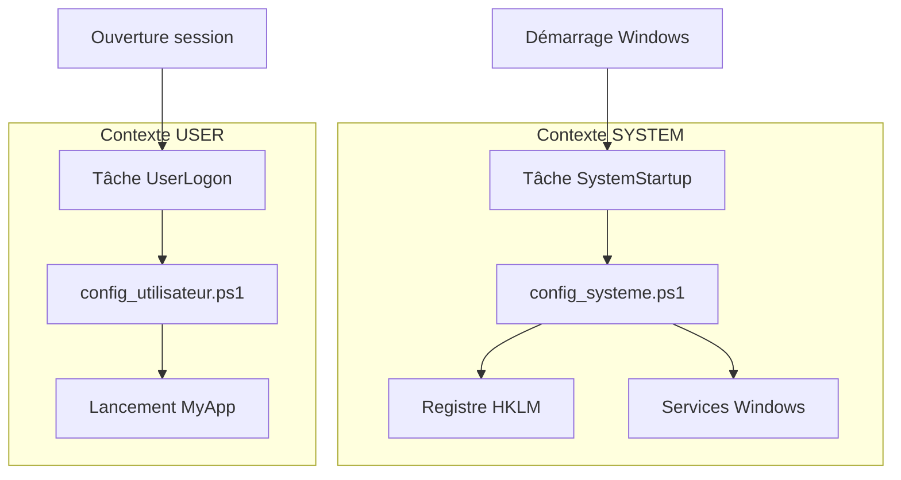

# Guide du développeur - WindowsOrchestrator 1.73

---

📘 **[Guide utilisateur](GUIDE_UTILISATEUR.md)**
*Destiné aux administrateurs système et techniciens de déploiement.*
Contient les procédures pas-à-pas, les captures d'écran de l'assistant et les guides de dépannage.

🏠 **[Retour à l'accueil](README.md)**
*Retour au portail de la documentation française.*

---

## Table des matières

1. [Préambule technique et périmètre du projet](#1-préambule-technique-et-périmètre-du-projet)
    1.1. [Nature "non-installable" et philosophie de portabilité](#11-nature-non-installable-et-philosophie-de-portabilité)
    1.2. [Avis de non-responsabilité technique (*technical disclaimer*)](#12-avis-de-non-responsabilité-technique-technical-disclaimer)
    1.3. [Conventions de nommage et terminologie](#13-conventions-de-nommage-et-terminologie)
2. [Architecture système et modèle de sécurité](#2-architecture-système-et-modèle-de-sécurité)
    2.1. [Le modèle de séparation des privilèges](#21-le-modèle-de-séparation-des-privilèges)
        2.1.1. [Le contexte SYSTEM (config_systeme.ps1)](#211-le-contexte-system-config_systemeps1)
        2.1.2. [Le contexte USER (config_utilisateur.ps1)](#212-le-contexte-user-config_utilisateurps1)
        2.1.3. [Diagramme de flux d'exécution](#213-diagramme-de-flux-dexécution)
    2.2. [Architecture des tâches planifiées](#22-architecture-des-tâches-planifiées)
        2.2.1. [Tâches principales (statiques)](#221-tâches-principales-statiques)
        2.2.2. [Tâches dynamiques (gérées par le runtime)](#222-tâches-dynamiques-gérées-par-le-runtime)
        2.2.3. [Analyse critique du LogonType : Interactive vs Password vs S4U](#223-analyse-critique-du-logontype--interactive-vs-password-vs-s4u)
    2.3. [Orchestration temporelle et parallélisme](#23-orchestration-temporelle-et-parallélisme)
        2.3.1. [Découplage Backup/Close](#231-découplage-backupclose)
        2.3.2. [Chronologie quotidienne type (*workflow*)](#232-chronologie-quotidienne-type-workflow)
3. [Analyse profonde du contrat de configuration (config.ini)](#3-analyse-profonde-du-contrat-de-configuration-configini)
    3.1. [Section [SystemConfig] : paramètres globaux](#31-section-systemconfig--paramètres-globaux)
        3.1.1. [SessionStartupMode : arbre de décision](#311-sessionstartupmode--arbre-de-décision)
        3.1.2. [DisableWindowsUpdate : mécanisme et transfert de responsabilité](#312-disablewindowsupdate--mécanisme-et-transfert-de-responsabilité)
        3.1.3. [OneDriveManagementMode : les 3 niveaux de gestion](#313-onedrivemanagementmode--les-3-niveaux-de-gestion)
    3.2. [Section [Process] : gestion du cycle de vie applicatif](#32-section-process--gestion-du-cycle-de-vie-applicatif)
        3.2.1. [Distinction ProcessToLaunch vs ProcessToMonitor](#321-distinction-processtolaunch-vs-processtomonitor)
        3.2.2. [LaunchConsoleMode : standard vs legacy](#322-launchconsolemode--standard-vs-legacy)
        3.2.3. [StartProcessMinimized : technique de splatting](#323-startprocessminimized--technique-de-splatting)
    3.3. [Section [DatabaseBackup] : module de sauvegarde](#33-section-databasebackup--module-de-sauvegarde)
        3.3.1. [EnableBackup : le *kill switch*](#331-enablebackup--le-kill-switch)
        3.3.2. [DatabaseKeepDays : algorithme de purge par date](#332-databasekeepdays--algorithme-de-purge-par-date)
        3.3.3. [Logique différentielle temporelle](#333-logique-différentielle-temporelle)
    3.4. [Section [Installation] : déploiement et résilience](#34-section-installation--déploiement-et-résilience)
        3.4.1. [SilentMode : chaîne d'impact](#341-silentmode--chaîne-dimpact)
        3.4.2. [AutologonDownloadUrl : résilience *link rot*](#342-autologondownloadurl--résilience-link-rot)
        3.4.3. [UseAutologonAssistant : logique conditionnelle](#343-useautologonassistant--logique-conditionnelle)
4. [Structure du code et analyse des composants](#4-structure-du-code-et-analyse-des-composants)
    4.1. [Arborescence détaillée du projet](#41-arborescence-détaillée-du-projet)
    4.2. [Le module central : WindowsOrchestratorUtils.psm1](#42-le-module-central--windowsorchestratorutilspsm1)
        4.2.1. [Fonctions d'abstraction I/O (entrée/sortie)](#421-fonctions-dabstraction-io-entréesortie)
            [Get-IniContent : parser INI manuel](#get-inicontent--parser-ini-manuel)
            [Set-IniValue : écriture sécurisée INI](#set-inivalue--écriture-sécurisée-ini)
            [Get-ConfigValue : lecture typée avec valeurs par défaut](#get-configvalue--lecture-typée-avec-valeurs-par-défaut)
        4.2.2. [Système d'internationalisation (i18n)](#422-système-dinternationalisation-i18n)
            [Stratégie de localisation (v1.73)](#stratégie-de-localisation-v173)
        4.2.3. [Système de journalisation](#423-système-de-journalisation)
            [Write-Log : écriture structurée et résiliente](#write-log--écriture-structurée-et-résiliente)
            [Add-Action / Add-Error : agrégateurs](#add-action--add-error--agrégateurs)
            [Invoke-LogFileRotation : gestion des archives](#invoke-logfilerotation--gestion-des-archives)
        4.2.4. [Start-OrchestratorProcess : moteur de lancement unifié](#424-start-orchestratorprocess--moteur-de-lancement-unifié)
            [Algorithme de décision](#algorithme-de-décision)
            [Gestion du mode legacy et console](#gestion-du-mode-legacy-et-console)
            [Construction des paramètres (splatting)](#construction-des-paramètres-splatting)
        4.2.5. [Gestion de l'interface d'attente (*splash screen*)](#425-gestion-de-linterface-dattente-splash-screen)
        4.2.6. [Invoke-ExitLogic : gestion unifiée de sortie](#426-invoke-exitlogic--gestion-unifiée-de-sortie)
    4.3. [Les points d'entrée (*wrappers*)](#43-les-points-dentrée-wrappers)
        4.3.1. [Chaîne d'exécution installation](#431-chaîne-dexécution-installation)
        4.3.2. [Logique du lanceur Launch-Install.ps1](#432-logique-du-lanceur-launch-installps1)
    4.4. [Les scripts d'installation](#44-les-scripts-dinstallation)
        4.4.1. [firstconfig.ps1 : interface graphique dynamique](#441-firstconfigps1--interface-graphique-dynamique)
        4.4.2. [install.ps1 : moteur d'installation](#442-installps1--moteur-dinstallation)
    4.5. [Les scripts de runtime](#45-les-scripts-de-runtime)
        4.5.1. [config_systeme.ps1 (contexte SYSTEM)](#451-config_systemeps1-contexte-system)
            [Détermination de l'utilisateur cible (algorithme complet)](#détermination-de-lutilisateur-cible-algorithme-complet)
            [Autres fonctions critiques](#autres-fonctions-critiques)
        4.5.2. [config_utilisateur.ps1 (contexte USER)](#452-config_utilisateurps1-contexte-user)
    4.6. [Les modules spécialisés](#46-les-modules-spécialisés)
        4.6.1. [Invoke-DatabaseBackup.ps1 : sauvegarde autonome](#461-invoke-databasebackupps1--sauvegarde-autonome)
            [A. Mécanisme de verrouillage (*lock file*)](#a-mécanisme-de-verrouillage-lock-file)
            [B. Logique différentielle temporelle](#b-logique-différentielle-temporelle)
            [C. Gestion des fichiers appairés (SQLite)](#c-gestion-des-fichiers-appairés-sqlite)
            [D. Vérifications préalables](#d-vérifications-préalables)
        4.6.2. [Close-AppByTitle.ps1 : fermeture propre par API](#462-close-appbytitleps1--fermeture-propre-par-api)
            [Injection C# (P/Invoke) : code complet](#injection-c-pinvoke--code-complet)
            [Logique de *retry* avec *timeout*](#logique-de-retry-avec-timeout)
5. [Gestion des dépendances externes et sécurité](#5-gestion-des-dépendances-externes-et-sécurité)
    5.1. [Outil Microsoft Sysinternals Autologon](#51-outil-microsoft-sysinternals-autologon)
        5.1.1. [Mécanisme de téléchargement et sélection d'architecture](#511-mécanisme-de-téléchargement-et-sélection-darchitecture)
        5.1.2. [Sécurité des identifiants : secrets LSA](#512-sécurité-des-identifiants--secrets-lsa)
            [Processus de nettoyage des secrets LSA (désinstallation)](#processus-de-nettoyage-des-secrets-lsa-désinstallation)
    5.2. [Notifications Gotify (optionnel)](#52-notifications-gotify-optionnel)
        5.2.1. [Implémentation REST](#521-implémentation-rest)
        5.2.2. [Résilience réseau](#522-résilience-réseau)
6. [Cycle de vie et scénarios d'utilisation](#6-cycle-de-vie-et-scénarios-dutilisation)
    6.1. [Séquence d'installation complète](#61-séquence-dinstallation-complète)
        [Diagramme de séquence (Mermaid)](#diagramme-de-séquence-mermaid)
        [Étapes détaillées du flux](#étapes-détaillées-du-flux)
    6.2. [Chronologie quotidienne détaillée (*timeline*)](#62-chronologie-quotidienne-détaillée-timeline)
    6.3. [Modes de session : analyse comparative](#63-modes-de-session--analyse-comparative)
        [Tableau comparatif technique](#tableau-comparatif-technique)
        [Analyse des scénarios](#analyse-des-scénarios)
7. [Maintenance, débogage et procédures de sortie](#7-maintenance-débogage-et-procédures-de-sortie)
    7.1. [Système de journalisation](#71-système-de-journalisation)
        7.1.1. [Emplacement et format](#711-emplacement-et-format)
        7.1.2. [Politique de rotation](#712-politique-de-rotation)
        7.1.3. [Fallback automatique (sécurité)](#713-fallback-automatique-sécurité)
    7.2. [Procédures de débogage manuel](#72-procédures-de-débogage-manuel)
        7.2.1. [Débogage contexte USER](#721-débogage-contexte-user)
        7.2.2. [Débogage contexte SYSTEM (via PsExec)](#722-débogage-contexte-system-via-psexec)
        7.2.3. [Analyse des tâches planifiées](#723-analyse-des-tâches-planifiées)
    7.3. [Codes de sortie et détection d'erreurs](#73-codes-de-sortie-et-détection-derreurs)
        7.3.1. [Codes standards](#731-codes-standards)
        7.3.2. [Détection interne](#732-détection-interne)
    7.4. [Problèmes courants et solutions](#74-problèmes-courants-et-solutions)
        7.4.1. [L'application ne démarre pas](#741-lapplication-ne-démarre-pas)
        7.4.2. [Le redémarrage ne fonctionne pas](#742-le-redémarrage-ne-fonctionne-pas)
        7.4.3. [La sauvegarde échoue ("Access denied")](#743-la-sauvegarde-échoue-access-denied)
        7.4.4. [Le splash screen reste bloqué (mode silencieux)](#744-le-splash-screen-reste-bloqué-mode-silencieux)
8. [Annexes](#8-annexes)
    8.1. [Licence](#81-licence)
    8.2. [Glossaire technique complet](#82-glossaire-technique-complet)
    8.3. [Standards de développement](#83-standards-de-développement)
        8.3.1. [Convention des chemins relatifs](#831-convention-des-chemins-relatifs)
        8.3.2. [Convention de formatage (i18n)](#832-convention-de-formatage-i18n)
        8.3.3. [Gestion des erreurs](#833-gestion-des-erreurs)
    8.4. [Crédits](#84-crédits)
    8.5. [Commandes PowerShell de diagnostic rapide](#85-commandes-powershell-de-diagnostic-rapide)

## 1. Préambule technique et périmètre du projet

### 1.1. Nature "non-installable" et philosophie de portabilité

L'architecture de WindowsOrchestrator a été conçue pour s'affranchir des contraintes des installations logicielles traditionnelles (MSI, EXE, AppX). Il adopte le paradigme de l'**application portable**.

*   **Absence d'empreinte dans les répertoires système** :
    *   Le projet ne déploie aucun fichier dans `%PROGRAMFILES%` (`C:\Program Files`), `%PROGRAMDATA%` ou `%APPDATA%`.
    *   Il ne crée pas de clés de registre pour se référencer dans "Ajout/Suppression de programmes".
    *   L'intégralité du code, de la configuration et des journaux réside dans le dossier d'extraction initial.

*   **Résolution dynamique des chemins (chemins relatifs)** :
    *   Pour garantir cette portabilité, l'usage de chemins absolus (ex : `C:\WindowsOrchestrator\...`) est strictement interdit dans le code source.
    *   **PowerShell** : tous les scripts utilisent la variable automatique `$PSScriptRoot` combinée à la cmdlet `Join-Path` pour localiser les modules, les fichiers de langue et les outils.
        *   *Exemple* : `$ConfigFile = Join-Path (Split-Path $PSScriptRoot -Parent) "config.ini"`
    *   **Batch** : les scripts lanceurs (`.bat`) utilisent la variable d'expansion `%~dp0` pour identifier leur répertoire d'exécution courant.

*   **Conséquences opérationnelles** :
    *   **Déplacement** : le dossier racine peut être déplacé d'un disque `C:\` vers un volume `D:\`, une clé USB ou un partage réseau mappé sans casser le fonctionnement interne. Seules les tâches planifiées (qui contiennent des chemins absolus lors de leur création) devront être recréées via le script `install.ps1`.
    *   **Mise à jour** : la maintenance s'effectue "in-place". Pour mettre à jour l'orchestrateur, il suffit de remplacer les fichiers `.ps1` et `.psm1`. Les données utilisateur (`config.ini`) et les traces d'audit (`Logs\`) sont préservées car elles sont situées hors des dossiers de logique métier.

### 1.2. Avis de non-responsabilité technique (*technical disclaimer*)

Ce logiciel est fourni sous licence **GPLv3**, selon le principe "AS IS" (tel quel). En tant que développeur ou intégrateur, vous devez maîtriser les implications suivantes :

*   **Dépendances système critiques** :
    *   L'orchestrateur n'est pas un binaire autonome contenant ses propres librairies. C'est un moteur d'orchestration qui manipule directement les composants natifs de Windows.
    *   Il dépend de la stabilité de **WMI/CIM** (pour la surveillance des processus), du **Service Control Manager** (pour Windows Update), et de l'API **Win32** (pour la gestion des fenêtres).
    *   Un système Windows dont les sous-systèmes WMI sont corrompus ou dont les politiques de sécurité (GPO domaine) verrouillent l'accès au registre HKLM empêchera le fonctionnement de l'outil.

*   **Limites de l'idempotence et de la restauration** :
    *   La procédure de désinstallation ne fonctionne pas comme un "snapshot" ou un point de restauration système.
    *   Elle applique une logique de "Reset to defaults" : elle remet les paramètres (Windows Update, Fast Startup, OneDrive) à leurs valeurs par défaut Microsoft.
    *   *Impact* : si la machine cible avait une configuration spécifique *avant* l'installation de l'orchestrateur (ex : Windows Update déjà désactivé manuellement), la désinstallation de l'orchestrateur réactivera le service, modifiant ainsi l'état initial de la machine.

### 1.3. Conventions de nommage et terminologie

Pour assurer la cohérence entre le code source, les fichiers de configuration et cette documentation technique, une convention stricte est appliquée :

*   **`MyApp`** : ce terme générique désigne l'application métier cible que l'orchestrateur doit gérer.
    *   Il remplace toutes les références aux projets internes spécifiques (anciennement `Allv023-05`, `AllSys`, etc.).
    *   Dans le fichier `config.ini`, cela correspond à la valeur de la clé `ProcessToMonitor`.
*   **Orchestrateur** : désigne l'ensemble des scripts PowerShell, modules et tâches planifiées constituant la solution.

---

## 2. Architecture système et modèle de sécurité

La conception de WindowsOrchestrator repose sur le contournement sécurisé des limitations imposées par l'architecture de sécurité de Windows, notamment l'isolation du contexte SYSTEM.

### 2.1. Le modèle de séparation des privilèges

Pour remplir ses fonctions (configuration système ET lancement d'application graphique), l'outil ne peut pas s'appuyer sur un seul script. Il utilise deux contextes d'exécution distincts et hermétiques.

#### 2.1.1. Le contexte SYSTEM (`config_systeme.ps1`)

Ce script agit comme le "moteur bas niveau" de la solution.

*   **Identité d'exécution** : `NT AUTHORITY\SYSTEM` (aussi appelé *LocalSystem*).
*   **Mécanisme de lancement** : tâche planifiée `WindowsOrchestrator-SystemStartup`.
*   **Nécessité technique** :
    *   C'est le seul compte disposant des privilèges nécessaires pour modifier les ruches critiques du registre (`HKEY_LOCAL_MACHINE\SYSTEM`, `HKEY_LOCAL_MACHINE\SOFTWARE\Policies`).
    *   Il possède le droit de contrôler l'état des services Windows (démarrage, arrêt, désactivation) sans déclencher d'invite UAC.
    *   Il peut modifier les plans d'alimentation globaux via `powercfg.exe`.
*   **Limitations critiques (privilèges élevés sans session graphique)** :
    *   Les tâches exécutées en contexte SYSTEM disposent de tous les privilèges administratifs mais s'exécutent **sans environnement de bureau utilisateur**.
    *   **Conséquence** : ce script est invisible pour l'utilisateur. Toute tentative d'affichage d'interface graphique (`MessageBox`, formulaires) échoue ou reste invisible. Le script ne peut lancer des applications graphiques visibles que via des tâches planifiées dédiées en contexte USER.

#### 2.1.2. Le contexte USER (`config_utilisateur.ps1`)

Ce script agit comme le "moteur interactif" et gère l'expérience utilisateur.

*   **Identité d'exécution** : l'utilisateur connecté (interactif). Il peut s'agir de l'utilisateur défini pour l'Autologon ou de n'importe quel utilisateur ouvrant une session.
*   **Mécanisme de lancement** : tâche planifiée `WindowsOrchestrator-UserLogon` avec déclencheur `At Logon` et LogonType `Interactive`.
*   **Nécessité technique** :
    *   Il s'exécute **dans la session interactive de l'utilisateur connecté** (environnement de bureau actif).
    *   Contrairement au contexte SYSTEM, il a accès au bureau, aux fenêtres visibles, et aux ressources de l'utilisateur.
    *   C'est le seul contexte capable de lancer l'application métier (`MyApp`) de manière à ce qu'elle soit visible sur le bureau.
    *   Il a accès à la ruche `HKEY_CURRENT_USER` (HKCU) pour configurer les préférences utilisateur.
    *   Il a accès aux ressources réseau mappées (lecteurs Z:, Y:) et aux imprimantes de l'utilisateur, ce que le compte SYSTEM ne voit pas.
*   **Limitations** :
    *   Il ne peut pas modifier les paramètres système globaux (services, HKLM) sans élévation de privilèges (UAC), ce qui briserait l'automatisation.

#### 2.1.3. Diagramme de flux d'exécution

Le schéma ci-dessous illustre la dichotomie entre les deux contextes dès le démarrage de la machine.



---

### 2.2. Architecture des tâches planifiées

L'orchestrateur ne s'appuie pas sur des méthodes de lancement héritées et peu fiables comme le dossier "Démarrage" (*Startup folder*) ou les clés de registre `Run`. Il utilise exclusivement le **Planificateur de tâches Windows** (*Task Scheduler*), qui offre la granularité nécessaire en termes de sécurité, de contexte et de déclencheurs.

#### 2.2.1. Tâches principales (statiques)

Ces tâches constituent l'infrastructure immuable de l'orchestrateur. Elles sont créées une seule fois lors de l'exécution du script `install.ps1` et ne sont pas modifiées par la suite, sauf en cas de réinstallation.

| Nom de la tâche | Déclencheur (*trigger*) | Contexte de sécurité | Rôle technique |
| :--- | :--- | :--- | :--- |
| **`WindowsOrchestrator-SystemStartup`** | `At Startup` (au démarrage du système) | `NT AUTHORITY\SYSTEM` (RunLevel Highest) | Point d'entrée de la configuration machine. Elle s'assure que l'environnement est sécurisé (GPO, Power) avant même qu'une session utilisateur ne soit ouverte. Elle agit comme un mécanisme d'auto-réparation au *boot*. |
| **`WindowsOrchestrator-UserLogon`** | `At Logon` (à l'ouverture de session) | Utilisateur interactif (`LogonType Interactive`) | Point d'entrée de la session. Elle est responsable de l'initialisation de l'environnement utilisateur et du lancement de l'application métier (`MyApp`). |

#### 2.2.2. Tâches dynamiques (gérées par le runtime)

Contrairement aux tâches principales, ces tâches sont gérées dynamiquement par le script `config_systeme.ps1` à chaque démarrage du système.

*   **Mécanisme** : le script lit le fichier `config.ini`, vérifie si les horaires ont changé, et utilise `Register-ScheduledTask` (avec l'option `-Force`) ou `Unregister-ScheduledTask` pour mettre à jour le planificateur.
*   **Avantage** : cela permet à un administrateur de modifier l'heure de redémarrage ou de sauvegarde simplement en éditant le fichier INI, sans avoir à réexécuter l'installateur complet.

Liste des tâches dynamiques :
1.  **`WindowsOrchestrator-SystemBackup`** : déclenchée quotidiennement à l'heure définie par `ScheduledBackupTime`. Exécute `Invoke-DatabaseBackup.ps1` en contexte SYSTEM.
2.  **`WindowsOrchestrator-SystemScheduledReboot`** : déclenchée quotidiennement à l'heure définie par `ScheduledRebootTime`. Exécute `shutdown.exe`.
3.  **`WindowsOrchestrator-User-CloseApp`** : déclenchée quotidiennement à l'heure définie par `ScheduledCloseTime`. Exécute `Close-AppByTitle.ps1` dans le contexte de l'utilisateur interactif (nécessaire pour envoyer des touches à la fenêtre).

#### 2.2.3. Analyse critique du LogonType : Interactive vs Password vs S4U

Le choix du `LogonType` pour la tâche `UserLogon` est une décision d'architecture centrale de la version 1.73, qui résout les problèmes de gestion de mots de passe des versions précédentes.

| LogonType | Mot de passe requis ? | Session graphique ? | Analyse technique |
| :--- | :---: | :---: | :--- |
| **`Interactive`** | ❌ Non | ✅ Oui | **Choisi pour v1.73**. La tâche ne crée pas sa propre session ; elle s'injecte **dans** la session utilisateur au moment précis où celle-ci s'ouvre. Elle hérite du jeton d'accès (*token*) généré par le processus Winlogon (ou l'Autologon). C'est pourquoi l'orchestrateur n'a **pas** besoin de connaître le mot de passe de l'utilisateur pour lancer l'application graphique. |
| **`Password`** | ✅ Oui | ✅ Oui | Mode classique "Run whether user is logged on or not". Nécessite le stockage du mot de passe dans le *Credential Store* de Windows (moins sécurisé) et exige impérativement que le compte dispose du privilège local `SeBatchLogonRight` ("Log on as a batch job"), ce qui est souvent bloqué par les GPO de sécurité en entreprise. |
| **`S4U`** | ❌ Non | ❌ Non | "Service for User". Permet d'exécuter une tâche sous l'identité de l'utilisateur sans mot de passe, mais sans charger son profil complet et **sans accès au réseau authentifié** (Kerberos/NTLM). De plus, ce mode ne peut pas afficher d'interface graphique. Inutilisable pour `MyApp`. |

**Clarification architecturale critique** :

Le choix du LogonType `Interactive` est la pierre angulaire de l'architecture. Voici pourquoi il est **obligatoire** pour WindowsOrchestrator :

1.  **Héritage du Token de session** : lorsque la tâche se déclenche "At Logon", elle **hérite automatiquement** du jeton d'accès (*security token*) de la session utilisateur qui vient de s'ouvrir. Cela inclut :
    *   L'accès au profil utilisateur (`HKCU`, `%APPDATA%`).
    *   La visibilité du bureau (Desktop Window Manager).
    *   Les lecteurs réseau mappés (Z:, Y:, etc.).

2.  **Pas de nouvelle session** : contrairement à `Password` ou `S4U`, ce mode n'essaie pas de créer une nouvelle session. Il s'injecte dans la session existante, d'où l'absence de besoin de mot de passe.

3.  **Compatibilité applications legacy** : de nombreuses applications tierces (notamment les applications métier) vérifient qu'elles tournent dans une session interactive "réelle". Le LogonType `Interactive` satisfait ces vérifications.

**Ce que ce mode NE fait PAS** :
*   Il ne bypasse pas UAC (l'application reste en privilèges utilisateur standard).
*   Il ne fonctionne PAS si aucun utilisateur n'est connecté (la tâche attend l'ouverture de session).
*   Il ne crée pas de session virtuelle ou de terminal invisible.

### 2.3. Orchestration temporelle et parallélisme

L'orchestrateur utilise un algorithme d'inférence temporelle pour calculer automatiquement les horaires manquants, créant un flux séquentiel "Effet Domino".

#### 2.3.1. Algorithme d'Inférence temporelle

Le système calcule les horaires par priorité décroissante :
1. **Backup Time** = `ScheduledCloseTime` (si vide, inféré à fermeture + 5 minutes)
2. **Reboot Time** = `ScheduledRebootTime` (si vide, déclenché automatiquement après la sauvegarde)

Cela garantit que si l'heure de sauvegarde ou de redémarrage n'est pas définie, le système les enchaîne intelligemment sans chevauchement.

#### 2.3.2. Chronologie quotidienne type (workflow)

Voici le cycle de vie exact d'une machine gérée par l'orchestrateur, basé sur la configuration recommandée dans le Guide utilisateur.

1.  **02:55** → Déclenchement de **`WindowsOrchestrator-User-CloseApp`**
    *   **Script** : `Close-AppByTitle.ps1`.
    *   **Action** : recherche la fenêtre contenant "MyApp" (valeur par défaut) et envoie la séquence `{ESC}{ESC}x{ENTER}` (Échap x 2, 'x', Entrée). C'est un exemple adaptable selon l'application.
2.  **02:57** → Déclenchement de **`WindowsOrchestrator-SystemBackup`**
    *   **Script** : `Invoke-DatabaseBackup.ps1`.
    *   **Action** : analyse le dossier de données, identifie les fichiers modifiés dans les dernières 24 heures, et effectue une copie différentielle vers la destination sécurisée.
3.  **03:00** → Déclenchement de **`WindowsOrchestrator-SystemScheduledReboot`**
    *   **Binaire** : `shutdown.exe`.
    *   **Arguments** : `/r /t 0` (Redémarrage immédiat).
    *   **Action** : Windows initie la procédure d'arrêt.
4.  **03:01** → **Cold boot (démarrage à froid)**
    *   **Spécificité** : grâce à la désactivation du *Fast Startup* par l'orchestrateur, ce démarrage force un rechargement complet du noyau, des pilotes et du matériel, éliminant tout état mémoire résiduel (contrairement à une sortie d'hibernation).
5.  **03:02** → Déclenchement de **`WindowsOrchestrator-SystemStartup`**
    *   **Script** : `config_systeme.ps1`.
    *   **Action** : vérification de l'intégrité de la configuration (GPO Windows Update, plans d'alimentation, existence des tâches dynamiques).
6.  **03:02:30** → **Autologon** (si activé)
    *   **Action** : le sous-système Winlogon utilise les secrets LSA pour ouvrir la session utilisateur automatiquement.
7.  **03:03** → Déclenchement de **`WindowsOrchestrator-UserLogon`**
    *   **Script** : `config_utilisateur.ps1`.
    *   **Action** : détection que `MyApp` n'est pas lancé, puis démarrage de l'application via la méthode configurée (Direct, PowerShell ou Legacy).

---

## 3. Analyse profonde du contrat de configuration (`config.ini`)

Le fichier `config.ini` est le cœur de l'orchestrateur. Il ne s'agit pas d'un simple fichier de préférences, mais d'un **contrat d'état** (*state contract*) que les scripts s'engagent à appliquer à chaque exécution. Le parseur utilisé (`Get-IniContent` dans le module utils) est insensible à la casse mais sensible à la structure des sections.

### 3.1. Section `[SystemConfig]` : paramètres globaux

Cette section pilote exclusivement le comportement du script `config_systeme.ps1`, exécuté avec les privilèges `SYSTEM`.

#### 3.1.1. `SessionStartupMode` : arbre de décision

Ce paramètre détermine la stratégie d'accès au système. Le code implémente une logique de bascule stricte :

*   **`Standard`** :
    *   **Action technique** : force la valeur de registre `AutoAdminLogon` à `"0"` dans `HKLM:\SOFTWARE\Microsoft\Windows NT\CurrentVersion\Winlogon`.
    *   **Résultat** : le PC démarre sur l'écran de connexion Windows (Logon UI). L'utilisateur doit saisir son mot de passe ou utiliser Windows Hello.
    *   **Cas d'usage** : postes d'administration, serveurs nécessitant une authentification forte à chaque accès physique.

*   **`Autologon`** :
    *   **Action technique** :
        *   Force `AutoAdminLogon` à `"1"`.
        *   Définit `DefaultUserName` avec la valeur de `AutoLoginUsername` (ou l'utilisateur courant si vide lors de l'installation).
        *   Définit `DefaultDomainName` avec le nom de l'ordinateur (ou le domaine AD).
    *   **Sécurité** : notez que le mot de passe **n'est pas** géré ici. Il est géré par l'outil externe `Autologon.exe` qui injecte les crédentiels dans les secrets LSA. Le script `config_systeme.ps1` se contente d'activer le mécanisme.
    *   **Cas d'usage** : bornes interactives, écrans d'affichage, kiosques.

#### 3.1.2. `DisableWindowsUpdate` : mécanisme et transfert de responsabilité

L'orchestrateur applique une stratégie de "Défense en profondeur" pour s'assurer que Windows Update ne perturbe pas la production.

*   **Verrouillage par GPO locale (registre)** :
    *   Le script écrit `NoAutoUpdate = 1` dans `HKLM:\SOFTWARE\Policies\Microsoft\Windows\WindowsUpdate\AU`.
    *   Il écrit `NoAutoRebootWithLoggedOnUsers = 1` dans la même clé.
    *   **Pourquoi ?** Les clés `Policies` sont respectées par l'OS comme des directives d'entreprise et sont plus difficiles à outrepasser par les mécanismes d'auto-réparation de Windows que les simples clés de configuration utilisateur.

*   **Désactivation du service** :
    *   Le service `wuauserv` est passé en `StartupType = Disabled`.
    *   Le service est arrêté immédiatement via `Stop-Service -Force`.

*   **Rémanence** : à chaque démarrage, `config_systeme.ps1` vérifie et réapplique ces clés. Si une mise à jour manuelle ou un outil tiers a réactivé le service, l'orchestrateur le coupera à nouveau au prochain *boot*.

#### 3.1.3. `OneDriveManagementMode` : les 3 niveaux de gestion

Ce paramètre gère le comportement vis-à-vis du client de synchronisation Microsoft OneDrive, souvent indésirable sur des bornes autonomes.

*   **`Block` (Recommandé)** :
    *   **Action GPO** : crée la clé `DisableFileSyncNGSC = 1` dans `HKLM:\SOFTWARE\Policies\Microsoft\Windows\OneDrive`. Cela empêche l'exécutable OneDrive de se lancer, même si l'utilisateur essaie manuellement.
    *   **Nettoyage** : tente également de supprimer l'entrée de démarrage automatique dans la clé `Run` de l'utilisateur cible.
    *   **Kill** : tue tout processus `OneDrive.exe` actif.

*   **`Close`** :
    *   **Action** : se contente de tuer le processus `OneDrive.exe` s'il est détecté.
    *   **Limite** : OneDrive peut redémarrer automatiquement via ses tâches planifiées de maintenance. C'est une mesure corrective temporaire, pas une solution définitive.

*   **`Ignore`** :
    *   **Action** : supprime la clé de politique `DisableFileSyncNGSC` si elle existe, rendant le contrôle à l'utilisateur ou à l'OS.

### 3.2. Section `[Process]` : gestion du cycle de vie applicatif

Cette section pilote le comportement du script `config_utilisateur.ps1` (Contexte USER) et la fonction centrale `Start-OrchestratorProcess`.

#### 3.2.1. Distinction `ProcessToLaunch` vs `ProcessToMonitor`

C'est un concept fondamental pour l'idempotence du lanceur.

*   **`ProcessToLaunch`** : c'est le **déclencheur**.
    *   Exemple : `LaunchApp.bat`, `Start.ps1`, ou `C:\Program Files\App\Loader.exe`.
    *   C'est ce fichier que l'orchestrateur va exécuter.

*   **`ProcessToMonitor`** : c'est la **cible**.
    *   Exemple : `MyApp` (pour `MyApp.exe`) ou `java` (pour une appli Java).
    *   C'est le nom du processus chargé en mémoire RAM.

**Logique d'exécution** :
1.  Le script vérifie : "Est-ce que `ProcessToMonitor` existe dans la liste des processus ?"
2.  **Si OUI** : l'application tourne déjà. L'orchestrateur ne fait rien. Cela évite de lancer 50 instances de l'application si l'utilisateur ferme sa session et la rouvre, ou si le script est relancé manuellement.
3.  **Si NON** : l'orchestrateur exécute `ProcessToLaunch`.

Le nouveau `LaunchApp.bat` utilise `findstr` pour parser le `.ini` et `!VALUE:"=!` pour nettoyer les guillemets, permettant un lancement dynamique sans modification manuelle.

> **Note développeur** : Si `ProcessToMonitor` est laissé vide, l'orchestrateur perd sa capacité de détection et lancera `ProcessToLaunch` à chaque exécution, ce qui peut créer des doublons.

#### 3.2.2. `LaunchConsoleMode` : Standard vs Legacy

Ce paramètre résout les problèmes de compatibilité avec les différents hôtes de console Windows (conhost, Windows Terminal).

*   **`Standard`** (défaut) :
    *   Utilise `Start-Process -FilePath ...`.
    *   Laisse Windows décider de l'hôte. Sur Windows 11, cela peut ouvrir un nouvel onglet dans Windows Terminal. C'est la méthode moderne et recommandée.

*   **`Legacy`** :
    *   Construit une commande explicite : `cmd.exe /c start "Titre" "Chemin" Arguments`.
    *   **Nécessité** : certains scripts Batch `.bat` anciens (*legacy*) ou certaines applications console plantent s'ils ne sont pas exécutés dans leur propre fenêtre `conhost.exe` dédiée (l'écran noir classique). Ce mode force ce comportement.

**Exemple concret : quand utiliser Legacy ?**

Certains scripts Batch historiques sont incompatibles avec les terminaux modernes. Voici un cas typique :

**Script problématique** (`LaunchApp.bat`) :
```batch
@echo off
REM Ce script plante en mode Standard sur Windows 11
cd /d %~dp0
echo Démarrage de l'application...

REM Lance l'app dans un nouveau processus détaché
start "" "MyApp.exe" -config production.ini

REM Attend 5 secondes pour vérifier le démarrage
timeout /t 5 /nobreak > nul

REM Vérifie si le processus tourne
tasklist | find /i "MyApp.exe" > nul
if errorlevel 1 (
    echo ERREUR: L'application ne s'est pas lancée!
    pause
    exit /b 1
)

echo Application démarrée avec succès.
exit /b 0
```

**Symptômes en mode Standard** :

*   Sur Windows 11 avec Windows Terminal, le script s'exécute dans un onglet partagé.
*   La commande `start ""` tente de créer une fenêtre mais échoue silencieusement.
*   `MyApp.exe` ne démarre jamais.
*   Le script attend 5 secondes puis affiche "ERREUR".

**Solution** : activer le mode Legacy dans `config.ini`.

```ini
[Process]
LaunchConsoleMode=Legacy
```

**Ce qui se passe alors** :

```powershell
# Au lieu de :
Start-Process -FilePath "LaunchApp.bat"

# L'orchestrateur exécute :
cmd.exe /c start "WindowsOrchestrator Launch" "C:\Path\To\LaunchApp.bat"
```

Cela force l'ouverture d'une **nouvelle fenêtre `conhost.exe` dédiée**, isolée du processus PowerShell, dans laquelle le Batch s'exécute correctement.

**Quand NE PAS utiliser Legacy** :

*   Scripts PowerShell (`.ps1`) → Toujours Standard.
*   Exécutables directs (`.exe`) → Toujours Standard.
*   Scripts Batch modernes sans `start` → Standard fonctionne.

#### 3.2.3. `StartProcessMinimized` : technique de splatting

L'option permet de lancer l'application réduite dans la barre des tâches (utile pour des applications de fond qui ont une GUI mais ne doivent pas gêner).

Le code utilise la technique du **Splatting** PowerShell pour appliquer ce paramètre conditionnellement :

```powershell
# Construction dynamique des paramètres
$startParams = @{
    FilePath = $exePath
    ArgumentList = $args
}

if ($StartProcessMinimized) {
    # On ajoute la clé WindowStyle uniquement si demandé
    $startParams.Add("WindowStyle", "Minimized")
}

# Exécution propre
Start-Process @startParams
```

---

## 3. Analyse profonde du contrat de configuration (`config.ini`) (suite)

### 3.3. Section `[DatabaseBackup]` : module de sauvegarde

Cette section contrôle le comportement du script `Invoke-DatabaseBackup.ps1`. La logique de sauvegarde a été conçue pour être **atomique** et **résiliente**.

#### 3.3.1. `EnableBackup` : le *kill switch*

Cette variable booléenne agit comme un disjoncteur principal.
*   **Mécanisme** : elle est vérifiée à la toute première ligne logique de la fonction principale du script de sauvegarde.
*   **Comportement** :
    *   Si `false` : le script journalise "Backup disabled" et retourne immédiatement un code de succès (0) sans effectuer aucune opération disque ou réseau.
    *   Si `true` : le script procède à l'initialisation des variables de chemin (`Source`, `Destination`) et lance les vérifications de prérequis.

#### 3.3.2. `DatabaseKeepDays` : algorithme de purge par date

La gestion de la rétention ne se base pas sur les métadonnées de fichier (date de création/modification du fichier de sauvegarde), qui peuvent être altérées lors de copies, mais sur une convention de nommage stricte.

*   **Format de nommage** : les fichiers générés par l'orchestrateur suivent le modèle : `YYYYMMDD_HHMMSS_NomOriginal.ext`.
*   **Algorithme** :
    1.  Le script liste les fichiers dans `DatabaseDestinationPath`.
    2.  Il applique une regex `^(\d{8})_` pour extraire les 8 premiers chiffres (la date).
    3.  Il convertit cette chaîne en objet `DateTime`.
    4.  Si `DateFichier < (DateDuJour - DatabaseKeepDays)`, le fichier est supprimé via `Remove-Item -Force`.

#### 3.3.3. Logique différentielle temporelle

Pour éviter de saturer le disque et le réseau avec des copies inutiles (surtout pour les bases de données volumineuses de plusieurs Go), le script n'effectue pas de sauvegarde complète systématique.

*   **Le filtre** : `LastWriteTime > (Get-Date).AddHours(-24)`
*   **Fonctionnement** :
    *   Le script scanne récursivement le dossier source.
    *   Il ne retient que les fichiers dont l'horodatage de dernière modification est inférieur à 24 heures.
    *   **Conséquence** : l'orchestrateur effectue une sauvegarde **différentielle journalière** basée sur le temps. Il ne compare pas les hachages (MD5/SHA) pour des raisons de performance.
*   **Intégrité des paires (SQLite)** : une exception à cette règle existe pour les fichiers `.db`. Si un fichier `.db` est qualifié pour la sauvegarde, le script force l'inclusion de ses fichiers compagnons `.db-wal` et `.db-shm` (même s'ils sont plus vieux), garantissant l'intégrité transactionnelle de la copie.

### 3.4. Section `[Installation]` : déploiement et résilience

Ces paramètres influencent exclusivement le comportement des scripts `install.ps1`, `uninstall.ps1` et de leurs lanceurs.

#### 3.4.1. `SilentMode` : chaîne d'impact

Le mode silencieux n'est pas une simple option de `install.ps1`. C'est une chaîne de décisions qui remonte jusqu'au lanceur.

1.  **Détection** : le *wrapper* `Launch-Install.ps1` (ou `Launch-Uninstall.ps1`) lit cette valeur dans le fichier INI via une expression régulière légère, avant même de charger PowerShell complètement.
2.  **Masquage** : si `true`, le *wrapper* lance le script principal avec l'argument `-WindowStyle Hidden`.
3.  **Compensation (feedback)** : le script principal (`install.ps1`) détecte qu'il tourne en mode caché. Pour ne pas laisser l'utilisateur dans le doute ("Est-ce que ça a marché ?"), il lance immédiatement la fonction `Start-WaitingUI` qui affiche le *splash screen* WinForms (barre de progression indéterminée).
4.  **Clôture** : en fin d'exécution, le script utilise un appel P/Invoke complexe (voir section 4.2.5) pour forcer l'affichage d'une `MessageBox` au premier plan, confirmant le succès ou l'échec.

#### 3.4.2. `AutologonDownloadUrl` : résilience *link rot*

Pour éviter que l'orchestrateur ne devienne obsolète si Microsoft change ses URL, le lien de téléchargement de l'outil Sysinternals n'est pas codé en dur (*hardcoded*) dans le script `.ps1`.

*   **Principe** : l'URL est stockée dans `config.ini`.
*   **Avantage** : si le lien casse (*link rot*), un administrateur peut le corriger en éditant simplement le fichier texte, sans avoir à modifier le code source ni à briser la signature numérique des scripts.

#### 3.4.3. `UseAutologonAssistant` : logique conditionnelle

L'assistant de configuration Autologon (téléchargement + GUI) ne se lance que si **deux** conditions sont réunies (opérateur `AND`) :
1.  `SessionStartupMode` est réglé sur `Autologon`.
2.  `UseAutologonAssistant` est réglé sur `true`.

Cela permet aux administrateurs experts de configurer l'Autologon manuellement (ou via une image maître) tout en utilisant l'orchestrateur pour le reste, sans être interrompus par l'assistant.

---

## 4. Structure du code et analyse des composants

### 4.1. Arborescence détaillée du projet

La structure des dossiers a été pensée pour séparer clairement les responsabilités : ce qui est exécutable par l'utilisateur, ce qui est interne, et ce qui est dynamique.

```text
/ (Racine du projet)
│
├── config.ini                     # [GÉNÉRÉ] Fichier de configuration maître (créé post-install).
├── Install.bat                    # [USER] Point d'entrée pour l'installation (lanceur).
├── Uninstall.bat                  # [USER] Point d'entrée pour la désinstallation (lanceur).
│
├── management/                    # [CORE] Cœur technique (logique métier). Ne pas modifier.
│   ├── modules/
│   │   └── WindowsOrchestratorUtils/
│   │       └── WindowsOrchestratorUtils.psm1  # Bibliothèque de fonctions centrale (DRY).
│   │
│   ├── defaults/
│   │   └── default_config.ini     # [REF] Modèle de configuration (fallback si config.ini absent).
│   │
│   ├── tools/                     # [BIN] Dossier pour binaires tiers.
│   │   └── Autologon/             # (Généré dynamiquement lors du téléchargement).
│   │
│   ├── firstconfig.ps1            # Assistant GUI (WinForms) pour la première config.
│   ├── install.ps1                # Moteur d'installation (logique principale).
│   ├── uninstall.ps1              # Moteur de désinstallation (logique principale).
│   ├── Launch-Install.ps1         # Wrapper d'élévation UAC pour l'install.
│   ├── Launch-Uninstall.ps1       # Wrapper d'élévation UAC pour l'uninstall.
│   │
│   ├── config_systeme.ps1         # Runtime SYSTEM (exécuté par tâche SystemStartup).
│   ├── config_utilisateur.ps1     # Runtime USER (exécuté par tâche UserLogon).
│   ├── Invoke-DatabaseBackup.ps1  # Runtime backup (exécuté par tâche SystemBackup).
│   └── Close-AppByTitle.ps1       # Utilitaire de fermeture (SendKeys).
│
├── i18n/                          # [LOC] Fichiers de localisation.
│   ├── en-US/strings.psd1
│   ├── fr-FR/strings.psd1
│   └── [CodeCulture]/strings.psd1 # Architecture extensible.
│
└── Logs/                          # [DATA] Journaux d'exécution (générés au runtime).
    ├── config_systeme_ps_log.txt
    ├── config_systeme_ps.1.txt    # Archives de rotation.
    ├── config_utilisateur_ps_log.txt
    └── ...
```

### 4.2. Le module central : `WindowsOrchestratorUtils.psm1`

Ce fichier `.psm1` est chargé (`Import-Module`) par **tous** les scripts du projet. Il centralise le code pour respecter le principe DRY (*Don't Repeat Yourself*) et garantir un comportement uniforme.

#### 4.2.1. Fonctions d'abstraction I/O (entrée/sortie)

##### `Get-IniContent` : parser INI manuel
PowerShell ne dispose pas de cmdlet native pour lire les fichiers INI de manière structurée. Cette fonction implémente un *parser* léger.
*   **Méthode** : lecture ligne par ligne (`Get-Content`).
*   **Logique** :
    *   Détecte les sections via regex `^\[(.+)\]$`.
    *   Détecte les paires Clé=Valeur via regex `^([^=]+)=(.*)$`.
*   **Retour** : une *hashtable* imbriquée `@{ Section = @{ Key = Value } }` permettant un accès direct comme `$config['SystemConfig']['DisableFastStartup']`.

##### `Set-IniValue` : écriture sécurisée INI
Écrire dans un fichier INI sans casser la structure ou supprimer les commentaires est complexe.
*   **Logique** :
    1.  Charge le fichier en mémoire.
    2.  Parcourt les lignes pour trouver la section cible.
    3.  Si la section existe : cherche la clé. Si la clé existe, met à jour la valeur. Sinon, insère la clé à la fin de la section.
    4.  Si la section n'existe pas : crée la section et la clé à la fin du fichier.
*   **Encodage** : force l'UTF-8 pour supporter les caractères accentués dans les chemins ou les commentaires.

##### `Get-ConfigValue` : lecture typée avec valeurs par défaut
C'est la fonction la plus utilisée dans le code. Elle sécurise la lecture de la configuration.
*   **Signature** : `Get-ConfigValue -Section "S" -Key "K" -Type ([type]) -DefaultValue $val`
*   **Robustesse** :
    *   Si la clé n'existe pas : retourne `DefaultValue`.
    *   Si la clé existe mais est vide : retourne `DefaultValue` (ou `$false` pour un booléen).
    *   Si la conversion de type échoue (ex : texte "abc" pour un type `[int]`) : logue une erreur non-bloquante et retourne `DefaultValue`.

#### 4.2.2. Système d'internationalisation (i18n)

L'orchestrateur est conçu pour être multilingue dès sa conception. Il n'y a aucune chaîne de texte utilisateur codée en dur (*hardcoded*) dans les scripts logiques.

*   **`Set-OrchestratorLanguage`** : c'est la fonction d'initialisation appelée au début de chaque script.
    1.  **Détection** : elle interroge la culture du système hôte via `(Get-Culture).Name` (ex : `fr-FR`).
    2.  **Chargement** : elle tente de charger le fichier de dictionnaire correspondant : `i18n\fr-FR\strings.psd1`.
    3.  **Fallback (sécurité)** : si le fichier spécifique n'existe pas (ex : système en `es-ES` mais pas de traduction espagnole), elle charge automatiquement `i18n\en-US\strings.psd1`.
    4.  **Validation** : si le chargement échoue totalement (fichier corrompu), elle lève une exception bloquante pour éviter d'afficher des interfaces vides.

*   **Structure des fichiers `.psd1`** :
    Ce sont des *hashtables* PowerShell standards.
    ```powershell
    @{
        Install_Welcome = "Bienvenue dans l'installation"
        Log_Error = "Erreur critique : {0}"
    }
    ```

*   **Utilisation dans le code** :
    Les scripts utilisent la substitution de chaînes .NET :
    ```powershell
    # Injection des arguments dans le template
    $msg = $lang.Log_Error -f $ErrorDetails
    ```

#### 4.2.3. Système de journalisation

Le système de *logs* est critique pour le diagnostic *post-mortem*, car les scripts s'exécutent souvent de manière invisible.

##### `Write-Log` : écriture structurée et résiliente
Cette fonction ne se contente pas d'écrire dans un fichier texte. Elle implémente une logique de survie.

1.  **Formatage** : chaque ligne est préfixée par un horodatage ISO-like et un niveau de sévérité.
    `YYYY-MM-DD HH:MM:SS [INFO] - Message`
2.  **Cible principale** : écriture dans le fichier défini par `$Global:LogFile` (dans le dossier `Logs/`).
3.  **Fallback de secours (*fail-safe*)** :
    *   Si l'écriture dans le dossier `Logs/` échoue (disque plein, dossier supprimé, permissions NTFS cassées), la fonction tente d'écrire dans `C:\ProgramData\StartupScriptLogs\*_FATAL_LOG_ERROR.txt`.
    *   Ce dossier système est généralement accessible en écriture pour les services et administrateurs, garantissant qu'une trace de l'erreur fatale soit conservée même si l'environnement de l'application est corrompu.

##### `Add-Action` / `Add-Error` : agrégateurs
Ces fonctions encapsulent `Write-Log` mais ajoutent une fonctionnalité de mémorisation.
*   Elles stockent les messages dans des listes globales en mémoire (`$Global:ActionsEffectuees`, `$Global:ErreursRencontrees`).
*   **Usage** : ces listes sont utilisées en fin de script pour :
    1.  Déterminer le code de sortie (Exit Code 1 s'il y a des erreurs).
    2.  Construire le corps du message de notification **Gotify** (résumé des actions).

##### `Invoke-LogFileRotation` : gestion des archives
Pour éviter que les fichiers journaux ne saturent le disque sur la durée (surtout pour des bornes fonctionnant des années).
*   **Algorithme** : décalage d'index.
    `log.txt` → `log.1.txt` → `log.2.txt` ... → `log.N.txt`.
*   **Nettoyage** : si le nombre de fichiers dépasse `MaxSystemLogsToKeep` (défini dans `config.ini`), les plus anciens sont supprimés définitivement.

#### 4.2.4. `Start-OrchestratorProcess` : moteur de lancement unifié

Cette fonction est le "couteau suisse" du lancement applicatif. Elle abstrait la complexité liée aux différents types d'exécutables Windows.

##### Algorithme de décision
La fonction analyse le fichier cible (`ProcessToLaunch`) et détermine la méthode d'invocation optimale :

1.  **Résolution de chemin** : si le chemin est relatif (ex : `..\App\bin\start.bat`), il est converti en chemin absolu par rapport à la racine du script.
2.  **Expansion des variables** : les variables d'environnement Windows (ex : `%APPDATA%`, `%ProgramFiles%`) sont résolues.
3.  **Détection du type** :
    *   **`.ps1`** : exécuté via `powershell.exe -ExecutionPolicy Bypass -File ...`.
    *   **`.bat` / `.cmd`** : exécuté via `cmd.exe /c "..."`.
    *   **`.exe` (et autres)** : exécuté directement.

##### Gestion du mode legacy et console
*   Si `LaunchConsoleMode` est réglé sur `Legacy` **ET** que le fichier est un Batch, la fonction change de stratégie :
    *   Elle utilise `cmd.exe /c start "Titre" ...`.
    *   Ceci force l'ouverture d'une nouvelle fenêtre de console (conhost), indispensable pour les scripts hérités qui ne supportent pas d'être attachés à un processus parent PowerShell.

##### Construction des paramètres (*splatting*)
La fonction construit dynamiquement une *hashtable* pour `Start-Process`.
```powershell
$startProcessSplat = @{
    FilePath = ...
    ArgumentList = ...
    WorkingDirectory = ... # Déduit du chemin du fichier ou racine projet
}

# Gestion du mode minimisé
if ($launchMinimized) {
    $startProcessSplat.Add("WindowStyle", "Minimized")
}
```

Les arguments métier (`tb 00 W`) sont désormais portés par le Launcher Batch dynamique, éliminant les modifications manuelles.

#### 4.2.5. Gestion de l'interface d'attente (*splash screen*)

En mode silencieux (`SilentMode=true`), la console PowerShell est masquée. Pour éviter que l'utilisateur ne pense que l'installation a planté, l'orchestrateur affiche une interface graphique minimale (*splash screen*) via WinForms.

**A. Le *splash screen* (`Start-WaitingUI`)**

Lancer un script GUI depuis un autre script PowerShell sans dépendance de fichier externe est complexe.
*   **Problème** : passer un bloc de code complexe via `-Command` est sujet aux erreurs d'échappement.
*   **Solution** : le code du *splash screen* est encapsulé dans une chaîne, encodé en **Base64**, puis passé à un nouveau processus `powershell.exe` via `-EncodedCommand`.

**B. Le correctif "parent fantôme" (MessageBox P/Invoke)**

En mode silencieux ou contexte SYSTEM, une `MessageBox` standard peut s'ouvrir en arrière-plan. Pour forcer l'affichage au premier plan, l'orchestrateur utilise une injection de code C# (P/Invoke) pour manipuler l'API Windows.

**Implémentation technique :**

```powershell
# Injection du code C# pour manipuler les fenêtres
Add-Type @"
using System;
using System.Runtime.InteropServices;

public class MessageBoxFixer {
    [DllImport("user32.dll")]
    public static extern bool SetForegroundWindow(IntPtr hWnd);

    [DllImport("user32.dll")]
    public static extern IntPtr GetForegroundWindow();

    [DllImport("user32.dll", SetLastError = true)]
    public static extern uint GetWindowThreadProcessId(IntPtr hWnd, out uint lpdwProcessId);

    [DllImport("user32.dll")]
    public static extern bool AttachThreadInput(uint idAttach, uint idAttachTo, bool fAttach);

    [DllImport("kernel32.dll")]
    public static extern uint GetCurrentThreadId();

    [DllImport("user32.dll")]
    public static extern bool ShowWindow(IntPtr hWnd, int nCmdShow);

    public const int SW_RESTORE = 9;

    public static void ForceForeground() {
        uint currentThread = GetCurrentThreadId();
        uint lpdwProcessId = 0;
        uint foregroundThread = GetWindowThreadProcessId(GetForegroundWindow(), out lpdwProcessId);
        IntPtr targetHwnd = GetForegroundWindow();

        if (targetHwnd != IntPtr.Zero && currentThread != foregroundThread) {
            AttachThreadInput(currentThread, foregroundThread, true);
            ShowWindow(targetHwnd, SW_RESTORE);
            SetForegroundWindow(targetHwnd);
            AttachThreadInput(currentThread, foregroundThread, false);
        }
    }
}
"@

# Création de la Form fantôme
$ghostParent = New-Object System.Windows.Forms.Form
$ghostParent.TopMost = $true
$ghostParent.TopLevel = $true
$ghostParent.ShowInTaskbar = $false
$ghostParent.Opacity = 0
$ghostParent.StartPosition = "CenterScreen"
$ghostParent.Size = New-Object System.Drawing.Size(1, 1)

# Forcer le focus avant affichage
$ghostParent.Show()
$ghostParent.Activate()
[MessageBoxFixer]::ForceForeground()

# Afficher la MessageBox attachée à la Form fantôme
$result = [System.Windows.Forms.MessageBox]::Show(
    $ghostParent,
    $message,
    "WindowsOrchestrator - Installation",
    [System.Windows.Forms.MessageBoxButtons]::OK,
    $icon
)

# Nettoyage
$ghostParent.Close()
$ghostParent.Dispose()
```

**Pourquoi cette technique fonctionne** :

*   `AttachThreadInput` lie temporairement le *thread* PowerShell au *thread* de la fenêtre active.
*   Cela donne au script le "droit" de voler le focus via `SetForegroundWindow`.
*   La *Form* `TopMost` force ensuite la MessageBox au premier plan.
*   L'attachement est détaché immédiatement après pour ne pas perturber le système.

#### 4.2.6. `Invoke-ExitLogic` : gestion unifiée de sortie

Plutôt que de dupliquer la logique de fin de script dans `install.ps1` et `uninstall.ps1`, cette fonction centralise la décision de "l'après-exécution".

**Arbre de décision :**

1.  **Vérification du redémarrage** :
    *   Elle lit la clé `RebootOnCompletion` dans l'objet de configuration.
    *   **Si true** : elle affiche un avertissement et lance `shutdown.exe -r -t $RebootGracePeriod` (délai configurable, défaut 15s).

2.  **Gestion de la fermeture (si pas de reboot)** :
    *   Elle lit la clé `PowerShellExitMode`.
    *   **Mode `automatic`** : affiche un compte à rebours ("Cette fenêtre se fermera dans X secondes...") puis termine le processus. Utile pour les déploiements automatisés où l'on ne veut pas laisser de fenêtres ouvertes.
    *   **Mode `manual`** (défaut) : exécute `Read-Host` ("Appuyez sur Entrée..."). Permet à l'utilisateur de lire les journaux à l'écran avant de quitter.

---

### 4.5. Les scripts de runtime

#### 4.5.1. `config_systeme.ps1` (contexte SYSTEM)

Ce script s'assure que la machine est dans l'état souhaité à chaque démarrage (*State enforcement*).

##### Détermination de l'utilisateur cible (algorithme complet)

La logique de sélection du compte cible suit une cascade de priorité stricte pour gérer les cas d'installation manuelle ou automatisée.

**Implémentation technique :**

```powershell
function Get-TargetUsername {
    param([hashtable]$Config)

    # 1. Lecture explicite dans config.ini
    $configUsername = Get-ConfigValue -Section "SystemConfig" -Key "AutoLoginUsername"

    if (-not [string]::IsNullOrWhiteSpace($configUsername)) {
        Write-Log "Using AutoLoginUsername from config.ini: '$configUsername'."
        return $configUsername
    }

    Write-Log "AutoLoginUsername empty. Checking Registry..."

    # 2. Lecture dans le Registre Winlogon (configuration existante)
    try {
        $winlogonPath = "HKLM:\SOFTWARE\Microsoft\Windows NT\CurrentVersion\Winlogon"
        $regUsername = (Get-ItemProperty -Path $winlogonPath -Name "DefaultUserName" -ErrorAction Stop).DefaultUserName

        if (-not [string]::IsNullOrWhiteSpace($regUsername)) {
            Write-Log "Using Registry DefaultUserName: '$regUsername'."
            return $regUsername
        }
    } catch {
        Write-Log "Registry DefaultUserName not found."
    }

    Write-Log "WARNING: No target user defined."
    return $null
}
```

##### Autres fonctions critiques
*   **Vérification réseau (Gotify)** : boucle de 3 tentatives pour attendre la montée de la pile réseau avant d'envoyer une notification.
*   **Gestion Windows Update (GPO)** : recrée la clé de registre `HKLM:\SOFTWARE\Policies\...\AU` si elle a été supprimée.
*   **Tâches dynamiques** : crée ou supprime les tâches de sauvegarde et de redémarrage à la volée selon `config.ini`.

#### 4.5.2. `config_utilisateur.ps1` (contexte USER)

Ce script gère l'expérience utilisateur et le lancement applicatif.

*   **Mécanisme "single-shot" (pas de *watchdog*)** :
    Le script vérifie si `ProcessToMonitor` (ex : `MyApp`) est en cours d'exécution.
    *   Si **Oui** : il journalise "Already running" et se termine immédiatement (`Exit 0`).
    *   Si **Non** : il lance l'application.
    *   *Raison* : l'orchestrateur n'est pas un superviseur de service. Il ne doit pas relancer l'application si l'utilisateur la ferme volontairement pour maintenance.

*   **Expansion des chemins** :
    Il supporte les variables d'environnement (`%APPDATA%`) et résout les chemins relatifs (`..\MyApp\run.exe`) en chemins absolus.

*   **Création de la tâche de fermeture utilisateur** :
    C'est ce script (tournant en contexte utilisateur) qui crée la tâche planifiée `WindowsOrchestrator-User-CloseApp`.
    *   *Pourquoi ?* Pour que la tâche appartienne à l'utilisateur et s'exécute dans sa session interactive, condition *sine qua non* pour pouvoir envoyer des touches (`SendKeys`) à la fenêtre de l'application.

    > **⚠️ Avertissement : dépendance aux valeurs par défaut**
    > Dans la version actuelle du code, la tâche planifiée `WindowsOrchestrator-User-CloseApp` est créée **sans arguments** dynamiques.
    > *   **Conséquence** : le script `Close-AppByTitle.ps1` s'exécutera avec ses valeurs par défaut codées en dur (`$WindowTitle = "MyApp"` et `$KeysToSend = "{ESC}{ESC}x{ENTER}"`).
    > *   **Impact** : si votre application ne s'appelle pas "MyApp" ou ne se ferme pas avec cette séquence de touches, la fermeture automatique échouera, même si vous changez `config.ini`, tant que le script `config_utilisateur.ps1` n'est pas modifié pour passer ces arguments.

---

### 4.6. Les modules spécialisés

Ces scripts exécutent des tâches spécifiques et critiques : la sauvegarde des données et la fermeture propre de l'application. Ils sont appelés par les tâches planifiées dynamiques.

#### 4.6.1. `Invoke-DatabaseBackup.ps1` : sauvegarde autonome

Ce script est conçu pour être robuste face aux pannes et efficace sur les gros volumes de données.

##### A. Mécanisme de verrouillage (*lock file*)
Pour éviter que deux sauvegardes ne se lancent simultanément (ex : si la précédente est très lente ou bloquée), le script implémente un mécanisme de sémaphore fichier.
1.  Vérifie l'existence de `.backup_running.lock` dans le dossier de destination.
2.  **Sécurité anti-blocage** : il vérifie l'âge du fichier *lock*. S'il a plus de 60 minutes (valeur arbitraire considérant un crash probable du script précédent), il supprime le *lock* et force l'exécution.
3.  Crée le fichier *lock*.
4.  Exécute la sauvegarde.
5.  Supprime le fichier *lock* dans le bloc `Finally`.

##### B. Logique différentielle temporelle
Il n'utilise pas le bit d'archive (peu fiable) ni le hachage MD5 (trop lent pour des Go de données).
*   **Filtre** : `Where-Object { $_.LastWriteTime -gt (Get-Date).AddHours(-24) }`
*   **Résultat** : seuls les fichiers modifiés depuis la veille sont copiés.

##### C. Gestion des fichiers appairés (logique *basename*)
Le script assure l'intégrité des groupes de fichiers (ex : *shapefiles* `.shp/.shx/.dbf` ou SQLite `.db/.wal`).
*   **Algorithme** :
    1.  Identifie les fichiers modifiés < 24h.
    2.  Extrait leur "nom de base" (nom de fichier sans extension).
    3.  Force la sauvegarde de **tous** les fichiers du dossier source partageant ce nom de base exact, quelle que soit leur extension ou leur date de modification.

##### D. Boucle Watchdog et MonitorTimeout
Le système utilise une boucle While pour surveiller la fermeture de l'application :
```powershell
$timeout = Get-Date).AddSeconds($MonitorTimeout)
while ((Get-Date) -lt $timeout) {
    if (-not (Get-Process -Name $ProcessToMonitor -ErrorAction SilentlyContinue)) {
        break
    }
    Start-Sleep -Seconds 5
}
```
Si l'application reste bloquée après le timeout, la sauvegarde peut être annulée pour éviter les corruptions.

##### D. Vérifications préalables
*   **Test d'écriture** : tente de créer/supprimer un fichier temporaire sur la destination pour valider les permissions NTFS/réseau avant de commencer.
*   **Espace disque** : calcule la taille totale requise et la compare à l'espace libre du lecteur de destination. Lève une exception explicite si l'espace est insuffisant.

---

#### 4.6.2. `Close-AppByTitle.ps1` : fermeture propre par API

Contrairement à un brutal `Stop-Process` (*kill*), ce script tente une fermeture "douce" en simulant une interaction humaine via l'envoi de touches. PowerShell ne possédant pas de commandes natives pour lister les fenêtres ou gérer le focus de manière fiable, le script utilise une injection de code C# (P/Invoke).

##### Injection C# (P/Invoke) et classe `WindowInteraction`

Le script compile à la volée une classe nommée `WindowInteraction` pour accéder aux fonctions de `user32.dll`. Contrairement aux versions précédentes, cette classe inclut la gestion de l'état "minimisé" (`IsIconic`) pour restaurer la fenêtre avant d'interagir.

```powershell
$code = @"
using System;
using System.Text;
using System.Runtime.InteropServices;
public class WindowInteraction {
    public delegate bool EnumWindowsProc(IntPtr hWnd, IntPtr lParam);
    [DllImport("user32.dll")] public static extern bool EnumWindows(EnumWindowsProc lpEnumFunc, IntPtr lParam);
    [DllImport("user32.dll")] public static extern bool IsWindowVisible(IntPtr hWnd);
    [DllImport("user32.dll", CharSet = CharSet.Unicode)] public static extern int GetWindowText(IntPtr hWnd, StringBuilder lpString, int nMaxCount);
    [DllImport("user32.dll")] public static extern bool SetForegroundWindow(IntPtr hWnd);
    [DllImport("user32.dll")] public static extern bool ShowWindow(IntPtr hWnd, int nCmdShow);
    [DllImport("user32.dll")] public static extern bool IsIconic(IntPtr hWnd);
    public const int SW_RESTORE = 9;
}
"@
```

##### Algorithme de recherche et normalisation

Le script ne se contente pas de comparer les chaînes brutes. Il applique une **normalisation** pour gérer les caractères invisibles (comme l'espace insécable `U+00A0`) souvent présents dans les titres de fenêtres d'applications héritées ou mal encodées.

```powershell
$enumWindowsCallback = {
    param($hWnd, $lParam)

    if ([WindowInteraction]::IsWindowVisible($hWnd)) {
        $sb = New-Object System.Text.StringBuilder 256
        [WindowInteraction]::GetWindowText($hWnd, $sb, $sb.Capacity) | Out-Null

        # Nettoyage : remplacement des espaces insécables et suppression des doubles espaces
        $cleanedTitle = $sb.ToString().Replace([char]0x00A0, ' ').Replace('  ', ' ').Trim()

        if ($cleanedTitle -like "*$($WindowTitle)*") {
            $script:foundWindowHandle = $hWnd
            return $false  # Fenêtre trouvée, arrêt de l'énumération
        }
    }
    return $true
}
```

##### Séquence d'activation et d'envoi de touches

Une fois la fenêtre trouvée, le script exécute une séquence stricte pour garantir que les touches sont reçues par la bonne application :

1.  **Restauration** : vérifie si la fenêtre est réduite en barre des tâches (`IsIconic`). Si oui, envoie la commande `SW_RESTORE` et marque une pause de 250 ms.
2.  **Focus** : force la fenêtre au premier plan (`SetForegroundWindow`) et marque une pause de 500 ms.
3.  **Séquence de sortie** : envoie une séquence spécifique définie par défaut à `{ESC}{ESC}x{ENTER}` (Échap deux fois pour fermer les popups, 'x' pour quitter, Entrée pour valider).

```powershell
if ($script:foundWindowHandle -ne [System.IntPtr]::Zero) {
    # Restauration si minimisé
    if ([WindowInteraction]::IsIconic($handle)) {
        [WindowInteraction]::ShowWindow($handle, [WindowInteraction]::SW_RESTORE)
        Start-Sleep -Milliseconds 250
    }

    # Focus
    [WindowInteraction]::SetForegroundWindow($handle)
    Start-Sleep -Milliseconds 500

    # Envoi de la séquence par défaut (hardcoded)
    Write-StyledHost "Sending first key {ESC}..." "INFO"
    [System.Windows.Forms.SendKeys]::SendWait("{ESC}")
    Start-Sleep -Seconds 1

    Write-StyledHost "Sending second key {ESC}..." "INFO"
    [System.Windows.Forms.SendKeys]::SendWait("{ESC}")
    Start-Sleep -Seconds 1

    Write-StyledHost "Sending final sequence 'x' et {ENTER}..." "INFO"
    [System.Windows.Forms.SendKeys]::SendWait("x{ENTER}")
}
```

---

## 5. Gestion des dépendances externes et sécurité

L'orchestrateur est conçu pour être autonome, mais il s'appuie sur deux composants externes critiques pour des fonctionnalités avancées : l'outil Autologon de Microsoft et le service de notification Gotify.

### 5.1. Outil Microsoft Sysinternals Autologon

L'orchestrateur délègue la gestion sensible des identifiants d'ouverture de session à l'outil standard **Autologon** de la suite Sysinternals, garantissant que les mots de passe sont chiffrés via les secrets LSA (*Local Security Authority*).

#### 5.1.1. Mécanisme de téléchargement et sélection d'architecture

L'outil est téléchargé à la demande ("Lazy loading") lors de l'exécution de `install.ps1`.

*   **Source configurable** : l'URL est définie par `AutologonDownloadUrl` dans `config.ini`.
*   **Détection d'architecture** : le script détecte l'architecture du processeur (`$env:PROCESSOR_ARCHITECTURE`) pour extraire le binaire approprié de l'archive ZIP :
    *   `x86` → `Autologon.exe`
    *   `AMD64` → `Autologon64.exe`
    *   `ARM64` → `Autologon64a.exe` (Support natif ARM)
*   **Gestion du "splash gap"** : en mode silencieux (`SilentMode=true`), le script `install.ps1` suspend temporairement l'interface d'attente (`Stop-WaitingUI`) juste avant de lancer Autologon, afin que la fenêtre de saisie de mot de passe soit visible et interactible, puis relance l'attente (`Start-WaitingUI`) immédiatement après.

#### 5.1.2. Sécurité des identifiants (zero knowledge)

*   **Installation** : l'orchestrateur ne manipule jamais le mot de passe. Il lance `Autologon.exe -accepteula` et laisse l'administrateur saisir les crédentiels directement dans l'outil Microsoft.
*   **Désinstallation** : le script `uninstall.ps1` détecte si l'Autologon est actif. Si oui, il relance l'outil et demande à l'utilisateur de cliquer manuellement sur le bouton **Disable**. Cette action force l'appel API `LsaStorePrivateData` avec une valeur nulle, purgeant le secret du registre.

### 5.2. Notifications Gotify (optionnel)

Ce module permet à l'orchestrateur d'envoyer des rapports d'état ("Succès", "Erreur critique") vers un serveur de notification auto-hébergé via HTTP REST.

#### 5.2.1. Implémentation REST

L'intégration se fait via `Invoke-RestMethod` dans `config_systeme.ps1` et `config_utilisateur.ps1`.

*   **Construction de la requête** :
    ```powershell
    $payload = @{
        message  = $messageBody
        title    = $finalMessageTitle
        priority = $gotifyPriority
    } | ConvertTo-Json -Depth 3 -Compress
    ```

#### 5.2.2. Résilience réseau

Avant toute tentative d'envoi, les scripts vérifient la connectivité pour éviter de bloquer l'exécution sur un *timeout* HTTP.

*   **Test DNS/Port** : le script utilise `Test-NetConnection -ComputerName "8.8.8.8" -Port 53` (DNS Google) pour valider que la pile réseau est active.
*   **Fail-safe** : si le test échoue ou si l'API Gotify retourne une erreur, l'exception est capturée et journalisée localement (`Add-Error`), mais le script continue son exécution principale.

---

## 6. Cycle de vie et scénarios d'utilisation

Cette section détaille les flux d'exécution séquentiels, de l'installation initiale à l'exploitation quotidienne. Elle explicite l'orchestration entre les différents composants (BAT, PS1, EXE) et les contextes de sécurité (Utilisateur vs SYSTEM).

### 6.1. Séquence d'installation complète

Le processus d'installation utilise une architecture en cascade ("Process hopping") pour gérer l'élévation de privilèges (UAC) et la persistance du contexte d'affichage.

#### Diagramme de séquence logique

1.  **Amorçage (user context)** :
    *   `Install.bat` lance `firstconfig.ps1` (GUI).
    *   Si l'utilisateur valide (Exit Code 0), le batch lance le *wrapper* `Launch-Install.ps1`.

2.  **Élévation et préparation (launcher)** :
    *   `Launch-Install.ps1` effectue une lecture légère (regex) de `config.ini` pour détecter `SilentMode`.
    *   Il construit les paramètres de démarrage : `Verb="RunAs"` (déclenche l'UAC) et `WindowStyle="Hidden"` (si silencieux).
    *   Il lance `install.ps1` dans un nouveau processus élevé.

3.  **Moteur d'installation (admin context)** :
    *   `install.ps1` initialise l'environnement et charge les langues.
    *   **Gestion UI** : si `SilentMode=true`, il lance `Start-WaitingUI` (*splash screen*) via un processus PowerShell séparé (Base64).
    *   **Autologon** : si requis, il suspend le *splash screen*, lance `Autologon.exe` (interactif), puis relance le *splash screen*.
    *   **Création des tâches** :
        *   `WindowsOrchestrator-SystemStartup` (SYSTEM, AtStartup).
        *   `WindowsOrchestrator-UserLogon` (Interactive, AtLogon).

4.  **Exécution immédiate (post-install)** :
    *   Le script force l'exécution immédiate de `config_systeme.ps1` pour appliquer les GPO et paramètres d'alimentation sans attendre le redémarrage.
    *   Il déclenche ensuite la tâche `UserLogon` pour lancer l'application immédiatement.

5.  **Clôture** :
    *   En mode silencieux, le script utilise le correctif **P/Invoke GhostParent** (classe `MessageBoxFixer`) pour forcer l'affichage de la notification de fin au premier plan, malgré l'absence de fenêtre console parente.
    *   Selon `RebootOnCompletion`, il initie un redémarrage ou attend la fermeture.

### 6.2. Chronologie quotidienne détaillée (timeline)

Voici le cycle de vie exact d'une machine de production, basé sur les valeurs par défaut définies dans `default_config.ini` et la logique des scripts.

```text
--[ FIN DE JOURNÉE (J) ]-------------------------------------------------------

02:50:00 ─┬─ DÉBUT TÂCHE : WindowsOrchestrator-User-CloseApp
          │  Contexte : USER (session interactive active)
          │  Script : Close-AppByTitle.ps1
          │  Action : cherche la fenêtre via API Win32, envoie {ESC}{ESC}x{ENTER}.
          │  Résultat : fermeture propre de l'application métier.
          │
02:57:00 ─┼─ DÉBUT TÂCHE : WindowsOrchestrator-SystemBackup
          │  Contexte : SYSTEM (arrière-plan)
          │  Script : Invoke-DatabaseBackup.ps1
          │  Action : copie différentielle des fichiers modifiés (< 24h).
          │  Sécurité : gestion du verrou .backup_running.lock.
          │
02:59:00 ─┼─ DÉBUT TÂCHE : WindowsOrchestrator-SystemScheduledReboot
          │  Contexte : SYSTEM
          │  Action : shutdown.exe /r /f /t 60
          │  Résultat : redémarrage total du système d'exploitation.

--[ DÉBUT DE JOURNÉE (J+1) ]---------------------------------------------------

03:00:xx ─┼─ SÉQUENCE DE BOOT (cold boot)
          │  Note : Fast Startup est forcé à OFF par config_systeme.ps1.
          │
03:01:00 ─┼─ DÉBUT TÂCHE : WindowsOrchestrator-SystemStartup
          │  Contexte : SYSTEM
          │  Script : config_systeme.ps1
          │  1. Vérifie/Applique : GPO Windows Update, PowerCfg.
          │  2. Rotation des journaux (log.txt -> log.1.txt).
          │  3. Régénère les tâches dynamiques (backup/reboot) selon config.ini.
          │  4. Configure l'Autologon (registre Winlogon) si activé.
          │
03:01:15 ─┼─ SOUS-SYSTÈME WINLOGON
          │  Action : AutoAdminLogon=1 détecté.
          │  Action : déchiffrement des secrets LSA.
          │  Résultat : ouverture de session automatique.
          │
03:01:20 ─┼─ DÉBUT TÂCHE : WindowsOrchestrator-UserLogon
          │  Contexte : USER (session interactive)
          │  Script : config_utilisateur.ps1
          │  1. Vérifie si "MyApp" tourne déjà (via WMI).
          │  2. Si non, lance "LaunchApp.bat" via Start-OrchestratorProcess.
          │  3. Recrée la tâche de fermeture "User-CloseApp" pour le lendemain.
          │
03:01:25 ─┴─ SYSTÈME OPÉRATIONNEL
```

### 6.3. Modes de session : analyse comparative

Le paramètre `SessionStartupMode` dans `config.ini` modifie la stratégie d'accès au système.

#### Tableau comparatif technique

| Mode | `Standard` | `Autologon` |
| :--- | :--- | :--- |
| **Clé registre** | `HKLM\...\Winlogon` `AutoAdminLogon = "0"` | `HKLM\...\Winlogon` `AutoAdminLogon = "1"` |
| **Comportement boot** | S'arrête sur l'écran de connexion (LogonUI). | Ouvre le bureau Windows automatiquement. |
| **Gestion identifiants** | Manuelle par l'utilisateur à chaque *boot*. | Automatique via Secrets LSA (configuré par l'outil externe). |
| **Lancement app** | Au moment où l'utilisateur se loggue (déclencheur `AtLogon`). | Immédiat après le *boot* (déclencheur `AtLogon` automatique). |
| **Cas d'usage** | Poste d'administration, serveur, bureau bureautique. | Borne interactive, kiosque, affichage dynamique. |

**Note sur la sécurité :**
En mode `Autologon`, bien que l'ouverture de session soit automatique, le mot de passe n'est **jamais** stocké en clair. L'orchestrateur s'appuie exclusivement sur le mécanisme natif de Windows (Secrets LSA chiffrés) configuré via l'outil Sysinternals lors de l'installation.

---

## 7. Maintenance, débogage et procédures de sortie

Cette section fournit les méthodologies nécessaires pour diagnostiquer les incidents en production et maintenir le cycle de vie de l'orchestrateur. Elle s'appuie sur l'analyse des journaux générés par `WindowsOrchestratorUtils.psm1` et les mécanismes standards de Windows.

### 7.1. Système de journalisation

L'orchestrateur implémente une journalisation centralisée et rotative pour garantir la traçabilité sans saturer l'espace disque.

#### 7.1.1. Emplacement et fichiers

Tous les journaux sont stockés dans le dossier `Logs/` situé à la racine de l'installation (au même niveau que `config.ini`).

*   **`config_systeme_ps_log.txt`** : trace l'exécution du contexte SYSTEM (Démarrage, GPO, Power, tâches dynamiques).
*   **`config_utilisateur_log.txt`** : trace l'exécution du contexte USER (Lancement d'application, détection de processus).
*   **`Invoke-DatabaseBackup_log.txt`** : trace spécifique des opérations de sauvegarde (fichiers copiés, purge).

**Format standardisé des lignes :**
`YYYY-MM-DD HH:MM:SS [LEVEL] - Message`

*   `[INFO]` : opération normale (ex : "FastStartup disabled.").
*   `[WARN]` : problème non-bloquant (ex : "Target user not specified in config.ini").
*   `[ERROR]` : échec d'une fonction critique ou exception catchée.

#### 7.1.2. Politique de rotation

Pour garantir la pérennité du système, la fonction `Invoke-LogFileRotation` est appelée au début de chaque script :
1.  **Archivage** : les fichiers existants sont décalés (`log.txt` → `log.1.txt` → `log.2.txt`).
2.  **Purge** : les fichiers dépassant l'index `MaxSystemLogsToKeep` ou `MaxUserLogsToKeep` (définis dans `config.ini`, défaut 7) sont supprimés.
3.  **Renouvellement** : un nouveau fichier `.txt` vierge est créé pour l'exécution courante.

#### 7.1.3. Fallback automatique (sécurité)

Si le dossier `Logs/` devient inaccessible en écriture (disque plein, corruption ACL, suppression accidentelle), le système de journalisation active un mécanisme de survie (*fail-safe*) :
*   **Mécanisme** : le bloc `Catch` de la fonction `Write-Log` redirige l'écriture vers un répertoire système temporaire.
*   **Emplacement de secours** : `C:\ProgramData\StartupScriptLogs\`
*   **Fichier** : `*_FATAL_LOG_ERROR.txt`
*   **Usage** : en cas d'absence totale de journaux dans le dossier de l'application, l'administrateur doit systématiquement vérifier ce dossier système.

### 7.2. Procédures de débogage manuel

#### 7.2.1. Débogage contexte USER

Pour diagnostiquer des problèmes de lancement d'application ou de détection de processus :
1.  Ouvrir une session avec l'utilisateur cible.
2.  Ouvrir PowerShell (ISE ou VS Code).
3.  Exécuter le script : `.\management\config_utilisateur.ps1`.
4.  **Points de vigilance** :
    *   Si le script indique "Process is already running", vérifier via le Gestionnaire des tâches si une instance fantôme de l'application tourne en arrière-plan.
    *   Vérifier que les lecteurs réseau mappés sont bien accessibles dans cette session console.

#### 7.2.2. Débogage contexte SYSTEM (via PsExec)

Simuler l'environnement `NT AUTHORITY\SYSTEM` est indispensable pour comprendre pourquoi un script fonctionne manuellement mais échoue au démarrage (problèmes de variables d'environnement ou d'accès réseau).

**Outil requis** : [PsExec](https://learn.microsoft.com/en-us/sysinternals/downloads/psexec) (Sysinternals).

**Procédure :**
1.  Ouvrir `cmd.exe` en tant qu'administrateur.
2.  Lancer une console PowerShell interactive en mode SYSTEM :
    ```cmd
    psexec -i -s powershell.exe
    ```
3.  Vérifier l'identité :
    ```powershell
    whoami
    # Résultat attendu : nt authority\système
    ```
4.  Naviguer vers le dossier et lancer le script :
    ```powershell
    cd C:\WindowsOrchestrator\management
    .\config_systeme.ps1
    ```

**Différence critique** : avec `psexec -i`, vous avez accès au bureau (GUI). La vraie tâche planifiée SYSTEM n'a **pas** accès au bureau. Si une fenêtre pop-up ou une erreur bloquante apparaît via PsExec, elle bloquera indéfiniment le script réel en production.

#### 7.2.3. Analyse des tâches planifiées

Si les journaux sont vides ou inexistants, le problème se situe au niveau du Planificateur de tâches.
1.  Ouvrir `taskschd.msc`.
2.  Inspecter la tâche `WindowsOrchestrator-SystemStartup`.
3.  Vérifier la colonne **"Résultat de la dernière exécution"** :
    *   `0x0` : succès.
    *   `0x1` : erreur dans le script PowerShell (Exit Code 1).
    *   `0xC0000...` : erreur Windows (droits insuffisants, fichier introuvable, mot de passe compte expiré).

### 7.3. Codes de sortie et détection d'erreurs

L'orchestrateur agrège les erreurs via la liste globale `$Global:ErreursRencontrees`.

*   **Exit Code 0 (succès)** : le script s'est terminé, même si des avertissements (`[WARN]`) ont été émis (ex : réseau indisponible pour Gotify).
*   **Exit Code 1 (erreur)** :
    *   Une exception non gérée a stoppé le script (`Throw`).
    *   Une erreur critique a été capturée (ex : échec de chargement de `config.ini`).
    *   L'écriture dans `Logs/` et dans le dossier de fallback a échoué simultanément.

### 7.4. Problèmes courants et solutions

#### 7.4.1. L'application ne démarre pas

**Symptômes** : session ouverte, mais pas d'application. Journal utilisateur : "Process not found. Starting..." mais rien ne se passe.
**Diagnostic** :
*   Vérifier le chemin `ProcessToLaunch` dans `config.ini`.
*   Vérifier le mode console : si vous lancez un `.bat` ancien, assurez-vous que `LaunchConsoleMode=Legacy` est défini. Le mode `Standard` (défaut) utilise `Start-Process` qui peut échouer sur des scripts batch mal formés attendant une console dédiée.

#### 7.4.2. Le redémarrage ne fonctionne pas

**Symptômes** : le PC reste allumé après l'heure prévue.
**Diagnostic** :
*   Vérifier que la tâche `WindowsOrchestrator-SystemScheduledReboot` existe dans `taskschd.msc`.
*   Si elle est absente : vérifier que `ScheduledRebootTime` n'est pas vide dans `config.ini`.
*   Note : cette tâche est **dynamique**. Elle est recréée par `config_systeme.ps1` à chaque démarrage. Si `config_systeme.ps1` plante avant cette étape, la tâche de redémarrage ne sera pas mise à jour.

#### 7.4.3. La sauvegarde échoue ("Access denied")

**Symptômes** : journal backup : "Insufficient permissions to write to backup destination".
**Cause** : sauvegarde vers un partage réseau (NAS) en contexte SYSTEM.
**Explication** : le compte SYSTEM (`NT AUTHORITY\SYSTEM`) s'authentifie sur le réseau en tant que `DOMAINE\NOM_MACHINE$`.
*   **En domaine** : il faut donner les droits d'écriture au compte ordinateur sur le NAS.
*   **En workgroup** : c'est impossible (le NAS ne connaît pas l'identité machine).
**Solution** : utiliser un disque local, une clé USB, ou configurer une tâche de sauvegarde s'exécutant sous un compte utilisateur disposant de crédentiels réseau.

#### 7.4.4. Le splash screen reste bloqué (mode silencieux)

**Symptômes** : fenêtre "Opération en cours" figée indéfiniment lors de l'installation.
**Diagnostic** : une fenêtre modale (confirmation, erreur) est ouverte *derrière* le *splash screen* qui est configuré en `TopMost`.
**Solution** :
1.  Tuer le processus `powershell.exe` via le Gestionnaire de tâches.
2.  Modifier `config.ini` : `SilentMode=false`.
3.  Relancer l'installation pour visualiser le message bloquant.

---

## 8. Annexes

### 8.1. Licence

Ce projet est distribué sous les termes de la **GNU General Public License v3 (GPLv3)**.

*   **Libertés** : vous êtes libre d'utiliser, d'étudier, de modifier et de redistribuer ce logiciel.
*   **Obligations** : en cas de redistribution (même modifié), vous devez fournir le code source sous la même licence (*Copyleft*) et conserver les mentions de droit d'auteur.
*   **Garantie** : le logiciel est fourni "TEL QUEL" ("AS IS"), sans aucune garantie de fonctionnement ou d'adéquation à un usage particulier.

### 8.2. Glossaire technique complet

| Terme | Définition dans le contexte WindowsOrchestrator |
| :--- | :--- |
| **Add-Type** | Cmdlet PowerShell utilisée pour compiler du code C# à la volée. Elle est indispensable ici pour accéder aux API Windows non exposées nativement (ex : `user32.dll` pour la gestion des fenêtres via la classe `WindowInteraction`). |
| **Autologon** | Mécanisme Windows permettant d'ouvrir une session automatiquement sans saisie de mot de passe. L'orchestrateur configure ceci de manière sécurisée en utilisant l'outil Sysinternals et les secrets LSA. |
| **Base64 (encodage)** | Technique utilisée par `Start-WaitingUI` pour passer un script PowerShell complet en paramètre `-EncodedCommand`, évitant ainsi les erreurs d'interprétation des guillemets et des espaces dans les commandes complexes. |
| **Cold boot** | Démarrage complet du système, forcé par la désactivation du *Fast Startup* (`HiberbootEnabled=0`). Contrairement à une sortie de veille prolongée, il garantit un rechargement total du noyau, des pilotes et du matériel, éliminant les états instables en mémoire. |
| **DPAPI (Data Protection API)** | API de chiffrement Windows utilisée par le sous-système LSA pour protéger les mots de passe de l'Autologon. Les données chiffrées sont liées à la machine et inutilisables si copiées sur un autre système. |
| **Evil maid attack** | Scénario de menace où un attaquant ayant un accès physique à la machine démarre sur un OS alternatif pour voler des données. L'orchestrateur mitige ce risque en ne stockant aucun mot de passe en clair dans ses fichiers de configuration. |
| **Idempotence** | Propriété d'un script qui peut être exécuté plusieurs fois sans changer le résultat au-delà de l'application initiale, et sans provoquer d'erreurs (ex : `config_systeme.ps1` vérifie l'état avant d'appliquer une modification). |
| **Interactive (LogonType)** | Type spécifique de tâche planifiée qui s'exécute **dans** la session de l'utilisateur connecté. C'est la clé de voûte de l'architecture v1.73, permettant de lancer une application graphique sans connaître le mot de passe de l'utilisateur. |
| **Kill switch** | Mécanisme de sécurité (`EnableBackup`, `EnableGotify`) permettant de désactiver instantanément une fonctionnalité complexe via un simple booléen dans `config.ini`, sans avoir à supprimer le code ou la configuration associée. |
| **LSA secrets** | *Local Security Authority*. Zone protégée du registre Windows (`HKLM\SECURITY`) utilisée pour stocker les informations d'identification sensibles. Accessible uniquement via les API système, pas par l'éditeur de registre standard. |
| **P/Invoke** | *Platform Invoke*. Technologie permettant au code managé (PowerShell, .NET) d'appeler des fonctions non managées dans des DLL natives (Win32 API). Utilisé pour la gestion des fenêtres (`Close-AppByTitle`) et l'affichage au premier plan (`MessageBoxFixer`). |
| **Splatting** | Technique PowerShell qui consiste à passer les paramètres d'une commande via une table de hachage (`@params`). Cela rend le code plus lisible et permet l'ajout conditionnel de paramètres (ex : `-WindowStyle Minimized`). |
| **Watchdog** | Processus de surveillance continue qui relance une application si elle plante. **Absent de l'orchestrateur** par conception : `config_utilisateur.ps1` effectue un lancement unique ("Fire and Forget") pour laisser la main à l'utilisateur en cas de maintenance. |
| **WinForms** | Framework graphique .NET utilisé par `firstconfig.ps1` pour l'assistant de configuration et par `Start-WaitingUI` pour l'écran d'attente. |
| **Wrapper** | Script "enveloppe" (ex : `Launch-Install.ps1`) dont le rôle unique est de préparer l'environnement technique (élévation UAC, masquage de fenêtre) avant de passer la main au script métier principal. |

### 8.3. Standards de développement

Tout développement futur sur ce projet doit impérativement respecter les règles suivantes pour garantir la stabilité et la portabilité.

#### 8.3.1. Convention des chemins relatifs

*   **Interdiction** : aucun chemin absolu (ex : `C:\Program Files\...`) ne doit être codé en dur.
*   **Obligation** : utiliser exclusivement `$PSScriptRoot`, `%~dp0`, et `Join-Path` pour construire les chemins.
*   **Raison** : l'orchestrateur doit pouvoir fonctionner depuis n'importe quel emplacement (disque D:, clé USB, réseau).

#### 8.3.2. Convention de formatage (i18n)

*   **Interdiction** : aucun texte destiné à l'utilisateur ne doit être écrit "en dur" dans les scripts `.ps1`.
*   **Obligation** :
    *   Définir les chaînes dans `i18n\[Langue]\strings.psd1`.
    *   Charger le dictionnaire via `Set-OrchestratorLanguage`.
    *   Utiliser l'opérateur de formatage `-f` pour injecter des variables.

#### 8.3.3. Gestion des erreurs

*   **Interdiction** : ne jamais laisser une erreur critique silencieuse (sauf cas spécifiques de `SilentlyContinue` documentés).
*   **Obligation** :
    *   Utiliser des blocs `Try...Catch`.
    *   Utiliser `-ErrorAction Stop` pour intercepter les erreurs.
    *   Toujours journaliser l'exception via `Add-Error` avec `$_.Exception.Message`.

### 8.4. Crédits

Ce projet (v1.73) est le résultat d'une collaboration hybride Humain-IA :

*   **Christophe Lévêque** : direction produit et spécifications métier.
*   **Ronan Davalan** : chef de projet, architecte principal, assurance qualité (QA).
*   **Google Gemini** : architecte IA, planificateur, rédacteur technique.
*   **Grok (xAI)** : développeur IA principal (implémentation).
*   **Claude (Anthropic)** : consultant technique IA (revue de code et solutions P/Invoke).

### 8.5. Commandes PowerShell de diagnostic rapide

Copiez-collez ces commandes dans une console PowerShell **Administrateur** pour auditer l'état de l'orchestrateur.

#### État des tâches planifiées
```powershell
# Affiche le statut, la dernière exécution et le prochain déclenchement
Get-ScheduledTask | Where-Object { $_.TaskName -like "WindowsOrchestrator-*" } |
    Get-ScheduledTaskInfo |
    Select-Object TaskName, LastRunTime, LastTaskResult, NextRunTime |
    Format-Table -AutoSize
```

#### Vérification des processus
```powershell
# Vérifie si l'application cible tourne et identifie son propriétaire
Get-CimInstance Win32_Process |
    Where-Object { $_.Name -eq "MyApp.exe" } |
    Select-Object ProcessId, Name, @{N="User";E={$_.GetOwner().User}}
```

#### Audit des journaux (dernières erreurs)
```powershell
# Affiche les 10 dernières erreurs du contexte système
Get-Content "C:\WindowsOrchestrator\Logs\config_systeme_ps_log.txt" -ErrorAction SilentlyContinue |
    Select-String "\[ERROR\]" | Select-Object -Last 10
```

#### Test rapide du lanceur
```powershell
# Simule l'action de la tâche utilisateur (lance le wrapper)
Start-Process -FilePath "C:\WindowsOrchestrator\management\LaunchApp.bat"
```
