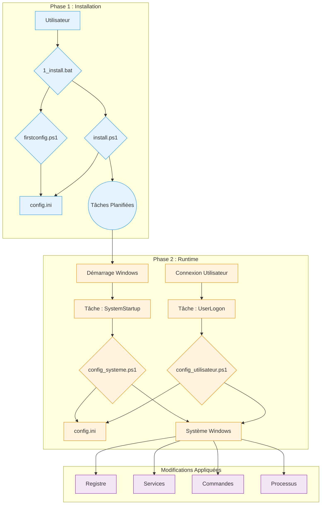

# Documentation Technique de WindowsOrchestrator

Ce document est une description technique de référence pour le projet WindowsOrchestrator. Il détaille l'architecture, les composants, et la séquence d'exécution de chaque script.

[toc]

## 1. Vue d'Ensemble du Projet

### 1.1. Action du Projet

Le projet WindowsOrchestrator automatise la configuration d'un système d'exploitation Windows. Il exécute des scripts qui modifient les paramètres système et gèrent des applications. Les actions effectuées par les scripts transforment une installation Windows standard en un environnement dont le comportement est défini par un fichier de configuration central.

Les scripts lisent le fichier config.ini pour exécuter des commandes qui modifient des clés de Registre, gèrent des services Windows, configurent les paramètres d'alimentation, créent des tâches planifiées, et gèrent le cycle de vie d'un processus utilisateur.

Le projet fournit un ensemble de scripts qui appliquent des configurations pour la gestion de l'alimentation, les mises à jour système, la session utilisateur et le cycle de vie d'une application.

### 1.2. Principes de Fonctionnement

Le fonctionnement de WindowsOrchestrator repose sur quatre mécanismes principaux.

1.  **Exécution par les Outils Natifs de Windows**
    Le projet utilise des fonctionnalités et des commandes intégrées à Windows : PowerShell 5.1, le Planificateur de Tâches, l'Éditeur du Registre, et des utilitaires en ligne de commande (`powercfg`, `shutdown`). Le projet ne requiert l'installation d'aucune dépendance externe.

2.  **Configuration par Fichier Centralisé**
    La logique d'exécution des scripts est séparée de la configuration. Les scripts lisent le fichier `config.ini` pour déterminer les actions à exécuter. Pour modifier le comportement des scripts, un utilisateur modifie les valeurs dans le `config.ini`.

3.  **Séparation des Contextes d'Exécution (Système vs. Utilisateur)**
    Le projet utilise deux contextes d'exécution distincts :
    *   Le script **`config_systeme.ps1`** s'exécute avec les autorisations du compte `NT AUTHORITY\SYSTEM` et modifie les paramètres globaux de la machine (Registre HKLM, services, tâches planifiées).
    *   Le script **`config_utilisateur.ps1`** s'exécute avec les autorisations de l'utilisateur connecté et gère les processus de sa session.

4.  **Idempotence des Actions**
    Les scripts sont écrits de manière à ce que leur exécution répétée produise le même état final que leur exécution unique. Avant de modifier un paramètre, un script vérifie l'état actuel du système. Si l'état souhaité est déjà appliqué, le script ne répète pas l'action de modification.

## 2. Architecture et Composants Clés

L'architecture de WindowsOrchestrator utilise des composants natifs de Windows. Chaque composant a un rôle défini.

### 2.1. Schéma de l'Architecture

Le flux d'exécution et les interactions entre les composants sont représentés par le schéma suivant :

Ce schéma montre la séparation entre la **phase d'installation**, initiée par l'utilisateur, et la **phase de runtime**, un cycle automatisé géré par le Planificateur de Tâches.

### 2.2. Le Rôle du Planificateur de Tâches

Le Planificateur de Tâches de Windows est le composant central de l'automatisation. Il exécute les scripts de configuration aux moments définis et avec les niveaux de privilèges requis.

Les deux tâches principales créées par `install.ps1` sont :

*   **`WindowsOrchestrator-SystemStartup`**
    *   **Déclencheur :** "Au démarrage du système".
    *   **Contexte d'exécution :** `NT AUTHORITY\SYSTEM`. Ce compte a les privilèges requis pour modifier les clés du Registre dans `HKEY_LOCAL_MACHINE` (HKLM), gérer les services et exécuter des commandes système.
    *   **Rôle :** Exécuter toutes les configurations au niveau de la machine.

*   **`WindowsOrchestrator-UserLogon`**
    *   **Déclencheur :** "À l'ouverture de session" de l'utilisateur spécifié.
    *   **Contexte d'exécution :** Le compte de l'utilisateur connecté. Le script s'exécute avec les privilèges de cet utilisateur, ce qui lui permet de lancer des applications graphiques dans la session de l'utilisateur.
    *   **Rôle :** Exécuter toutes les configurations spécifiques à la session utilisateur.

### 2.3. Le Fichier `config.ini` : Source de la Configuration

Le fichier `config.ini` contient la description de l'état final souhaité du système. Les scripts PowerShell (`config_systeme.ps1`, `config_utilisateur.ps1`) lisent ce fichier et exécutent les commandes nécessaires pour que le système se conforme aux paramètres définis.

Ce mécanisme a plusieurs caractéristiques factuelles :
*   Le comportement des scripts est déterminé par les paires clé-valeur contenues dans le fichier config.ini.
*   La logique d'exécution est contenue dans des fichiers de script PowerShell (.ps1), tandis que les paramètres qui contrôlent cette logique sont lus depuis un fichier .ini.
*   Les scripts lisent le fichier config.ini présent dans leur répertoire racine, ce qui permet à des instances distinctes du projet d'avoir des comportements différents en fonction du contenu de leur propre fichier config.ini.

### 2.4. Le Système d'Internationalisation (i18n)

Le projet charge des textes traduits sans modification du code source.

*   **Structure des Fichiers :** Les textes sont stockés dans des fichiers `.psd1` situés dans des sous-dossiers du répertoire `i18n/`. Chaque sous-dossier est nommé d'après un code de culture (ex: `fr-FR`, `en-US`).

*   **Mécanisme de Détection et de Chargement :**
    1.  Au début de son exécution, un script exécute la commande `(Get-Culture).Name` pour obtenir le code de culture du système (ex: `"fr-FR"`).
    2.  Le script construit le chemin vers le fichier de langue correspondant (ex: `i18n\fr-FR\strings.psd1`).
    3.  **Logique de Repli (Fallback) :** Si ce fichier n'existe pas, le script utilise le chemin `i18n\en-US\strings.psd1`.
    4.  Le contenu du fichier `.psd1` est lu et interprété par `Invoke-Expression`, ce qui charge une table de hachage de textes dans une variable `$lang`.

*   **Utilisation dans le Code :**
    Pour afficher un message, le code accède à la table de hachage `$lang` via une clé (ex: `$lang.Uninstall_StartMessage`). Les fonctions de journalisation utilisent un paramètre `-DefaultMessage` contenant un texte en anglais si une clé n'est pas trouvée.

Pour ajouter une nouvelle langue, un utilisateur doit copier le dossier `en-US`, le renommer avec le nouveau code de culture, et traduire les valeurs dans le fichier `strings.psd1`.

## 3. Cycle de Vie et Séquences d'Exécution

Cette section décompose les processus du projet en séquences d'exécution chronologiques.

### 3.1. Séquence d'Installation Complète

1.  **Phase 1 - Lancement et Configuration (Contexte Utilisateur)**
    *   L'utilisateur exécute `1_install.bat`.
    *   Le script batch exécute `management\firstconfig.ps1`.
    *   **`firstconfig.ps1` s'exécute :**
        *   Il vérifie l'existence du fichier `config.ini`. S'il est absent, il le crée à partir du modèle `management/defaults/default_config.ini`. S'il est présent, il demande à l'utilisateur s'il veut le remplacer.
        *   Il affiche une interface graphique Windows Forms, pré-remplie avec les valeurs lues dans `config.ini`.
        *   Au clic sur "Enregistrer et Fermer", le script écrit les valeurs des champs de l'interface dans `config.ini`.
        *   Le script `firstconfig.ps1` se termine.

2.  **Phase 2 - Élévation et Installation (Contexte Administrateur)**
    *   Le script `1_install.bat` reprend.
    *   Il exécute une commande PowerShell qui utilise `Start-Process PowerShell -Verb RunAs` pour lancer `install.ps1`.
    *   Windows déclenche une invite de **Contrôle de Compte d'Utilisateur (UAC)**. L'utilisateur doit accorder les privilèges.
    *   **`install.ps1` s'exécute avec les privilèges Administrateur :**
        *   Il vérifie la présence des fichiers `config_systeme.ps1` et `config_utilisateur.ps1`.
        *   Il exécute la commande `Register-ScheduledTask` pour créer deux tâches :
            *   **`WindowsOrchestrator-SystemStartup`**, qui exécute `config_systeme.ps1` au démarrage (`-AtStartup`) avec le compte `NT AUTHORITY\SYSTEM`.
            *   **`WindowsOrchestrator-UserLogon`**, qui exécute `config_utilisateur.ps1` à l'ouverture de session (`-AtLogOn`) de l'utilisateur.
        *   Pour appliquer la configuration, le script exécute `config_systeme.ps1` puis `config_utilisateur.ps1` via `Start-Process -Wait`.
    *   Le script `install.ps1` se termine.

### 3.2. Séquence d'Exécution au Démarrage (Runtime - Niveau Système)

1.  **Déclenchement :** Le système d'exploitation Windows démarre.
2.  **Exécution de la Tâche :** Le Planificateur de Tâches exécute la tâche `WindowsOrchestrator-SystemStartup`.
3.  **Lancement du Script :** La tâche exécute `powershell.exe` avec les privilèges du compte `NT AUTHORITY\SYSTEM` pour lancer `config_systeme.ps1`.
4.  **Actions de `config_systeme.ps1` :**
    *   Le script analyse `config.ini` et charge son contenu.
    *   Il vérifie la connectivité réseau (`Test-NetConnection 8.8.8.8 -Port 53`).
    *   Il exécute les blocs de configuration définis dans `[SystemConfig]`. Pour chaque action :
        *   Il lit la valeur de la clé.
        *   Il vérifie l'état actuel du système (valeur de registre, état de service).
        *   Si l'état actuel est différent de l'état désiré, il exécute la commande de modification (`Set-ItemProperty`, `powercfg`, etc.).
        *   Il enregistre l'action ou l'erreur dans des listes.
    *   Il envoie une notification Gotify (si activée).
5.  **Fin de Séquence :** Le script se termine.

### 3.3. Séquence d'Exécution à l'Ouverture de Session (Runtime - Niveau Utilisateur)

1.  **Déclenchement :** L'utilisateur ouvre une session.
2.  **Exécution de la Tâche :** Le Planificateur de Tâches exécute la tâche `WindowsOrchestrator-UserLogon`.
3.  **Lancement du Script :** La tâche exécute `powershell.exe` avec les privilèges de l'utilisateur pour lancer `config_utilisateur.ps1` (`-WindowStyle Hidden`).
4.  **Actions de `config_utilisateur.ps1` :**
    *   Le script analyse `config.ini`.
    *   Il lit les paramètres de la section `[Process]`.
    *   Il exécute la logique de gestion du processus :
        1.  Il résout les variables d'environnement dans le chemin du processus.
        2.  Il recherche les processus existants qui correspondent au nom et qui appartiennent à l'utilisateur courant (vérification par SID).
        3.  S'il en trouve, il les termine (`Stop-Process -Force`).
        4.  Il lance une nouvelle instance du processus.
    *   Il envoie une notification Gotify (si activée).
5.  **Fin de Séquence :** Le script se termine.

### 3.4. Séquence de Désinstallation

1.  **Déclenchement :** L'utilisateur exécute `2_uninstall.bat`.
2.  **Élévation :** Le script `2_uninstall.bat` lance `management\uninstall.ps1`, qui se relance lui-même avec `Start-Process -Verb RunAs`. L'utilisateur doit accepter l'invite UAC.
3.  **Actions de `uninstall.ps1` :**
    *   Le script pose une question à l'utilisateur pour désactiver l'AutoLogon.
    *   Il restaure les clés de Registre système :
        *   Windows Update (`NoAutoUpdate` -> `0`).
        *   Démarrage Rapide (`HiberbootEnabled` -> `1`).
        *   OneDrive (suppression de `DisableFileSyncNGSC`).
        *   AutoLogon (`AutoAdminLogon` -> `0`) si demandé.
    *   Il exécute `Unregister-ScheduledTask` pour supprimer les quatre tâches planifiées.
    *   Il affiche un résumé et informe que les fichiers ne sont pas supprimés.
4.  **Fin de Séquence :** Le script se termine.

## 4. Procédures d'Installation et de Désinstallation

Cette section décrit les séquences d'opérations exécutées par les scripts batch pour installer, activer, désinstaller et restaurer le système.

### 4.1. Procédure d'Installation

La procédure est initiée par l'exécution du fichier `1_install.bat`. Elle se décompose en deux phases distinctes.

#### 4.1.1. Phase 1 : Configuration (Contexte Utilisateur)

1.  Le fichier `1_install.bat` exécute le script `management\firstconfig.ps1` via la commande `powershell.exe`.
2.  Le script `firstconfig.ps1` vérifie l'existence du fichier `config.ini` à la racine du projet.
    *   Si le fichier `config.ini` n'existe pas, il est créé par copie du fichier `management/defaults/default_config.ini`.
    *   Si le fichier `config.ini` existe, une boîte de dialogue `System.Windows.Forms.MessageBox` s'affiche, demandant à l'utilisateur s'il souhaite remplacer le fichier existant par le modèle.
3.  Le script affiche ensuite une interface graphique (Windows Forms) dont les champs sont pré-remplis avec les valeurs lues dans le fichier `config.ini`.
4.  Lorsque l'utilisateur clique sur le bouton "Enregistrer et Fermer", les valeurs des champs de l'interface sont écrites dans le fichier `config.ini` via la fonction `Set-IniValue`. Le script se termine.

#### 4.1.2. Phase 2 : Installation des Tâches (Contexte Administrateur)

1.  Le contrôle retourne au script `1_install.bat`. Il exécute une commande `powershell.exe` dont le seul rôle est de lancer une seconde instance de PowerShell via la commande `Start-Process PowerShell -Verb RunAs`.
2.  Cette action déclenche une invite de Contrôle de Compte d'Utilisateur (UAC). L'utilisateur doit accorder les privilèges pour continuer.
3.  Le script `management\install.ps1` s'exécute avec les privilèges d'administrateur et effectue les actions suivantes :
    *   Il crée la tâche planifiée **`WindowsOrchestrator-SystemStartup`** via `Register-ScheduledTask`. Le déclencheur est défini sur `-AtStartup` et le principal d'exécution est `NT AUTHORITY\SYSTEM` (`-UserId "NT AUTHORITY\SYSTEM"`). L'action est l'exécution du script `config_systeme.ps1`.
    *   Il crée la tâche planifiée **`WindowsOrchestrator-UserLogon`** via `Register-ScheduledTask`. Le déclencheur est défini sur `-AtLogOn` pour l'utilisateur courant et le principal d'exécution est ce même utilisateur (`-UserId "$($env:USERDOMAIN)\$($env:USERNAME)"`). L'action est l'exécution du script `config_utilisateur.ps1`.

4.  Pour appliquer la configuration immédiatement, `install.ps1` exécute ensuite, de manière séquentielle et en attendant la fin de chaque processus (`-Wait`), les scripts `config_systeme.ps1` puis `config_utilisateur.ps1`.

#### 4.1.3. État du Système Post-Installation

*   Deux tâches planifiées, `WindowsOrchestrator-SystemStartup` et `WindowsOrchestrator-UserLogon`, sont créées et actives dans le Planificateur de Tâches de Windows.
*   Un fichier `config.ini` existe à la racine du projet et contient la configuration définie par l'utilisateur.
*   Un répertoire `Logs` est présent à la racine du projet et contient les fichiers journaux de l'exécution initiale.
*   Les paramètres système définis dans `config.ini` ont été appliqués une première fois.

### 4.2. Procédure de Désinstallation

La procédure est initiée par l'exécution du fichier `2_uninstall.bat`.

#### 4.2.1. Élévation des Privilèges

1.  Le fichier `2_uninstall.bat` exécute le script `management\uninstall.ps1`.
2.  Le script `uninstall.ps1` vérifie son propre niveau de privilège. S'il n'est pas administrateur, il se relance lui-même via `Start-Process powershell.exe -Verb RunAs`, ce qui déclenche une invite UAC que l'utilisateur doit valider.

#### 4.2.2. Actions Exécutées par le Script

Le script `management\uninstall.ps1`, s'exécutant avec les privilèges d'administrateur, effectue les opérations suivantes :

1.  **Interaction Utilisateur :** Le script affiche une invite dans la console via `Read-Host`, demandant à l'utilisateur s'il souhaite désactiver la connexion automatique. La réponse de l'utilisateur est stockée dans une variable.
2.  **Restauration des Paramètres Système :**
    *   Si l'utilisateur a répondu `o` ou `y`, le script écrit la valeur de chaîne de caractères `"0"` dans la clé de Registre `HKLM:\SOFTWARE\Microsoft\Windows NT\CurrentVersion\Winlogon\AutoAdminLogon`.
    *   Il écrit la valeur DWORD `0` dans la clé `HKLM:\...\WindowsUpdate\AU\NoAutoUpdate`.
    *   Il écrit la valeur DWORD `0` dans la clé `HKLM:\...\WindowsUpdate\AU\NoAutoRebootWithLoggedOnUsers`.
    *   Il écrit la valeur DWORD `1` dans la clé `HKLM:\...\Power\HiberbootEnabled`.
    *   Il supprime la valeur `DisableFileSyncNGSC` de la clé `HKLM:\...\OneDrive` via `Remove-ItemProperty`.
    *   Il modifie le type de démarrage du service `wuauserv` en `Automatic` via `Set-Service`.
3.  **Suppression des Tâches Planifiées :**
    *   Le script itère sur une liste prédéfinie de noms de tâches et exécute `Unregister-ScheduledTask -Confirm:$false` pour chacune. Les tâches supprimées sont :
        *   `WindowsOrchestrator-SystemStartup`
        *   `WindowsOrchestrator-UserLogon`
        *   `WindowsOrchestrator-SystemScheduledReboot`
        *   `WindowsOrchestrator-SystemPreRebootAction`

#### 4.2.3. État du Système Post-Désinstallation

*   Les quatre tâches planifiées liées au projet sont supprimées du Planificateur de Tâches. Toute automatisation est arrêtée.
*   Les paramètres de Registre et de service listés ci-dessus sont restaurés à leurs valeurs par défaut.
*   Les paramètres d'alimentation modifiés par la commande `powercfg` ne sont pas modifiés par le script de désinstallation.
*   Le répertoire du projet, incluant tous les scripts, le fichier `config.ini` et les journaux, n'est pas supprimé et reste sur le disque.

## 5. Guide de Configuration Approfondi (`config.ini`)

Le fichier `config.ini` est le centre de contrôle déclaratif du projet. Ce guide décrit chaque clé, son impact sur l'exécution des scripts, ses valeurs possibles et ses interactions avec d'autres paramètres. Les valeurs par défaut sont celles spécifiées dans le fichier `management/defaults/default_config.ini`.

### 5.1. Section `[SystemConfig]`

Cette section gouverne les paramètres qui affectent l'ensemble du système et est exclusivement lue par `config_systeme.ps1`.

---

**`AutoLoginUsername`**

*   **Rôle :** Spécifie le nom d'utilisateur qui sera écrit dans la clé de Registre `DefaultUserName`. Cette valeur est également utilisée par la logique de l'action pré-redémarrage pour résoudre le chemin `%USERPROFILE%`.
*   **Valeurs possibles :** Une chaîne de caractères représentant un nom d'utilisateur local ou de domaine (ex: `Admin`, `DOMAINE\Utilisateur`). Si la valeur est laissée vide, le script tente de lire la valeur déjà présente dans la clé de Registre `DefaultUserName`.
*   **Valeur par défaut :** "" (chaîne vide)
*   **Interdépendances :** Ce paramètre est requis si `EnableAutoLogin` est `true`. Il est également nécessaire pour que la variable `%USERPROFILE%` puisse être utilisée dans la clé `PreRebootActionCommand`.

---

**`EnableAutoLogin`**

*   **Rôle :** Contrôle l'état de la connexion automatique Windows.
*   **Action du script :** Si la valeur est `true`, le script écrit `"1"` dans la clé de Registre `HKLM:\SOFTWARE\Microsoft\Windows NT\CurrentVersion\Winlogon\AutoAdminLogon`. Si la valeur est `false`, il écrit `"0"`.
*   **Valeurs possibles :** `true`, `false`
*   **Valeur par défaut :** `false`
*   **Interdépendances :** Requiert que `AutoLoginUsername` soit correctement configuré pour être pleinement fonctionnel. **Note pour le développeur :** Le script ne gère pas le mot de passe (`DefaultPassword`), qui doit être configuré hors bande (par ex. avec l'outil Sysinternals AutoLogon).

---

**`DisableFastStartup`**

*   **Rôle :** Contrôle la fonctionnalité de Démarrage Rapide de Windows (Hiberboot).
*   **Action du script :** Si `true`, écrit la valeur `0` (DWORD) dans la clé de Registre `HKLM:\...\Power\HiberbootEnabled`. Si `false`, écrit `1`.
*   **Valeurs possibles :** `true`, `false`
*   **Valeur par défaut :** `true`
*   **Interdépendances :** Aucune.

---

**`DisableSleep`** et **`DisableScreenSleep`**

*   **Rôle :** Gèrent la mise en veille de la machine et de l'écran.
*   **Action du script :**
    *   Pour `DisableSleep=true`, exécute les commandes `powercfg /change standby-timeout-ac 0` et `powercfg /change hibernate-timeout-ac 0`.
    *   Pour `DisableScreenSleep=true`, exécute la commande `powercfg /change monitor-timeout-ac 0`.
*   **Valeurs possibles :** `true`, `false`
*   **Valeurs par défaut :** `DisableSleep=true`, `DisableScreenSleep=false`
*   **Interdépendances :** Aucune.

---

**`DisableWindowsUpdate`**

*   **Rôle :** Désactive complètement le service de mise à jour de Windows.
*   **Action du script :** Si `true`, le script effectue trois actions :
    1.  Écrit la valeur `1` (DWORD) dans la clé `HKLM:\...\WindowsUpdate\AU\NoAutoUpdate`.
    2.  Change le type de démarrage du service `wuauserv` en `Disabled`.
    3.  Arrête le service `wuauserv` (`Stop-Service`).
*   **Valeurs possibles :** `true`, `false`
*   **Valeur par défaut :** `true`
*   **Interdépendances :** Aucune.

---

**`DisableAutoReboot`**

*   **Rôle :** Empêche Windows de redémarrer automatiquement après une mise à jour si une session utilisateur est active.
*   **Action du script :** Si `true`, écrit la valeur `1` (DWORD) dans la clé de Registre `HKLM:\...\WindowsUpdate\AU\NoAutoRebootWithLoggedOnUsers`.
*   **Valeurs possibles :** `true`, `false`
*   **Valeur par défaut :** `true`
*   **Interdépendances :** Ce paramètre est principalement pertinent lorsque `DisableWindowsUpdate` est `false`.

---

**`ScheduledRebootTime`**

*   **Rôle :** Planifie un redémarrage quotidien de la machine.
*   **Action du script :** Si une valeur est fournie, le script crée/met à jour une tâche planifiée (`WindowsOrchestrator-SystemScheduledReboot`) qui exécute `shutdown.exe /r /f /t 60` à l'heure spécifiée. Si la valeur est vide, la tâche planifiée est supprimée.
*   **Valeurs possibles :** Une chaîne au format `HH:MM` (ex: `03:00`), ou une chaîne vide pour désactiver.
*   **Valeur par défaut :** `03:00`
*   **Interdépendances :** Le script crée deux tâches planifiées distinctes pour l'action pré-redémarrage et le redémarrage. Le Planificateur de Tâches de Windows exécute chaque tâche à l'heure spécifiée, sans vérifier leur ordre chronologique.

---

**`PreRebootAction...`** (groupe de 4 clés)

*   **Rôle :** Exécute une commande personnalisée avant le redémarrage planifié. Ce bloc n'est actif que si `PreRebootActionTime` et `PreRebootActionCommand` sont tous les deux non vides.
*   **Action du script :** Crée/met à jour une tâche planifiée (`WindowsOrchestrator-SystemPreRebootAction`) qui exécute la commande spécifiée. Le script résout les variables d'environnement (`%USERPROFILE%`) et les chemins relatifs dans `PreRebootActionCommand`.
*   **Clés :**
    *   `PreRebootActionTime`: Heure (`HH:MM`) de déclenchement.
    *   `PreRebootActionCommand`: Chemin vers l'exécutable ou le script.
    *   `PreRebootActionArguments`: Arguments à passer à la commande.
    *   `PreRebootActionLaunchMethod`: Méthode d'exécution (`direct`, `powershell`, `cmd`).
*   **Valeurs par défaut :** `02:55`, `"PreReboot.bat"`, `""`, `cmd`
*   **Interdépendances :** L'exécution de la tâche 'WindowsOrchestrator-SystemPreRebootAction' est indépendante de l'existence de la tâche 'WindowsOrchestrator-SystemScheduledReboot'.

---

**`DisableOneDrive`**

*   **Rôle :** Désactive l'intégration de OneDrive via une stratégie système.
*   **Action du script :** Si `true`, écrit la valeur `1` (DWORD) dans la clé de Registre `HKLM:\...\OneDrive\DisableFileSyncNGSC`. Si `false`, la clé est supprimée.
*   **Valeurs possibles :** `true`, `false`
*   **Valeur par défaut :** `true`
*   **Interdépendances :** Aucune.

### 5.2. Section `[Process]`

Cette section, lue par `config_utilisateur.ps1`, décrit comment gérer l'application métier principale. Le fonctionnement repose sur le trio de clés interdépendantes suivant :

*   **`ProcessName` (Le "Quoi")**
    *   **Rôle :** Définit le chemin complet vers l'exécutable ou le script à lancer. C'est la cible principale de l'action.
    *   **Action du script :** Le script utilise cette valeur pour identifier le processus à arrêter et comme cible de la commande de démarrage. Il supporte les variables d'environnement système et utilisateur (ex: `%USERPROFILE%`, `%PROGRAMFILES%`) qui sont résolues dynamiquement à l'exécution.

*   **`ProcessArguments` (Le "Avec Quoi")**
    *   **Rôle :** Spécifie les arguments de ligne de commande à passer à l'exécutable/script défini dans `ProcessName`.
    *   **Action du script :** Cette chaîne de caractères est ajoutée à la commande d'exécution. Si elle est vide, aucune argumentation n'est passée.

*   **`LaunchMethod` (Le "Comment")**
    *   **Rôle :** Spécifie l'interpréteur de commandes à utiliser pour lancer le `ProcessName`. Ce choix est crucial pour la compatibilité.
    *   **Action du script :** Le script construit la commande finale différemment selon la valeur :
        *   `direct` : Lance directement l'exécutable. La commande est `ProcessName "ProcessArguments"`. C'est la méthode standard pour les fichiers `.exe`.
        *   `cmd` : Lance via l'interpréteur de commandes `cmd.exe`. La commande générée est `cmd.exe /c ""ProcessName" ProcessArguments"`. C'est la méthode recommandée pour les scripts batch (`.bat`, `.cmd`).
        *   `powershell` : Lance via PowerShell. La commande générée est `powershell.exe -NoProfile -ExecutionPolicy Bypass -Command "& 'ProcessName' ProcessArguments'"`. C'est la méthode idéale pour exécuter d'autres scripts PowerShell (`.ps1`).

### 5.3. Section `[Logging]`

Cette section configure le comportement des fichiers journaux.

*   **`EnableLogRotation`**
    *   **Rôle :** Active ou désactive le mécanisme d'archivage des journaux.
    *   **Action du script :** Si `true`, avant d'écrire dans un fichier journal (`log.txt`), la fonction `Rotate-LogFile` est appelée. Elle renomme `log.txt` en `log.1.txt`, `log.1.txt` en `log.2.txt`, etc., jusqu'à la limite, et supprime le plus ancien. Si `false`, cette fonction n'est pas appelée et le fichier journal grossit indéfiniment.
*   **`MaxSystemLogsToKeep` et `MaxUserLogsToKeep`**
    *   **Rôle (Intentionnel) :** Ces clés sont prévues dans le `default_config.ini` pour définir le nombre de fichiers journaux archivés à conserver.
    *   **Action du script (Actuelle)** : Les clés MaxSystemLogsToKeep et MaxUserLogsToKeep ne sont pas lues par le script config_systeme.ps1. La fonction Rotate-LogFile est appelée avec une valeur fixe de 7, définie par la variable $DefaultMaxLogs.

### 5.4. Section `[Gotify]`

Cette section contrôle l'envoi de notifications de statut à un serveur Gotify.

*   **`EnableGotify`** : Si `true`, les scripts tenteront d'envoyer une notification à la fin de leur exécution.
*   **`Url`** : L'URL de base de l'instance Gotify (ex: `http://gotify.example.com`).
*   **`Token`** : Le jeton d'application généré dans Gotify pour autoriser l'envoi de messages.
*   **`Priority`** : Un entier définissant la priorité du message dans Gotify.
*   **`GotifyTitle...`** (groupe de 4 clés) :
    *   **Rôle :** Modèles pour les titres des notifications.
    *   **Action du script :** Avant d'envoyer la notification, le script prend la chaîne de caractères de la clé appropriée (ex: `GotifyTitleErrorSystem`) et y substitue les chaînes littérales `%COMPUTERNAME%` et `%USERNAME%` par les valeurs des variables d'environnement correspondantes.

## 6. Description Détaillée des Scripts (Référence du Code)

Cette section sert de référence pour le code source. Elle décompose la logique et les mécanismes internes de chaque script majeur du projet.

### 6.1. Scripts d'Orchestration (`management/`)

Ces scripts gèrent le cycle de vie du projet (installation, configuration initiale, désinstallation). Ils sont conçus pour être exécutés manuellement par l'utilisateur.

#### **`firstconfig.ps1`**

*   **Rôle :** Fournir une interface graphique (GUI) pour une configuration assistée du fichier `config.ini`.
*   **Logique de l'Interface Graphique :**
    *   Le script utilise les assemblages .NET `System.Windows.Forms` et `System.Drawing`, chargés via `Add-Type`, pour construire dynamiquement les objets de l'interface (Form, Label, TextBox, CheckBox, Button).
    *   Le positionnement des contrôles est géré par des variables (`$xPadding`, `$yCurrent`) qui sont incrémentées après l'ajout de chaque élément.
    *   La langue de l'interface est chargée dynamiquement à partir des fichiers `strings.psd1`.
*   **Gestion de `config.ini` :**
    *   **Lecture :** Au lancement, le script lit les valeurs actuelles du `config.ini` à l'aide d'une fonction locale `Get-IniValue`. Cette fonction effectue une lecture ligne par ligne du fichier pour extraire les valeurs. Les valeurs `true`/`false` sont converties en types `[bool]` PowerShell pour les `CheckBox`.
    *   **Écriture :** Lors du clic sur le bouton "Enregistrer", l'événement `Add_Click` appelle la fonction locale `Set-IniValue` pour chaque paramètre. Cette fonction reconstruit le contenu du fichier en mémoire avant de l'écrire sur le disque avec l'encodage UTF-8.

#### **`install.ps1`**

*   **Rôle :** Créer la persistance du système en installant les tâches planifiées et effectuer une première exécution des scripts de runtime.
*   **Mécanisme d'Auto-Élévation :** Le script vérifie son niveau de privilège via `New-Object Security.Principal.WindowsPrincipal`. S'il n'est pas "Administrator", il se relance lui-même avec `Start-Process powershell.exe -Verb RunAs`.
*   **Logique de Création des Tâches :**
    *   Le script utilise les cmdlets natives `New-ScheduledTaskAction`, `New-ScheduledTaskTrigger`, `New-ScheduledTaskPrincipal`, `New-ScheduledTaskSettingsSet` et `Register-ScheduledTask`.
    *   **Gestion des Principaux :**
        *   Pour `...-SystemStartup`, il utilise `-UserId "NT AUTHORITY\SYSTEM" -RunLevel Highest`.
        *   Pour `...-UserLogon`, il utilise `-UserId "$($env:USERDOMAIN)\$($env:USERNAME)" -LogonType Interactive`.
*   **Exécution Post-Installation :**
    *   Après avoir enregistré les tâches, le script exécute `config_systeme.ps1` puis `config_utilisateur.ps1` via `Start-Process -Wait`.

#### **`uninstall.ps1`**

*   **Rôle :** Supprimer les composants d'automatisation et restaurer les paramètres système critiques.
*   **Logique de Restauration :**
    *   Le script contient des valeurs "par défaut" de Windows en dur dans son code pour restaurer l'état du système.
    *   Il utilise les mêmes cmdlets que `config_systeme.ps1` (`Set-ItemProperty`, `Set-Service`) mais avec les valeurs inverses.
    *   Les opérations sont encapsulées dans des blocs `try...catch`.
*   **Logique de Nettoyage :**
    *   Il utilise une liste prédéfinie (`$TasksToRemove`) contenant les noms des quatre tâches planifiées.
    *   Il boucle sur cette liste et exécute `Get-ScheduledTask` pour vérifier l'existence de la tâche, puis `Unregister-ScheduledTask -Confirm:$false` pour la supprimer.

### 6.2. Scripts de Runtime (Racine)

Ces scripts contiennent la logique métier principale et sont exécutés automatiquement par les tâches planifiées.

#### **`config_systeme.ps1`**

*   **Architecture du Script :** Le script est structuré en plusieurs régions : fonctions de base, fonctions utilitaires, initialisation, et bloc d'exécution principal (`try...catch...finally`).
*   **Fonctions Clés :**
    *   `Get-IniContent` : Analyse le `config.ini` et le transforme en une table de hachage PowerShell imbriquée (`$ini['Section']['Key']`).
    *   `Get-ConfigValue` : C'est un wrapper pour accéder à la configuration. Il gère les clés/sections absentes, fournit des valeurs par défaut et effectue une conversion de type.
    *   `Add-Action` / `Add-Error` : Ces fonctions centralisent la journalisation. Elles ajoutent les messages à des listes globales (`$Global:ActionsEffectuees`, `$Global:ErreursRencontrees`) utilisées pour construire le rapport Gotify.
*   **Logique d'Exécution :** Le corps principal du script est une séquence de blocs de configuration. Chaque bloc est idempotent : il lit d'abord l'état actuel du système (valeur de registre, état du service) avant d'écrire.

#### **`config_utilisateur.ps1`**

*   **Rôle :** Assurer que l'application métier définie dans `[Process]` est dans l'état souhaité (une seule instance, fraîchement lancée).
*   **Logique de Gestion du Processus :**
    1.  **Résolution de chemin :** Le `ProcessName` est traité par `[System.Environment]::ExpandEnvironmentVariables()` pour résoudre les variables comme `%USERPROFILE%`.
    2.  **Identification du Propriétaire :** La recherche du processus existant utilise `Get-Process` pour trouver les processus par nom, puis `Get-CimInstance Win32_Process` pour récupérer le propriétaire de chaque processus. Il compare le SID du propriétaire du processus avec le SID de l'utilisateur courant (`[System.Security.Principal.WindowsIdentity]::GetCurrent().User.Value`).
    3.  **Arrêt et Redémarrage :** Si un processus correspondant est trouvé, il est terminé via `Stop-Process -Force`. Ensuite, une nouvelle instance est lancée en utilisant `Start-Process`. L'utilisation de "splatting" (`@startProcessSplat`) est utilisée pour l'appel à `Start-Process`.

### 6.3. Scripts Utilitaires et Lanceurs

Ces scripts sont soit des outils de support, soit des exemples d'intégration.

#### **`Close-AppByTitle.ps1`**

*   **Interaction avec `user32.dll` :**
    *   Il injecte en mémoire une classe C# via `Add-Type -TypeDefinition`. Ce code C# utilise des attributs `[DllImport("user32.dll")]` pour exposer les fonctions de l'API Windows à PowerShell.
    *   La fonction `EnumWindows` est utilisée avec un bloc de script PowerShell comme "callback". Pour chaque fenêtre trouvée par l'API, ce bloc PowerShell est exécuté. C'est dans ce bloc que le titre de la fenêtre est vérifié.
    *   Une fois la fenêtre cible identifiée par son `handle`, `SetForegroundWindow` est appelé pour lui donner le focus, puis `[System.Windows.Forms.SendKeys]::SendWait()` simule la frappe des touches.

#### **`PreReboot.bat` et `LaunchApp.bat`**

*   **Portabilité :** Le fonctionnement de ces lanceurs repose sur la variable spéciale des scripts batch `%~dp0`, qui se résout en chemin complet du répertoire où se trouve le script.

#### **`management/tools/Find-WindowInfo.ps1`**

*   **Utilité :** Ce script est un outil de débogage et de configuration.
*   **Fonctionnement :** Il utilise la même technique d'injection de code C# et d'appel à l'API `EnumWindows` que `Close-AppByTitle.ps1`. Il affiche une liste formatée des fenêtres visibles, avec le nom du processus et son PID.

## 7. Procédures de Maintenance et de Débogage

Cette section fournit des guides pratiques pour diagnostiquer les problèmes et tester les modifications.

### 7.1. Comprendre et Utiliser les Journaux (`Logs/`)

*   **Emplacement :** Les journaux sont créés dans le sous-dossier `Logs/`.
    *   `config_systeme_ps_log.txt`: Contient les logs du script système.
    *   `config_utilisateur_log.txt`: Contient les logs du script utilisateur.
*   **Structure des Messages de Log :** `AAAA-MM-JJ HH:mm:ss [NIVEAU] [Contexte] - Message`
*   **Comment Identifier les Actions et les Erreurs :**
    *   **Actions Réussies :** `ACTION: ...`
    *   **Erreurs Capturées :** `CAPTURED ERROR: ...`
    *   **Erreurs Fatales :** `FATAL SCRIPT ERROR ...`

### 7.2. Déboguer les Scripts Manuellement

#### **Exécuter `config_systeme.ps1` avec les droits `SYSTEM`**

1.  **Prérequis :** Télécharger `PsExec.exe` de la suite Sysinternals de Microsoft.
2.  **Procédure d'exécution :**
    *   Ouvrir une invite de commandes en tant qu'administrateur.
    *   Exécuter la commande : `PsExec.exe -s -i powershell.exe`
    *   Une nouvelle fenêtre PowerShell s'ouvre. La commande `whoami` retourne `nt authority\system`.
    *   Dans cette fenêtre, naviguer jusqu'au répertoire du projet et exécuter `.\config_systeme.ps1`.

#### **Tester `config_utilisateur.ps1` dans une session utilisateur**

1.  **Procédure d'exécution :**
    *   Ouvrir une session Windows avec le compte utilisateur cible.
    *   Ouvrir une console PowerShell standard.
    *   Naviguer jusqu'au répertoire du projet et exécuter `.\config_utilisateur.ps1`.

#### **Vérifier l'état des Tâches Planifiées**

1.  **Ouvrir l'outil :** Exécuter `taskschd.msc`.
2.  **Trouver les tâches :** Sélectionner "Bibliothèque du Planificateur de Tâches".
3.  **Analyser les informations :**
    *   Vérifier les colonnes "État", "Déclencheurs", et "Résultat de la dernière exécution" (un code `0x0` indique un succès).
    *   Consulter l'onglet "Historique" pour les détails de chaque exécution.

### **7.3. Considérations de Sécurité**

Cette section détaille les mécanismes et les implications de sécurité liés au fonctionnement du projet.

*   **Contexte d'Exécution des Tâches Système**  
    Le script `install.ps1` configure la tâche planifiée `WindowsOrchestrator-SystemStartup` pour qu'elle s'exécute avec les autorisations du compte `NT AUTHORITY\SYSTEM`. Ce compte dispose de privilèges étendus sur le système local, ce qui est nécessaire pour permettre au script `config_systeme.ps1` de modifier les clés du Registre dans la ruche `HKEY_LOCAL_MACHINE` (HKLM) et de gérer les services système.

*   **Mécanisme d'Élévation de Privilèges (UAC)**  
    Les scripts d'installation (`1_install.bat`) et de désinstallation (`2_uninstall.bat`) n'ont pas besoin d'être lancés depuis une session administrateur. Ils exécutent une commande `Start-Process -Verb RunAs` qui déclenche une invite du Contrôle de Compte d'Utilisateur (UAC) de Windows. La poursuite de l'exécution est conditionnée par la validation de cette invite par l'utilisateur.

*   **Gestion des Mots de Passe de Session**  
    Les scripts du projet **ne traitent, ne demandent, ni ne stockent** les mots de passe des utilisateurs sous quelque forme que ce soit. L'activation de la fonctionnalité d'AutoLogon (`EnableAutoLogin=true`) se contente d'écrire la valeur `"1"` dans la clé de Registre `AutoAdminLogon`. La clé `DefaultPassword` n'est jamais écrite par les scripts. La responsabilité de stocker le mot de passe de manière sécurisée dans le Registre incombe à l'utilisateur, via un outil externe tel que `Sysinternals AutoLogon`.

*   **Contournement de la Politique d'Exécution**  
    Les scripts de lancement (`.bat`) et les commandes de création de tâches planifiées utilisent systématiquement l'argument `-ExecutionPolicy Bypass` lors de l'appel à `powershell.exe`. Cet argument permet aux scripts de s'exécuter quelle que soit la politique d'exécution configurée sur le système. Ce paramètre s'applique uniquement à l'instance du processus en cours de lancement et ne modifie pas de manière permanente la politique de sécurité du système.

### **7.4. Limitations Connues**

Cette section documente les comportements qui sont le résultat de choix de conception ou représentent des fonctionnalités non implémentées à ce stade.

*   **Non-restauration des Paramètres d'Alimentation**  
    Le script `uninstall.ps1` n'exécute aucune commande `powercfg`. Par conséquent, les modifications apportées par `config_systeme.ps1` concernant la mise en veille de la machine (`standby-timeout-ac`) ou de l'écran (`monitor-timeout-ac`) ne sont pas annulées lors de la désinstallation.

*   **Configuration de la Rotation des Journaux Inactive**  
    Le fichier modèle de configuration (`default_config.ini`) contient les clés `MaxSystemLogsToKeep` et `MaxUserLogsToKeep`. Cependant, la fonction `Rotate-LogFile` dans `config_systeme.ps1` ne lit pas ces clés. Elle utilise une valeur fixe de `7`, définie dans le script par la variable `$DefaultMaxLogs`.

*   **Absence de Validation Chronologique des Tâches de Redémarrage**  
    Le script `config_systeme.ps1` crée les tâches planifiées pour l'action pré-redémarrage et le redémarrage planifié comme deux entités indépendantes. Le script ne contient aucune logique pour vérifier que la valeur de `PreRebootActionTime` est chronologiquement antérieure à celle de `ScheduledRebootTime`.

## 8. Annexe

### 8.1. Licence

Ce projet est distribué sous les termes de la **GNU General Public License v3 (GPLv3)**. Le texte intégral de la licence est disponible à la racine du projet dans le fichier `LICENSE`.

### 8.2. Glossaire des Termes

---
**UAC (User Account Control / Contrôle de Compte d'Utilisateur)**
*   **Définition :** Un mécanisme de sécurité de Windows qui exige une confirmation de l'utilisateur avant d'autoriser une action nécessitant des privilèges d'administrateur.
*   **Contexte dans le projet :** Déclenché par `install.ps1` et `uninstall.ps1` via le paramètre `-Verb RunAs` de la commande `Start-Process`.
---
**Tâche Planifiée (Scheduled Task)**
*   **Définition :** Un composant du service Windows "Planificateur de Tâches" qui permet d'exécuter automatiquement un script ou un programme.
*   **Contexte dans le projet :** Le mécanisme central de l'automatisation.
---
**Registre Windows (Windows Registry)**
*   **Définition :** Une base de données hiérarchique où Windows stocke les paramètres de configuration.
*   **Contexte dans le projet :** La cible principale des modifications de `config_systeme.ps1`.
---
**HKLM (HKEY_LOCAL_MACHINE)**
*   **Définition :** Ruche du Registre contenant les paramètres qui s'appliquent à l'ensemble de la machine.
*   **Contexte dans le projet :** Toutes les modifications de Registre de `config_systeme.ps1` se situent dans HKLM.
---
**SID (Security Identifier / Identifiant de Sécurité)**

*   **Définition :** Une chaîne de caractères unique qui identifie un principal de sécurité (utilisateur, groupe).
*   **Contexte dans le projet :** Utilisé par `config_utilisateur.ps1` pour identifier le propriétaire d'un processus.
---
**`NT AUTHORITY\SYSTEM` (Compte SYSTEM)**
*   **Définition :** Un compte de service interne de Windows avec des privilèges étendus sur le système local.
*   **Contexte dans le projet :** Le contexte d'exécution de `config_systeme.ps1`.
---
**Idempotence**
*   **Définition :** Une propriété d'une opération qui, si appliquée plusieurs fois, produit le même résultat qu'une seule fois.
*   **Contexte dans le projet :** Un principe de conception des scripts pour assurer un état final stable.
---
**Politique d'Exécution PowerShell (Execution Policy)**
*   **Définition :** Une fonctionnalité de sécurité de PowerShell qui détermine si les scripts peuvent être exécutés.
*   **Contexte dans le projet :** Contournée via le paramètre `-ExecutionPolicy Bypass` pour assurer l'exécution des scripts.
