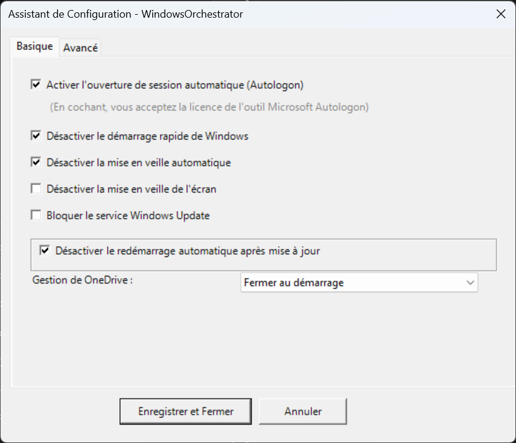
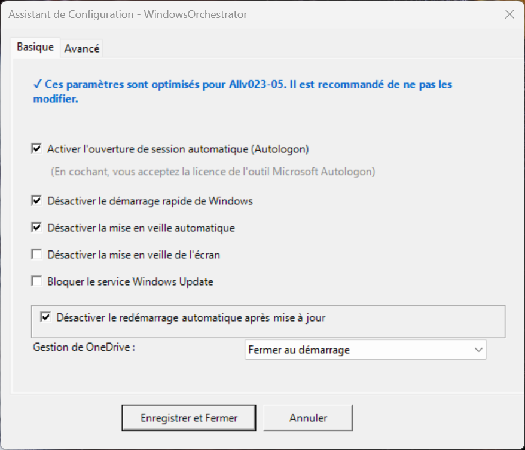
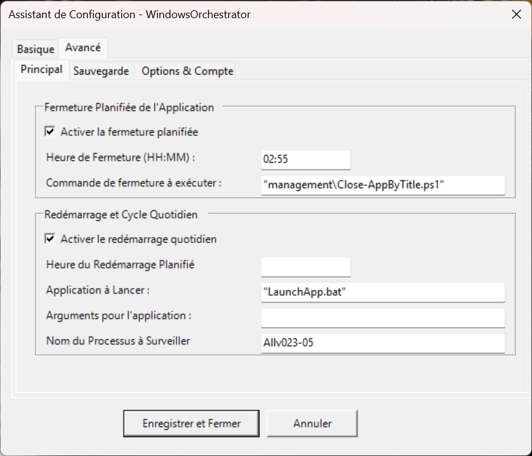
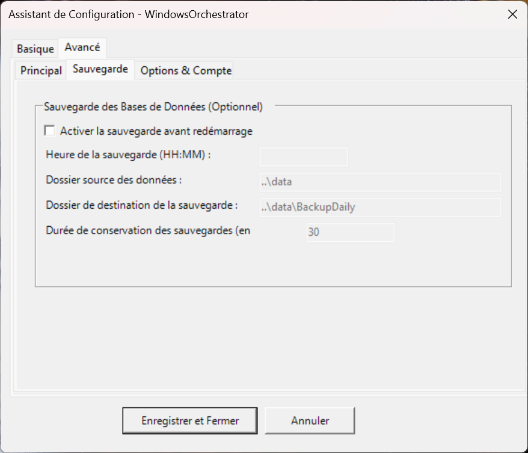
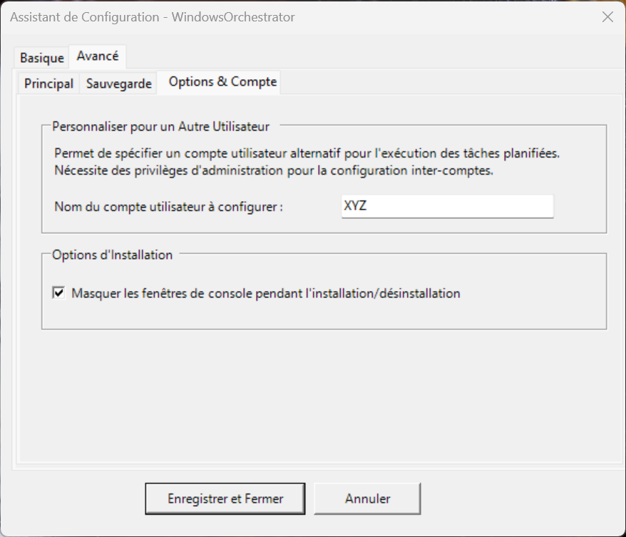

# Guide Utilisateur - WindowsOrchestrator 1.73

📘 **[GUIDE DU DÉVELOPPEUR](GUIDE_DU_DEVELOPPEUR.md)**
*Destiné aux administrateurs système et techniciens de déploiement.*

🏠 **[Retour à l'accueil](README.md)**
*Retour au portail de la documentation française.*

## Table des matières

1. [Introduction et présentation du projet](#1-introduction-et-présentation-du-projet)
    1.1. [Qu'est-ce que WindowsOrchestrator ?](#11-quest-ce-que-windowsorchestrator-)
    1.2. [Nature technique : un outil d'orchestration, pas une installation classique](#12-nature-technique--un-outil-dorchestration-pas-une-installation-classique)
    1.3. [Philosophie de conception](#13-philosophie-de-conception)
    1.4. [Licence et garantie](#14-licence-et-garantie)
2. [Comprendre les implications de sécurité](#2-comprendre-les-implications-de-sécurité)
    2.1. [Désactivation de Windows Update : stabilité vs sécurité](#21-désactivation-de-windows-update--stabilité-vs-sécurité)
        2.1.1. [Le compromis expliqué](#211-le-compromis-expliqué)
        2.1.2. [Quand est-ce acceptable ?](#212-quand-est-ce-acceptable-)
    2.2. [Autologon : disponibilité immédiate vs sécurité physique](#22-autologon--disponibilité-immédiate-vs-sécurité-physique)
        2.2.1. [Fonctionnement technique](#221-fonctionnement-technique)
        2.2.2. [Les risques réels](#222-les-risques-réels)
        2.2.3. [Mitigation des risques](#223-mitigation-des-risques)
    2.3. [Autres options de configuration et leurs implications](#23-autres-options-de-configuration-et-leurs-implications)
        [Désactivation du démarrage rapide](#désactivation-du-démarrage-rapide)
        [Désactivation de la veille](#désactivation-de-la-veille)
        [Blocage de OneDrive](#blocage-de-onedrive)
3. [Outils tiers intégrés](#3-outils-tiers-intégrés)
    3.1. [Microsoft Sysinternals Autologon](#31-microsoft-sysinternals-autologon)
        3.1.1. [Rôle et sécurité](#311-rôle-et-sécurité)
        3.1.2. [Documentation et support](#312-documentation-et-support)
    3.2. [Gotify (notifications - optionnel)](#32-gotify-notifications---optionnel)
        3.2.1. [Présentation et usage](#321-présentation-et-usage)
        3.2.2. [Configuration requise](#322-configuration-requise)
        3.2.3. [Ressources](#323-ressources)
4. [Installation et configuration](#4-installation-et-configuration)
    4.1. [Prérequis système](#41-prérequis-système)
        4.1.1. [Système d'exploitation](#411-système-dexploitation)
        4.1.2. [Privilèges et environnement](#412-privilèges-et-environnement)
    4.2. [Préparation de l'environnement](#42-préparation-de-lenvironnement)
        4.2.1. [Téléchargement et extraction](#421-téléchargement-et-extraction)
        4.2.2. [Vérification de l'intégrité](#422-vérification-de-lintégrité)
    4.3. [Lancement de l'installation](#43-lancement-de-linstallation)
        4.3.1. [Démarrage de l'assistant](#431-démarrage-de-lassistant)
    4.4. [Configuration via l'assistant graphique](#44-configuration-via-lassistant-graphique)
        4.4.1. [Onglet "Basique" - Paramètres essentiels](#441-onglet-basique---paramètres-essentiels)
            [Section : Gestion de la session automatique](#section--gestion-de-la-session-automatique)
            [Section : Paramètres Windows](#section--paramètres-windows)
            [Section : Gestion de OneDrive](#section--gestion-de-onedrive)
        4.4.2. [Onglet "Avancées" - Sous-onglet "Principal"](#442-onglet-avancées---sous-onglet-principal)
            [GroupBox : Fermeture planifiée de l'application](#groupbox--fermeture-planifiée-de-lapplication)
            [GroupBox : Application principale et cycle quotidien](#groupbox--application-principale-et-cycle-quotidien)
        4.4.3. [Onglet "Avancées" - Sous-onglet "Sauvegarde"](#443-onglet-avancées---sous-onglet-sauvegarde)
            [GroupBox : Sauvegarde des bases de données (Optionnel)](#groupbox--sauvegarde-des-bases-de-données-optionnel)
        4.4.4. [Onglet "Avancées" - Sous-onglet "Options & Compte"](#444-onglet-avancées---sous-onglet-options--compte)
            [GroupBox : Personnaliser pour un autre utilisateur](#groupbox--personnaliser-pour-un-autre-utilisateur)
            [GroupBox : Options d'installation](#groupbox--options-dinstallation)
    4.5. [Étape d'installation automatique](#45-étape-dinstallation-automatique)
        4.5.1. [Validation et sauvegarde](#451-validation-et-sauvegarde)
        4.5.2. [Assistant Autologon (si activé)](#452-assistant-autologon-si-activé)
            [Téléchargement automatique (si l'outil est absent)](#téléchargement-automatique-si-loutil-est-absent)
            [Acceptation de la licence (EULA)](#acceptation-de-la-licence-eula)
            [Configuration du compte](#configuration-du-compte)
        4.5.3. [Création des tâches planifiées](#453-création-des-tâches-planifiées)
        4.5.4. [Exécution initiale](#454-exécution-initiale)
        4.5.5. [Sortie](#455-sortie)
    4.6. [Vérification post-installation](#46-vérification-post-installation)
        4.6.1. [Contrôle visuel](#461-contrôle-visuel)
        4.6.2. [Contrôle des logs](#462-contrôle-des-logs)
        4.6.3. [Test du redémarrage](#463-test-du-redémarrage)
5. [Vie quotidienne et cycle de fonctionnement](#5-vie-quotidienne-et-cycle-de-fonctionnement)
    5.1. [Le cycle automatisé quotidien](#51-le-cycle-automatisé-quotidien)
        5.1.1. [Chronologie type d'une journée](#511-chronologie-type-dune-journée)
            [Phase 1 : Utilisation normale (00:00 → Heure de fermeture)](#phase-1--utilisation-normale-0000--heure-de-fermeture)
            [Phase 2 : Fermeture de l'application (exemple : 02:50)](#phase-2--fermeture-de-lapplication-exemple--0250)
            [Phase 3 : Sauvegarde des données (exemple : 02:57)](#phase-3--sauvegarde-des-données-exemple--0257)
            [Phase 4 : Redémarrage planifié (exemple : 02:59)](#phase-4--redémarrage-planifié-exemple--0259)
            [Phase 5 : Démarrage à froid (00:00+)](#phase-5--démarrage-à-froid-0000)
            [Phase 6 : Configuration système (00:01+)](#phase-6--configuration-système-0001)
            [Phase 7 : Ouverture de session (00:01+)](#phase-7--ouverture-de-session-0001)
            [Phase 8 : Lancement de l'application (00:02+)](#phase-8--lancement-de-lapplication-0002)
        5.1.2. [Comprendre les contextes d'exécution](#512-comprendre-les-contextes-dexécution)
            [Contexte SYSTEM](#contexte-system)
            [Contexte utilisateur](#contexte-utilisateur)
    5.2. [Surveillance et vérification](#52-surveillance-et-vérification)
        5.2.1. [Localisation et lecture des fichiers logs](#521-localisation-et-lecture-des-fichiers-logs)
            [Les fichiers à consulter](#les-fichiers-à-consulter)
            [Archivage automatique](#archivage-automatique)
            [Lecture manuelle des logs](#lecture-manuelle-des-logs)
            [Lecture avancée avec PowerShell](#lecture-avancée-avec-powershell)
        5.2.2. [Interprétation des notifications Gotify](#522-interprétation-des-notifications-gotify)
        5.2.3. [Surveillance du cycle quotidien](#523-surveillance-du-cycle-quotidien)
        5.2.4. [Vérification de l'état du système](#524-vérification-de-létat-du-système)
6. [Maintenance et modification](#6-maintenance-et-modification)
    6.1. [Modification des paramètres après installation](#61-modification-des-paramètres-après-installation)
        6.1.1. [Méthode A : Édition manuelle de config.ini (avancé)](#611-méthode-a--édition-manuelle-de-configini-avancé)
            [Prise en compte des changements](#prise-en-compte-des-changements)
        6.1.2. [Méthode B : Réutilisation de l'interface graphique (recommandé)](#612-méthode-b--réutilisation-de-linterface-graphique-recommandé)
    6.2. [Ajout ou suppression de tâches planifiées](#62-ajout-ou-suppression-de-tâches-planifiées)
        6.2.1. [Ajout d'une tâche personnalisée](#621-ajout-dune-tâche-personnalisée)
        6.2.2. [Suppression d'une tâche](#622-suppression-dune-tâche)
    6.3. [Mise à jour de WindowsOrchestrator](#63-mise-à-jour-de-windowsorchestrator)
7. [Procédures de désinstallation](#7-procédures-de-désinstallation)
    7.1. [Méthode A : Désinstallation propre (recommandée)](#71-méthode-a--désinstallation-propre-recommandée)
        7.1.1. [Exécution du script Uninstall.bat](#711-exécution-du-script-uninstallbat)
        7.1.2. [Périmètre de la restauration](#712-périmètre-de-la-restauration)
            [Tâches planifiées](#tâches-planifiées)
            [Windows Update](#windows-update)
            [OneDrive](#onedrive)
            [Démarrage rapide](#démarrage-rapide)
        7.1.3. [Gestion du nettoyage Autologon](#713-gestion-du-nettoyage-autologon)
    7.2. [Méthode B : Arrêt d'urgence manuel](#72-méthode-b--arrêt-durgence-manuel)
        7.2.1. [Procédure via le Planificateur de tâches](#721-procédure-via-le-planificateur-de-tâches)
        7.2.2. [Avertissement sur la persistance des modifications registre](#722-avertissement-sur-la-persistance-des-modifications-registre)
        7.2.3. [Restauration manuelle des paramètres (avancé)](#723-restauration-manuelle-des-paramètres-avancé)
            [Réactivation Windows Update](#réactivation-windows-update)
            [Réactivation Fast Startup](#réactivation-fast-startup)
            [Réactivation OneDrive](#réactivation-onedrive)
            [Désactivation Autologon (via registre)](#désactivation-autologon-via-registre)
8. [Dépannage et FAQ](#8-dépannage-et-faq)
    8.1. [L'application ne démarre pas au démarrage](#81-lapplication-ne-démarre-pas-au-démarrage)
        [Diagnostic](#diagnostic)
        [Causes possibles](#causes-possibles)
        [Solution](#solution)
    8.2. [Le redémarrage planifié ne fonctionne pas](#82-le-redémarrage-planifié-ne-fonctionne-pas)
        [Diagnostic](#diagnostic-1)
        [Causes possibles](#causes-possibles-1)
        [Solution](#solution-1)
    8.3. [La sauvegarde échoue avec "Permissions insuffisantes"](#83-la-sauvegarde-échoue-avec-permissions-insuffisantes)
        [Diagnostic](#diagnostic-2)
        [Causes possibles](#causes-possibles-2)
        [Solution](#solution-2)
    8.4. [L'autologon ne fonctionne pas après installation](#84-lautologon-ne-fonctionne-pas-après-installation)
        [Diagnostic](#diagnostic-3)
        [Causes possibles](#causes-possibles-3)
        [Vérification registre](#vérification-registre)
        [Solution](#solution-3)
    8.5. [Le mode silencieux ne masque pas les fenêtres](#85-le-mode-silencieux-ne-masque-pas-les-fenêtres)
        [Diagnostic](#diagnostic-4)
        [Causes possibles](#causes-possibles-4)
        [Solution](#solution-4)
    8.6. [Le Splash Screen reste bloqué indéfiniment](#86-le-splash-screen-reste-bloqué-indéfiniment)
        [Diagnostic](#diagnostic-5)
        [Causes possibles](#causes-possibles-5)
        [Solution d'urgence](#solution-durgence)
        [Solution permanente](#solution-permanente)
9. [Annexes](#9-annexes)
    9.1. [Structure complète du fichier config.ini](#91-structure-complète-du-fichier-configini)
    9.2. [Codes de sortie des scripts](#92-codes-de-sortie-des-scripts)
    9.3. [Emplacements des fichiers critiques](#93-emplacements-des-fichiers-critiques)
    9.4. [Support et ressources](#94-support-et-ressources)

## Table des matières

1. [Introduction et présentation du projet](#1-introduction-et-présentation-du-projet)
    1.1. [Qu'est-ce que WindowsOrchestrator ?](#11-quest-ce-que-windowsorchestrator-)
    1.2. [Nature technique : un outil d'orchestration, pas une installation classique](#12-nature-technique--un-outil-dorchestration-pas-une-installation-classique)
    1.3. [Philosophie de conception](#13-philosophie-de-conception)
    1.4. [Licence et garantie](#14-licence-et-garantie)
2. [Comprendre les implications de sécurité](#2-comprendre-les-implications-de-sécurité)
    2.1. [Désactivation de Windows Update : stabilité vs sécurité](#21-désactivation-de-windows-update--stabilité-vs-sécurité)
        2.1.1. [Le compromis expliqué](#211-le-compromis-expliqué)
        2.1.2. [Quand est-ce acceptable ?](#212-quand-est-ce-acceptable-)
    2.2. [Autologon : disponibilité immédiate vs sécurité physique](#22-autologon--disponibilité-immédiate-vs-sécurité-physique)
        2.2.1. [Fonctionnement technique](#221-fonctionnement-technique)
        2.2.2. [Les risques réels](#222-les-risques-réels)
        2.2.3. [Mitigation des risques](#223-mitigation-des-risques)
    2.3. [Autres options de configuration et leurs implications](#23-autres-options-de-configuration-et-leurs-implications)
        [Désactivation du démarrage rapide](#désactivation-du-démarrage-rapide)
        [Désactivation de la veille](#désactivation-de-la-veille)
        [Blocage de OneDrive](#blocage-de-onedrive)
3. [Outils tiers intégrés](#3-outils-tiers-intégrés)
    3.1. [Microsoft Sysinternals Autologon](#31-microsoft-sysinternals-autologon)
        3.1.1. [Rôle et sécurité](#311-rôle-et-sécurité)
        3.1.2. [Documentation et support](#312-documentation-et-support)
    3.2. [Gotify (notifications - optionnel)](#32-gotify-notifications---optionnel)
        3.2.1. [Présentation et usage](#321-présentation-et-usage)
        3.2.2. [Configuration requise](#322-configuration-requise)
        3.2.3. [Ressources](#323-ressources)
4. [Installation et configuration](#4-installation-et-configuration)
    4.1. [Prérequis système](#41-prérequis-système)
        4.1.1. [Système d'exploitation](#411-système-dexploitation)
        4.1.2. [Privilèges et environnement](#412-privilèges-et-environnement)
    4.2. [Préparation de l'environnement](#42-préparation-de-lenvironnement)
        4.2.1. [Téléchargement et extraction](#421-téléchargement-et-extraction)
        4.2.2. [Vérification de l'intégrité](#422-vérification-de-lintégrité)
    4.3. [Lancement de l'installation](#43-lancement-de-linstallation)
        4.3.1. [Démarrage de l'assistant](#431-démarrage-de-lassistant)
    4.4. [Configuration via l'assistant graphique](#44-configuration-via-lassistant-graphique)
        4.4.1. [Onglet "Basique" - Paramètres essentiels](#441-onglet-basique---paramètres-essentiels)
            [Section : Gestion de la session automatique](#section--gestion-de-la-session-automatique)
            [Section : Paramètres Windows](#section--paramètres-windows)
            [Section : Gestion de OneDrive](#section--gestion-de-onedrive)
        4.4.2. [Onglet "Avancées" - Sous-onglet "Principal"](#442-onglet-avancées---sous-onglet-principal)
            [GroupBox : Fermeture planifiée de l'application](#groupbox--fermeture-planifiée-de-lapplication)
            [GroupBox : Application principale et cycle quotidien](#groupbox--application-principale-et-cycle-quotidien)
        4.4.3. [Onglet "Avancées" - Sous-onglet "Sauvegarde"](#443-onglet-avancées---sous-onglet-sauvegarde)
            [GroupBox : Sauvegarde des bases de données (Optionnel)](#groupbox--sauvegarde-des-bases-de-données-optionnel)
        4.4.4. [Onglet "Avancées" - Sous-onglet "Options & Compte"](#444-onglet-avancées---sous-onglet-options--compte)
            [GroupBox : Personnaliser pour un autre utilisateur](#groupbox--personnaliser-pour-un-autre-utilisateur)
            [GroupBox : Options d'installation](#groupbox--options-dinstallation)
    4.5. [Étape d'installation automatique](#45-étape-dinstallation-automatique)
        4.5.1. [Validation et sauvegarde](#451-validation-et-sauvegarde)
        4.5.2. [Assistant Autologon (si activé)](#452-assistant-autologon-si-activé)
            [Téléchargement automatique (si l'outil est absent)](#téléchargement-automatique-si-loutil-est-absent)
            [Acceptation de la licence (EULA)](#acceptation-de-la-licence-eula)
            [Configuration du compte](#configuration-du-compte)
        4.5.3. [Création des tâches planifiées](#453-création-des-tâches-planifiées)
        4.5.4. [Exécution initiale](#454-exécution-initiale)
        4.5.5. [Sortie](#455-sortie)
    4.6. [Vérification post-installation](#46-vérification-post-installation)
        4.6.1. [Contrôle visuel](#461-contrôle-visuel)
        4.6.2. [Contrôle des logs](#462-contrôle-des-logs)
        4.6.3. [Test du redémarrage](#463-test-du-redémarrage)
5. [Vie quotidienne et cycle de fonctionnement](#5-vie-quotidienne-et-cycle-de-fonctionnement)
    5.1. [Le cycle automatisé quotidien](#51-le-cycle-automatisé-quotidien)
        5.1.1. [Chronologie type d'une journée](#511-chronologie-type-dune-journée)
            [Phase 1 : Utilisation normale (00:00 → Heure de fermeture)](#phase-1--utilisation-normale-0000--heure-de-fermeture)
            [Phase 2 : Fermeture de l'application (exemple : 02:50)](#phase-2--fermeture-de-lapplication-exemple--0250)
            [Phase 3 : Sauvegarde des données (exemple : 02:57)](#phase-3--sauvegarde-des-données-exemple--0257)
            [Phase 4 : Redémarrage planifié (exemple : 02:59)](#phase-4--redémarrage-planifié-exemple--0259)
            [Phase 5 : Démarrage à froid (00:00+)](#phase-5--démarrage-à-froid-0000)
            [Phase 6 : Configuration système (00:01+)](#phase-6--configuration-système-0001)
            [Phase 7 : Ouverture de session (00:01+)](#phase-7--ouverture-de-session-0001)
            [Phase 8 : Lancement de l'application (00:02+)](#phase-8--lancement-de-lapplication-0002)
        5.1.2. [Comprendre les contextes d'exécution](#512-comprendre-les-contextes-dexécution)
            [Contexte SYSTEM](#contexte-system)
            [Contexte utilisateur](#contexte-utilisateur)
    5.2. [Surveillance et vérification](#52-surveillance-et-vérification)
        5.2.1. [Localisation et lecture des fichiers logs](#521-localisation-et-lecture-des-fichiers-logs)
            [Les fichiers à consulter](#les-fichiers-à-consulter)
            [Archivage automatique](#archivage-automatique)
            [Lecture manuelle des logs](#lecture-manuelle-des-logs)
            [Lecture avancée avec PowerShell](#lecture-avancée-avec-powershell)
        5.2.2. [Interprétation des notifications Gotify](#522-interprétation-des-notifications-gotify)
        5.2.3. [Surveillance du cycle quotidien](#523-surveillance-du-cycle-quotidien)
        5.2.4. [Vérification de l'état du système](#524-vérification-de-létat-du-système)
6. [Maintenance et modification](#6-maintenance-et-modification)
    6.1. [Modification des paramètres après installation](#61-modification-des-paramètres-après-installation)
        6.1.1. [Méthode A : Édition manuelle de config.ini (avancé)](#611-méthode-a--édition-manuelle-de-configini-avancé)
            [Prise en compte des changements](#prise-en-compte-des-changements)
        6.1.2. [Méthode B : Réutilisation de l'interface graphique (recommandé)](#612-méthode-b--réutilisation-de-linterface-graphique-recommandé)
    6.2. [Ajout ou suppression de tâches planifiées](#62-ajout-ou-suppression-de-tâches-planifiées)
        6.2.1. [Ajout d'une tâche personnalisée](#621-ajout-dune-tâche-personnalisée)
        6.2.2. [Suppression d'une tâche](#622-suppression-dune-tâche)
    6.3. [Mise à jour de WindowsOrchestrator](#63-mise-à-jour-de-windowsorchestrator)
7. [Procédures de désinstallation](#7-procédures-de-désinstallation)
    7.1. [Méthode A : Désinstallation propre (recommandée)](#71-méthode-a--désinstallation-propre-recommandée)
        7.1.1. [Exécution du script Uninstall.bat](#711-exécution-du-script-uninstallbat)
        7.1.2. [Périmètre de la restauration](#712-périmètre-de-la-restauration)
            [Tâches planifiées](#tâches-planifiées)
            [Windows Update](#windows-update)
            [OneDrive](#onedrive)
            [Démarrage rapide](#démarrage-rapide)
        7.1.3. [Gestion du nettoyage Autologon](#713-gestion-du-nettoyage-autologon)
    7.2. [Méthode B : Arrêt d'urgence manuel](#72-méthode-b--arrêt-durgence-manuel)
        7.2.1. [Procédure via le Planificateur de tâches](#721-procédure-via-le-planificateur-de-tâches)
        7.2.2. [Avertissement sur la persistance des modifications registre](#722-avertissement-sur-la-persistance-des-modifications-registre)
        7.2.3. [Restauration manuelle des paramètres (avancé)](#723-restauration-manuelle-des-paramètres-avancé)
            [Réactivation Windows Update](#réactivation-windows-update)
            [Réactivation Fast Startup](#réactivation-fast-startup)
            [Réactivation OneDrive](#réactivation-onedrive)
            [Désactivation Autologon (via registre)](#désactivation-autologon-via-registre)
8. [Dépannage et FAQ](#8-dépannage-et-faq)
    8.1. [L'application ne démarre pas au démarrage](#81-lapplication-ne-démarre-pas-au-démarrage)
        [Diagnostic](#diagnostic)
        [Causes possibles](#causes-possibles)
        [Solution](#solution)
    8.2. [Le redémarrage planifié ne fonctionne pas](#82-le-redémarrage-planifié-ne-fonctionne-pas)
        [Diagnostic](#diagnostic-1)
        [Causes possibles](#causes-possibles-1)
        [Solution](#solution-1)
    8.3. [La sauvegarde échoue avec "Permissions insuffisantes"](#83-la-sauvegarde-échoue-avec-permissions-insuffisantes)
        [Diagnostic](#diagnostic-2)
        [Causes possibles](#causes-possibles-2)
        [Solution](#solution-2)
    8.4. [L'autologon ne fonctionne pas après installation](#84-lautologon-ne-fonctionne-pas-après-installation)
        [Diagnostic](#diagnostic-3)
        [Causes possibles](#causes-possibles-3)
        [Vérification registre](#vérification-registre)
        [Solution](#solution-3)
    8.5. [Le mode silencieux ne masque pas les fenêtres](#85-le-mode-silencieux-ne-masque-pas-les-fenêtres)
        [Diagnostic](#diagnostic-4)
        [Causes possibles](#causes-possibles-4)
        [Solution](#solution-4)
    8.6. [Le Splash Screen reste bloqué indéfiniment](#86-le-splash-screen-reste-bloqué-indéfiniment)
        [Diagnostic](#diagnostic-5)
        [Causes possibles](#causes-possibles-5)
        [Solution d'urgence](#solution-durgence)
        [Solution permanente](#solution-permanente)
9. [Annexes](#9-annexes)
    9.1. [Structure complète du fichier config.ini](#91-structure-complète-du-fichier-configini)
    9.2. [Codes de sortie des scripts](#92-codes-de-sortie-des-scripts)
    9.3. [Emplacements des fichiers critiques](#93-emplacements-des-fichiers-critiques)
    9.4. [Support et ressources](#94-support-et-ressources)

---

## 1. Introduction et présentation du projet

### 1.1. Qu'est-ce que WindowsOrchestrator ?

WindowsOrchestrator est un ensemble de scripts PowerShell conçu pour automatiser la gestion d'un poste de travail Windows. Il transforme une machine standard en système autonome capable de :

- Démarrer automatiquement une application métier sans intervention humaine
- Se redémarrer quotidiennement selon un planning défini
- Sauvegarder automatiquement les données sensibles
- Maintenir des paramètres système optimisés pour la stabilité

Le projet s'adresse principalement aux environnements professionnels : bornes interactives, affichage dynamique, postes en production continue, ou tout système devant fonctionner en permanence avec un minimum de maintenance.

### 1.2. Nature technique : un outil d'orchestration, pas une installation classique

WindowsOrchestrator ne s'installe pas comme un logiciel traditionnel. Il ne copie aucun fichier dans `C:\Program Files` ou `C:\Windows`, et n'apparaît pas dans la liste des applications installées du système.

Les scripts restent dans le dossier que vous avez téléchargé. L'installation configure le Planificateur de tâches Windows pour exécuter ces scripts aux moments appropriés. Les tâches planifiées pointent directement vers les fichiers présents dans votre dossier.

Le dossier du projet ne doit jamais être déplacé ou supprimé après installation. Si vous devez le déplacer, vous devez d'abord désinstaller, déplacer le dossier, puis réinstaller depuis le nouvel emplacement.

### 1.3. Philosophie de conception

WindowsOrchestrator repose sur trois principes fondamentaux.

Aucune manipulation cachée du système. Chaque action est documentée et traçable dans les journaux. Le code source est ouvert et auditable.

L'outil n'applique que ce que vous configurez explicitement. Aucune décision automatique sur les paramètres critiques. Désinstallation possible à tout moment.

Certaines options réduisent la sécurité par conception. L'outil ne remplace pas une stratégie de sauvegarde professionnelle. L'administrateur reste responsable de la sécurité et de la pérennité des données.

### 1.4. Licence et garantie

Ce logiciel est distribué sous licence GNU General Public License v3.0 (GPLv3). Vous êtes libre de l'utiliser, le modifier et le redistribuer selon les termes de cette licence. Le code source est accessible et modifiable.

Le logiciel est fourni en l'état, sans garantie d'aucune sorte. Les auteurs ne peuvent être tenus responsables des dommages directs ou indirects résultant de son utilisation, notamment la perte de données, l'interruption de service ou les problèmes de compatibilité système.

Vous devez tester le logiciel dans un environnement non-critique avant déploiement, maintenir des sauvegardes externes indépendantes et vérifier la compatibilité avec vos applications métier.

---

## 2. Comprendre les implications de sécurité

WindowsOrchestrator offre des fonctionnalités puissantes qui nécessitent la désactivation de certains mécanismes de sécurité Windows. Cette section explique les risques et les bonnes pratiques.

### 2.1. Désactivation de Windows Update : stabilité vs sécurité

#### 2.1.1. Le compromis expliqué

La désactivation des mises à jour garantit la stabilité : l'environnement logiciel reste figé et prédictible. Elle évite les redémarrages intempestifs qui interrompent le service et empêche les modifications de comportement de Windows entre versions.

Les risques encourus sont réels : les vulnérabilités de sécurité ne sont plus corrigées, la machine devient vulnérable aux attaques automatisées, et cela peut créer une non-conformité avec certaines politiques informatiques d'entreprise.

#### 2.1.2. Quand est-ce acceptable ?

La désactivation de Windows Update est acceptable uniquement si toutes ces conditions sont réunies.

La machine n'est pas directement exposée à Internet. Elle doit être derrière un pare-feu professionnel, sur un VLAN séparé du réseau principal, sans navigation web ni email.

Le besoin de stabilité est critique : le moindre redémarrage cause un préjudice. Cela concerne les affichages permanents en aéroport ou gare, les chaînes de production industrielle, ou les systèmes de surveillance en continu.

Vous avez une procédure pour appliquer les mises à jour manuellement : fenêtre de maintenance mensuelle, réactivation temporaire de Windows Update, test des mises à jour sur un poste similaire.

Si ces conditions ne sont pas remplies, laissez Windows Update activé et ajustez simplement la stratégie de redémarrage via `DisableAutoReboot=true`.

### 2.2. Autologon : disponibilité immédiate vs sécurité physique

#### 2.2.1. Fonctionnement technique

Lorsque l'autologon est activé, Windows démarre directement sur le bureau sans écran de connexion. Le mot de passe est stocké de manière chiffrée dans le LSA (Local Security Authority). L'outil officiel Microsoft Sysinternals Autologon est utilisé pour cette opération.

#### 2.2.2. Les risques réels

Le mot de passe reste chiffré et non visible dans le registre. L'accès réseau authentifié est préservé. Le chiffrement BitLocker (si activé) protège les données au repos.

Cependant, toute personne avec accès physique peut utiliser la session ouverte. Les fichiers et documents de l'utilisateur sont accessibles. Les applications ouvertes peuvent être manipulées. Un simple redémarrage suffit pour accéder au système.

#### 2.2.3. Mitigation des risques

Créez un compte utilisateur spécifique pour l'autologon, sans droits administrateur local, avec un accès limité aux seuls dossiers nécessaires à l'application, et sans accès aux partages réseau sensibles.

Sécurisez physiquement la machine : boîtier fermé à clé, salle à accès restreint, désactivation du port USB en BIOS pour empêcher les clés USB bootables.

Activez BitLocker pour chiffrer le disque dur et protéger les données en cas de vol de la machine. Notez que BitLocker ne protège pas une fois le système démarré.

L'autologon est adapté aux bornes d'affichage en zone publique avec compte lecture seule, aux postes de production en usine dans des zones sécurisées, ou aux systèmes embarqués sans interface physique. Il est déconseillé sur les postes administrateur avec privilèges élevés, les machines stockant des données sensibles non chiffrées, ou les environnements accessibles au public sans supervision.

### 2.3. Autres options de configuration et leurs implications

#### Désactivation du démarrage rapide

La désactivation du démarrage rapide force un vrai redémarrage sans hibernation. Elle recharge complètement les pilotes et services. Le temps de démarrage est légèrement plus long. Cela évite les problèmes de mémoire fantôme après plusieurs semaines sans redémarrage complet.

#### Désactivation de la veille

Sur un ordinateur portable, la désactivation de la veille entraîne une décharge complète de la batterie en cas d'oubli, une chauffe continue de la machine et une usure prématurée des composants. Cette option est réservée aux postes fixes en production continue.

#### Blocage de OneDrive

Le blocage de OneDrive a un impact minimal car OneDrive n'est généralement pas critique pour l'exploitation. L'avantage est d'économiser des ressources système et d'éviter les synchronisations intempestives.

---

## 3. Outils tiers intégrés

### 3.1. Microsoft Sysinternals Autologon

#### 3.1.1. Rôle et sécurité

WindowsOrchestrator ne gère jamais directement les mots de passe. Cette responsabilité critique est déléguée à l'outil officiel Microsoft Autologon.

Aucun mot de passe n'est jamais écrit dans `config.ini` ou les scripts PowerShell. Le mot de passe est chiffré via l'API LSA de Windows, utilisant la même méthode que les services Windows. Le chiffrement est lié à la machine et non exportable.

Le processus d'installation télécharge automatiquement l'outil depuis `live.sysinternals.com` (URL officielle Microsoft), vérifie son intégrité en confirmant la présence de `Eula.txt` et de l'exécutable, demande l'acceptation de la licence par l'utilisateur, permet la saisie interactive des identifiants dans l'interface Autologon, puis effectue le chiffrement automatique.

#### 3.1.2. Documentation et support

Page officielle : <https://learn.microsoft.com/sysinternals/downloads/autologon>

Éditeur : Microsoft Corporation

Licence : Propriétaire Microsoft (gratuit)

Prise en charge : Windows 7 à Windows 11

En cas de problème de téléchargement, téléchargez manuellement `Autologon.zip` depuis le site Microsoft, extrayez tous les fichiers dans `management/tools/Autologon/`, puis relancez l'installation.

### 3.2. Gotify (notifications - optionnel)

#### 3.2.1. Présentation et usage

Gotify est un serveur de notifications push auto-hébergé qui permet de surveiller l'état de la machine à distance.

Les cas d'usage typiques concernent les machines installées dans une salle serveur sans écran, la supervision de multiples bornes depuis un tableau de bord central, ou les alertes par smartphone via l'application Gotify.

Les scripts envoient des messages HTTP vers votre serveur Gotify. Vous recevez des notifications : démarrage réussi, application lancée, erreur critique. Les logs détaillés restent dans les fichiers locaux.

#### 3.2.2. Configuration requise

Pour utiliser Gotify, vous devez héberger votre propre instance Gotify (serveur Linux, Docker, etc.), créer une application dans l'interface Gotify, récupérer le token d'authentification, puis remplir la section `[Gotify]` dans `config.ini`.

Aucune donnée n'est envoyée vers des serveurs tiers. Vous contrôlez entièrement l'infrastructure de notification. Le système est désactivable simplement en laissant la section vide.

#### 3.2.3. Ressources

Site officiel : <https://gotify.net/>

Code source : <https://github.com/gotify/server>

Licence : MIT (Open Source)

---

## 4. Installation et configuration

### 4.1. Prérequis système

#### 4.1.1. Système d'exploitation

WindowsOrchestrator est compatible avec Windows 10 (version 1809 ou ultérieure recommandée), Windows 11 (toutes versions), Windows Server 2016, 2019, 2022 (support non testé officiellement).

Les éditions Professionnel et Entreprise sont pleinement supportées. L'édition Famille est fonctionnelle mais certaines GPO peuvent être limitées.

#### 4.1.2. Privilèges et environnement

Le compte utilisé pour l'installation doit disposer de privilèges Administrateur local. Ces droits sont nécessaires pour modifier le registre HKLM, créer des tâches planifiées et gérer les services.

PowerShell version 5.1 minimum est requis (inclus par défaut dans Windows 10+). La politique d'exécution est gérée automatiquement par les scripts via `-ExecutionPolicy Bypass`.

Une connexion Internet est optionnelle. Elle n'est nécessaire que si `UseAutologonAssistant=true` et que Autologon.exe est absent. Le système peut fonctionner en mode offline si l'outil est déjà présent.

### 4.2. Préparation de l'environnement

#### 4.2.1. Téléchargement et extraction

Téléchargez l'archive du projet depuis GitHub. Extrayez le contenu dans un dossier permanent, par exemple `C:\WindowsOrchestrator\` ou `D:\Automation\WO\`. N'installez pas dans `C:\Program Files\` à cause des problèmes de permissions. Évitez le Bureau ou le dossier Téléchargements qui risquent d'être nettoyés.

#### 4.2.2. Vérification de l'intégrité

Structure attendue du projet :

```
WindowsOrchestrator/
├── Install.bat
├── Uninstall.bat
├── config.ini (sera créé lors de l'installation)
├── management/
│   ├── firstconfig.ps1
│   ├── install.ps1
│   ├── uninstall.ps1
│   ├── config_systeme.ps1
│   ├── config_utilisateur.ps1
│   ├── Invoke-DatabaseBackup.ps1
│   ├── Launch-Install.ps1
│   ├── Launch-Uninstall.ps1
│   ├── modules/
│   │   └── WindowsOrchestratorUtils/
│   └── defaults/
│       └── default_config.ini
└── i18n/
    ├── en-US/
    └── fr-FR/
```

### 4.3. Lancement de l'installation

#### 4.3.1. Démarrage de l'assistant

Localisez le fichier `Install.bat` à la racine du projet. Double-cliquez sur `Install.bat`. Une fenêtre de console s'ouvre et l'assistant de configuration graphique `firstconfig.ps1` apparaît.

Configurez les paramètres souhaités via l'interface graphique. Une fois la configuration validée en cliquant sur "Enregistrer et Fermer", le Contrôle de compte d'utilisateur (UAC) s'affiche. Cliquez sur "Oui" pour autoriser l'exécution avec les privilèges administrateur.

### 4.4. Configuration via l'assistant graphique

L'assistant `firstconfig.ps1` permet de générer le fichier `config.ini` de manière intuitive. L'assistant est désormais organisé en **4 sous-onglets** (Principal, Sauvegarde, Autre compte, Options) pour une clarté optimale.

#### 4.4.1. Onglet "Basique" - Paramètres essentiels



##### Section : Gestion de la session automatique

La case "Activer l'ouverture de session automatique (Autologon)" déclenche l'autologon si cochée. Si elle est décochée, la session manuelle classique avec écran de connexion est maintenue.

Une note indique qu'en cochant, vous acceptez la licence de l'outil Microsoft Autologon.

##### Section : Paramètres Windows

"Désactiver le démarrage rapide de Windows" est recommandé. Cette option force un redémarrage complet quotidien en désactivant l'hibernation partielle de Windows.

"Désactiver la mise en veille automatique" empêche le système d'entrer en veille (S3/S4). Attention : sur un portable, cette option décharge la batterie.

"Désactiver la mise en veille de l'écran" garde l'écran allumé en permanence. C'est utile pour l'affichage dynamique ou les tableaux de bord.

"Bloquer le service Windows Update" désactive complètement les mises à jour automatiques. Relisez la section 2.1 avant d'activer cette option. Si vous la cochez, une sous-option "Désactiver le redémarrage automatique après mise à jour" devient disponible.

##### Section : Gestion de OneDrive

Un menu déroulant propose trois choix.

"Bloquer (politique système)" interdit l'exécution de OneDrive via GPO. Cette option est recommandée pour les bornes et kiosques.

"Fermer au démarrage" tue le processus OneDrive.exe au boot. OneDrive peut être relancé manuellement par la suite.

"Ne rien faire" laisse OneDrive fonctionner normalement.

#### Indication de pré-configuration (Configuration figée)

Lorsque l'option `ShowContextMessages` est active, un bandeau bleu apparaît en haut de la fenêtre. Il sert simplement à signaler que la configuration a déjà été définie en interne, afin d'éviter les mauvais réglages. Le message d'optimisation (bandeau bleu) s'adapte dynamiquement au nom de l'application.



#### 4.4.2. Onglet "Avancé" - Sous-onglet "Principal"



##### GroupBox : Fermeture planifiée de l'application

"Heure de fermeture (HH:MM)" définit le moment où l'application recevra l'ordre de fermeture (ALT+F4). Cette heure doit être antérieure à l'heure de redémarrage. Exemple : `02:50`.

"Commande de fermeture à exécuter" permet de spécifier un script ou exécutable à lancer avant le redémarrage. Laissez vide si aucune action préalable n'est nécessaire. Exemple : `management\Invoke-DatabaseBackup.ps1`.

"Arguments pour la commande" est vide par défaut.

##### GroupBox : Application principale et cycle quotidien

"Heure du redémarrage planifié (HH:MM)" définit le moment où le système redémarre automatiquement. Laissez vide pour désactiver le redémarrage planifié. Exemple : `02:59`.

"Application à lancer" spécifie le chemin vers le fichier de démarrage de votre application. Les formats acceptés sont `.exe`, `.bat`, `.cmd`, `.ps1`. Les chemins relatifs sont calculés depuis la racine du projet. Les chemins absolus sont également acceptés, par exemple `C:\MonApp\start.exe`. Exemple : `LaunchApp.bat`.

"Arguments pour l'application" permet de transmettre des paramètres de ligne de commande. Vide par défaut.

"Nom du processus à surveiller (sans .exe)" est le nom exact du processus final à monitorer. Ce paramètre est crucial car il permet de vérifier si l'application tourne déjà. Laissez vide si vous utilisez un wrapper (.bat) sans surveillance. Exemple : `MyApp`.

"Mode de lancement console" propose deux options. "Lancement standard (recommandé)" utilise le terminal par défaut (Windows Terminal si disponible). "Lancement legacy (console héritée)" force cmd.exe avec nouvelle fenêtre pour la compatibilité avec d'anciens scripts.

La case "Lancer l'application principale réduite dans la barre des tâches" fait démarrer l'application minimisée si elle est cochée. Cette option n'est pas applicable au mode legacy.

#### 4.4.3. Onglet "Avancées" - Sous-onglet "Sauvegarde"



##### GroupBox : Sauvegarde des bases de données (Optionnel)

La case "Activer la sauvegarde avant redémarrage" active le module de copie automatique.

Les champs suivants sont grisés tant que la case n'est pas cochée.

"Heure de la sauvegarde (HH:MM)" doit être configurée 5-10 minutes après l'heure de fermeture pour laisser le temps à l'application de terminer ses écritures. Exemple : `02:57`.

"Dossier source des données" spécifie le chemin relatif ou absolu vers le dossier à sauvegarder. Exemple : `..\data`.

"Dossier de destination de la sauvegarde" définit le chemin où les copies seront stockées. Exemple : `..\data\BackupDaily`.

"Durée de conservation des sauvegardes (en jours)" indique combien de jours les backups sont conservés. Les sauvegardes plus anciennes sont automatiquement supprimées. Exemple : `10`.

#### 4.4.4. Onglet "Avancées" - Sous-onglet "Options & Compte"



##### GroupBox : Personnaliser pour un autre utilisateur

"Nom du compte utilisateur à configurer" permet de spécifier un compte différent de celui qui lance l'installation. Par défaut, c'est l'utilisateur qui exécute l'installation. Cette option permet de configurer l'autologon pour un autre compte. Exemple : `AdminLocal`.

##### GroupBox : Options d'installation

La case "Masquer les fenêtres de console pendant l'installation/désinstallation" active le mode silencieux. Lorsqu'elle est cochée, un splash screen s'affiche au lieu des consoles PowerShell, et une MessageBox finale indique le résultat de l'opération.

### 4.5. Étape d'installation automatique

#### 4.5.1. Validation et sauvegarde

Une fois que vous cliquez sur "Enregistrer et Fermer", l'assistant génère le fichier `config.ini` à la racine du projet. Une boîte de dialogue confirme la sauvegarde : "Configuration enregistrée dans 'C:\WindowsOrchestrator\config.ini'". L'assistant se ferme ensuite automatiquement et le script d'installation `install.ps1` démarre.

#### 4.5.2. Assistant Autologon (si activé)

Si vous avez coché "Activer l'ouverture de session automatique" dans l'assistant, le processus suivant se déclenche.

##### Téléchargement automatique (si l'outil est absent)

Un splash screen indique "Téléchargement de l'outil Microsoft Autologon...". L'outil est extrait dans `management/tools/Autologon/`.

##### Acceptation de la licence (EULA)

Le Bloc-notes s'ouvre affichant le contrat de licence Sysinternals. Lisez le document puis fermez la fenêtre. Une boîte de dialogue demande "Acceptez-vous les termes de la licence de l'outil Autologon de Sysinternals ?". Cliquez sur "Oui" pour continuer ou "Non" pour annuler.

##### Configuration du compte

La fenêtre Autologon.exe s'ouvre. Les champs à remplir sont les suivants.

"Username" contient le nom du compte, généralement pré-rempli avec le nom de l'utilisateur configuré.

"Domain" contient le nom de la machine ou du domaine. Utilisez `.` pour un compte local.

"Password" nécessite la saisie du mot de passe du compte. Ce mot de passe sera chiffré automatiquement.

Cliquez sur le bouton "Enable". Un message confirme que le mot de passe est chiffré et stocké. Fermez la fenêtre. Le splash screen réapparaît pour la suite de l'installation.

#### 4.5.3. Création des tâches planifiées

Le script crée automatiquement les tâches suivantes dans le Planificateur de tâches Windows.

`WindowsOrchestrator-SystemStartup` s'exécute au démarrage du système dans le contexte SYSTEM.

`WindowsOrchestrator-UserLogon` s'exécute à l'ouverture de session dans le contexte de l'utilisateur configuré.

Des tâches dynamiques sont créées si configurées : `WindowsOrchestrator-SystemBackup`, `WindowsOrchestrator-SystemScheduledReboot`, `WindowsOrchestrator-System-CloseApp`, `WindowsOrchestrator-User-CloseApp`.

Vérifiez leur présence en ouvrant le Planificateur de tâches (`Win+R` puis `taskschd.msc`). Les tâches doivent apparaître à la racine de la bibliothèque.

#### 4.5.4. Exécution initiale

Le script lance immédiatement `config_systeme.ps1` pour appliquer la configuration système. Il démarre ensuite la tâche `WindowsOrchestrator-UserLogon` pour lancer l'application.

En mode silencieux, une MessageBox finale indique "Installation de WindowsOrchestrator terminée avec succès ! Tous les journaux ont été enregistrés dans le dossier Logs."

#### 4.5.5. Sortie

Le comportement de sortie dépend de la configuration dans `config.ini`.

Si `RebootOnCompletion=true`, le système redémarre après 15 secondes (configurable via `RebootGracePeriod`).

Si `PowerShellExitMode=automatic`, la console se ferme après 15 secondes (configurable via `PowerShellExitDelay`).

Si `PowerShellExitMode=manual`, vous devez appuyer sur Entrée pour fermer la console.

### 4.6. Vérification post-installation

#### 4.6.1. Contrôle visuel

Ouvrez le Planificateur de tâches (`Win+R` puis `taskschd.msc`). Vérifiez la présence de `WindowsOrchestrator-SystemStartup` et `WindowsOrchestrator-UserLogon`. Faites un clic droit sur chaque tâche, sélectionnez "Propriétés", puis l'onglet "Déclencheurs" pour vérifier les conditions.

#### 4.6.2. Contrôle des logs

Accédez au dossier `C:\WindowsOrchestrator\Logs\`. Ouvrez `config_systeme_ps.txt` et `config_utilisateur_ps.txt`. Vérifiez l'absence de lignes contenant `[ERROR]`.

#### 4.6.3. Test du redémarrage

Redémarrez le PC manuellement. Observez si la session s'ouvre automatiquement (si Autologon est activé). Vérifiez que l'application cible se lance correctement.

---

## 5. Vie quotidienne et cycle de fonctionnement

Une fois WindowsOrchestrator installé, la machine entre dans un cycle de fonctionnement autonome. Vous n'avez plus besoin d'intervenir physiquement sur le poste pour le démarrer ou lancer l'application.

### 5.1. Le cycle automatisé quotidien

#### 5.1.1. Chronologie type d'une journée

##### Flux Domino : Enchaînement logique des tâches

Contrairement à des tâches parallèles, WindowsOrchestrator v1.73 utilise un flux séquentiel "Effet Domino" où les horaires peuvent être calculés automatiquement par inférence.

Si l'heure de sauvegarde ou de redémarrage n'est pas explicitement définie, le système les enchaîne intelligemment à la suite de la fermeture :
- Fermeture de l'application (exemple : 02:50)
- Sauvegarde des données (calculée : fermeture + 5 minutes)
- Redémarrage planifié (calculé : sauvegarde + 2 minutes)

Cela garantit un enchaînement logique sans chevauchement, éliminant les risques de corruption de données.

##### Phase 1 : Utilisation normale (00:00 → Heure de fermeture)

Le système fonctionne normalement. L'application métier est active. Aucune intervention de l'orchestrateur.

##### Phase 2 : Fermeture de l'application (exemple : 02:50)

La tâche `WindowsOrchestrator-User-CloseApp` s'exécute si configurée. L'action par défaut consiste à rechercher la fenêtre "MyApp" et à lui envoyer la séquence de touches `{ESC}{ESC}x{ENTER}` (Échap x2, x, Entrée). La durée d'attente est de 60 secondes maximum avec des tentatives toutes les 5 secondes. Le résultat est consigné dans `config_utilisateur_ps.txt`.

##### Phase 3 : Sauvegarde des données (exemple : 02:57)

La tâche `WindowsOrchestrator-SystemBackup` s'exécute si activée. Le système attend que l'application soit réellement fermée (via surveillance Watchdog) avant de lancer la copie pour éviter toute corruption.
**Note importante :** Pour garantir l'intégrité des bases de données (ex: SQLite), si un fichier est détecté comme modifié, le script force également la sauvegarde de tous les fichiers portant le même nom (ex: `.db-wal`, `.db-shm`), même s'ils n'ont pas été modifiés récemment. Le résultat est consigné dans `Invoke-DatabaseBackup_log.txt`.

##### Phase 4 : Redémarrage planifié (exemple : 02:59)

La tâche `WindowsOrchestrator-SystemScheduledReboot` s'exécute. L'action lance `shutdown.exe /r /t 0`. Le système redémarre immédiatement.

##### Phase 5 : Démarrage à froid (00:00+)

Fast Startup est désactivé, donc le chargement du noyau Windows est complet. Aucun état d'hibernation n'est conservé.

##### Phase 6 : Configuration système (00:01+)

La tâche `WindowsOrchestrator-SystemStartup` s'exécute au démarrage avec le déclencheur "At Startup". Les actions effectuées sont la vérification et l'application des stratégies (Windows Update, OneDrive, etc.), la gestion de l'alimentation via `powercfg`, et la recréation des tâches dynamiques si nécessaire. Le résultat est consigné dans `config_systeme_ps.txt`.

##### Phase 7 : Ouverture de session (00:01+)

Si l'autologon est activé, la session s'ouvre automatiquement. Si l'autologon est désactivé, l'écran de connexion classique apparaît.

##### Phase 8 : Lancement de l'application (00:02+)

La tâche `WindowsOrchestrator-UserLogon` s'exécute avec le déclencheur "At Logon". Les actions sont les suivantes : vérification si le processus `ProcessToMonitor` tourne déjà, lancement via la méthode configurée (direct/cmd/powershell/legacy) si le processus est absent, aucune action si le processus est présent (seul un log info est généré). Le système ne fait pas de surveillance continue (pas de watchdog). Le résultat est consigné dans `config_utilisateur_ps.txt`.

#### 5.1.2. Comprendre les contextes d'exécution

##### Contexte SYSTEM

Le script `config_systeme.ps1` s'exécute au démarrage de Windows, avant l'ouverture de session. Il tourne avec les privilèges SYSTEM (équivalent à root sous Linux). Il peut modifier le registre HKLM, gérer les services Windows et appliquer les stratégies de groupe. Il n'a pas accès au profil utilisateur et ne peut pas lancer d'applications graphiques.

##### Contexte utilisateur

Le script `config_utilisateur.ps1` s'exécute à l'ouverture de session de l'utilisateur configuré. Il tourne avec les droits de cet utilisateur. Il peut lancer des applications graphiques et accéder aux fichiers du profil utilisateur. Il ne peut pas modifier les paramètres système HKLM sans privilèges élevés.

### 5.2. Surveillance et vérification

#### 5.2.1. Watchdog : Surveillance active de l'application

Le système inclut désormais une surveillance Watchdog qui vérifie activement que l'application est fermée avant de lancer la sauvegarde. Le Watchdog utilise une boucle While avec un timeout configurable (`MonitorTimeout`, défaut 300 secondes) pour attendre la disparition du processus de la mémoire. Si l'application reste bloquée, le système peut forcer l'arrêt ou annuler la sauvegarde par sécurité pour éviter les corruptions de données.

#### 5.2.1. Localisation et lecture des fichiers logs

Les journaux se trouvent dans le dossier `Logs/` à la racine du projet.

##### Les fichiers à consulter

`config_systeme_ps.txt` permet de vérifier si les mises à jour sont bien bloquées ou si le PC a bien démarré ce matin.

`config_utilisateur_ps.txt` permet de vérifier à quelle heure l'application a été lancée ou relancée.

`Invoke-DatabaseBackup_log.txt` permet de vérifier la liste des fichiers sauvegardés et confirmer qu'il n'y a pas eu d'erreur d'espace disque.

##### Archivage automatique

Pour ne pas saturer le disque, l'orchestrateur archive et supprime automatiquement les vieux journaux. Vous trouverez des fichiers numérotés (`config_systeme_ps.1.txt`, `config_systeme_ps.2.txt`, etc.) correspondant aux jours précédents. Le nombre de fichiers conservés est configurable via `MaxSystemLogsToKeep` et `MaxUserLogsToKeep` dans `config.ini`.

##### Lecture manuelle des logs

Ouvrez les fichiers avec Notepad++, VSCode ou le Bloc-notes. Cherchez `[ERROR]` pour identifier les problèmes. Vérifiez les timestamps pour comprendre la séquence d'événements.

##### Lecture avancée avec PowerShell

```powershell
# Afficher uniquement les erreurs des 24 dernières heures
Get-Content "C:\WindowsOrchestrator\Logs\config_systeme_ps.txt" | Select-String "\[ERROR\]" | Select-Object -Last 50

# Filtrer par date
$today = Get-Date -Format "yyyy-MM-dd"
Get-Content "C:\WindowsOrchestrator\Logs\config_systeme_ps.txt" | Select-String "^$today"
```

#### 5.2.2. Interprétation des notifications Gotify

Si vous avez configuré la section `[Gotify]` dans `config.ini`, vous n'avez pas besoin d'aller voir les logs. Votre serveur de supervision recevra des messages en temps réel.

Un message de niveau INFO (vert ou bleu) indique que tout est nominal : "Démarrage terminé", "Application lancée", "Sauvegarde réussie".

Un message de niveau ERROR (rouge) signale qu'une action a échoué : "Impossible de lancer l'application", "Disque plein lors de la sauvegarde". Une intervention est requise.

#### 5.2.3. Surveillance du cycle quotidien

Consultez les logs chaque matin pour vérifier que la sauvegarde s'est correctement exécutée, que le redémarrage a eu lieu et que l'application s'est relancée.

#### 5.2.4. Vérification de l'état du système

Ouvrez le Planificateur de tâches (`taskschd.msc`). Consultez l'onglet "Historique" des tâches `WindowsOrchestrator-*`. Un code de résultat `0x0` signifie succès.

---

## 6. Maintenance et modification

Les besoins de votre poste de travail peuvent évoluer : changement d'horaire, nouvelle application, modification de la politique de sauvegarde. WindowsOrchestrator est conçu pour être reconfigurable sans nécessiter une désinstallation complète.

### 6.1. Modification des paramètres après installation

#### 6.1.1. Méthode A : Édition manuelle de `config.ini` (avancé)

Cette méthode est la plus rapide pour des modifications mineures, par exemple changer l'heure de redémarrage.

Ouvrez le dossier du projet. Faites un clic droit sur le fichier `config.ini` et choisissez "Ouvrir avec" puis "Bloc-notes". Modifiez la valeur souhaitée. Par exemple, changez `ScheduledRebootTime=03:00` en `ScheduledRebootTime=04:00`. Enregistrez le fichier (`Ctrl + S`) et fermez-le.

##### Prise en compte des changements

Les changements d'horaire seront pris en compte automatiquement lors du prochain redémarrage des scripts, généralement au prochain démarrage du PC. Pour une prise en compte immédiate sans redémarrer le PC, vous pouvez relancer manuellement le script d'installation en double-cliquant sur `Install.bat`.

#### 6.1.2. Méthode B : Réutilisation de l'interface graphique (recommandé)

Cette méthode est plus sûre car elle valide le format de vos saisies et réapplique immédiatement les tâches planifiées.

Double-cliquez sur `Install.bat`. L'assistant graphique va détecter votre fichier `config.ini` existant et charger vos réglages actuels dans les champs. Effectuez vos modifications dans l'interface, par exemple en cochant ou décochant une option. Cliquez sur "Enregistrer et Fermer". Le script va mettre à jour les tâches planifiées avec vos nouveaux paramètres.

### 6.2. Ajout ou suppression de tâches planifiées

#### 6.2.1. Ajout d'une tâche personnalisée

Vous voulez ajouter un script de nettoyage personnalisé à 22:00.

Modifiez `config.ini` pour ajouter `ScheduledCloseTime=22:00`. Modifiez `ScheduledCloseCommand` pour pointer vers votre script. Relancez `Install.bat`. Vérifiez dans `taskschd.msc` que la nouvelle tâche est créée.

#### 6.2.2. Suppression d'une tâche

Videz le champ correspondant dans `config.ini`, par exemple `ScheduledRebootTime=`. Relancez `Install.bat`. Le script supprime automatiquement la tâche obsolète.

### 6.3. Mise à jour de WindowsOrchestrator

Si une nouvelle version de WindowsOrchestrator est disponible, voici la procédure pour mettre à jour votre installation sans perdre votre configuration.

Sauvegardez votre fichier `config.ini` actuel dans un endroit sûr, par exemple sur le Bureau. Il est recommandé (mais pas obligatoire) de lancer `Uninstall.bat` pour nettoyer les anciennes tâches avant la mise à jour. Supprimez le contenu du dossier du projet et remplacez-le par les fichiers de la nouvelle version. Replacez votre `config.ini` sauvegardé à la racine du dossier projet. Double-cliquez sur `Install.bat`.

L'assistant va lire votre ancienne configuration. S'il y a de nouvelles options dans la nouvelle version, elles apparaîtront, souvent avec des valeurs par défaut. Vérifiez-les. Validez pour réinstaller le système avec le moteur à jour.

---

## 7. Procédures de désinstallation

WindowsOrchestrator est conçu pour être réversible. Vous gardez le contrôle total sur la machine et pouvez arrêter l'automatisation à tout moment.

### 7.1. Méthode A : Désinstallation propre (recommandée)

C'est la méthode standard. Elle utilise le script de désinstallation fourni pour annuler proprement les modifications et nettoyer l'environnement.

#### 7.1.1. Exécution du script `Uninstall.bat`

Ouvrez le dossier du projet. Double-cliquez sur le fichier `Uninstall.bat`. Une fenêtre Windows vous demandera d'autoriser l'application à apporter des modifications (UAC). Cliquez sur "Oui". C'est nécessaire pour supprimer les clés de registre système.

#### 7.1.2. Périmètre de la restauration

Le script remet automatiquement les paramètres vitaux de Windows à leur état par défaut.

##### Tâches planifiées

Suppression immédiate des tâches de démarrage, d'ouverture de session, de fermeture et de sauvegarde. L'automatisation cesse instantanément.

##### Windows Update

Le service est débloqué et remis en démarrage automatique. Les clés de registre bloquant les mises à jour sont supprimées.

##### OneDrive

La politique d'interdiction d'exécution est levée.

##### Démarrage rapide

La fonctionnalité "Fast Startup" de Windows est réactivée.

Les fichiers journaux (`Logs/`) et le fichier de configuration (`config.ini`) ne sont pas supprimés pour vous permettre de garder une trace de l'historique. Vous pouvez supprimer le dossier du projet manuellement une fois l'opération terminée.

#### 7.1.3. Gestion du nettoyage Autologon

Si la connexion automatique était activée, le script de désinstallation va détecter cet état et vous demander si vous souhaitez la désactiver.

Si vous répondez "Oui", le script va relancer l'outil officiel Microsoft Autologon. Dans la fenêtre de l'outil qui s'ouvre, cliquez simplement sur le bouton "Disable". Cela garantit que le mot de passe chiffré est correctement effacé de la zone sécurisée (LSA) de Windows. Fermez ensuite la fenêtre.

### 7.2. Méthode B : Arrêt d'urgence manuel

Si, pour une raison quelconque (script corrompu, erreur système), la méthode A ne fonctionne pas, vous pouvez utiliser cette méthode manuelle. Elle permet de reprendre la main immédiatement en utilisant uniquement les outils intégrés à Windows.

#### 7.2.1. Procédure via le Planificateur de tâches

Appuyez simultanément sur les touches `Windows + R` de votre clavier. Tapez `taskschd.msc` dans la fenêtre qui s'ouvre et validez par Entrée. Dans la colonne de gauche, cliquez sur le dossier "Bibliothèque du Planificateur de tâches". Dans la liste centrale, recherchez les lignes commençant par `WindowsOrchestrator` (il y en a généralement entre 2 et 6). Faites un clic droit sur chacune de ces lignes, sélectionnez "Supprimer" et confirmez.

L'automatisation est immédiatement coupée. Au prochain redémarrage, aucun script ne se lancera.

#### 7.2.2. Avertissement sur la persistance des modifications registre

Cette méthode B est un arrêt d'urgence, pas un nettoyage complet.

Ce qui est arrêté : le lancement automatique de votre application et les redémarrages planifiés.

Ce qui reste modifié : les paramètres profonds du système (Windows Update bloqué, Autologon actif, mise en veille désactivée) restent dans l'état où l'orchestrateur les a mis.

Utilisez cette méthode pour stopper l'automatisation immédiatement, mais essayez de lancer la méthode A dès que possible pour restaurer proprement les paramètres système, ou modifiez-les manuellement via les paramètres Windows.

#### 7.2.3. Restauration manuelle des paramètres (avancé)

Si la désinstallation automatique a échoué ou que vous avez utilisé la méthode B, vous pouvez restaurer manuellement les paramètres système.

##### Réactivation Windows Update

```powershell
# Supprimer les clés GPO
Remove-ItemProperty -Path "HKLM:\SOFTWARE\Policies\Microsoft\Windows\WindowsUpdate\AU" -Name "NoAutoUpdate" -ErrorAction SilentlyContinue
Remove-ItemProperty -Path "HKLM:\SOFTWARE\Policies\Microsoft\Windows\WindowsUpdate\AU" -Name "NoAutoRebootWithLoggedOnUsers" -ErrorAction SilentlyContinue

# Réactiver le service
Set-Service -Name "wuauserv" -StartupType Automatic
Start-Service -Name "wuauserv"
```

##### Réactivation Fast Startup

```powershell
Set-ItemProperty -Path "HKLM:\SYSTEM\CurrentControlSet\Control\Session Manager\Power" -Name "HiberbootEnabled" -Value 1 -Type DWord
```

##### Réactivation OneDrive

```powershell
Remove-ItemProperty -Path "HKLM:\SOFTWARE\Policies\Microsoft\Windows\OneDrive" -Name "DisableFileSyncNGSC" -ErrorAction SilentlyContinue
```

##### Désactivation Autologon (via registre)

```powershell
Set-ItemProperty -Path "HKLM:\SOFTWARE\Microsoft\Windows NT\CurrentVersion\Winlogon" -Name "AutoAdminLogon" -Value "0"
Remove-ItemProperty -Path "HKLM:\SOFTWARE\Microsoft\Windows NT\CurrentVersion\Winlogon" -Name "DefaultPassword" -ErrorAction SilentlyContinue
```

---

## 8. Dépannage et FAQ

### 8.1. L'application ne démarre pas au démarrage

#### Diagnostic

Ouvrez `Logs\config_utilisateur_ps.txt`. Cherchez `[ERROR]` ou `ProcessToLaunch`.

#### Causes possibles

Le chemin est incorrect : vérifiez que `ProcessToLaunch` dans `config.ini` pointe vers un fichier existant.

Les permissions sont insuffisantes : le compte utilisateur n'a pas le droit d'exécuter le fichier.

Le processus est déjà en cours : si `ProcessToMonitor` détecte que l'application tourne, le script ne la relance pas.

#### Solution

```ini
# Exemple avec chemin absolu
ProcessToLaunch=C:\MonApp\start.bat

# Exemple avec chemin relatif
# Note : Le point de départ est le dossier 'management/'
# Pour atteindre un dossier à la racine du projet :
ProcessToLaunch=..\MonApp\start.bat
# Pour un fichier dans le dossier management :
ProcessToLaunch=LaunchApp.bat
```

### 8.2. Le redémarrage planifié ne fonctionne pas

#### Diagnostic

Ouvrez `taskschd.msc`. Vérifiez que `WindowsOrchestrator-SystemScheduledReboot` existe. Allez dans l'onglet "Déclencheurs" et vérifiez l'heure configurée.

#### Causes possibles

`ScheduledRebootTime` est vide dans `config.ini`. La tâche a été désactivée manuellement. Le service "Planificateur de tâches" est arrêté.

#### Solution

```powershell
# Vérifier l'état de la tâche
Get-ScheduledTask -TaskName "WindowsOrchestrator-SystemScheduledReboot"

# Relancer l'installation pour recréer la tâche
# (double-clic sur Install.bat)
```

### 8.3. La sauvegarde échoue avec "Permissions insuffisantes"

#### Diagnostic

Ouvrez `Logs\config_systeme_ps.txt`. Cherchez "Insufficient permissions".

#### Causes possibles

Le compte SYSTEM n'a pas accès au dossier de destination. Le dossier de destination est sur un lecteur réseau sans credentials.

#### Solution

```powershell
# Vérifier les ACL du dossier de destination
Get-Acl "C:\Backup\AllSys" | Format-List

# Ajouter les permissions pour SYSTEM
$acl = Get-Acl "C:\Backup\AllSys"
$rule = New-Object System.Security.AccessControl.FileSystemAccessRule("SYSTEM", "Modify", "ContainerInherit,ObjectInherit", "None", "Allow")
$acl.SetAccessRule($rule)
Set-Acl "C:\Backup\AllSys" $acl
```

### 8.4. L'autologon ne fonctionne pas après installation

#### Diagnostic

Redémarrez le PC. Observez si l'écran de connexion apparaît.

#### Causes possibles

Le mot de passe saisi dans Autologon.exe est incorrect. Une politique de groupe Active Directory force l'écran de connexion. Le compte utilisateur est désactivé.

#### Vérification registre

```powershell
Get-ItemProperty -Path "HKLM:\SOFTWARE\Microsoft\Windows NT\CurrentVersion\Winlogon" -Name "AutoAdminLogon"
# Doit retourner "1"
```

#### Solution

Relancez `management\tools\Autologon\Autologon64.exe` (ou `.exe` selon votre architecture). Ressaisissez les informations (Username, Domain, Password). Cliquez sur "Enable". Redémarrez pour tester.

### 8.5. Le mode silencieux ne masque pas les fenêtres

#### Diagnostic

Des consoles PowerShell apparaissent pendant l'installation.

#### Causes possibles

`SilentMode=false` dans `config.ini`. Le script a été lancé directement sans passer par `Install.bat`.

#### Solution

Ouvrez `config.ini`. Vérifiez que sous `[Installation]`, vous avez `SilentMode=true`. Lancez toujours via `Install.bat`, pas directement `install.ps1`.

### 8.6. Le Splash Screen reste bloqué indéfiniment

#### Diagnostic

La fenêtre "Opération en cours, veuillez patienter..." ne se ferme jamais.

#### Causes possibles

Timeout réseau sur Gotify (si activé). Le script attend une interaction utilisateur (EULA Autologon). Erreur fatale non gérée.

#### Solution d'urgence

Ouvrez le Gestionnaire de tâches (`Ctrl+Shift+Échap`). Allez dans l'onglet "Détails". Cherchez `powershell.exe` avec une ligne de commande contenant `EncodedCommand`. Faites un clic droit et sélectionnez "Fin de tâche". Consultez les logs pour identifier l'erreur.

#### Solution permanente

```ini
# Désactiver Gotify si non nécessaire
[Gotify]
EnableGotify=false
```

---

## 9. Annexes

### 9.1. Structure complète du fichier `config.ini`

Consultez le fichier `management\defaults\default_config.ini` pour la structure de référence complète et commentée.

### 9.2. Codes de sortie des scripts

Code `0` : Succès

Code `1` : Erreur critique ou annulation utilisateur

### 9.3. Emplacements des fichiers critiques

Configuration : `config.ini` (racine du projet)

Logs système : `Logs\config_systeme_ps.txt`

Logs utilisateur : `Logs\config_utilisateur_ps.txt`

Logs sauvegarde : `Logs\Invoke-DatabaseBackup_log.txt`

Outil Autologon : `management\tools\Autologon\Autologon64.exe`

Module central : `management\modules\WindowsOrchestratorUtils\WindowsOrchestratorUtils.psm1`

### 9.4. Support et ressources

GitHub Issues : [Lien vers le dépôt GitHub du projet]

Documentation développeur : `docs/fr-FR/GUIDE_DU_DEVELOPPEUR.md`

Licence : `LICENSE` (GNU GPLv3)
