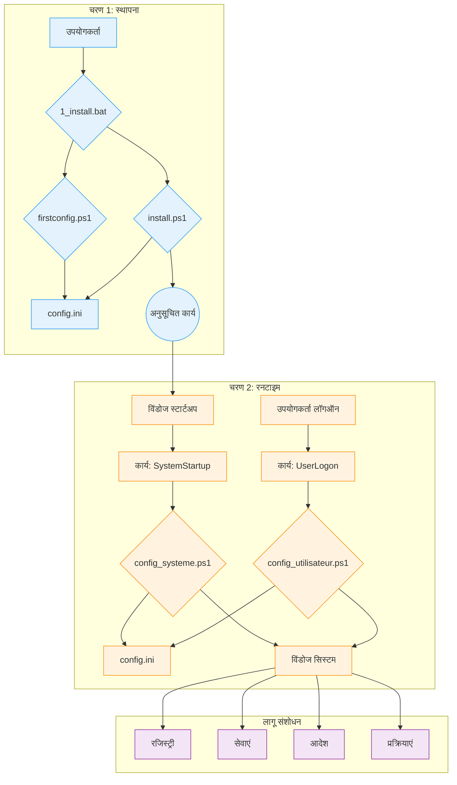

# WindowsOrchestrator तकनीकी दस्तावेज़

यह दस्तावेज़ WindowsOrchestrator प्रोजेक्ट के लिए एक तकनीकी संदर्भ है। यह प्रत्येक स्क्रिप्ट की वास्तुकला, घटकों और निष्पादन अनुक्रम का विवरण देता है।

* [1. प्रोजेक्ट अवलोकन](#1-प्रोजेक्ट-अवलोकन)
  * [1.1. प्रोजेक्ट का उद्देश्य](#11-प्रोजेक्ट-का-उद्देश्य)
  * [1.2. संचालन सिद्धांत](#12-संचालन-सिद्धांत)
* [2. वास्तुकला और प्रमुख घटक](#2-वास्तुकला-और-प्रमुख-घटक)
  * [2.1. वास्तुकला आरेख](#21-वास्तुकला-आरेख)
  * [2.2. टास्क शेड्यूलर की भूमिका](#22-टास्क-शेड्यूलर-की-भूमिका)
  * [2.3. `config.ini` फ़ाइल: कॉन्फ़िगरेशन का स्रोत](#23-configini-फ़ाइल-कॉन्फ़िगरेशन-का-स्रोत)
  * [2.4. अंतर्राष्ट्रीयकरण (i18n) प्रणाली](#24-अंतर्राष्ट्रीयकरण-i18n-प्रणाली)
* [3. जीवनचक्र और निष्पादन अनुक्रम](#3-जीवनचक्र-और-निष्पादन-अनुक्रम)
  * [3.1. पूर्ण स्थापना अनुक्रम](#31-पूर्ण-स्थापना-अनुक्रम)
  * [3.2. स्टार्टअप निष्पादन अनुक्रम (रनटाइम - सिस्टम स्तर)](#32-स्टार्टअप-निष्पादन-अनुक्रम-रनटाइम-सिस्टम-स्तर)
  * [3.3. लॉगऑन निष्पादन अनुक्रम (रनटाइम - उपयोगकर्ता स्तर)](#33-लॉगऑन-निष्पादन-अनुक्रम-रनटाइम-उपयोगकर्ता-स्तर)
  * [3.4. स्थापना रद्द अनुक्रम](#34-स्थापना-रद्द-अनुक्रम)
* [4. स्थापना और स्थापना रद्द प्रक्रियाएं](#4-स्थापना-और-स्थापना-रद्द-प्रक्रियाएं)
  * [4.1. स्थापना प्रक्रिया](#41-स्थापना-प्रक्रिया)
    * [4.1.1. चरण 1: कॉन्फ़िगरेशन (उपयोगकर्ता संदर्भ)](#411-चरण-1-कॉन्फ़िगरेशन-उपयोगकर्ता-संदर्भ)
    * [4.1.2. चरण 2: कार्य स्थापना (व्यवस्थापक संदर्भ)](#412-चरण-2-कार्य-स्थापना-व्यवस्थापक-संदर्भ)
    * [4.1.3. स्थापना के बाद की सिस्टम स्थिति](#413-स्थापना-के-बाद-की-सिस्टम-स्थिति)
  * [4.2. स्थापना रद्द प्रक्रिया](#42-स्थापना-रद्द-प्रक्रिया)
    * [4.2.1. विशेषाधिकार उन्नयन](#421-विशेषाधिकार-उन्नयन)
    * [4.2.2. स्क्रिप्ट द्वारा की गई क्रियाएं](#422-स्क्रिप्ट-द्वारा-की-गई-क्रियाएं)
    * [4.2.3. स्थापना रद्द करने के बाद की सिस्टम स्थिति](#423-स्थापना-रद्द-करने-के-बाद-की-सिस्टम-स्थिति)
* [5. गहन कॉन्फ़िगरेशन गाइड (`config.ini`)](#5-गहन-कॉन्फ़िगरेशन-गाइड-configini)
  * [5.1. `[SystemConfig]` अनुभाग](#51-systemconfig-अनुभाग)
  * [5.2. `[Process]` अनुभाग](#52-process-अनुभाग)
  * [5.3. `[Logging]` अनुभाग](#53-logging-अनुभाग)
  * [5.4. `[Gotify]` अनुभाग](#54-gotify-अनुभाग)
* [6. विस्तृत स्क्रिप्ट विवरण (कोड संदर्भ)](#6-विस्तृत-स्क्रिप्ट-विवरण-कोड-संदर्भ)
  * [6.1. ऑर्केस्ट्रेशन स्क्रिप्ट (`management/`)](#61-ऑर्केस्ट्रेशन-स्क्रिप्ट-management)
    * [**`firstconfig.ps1`**](#firstconfigps1)
    * [**`install.ps1`**](#installps1)
    * [**`uninstall.ps1`**](#uninstallps1)
  * [6.2. रनटाइम स्क्रिप्ट (रूट)](#62-रनटाइम-स्क्रिप्ट-रूट)
    * [**`config_systeme.ps1`**](#config_systemeps1)
    * [**`config_utilisateur.ps1`**](#config_utilisateurps1)
  * [6.3. उपयोगिता स्क्रिप्ट और लॉन्चर](#63-उपयोगिता-स्क्रिप्ट-और-लॉन्चर)
    * [**`Close-AppByTitle.ps1`**](#close-appbytitleps1)
    * [**`PreReboot.bat` और `LaunchApp.bat`**](#prerebootbat-और-launchappbat)
    * [**`management/tools/Find-WindowInfo.ps1`**](#managementtoolsfind-windowinfops1)
* [7. रखरखाव और डिबगिंग प्रक्रियाएं](#7-रखरखाव-और-डिबगिंग-प्रक्रियाएं)
  * [7.1. लॉग को समझना और उपयोग करना (`Logs/`)](#71-लॉग-को-समझना-और-उपयोग-करना-logs)
  * [7.2. स्क्रिप्ट को मैन्युअल रूप से डीबग करना](#72-स्क्रिप्ट-को-मैन्युअल-रूप-से-डीबग-करना)
    * [**`SYSTEM` अधिकारों के साथ `config_systeme.ps1` चलाना**](#system-अधिकारों-के-साथ-config_systemeps1-चलाना)
    * [**उपयोगकर्ता सत्र में `config_utilisateur.ps1` का परीक्षण करना**](#उपयोगकर्ता-सत्र-में-config_utilisateurps1-का-परीक्षण-करना)
    * [**अनुसूचित कार्यों की स्थिति की जाँच करना**](#अनुसूचित-कार्यों-की-स्थिति-की-जाँच-करना)
  * [**7.3. सुरक्षा विचार**](#73-सुरक्षा-विचार)
  * [**7.4. ज्ञात सीमाएँ**](#74-ज्ञात-सीमाएँ)
* [8. परिशिष्ट](#8-परिशिष्ट)
  * [8.1. लाइसेंस](#81-लाइसेंस)
  * [8.2. शब्दों की शब्दावली](#82-शब्दों-की-शब्दावली)

## 1. प्रोजेक्ट अवलोकन

### 1.1. प्रोजेक्ट का उद्देश्य

WindowsOrchestrator प्रोजेक्ट विंडोज ऑपरेटिंग सिस्टम के कॉन्फ़िगरेशन को स्वचालित करता है। यह स्क्रिप्ट चलाता है जो सिस्टम सेटिंग्स को संशोधित करता है और अनुप्रयोगों का प्रबंधन करता है। स्क्रिप्ट द्वारा किए गए कार्य एक मानक विंडोज इंस्टॉलेशन को एक ऐसे वातावरण में बदलते हैं जिसका व्यवहार एक केंद्रीय कॉन्फ़िgerेशन फ़ाइल द्वारा परिभाषित किया गया है।

स्क्रिप्ट config.ini फ़ाइल को रजिस्ट्री कुंजियों को संशोधित करने, विंडोज सेवाओं का प्रबंधन करने, बिजली सेटिंग्स को कॉन्फ़िगर करने, अनुसूचित कार्यों को बनाने और उपयोगकर्ता प्रक्रिया के जीवनचक्र का प्रबंधन करने वाले कमांड निष्पादित करने के लिए पढ़ता है।

प्रोजेक्ट बिजली प्रबंधन, सिस्टम अपडेट, उपयोगकर्ता सत्र और एप्लिकेशन के जीवनचक्र के लिए कॉन्फ़िगरेशन लागू करने वाले स्क्रिप्ट का एक सेट प्रदान करता है।

### 1.2. संचालन सिद्धांत

WindowsOrchestrator का संचालन चार मुख्य तंत्रों पर आधारित है।

1.  **देशी विंडोज टूल्स द्वारा निष्पादन**
    प्रोजेक्ट विंडोज में निर्मित सुविधाओं और कमांड का उपयोग करता है: PowerShell 5.1, टास्क शेड्यूलर, रजिस्ट्री संपादक, और कमांड-लाइन उपयोगिताएँ (`powercfg`, `shutdown`)। प्रोजेक्ट को किसी भी बाहरी निर्भरता की स्थापना की आवश्यकता नहीं है।

2.  **एक केंद्रीकृत फ़ाइल के माध्यम से कॉन्फ़िगरेशन**
    स्क्रिप्ट का निष्पादन तर्क कॉन्फ़िगरेशन से अलग है। स्क्रिप्ट `config.ini` फ़ाइल को निष्पादित किए जाने वाले कार्यों को निर्धारित करने के लिए पढ़ता है। स्क्रिप्ट के व्यवहार को बदलने के लिए, एक उपयोगकर्ता `config.ini` में मानों को संशोधित करता है।

3.  **निष्पादन संदर्भों का पृथक्करण (सिस्टम बनाम उपयोगकर्ता)**
    प्रोजेक्ट दो अलग-अलग निष्पादन संदर्भों का उपयोग करता है:
    *   **`config_systeme.ps1`** स्क्रिप्ट `NT AUTHORITY\SYSTEM` खाते की अनुमतियों के साथ चलती है और मशीन की वैश्विक सेटिंग्स (HKLM रजिस्ट्री, सेवाएँ, अनुसूचित कार्य) को संशोधित करती है।
    *   **`config_utilisateur.ps1`** स्क्रिप्ट लॉग-इन उपयोगकर्ता की अनुमतियों के साथ चलती है और उनके सत्र की प्रक्रियाओं का प्रबंधन करती है।

4.  **कार्यों की समरूपता**
    स्क्रिप्ट इस तरह से लिखे गए हैं कि उन्हें बार-बार चलाने से वही अंतिम स्थिति उत्पन्न होती है जो उन्हें एक बार चलाने से होती है। सेटिंग को संशोधित करने से पहले, एक स्क्रिप्ट सिस्टम की वर्तमान स्थिति की जाँच करती है। यदि वांछित स्थिति पहले से ही लागू है, तो स्क्रिप्ट संशोधन क्रिया को नहीं दोहराती है।

## 2. वास्तुकला और प्रमुख घटक

WindowsOrchestrator की वास्तुकला देशी विंडोज घटकों का उपयोग करती है। प्रत्येक घटक की एक परिभाषित भूमिका होती है।

### 2.1. वास्तुकला आरेख

घटकों के बीच निष्पादन प्रवाह और अंतःक्रियाओं को निम्नलिखित आरेख द्वारा दर्शाया गया है:

यह आरेख उपयोगकर्ता द्वारा शुरू किए गए **स्थापना चरण** और टास्क शेड्यूलर द्वारा प्रबंधित एक स्वचालित चक्र **रनटाइम चरण** के बीच अलगाव को दर्शाता है।

### 2.2. टास्क शेड्यूलर की भूमिका

विंडोज टास्क शेड्यूलर स्वचालन का केंद्रीय घटक है। यह परिभाषित समय पर और आवश्यक विशेषाधिकार स्तरों के साथ कॉन्फ़िगरेशन स्क्रिप्ट निष्पादित करता है।

`install.ps1` द्वारा बनाए गए दो मुख्य कार्य हैं:

*   **`WindowsOrchestrator-SystemStartup`**
    *   **ट्रिगर:** "सिस्टम स्टार्टअप पर"।
    *   **निष्पादन संदर्भ:** `NT AUTHORITY\SYSTEM`। इस खाते में `HKEY_LOCAL_MACHINE` (HKLM) में रजिस्ट्री कुंजियों को संशोधित करने, सेवाओं का प्रबंधन करने और सिस्टम कमांड चलाने के लिए आवश्यक विशेषाधिकार हैं।
    *   **भूमिका:** सभी मशीन-स्तरीय कॉन्फ़िगरेशन निष्पादित करने के लिए।

*   **`WindowsOrchestrator-UserLogon`**
    *   **ट्रिger:** निर्दिष्ट उपयोगकर्ता के "लॉग ऑन पर"।
    *   **निष्पादन संदर्भ:** लॉग-इन उपयोगकर्ता का खाता। स्क्रिप्ट इस उपयोगकर्ता के विशेषाधिकारों के साथ चलती है, जिससे यह उपयोगकर्ता के सत्र में ग्राफिकल एप्लिकेशन लॉन्च कर सकता है।
    *   **भूमिका:** सभी उपयोगकर्ता-सत्र-विशिष्ट कॉन्फ़िगरेशन निष्पादित करने के लिए।

### 2.3. `config.ini` फ़ाइल: कॉन्फ़िगरेशन का स्रोत

`config.ini` फ़ाइल में सिस्टम की वांछित अंतिम स्थिति का विवरण होता है। PowerShell स्क्रिप्ट (`config_systeme.ps1`, `config_utilisateur.ps1`) इस फ़ाइल को पढ़ती हैं और सिस्टम को परिभाषित सेटिंग्स के अनुरूप बनाने के लिए आवश्यक कमांड निष्पादित करती हैं।

इस तंत्र में कई तथ्यात्मक विशेषताएं हैं:
*   स्क्रिप्ट का व्यवहार config.ini फ़ाइल में निहित कुंजी-मान युग्मों द्वारा निर्धारित किया जाता है।
*   निष्पादन तर्क PowerShell स्क्रिप्ट फ़ाइलों (.ps1) में निहित है, जबकि इस तर्क को नियंत्रित करने वाले पैरामीटर .ini फ़ाइल से पढ़े जाते हैं।
*   स्क्रिप्ट अपने रूट डायरेक्टरी में मौजूद config.ini फ़ाइल को पढ़ती हैं, जो प्रोजेक्ट के अलग-अलग उदाहरणों को अपनी config.ini फ़ाइल की सामग्री के आधार पर अलग-अलग व्यवहार करने की अनुमति देता है।

### 2.4. अंतर्राष्ट्रीयकरण (i18n) प्रणाली

प्रोजेक्ट स्रोत कोड को संशोधित किए बिना अनुवादित स्ट्रिंग्स लोड करता है।

*   **फ़ाइल संरचना:** स्ट्रिंग्स `i18n/` डायरेक्टरी के सबफ़ोल्डर्स में स्थित `.psd1` फ़ाइलों में संग्रहीत हैं। प्रत्येक सबफ़ोल्डर का नाम एक संस्कृति कोड (जैसे, `fr-FR`, `en-US`) के नाम पर रखा गया है।

*   **पहचान और लोडिंग तंत्र:**
    1.  इसके निष्पादन की शुरुआत में, एक स्क्रिप्ट सिस्टम के संस्कृति कोड (जैसे, `"fr-FR"`) को प्राप्त करने के लिए `(Get-Culture).Name` कमांड चलाती है।
    2.  स्क्रिप्ट संबंधित भाषा फ़ाइल (जैसे, `i18n\fr-FR\strings.psd1`) का पथ बनाती है।
    3.  **फ़ॉलबैक तर्क:** यदि यह फ़ाइल मौजूद नहीं है, तो स्क्रिप्ट `i18n\en-US\strings.psd1` पथ का उपयोग करती है।
    4.  `.psd1` फ़ाइल की सामग्री को `Invoke-Expression` द्वारा पढ़ा और व्याख्या किया जाता है, जो स्ट्रिंग्स की हैश तालिका को `$lang` चर में लोड करता है।

*   **कोड में उपयोग:**
    एक संदेश प्रदर्शित करने के लिए, कोड एक कुंजी (जैसे, `$lang.Uninstall_StartMessage`) के माध्यम से `$lang` हैश तालिका तक पहुँचता है। यदि कोई कुंजी नहीं मिलती है तो लॉगिंग फ़ंक्शन एक `-DefaultMessage` पैरामीटर का उपयोग करते हैं जिसमें एक अंग्रेजी पाठ होता है।

एक नई भाषा जोड़ने के लिए, एक उपयोगकर्ता को `en-US` फ़ोल्डर की प्रतिलिपि बनानी होगी, इसे नए संस्कृति कोड के साथ नाम बदलना होगा, और `strings.psd1` फ़ाइल में मानों का अनुवाद करना होगा।

## 3. जीवनचक्र और निष्पादन अनुक्रम

यह खंड प्रोजेक्ट की प्रक्रियाओं को कालानुक्रमिक निष्पादन अनुक्रमों में तोड़ता है।

### 3.1. पूर्ण स्थापना अनुक्रम

1.  **चरण 1 - लॉन्च और कॉन्फ़िगरेशन (उपयोगकर्ता संदर्भ)**
    *   उपयोगकर्ता `1_install.bat` चलाता है।
    *   बैच स्क्रिप्ट `management\firstconfig.ps1` निष्पादित करती है।
    *   **`firstconfig.ps1` चलता है:**
        *   यह `config.ini` फ़ाइल के अस्तित्व की जाँच करता है। यदि यह अनुपस्थित है, तो यह इसे `management/defaults/default_config.ini` टेम्पलेट से बनाता है। यदि यह मौजूद है, तो यह उपयोगकर्ता से पूछता है कि क्या वे इसे बदलना चाहते हैं।
        *   यह `config.ini` से पढ़े गए मानों से पहले से भरे हुए विंडोज फॉर्म GUI को प्रदर्शित करता है।
        *   "सहेजें और बंद करें" पर क्लिक करने पर, स्क्रिप्ट इंटरफ़ेस फ़ील्ड से मानों को `config.ini` में लिखती है।
        *   `firstconfig.ps1` स्क्रिप्ट समाप्त हो जाती है।

2.  **चरण 2 - उन्नयन और स्थापना (व्यवस्थापक संदर्भ)**
    *   `1_install.bat` स्क्रिप्ट फिर से शुरू होती है।
    *   यह एक PowerShell कमांड निष्पादित करता है जो `install.ps1` को लॉन्च करने के लिए `Start-Process PowerShell -Verb RunAs` का उपयोग करता है।
    *   विंडोज एक **उपयोगकर्ता खाता नियंत्रण (UAC)** प्रॉम्प्ट को ट्रिगर करता है। उपयोगकर्ता को विशेषाधिकार प्रदान करने होंगे।
    *   **`install.ps1` व्यवस्थापक विशेषाधिकारों के साथ चलता है:**
        *   यह `config_systeme.ps1` और `config_utilisateur.ps1` फ़ाइलों की उपस्थिति की जाँच करता है।
        *   यह दो कार्य बनाने के लिए `Register-ScheduledTask` कमांड चलाता है:
            *   **`WindowsOrchestrator-SystemStartup`**, जो स्टार्टअप (`-AtStartup`) पर `NT AUTHORITY\SYSTEM` खाते के साथ `config_systeme.ps1` चलाता है।
            *   **`WindowsOrchestrator-UserLogon`**, जो उपयोगकर्ता के लॉगऑन (`-AtLogOn`) पर `config_utilisateur.ps1` चलाता है।
        *   कॉन्फ़िगरेशन लागू करने के लिए, स्क्रिप्ट `config_systeme.ps1` और फिर `config_utilisateur.ps1` को `Start-Process -Wait` के माध्यम से चलाती है।
    *   `install.ps1` स्क्रिप्ट समाप्त हो जाती है।

### 3.2. स्टार्टअप निष्पादन अनुक्रम (रनटाइम - सिस्टम स्तर)

1.  **ट्रिगर:** विंडोज ऑपरेटिंग सिस्टम शुरू होता है।
2.  **कार्य निष्पादन:** टास्क शेड्यूलर `WindowsOrchestrator-SystemStartup` कार्य चलाता है।
3.  **स्क्रिप्ट लॉन्च:** कार्य `config_systeme.ps1` को लॉन्च करने के लिए `NT AUTHORITY\SYSTEM` खाता विशेषाधिकारों के साथ `powershell.exe` निष्पादित करता है।
4.  **`config_systeme.ps1` की क्रियाएं:**
    *   स्क्रिप्ट `config.ini` को पार्स करती है और इसकी सामग्री को लोड करती है।
    *   यह नेटवर्क कनेक्टिविटी (`Test-NetConnection 8.8.8.8 -Port 53`) की जाँच करती है।
    *   यह `[SystemConfig]` में परिभाषित कॉन्फ़िगरेशन ब्लॉक निष्पादित करती है। प्रत्येक क्रिया के लिए:
        *   यह कुंजी का मान पढ़ती है।
        *   यह सिस्टम की वर्तमान स्थिति (रजिस्ट्री मान, सेवा स्थिति) की जाँच करती है।
        *   यदि वर्तमान स्थिति वांछित स्थिति से भिन्न है, तो यह संशोधन कमांड (`Set-ItemProperty`, `powercfg`, आदि) निष्पादित करती है।
        *   यह सूचियों में क्रिया या त्रुटि को रिकॉर्ड करती है।
    *   यह एक Gotify अधिसूचना भेजती है (यदि सक्षम हो)।
5.  **अनुक्रम का अंत:** स्क्रिप्ट समाप्त हो जाती है।

### 3.3. लॉगऑन निष्पादन अनुक्रम (रनटाइम - उपयोगकर्ता स्तर)

1.  **ट्रिगर:** उपयोगकर्ता लॉग ऑन करता है।
2.  **कार्य निष्पादन:** टास्क शेड्यूलर `WindowsOrchestrator-UserLogon` कार्य चलाता है।
3.  **स्क्रिप्ट लॉन्च:** कार्य `config_utilisateur.ps1` (`-WindowStyle Hidden`) को लॉन्च करने के लिए उपयोगकर्ता के विशेषाधिकारों के साथ `powershell.exe` निष्पादित करता है।
4.  **`config_utilisateur.ps1` की क्रियाएं:**
    *   स्क्रिप्ट `config.ini` को पार्स करती है।
    *   यह `[Process]` अनुभाग से पैरामीटर पढ़ती है।
    *   यह प्रक्रिया प्रबंधन तर्क निष्पादित करती है:
        1.  यह प्रक्रिया पथ में पर्यावरण चर को हल करती है।
        2.  यह मौजूदा प्रक्रियाओं की खोज करती है जो नाम से मेल खाती हैं और वर्तमान उपयोगकर्ता से संबंधित हैं (SID द्वारा सत्यापित)।
        3.  यदि कोई मिलती है, तो यह उन्हें समाप्त कर देती है (`Stop-Process -Force`)।
        4.  यह प्रक्रिया का एक नया उदाहरण लॉन्च करती है।
    *   यह एक Gotify अधिसूचना भेजती है (यदि सक्षम हो)।
5.  **अनुक्रम का अंत:** स्क्रिप्ट समाप्त हो जाती है।

### 3.4. स्थापना रद्द अनुक्रम

1.  **ट्रिगर:** उपयोगकर्ता `2_uninstall.bat` चलाता है।
2.  **उन्नयन:** `2_uninstall.bat` स्क्रिप्ट `management\uninstall.ps1` लॉन्च करती है, जो `Start-Process -Verb RunAs` के साथ खुद को फिर से लॉन्च करती है। उपयोगकर्ता को UAC प्रॉम्प्ट स्वीकार करना होगा।
3.  **`uninstall.ps1` की क्रियाएं:**
    *   स्क्रिप्ट उपयोगकर्ता से AutoLogon को अक्षम करने के लिए एक प्रश्न पूछती है।
    *   यह सिस्टम रजिस्ट्री कुंजियों को पुनर्स्थापित करती है:
        *   विंडोज अपडेट (`NoAutoUpdate` -> `0`)।
        *   फास्ट स्टार्टअप (`HiberbootEnabled` -> `1`)।
        *   OneDrive (`DisableFileSyncNGSC` का विलोपन)।
        *   AutoLogon (`AutoAdminLogon` -> `0`) यदि अनुरोध किया गया हो।
    *   यह चार अनुसूचित कार्यों को हटाने के लिए `Unregister-ScheduledTask` चलाता है।
    *   यह एक सारांश प्रदर्शित करता है और सूचित करता है कि फ़ाइलें हटाई नहीं गई हैं।
4.  **अनुक्रम का अंत:** स्क्रिप्ट समाप्त हो जाती है।

## 4. स्थापना और स्थापना रद्द प्रक्रियाएं

यह खंड सिस्टम को स्थापित करने, सक्रिय करने, स्थापना रद्द करने और पुनर्स्थापित करने के लिए बैच स्क्रिप्ट द्वारा किए गए संचालन के अनुक्रमों का वर्णन करता है।

### 4.1. स्थापना प्रक्रिया

प्रक्रिया `1_install.bat` फ़ाइल को चलाने से शुरू होती है। इसे दो अलग-अलग चरणों में विभाजित किया गया है।

#### 4.1.1. चरण 1: कॉन्फ़िगरेशन (उपयोगकर्ता संदर्भ)

1.  `1_install.bat` फ़ाइल `powershell.exe` कमांड के माध्यम से `management\firstconfig.ps1` स्क्रिप्ट निष्पादित करती है।
2.  `firstconfig.ps1` स्क्रिप्ट प्रोजेक्ट रूट पर `config.ini` फ़ाइल के अस्तित्व की जाँच करती है।
    *   यदि `config.ini` फ़ाइल मौजूद नहीं है, तो इसे `management/defaults/default_config.ini` फ़ाइल की प्रतिलिपि बनाकर बनाया जाता है।
    *   यदि `config.ini` फ़ाइल मौजूद है, तो एक `System.Windows.Forms.MessageBox` संवाद बॉक्स प्रदर्शित होता है, जो उपयोगकर्ता से पूछता है कि क्या वे मौजूदा फ़ाइल को टेम्पलेट से बदलना चाहते हैं।
3.  स्क्रिप्ट तब एक ग्राफिकल यूजर इंटरफेस (विंडोज फॉर्म) प्रदर्शित करता है जिसके फ़ील्ड `config.ini` फ़ाइल से पढ़े गए मानों से पहले से भरे हुए हैं।
4.  जब उपयोगकर्ता "सहेजें और बंद करें" बटन पर क्लिक करता है, तो इंटरफ़ेस फ़ील्ड से मान `Set-IniValue` फ़ंक्शन के माध्यम से `config.ini` फ़ाइल में लिखे जाते हैं। स्क्रिप्ट समाप्त हो जाती है।

#### 4.1.2. चरण 2: कार्य स्थापना (व्यवस्थापक संदर्भ)

1.  नियंत्रण `1_install.bat` स्क्रिप्ट पर वापस आ जाता है। यह एक `powershell.exe` कमांड निष्पादित करता है जिसकी एकमात्र भूमिका `Start-Process PowerShell -Verb RunAs` कमांड के माध्यम से PowerShell का दूसरा उदाहरण लॉन्च करना है।
2.  यह क्रिया एक उपयोगकर्ता खाता नियंत्रण (UAC) प्रॉम्प्ट को ट्रिger करती है। जारी रखने के लिए उपयोगकर्ता को विशेषाधिकार प्रदान करने होंगे।
3.  `management\install.ps1` स्क्रिप्ट व्यवस्थापक विशेषाधिकारों के साथ चलती है और निम्नलिखित क्रियाएं करती है:
    *   यह `Register-ScheduledTask` के माध्यम से **`WindowsOrchestrator-SystemStartup`** अनुसूचित कार्य बनाता है। ट्रिगर `-AtStartup` पर सेट है और निष्पादन प्रिंसिपल `NT AUTHORITY\SYSTEM` (`-UserId "NT AUTHORITY\SYSTEM"`) है। क्रिया `config_systeme.ps1` स्क्रिप्ट का निष्पादन है।
    *   यह `Register-ScheduledTask` के माध्यम से **`WindowsOrchestrator-UserLogon`** अनुसूचित कार्य बनाता है। ट्रिगर वर्तमान उपयोगकर्ता के लिए `-AtLogOn` पर सेट है और निष्पादन प्रिंसिपल वही उपयोगकर्ता (`-UserId "$($env:USERDOMAIN)\$($env:USERNAME)"`) है। क्रिया `config_utilisateur.ps1` स्क्रिप्ट का निष्पादन है।

4.  कॉन्फ़िगरेशन को तुरंत लागू करने के लिए, `install.ps1` फिर क्रमिक रूप से और प्रत्येक प्रक्रिया (`-Wait`) के समाप्त होने की प्रतीक्षा करते हुए, `config_systeme.ps1` और फिर `config_utilisateur.ps1` स्क्रिप्ट निष्पादित करता है।

#### 4.1.3. स्थापना के बाद की सिस्टम स्थिति

*   दो अनुसूचित कार्य, `WindowsOrchestrator-SystemStartup` और `WindowsOrchestrator-UserLogon`, बनाए गए हैं और विंडोज टास्क शेड्यूलर में सक्रिय हैं।
*   प्रोजेक्ट रूट पर एक `config.ini` फ़ाइल मौजूद है और इसमें उपयोगकर्ता-परिभाषित कॉन्फ़िगरेशन है।
*   प्रोजेक्ट रूट पर एक `Logs` डायरेक्टरी मौजूद है और इसमें प्रारंभिक निष्पादन से लॉग फ़ाइलें हैं।
*   `config.ini` में परिभाषित सिस्टम सेटिंग्स पहली बार लागू की गई हैं।

### 4.2. स्थापना रद्द प्रक्रिया

प्रक्रिया `2_uninstall.bat` फ़ाइल को चलाने से शुरू होती है।

#### 4.2.1. विशेषाधिकार उन्नयन

1.  `2_uninstall.bat` फ़ाइल `management\uninstall.ps1` स्क्रिप्ट निष्पादित करती है।
2.  `uninstall.ps1` स्क्रिप्ट अपने स्वयं के विशेषाधिकार स्तर की जाँच करती है। यदि यह एक व्यवस्थापक नहीं है, तो यह `Start-Process powershell.exe -Verb RunAs` के माध्यम से खुद को फिर से लॉन्च करती है, जो एक UAC प्रॉम्प्ट को ट्रिger करती है जिसे उपयोगकर्ता को मान्य करना होगा।

#### 4.2.2. स्क्रिप्ट द्वारा की गई क्रियाएं

`management\uninstall.ps1` स्क्रिप्ट, व्यवस्थापक विशेषाधिकारों के साथ चल रही है, निम्नलिखित ऑपरेशन करती है:

1.  **उपयोगकर्ता सहभागिता:** स्क्रिप्ट `Read-Host` के माध्यम से कंसोल में एक प्रॉम्प्ट प्रदर्शित करती है, जो उपयोगकर्ता से पूछती है कि क्या वे स्वचालित लॉगऑन को अक्षम करना चाहते हैं। उपयोगकर्ता की प्रतिक्रिया एक चर में संग्रहीत होती है।
2.  **सिस्टम सेटिंग्स की बहाली:**
    *   यदि उपयोगकर्ता ने `y` या `yes` उत्तर दिया है, तो स्क्रिप्ट स्ट्रिंग मान `"0"` को `HKLM:\SOFTWARE\Microsoft\Windows NT\CurrentVersion\Winlogon\AutoAdminLogon` रजिस्ट्री कुंजी में लिखती है।
    *   यह DWORD मान `0` को `HKLM:\...\WindowsUpdate\AU\NoAutoUpdate` कुंजी में लिखती है।
    *   यह DWORD मान `0` को `HKLM:\...\WindowsUpdate\AU\NoAutoRebootWithLoggedOnUsers` कुंजी में लिखती है।
    *   यह DWORD मान `1` को `HKLM:\...\Power\HiberbootEnabled` कुंजी में लिखती है।
    *   यह `Remove-ItemProperty` के माध्यम से `HKLM:\...\OneDrive` कुंजी से `DisableFileSyncNGSC` मान को हटा देती है।
    *   यह `Set-Service` के माध्यम से `wuauserv` सेवा के स्टार्टअप प्रकार को `Automatic` में बदल देती है।
3.  **अनुसूचित कार्यों का विलोपन:**
    *   स्क्रिप्ट कार्य नामों की एक पूर्वनिर्धारित सूची पर पुनरावृति करती है और प्रत्येक के लिए `Unregister-ScheduledTask -Confirm:$false` निष्पादित करती है। हटाए गए कार्य हैं:
        *   `WindowsOrchestrator-SystemStartup`
        *   `WindowsOrchestrator-UserLogon`
        *   `WindowsOrchestrator-SystemScheduledReboot`
        *   `WindowsOrchestrator-SystemPreRebootAction`

#### 4.2.3. स्थापना रद्द करने के बाद की सिस्टम स्थिति

*   चार प्रोजेक्ट-संबंधित अनुसूचित कार्य टास्क शेड्यूलर से हटा दिए गए हैं। सभी स्वचालन बंद कर दिया गया है।
*   ऊपर सूचीबद्ध रजिस्ट्री और सेवा सेटिंग्स उनके डिफ़ॉल्ट मानों पर पुनर्स्थापित कर दी गई हैं।
*   `powercfg` कमांड द्वारा संशोधित बिजली सेटिंग्स स्थापना रद्द स्क्रिप्ट द्वारा नहीं बदली जाती हैं।
*   सभी स्क्रिप्ट, `config.ini` फ़ाइल और लॉग सहित प्रोजेक्ट डायरेक्टरी को हटाया नहीं जाता है और डिस्क पर बना रहता है।

## 5. गहन कॉन्फ़िगरेशन गाइड (`config.ini`)

`config.ini` फ़ाइल प्रोजेक्ट का घोषणात्मक नियंत्रण केंद्र है। यह गाइड प्रत्येक कुंजी, स्क्रिप्ट निष्पादन पर इसके प्रभाव, इसके संभावित मानों और अन्य सेटिंग्स के साथ इसकी अंतःक्रियाओं का वर्णन करता है। डिफ़ॉल्ट मान `management/defaults/default_config.ini` फ़ाइल में निर्दिष्ट हैं।

### 5.1. `[SystemConfig]` अनुभाग

यह अनुभाग उन सेटिंग्स को नियंत्रित करता है जो पूरे सिस्टम को प्रभावित करती हैं और विशेष रूप से `config_systeme.ps1` द्वारा पढ़ी जाती हैं।

---

**`AutoLoginUsername`**

*   **भूमिका:** उस उपयोगकर्ता नाम को निर्दिष्ट करता है जिसे `DefaultUserName` रजिस्ट्री कुंजी में लिखा जाएगा। यह मान प्री-रिबूट एक्शन लॉजिक द्वारा `%USERPROFILE%` पथ को हल करने के लिए भी उपयोग किया जाता है।
*   **संभावित मान:** एक स्थानीय या डोमेन उपयोगकर्ता नाम का प्रतिनिधित्व करने वाली एक स्ट्रिंग (जैसे, `Admin`, `DOMAIN\User`)। यदि मान खाली छोड़ दिया जाता है, तो स्क्रिप्ट `DefaultUserName` रजिस्ट्री कुंजी में पहले से मौजूद मान को पढ़ने का प्रयास करती है।
*   **डिफ़ॉल्ट मान:** "" (खाली स्ट्रिंग)
*   **अंतर्निर्भरता:** यदि `EnableAutoLogin` `true` है तो यह पैरामीटर आवश्यक है। `%USERPROFILE%` चर को `PreRebootActionCommand` कुंजी में उपयोग करने के लिए भी यह आवश्यक है।

---

**`EnableAutoLogin`**

*   **भूमिका:** विंडोज स्वचालित लॉगऑन की स्थिति को नियंत्रित करता है।
*   **स्क्रिप्ट क्रिया:** यदि मान `true` है, तो स्क्रिप्ट `"1"` को `HKLM:\SOFTWARE\Microsoft\Windows NT\CurrentVersion\Winlogon\AutoAdminLogon` रजिस्ट्री कुंजी में लिखती है। यदि मान `false` है, तो यह `"0"` लिखती है।
*   **संभावित मान:** `true`, `false`
*   **डिफ़ॉल्ट मान:** `false`
*   **अंतर्निर्भरता:** पूरी तरह से कार्यात्मक होने के लिए `AutoLoginUsername` को सही ढंग से कॉन्फ़िगर करने की आवश्यकता है। **डेवलपर का नोट:** स्क्रिप्ट पासवर्ड (`DefaultPassword`) को हैंडल नहीं करती है, जिसे आउट-ऑफ-बैंड कॉन्फ़िगर किया जाना चाहिए (जैसे, Sysinternals AutoLogon टूल के साथ)।

---

**`DisableFastStartup`**

*   **भूमिका:** विंडोज फास्ट स्टार्टअप सुविधा (हाइबरबूट) को नियंत्रित करता है।
*   **स्क्रिप्ट क्रिया:** यदि `true`, तो मान `0` (DWORD) को `HKLM:\...\Power\HiberbootEnabled` रजिस्ट्री कुंजी में लिखता है। यदि `false`, तो `1` लिखता है।
*   **संभावित मान:** `true`, `false`
*   **डिफ़ॉल्ट मान:** `true`
*   **अंतर्निर्भरता:** कोई नहीं।

---

**`DisableSleep`** और **`DisableScreenSleep`**

*   **भूमिका:** मशीन और स्क्रीन की नींद की स्थिति का प्रबंधन करें।
*   **स्क्रिप्ट क्रिया:**
    *   `DisableSleep=true` के लिए, `powercfg /change standby-timeout-ac 0` और `powercfg /change hibernate-timeout-ac 0` कमांड निष्पादित करता है।
    *   `DisableScreenSleep=true` के लिए, `powercfg /change monitor-timeout-ac 0` कमांड निष्पादित करता है।
*   **संभावित मान:** `true`, `false`
*   **डिफ़ault मान:** `DisableSleep=true`, `DisableScreenSleep=false`
*   **अंतर्निर्भरता:** कोई नहीं।

---

**`DisableWindowsUpdate`**

*   **भूमिका:** विंडोज अपडेट सेवा को पूरी तरह से अक्षम करता है।
*   **स्क्रिप्ट क्रिया:** यदि `true`, तो स्क्रिप्ट तीन क्रियाएं करती है:
    1.  `HKLM:\...\WindowsUpdate\AU\NoAutoUpdate` कुंजी में मान `1` (DWORD) लिखता है।
    2.  `wuauserv` सेवा के स्टार्टअप प्रकार को `Disabled` में बदलता है।
    3.  `wuauserv` सेवा (`Stop-Service`) को रोकता है।
*   **संभावित मान:** `true`, `false`
*   **डिफ़ault मान:** `true`
*   **अंतर्निर्भरता:** कोई नहीं।

---

**`DisableAutoReboot`**

*   **भूमिका:** यदि कोई उपयोगकर्ता सत्र सक्रिय है तो अद्यतन के बाद विंडोज को स्वचालित रूप से पुनरारंभ होने से रोकता है।
*   **स्क्रिप्ट क्रिया:** यदि `true`, तो `HKLM:\...\WindowsUpdate\AU\NoAutoRebootWithLoggedOnUsers` रजिस्ट्री कुंजी में मान `1` (DWORD) लिखता है।
*   **संभावित मान:** `true`, `false`
*   **डिफ़ault मान:** `true`
*   **अंतर्निर्भरता:** यह सेटिंग मुख्य रूप से तब प्रासंगिक होती है जब `DisableWindowsUpdate` `false` होता है।

---

**`ScheduledRebootTime`**

*   **भूमिका:** मशीन का दैनिक पुनरारंभ निर्धारित करता है।
*   **स्क्रिप्ट क्रिया:** यदि कोई मान प्रदान किया जाता है, तो स्क्रिप्ट एक अनुसूचित कार्य (`WindowsOrchestrator-SystemScheduledReboot`) बनाती/अद्यतन करती है जो निर्दिष्ट समय पर `shutdown.exe /r /f /t 60` निष्पादित करती है। यदि मान खाली है, तो अनुसूचित कार्य हटा दिया जाता है।
*   **संभावित मान:** `HH:MM` प्रारूप में एक स्ट्रिंग (जैसे, `03:00`), या अक्षम करने के लिए एक खाली स्ट्रिंग।
*   **डिफ़ault मान:** `03:00`
*   **अंतर्निर्भरता:** स्क्रिप्ट प्री-रिबूट एक्शन और रिबूट के लिए दो अलग-अलग अनुसूचित कार्य बनाती है। विंडोज टास्क शेड्यूलर प्रत्येक कार्य को निर्दिष्ट समय पर निष्पादित करता है, उनके कालानुक्रमिक क्रम की जाँच किए बिना।

---

**`PreRebootAction...`** (4 कुंजियों का समूह)

*   **भूमिका:** अनुसूचित पुनरारंभ से पहले एक कस्टम कमांड निष्पादित करता है। यह ब्लॉक केवल तभी सक्रिय होता है जब `PreRebootActionTime` और `PreRebootActionCommand` दोनों गैर-खाली हों।
*   **स्क्रिप्ट क्रिया:** एक अनुसूचित कार्य (`WindowsOrchestrator-SystemPreRebootAction`) बनाता/अद्यतन करता है जो निर्दिष्ट कमांड निष्पादित करता है। स्क्रिप्ट `PreRebootActionCommand` में पर्यावरण चर (`%USERPROFILE%`) और सापेक्ष पथों को हल करती है।
*   **कुंजियाँ:**
    *   `PreRebootActionTime`: ट्रिगर समय (`HH:MM`)।
    *   `PreRebootActionCommand`: निष्पादन योग्य या स्क्रिप्ट का पथ।
    *   `PreRebootActionArguments`: कमांड को पास करने के लिए तर्क।
    *   `PreRebootActionLaunchMethod`: निष्पादन विधि (`direct`, `powershell`, `cmd`)।
*   **डिफ़ault मान:** `02:55`, `"PreReboot.bat"`, `""`, `cmd`
*   **अंतर्निर्भरता:** 'WindowsOrchestrator-SystemPreRebootAction' कार्य का निष्पादन 'WindowsOrchestrator-SystemScheduledReboot' कार्य के अस्तित्व से स्वतंत्र है।

---

**`DisableOneDrive`**

*   **भूमिका:** सिस्टम नीति के माध्यम से OneDrive एकीकरण को अक्षम करता है।
*   **स्क्रिप्ट क्रिया:** यदि `true`, तो `HKLM:\...\OneDrive\DisableFileSyncNGSC` रजिस्ट्री कुंजी में मान `1` (DWORD) लिखता है। यदि `false`, तो कुंजी हटा दी जाती है।
*   **संभावित मान:** `true`, `false`
*   **डिफ़ault मान:** `true`
*   **अंतर्निर्भरता:** कोई नहीं।

### 5.2. `[Process]` अनुभाग

यह अनुभाग, `config_utilisateur.ps1` द्वारा पढ़ा जाता है, मुख्य व्यावसायिक एप्लिकेशन का प्रबंधन कैसे करें इसका वर्णन करता है। ऑपरेशन कुंजियों के निम्नलिखित अन्योन्याश्रित तिकड़ी पर आधारित है:

*   **`ProcessName` ("क्या")**
    *   **भूमिका:** लॉन्च किए जाने वाले निष्पादन योग्य या स्क्रिप्ट का पूरा पथ परिभाषित करता है। यह क्रिया का मुख्य लक्ष्य है।
    *   **स्क्रिप्ट क्रिया:** स्क्रिप्ट इस मान का उपयोग रोकने के लिए प्रक्रिया की पहचान करने और प्रारंभ कमांड के लक्ष्य के रूप में करती है। यह सिस्टम और उपयोगकर्ता पर्यावरण चर (जैसे, `%USERPROFILE%`, `%PROGRAMFILES%`) का समर्थन करता है जो रनटाइम पर गतिशील रूप से हल होते हैं।

*   **`ProcessArguments` ("किसके साथ")**
    *   **भूमिका:** `ProcessName` में परिभाषित निष्पादन योग्य/स्क्रिप्ट को पास किए जाने वाले कमांड-लाइन तर्कों को निर्दिष्ट करता है।
    *   **स्क्रिप्ट क्रिया:** यह स्ट्रिंग निष्पादन कमांड में जोड़ी जाती है। यदि यह खाली है, तो कोई तर्क पास नहीं किया जाता है।

*   **`LaunchMethod` ("कैसे")**
    *   **भूमिका:** `ProcessName` को लॉन्च करने के लिए उपयोग किए जाने वाले कमांड दुभाषिया को निर्दिष्ट करता है। यह विकल्प संगतता के लिए महत्वपूर्ण है।
    *   **स्क्रिप्ट क्रिया:** स्क्रिप्ट मान के आधार पर अंतिम कमांड को अलग-अलग तरीके से बनाती है:
        *   `direct`: निष्पादन योग्य को सीधे लॉन्च करता है। कमांड `ProcessName "ProcessArguments"` है। यह `.exe` फ़ाइलों के लिए मानक विधि है।
        *   `cmd`: `cmd.exe` कमांड दुभाषिया के माध्यम से लॉन्च करता है। उत्पन्न कमांड `cmd.exe /c ""ProcessName" ProcessArguments"` है। यह बैच स्क्रिप्ट (`.bat`, `.cmd`) के लिए अनुशंसित विधि है।
        *   `powershell`: PowerShell के माध्यम से लॉन्च करता है। उत्पन्न कमांड `powershell.exe -NoProfile -ExecutionPolicy Bypass -Command "& 'ProcessName' ProcessArguments'"` है। यह अन्य PowerShell स्क्रिप्ट (`.ps1`) चलाने के लिए आदर्श विधि है।

### 5.3. `[Logging]` अनुभाग

यह अनुभाग लॉग फ़ाइलों के व्यवहार को कॉन्फ़िगर करता है।

*   **`EnableLogRotation`**
    *   **भूमिका:** लॉग संग्रह तंत्र को सक्षम या अक्षम करता है।
    *   **स्क्रिप्ट क्रिया:** यदि `true`, तो लॉग फ़ाइल (`log.txt`) में लिखने से पहले, `Rotate-LogFile` फ़ंक्शन को कॉल किया जाता है। यह `log.txt` का नाम बदलकर `log.1.txt`, `log.1.txt` का नाम बदलकर `log.2.txt`, आदि करता है, सीमा तक, और सबसे पुराने को हटा देता है। यदि `false`, तो यह फ़ंक्शन कॉल नहीं किया जाता है और लॉग फ़ाइल अनिश्चित काल तक बढ़ती है।
*   **`MaxSystemLogsToKeep` और `MaxUserLogsToKeep`**
    *   **भूमिका (इच्छित):** ये कुंजियाँ `default_config.ini` में रखी जाने वाली संग्रहीत लॉग फ़ाइलों की संख्या को परिभाषित करने के लिए प्रदान की जाती हैं।
    *   **स्क्रिप्ट क्रिया (वर्तमान):** MaxSystemLogsToKeep और MaxUserLogsToKeep कुंजियाँ config_systeme.ps1 स्क्रिप्ट द्वारा नहीं पढ़ी जाती हैं। Rotate-LogFile फ़ंक्शन को $DefaultMaxLogs चर द्वारा परिभाषित 7 के निश्चित मान के साथ कॉल किया जाता है।

### 5.4. `[Gotify]` अनुभाग

यह अनुभाग Gotify सर्वर को स्थिति सूचनाओं के भेजने को नियंत्रित करता है।

*   **`EnableGotify`**: यदि `true`, तो स्क्रिप्ट अपने निष्पादन के अंत में एक अधिसूचना भेजने का प्रयास करेगी।
*   **`Url`**: Gotify उदाहरण का आधार URL (जैसे, `http://gotify.example.com`)।
*   **`Token`**: संदेश भेजने को अधिकृत करने के लिए Gotify में उत्पन्न एप्लिकेशन टोकन।
*   **`Priority`**: Gotify में संदेश प्राथमिकता को परिभाषित करने वाला एक पूर्णांक।
*   **`GotifyTitle...`** (4 कुंजियों का समूह):
    *   **भूमिका:** अधिसूचना शीर्षकों के लिए टेम्पलेट।
    *   **स्क्रिप्ट क्रिया:** अधिसूचना भेजने से पहले, स्क्रिप्ट उपयुक्त कुंजी (जैसे, `GotifyTitleErrorSystem`) से स्ट्रिंग लेती है और शाब्दिक स्ट्रिंग्स `%COMPUTERNAME%` और `%USERNAME%` को संबंधित पर्यावरण चर के मानों से प्रतिस्थापित करती है।

## 6. विस्तृत स्क्रिप्ट विवरण (कोड संदर्भ)

यह खंड स्रोत कोड के लिए एक संदर्भ के रूप में कार्य करता है। यह प्रोजेक्ट में प्रत्येक प्रमुख स्क्रिप्ट के तर्क और आंतरिक तंत्र को तोड़ता है।

### 6.1. ऑर्केस्ट्रेशन स्क्रिप्ट (`management/`)

ये स्क्रिप्ट प्रोजेक्ट के जीवनचक्र (स्थापना, प्रारंभिक कॉन्फ़िगरेशन, स्थापना रद्द) का प्रबंधन करती हैं। वे उपयोगकर्ता द्वारा मैन्युअल रूप से चलाने के लिए डिज़ाइन किए गए हैं।

#### **`firstconfig.ps1`**

*   **भूमिका:** `config.ini` फ़ाइल के एक सहायक कॉन्फ़िगरेशन के लिए एक ग्राफिकल यूजर इंटरफेस (GUI) प्रदान करें।
*   **GUI तर्क:**
    *   स्क्रिप्ट `Add-Type` के माध्यम से लोड किए गए .NET असेंबली `System.Windows.Forms` और `System.Drawing` का उपयोग इंटरफ़ेस ऑब्जेक्ट (फॉर्म, लेबल, टेक्स्टबॉक्स, चेकबॉक्स, बटन) को गतिशील रूप से बनाने के लिए करती है।
    *   नियंत्रणों की स्थिति चर (`$xPadding`, `$yCurrent`) द्वारा प्रबंधित की जाती है जो प्रत्येक तत्व को जोड़ने के बाद बढ़ाए जाते हैं।
    *   इंटरफ़ेस भाषा `strings.psd1` फ़ाइलों से गतिशील रूप से लोड की जाती है।
*   **`config.ini` प्रबंधन:**
    *   **पढ़ना:** लॉन्च पर, स्क्रिप्ट एक स्थानीय `Get-IniValue` फ़ंक्शन का उपयोग करके `config.ini` से वर्तमान मान पढ़ती है। यह फ़ंक्शन मानों को निकालने के लिए फ़ाइल का लाइन-बाय-लाइन रीडिंग करता है। `true`/`false` मानों को `CheckBoxes` के लिए `[bool]` PowerShell प्रकारों में परिवर्तित किया जाता है।
    *   **लिखना:** "सहेजें" बटन पर क्लिक करने पर, `Add_Click` ईवेंट प्रत्येक पैरामीटर के लिए स्थानीय `Set-IniValue` फ़ंक्शन को कॉल करता है। यह फ़ंक्शन UTF-8 एन्कोडिंग के साथ डिस्क पर लिखने से पहले मेमोरी में फ़ाइल की सामग्री का पुनर्निर्माण करता है।

#### **`install.ps1`**

*   **भूमिका:** अनुसूचित कार्यों को स्थापित करके और रनटाइम स्क्रिप्ट का प्रारंभिक रन करके सिस्टम दृढ़ता बनाएँ।
*   **स्व-उन्नयन तंत्र:** स्क्रिप्ट `New-Object Security.Principal.WindowsPrincipal` के माध्यम से अपने विशेषाधिकार स्तर की जाँच करती है। यदि यह "व्यवस्थापक" नहीं है, तो यह `Start-Process powershell.exe -Verb RunAs` के साथ खुद को फिर से लॉन्च करती है।
*   **कार्य निर्माण तर्क:**
    *   स्क्रिप्ट देशी cmdlets `New-ScheduledTaskAction`, `New-ScheduledTaskTrigger`, `New-ScheduledTaskPrincipal`, `New-ScheduledTaskSettingsSet`, और `Register-ScheduledTask` का उपयोग करती है।
    *   **प्रिंसिपल प्रबंधन:**
        *   `...-SystemStartup` के लिए, यह `-UserId "NT AUTHORITY\SYSTEM" -RunLevel Highest` का उपयोग करता है।
        *   `...-UserLogon` के लिए, यह `-UserId "$($env:USERDOMAIN)\$($env:USERNAME)" -LogonType Interactive` का उपयोग करता है।
*   **स्थापना के बाद का निष्पादन:**
    *   कार्यों को पंजीकृत करने के बाद, स्क्रिप्ट `config_systeme.ps1` और फिर `config_utilisateur.ps1` को `Start-Process -Wait` के माध्यम से निष्पादित करती है।

#### **`uninstall.ps1`**

*   **भूमिका:** स्वचालन घटकों को हटा दें और महत्वपूर्ण सिस्टम सेटिंग्स को पुनर्स्थापित करें।
*   **पुनर्स्थापना तर्क:**
    *   स्क्रिप्ट में सिस्टम स्थिति को पुनर्स्थापित करने के लिए इसके कोड में हार्ड-कोडेड विंडोज "डिफ़ॉल्ट" मान होते हैं।
    *   यह `config_systeme.ps1` (`Set-ItemProperty`, `Set-Service`) के समान cmdlets का उपयोग करता है लेकिन व्युत्क्रम मानों के साथ।
    *   संचालन `try...catch` ब्लॉकों में समझाया गया है।
*   **सफाई तर्क:**
    *   यह चार अनुसूचित कार्यों के नाम वाली एक पूर्वनिर्धारित सूची (`$TasksToRemove`) का उपयोग करता है।
    *   यह इस सूची के माध्यम से लूप करता है और कार्य मौजूद है या नहीं यह जांचने के लिए `Get-ScheduledTask` चलाता है, फिर इसे हटाने के लिए `Unregister-ScheduledTask -Confirm:$false` चलाता है।

### 6.2. रनटाइम स्क्रिप्ट (रूट)

इन स्क्रिप्ट में मुख्य व्यावसायिक तर्क होता है और अनुसूचित कार्यों द्वारा स्वचालित रूप से निष्पादित किया जाता है।

#### **`config_systeme.ps1`**

*   **स्क्रिप्ट वास्तुकला:** स्क्रिप्ट को कई क्षेत्रों में संरचित किया गया है: मूल कार्य, उपयोगिता कार्य, आरंभीकरण, और मुख्य निष्पादन ब्लॉक (`try...catch...finally`)।
*   **मुख्य कार्य:**
    *   `Get-IniContent`: `config.ini` को पार्स करता है और इसे एक नेस्टेड PowerShell हैश तालिका (`$ini['Section']['Key']`) में बदल देता है।
    *   `Get-ConfigValue`: यह कॉन्फ़िगरेशन तक पहुँचने के लिए एक रैपर है। यह लापता कुंजियों/अनुभागों को संभालता है, डिफ़ॉल्ट मान प्रदान करता है, और प्रकार रूपांतरण करता है।
    *   `Add-Action` / `Add-Error`: ये कार्य लॉगिंग को केंद्रीकृत करते हैं। वे Gotify रिपोर्ट बनाने के लिए उपयोग की जाने वाली वैश्विक सूचियों (`$Global:ActionsEffectuees`, `$Global:ErreursRencontrees`) में संदेश जोड़ते हैं।
*   **निष्पादन तर्क:** स्क्रिप्ट का मुख्य भाग कॉन्फ़िgerेशन ब्लॉकों का एक क्रम है। प्रत्येक ब्लॉक समरूप है: यह लिखने से पहले सिस्टम की वर्तमान स्थिति (रजिस्ट्री मान, सेवा स्थिति) को पढ़ता है।

#### **`config_utilisateur.ps1`**

*   **भूमिका:** सुनिश्चित करें कि `[Process]` में परिभाषित व्यावसायिक एप्लिकेशन वांछित स्थिति में है (एक एकल, ताज़ा लॉन्च किया गया उदाहरण)।
*   **प्रक्रिया प्रबंधन तर्क:**
    1.  **पथ समाधान:** `ProcessName` को `%USERPROFILE%` जैसे चर को हल करने के लिए `[System.Environment]::ExpandEnvironmentVariables()` द्वारा संसाधित किया जाता है।
    2.  **स्वामी पहचान:** मौजूदा प्रक्रिया की खोज नाम से प्रक्रियाओं को खोजने के लिए `Get-Process` का उपयोग करती है, फिर प्रत्येक प्रक्रिया के स्वामी को पुनः प्राप्त करने के लिए `Get-CimInstance Win32_Process` का उपयोग करती है। यह प्रक्रिया स्वामी के SID की तुलना वर्तमान उपयोगकर्ता के SID (`[System.Security.Principal.WindowsIdentity]::GetCurrent().User.Value`) से करती है।
    3.  **रोकें और पुनरारंभ करें:** यदि कोई मिलान प्रक्रिया मिलती है, तो इसे `Stop-Process -Force` के माध्यम से समाप्त कर दिया जाता है। फिर, `Start-Process` का उपयोग करके एक नया उदाहरण लॉन्च किया जाता है। `Start-Process` पर कॉल के लिए "Splatting" (`@startProcessSplat`) का उपयोग किया जाता है।

### 6.3. उपयोगिता स्क्रिप्ट और लॉन्चर

ये स्क्रिप्ट या तो समर्थन उपकरण हैं या एकीकरण उदाहरण हैं।

#### **`Close-AppByTitle.ps1`**

*   **`user32.dll` के साथ सहभागिता:**
    *   यह `Add-Type -TypeDefinition` के माध्यम से मेमोरी में एक C# वर्ग इंजेक्ट करता है। यह C# कोड PowerShell को विंडोज API फ़ंक्शन उजागर करने के लिए `[DllImport("user32.dll")]` विशेषताओं का उपयोग करता है।
    *   `EnumWindows` फ़ंक्शन का उपयोग PowerShell स्क्रिप्ट ब्लॉक के साथ "कॉलबैक" के रूप में किया जाता है। API द्वारा पाई गई प्रत्येक विंडो के लिए, यह PowerShell ब्लॉक निष्पादित किया जाता है। इस ब्लॉक में विंडो शीर्षक की जाँच की जाती है।
    *   एक बार जब लक्ष्य विंडो को उसके `handle` द्वारा पहचान लिया जाता है, तो उसे फ़ोकस देने के लिए `SetForegroundWindow` को कॉल किया जाता है, फिर `[System.Windows.Forms.SendKeys]::SendWait()` कीस्ट्रोक्स का अनुकरण करता है।

#### **`PreReboot.bat` और `LaunchApp.bat`**

*   **पोर्टेबिलिटी:** इन लॉन्चरों का संचालन विशेष बैच स्क्रिप्ट चर `%~dp0` पर निर्भर करता है, जो उस डायरेक्टरी के पूर्ण पथ पर हल होता है जहाँ स्क्रिप्ट स्थित है।

#### **`management/tools/Find-WindowInfo.ps1`**

*   **उपयोगिता:** यह स्क्रिप्ट एक डिबगिंग और कॉन्फ़िgerेशन टूल है।
*   **संचालन:** यह `Close-AppByTitle.ps1` के समान C# कोड इंजेक्शन और `EnumWindows` API कॉल तकनीक का उपयोग करता है। यह प्रक्रिया नाम और उसके PID के साथ दृश्यमान विंडो की एक स्वरूपित सूची प्रदर्शित करता है।

## 7. रखरखाव और डिबगिंग प्रक्रियाएं

यह खंड समस्याओं का निदान करने और परिवर्तनों का परीक्षण करने के लिए व्यावहारिक गाइड प्रदान करता है।

### 7.1. लॉग को समझना और उपयोग करना (`Logs/`)

*   **स्थान:** लॉग `Logs/` सबफ़ोल्डर में बनाए जाते हैं।
    *   `config_systeme_ps_log.txt`: सिस्टम स्क्रिप्ट से लॉग शामिल हैं।
    *   `config_utilisateur_log.txt`: उपयोगकर्ता स्क्रिप्ट से लॉग शामिल हैं।
*   **लॉग संदेश संरचना:** `YYYY-MM-DD HH:mm:ss [LEVEL] [Context] - Message`
*   **क्रियाओं और त्रुटियों की पहचान कैसे करें:**
    *   **सफल क्रियाएं:** `ACTION: ...`
    *   **कैप्चर की गई त्रुटियां:** `CAPTURED ERROR: ...`
    *   **घातक त्रुटियां:** `FATAL SCRIPT ERROR ...`

### 7.2. स्क्रिप्ट को मैन्युअल रूप से डीबग करना

#### **`SYSTEM` अधिकारों के साथ `config_systeme.ps1` चलाना**

1.  **पूर्वापेक्षा:** Microsoft Sysinternals सुइट से `PsExec.exe` डाउनलोड करें।
2.  **निष्पादन प्रक्रिया:**
    *   एक व्यवस्थापक के रूप में एक कमांड प्रॉम्प्ट खोलें।
    *   कमांड चलाएँ: `PsExec.exe -s -i powershell.exe`
    *   एक नई PowerShell विंडो खुलती है। `whoami` कमांड `nt authority\system` लौटाता है।
    *   इस विंडो में, प्रोजेक्ट डायरेक्टरी पर नेविगेट करें और `.\config_systeme.ps1` चलाएँ।

#### **उपयोगकर्ता सत्र में `config_utilisateur.ps1` का परीक्षण करना**

1.  **निष्पादन प्रक्रिया:**
    *   लक्ष्य उपयोगकर्ता खाते के साथ एक विंडोज सत्र में लॉग इन करें।
    *   एक मानक PowerShell कंसोल खोलें।
    *   प्रोजेक्ट डायरेक्टरी पर नेविगेट करें और `.\config_utilisateur.ps1` चलाएँ।

#### **अनुसूचित कार्यों की स्थिति की जाँच करना**

1.  **टूल खोलें:** `taskschd.msc` चलाएँ।
2.  **कार्य खोजें:** "टास्क शेड्यूलर लाइब्रेरी" चुनें।
3.  **जानकारी का विश्लेषण करें:**
    *   "स्थिति", "ट्रिगर", और "अंतिम रन परिणाम" कॉलम की जाँच करें (`0x0` का कोड सफलता दर्शाता है)।
    *   प्रत्येक निष्पादन के विवरण के लिए "इतिहास" टैब से परामर्श करें।

### **7.3. सुरक्षा विचार**

यह खंड प्रोजेक्ट के संचालन से संबंधित सुरक्षा तंत्र और निहितार्थों का विवरण देता है।

*   **सिस्टम कार्यों का निष्पादन संदर्भ**  
    `install.ps1` स्क्रिप्ट `WindowsOrchestrator-SystemStartup` अनुसूचित कार्य को `NT AUTHORITY\SYSTEM` खाते की अनुमतियों के साथ चलाने के लिए कॉन्फ़िगर करती है। इस खाते में स्थानीय सिस्टम पर व्यापक विशेषाधिकार हैं, जो `config_systeme.ps1` स्क्रिप्ट को `HKEY_LOCAL_MACHINE` (HKLM) हाइव में रजिस्ट्री कुंजियों को संशोधित करने और सिस्टम सेवाओं का प्रबंधन करने की अनुमति देने के लिए आवश्यक है।

*   **विशेषाधिकार उन्नयन तंत्र (UAC)**  
    स्थापना (`1_install.bat`) और स्थापना रद्द (`2_uninstall.bat`) स्क्रिप्ट को व्यवस्थापक सत्र से लॉन्च करने की आवश्यकता नहीं है। वे एक `Start-Process -Verb RunAs` कमांड निष्पादित करते हैं जो एक विंडोज उपयोगकर्ता खाता नियंत्रण (UAC) प्रॉम्प्ट को ट्रिger करता है। निष्पादन की निरंतरता इस प्रॉम्प्ट के उपयोगकर्ता के सत्यापन पर सशर्त है।

*   **सत्र पासवर्ड प्रबंधन**  
    प्रोजेक्ट की स्क्रिप्ट किसी भी रूप में उपयोगकर्ता पासवर्ड को **संसाधित, अनुरोध या संग्रहीत नहीं करती हैं**। AutoLogon सुविधा (`EnableAutoLogin=true`) को सक्रिय करने से केवल `AutoAdminLogon` रजिस्ट्री कुंजी में मान `"1"` लिखा जाता है। `DefaultPassword` कुंजी कभी भी स्क्रिप्ट द्वारा नहीं लिखी जाती है। रजिस्ट्री में पासवर्ड को सुरक्षित रूप से संग्रहीत करने की जिम्मेदारी उपयोगकर्ता की है, एक बाहरी उपकरण जैसे `Sysinternals AutoLogon` के माध्यम से।

*   **निष्पादन नीति बाईपास**  
    लॉन्च स्क्रिप्ट (`.bat`) और अनुसूचित कार्य निर्माण कमांड `powershell.exe` को कॉल करते समय व्यवस्थित रूप से `-ExecutionPolicy Bypass` तर्क का उपयोग करते हैं। यह तर्क स्क्रिप्ट को सिस्टम पर कॉन्फ़िगर की गई निष्पादन नीति की परवाह किए बिना चलाने की अनुमति देता है। यह सेटिंग केवल लॉन्च किए जा रहे प्रक्रिया के उदाहरण पर लागू होती है और सिस्टम की सुरक्षा नीति को स्थायी रूप से संशोधित नहीं करती है।

### **7.4. ज्ञात सीमाएँ**

यह खंड उन व्यवहारों का दस्तावेजीकरण करता है जो डिज़ाइन विकल्पों के परिणाम हैं या इस स्तर पर लागू नहीं की गई सुविधाओं का प्रतिनिधित्व करते हैं।

*   **बिजली सेटिंग्स की गैर-बहाली**  
    `uninstall.ps1` स्क्रिप्ट कोई `powercfg` कमांड निष्पादित नहीं करती है। इसलिए, `config_systeme.ps1` द्वारा मशीन की नींद (`standby-timeout-ac`) या स्क्रीन नींद (`monitor-timeout-ac`) के संबंध में किए गए परिवर्तन स्थापना रद्द करने के दौरान पूर्ववत नहीं होते हैं।

*   **निष्क्रिय लॉग रोटेशन कॉन्फ़िगरेशन**  
    कॉन्फ़िगरेशन टेम्पलेट फ़ाइल (`default_config.ini`) में `MaxSystemLogsToKeep` और `MaxUserLogsToKeep` कुंजियाँ होती हैं। हालाँकि, `config_systeme.ps1` में `Rotate-LogFile` फ़ंक्शन इन कुंजियों को नहीं पढ़ता है। यह `7` के एक निश्चित मान का उपयोग करता है, जिसे स्क्रिप्ट में `$DefaultMaxLogs` चर द्वारा परिभाषित किया गया है।

*   **रिबूट कार्यों के कालानुक्रमिक सत्यापन का अभाव**  
    `config_systeme.ps1` स्क्रिप्ट प्री-रिबूट एक्शन और अनुसूचित रिबूट के लिए अनुसूचित कार्यों को दो स्वतंत्र संस्थाओं के रूप में बनाती है। स्क्रिप्ट में यह सत्यापित करने के लिए कोई तर्क नहीं है कि `PreRebootActionTime` का मान `ScheduledRebootTime` के मान से कालानुक्रमिक रूप से पहले है।

## 8. परिशिष्ट

### 8.1. लाइसेंस

यह प्रोजेक्ट **GNU जनरल पब्लिक लाइसेंस v3 (GPLv3)** की शर्तों के तहत वितरित किया गया है। लाइसेंस का पूरा पाठ प्रोजेक्ट रूट में `LICENSE` फ़ाइल में उपलब्ध है।

### 8.2. शब्दों की शब्दावली

---
**UAC (उपयोगकर्ता खाता नियंत्रण)**
*   **परिभाषा:** एक विंडोज सुरक्षा तंत्र जिसे व्यवस्थापक विशेषाधिकारों की आवश्यकता वाले कार्य को अनुमति देने से पहले उपयोगकर्ता की पुष्टि की आवश्यकता होती है।
*   **प्रोजेक्ट में संदर्भ:** `install.ps1` और `uninstall.ps1` द्वारा `Start-Process` कमांड के `-Verb RunAs` पैरामीटर के माध्यम से ट्रिger किया गया।
---
**अनुसूचित कार्य (Scheduled Task)**
*   **परिभाषा:** विंडोज "टास्क शेड्यूलर" सेवा का एक घटक जो एक स्क्रिप्ट या प्रोग्राम को स्वचालित रूप से निष्पादित करने की अनुमति देता है।
*   **प्रोजेक्ट में संदर्भ:** स्वचालन का केंद्रीय तंत्र।
---
**विंडोज रजिस्ट्री (Windows Registry)**
*   **परिभाषा:** एक पदानुक्रमित डेटाबेस जहाँ विंडोज कॉन्फ़िgerेशन सेटिंग्स संग्रहीत करता है।
*   **प्रोजेक्ट में संदर्भ:** `config_systeme.ps1` द्वारा संशोधनों का मुख्य लक्ष्य।
---
**HKLM (HKEY_LOCAL_MACHINE)**
*   **परिभाषा:** पूरी मशीन पर लागू होने वाली सेटिंग्स वाली रजिस्ट्री हाइव।
*   **प्रojekt में संदर्भ:** `config_systeme.ps1` द्वारा सभी रजिस्ट्री संशोधन HKLM में स्थित हैं।
---
**SID (सुरक्षा पहचानकर्ता)**

*   **परिभाषा:** एक अद्वितीय स्ट्रिंग जो एक सुरक्षा प्रिंसिपल (उपयोगकर्ता, समूह) की पहचान करती है।
*   **प्रोजेक्ट में संदर्भ:** `config_utilisateur.ps1` द्वारा एक प्रक्रिया के स्वामी की पहचान करने के लिए उपयोग किया जाता है।
---
**`NT AUTHORITY\SYSTEM` (SYSTEM खाता)**
*   **परिभाषा:** स्थानीय सिस्टम पर व्यापक विशेषाधिकारों वाला एक आंतरिक विंडोज सेवा खाता।
*   **प्रोजेक्ट में संदर्भ:** `config_systeme.ps1` का निष्पादन संदर्भ।
---
**समरूपता (Idempotence)**
*   **परिभाषा:** एक ऑपरेशन का एक गुण जो, यदि कई बार लागू किया जाता है, तो वही परिणाम उत्पन्न करता है जैसे कि एक बार लागू किया गया हो।
*   **प्रोजेक्ट में संदर्भ:** एक स्थिर अंतिम स्थिति सुनिश्चित करने के लिए स्क्रिप्ट का एक डिज़ाइन सिद्धांत।
---
**PowerShell निष्पादन नीति (Execution Policy)**
*   **परिभाषा:** एक PowerShell सुरक्षा सुविधा जो यह निर्धारित करती है कि स्क्रिप्ट चलाई जा सकती हैं या नहीं।
*   **प्रोजेक्ट में संदर्भ:** स्क्रिप्ट निष्पादन सुनिश्चित करने के लिए `-ExecutionPolicy Bypass` पैरामीटर के माध्यम से बाईपास किया गया।
