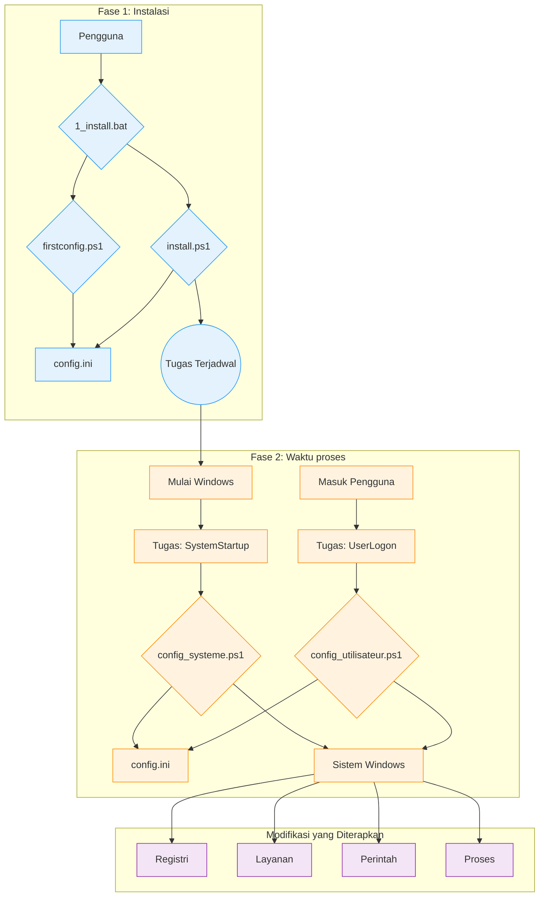

# Dokumentasi Teknis WindowsOrchestrator

Dokumen ini adalah referensi teknis untuk proyek WindowsOrchestrator. Ini merinci arsitektur, komponen, dan urutan eksekusi setiap skrip.

[toc]

## 1. Tinjauan Proyek

### 1.1. Tujuan Proyek

Proyek WindowsOrchestrator mengotomatiskan konfigurasi sistem operasi Windows. Ini menjalankan skrip yang memodifikasi pengaturan sistem dan mengelola aplikasi. Tindakan yang dilakukan oleh skrip mengubah instalasi Windows standar menjadi lingkungan yang perilakunya ditentukan oleh file konfigurasi pusat.

Skrip membaca file config.ini untuk menjalankan perintah yang memodifikasi kunci Registri, mengelola layanan Windows, mengonfigurasi pengaturan daya, membuat tugas terjadwal, dan mengelola siklus hidup proses pengguna.

Proyek ini menyediakan seperangkat skrip yang menerapkan konfigurasi untuk manajemen daya, pembaruan sistem, sesi pengguna, dan siklus hidup aplikasi.

### 1.2. Prinsip Operasi

Operasi WindowsOrchestrator didasarkan pada empat mekanisme utama.

1.  **Eksekusi oleh Alat Windows Asli**
    Proyek ini menggunakan fitur dan perintah yang ada di dalam Windows: PowerShell 5.1, Penjadwal Tugas, Editor Registri, dan utilitas baris perintah (`powercfg`, `shutdown`). Proyek ini tidak memerlukan instalasi dependensi eksternal apa pun.

2.  **Konfigurasi melalui File Terpusat**
    Logika eksekusi skrip terpisah dari konfigurasi. Skrip membaca file `config.ini` untuk menentukan tindakan yang akan dilakukan. Untuk mengubah perilaku skrip, pengguna memodifikasi nilai di `config.ini`.

3.  **Pemisahan Konteks Eksekusi (Sistem vs. Pengguna)**
    Proyek ini menggunakan dua konteks eksekusi yang berbeda:
    *   Skrip **`config_systeme.ps1`** berjalan dengan izin akun `NT AUTHORITY\SYSTEM` dan memodifikasi pengaturan global mesin (Registri HKLM, layanan, tugas terjadwal).
    *   Skrip **`config_utilisateur.ps1`** berjalan dengan izin pengguna yang masuk dan mengelola proses sesi mereka.

4.  **Idempotensi Tindakan**
    Skrip ditulis sedemikian rupa sehingga menjalankannya berulang kali menghasilkan keadaan akhir yang sama seperti menjalankannya sekali. Sebelum memodifikasi pengaturan, skrip memeriksa keadaan sistem saat ini. Jika keadaan yang diinginkan sudah diterapkan, skrip tidak mengulangi tindakan modifikasi.

## 2. Arsitektur dan Komponen Kunci

Arsitektur WindowsOrchestrator menggunakan komponen Windows asli. Setiap komponen memiliki peran yang ditentukan.

### 2.1. Diagram Arsitektur

Alur eksekusi dan interaksi antar komponen diwakili oleh diagram berikut:

Diagram ini menunjukkan pemisahan antara **fase instalasi**, yang diprakarsai oleh pengguna, dan **fase waktu proses**, siklus otomatis yang dikelola oleh Penjadwal Tugas.

### 2.2. Peran Penjadwal Tugas

Penjadwal Tugas Windows adalah komponen utama otomatisasi. Ini menjalankan skrip konfigurasi pada waktu yang ditentukan dan dengan tingkat hak istimewa yang diperlukan.

Dua tugas utama yang dibuat oleh `install.ps1` adalah:

*   **`WindowsOrchestrator-SystemStartup`**
    *   **Pemicu:** "Saat sistem dimulai".
    *   **Konteks Eksekusi:** `NT AUTHORITY\SYSTEM`. Akun ini memiliki hak istimewa yang diperlukan untuk memodifikasi kunci Registri di `HKEY_LOCAL_MACHINE` (HKLM), mengelola layanan, dan menjalankan perintah sistem.
    *   **Peran:** Untuk menjalankan semua konfigurasi tingkat mesin.

*   **`WindowsOrchestrator-UserLogon`**
    *   **Pemicu:** "Saat masuk" dari pengguna yang ditentukan.
    *   **Konteks Eksekusi:** Akun pengguna yang masuk. Skrip berjalan dengan hak istimewa pengguna ini, memungkinkannya untuk meluncurkan aplikasi grafis di sesi pengguna.
    *   **Peran:** Untuk menjalankan semua konfigurasi khusus sesi pengguna.

### 2.3. File `config.ini`: Sumber Konfigurasi

File `config.ini` berisi deskripsi keadaan akhir sistem yang diinginkan. Skrip PowerShell (`config_systeme.ps1`, `config_utilisateur.ps1`) membaca file ini dan menjalankan perintah yang diperlukan untuk membuat sistem sesuai dengan pengaturan yang ditentukan.

Mekanisme ini memiliki beberapa karakteristik faktual:
*   Perilaku skrip ditentukan oleh pasangan kunci-nilai yang terkandung dalam file config.ini.
*   Logika eksekusi terkandung dalam file skrip PowerShell (.ps1), sedangkan parameter yang mengontrol logika ini dibaca dari file .ini.
*   Skrip membaca file config.ini yang ada di direktori root mereka, yang memungkinkan instance terpisah dari proyek memiliki perilaku yang berbeda tergantung pada konten file config.ini mereka sendiri.

### 2.4. Sistem Internasionalisasi (i18n)

Proyek memuat string yang diterjemahkan tanpa memodifikasi kode sumber.

*   **Struktur File:** String disimpan dalam file `.psd1` yang terletak di subfolder direktori `i18n/`. Setiap subfolder dinamai sesuai dengan kode budaya (misalnya, `fr-FR`, `en-US`).

*   **Mekanisme Deteksi dan Pemuatan:**
    1.  Pada awal eksekusinya, skrip menjalankan perintah `(Get-Culture).Name` untuk mendapatkan kode budaya sistem (misalnya, `"fr-FR"`).
    2.  Skrip membuat jalur ke file bahasa yang sesuai (misalnya, `i18n\fr-FR\strings.psd1`).
    3.  **Logika Fallback:** Jika file ini tidak ada, skrip menggunakan jalur `i18n\en-US\strings.psd1`.
    4.  Konten file `.psd1` dibaca dan ditafsirkan oleh `Invoke-Expression`, yang memuat tabel hash string ke dalam variabel `$lang`.

*   **Penggunaan dalam Kode:**
    Untuk menampilkan pesan, kode mengakses tabel hash `$lang` melalui kunci (misalnya, `$lang.Uninstall_StartMessage`). Fungsi logging menggunakan parameter `-DefaultMessage` yang berisi teks bahasa Inggris jika kunci tidak ditemukan.

Untuk menambahkan bahasa baru, pengguna harus menyalin folder `en-US`, menamainya kembali dengan kode budaya baru, dan menerjemahkan nilai dalam file `strings.psd1`.

## 3. Siklus Hidup dan Urutan Eksekusi

Bagian ini menguraikan proses proyek menjadi urutan eksekusi kronologis.

### 3.1. Urutan Instalasi Lengkap

1.  **Fase 1 - Peluncuran dan Konfigurasi (Konteks Pengguna)**
    *   Pengguna menjalankan `1_install.bat`.
    *   Skrip batch mengeksekusi `management\firstconfig.ps1`.
    *   **`firstconfig.ps1` berjalan:**
        *   Ini memeriksa keberadaan file `config.ini`. Jika tidak ada, ia membuatnya dari templat `management/defaults/default_config.ini`. Jika ada, ia menanyakan kepada pengguna apakah mereka ingin menggantinya.
        *   Ini menampilkan GUI Formulir Windows, yang diisi sebelumnya dengan nilai yang dibaca dari `config.ini`.
        *   Ketika "Simpan dan Tutup" diklik, skrip menulis nilai dari bidang antarmuka ke `config.ini`.
        *   Skrip `firstconfig.ps1` berakhir.

2.  **Fase 2 - Peningkatan dan Instalasi (Konteks Administrator)**
    *   Skrip `1_install.bat` dilanjutkan.
    *   Ini menjalankan perintah PowerShell yang menggunakan `Start-Process PowerShell -Verb RunAs` untuk meluncurkan `install.ps1`.
    *   Windows memicu prompt **Kontrol Akun Pengguna (UAC)**. Pengguna harus memberikan hak istimewa.
    *   **`install.ps1` berjalan dengan hak istimewa Administrator:**
        *   Ini memeriksa keberadaan file `config_systeme.ps1` dan `config_utilisateur.ps1`.
        *   Ini menjalankan perintah `Register-ScheduledTask` untuk membuat dua tugas:
            *   **`WindowsOrchestrator-SystemStartup`**, yang menjalankan `config_systeme.ps1` saat startup (`-AtStartup`) dengan akun `NT AUTHORITY\SYSTEM`.
            *   **`WindowsOrchestrator-UserLogon`**, yang menjalankan `config_utilisateur.ps1` saat masuk (`-AtLogOn`) pengguna.
        *   Untuk menerapkan konfigurasi, skrip menjalankan `config_systeme.ps1` dan kemudian `config_utilisateur.ps1` melalui `Start-Process -Wait`.
    *   Skrip `install.ps1` berakhir.

### 3.2. Urutan Eksekusi Startup (Waktu Proses - Tingkat Sistem)

1.  **Pemicu:** Sistem operasi Windows dimulai.
2.  **Eksekusi Tugas:** Penjadwal Tugas menjalankan tugas `WindowsOrchestrator-SystemStartup`.
3.  **Peluncuran Skrip:** Tugas mengeksekusi `powershell.exe` dengan hak istimewa akun `NT AUTHORITY\SYSTEM` untuk meluncurkan `config_systeme.ps1`.
4.  **Tindakan `config_systeme.ps1`:**
    *   Skrip mengurai `config.ini` dan memuat kontennya.
    *   Ini memeriksa konektivitas jaringan (`Test-NetConnection 8.8.8.8 -Port 53`).
    *   Ini menjalankan blok konfigurasi yang ditentukan dalam `[SystemConfig]`. Untuk setiap tindakan:
        *   Ini membaca nilai kunci.
        *   Ini memeriksa keadaan sistem saat ini (nilai registri, keadaan layanan).
        *   Jika keadaan saat ini berbeda dari keadaan yang diinginkan, ia menjalankan perintah modifikasi (`Set-ItemProperty`, `powercfg`, dll.).
        *   Ini mencatat tindakan atau kesalahan dalam daftar.
    *   Ini mengirimkan pemberitahuan Gotify (jika diaktifkan).
5.  **Akhir Urutan:** Skrip berakhir.

### 3.3. Urutan Eksekusi Masuk (Waktu Proses - Tingkat Pengguna)

1.  **Pemicu:** Pengguna masuk.
2.  **Eksekusi Tugas:** Penjadwal Tugas menjalankan tugas `WindowsOrchestrator-UserLogon`.
3.  **Peluncuran Skrip:** Tugas mengeksekusi `powershell.exe` dengan hak istimewa pengguna untuk meluncurkan `config_utilisateur.ps1` (`-WindowStyle Hidden`).
4.  **Tindakan `config_utilisateur.ps1`:**
    *   Skrip mengurai `config.ini`.
    *   Ini membaca parameter dari bagian `[Process]`.
    *   Ini menjalankan logika manajemen proses:
        1.  Ini menyelesaikan variabel lingkungan di jalur proses.
        2.  Ini mencari proses yang ada yang cocok dengan nama dan milik pengguna saat ini (diverifikasi oleh SID).
        3.  Jika ada yang ditemukan, ia mengakhirinya (`Stop-Process -Force`).
        4.  Ini meluncurkan instance baru dari proses tersebut.
    *   Ini mengirimkan pemberitahuan Gotify (jika diaktifkan).
5.  **Akhir Urutan:** Skrip berakhir.

### 3.4. Urutan Penghapusan Instalasi

1.  **Pemicu:** Pengguna menjalankan `2_uninstall.bat`.
2.  **Peningkatan:** Skrip `2_uninstall.bat` meluncurkan `management\uninstall.ps1`, yang meluncurkan kembali dirinya sendiri dengan `Start-Process -Verb RunAs`. Pengguna harus menerima prompt UAC.
3.  **Tindakan `uninstall.ps1`:**
    *   Skrip menanyakan pertanyaan kepada pengguna untuk menonaktifkan AutoLogon.
    *   Ini memulihkan kunci Registri sistem:
        *   Pembaruan Windows (`NoAutoUpdate` -> `0`).
        *   Mulai Cepat (`HiberbootEnabled` -> `1`).
        *   OneDrive (penghapusan `DisableFileSyncNGSC`).
        *   AutoLogon (`AutoAdminLogon` -> `0`) jika diminta.
    *   Ini menjalankan `Unregister-ScheduledTask` untuk menghapus empat tugas terjadwal.
    *   Ini menampilkan ringkasan dan menginformasikan bahwa file tidak dihapus.
4.  **Akhir Urutan:** Skrip berakhir.

## 4. Prosedur Instalasi dan Penghapusan Instalasi

Bagian ini menjelaskan urutan operasi yang dilakukan oleh skrip batch untuk menginstal, mengaktifkan, menghapus instalasi, dan memulihkan sistem.

### 4.1. Prosedur Instalasi

Prosedur ini dimulai dengan menjalankan file `1_install.bat`. Ini dibagi menjadi dua fase yang berbeda.

#### 4.1.1. Fase 1: Konfigurasi (Konteks Pengguna)

1.  File `1_install.bat` mengeksekusi skrip `management\firstconfig.ps1` melalui perintah `powershell.exe`.
2.  Skrip `firstconfig.ps1` memeriksa keberadaan file `config.ini` di root proyek.
    *   Jika file `config.ini` tidak ada, itu dibuat dengan menyalin file `management/defaults/default_config.ini`.
    *   Jika file `config.ini` ada, kotak dialog `System.Windows.Forms.MessageBox` ditampilkan, menanyakan kepada pengguna apakah mereka ingin mengganti file yang ada dengan templat.
3.  Skrip kemudian menampilkan antarmuka pengguna grafis (Formulir Windows) yang bidangnya diisi sebelumnya dengan nilai yang dibaca dari file `config.ini`.
4.  Ketika pengguna mengklik tombol "Simpan dan Tutup", nilai dari bidang antarmuka ditulis ke file `config.ini` melalui fungsi `Set-IniValue`. Skrip berakhir.

#### 4.1.2. Fase 2: Instalasi Tugas (Konteks Administrator)

1.  Kontrol kembali ke skrip `1_install.bat`. Ini menjalankan perintah `powershell.exe` yang satu-satunya perannya adalah meluncurkan instance kedua PowerShell melalui perintah `Start-Process PowerShell -Verb RunAs`.
2.  Tindakan ini memicu prompt Kontrol Akun Pengguna (UAC). Pengguna harus memberikan hak istimewa untuk melanjutkan.
3.  Skrip `management\install.ps1` berjalan dengan hak istimewa administrator dan melakukan tindakan berikut:
    *   Ini membuat tugas terjadwal **`WindowsOrchestrator-SystemStartup`** melalui `Register-ScheduledTask`. Pemicu diatur ke `-AtStartup` dan prinsipal eksekusi adalah `NT AUTHORITY\SYSTEM` (`-UserId "NT AUTHORITY\SYSTEM"`). Tindakannya adalah eksekusi skrip `config_systeme.ps1`.
    *   Ini membuat tugas terjadwal **`WindowsOrchestrator-UserLogon`** melalui `Register-ScheduledTask`. Pemicu diatur ke `-AtLogOn` untuk pengguna saat ini dan prinsipal eksekusi adalah pengguna yang sama (`-UserId "$($env:USERDOMAIN)\$($env:USERNAME)"`). Tindakannya adalah eksekusi skrip `config_utilisateur.ps1`.

4.  Untuk menerapkan konfigurasi segera, `install.ps1` kemudian mengeksekusi, secara berurutan dan menunggu setiap proses selesai (`-Wait`), skrip `config_systeme.ps1` dan kemudian `config_utilisateur.ps1`.

#### 4.1.3. Keadaan Sistem Pasca-Instalasi

*   Dua tugas terjadwal, `WindowsOrchestrator-SystemStartup` dan `WindowsOrchestrator-UserLogon`, dibuat dan aktif di Penjadwal Tugas Windows.
*   File `config.ini` ada di root proyek dan berisi konfigurasi yang ditentukan pengguna.
*   Direktori `Logs` ada di root proyek dan berisi file log dari eksekusi awal.
*   Pengaturan sistem yang ditentukan dalam `config.ini` telah diterapkan untuk pertama kalinya.

### 4.2. Prosedur Penghapusan Instalasi

Prosedur ini dimulai dengan menjalankan file `2_uninstall.bat`.

#### 4.2.1. Peningkatan Hak Istimewa

1.  File `2_uninstall.bat` mengeksekusi skrip `management\uninstall.ps1`.
2.  Skrip `uninstall.ps1` memeriksa tingkat hak istimewanya sendiri. Jika bukan administrator, ia meluncurkan kembali dirinya sendiri melalui `Start-Process powershell.exe -Verb RunAs`, yang memicu prompt UAC yang harus divalidasi oleh pengguna.

#### 4.2.2. Tindakan yang Dilakukan oleh Skrip

Skrip `management\uninstall.ps1`, yang berjalan dengan hak istimewa administrator, melakukan operasi berikut:

1.  **Interaksi Pengguna:** Skrip menampilkan prompt di konsol melalui `Read-Host`, menanyakan kepada pengguna apakah mereka ingin menonaktifkan masuk otomatis. Respons pengguna disimpan dalam variabel.
2.  **Pemulihan Pengaturan Sistem:**
    *   Jika pengguna menjawab `y` atau `yes`, skrip menulis nilai string `"0"` ke kunci Registri `HKLM:\SOFTWARE\Microsoft\Windows NT\CurrentVersion\Winlogon\AutoAdminLogon`.
    *   Ini menulis nilai DWORD `0` ke kunci `HKLM:\...\WindowsUpdate\AU\NoAutoUpdate`.
    *   Ini menulis nilai DWORD `0` ke kunci `HKLM:\...\WindowsUpdate\AU\NoAutoRebootWithLoggedOnUsers`.
    *   Ini menulis nilai DWORD `1` ke kunci `HKLM:\...\Power\HiberbootEnabled`.
    *   Ini menghapus nilai `DisableFileSyncNGSC` dari kunci `HKLM:\...\OneDrive` melalui `Remove-ItemProperty`.
    *   Ini mengubah jenis startup layanan `wuauserv` menjadi `Automatic` melalui `Set-Service`.
3.  **Penghapusan Tugas Terjadwal:**
    *   Skrip mengulangi daftar nama tugas yang telah ditentukan sebelumnya dan menjalankan `Unregister-ScheduledTask -Confirm:$false` untuk masing-masing. Tugas yang dihapus adalah:
        *   `WindowsOrchestrator-SystemStartup`
        *   `WindowsOrchestrator-UserLogon`
        *   `WindowsOrchestrator-SystemScheduledReboot`
        *   `WindowsOrchestrator-SystemPreRebootAction`

#### 4.2.3. Keadaan Sistem Pasca-Penghapusan Instalasi

*   Empat tugas terjadwal terkait proyek dihapus dari Penjadwal Tugas. Semua otomatisasi dihentikan.
*   Pengaturan Registri dan layanan yang tercantum di atas dikembalikan ke nilai defaultnya.
*   Pengaturan daya yang dimodifikasi oleh perintah `powercfg` tidak diubah oleh skrip penghapusan instalasi.
*   Direktori proyek, termasuk semua skrip, file `config.ini`, dan log, tidak dihapus dan tetap ada di disk.

## 5. Panduan Konfigurasi Mendalam (`config.ini`)

File `config.ini` adalah pusat kendali deklaratif proyek. Panduan ini menjelaskan setiap kunci, dampaknya pada eksekusi skrip, nilai yang mungkin, dan interaksinya dengan pengaturan lain. Nilai default adalah yang ditentukan dalam file `management/defaults/default_config.ini`.

### 5.1. Bagian `[SystemConfig]`

Bagian ini mengatur pengaturan yang memengaruhi seluruh sistem dan dibaca secara eksklusif oleh `config_systeme.ps1`.

---

**`AutoLoginUsername`**

*   **Peran:** Menentukan nama pengguna yang akan ditulis ke kunci Registri `DefaultUserName`. Nilai ini juga digunakan oleh logika tindakan pra-reboot untuk menyelesaikan jalur `%USERPROFILE%`.
*   **Nilai yang mungkin:** String yang mewakili nama pengguna lokal atau domain (misalnya, `Admin`, `DOMAIN\User`). Jika nilai dibiarkan kosong, skrip mencoba membaca nilai yang sudah ada di kunci Registri `DefaultUserName`.
*   **Nilai default:** "" (string kosong)
*   **Saling ketergantungan:** Parameter ini diperlukan jika `EnableAutoLogin` adalah `true`. Ini juga diperlukan agar variabel `%USERPROFILE%` dapat digunakan di kunci `PreRebootActionCommand`.

---

**`EnableAutoLogin`**

*   **Peran:** Mengontrol keadaan masuk otomatis Windows.
*   **Tindakan skrip:** Jika nilainya `true`, skrip menulis `"1"` ke kunci Registri `HKLM:\SOFTWARE\Microsoft\Windows NT\CurrentVersion\Winlogon\AutoAdminLogon`. Jika nilainya `false`, ia menulis `"0"`.
*   **Nilai yang mungkin:** `true`, `false`
*   **Nilai default:** `false`
*   **Saling ketergantungan:** Memerlukan `AutoLoginUsername` untuk dikonfigurasi dengan benar agar berfungsi penuh. **Catatan Pengembang:** Skrip tidak menangani kata sandi (`DefaultPassword`), yang harus dikonfigurasi di luar band (misalnya, dengan alat Sysinternals AutoLogon).

---

**`DisableFastStartup`**

*   **Peran:** Mengontrol fitur Mulai Cepat Windows (Hiberboot).
*   **Tindakan skrip:** Jika `true`, tulis nilai `0` (DWORD) ke kunci Registri `HKLM:\...\Power\HiberbootEnabled`. Jika `false`, tulis `1`.
*   **Nilai yang mungkin:** `true`, `false`
*   **Nilai default:** `true`
*   **Saling ketergantungan:** Tidak ada.

---

**`DisableSleep`** dan **`DisableScreenSleep`**

*   **Peran:** Mengelola keadaan tidur mesin dan layar.
*   **Tindakan skrip:**
    *   Untuk `DisableSleep=true`, jalankan perintah `powercfg /change standby-timeout-ac 0` dan `powercfg /change hibernate-timeout-ac 0`.
    *   Untuk `DisableScreenSleep=true`, jalankan perintah `powercfg /change monitor-timeout-ac 0`.
*   **Nilai yang mungkin:** `true`, `false`
*   **Nilai default:** `DisableSleep=true`, `DisableScreenSleep=false`
*   **Saling ketergantungan:** Tidak ada.

---

**`DisableWindowsUpdate`**

*   **Peran:** Menonaktifkan layanan Pembaruan Windows sepenuhnya.
*   **Tindakan skrip:** Jika `true`, skrip melakukan tiga tindakan:
    1.  Menulis nilai `1` (DWORD) ke kunci `HKLM:\...\WindowsUpdate\AU\NoAutoUpdate`.
    2.  Mengubah jenis startup layanan `wuauserv` menjadi `Disabled`.
    3.  Menghentikan layanan `wuauserv` (`Stop-Service`).
*   **Nilai yang mungkin:** `true`, `false`
*   **Nilai default:** `true`
*   **Saling ketergantungan:** Tidak ada.

---

**`DisableAutoReboot`**

*   **Peran:** Mencegah Windows memulai ulang secara otomatis setelah pembaruan jika sesi pengguna aktif.
*   **Tindakan skrip:** Jika `true`, tulis nilai `1` (DWORD) ke kunci Registri `HKLM:\...\WindowsUpdate\AU\NoAutoRebootWithLoggedOnUsers`.
*   **Nilai yang mungkin:** `true`, `false`
*   **Nilai default:** `true`
*   **Saling ketergantungan:** Pengaturan ini terutama relevan ketika `DisableWindowsUpdate` adalah `false`.

---

**`ScheduledRebootTime`**

*   **Peran:** Menjadwalkan reboot harian mesin.
*   **Tindakan skrip:** Jika nilai diberikan, skrip membuat/memperbarui tugas terjadwal (`WindowsOrchestrator-SystemScheduledReboot`) yang menjalankan `shutdown.exe /r /f /t 60` pada waktu yang ditentukan. Jika nilai kosong, tugas terjadwal dihapus.
*   **Nilai yang mungkin:** String dalam format `HH:MM` (misalnya, `03:00`), atau string kosong untuk menonaktifkan.
*   **Nilai default:** `03:00`
*   **Saling ketergantungan:** Skrip membuat dua tugas terjadwal terpisah untuk tindakan pra-reboot dan reboot. Penjadwal Tugas Windows menjalankan setiap tugas pada waktu yang ditentukan, tanpa memeriksa urutan kronologisnya.

---

**`PreRebootAction...`** (kelompok 4 kunci)

*   **Peran:** Menjalankan perintah khusus sebelum reboot terjadwal. Blok ini hanya aktif jika `PreRebootActionTime` dan `PreRebootActionCommand` keduanya tidak kosong.
*   **Tindakan skrip:** Membuat/memperbarui tugas terjadwal (`WindowsOrchestrator-SystemPreRebootAction`) yang menjalankan perintah yang ditentukan. Skrip menyelesaikan variabel lingkungan (`%USERPROFILE%`) dan jalur relatif di `PreRebootActionCommand`.
*   **Kunci:**
    *   `PreRebootActionTime`: Waktu pemicu (`HH:MM`).
    *   `PreRebootActionCommand`: Jalur ke file yang dapat dieksekusi atau skrip.
    *   `PreRebootActionArguments`: Argumen untuk diteruskan ke perintah.
    *   `PreRebootActionLaunchMethod`: Metode eksekusi (`direct`, `powershell`, `cmd`).
*   **Nilai default:** `02:55`, `"PreReboot.bat"`, `""`, `cmd`
*   **Saling ketergantungan:** Eksekusi tugas 'WindowsOrchestrator-SystemPreRebootAction' tidak tergantung pada keberadaan tugas 'WindowsOrchestrator-SystemScheduledReboot'.

---

**`DisableOneDrive`**

*   **Peran:** Menonaktifkan integrasi OneDrive melalui kebijakan sistem.
*   **Tindakan skrip:** Jika `true`, tulis nilai `1` (DWORD) ke kunci Registri `HKLM:\...\OneDrive\DisableFileSyncNGSC`. Jika `false`, kunci dihapus.
*   **Nilai yang mungkin:** `true`, `false`
*   **Nilai default:** `true`
*   **Saling ketergantungan:** Tidak ada.

### 5.2. Bagian `[Process]`

Bagian ini, yang dibaca oleh `config_utilisateur.ps1`, menjelaskan cara mengelola aplikasi bisnis utama. Operasi ini didasarkan pada trio kunci yang saling bergantung berikut:

*   **`ProcessName` ("Apa")**
    *   **Peran:** Mendefinisikan jalur lengkap ke file yang dapat dieksekusi atau skrip yang akan diluncurkan. Ini adalah target utama dari tindakan tersebut.
    *   **Tindakan skrip:** Skrip menggunakan nilai ini untuk mengidentifikasi proses yang akan dihentikan dan sebagai target perintah mulai. Ini mendukung variabel lingkungan sistem dan pengguna (misalnya, `%USERPROFILE%`, `%PROGRAMFILES%`) yang diselesaikan secara dinamis saat runtime.

*   **`ProcessArguments` ("Dengan Apa")**
    *   **Peran:** Menentukan argumen baris perintah yang akan diteruskan ke file yang dapat dieksekusi/skrip yang ditentukan dalam `ProcessName`.
    *   **Tindakan skrip:** String ini ditambahkan ke perintah eksekusi. Jika kosong, tidak ada argumen yang diteruskan.

*   **`LaunchMethod` ("Bagaimana")**
    *   **Peran:** Menentukan juru bahasa perintah yang akan digunakan untuk meluncurkan `ProcessName`. Pilihan ini sangat penting untuk kompatibilitas.
    *   **Tindakan skrip:** Skrip membuat perintah akhir secara berbeda tergantung pada nilainya:
        *   `direct`: Meluncurkan file yang dapat dieksekusi secara langsung. Perintahnya adalah `ProcessName "ProcessArguments"`. Ini adalah metode standar untuk file `.exe`.
        *   `cmd`: Meluncurkan melalui juru bahasa perintah `cmd.exe`. Perintah yang dihasilkan adalah `cmd.exe /c ""ProcessName" ProcessArguments"`. Ini adalah metode yang direkomendasikan untuk skrip batch (`.bat`, `.cmd`).
        *   `powershell`: Meluncurkan melalui PowerShell. Perintah yang dihasilkan adalah `powershell.exe -NoProfile -ExecutionPolicy Bypass -Command "& 'ProcessName' ProcessArguments'"`. Ini adalah metode yang ideal untuk menjalankan skrip PowerShell lainnya (`.ps1`).

### 5.3. Bagian `[Logging]`

Bagian ini mengonfigurasi perilaku file log.

*   **`EnableLogRotation`**
    *   **Peran:** Mengaktifkan atau menonaktifkan mekanisme pengarsipan log.
    *   **Tindakan skrip:** Jika `true`, sebelum menulis ke file log (`log.txt`), fungsi `Rotate-LogFile` dipanggil. Ini mengganti nama `log.txt` menjadi `log.1.txt`, `log.1.txt` menjadi `log.2.txt`, dan seterusnya, hingga batasnya, dan menghapus yang tertua. Jika `false`, fungsi ini tidak dipanggil dan file log tumbuh tanpa batas.
*   **`MaxSystemLogsToKeep`** dan **`MaxUserLogsToKeep`**
    *   **Peran (Dimaksudkan):** Kunci-kunci ini disediakan di `default_config.ini` untuk menentukan jumlah file log yang diarsipkan yang akan disimpan.
    *   **Tindakan skrip (Saat Ini):** Kunci MaxSystemLogsToKeep dan MaxUserLogsToKeep tidak dibaca oleh skrip config_systeme.ps1. Fungsi Rotate-LogFile dipanggil dengan nilai tetap 7, yang ditentukan oleh variabel $DefaultMaxLogs.

### 5.4. Bagian `[Gotify]`

Bagian ini mengontrol pengiriman pemberitahuan status ke server Gotify.

*   **`EnableGotify`**: Jika `true`, skrip akan mencoba mengirim pemberitahuan di akhir eksekusinya.
*   **`Url`**: URL dasar instance Gotify (misalnya, `http://gotify.example.com`).
*   **`Token`**: Token aplikasi yang dihasilkan di Gotify untuk mengotorisasi pengiriman pesan.
*   **`Priority`**: Bilangan bulat yang menentukan prioritas pesan di Gotify.
*   **`GotifyTitle...`** (kelompok 4 kunci):
    *   **Peran:** Templat untuk judul pemberitahuan.
    *   **Tindakan skrip:** Sebelum mengirim pemberitahuan, skrip mengambil string dari kunci yang sesuai (misalnya, `GotifyTitleErrorSystem`) dan mengganti string literal `%COMPUTERNAME%` dan `%USERNAME%` dengan nilai variabel lingkungan yang sesuai.

## 6. Deskripsi Skrip Terperinci (Referensi Kode)

Bagian ini berfungsi sebagai referensi untuk kode sumber. Ini menguraikan logika dan mekanisme internal setiap skrip utama dalam proyek.

### 6.1. Skrip Orkestrasi (`management/`)

Skrip-skrip ini mengelola siklus hidup proyek (instalasi, konfigurasi awal, penghapusan instalasi). Mereka dirancang untuk dijalankan secara manual oleh pengguna.

#### **`firstconfig.ps1`**

*   **Peran:** Menyediakan antarmuka pengguna grafis (GUI) untuk konfigurasi terbantu dari file `config.ini`.
*   **Logika GUI:**
    *   Skrip menggunakan rakitan .NET `System.Windows.Forms` dan `System.Drawing`, yang dimuat melalui `Add-Type`, untuk membangun objek antarmuka secara dinamis (Form, Label, TextBox, CheckBox, Button).
    *   Penempatan kontrol dikelola oleh variabel (`$xPadding`, `$yCurrent`) yang bertambah setelah setiap elemen ditambahkan.
    *   Bahasa antarmuka dimuat secara dinamis dari file `strings.psd1`.
*   **Manajemen `config.ini`:**
    *   **Membaca:** Saat diluncurkan, skrip membaca nilai saat ini dari `config.ini` menggunakan fungsi `Get-IniValue` lokal. Fungsi ini melakukan pembacaan baris demi baris file untuk mengekstrak nilai. Nilai `true`/`false` diubah menjadi tipe `[bool]` PowerShell untuk `CheckBoxes`.
    *   **Menulis:** Ketika tombol "Simpan" diklik, peristiwa `Add_Click` memanggil fungsi `Set-IniValue` lokal untuk setiap parameter. Fungsi ini membangun kembali konten file di memori sebelum menuliskannya ke disk dengan pengkodean UTF-8.

#### **`install.ps1`**

*   **Peran:** Membuat persistensi sistem dengan menginstal tugas terjadwal dan melakukan eksekusi awal skrip waktu proses.
*   **Mekanisme Peningkatan Mandiri:** Skrip memeriksa tingkat hak istimewanya melalui `New-Object Security.Principal.WindowsPrincipal`. Jika bukan "Administrator", ia meluncurkan kembali dirinya sendiri dengan `Start-Process powershell.exe -Verb RunAs`.
*   **Logika Pembuatan Tugas:**
    *   Skrip menggunakan cmdlet asli `New-ScheduledTaskAction`, `New-ScheduledTaskTrigger`, `New-ScheduledTaskPrincipal`, `New-ScheduledTaskSettingsSet`, dan `Register-ScheduledTask`.
    *   **Manajemen Prinsipal:**
        *   Untuk `...-SystemStartup`, ia menggunakan `-UserId "NT AUTHORITY\SYSTEM" -RunLevel Highest`.
        *   Untuk `...-UserLogon`, ia menggunakan `-UserId "$($env:USERDOMAIN)\$($env:USERNAME)" -LogonType Interactive`.
*   **Eksekusi Pasca-Instalasi:**
    *   Setelah mendaftarkan tugas, skrip mengeksekusi `config_systeme.ps1` dan kemudian `config_utilisateur.ps1` melalui `Start-Process -Wait`.

#### **`uninstall.ps1`**

*   **Peran:** Menghapus komponen otomatisasi dan memulihkan pengaturan sistem penting.
*   **Logika Pemulihan:**
    *   Skrip berisi nilai "default" Windows yang dikodekan secara keras dalam kodenya untuk memulihkan keadaan sistem.
    *   Ini menggunakan cmdlet yang sama dengan `config_systeme.ps1` (`Set-ItemProperty`, `Set-Service`) tetapi dengan nilai terbalik.
    *   Operasi dienkapsulasi dalam blok `try...catch`.
*   **Logika Pembersihan:**
    *   Ini menggunakan daftar yang telah ditentukan sebelumnya (`$TasksToRemove`) yang berisi nama empat tugas terjadwal.
    *   Ini mengulang daftar ini dan menjalankan `Get-ScheduledTask` untuk memeriksa apakah tugas ada, lalu `Unregister-ScheduledTask -Confirm:$false` untuk menghapusnya.

### 6.2. Skrip Waktu Proses (Root)

Skrip-skrip ini berisi logika bisnis utama dan dieksekusi secara otomatis oleh tugas terjadwal.

#### **`config_systeme.ps1`**

*   **Arsitektur Skrip:** Skrip disusun menjadi beberapa wilayah: fungsi dasar, fungsi utilitas, inisialisasi, dan blok eksekusi utama (`try...catch...finally`).
*   **Fungsi Kunci:**
    *   `Get-IniContent`: Mengurai `config.ini` dan mengubahnya menjadi tabel hash PowerShell bersarang (`$ini['Section']['Key']`).
    *   `Get-ConfigValue`: Ini adalah pembungkus untuk mengakses konfigurasi. Ini menangani kunci/bagian yang hilang, menyediakan nilai default, dan melakukan konversi tipe.
    *   `Add-Action` / `Add-Error`: Fungsi-fungsi ini memusatkan logging. Mereka menambahkan pesan ke daftar global (`$Global:ActionsEffectuees`, `$Global:ErreursRencontrees`) yang digunakan untuk membangun laporan Gotify.
*   **Logika Eksekusi:** Badan utama skrip adalah urutan blok konfigurasi. Setiap blok bersifat idempoten: ia membaca keadaan sistem saat ini (nilai registri, keadaan layanan) terlebih dahulu sebelum menulis.

#### **`config_utilisateur.ps1`**

*   **Peran:** Memastikan bahwa aplikasi bisnis yang ditentukan dalam `[Process]` berada dalam keadaan yang diinginkan (satu instance yang baru diluncurkan).
*   **Logika Manajemen Proses:**
    1.  **Resolusi Jalur:** `ProcessName` diproses oleh `[System.Environment]::ExpandEnvironmentVariables()` untuk menyelesaikan variabel seperti `%USERPROFILE%`.
    2.  **Identifikasi Pemilik:** Pencarian proses yang ada menggunakan `Get-Process` untuk menemukan proses berdasarkan nama, lalu `Get-CimInstance Win32_Process` untuk mengambil pemilik setiap proses. Ini membandingkan SID pemilik proses dengan SID pengguna saat ini (`[System.Security.Principal.WindowsIdentity]::GetCurrent().User.Value`).
    3.  **Hentikan dan Mulai Ulang:** Jika proses yang cocok ditemukan, proses tersebut dihentikan melalui `Stop-Process -Force`. Kemudian, instance baru diluncurkan menggunakan `Start-Process`. "Splatting" (`@startProcessSplat`) digunakan untuk panggilan ke `Start-Process`.

### 6.3. Skrip Utilitas dan Peluncur

Skrip-skrip ini adalah alat pendukung atau contoh integrasi.

#### **`Close-AppByTitle.ps1`**

*   **Interaksi dengan `user32.dll`:**
    *   Ini menyuntikkan kelas C# ke dalam memori melalui `Add-Type -TypeDefinition`. Kode C# ini menggunakan atribut `[DllImport("user32.dll")]` untuk mengekspos fungsi API Windows ke PowerShell.
    *   Fungsi `EnumWindows` digunakan dengan blok skrip PowerShell sebagai "panggilan balik". Untuk setiap jendela yang ditemukan oleh API, blok PowerShell ini dieksekusi. Di blok inilah judul jendela diperiksa.
    *   Setelah jendela target diidentifikasi oleh `handle`-nya, `SetForegroundWindow` dipanggil untuk memberinya fokus, lalu `[System.Windows.Forms.SendKeys]::SendWait()` mensimulasikan penekanan tombol.

#### **`PreReboot.bat`** dan **`LaunchApp.bat`**

*   **Portabilitas:** Operasi peluncur ini bergantung pada variabel skrip batch khusus `%~dp0`, yang diselesaikan ke jalur lengkap direktori tempat skrip berada.

#### **`management/tools/Find-WindowInfo.ps1`**

*   **Utilitas:** Skrip ini adalah alat debugging dan konfigurasi.
*   **Operasi:** Ini menggunakan injeksi kode C# yang sama dan teknik panggilan API `EnumWindows` seperti `Close-AppByTitle.ps1`. Ini menampilkan daftar jendela yang terlihat yang diformat, dengan nama proses dan PID-nya.

## 7. Prosedur Pemeliharaan dan Debugging

Bagian ini menyediakan panduan praktis untuk mendiagnosis masalah dan menguji perubahan.

### 7.1. Memahami dan Menggunakan Log (`Logs/`)

*   **Lokasi:** Log dibuat di subfolder `Logs/`.
    *   `config_systeme_ps_log.txt`: Berisi log dari skrip sistem.
    *   `config_utilisateur_log.txt`: Berisi log dari skrip pengguna.
*   **Struktur Pesan Log:** `YYYY-MM-DD HH:mm:ss [LEVEL] [Context] - Message`
*   **Cara Mengidentifikasi Tindakan dan Kesalahan:**
    *   **Tindakan Berhasil:** `ACTION: ...`
    *   **Kesalahan yang Ditangkap:** `CAPTURED ERROR: ...`
    *   **Kesalahan Fatal:** `FATAL SCRIPT ERROR ...`

### 7.2. Men-debug Skrip Secara Manual

#### **Menjalankan `config_systeme.ps1` dengan hak `SYSTEM`**

1.  **Prasyarat:** Unduh `PsExec.exe` dari suite Microsoft Sysinternals.
2.  **Prosedur Eksekusi:**
    *   Buka command prompt sebagai administrator.
    *   Jalankan perintah: `PsExec.exe -s -i powershell.exe`
    *   Jendela PowerShell baru terbuka. Perintah `whoami` mengembalikan `nt authority\system`.
    *   Di jendela ini, navigasikan ke direktori proyek dan jalankan `.\config_systeme.ps1`.

#### **Menguji `config_utilisateur.ps1` di sesi pengguna**

1.  **Prosedur Eksekusi:**
    *   Masuk ke sesi Windows dengan akun pengguna target.
    *   Buka konsol PowerShell standar.
    *   Navigasikan ke direktori proyek dan jalankan `.\config_utilisateur.ps1`.

#### **Memeriksa Status Tugas Terjadwal**

1.  **Buka alat:** Jalankan `taskschd.msc`.
2.  **Temukan tugas:** Pilih "Pustaka Penjadwal Tugas".
3.  **Analisis informasi:**
    *   Periksa kolom "Status", "Pemicu", dan "Hasil Eksekusi Terakhir" (kode `0x0` menunjukkan keberhasilan).
    *   Lihat tab "Riwayat" untuk detail setiap eksekusi.

### **7.3. Pertimbangan Keamanan**

Bagian ini merinci mekanisme keamanan dan implikasi yang terkait dengan operasi proyek.

*   **Konteks Eksekusi Tugas Sistem**  
    Skrip `install.ps1` mengonfigurasi tugas terjadwal `WindowsOrchestrator-SystemStartup` untuk berjalan dengan izin akun `NT AUTHORITY\SYSTEM`. Akun ini memiliki hak istimewa yang luas pada sistem lokal, yang diperlukan untuk memungkinkan skrip `config_systeme.ps1` memodifikasi kunci Registri di sarang `HKEY_LOCAL_MACHINE` (HKLM) dan mengelola layanan sistem.

*   **Mekanisme Peningkatan Hak Istimewa (UAC)**  
    Skrip instalasi (`1_install.bat`) dan penghapusan instalasi (`2_uninstall.bat`) tidak perlu diluncurkan dari sesi administrator. Mereka menjalankan perintah `Start-Process -Verb RunAs` yang memicu prompt Kontrol Akun Pengguna (UAC) Windows. Kelanjutan eksekusi bergantung pada validasi pengguna atas prompt ini.

*   **Manajemen Kata Sandi Sesi**  
    Skrip proyek **tidak memproses, meminta, atau menyimpan** kata sandi pengguna dalam bentuk apa pun. Mengaktifkan fitur AutoLogon (`EnableAutoLogin=true`) hanya menulis nilai `"1"` ke kunci Registri `AutoAdminLogon`. Kunci `DefaultPassword` tidak pernah ditulis oleh skrip. Tanggung jawab untuk menyimpan kata sandi dengan aman di Registri ada pada pengguna, melalui alat eksternal seperti `Sysinternals AutoLogon`.

*   **Bypass Kebijakan Eksekusi**  
    Skrip peluncuran (`.bat`) dan perintah pembuatan tugas terjadwal secara sistematis menggunakan argumen `-ExecutionPolicy Bypass` saat memanggil `powershell.exe`. Argumen ini memungkinkan skrip berjalan terlepas dari kebijakan eksekusi yang dikonfigurasi pada sistem. Pengaturan ini hanya berlaku untuk instance proses yang sedang diluncurkan dan tidak secara permanen memodifikasi kebijakan keamanan sistem.

### **7.4. Keterbatasan yang Diketahui**

Bagian ini mendokumentasikan perilaku yang merupakan hasil dari pilihan desain atau mewakili fitur yang tidak diimplementasikan pada tahap ini.

*   **Tidak memulihkan Pengaturan Daya**  
    Skrip `uninstall.ps1` tidak menjalankan perintah `powercfg` apa pun. Oleh karena itu, perubahan yang dibuat oleh `config_systeme.ps1` mengenai tidur mesin (`standby-timeout-ac`) atau tidur layar (`monitor-timeout-ac`) tidak dibatalkan selama penghapusan instalasi.

*   **Konfigurasi Rotasi Log Tidak Aktif**  
    File templat konfigurasi (`default_config.ini`) berisi kunci `MaxSystemLogsToKeep` dan `MaxUserLogsToKeep`. Namun, fungsi `Rotate-LogFile` di `config_systeme.ps1` tidak membaca kunci-kunci ini. Ini menggunakan nilai tetap `7`, yang ditentukan dalam skrip oleh variabel `$DefaultMaxLogs`.

*   **Tidak Adanya Validasi Kronologis Tugas Reboot**  
    Skrip `config_systeme.ps1` membuat tugas terjadwal untuk tindakan pra-reboot dan reboot terjadwal sebagai dua entitas independen. Skrip tidak berisi logika untuk memverifikasi bahwa nilai `PreRebootActionTime` secara kronologis lebih awal dari `ScheduledRebootTime`.

## 8. Lampiran

### 8.1. Lisensi

Proyek ini didistribusikan di bawah persyaratan **Lisensi Publik Umum GNU v3 (GPLv3)**. Teks lengkap lisensi tersedia di root proyek dalam file `LICENSE`.

### 8.2. Glosarium Istilah

---
**UAC (Kontrol Akun Pengguna)**
*   **Definisi:** Mekanisme keamanan Windows yang memerlukan konfirmasi pengguna sebelum mengizinkan tindakan yang memerlukan hak istimewa administrator.
*   **Konteks dalam proyek:** Dipicu oleh `install.ps1` dan `uninstall.ps1` melalui parameter `-Verb RunAs` dari perintah `Start-Process`.
---
**Tugas Terjadwal (Scheduled Task)**
*   **Definisi:** Komponen layanan Windows "Penjadwal Tugas" yang memungkinkan skrip atau program dieksekusi secara otomatis.
*   **Konteks dalam proyek:** Mekanisme utama otomatisasi.
---
**Registri Windows (Windows Registry)**
*   **Definisi:** Basis data hierarkis tempat Windows menyimpan pengaturan konfigurasi.
*   **Konteks dalam proyek:** Target utama modifikasi oleh `config_systeme.ps1`.
---
**HKLM (HKEY_LOCAL_MACHINE)**
*   **Definisi:** Sarang Registri yang berisi pengaturan yang berlaku untuk seluruh mesin.
*   **Konteks dalam proyek:** Semua modifikasi Registri oleh `config_systeme.ps1` terletak di HKLM.
---
**SID (Pengidentifikasi Keamanan)**

*   **Definisi:** String unik yang mengidentifikasi prinsipal keamanan (pengguna, grup).
*   **Konteks dalam proyek:** Digunakan oleh `config_utilisateur.ps1` untuk mengidentifikasi pemilik proses.
---
**`NT AUTHORITY\SYSTEM` (Akun SYSTEM)**
*   **Definisi:** Akun layanan internal Windows dengan hak istimewa yang luas pada sistem lokal.
*   **Konteks dalam proyek:** Konteks eksekusi `config_systeme.ps1`.
---
**Idempotensi (Idempotence)**
*   **Definisi:** Properti operasi yang, jika diterapkan beberapa kali, menghasilkan hasil yang sama seolah-olah diterapkan sekali.
*   **Konteks dalam proyek:** Prinsip desain skrip untuk memastikan keadaan akhir yang stabil.
---
**Kebijakan Eksekusi PowerShell (Execution Policy)**
*   **Definisi:** Fitur keamanan PowerShell yang menentukan apakah skrip dapat dijalankan.
*   **Konteks dalam proyek:** Dilewati melalui parameter `-ExecutionPolicy Bypass` untuk memastikan eksekusi skrip.
