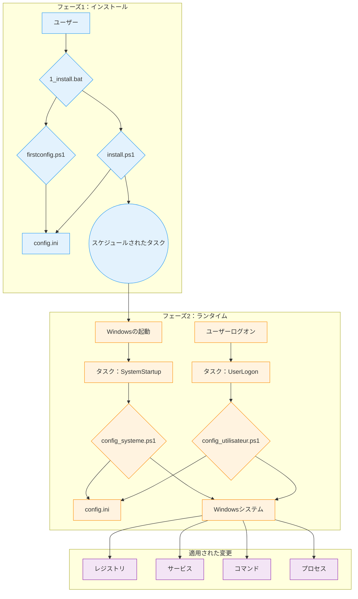

# WindowsOrchestrator 技術ドキュメント

このドキュメントは、WindowsOrchestratorプロジェクトの技術リファレンスです。各スクリプトのアーキテクチャ、コンポーネント、および実行シーケンスについて詳しく説明します。

* [1. プロジェクトの概要](#1-プロジェクトの概要)
  * [1.1. プロジェクトの目的](#11-プロジェクトの目的)
  * [1.2. 動作原理](#12-動作原理)
* [2. アーキテクチャと主要コンポーネント](#2-アーキテクチャと主要コンポーネント)
  * [2.1. アーキテクチャ図](#21-アーキテクチャ図)
  * [2.2. タスクスケジューラの役割](#22-タスクスケジューラの役割)
  * [2.3. `config.ini`ファイル：構成のソース](#23-configiniファイル構成のソース)
  * [2.4. 国際化（i18n）システム](#24-国際化i18nシステム)
* [3. ライフサイクルと実行シーケンス](#3-ライフサイクルと実行シーケンス)
  * [3.1. 完全なインストールシーケンス](#31-完全なインストールシーケンス)
  * [3.2. 起動実行シーケンス（ランタイム - システムレベル）](#32-起動実行シーケンスランタイム-システムレベル)
  * [3.3. ログオン実行シーケンス（ランタイム - ユーザーレベル）](#33-ログオン実行シーケンスランタイム-ユーザーレベル)
  * [3.4. アンインストールシーケンス](#34-アンインストールシーケンス)
* [4. インストールおよびアンインストール手順](#4-インストールおよびアンインストール手順)
  * [4.1. インストール手順](#41-インストール手順)
    * [4.1.1. フェーズ1：構成（ユーザーコンテキスト）](#411-フェーズ1構成ユーザーコンテキスト)
    * [4.1.2. フェーズ2：タスクのインストール（管理者コンテキスト）](#412-フェーズ2タスクのインストール管理者コンテキスト)
    * [4.1.3. インストール後のシステムの状態](#413-インストール後のシステムの状態)
  * [4.2. アンインストール手順](#42-アンインストール手順)
    * [4.2.1. 権限の昇格](#421-権限の昇格)
    * [4.2.2. スクリプトによって実行されるアクション](#422-スクリプトによって実行されるアクション)
    * [4.2.3. アンインストール後のシステムの状態](#423-アンインストール後のシステムの状態)
* [5. 詳細な構成ガイド（`config.ini`）](#5-詳細な構成ガイドconfigini)
  * [5.1. `[SystemConfig]`セクション](#51-systemconfigセクション)
  * [5.2. `[Process]`セクション](#52-processセクション)
  * [5.3. `[Logging]`セクション](#53-loggingセクション)
  * [5.4. `[Gotify]`セクション](#54-gotifyセクション)
* [6. 詳細なスクリプトの説明（コードリファレンス）](#6-詳細なスクリプトの説明コードリファレンス)
  * [6.1. オーケストレーションスクリプト（`management/`）](#61-オーケストレーションスクリプトmanagement)
    * [**`firstconfig.ps1`**](#firstconfigps1)
    * [**`install.ps1`**](#installps1)
    * [**`uninstall.ps1`**](#uninstallps1)
  * [6.2. ランタイムスクリプト（ルート）](#62-ランタイムスクリプトルート)
    * [**`config_systeme.ps1`**](#config_systemeps1)
    * [**`config_utilisateur.ps1`**](#config_utilisateurps1)
  * [6.3. ユーティリティスクリプトとランチャー](#63-ユーティリティスクリプトとランチャー)
    * [**`Close-AppByTitle.ps1`**](#close-appbytitleps1)
    * [**`PreReboot.bat`および`LaunchApp.bat`**](#prerebootbatおよびlaunchappbat)
    * [**`management/tools/Find-WindowInfo.ps1`**](#managementtoolsfind-windowinfops1)
* [7. メンテナンスとデバッグの手順](#7-メンテナンスとデバッグの手順)
  * [7.1. ログの理解と使用（`Logs/`）](#71-ログの理解と使用logs)
  * [7.2. スクリプトの手動デバッグ](#72-スクリプトの手動デバッグ)
    * [**`SYSTEM`権限で`config_systeme.ps1`を実行する**](#system権限でconfig_systemeps1を実行する)
    * [**ユーザーセッションで`config_utilisateur.ps1`をテストする**](#ユーザーセッションでconfig_utilisateurps1をテストする)
    * [**スケジュールされたタスクの状態を確認する**](#スケジュールされたタスクの状態を確認する)
  * [**7.3. セキュリティに関する考慮事項**](#73-セキュリティに関する考慮事項)
  * [**7.4. 既知の制限事項**](#74-既知の制限事項)
* [8. 付録](#8-付録)
  * [8.1. ライセンス](#81-ライセンス)
  * [8.2. 用語集](#82-用語集)

## 1. プロジェクトの概要

### 1.1. プロジェクトの目的

WindowsOrchestratorプロジェクトは、Windowsオペレーティングシステムの構成を自動化します。システム設定を変更し、アプリケーションを管理するスクリプトを実行します。スクリプトによって実行されるアクションは、標準のWindowsインストールを、その動作が中央構成ファイルによって定義される環境に変換します。

スクリプトはconfig.iniファイルを読み取り、レジストリキーの変更、Windowsサービスの管理、電源設定の構成、スケジュールされたタスクの作成、およびユーザープロセスのライフサイクルの管理を行うコマンドを実行します。

このプロジェクトは、電源管理、システム更新、ユーザーセッション、およびアプリケーションのライフサイクルの構成を適用する一連のスクリプトを提供します。

### 1.2. 動作原理

WindowsOrchestratorの動作は、4つの主要なメカニズムに基づいています。

1.  **ネイティブWindowsツールによる実行**
    このプロジェクトは、Windowsに組み込まれている機能とコマンドを使用します：PowerShell 5.1、タスクスケジューラ、レジストリエディタ、およびコマンドラインユーティリティ（`powercfg`、`shutdown`）。このプロジェクトでは、外部の依存関係をインストールする必要はありません。

2.  **集中管理されたファイルによる構成**
    スクリプトの実行ロジックは構成から分離されています。スクリプトは`config.ini`ファイルを読み取って、実行するアクションを決定します。スクリプトの動作を変更するには、ユーザーが`config.ini`の値を変更します。

3.  **実行コンテキストの分離（システム対ユーザー）**
    このプロジェクトでは、2つの異なる実行コンテキストを使用します。
    *   **`config_systeme.ps1`** スクリプトは、`NT AUTHORITY\SYSTEM`アカウントの権限で実行され、マシンのグローバル設定（HKLMレジストリ、サービス、スケジュールされたタスク）を変更します。
    *   **`config_utilisateur.ps1`** スクリプトは、ログインしているユーザーの権限で実行され、そのセッションのプロセスを管理します。

4.  **アクションのべき等性**
    スクリプトは、繰り返し実行しても一度だけ実行した場合と同じ最終状態になるように記述されています。設定を変更する前に、スクリプトはシステムの現在の状態を確認します。目的の状態がすでに適用されている場合、スクリプトは変更アクションを繰り返し実行しません。

## 2. アーキテクチャと主要コンポーネント

WindowsOrchestratorのアーキテクチャは、ネイティブのWindowsコンポーネントを使用します。各コンポーネントには、定義された役割があります。

### 2.1. アーキテクチャ図

実行フローとコンポーネント間の相互作用は、次の図で表されます。

この図は、ユーザーによって開始される**インストールフェーズ**と、タスクスケジューラによって管理される自動化されたサイクルである**ランタイムフェーズ**の分離を示しています。

### 2.2. タスクスケジューラの役割

Windowsタスクスケジューラは、自動化の中心的なコンポーネントです。定義された時間に、必要な権限レベルで構成スクリプトを実行します。

`install.ps1`によって作成される2つの主要なタスクは次のとおりです。

*   **`WindowsOrchestrator-SystemStartup`**
    *   **トリガー：** 「システムの起動時」。
    *   **実行コンテキスト：** `NT AUTHORITY\SYSTEM`。このアカウントには、`HKEY_LOCAL_MACHINE`（HKLM）のレジストリキーを変更し、サービスを管理し、システムコマンドを実行するために必要な権限があります。
    *   **役割：** すべてのマシンレベルの構成を実行します。

*   **`WindowsOrchestrator-UserLogon`**
    *   **トリガー：** 指定されたユーザーの「ログオン時」。
    *   **実行コンテキスト：** ログインしているユーザーのアカウント。スクリプトはこのユーザーの権限で実行され、ユーザーのセッションでグラフィカルアプリケーションを起動できます。
    *   **役割：** すべてのユーザーセッション固有の構成を実行します。

### 2.3. `config.ini`ファイル：構成のソース

`config.ini`ファイルには、システムの目的の最終状態の記述が含まれています。PowerShellスクリプト（`config_systeme.ps1`、`config_utilisateur.ps1`）はこのファイルを読み取り、システムが定義された設定に準拠するように必要なコマンドを実行します。

このメカニズムには、いくつかの事実に基づいた特徴があります。
*   スクリプトの動作は、config.iniファイルに含まれるキーと値のペアによって決定されます。
*   実行ロジックはPowerShellスクリプトファイル（.ps1）に含まれていますが、このロジックを制御するパラメータは.iniファイルから読み取られます。
*   スクリプトはルートディレクトリにあるconfig.iniファイルを読み取ります。これにより、プロジェクトの個別のインスタンスが、独自のconfig.iniファイルの内容に応じて異なる動作をすることができます。

### 2.4. 国際化（i18n）システム

プロジェクトは、ソースコードを変更せずに翻訳された文字列を読み込みます。

*   **ファイル構造：** 文字列は、`i18n/`ディレクトリのサブフォルダにある`.psd1`ファイルに保存されます。各サブフォルダは、カルチャコード（例：`fr-FR`、`en-US`）にちなんで名付けられています。

*   **検出および読み込みメカニズム：**
    1.  実行の開始時に、スクリプトは`(Get-Culture).Name`コマンドを実行して、システムのカルチャコード（例：`"fr-FR"`）を取得します。
    2.  スクリプトは、対応する言語ファイルへのパスを構築します（例：`i18n\fr-FR\strings.psd1`）。
    3.  **フォールバックロジック：** このファイルが存在しない場合、スクリプトはパス`i18n\en-US\strings.psd1`を使用します。
    4.  `.psd1`ファイルの内容は`Invoke-Expression`によって読み取られ、解釈されます。これにより、文字列のハッシュテーブルが`$lang`変数に読み込まれます。

*   **コードでの使用法：**
    メッセージを表示するには、コードはキーを介して`$lang`ハッシュテーブルにアクセスします（例：`$lang.Uninstall_StartMessage`）。ロギング関数は、キーが見つからない場合に英語のテキストを含む`-DefaultMessage`パラメータを使用します。

新しい言語を追加するには、ユーザーは`en-US`フォルダをコピーし、新しいカルチャコードで名前を変更し、`strings.psd1`ファイル内の値を翻訳する必要があります。

## 3. ライフサイクルと実行シーケンス

このセクションでは、プロジェクトのプロセスを時系列の実行シーケンスに分解します。

### 3.1. 完全なインストールシーケンス

1.  **フェーズ1 - 起動と構成（ユーザーコンテキスト）**
    *   ユーザーが`1_install.bat`を実行します。
    *   バッチスクリプトが`management\firstconfig.ps1`を実行します。
    *   **`firstconfig.ps1`が実行されます：**
        *   `config.ini`ファイルの存在を確認します。存在しない場合は、`management/defaults/default_config.ini`テンプレートから作成します。存在する場合は、ユーザーに置き換えるかどうかを尋ねます。
        *   `config.ini`から読み取った値が事前に入力されたWindowsフォームGUIを表示します。
        *   「保存して閉じる」をクリックすると、スクリプトはインターフェイスフィールドの値を`config.ini`に書き込みます。
        *   `firstconfig.ps1`スクリプトが終了します。

2.  **フェーズ2 - 昇格とインストール（管理者コンテキスト）**
    *   `1_install.bat`スクリプトが再開します。
    *   `Start-Process PowerShell -Verb RunAs`を使用して`install.ps1`を起動するPowerShellコマンドを実行します。
    *   Windowsは**ユーザーアカウント制御（UAC）**プロンプトをトリガーします。ユーザーは権限を付与する必要があります。
    *   **`install.ps1`が管理者権限で実行されます：**
        *   `config_systeme.ps1`および`config_utilisateur.ps1`ファイルの存在を確認します。
        *   `Register-ScheduledTask`コマンドを実行して2つのタスクを作成します。
            *   **`WindowsOrchestrator-SystemStartup`**は、起動時（`-AtStartup`）に`NT AUTHORITY\SYSTEM`アカウントで`config_systeme.ps1`を実行します。
            *   **`WindowsOrchestrator-UserLogon`**は、ユーザーのログオン時（`-AtLogOn`）に`config_utilisateur.ps1`を実行します。
        *   構成を適用するために、スクリプトは`Start-Process -Wait`を介して`config_systeme.ps1`を実行し、次に`config_utilisateur.ps1`を実行します。
    *   `install.ps1`スクリプトが終了します。

### 3.2. 起動実行シーケンス（ランタイム - システムレベル）

1.  **トリガー：** Windowsオペレーティングシステムが起動します。
2.  **タスクの実行：** タスクスケジューラが`WindowsOrchestrator-SystemStartup`タスクを実行します。
3.  **スクリプトの起動：** タスクは`NT AUTHORITY\SYSTEM`アカウント権限で`powershell.exe`を実行して`config_systeme.ps1`を起動します。
4.  **`config_systeme.ps1`のアクション：**
    *   スクリプトは`config.ini`を解析し、その内容を読み込みます。
    *   ネットワーク接続を確認します（`Test-NetConnection 8.8.8.8 -Port 53`）。
    *   `[SystemConfig]`で定義された構成ブロックを実行します。各アクションについて：
        *   キーの値を読み取ります。
        *   システムの現在の状態（レジストリ値、サービスの状態）を確認します。
        *   現在の状態が目的の状態と異なる場合は、変更コマンド（`Set-ItemProperty`、`powercfg`など）を実行します。
        *   アクションまたはエラーをリストに記録します。
    *   Gotify通知を送信します（有効な場合）。
5.  **シーケンスの終了：** スクリプトが終了します。

### 3.3. ログオン実行シーケンス（ランタイム - ユーザーレベル）

1.  **トリガー：** ユーザーがログオンします。
2.  **タスクの実行：** タスクスケジューラが`WindowsOrchestrator-UserLogon`タスクを実行します。
3.  **スクリプトの起動：** タスクはユーザーの権限で`powershell.exe`を実行して`config_utilisateur.ps1`を起動します（`-WindowStyle Hidden`）。
4.  **`config_utilisateur.ps1`のアクション：**
    *   スクリプトは`config.ini`を解析します。
    *   `[Process]`セクションからパラメータを読み取ります。
    *   プロセス管理ロジックを実行します。
        1.  プロセスパスの環境変数を解決します。
        2.  名前に一致し、現在のユーザーに属する既存のプロセスを検索します（SIDで確認）。
        3.  見つかった場合は、それらを終了します（`Stop-Process -Force`）。
        4.  プロセスの新しいインスタンスを起動します。
    *   Gotify通知を送信します（有効な場合）。
5.  **シーケンスの終了：** スクリプトが終了します。

### 3.4. アンインストールシーケンス

1.  **トリガー：** ユーザーが`2_uninstall.bat`を実行します。
2.  **昇格：** `2_uninstall.bat`スクリプトは`management\uninstall.ps1`を起動し、`Start-Process -Verb RunAs`で自己再起動します。ユーザーはUACプロンプトを受け入れる必要があります。
3.  **`uninstall.ps1`のアクション：**
    *   スクリプトはユーザーにAutoLogonを無効にするかどうかを尋ねます。
    *   システムレジストリキーを復元します。
        *   Windows Update（`NoAutoUpdate` -> `0`）。
        *   高速起動（`HiberbootEnabled` -> `1`）。
        *   OneDrive（`DisableFileSyncNGSC`の削除）。
        *   AutoLogon（要求された場合は`AutoAdminLogon` -> `0`）。
    *   `Unregister-ScheduledTask`を実行して4つのスケジュールされたタスクを削除します。
    *   概要を表示し、ファイルが削除されないことを通知します。
4.  **シーケンスの終了：** スクリプトが終了します。

## 4. インストールおよびアンインストール手順

このセクションでは、バッチスクリプトがシステムをインストール、アクティブ化、アンインストール、および復元するために実行する一連の操作について説明します。

### 4.1. インストール手順

この手順は、`1_install.bat`ファイルを実行することによって開始されます。2つの異なるフェーズに分かれています。

#### 4.1.1. フェーズ1：構成（ユーザーコンテキスト）

1.  `1_install.bat`ファイルは、`powershell.exe`コマンドを介して`management\firstconfig.ps1`スクリプトを実行します。
2.  `firstconfig.ps1`スクリプトは、プロジェクトのルートに`config.ini`ファイルが存在するかどうかを確認します。
    *   `config.ini`ファイルが存在しない場合は、`management/defaults/default_config.ini`ファイルをコピーして作成されます。
    *   `config.ini`ファイルが存在する場合は、`System.Windows.Forms.MessageBox`ダイアログボックスが表示され、既存のファイルをテンプレートで置き換えるかどうかをユーザーに尋ねます。
3.  次に、スクリプトはグラフィカルユーザーインターフェイス（Windowsフォーム）を表示します。そのフィールドには、`config.ini`ファイルから読み取られた値が事前に入力されています。
4.  ユーザーが「保存して閉じる」ボタンをクリックすると、インターフェイスフィールドの値が`Set-IniValue`関数を介して`config.ini`ファイルに書き込まれます。スクリプトが終了します。

#### 4.1.2. フェーズ2：タスクのインストール（管理者コンテキスト）

1.  制御が`1_install.bat`スクリプトに戻ります。`powershell.exe`コマンドを実行します。その唯一の役割は、`Start-Process PowerShell -Verb RunAs`コマンドを介してPowerShellの2番目のインスタンスを起動することです。
2.  このアクションにより、ユーザーアカウント制御（UAC）プロンプトがトリガーされます。続行するには、ユーザーが権限を付与する必要があります。
3.  `management\install.ps1`スクリプトは管理者権限で実行され、次のアクションを実行します。
    *   `Register-ScheduledTask`を介して**`WindowsOrchestrator-SystemStartup`**スケジュールされたタスクを作成します。トリガーは`-AtStartup`に設定され、実行プリンシパルは`NT AUTHORITY\SYSTEM`（`-UserId "NT AUTHORITY\SYSTEM"`）です。アクションは`config_systeme.ps1`スクリプトの実行です。
    *   `Register-ScheduledTask`を介して**`WindowsOrchestrator-UserLogon`**スケジュールされたタスクを作成します。トリガーは現在のユーザーに対して`-AtLogOn`に設定され、実行プリンシパルはその同じユーザー（`-UserId "$($env:USERDOMAIN)\$($env:USERNAME)"`）です。アクションは`config_utilisateur.ps1`スクリプトの実行です。

4.  構成をすぐに適用するために、`install.ps1`は、各プロセスが終了するのを待って（`-Wait`）、`config_systeme.ps1`スクリプトと`config_utilisateur.ps1`スクリプトを順番に実行します。

#### 4.1.3. インストール後のシステムの状態

*   `WindowsOrchestrator-SystemStartup`と`WindowsOrchestrator-UserLogon`の2つのスケジュールされたタスクが作成され、Windowsタスクスケジューラでアクティブになっています。
*   プロジェクトのルートに`config.ini`ファイルが存在し、ユーザー定義の構成が含まれています。
*   プロジェクトのルートに`Logs`ディレクトリが存在し、初期実行のログファイルが含まれています。
*   `config.ini`で定義されたシステム設定が初めて適用されました。

### 4.2. アンインストール手順

この手順は、`2_uninstall.bat`ファイルを実行することによって開始されます。

#### 4.2.1. 権限の昇格

1.  `2_uninstall.bat`ファイルは`management\uninstall.ps1`スクriptを実行します。
2.  `uninstall.ps1`スクリプトは自身の権限レベルを確認します。管理者でない場合は、`Start-Process powershell.exe -Verb RunAs`を介して自身を再起動します。これにより、ユーザーが検証する必要があるUACプロンプトがトリガーされます。

#### 4.2.2. スクリプトによって実行されるアクション

管理者権限で実行される`management\uninstall.ps1`スクリプトは、次の操作を実行します。

1.  **ユーザーインタラクション：** スクリプトは`Read-Host`を介してコンソールにプロンプトを表示し、自動ログオンを無効にするかどうかをユーザーに尋ねます。ユーザーの応答は変数に保存されます。
2.  **システム設定の復元：**
    *   ユーザーが`y`または`yes`と答えた場合、スクリプトは文字列値`"0"`を`HKLM:\SOFTWARE\Microsoft\Windows NT\CurrentVersion\Winlogon\AutoAdminLogon`レジストリキーに書き込みます。
    *   DWORD値`0`を`HKLM:\...\WindowsUpdate\AU\NoAutoUpdate`キーに書き込みます。
    *   DWORD値`0`を`HKLM:\...\WindowsUpdate\AU\NoAutoRebootWithLoggedOnUsers`キーに書き込みます。
    *   DWORD値`1`を`HKLM:\...\Power\HiberbootEnabled`キーに書き込みます。
    *   `Remove-ItemProperty`を介して`HKLM:\...\OneDrive`キーから`DisableFileSyncNGSC`値を削除します。
    *   `Set-Service`を介して`wuauserv`サービスのスタートアップの種類を`Automatic`に変更します。
3.  **スケジュールされたタスクの削除：**
    *   スクリプトは、事前定義されたタスク名のリストを反復処理し、それぞれに対して`Unregister-ScheduledTask -Confirm:$false`を実行します。削除されるタスクは次のとおりです。
        *   `WindowsOrchestrator-SystemStartup`
        *   `WindowsOrchestrator-UserLogon`
        *   `WindowsOrchestrator-SystemScheduledReboot`
        *   `WindowsOrchestrator-SystemPreRebootAction`

#### 4.2.3. アンインストール後のシステムの状態

*   4つのプロジェクト関連のスケジュールされたタスクがタスクスケジューラから削除されます。すべての自動化が停止します。
*   上記にリストされているレジストリとサービスの設定は、デフォルト値に復元されます。
*   `powercfg`コマンドによって変更された電源設定は、アンインストールスクリプトによって変更されません。
*   すべてのスクリプト、`config.ini`ファイル、およびログを含むプロジェクトディレクトリは削除されず、ディスクに残ります。

## 5. 詳細な構成ガイド（`config.ini`）

`config.ini`ファイルは、プロジェクトの宣言型コントロールセンターです。このガイドでは、各キー、スクリプトの実行への影響、使用可能な値、および他の設定との相互作用について説明します。デフォルト値は、`management/defaults/default_config.ini`ファイルで指定されているものです。

### 5.1. `[SystemConfig]`セクション

このセクションは、システム全体に影響を与える設定を管理し、`config_systeme.ps1`によって排他的に読み取られます。

---

**`AutoLoginUsername`**

*   **役割：** `DefaultUserName`レジストリキーに書き込まれるユーザー名を指定します。この値は、再起動前のアクションロジックでも`%USERPROFILE%`パスを解決するために使用されます。
*   **使用可能な値：** ローカルまたはドメインのユーザー名を表す文字列（例：`Admin`、`DOMAIN\User`）。値を空のままにすると、スクリプトは`DefaultUserName`レジストリキーにすでに存在する値を読み取ろうとします。
*   **デフォルト値：** ""（空の文字列）
*   **相互依存関係：** `EnableAutoLogin`が`true`の場合、このパラメータは必須です。`%USERPROFILE%`変数を`PreRebootActionCommand`キーで使用するためにも必要です。

---

**`EnableAutoLogin`**

*   **役割：** Windowsの自動ログオンの状態を制御します。
*   **スクリプトのアクション：** 値が`true`の場合、スクリプトは`"1"`を`HKLM:\SOFTWARE\Microsoft\Windows NT\CurrentVersion\Winlogon\AutoAdminLogon`レジストリキーに書き込みます。値が`false`の場合、`"0"`を書き込みます。
*   **使用可能な値：** `true`、`false`
*   **デフォルト値：** `false`
*   **相互依存関係：** 完全に機能するには、`AutoLoginUsername`が正しく構成されている必要があります。**開発者向け注：** スクリプトはパスワード（`DefaultPassword`）を処理しません。これは帯域外で構成する必要があります（例：Sysinternals AutoLogonツールを使用）。

---

**`DisableFastStartup`**

*   **役割：** Windowsの高速起動機能（Hiberboot）を制御します。
*   **スクリプトのアクション：** `true`の場合、値`0`（DWORD）を`HKLM:\...\Power\HiberbootEnabled`レジストリキーに書き込みます。`false`の場合、`1`を書き込みます。
*   **使用可能な値：** `true`、`false`
*   **デフォルト値：** `true`
*   **相互依存関係：** なし。

---

**`DisableSleep`** および **`DisableScreenSleep`**

*   **役割：** マシンと画面のスリープ状態を管理します。
*   **スクリプトのアクション：**
    *   `DisableSleep=true`の場合、`powercfg /change standby-timeout-ac 0`および`powercfg /change hibernate-timeout-ac 0`コマンドを実行します。
    *   `DisableScreenSleep=true`の場合、`powercfg /change monitor-timeout-ac 0`コマンドを実行します。
*   **使用可能な値：** `true`、`false`
*   **デフォルト値：** `DisableSleep=true`、`DisableScreenSleep=false`
*   **相互依存関係：** なし。

---

**`DisableWindowsUpdate`**

*   **役割：** Windows Updateサービスを完全に無効にします。
*   **スクリプトのアクション：** `true`の場合、スクリプトは3つのアクションを実行します。
    1.  `HKLM:\...\WindowsUpdate\AU\NoAutoUpdate`キーに値`1`（DWORD）を書き込みます。
    2.  `wuauserv`サービスのスタートアップの種類を`Disabled`に変更します。
    3.  `wuauserv`サービスを停止します（`Stop-Service`）。
*   **使用可能な値：** `true`、`false`
*   **デフォルト値：** `true`
*   **相互依存関係：** なし。

---

**`DisableAutoReboot`**

*   **役割：** ユーザーセッションがアクティブな場合に、更新後にWindowsが自動的に再起動するのを防ぎます。
*   **スクリプトのアクション：** `true`の場合、`HKLM:\...\WindowsUpdate\AU\NoAutoRebootWithLoggedOnUsers`レジストリキーに値`1`（DWORD）を書き込みます。
*   **使用可能な値：** `true`、`false`
*   **デフォルト値：** `true`
*   **相互依存関係：** この設定は、主に`DisableWindowsUpdate`が`false`の場合に関連します。

---

**`ScheduledRebootTime`**

*   **役割：** マシンの毎日の再起動をスケジュールします。
*   **スクリプトのアクション：** 値が指定されている場合、スクリプトは指定された時間に`shutdown.exe /r /f /t 60`を実行するスケジュールされたタスク（`WindowsOrchestrator-SystemScheduledReboot`）を作成/更新します。値が空の場合、スケジュールされたタスクは削除されます。
*   **使用可能な値：** `HH:MM`形式の文字列（例：`03:00`）、または無効にする場合は空の文字列。
*   **デフォルト値：** `03:00`
*   **相互依存関係：** スクリプトは、再起動前のアクションと再起動のために2つの個別のスケジュールされたタスクを作成します。Windowsタスクスケジューラは、各タスクを指定された時間に実行し、時系列順序を確認しません。

---

**`PreRebootAction...`**（4つのキーのグループ）

*   **役割：** スケジュールされた再起動の前にカスタムコマンドを実行します。このブロックは、`PreRebootActionTime`と`PreRebootActionCommand`の両方が空でない場合にのみアクティブになります。
*   **スクリプトのアクション：** 指定されたコマンドを実行するスケジュールされたタスク（`WindowsOrchestrator-SystemPreRebootAction`）を作成/更新します。スクリプトは、`PreRebootActionCommand`の環境変数（`%USERPROFILE%`）と相対パスを解決します。
*   **キー：**
    *   `PreRebootActionTime`：トリガー時間（`HH:MM`）。
    *   `PreRebootActionCommand`：実行可能ファイルまたはスクリプトへのパス。
    *   `PreRebootActionArguments`：コマンドに渡す引数。
    *   `PreRebootActionLaunchMethod`：実行方法（`direct`、`powershell`、`cmd`）。
*   **デフォルト値：** `02:55`、`"PreReboot.bat"`、`""`、`cmd`
*   **相互依存関係：** 「WindowsOrchestrator-SystemPreRebootAction」タスクの実行は、「WindowsOrchestrator-SystemScheduledReboot」タスクの存在とは無関係です。

---

**`DisableOneDrive`**

*   **役割：** システムポリシーを介してOneDriveの統合を無効にします。
*   **スクリプトのアクション：** `true`の場合、`HKLM:\...\OneDrive\DisableFileSyncNGSC`レジストリキーに値`1`（DWORD）を書き込みます。`false`の場合、キーは削除されます。
*   **使用可能な値：** `true`、`false`
*   **デフォルト値：** `true`
*   **相互依存関係：** なし。

### 5.2. `[Process]`セクション

`config_utilisateur.ps1`によって読み取られるこのセクションでは、主要なビジネスアプリケーションの管理方法について説明します。操作は、次の相互依存する3つのキーに基づいています。

*   **`ProcessName`（「何を」）**
    *   **役割：** 起動する実行可能ファイルまたはスクリプトへの完全なパスを定義します。これはアクションの主要なターゲットです。
    *   **スクリプトのアクション：** スクリプトはこの値を使用して、停止するプロセスを特定し、開始コマンドのターゲットとして使用します。実行時に動的に解決されるシステムおよびユーザー環境変数（例：`%USERPROFILE%`、`%PROGRAMFILES%`）をサポートします。

*   **`ProcessArguments`（「何で」）**
    *   **役割：** `ProcessName`で定義された実行可能ファイル/スクリプトに渡すコマンドライン引数を指定します。
    *   **スクリプトのアクション：** この文字列は実行コマンドに追加されます。空の場合、引数は渡されません。

*   **`LaunchMethod`（「どのように」）**
    *   **役割：** `ProcessName`を起動するために使用するコマンドインタープリターを指定します。この選択は互換性にとって重要です。
    *   **スクリプトのアクション：** スクリプトは、値に応じて最終的なコマンドを異なる方法で構築します。
        *   `direct`：実行可能ファイルを直接起動します。コマンドは`ProcessName "ProcessArguments"`です。これは`.exe`ファイルの標準的な方法です。
        *   `cmd`：`cmd.exe`コマンドインタープリターを介して起動します。生成されるコマンドは`cmd.exe /c ""ProcessName" ProcessArguments"`です。これはバッチスクリプト（`.bat`、`.cmd`）に推奨される方法です。
        *   `powershell`：PowerShellを介して起動します。生成されるコマンドは`powershell.exe -NoProfile -ExecutionPolicy Bypass -Command "& 'ProcessName' ProcessArguments'"`です。これは他のPowerShellスクリプト（`.ps1`）を実行するのに理想的な方法です。

### 5.3. `[Logging]`セクション

このセクションでは、ログファイルの動作を構成します。

*   **`EnableLogRotation`**
    *   **役割：** ログアーカイブメカニズムを有効または無効にします。
    *   **スクリプトのアクション：** `true`の場合、ログファイル（`log.txt`）に書き込む前に、`Rotate-LogFile`関数が呼び出されます。`log.txt`を`log.1.txt`に、`log.1.txt`を`log.2.txt`に、というように制限まで名前を変更し、最も古いものを削除します。`false`の場合、この関数は呼び出されず、ログファイルは無期限に大きくなります。
*   **`MaxSystemLogsToKeep`および`MaxUserLogsToKeep`**
    *   **役割（意図）：** これらのキーは、保持するアーカイブ済みログファイルの数を定義するために`default_config.ini`で提供されています。
    *   **スクリプトのアクション（現在）：** MaxSystemLogsToKeepおよびMaxUserLogsToKeepキーは、config_systeme.ps1スクリプトによって読み取られません。Rotate-LogFile関数は、$DefaultMaxLogs変数によって定義された固定値7で呼び出されます。

### 5.4. `[Gotify]`セクション

このセクションでは、Gotifyサーバーへのステータス通知の送信を制御します。

*   **`EnableGotify`**：`true`の場合、スクリプトは実行の最後に通知を送信しようとします。
*   **`Url`**：GotifyインスタンスのベースURL（例：`http://gotify.example.com`）。
*   **`Token`**：メッセージの送信を承認するためにGotifyで生成されたアプリケーショントークン。
*   **`Priority`**：Gotifyでメッセージの優先度を定義する整数。
*   **`GotifyTitle...`**（4つのキーのグループ）：
    *   **役割：** 通知タイトルのテンプレート。
    *   **スクリプトのアクション：** 通知を送信する前に、スクリプトは適切なキー（例：`GotifyTitleErrorSystem`）から文字列を取得し、リテラル文字列`%COMPUTERNAME%`および`%USERNAME%`を対応する環境変数の値に置き換えます。

## 6. 詳細なスクリプトの説明（コードリファレンス）

このセクションは、ソースコードのリファレンスとして機能します。プロジェクトの各主要スクリプトのロジックと内部メカニズムを分解します。

### 6.1. オーケストレーションスクリプト（`management/`）

これらのスクリプトは、プロジェクトのライフサイクル（インストール、初期構成、アンインストール）を管理します。ユーザーが手動で実行するように設計されています。

#### **`firstconfig.ps1`**

*   **役割：** `config.ini`ファイルの支援構成のためのグラフィカルユーザーインターフェイス（GUI）を提供します。
*   **GUIロジック：**
    *   スクリプトは、`Add-Type`を介して読み込まれる.NETアセンブリ`System.Windows.Forms`および`System.Drawing`を使用して、インターフェイスオブジェクト（Form、Label、TextBox、CheckBox、Button）を動的に構築します。
    *   コントロールの配置は、各要素が追加された後にインクリメントされる変数（`$xPadding`、`$yCurrent`）によって管理されます。
    *   インターフェイスの言語は、`strings.psd1`ファイルから動的に読み込まれます。
*   **`config.ini`管理：**
    *   **読み取り：** 起動時に、スクリプトはローカルの`Get-IniValue`関数を使用して`config.ini`から現在の値を読み取ります。この関数は、ファイルを1行ずつ読み取って値を抽出します。`true`/`false`の値は、`CheckBoxes`の`[bool]` PowerShell型に変換されます。
    *   **書き込み：** 「保存」ボタンをクリックすると、`Add_Click`イベントは各パラメータに対してローカルの`Set-IniValue`関数を呼び出します。この関数は、UTF-8エンコーディングでディスクに書き込む前に、ファイルの内容をメモリ内で再構築します。

#### **`install.ps1`**

*   **役割：** スケジュールされたタスクをインストールし、ランタイムスクリプトの初期実行を実行して、システムの永続性を作成します。
*   **自己昇格メカニズム：** スクリプトは、`New-Object Security.Principal.WindowsPrincipal`を介して権限レベルを確認します。「Administrator」でない場合は、`Start-Process powershell.exe -Verb RunAs`で自身を再起動します。
*   **タスク作成ロジック：**
    *   スクリプトは、ネイティブのcmdlet `New-ScheduledTaskAction`、`New-ScheduledTaskTrigger`、`New-ScheduledTaskPrincipal`、`New-ScheduledTaskSettingsSet`、および`Register-ScheduledTask`を使用します。
    *   **プリンシパル管理：**
        *   `...-SystemStartup`の場合、`-UserId "NT AUTHORITY\SYSTEM" -RunLevel Highest`を使用します。
        *   `...-UserLogon`の場合、`-UserId "$($env:USERDOMAIN)\$($env:USERNAME)" -LogonType Interactive`を使用します。
*   **インストール後の実行：**
    *   タスクを登録した後、スクリプトは`Start-Process -Wait`を介して`config_systeme.ps1`を実行し、次に`config_utilisateur.ps1`を実行します。

#### **`uninstall.ps1`**

*   **役割：** 自動化コンポーネントを削除し、重要なシステム設定を復元します。
*   **復元ロジック：**
    *   スクリプトには、システムの状態を復元するために、コードにハードコードされたWindowsの「デフォルト」値が含まれています。
    *   `config_systeme.ps1`（`Set-ItemProperty`、`Set-Service`）と同じcmdletを使用しますが、逆の値を使用します。
    *   操作は`try...catch`ブロックにカプセル化されています。
*   **クリーンアップロジック：**
    *   4つのスケジュールされたタスクの名前を含む事前定義されたリスト（`$TasksToRemove`）を使用します。
    *   このリストをループし、`Get-ScheduledTask`を実行してタスクが存在するかどうかを確認し、`Unregister-ScheduledTask -Confirm:$false`を実行して削除します。

### 6.2. ランタイムスクリプト（ルート）

これらのスクリプトには主要なビジネスロジックが含まれており、スケジュールされたタスクによって自動的に実行されます。

#### **`config_systeme.ps1`**

*   **スクリプトアーキテクチャ：** スクリプトは、いくつかの領域に構造化されています：基本関数、ユーティリティ関数、初期化、およびメイン実行ブロック（`try...catch...finally`）。
*   **主要な関数：**
    *   `Get-IniContent`：`config.ini`を解析し、ネストされたPowerShellハッシュテーブル（`$ini['Section']['Key']`）に変換します。
    *   `Get-ConfigValue`：これは構成にアクセスするためのラッパーです。欠落しているキー/セクションを処理し、デフォルト値を提供し、型変換を実行します。
    *   `Add-Action` / `Add-Error`：これらの関数はロギングを集中管理します。Gotifyレポートの作成に使用されるグローバルリスト（`$Global:ActionsEffectuees`、`$Global:ErreursRencontrees`）にメッセージを追加します。
*   **実行ロジック：** スクリプトの本体は、一連の構成ブロックです。各ブロックはべき等です：書き込む前に、まずシステムの現在の状態（レジストリ値、サービスの状態）を読み取ります。

#### **`config_utilisateur.ps1`**

*   **役割：** `[Process]`で定義されたビジネスアプリケーションが目的の状態（単一の、新しく起動されたインスタンス）であることを確認します。
*   **プロセス管理ロジック：**
    1.  **パスの解決：** `ProcessName`は`[System.Environment]::ExpandEnvironmentVariables()`によって処理され、`%USERPROFILE%`などの変数を解決します。
    2.  **所有者の識別：** 既存のプロセスの検索では、`Get-Process`を使用して名前でプロセスを検索し、`Get-CimInstance Win32_Process`を使用して各プロセスの所有者を取得します。プロセスの所有者のSIDを現在のユーザーのSID（`[System.Security.Principal.WindowsIdentity]::GetCurrent().User.Value`）と比較します。
    3.  **停止と再起動：** 一致するプロセスが見つかった場合は、`Stop-Process -Force`を介して終了します。次に、`Start-Process`を使用して新しいインスタンスが起動されます。`Start-Process`の呼び出しには、「Splatting」（`@startProcessSplat`）が使用されます。

### 6.3. ユーティリティスクリプトとランチャー

これらのスクリプトは、サポートツールまたは統合例のいずれかです。

#### **`Close-AppByTitle.ps1`**

*   **`user32.dll`との相互作用：**
    *   `Add-Type -TypeDefinition`を介してC#クラスをメモリに挿入します。このC#コードは、`[DllImport("user32.dll")]`属性を使用して、Windows API関数をPowerShellに公開します。
    *   `EnumWindows`関数は、PowerShellスクリプトブロックを「コールバック」として使用します。APIによって見つかった各ウィンドウに対して、このPowerShellブロックが実行されます。このブロックでウィンドウのタイトルが確認されます。
    *   ターゲットウィンドウが`handle`によって識別されると、`SetForegroundWindow`が呼び出されてフォーカスが与えられ、`[System.Windows.Forms.SendKeys]::SendWait()`がキーストロークをシミュレートします。

#### **`PreReboot.bat`および`LaunchApp.bat`**

*   **移植性：** これらのランチャーの操作は、スクリプトが配置されているディレクトリのフルパスに解決される特別なバッチスクリプト変数`%~dp0`に依存しています。

#### **`management/tools/Find-WindowInfo.ps1`**

*   **ユーティリティ：** このスクリプトは、デバッグおよび構成ツールです。
*   **操作：** `Close-AppByTitle.ps1`と同じC#コードインジェクションおよび`EnumWindows` API呼び出し手法を使用します。表示されているウィンドウのフォーマットされたリストを、プロセス名とそのPIDとともに表示します。

## 7. メンテナンスとデバッグの手順

このセクションでは、問題の診断と変更のテストに関する実践的なガイドを提供します。

### 7.1. ログの理解と使用（`Logs/`）

*   **場所：** ログは`Logs/`サブフォルダに作成されます。
    *   `config_systeme_ps_log.txt`：システムスクリプトのログが含まれています。
    *   `config_utilisateur_log.txt`：ユーザースクリプトのログが含まれています。
*   **ログメッセージの構造：** `YYYY-MM-DD HH:mm:ss [LEVEL] [Context] - Message`
*   **アクションとエラーの特定方法：**
    *   **成功したアクション：** `ACTION: ...`
    *   **キャプチャされたエラー：** `CAPTURED ERROR: ...`
    *   **致命的なエラー：** `FATAL SCRIPT ERROR ...`

### 7.2. スクリプトの手動デバッグ

#### **`SYSTEM`権限で`config_systeme.ps1`を実行する**

1.  **前提条件：** Microsoft Sysinternalsスイートから`PsExec.exe`をダウンロードします。
2.  **実行手順：**
    *   管理者としてコマンドプロンプトを開きます。
    *   コマンドを実行します：`PsExec.exe -s -i powershell.exe`
    *   新しいPowerShellウィンドウが開きます。`whoami`コマンドは`nt authority\system`を返します。
    *   このウィンドウで、プロジェクトディレクトリに移動し、`.\config_systeme.ps1`を実行します。

#### **ユーザーセッションで`config_utilisateur.ps1`をテストする**

1.  **実行手順：**
    *   ターゲットユーザーアカウントでWindowsセッションにログインします。
    *   標準のPowerShellコンソールを開きます。
    *   プロジェクトディレクトリに移動し、`.\config_utilisateur.ps1`を実行します。

#### **スケジュールされたタスクの状態を確認する**

1.  **ツールを開く：** `taskschd.msc`を実行します。
2.  **タスクを見つける：** 「タスクスケジューラライブラリ」を選択します。
3.  **情報を分析する：**
    *   「状態」、「トリガー」、「前回の実行結果」の各列を確認します（コード`0x0`は成功を示します）。
    *   各実行の詳細については、「履歴」タブを参照してください。

### **7.3. セキュリティに関する考慮事項**

このセクションでは、プロジェクトの運用に関連するセキュリティメカニズムと影響について詳しく説明します。

*   **システムタスクの実行コンテキスト**  
    `install.ps1`スクリプトは、`WindowsOrchestrator-SystemStartup`スケジュールされたタスクを`NT AUTHORITY\SYSTEM`アカウントの権限で実行するように構成します。このアカウントは、ローカルシステム上で広範な権限を持っており、`config_systeme.ps1`スクリプトが`HKEY_LOCAL_MACHINE`（HKLM）ハイブのレジストリキーを変更し、システムサービスを管理できるようにするために必要です。

*   **権限昇格メカニズム（UAC）**  
    インストール（`1_install.bat`）およびアンインストール（`2_uninstall.bat`）スクリプトは、管理者セッションから起動する必要はありません。`Start-Process -Verb RunAs`コマンドを実行すると、Windowsユーザーアカウント制御（UAC）プロンプトがトリガーされます。実行の継続は、ユーザーがこのプロンプトを検証することを条件とします。

*   **セッションパスワード管理**  
    プロジェクトのスクリプトは、いかなる形式でもユーザーパスワードを**処理、要求、または保存しません**。AutoLogon機能（`EnableAutoLogin=true`）を有効にすると、`AutoAdminLogon`レジストリキーに値`"1"`が書き込まれるだけです。`DefaultPassword`キーはスクリプトによって書き込まれることはありません。レジストリにパスワードを安全に保存する責任は、`Sysinternals AutoLogon`などの外部ツールを介してユーザーにあります。

*   **実行ポリシーのバイパス**  
    起動スクリプト（`.bat`）とスケジュールされたタスク作成コマンドは、`powershell.exe`を呼び出すときに体系的に`-ExecutionPolicy Bypass`引数を使用します。この引数により、システムで構成されている実行ポリシーに関係なくスクリプトを実行できます。この設定は、起動されるプロセスのインスタンスにのみ適用され、システムのセキュリティポリシーを永続的に変更しません。

### **7.4. 既知の制限事項**

このセクションでは、設計上の選択の結果であるか、この段階では実装されていない機能を表す動作について説明します。

*   **電源設定の非復元**  
    `uninstall.ps1`スクリプトは`powercfg`コマンドを実行しません。したがって、`config_systeme.ps1`によって行われたマシンのスリープ（`standby-timeout-ac`）または画面のスリープ（`monitor-timeout-ac`）に関する変更は、アンインストール中に元に戻されません。

*   **非アクティブなログローテーション構成**  
    構成テンプレートファイル（`default_config.ini`）には、`MaxSystemLogsToKeep`および`MaxUserLogsToKeep`キーが含まれています。ただし、`config_systeme.ps1`の`Rotate-LogFile`関数はこれらのキーを読み取りません。スクリプトで`$DefaultMaxLogs`変数によって定義された固定値`7`を使用します。

*   **再起動タスクの時系列検証の欠如**  
    `config_systeme.ps1`スクリプトは、再起動前のアクションとスケジュールされた再起動のスケジュールされたタスクを2つの独立したエンティティとして作成します。スクリプトには、`PreRebootActionTime`の値が`ScheduledRebootTime`の値より時系列的に早いことを確認するロジックは含まれていません。

## 8. 付録

### 8.1. ライセンス

このプロジェクトは、**GNU General Public License v3（GPLv3）**の条件の下で配布されています。ライセンスの全文は、プロジェクトのルートにある`LICENSE`ファイルで入手できます。

### 8.2. 用語集

---
**UAC（User Account Control / ユーザーアカウント制御）**
*   **定義：** 管理者権限を必要とするアクションを許可する前にユーザーの確認を要求するWindowsのセキュリティメカニズム。
*   **プロジェクトでのコンテキスト：** `install.ps1`および`uninstall.ps1`によって`Start-Process`コマンドの`-Verb RunAs`パラメータを介してトリガーされます。
---
**スケジュールされたタスク（Scheduled Task）**
*   **定義：** スクリプトまたはプログラムを自動的に実行できるWindows「タスクスケジューラ」サービスのコンポーネント。
*   **プロジェクトでのコンテキスト：** 自動化の中心的なメカニズム。
---
**Windowsレジストリ（Windows Registry）**
*   **定義：** Windowsが構成設定を保存する階層型データベース。
*   **プロジェクトでのコンテキスト：** `config_systeme.ps1`による変更の主要なターゲット。
---
**HKLM（HKEY_LOCAL_MACHINE）**
*   **定義：** マシン全体に適用される設定を含むレジストリハイブ。
*   **プロジェクトでのコンtext：** `config_systeme.ps1`によるすべてのレジストリ変更はHKLMにあります。
---
**SID（Security Identifier / セキュリティ識別子）**

*   **定義：** セキュリティプリンシパル（ユーザー、グループ）を識別する一意の文字列。
*   **プロジェクトでのコンテキスト：** `config_utilisateur.ps1`がプロセスの所有者を識別するために使用します。
---
**`NT AUTHORITY\SYSTEM`（SYSTEMアカウント）**
*   **定義：** ローカルシステム上で広範な権限を持つ内部Windowsサービスアカウント。
*   **プロジェクトでのコンテキスト：** `config_systeme.ps1`の実行コンテキスト。
---
**べき等性（Idempotence）**
*   **定義：** 複数回適用された場合に、1回適用された場合と同じ結果を生成する操作のプロパティ。
*   **プロジェクトでのコンテキスト：** 安定した最終状態を確保するためのスクリプトの設計原則。
---
**PowerShell実行ポリシー（Execution Policy）**
*   **定義：** スクリプトを実行できるかどうかを決定するPowerShellのセキュリティ機能。
*   **プロジェクトでのコンテキスト：** スクリプトの実行を確実にするために`-ExecutionPolicy Bypass`パラメータを介してバイパスされます。
