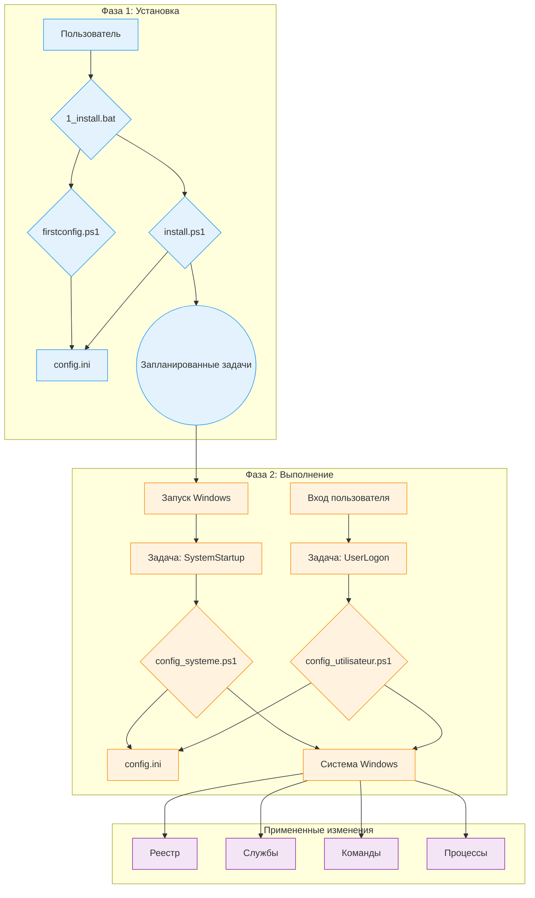

# Техническая документация WindowsOrchestrator

Этот документ является техническим справочником по проекту WindowsOrchestrator. В нем подробно описаны архитектура, компоненты и последовательность выполнения каждого скрипта.

[toc]

## 1. Обзор проекта

### 1.1. Назначение проекта

Проект WindowsOrchestrator автоматизирует настройку операционной системы Windows. Он запускает скрипты, которые изменяют системные параметры и управляют приложениями. Действия, выполняемые скриптами, преобразуют стандартную установку Windows в среду, поведение которой определяется центральным конфигурационным файлом.

Скрипты читают файл config.ini для выполнения команд, которые изменяют ключи реестра, управляют службами Windows, настраивают параметры электропитания, создают запланированные задачи и управляют жизненным циклом пользовательского процесса.

Проект предоставляет набор скриптов, которые применяют конфигурации для управления питанием, системных обновлений, пользовательского сеанса и жизненного цикла приложения.

### 1.2. Принципы работы

Работа WindowsOrchestrator основана на четырех основных механизмах.

1.  **Выполнение с помощью встроенных средств Windows**
    Проект использует функции и команды, встроенные в Windows: PowerShell 5.1, Планировщик заданий, Редактор реестра и утилиты командной строки (`powercfg`, `shutdown`). Проект не требует установки каких-либо внешних зависимостей.

2.  **Конфигурация через централизованный файл**
    Логика выполнения скриптов отделена от конфигурации. Скрипты читают файл `config.ini`, чтобы определить, какие действия необходимо выполнить. Чтобы изменить поведение скриптов, пользователь изменяет значения в `config.ini`.

3.  **Разделение контекстов выполнения (Система vs. Пользователь)**
    Проект использует два различных контекста выполнения:
    *   Скрипт **`config_systeme.ps1`** выполняется с разрешениями учетной записи `NT AUTHORITY\SYSTEM` и изменяет глобальные параметры машины (реестр HKLM, службы, запланированные задачи).
    *   Скрипт **`config_utilisateur.ps1`** выполняется с разрешениями вошедшего в систему пользователя и управляет процессами его сеанса.

4.  **Идемпотентность действий**
    Скрипты написаны таким образом, что их повторное выполнение приводит к тому же конечному состоянию, что и однократное. Перед изменением параметра скрипт проверяет текущее состояние системы. Если желаемое состояние уже применено, скрипт не повторяет действие по изменению.

## 2. Архитектура и ключевые компоненты

Архитектура WindowsOrchestrator использует встроенные компоненты Windows. Каждый компонент имеет определенную роль.

### 2.1. Схема архитектуры

Поток выполнения и взаимодействия между компонентами представлены на следующей схеме:

Эта схема показывает разделение между **фазой установки**, инициируемой пользователем, и **фазой выполнения**, автоматизированным циклом, управляемым Планировщиком заданий.

### 2.2. Роль Планировщика заданий

Планировщик заданий Windows является центральным компонентом автоматизации. Он выполняет скрипты конфигурации в определенное время и с требуемыми уровнями привилегий.

Две основные задачи, создаваемые `install.ps1`:

*   **`WindowsOrchestrator-SystemStartup`**
    *   **Триггер:** "При запуске системы".
    *   **Контекст выполнения:** `NT AUTHORITY\SYSTEM`. Эта учетная запись имеет необходимые привилегии для изменения ключей реестра в `HKEY_LOCAL_MACHINE` (HKLM), управления службами и выполнения системных команд.
    *   **Роль:** Выполнение всех конфигураций на уровне машины.

*   **`WindowsOrchestrator-UserLogon`**
    *   **Триггер:** "При входе в систему" указанного пользователя.
    *   **Контекст выполнения:** Учетная запись вошедшего в систему пользователя. Скрипт выполняется с привилегиями этого пользователя, что позволяет ему запускать графические приложения в сеансе пользователя.
    *   **Роль:** Выполнение всех конфигураций, специфичных для сеанса пользователя.

### 2.3. Файл `config.ini`: источник конфигурации

Файл `config.ini` содержит описание желаемого конечного состояния системы. Скрипты PowerShell (`config_systeme.ps1`, `config_utilisateur.ps1`) читают этот файл и выполняют необходимые команды, чтобы система соответствовала заданным параметрам.

Этот механизм имеет несколько фактических характеристик:
*   Поведение скриптов определяется парами ключ-значение, содержащимися в файле config.ini.
*   Логика выполнения содержится в файлах скриптов PowerShell (.ps1), в то время как параметры, управляющие этой логикой, считываются из файла .ini.
*   Скрипты читают файл config.ini, находящийся в их корневом каталоге, что позволяет отдельным экземплярам проекта иметь разное поведение в зависимости от содержимого их собственного файла config.ini.

### 2.4. Система интернационализации (i18n)

Проект загружает переведенные строки без изменения исходного кода.

*   **Структура файлов:** Строки хранятся в файлах `.psd1`, расположенных в подпапках каталога `i18n/`. Каждая подпапка названа в соответствии с кодом языка и региональных стандартов (например, `fr-FR`, `en-US`).

*   **Механизм обнаружения и загрузки:**
    1.  В начале своего выполнения скрипт выполняет команду `(Get-Culture).Name`, чтобы получить код языка и региональных стандартов системы (например, `"fr-FR"`).
    2.  Скрипт строит путь к соответствующему языковому файлу (например, `i18n\fr-FR\strings.psd1`).
    3.  **Логика отката (Fallback):** Если этот файл не существует, скрипт использует путь `i18n\en-US\strings.psd1`.
    4.  Содержимое файла `.psd1` считывается и интерпретируется `Invoke-Expression`, который загружает хэш-таблицу строк в переменную `$lang`.

*   **Использование в коде:**
    Для отображения сообщения код обращается к хэш-таблице `$lang` по ключу (например, `$lang.Uninstall_StartMessage`). Функции журналирования используют параметр `-DefaultMessage`, содержащий текст на английском языке, если ключ не найден.

Чтобы добавить новый язык, пользователь должен скопировать папку `en-US`, переименовать ее с новым кодом языка и региональных стандартов и перевести значения в файле `strings.psd1`.

## 3. Жизненный цикл и последовательности выполнения

Этот раздел разбивает процессы проекта на хронологические последовательности выполнения.

### 3.1. Полная последовательность установки

1.  **Фаза 1 - Запуск и настройка (контекст пользователя)**
    *   Пользователь запускает `1_install.bat`.
    *   Пакетный скрипт выполняет `management\firstconfig.ps1`.
    *   **`firstconfig.ps1` запускается:**
        *   Он проверяет наличие файла `config.ini`. Если он отсутствует, он создает его из шаблона `management/defaults/default_config.ini`. Если он присутствует, он спрашивает пользователя, хочет ли он его заменить.
        *   Он отображает графический интерфейс Windows Forms, предварительно заполненный значениями, считанными из `config.ini`.
        *   При нажатии на "Сохранить и закрыть" скрипт записывает значения из полей интерфейса в `config.ini`.
        *   Скрипт `firstconfig.ps1` завершается.

2.  **Фаза 2 - Повышение прав и установка (контекст администратора)**
    *   Скрипт `1_install.bat` возобновляет работу.
    *   Он выполняет команду PowerShell, которая использует `Start-Process PowerShell -Verb RunAs` для запуска `install.ps1`.
    *   Windows вызывает запрос **контроля учетных записей пользователей (UAC)**. Пользователь должен предоставить привилегии.
    *   **`install.ps1` запускается с правами администратора:**
        *   Он проверяет наличие файлов `config_systeme.ps1` и `config_utilisateur.ps1`.
        *   Он выполняет команду `Register-ScheduledTask` для создания двух задач:
            *   **`WindowsOrchestrator-SystemStartup`**, которая запускает `config_systeme.ps1` при запуске (`-AtStartup`) с учетной записью `NT AUTHORITY\SYSTEM`.
            *   **`WindowsOrchestrator-UserLogon`**, которая запускает `config_utilisateur.ps1` при входе в систему (`-AtLogOn`) пользователя.
        *   Для применения конфигурации скрипт запускает `config_systeme.ps1`, а затем `config_utilisateur.ps1` через `Start-Process -Wait`.
    *   Скрипт `install.ps1` завершается.

### 3.2. Последовательность выполнения при запуске (во время выполнения - системный уровень)

1.  **Триггер:** Операционная система Windows запускается.
2.  **Выполнение задачи:** Планировщик заданий запускает задачу `WindowsOrchestrator-SystemStartup`.
3.  **Запуск скрипта:** Задача выполняет `powershell.exe` с правами учетной записи `NT AUTHORITY\SYSTEM` для запуска `config_systeme.ps1`.
4.  **Действия `config_systeme.ps1`:**
    *   Скрипт анализирует `config.ini` и загружает его содержимое.
    *   Он проверяет сетевое подключение (`Test-NetConnection 8.8.8.8 -Port 53`).
    *   Он выполняет блоки конфигурации, определенные в `[SystemConfig]`. Для каждого действия:
        *   Он считывает значение ключа.
        *   Он проверяет текущее состояние системы (значение реестра, состояние службы).
        *   Если текущее состояние отличается от желаемого, он выполняет команду изменения (`Set-ItemProperty`, `powercfg` и т. д.).
        *   Он записывает действие или ошибку в списки.
    *   Он отправляет уведомление Gotify (если включено).
5.  **Конец последовательности:** Скрипт завершается.

### 3.3. Последовательность выполнения при входе в систему (во время выполнения - пользовательский уровень)

1.  **Триггер:** Пользователь входит в систему.
2.  **Выполнение задачи:** Планировщик заданий запускает задачу `WindowsOrchestrator-UserLogon`.
3.  **Запуск скрипта:** Задача выполняет `powershell.exe` с правами пользователя для запуска `config_utilisateur.ps1` (`-WindowStyle Hidden`).
4.  **Действия `config_utilisateur.ps1`:**
    *   Скрипт анализирует `config.ini`.
    *   Он считывает параметры из раздела `[Process]`.
    *   Он выполняет логику управления процессами:
        1.  Он разрешает переменные среды в пути процесса.
        2.  Он ищет существующие процессы, которые соответствуют имени и принадлежат текущему пользователю (проверяется по SID).
        3.  Если таковые найдены, он их завершает (`Stop-Process -Force`).
        4.  Он запускает новый экземпляр процесса.
    *   Он отправляет уведомление Gotify (если включено).
5.  **Конец последовательности:** Скрипт завершается.

### 3.4. Последовательность удаления

1.  **Триггер:** Пользователь запускает `2_uninstall.bat`.
2.  **Повышение прав:** Скрипт `2_uninstall.bat` запускает `management\uninstall.ps1`, который перезапускает себя с помощью `Start-Process -Verb RunAs`. Пользователь должен принять запрос UAC.
3.  **Действия `uninstall.ps1`:**
    *   Скрипт задает пользователю вопрос об отключении AutoLogon.
    *   Он восстанавливает системные ключи реестра:
        *   Windows Update (`NoAutoUpdate` -> `0`).
        *   Быстрый запуск (`HiberbootEnabled` -> `1`).
        *   OneDrive (удаление `DisableFileSyncNGSC`).
        *   AutoLogon (`AutoAdminLogon` -> `0`) по запросу.
    *   Он выполняет `Unregister-ScheduledTask` для удаления четырех запланированных задач.
    *   Он отображает сводку и сообщает, что файлы не удаляются.
4.  **Конец последовательности:** Скрипт завершается.

## 4. Процедуры установки и удаления

Этот раздел описывает последовательности операций, выполняемых пакетными скриптами для установки, активации, удаления и восстановления системы.

### 4.1. Процедура установки

Процедура инициируется запуском файла `1_install.bat`. Она разделена на две отдельные фазы.

#### 4.1.1. Фаза 1: Конфигурация (контекст пользователя)

1.  Файл `1_install.bat` выполняет скрипт `management\firstconfig.ps1` с помощью команды `powershell.exe`.
2.  Скрипт `firstconfig.ps1` проверяет наличие файла `config.ini` в корне проекта.
    *   Если файл `config.ini` не существует, он создается путем копирования файла `management/defaults/default_config.ini`.
    *   Если файл `config.ini` существует, отображается диалоговое окно `System.Windows.Forms.MessageBox`, в котором пользователю предлагается заменить существующий файл шаблоном.
3.  Затем скрипт отображает графический пользовательский интерфейс (Windows Forms), поля которого предварительно заполнены значениями, считанными из файла `config.ini`.
4.  Когда пользователь нажимает кнопку "Сохранить и закрыть", значения из полей интерфейса записываются в файл `config.ini` с помощью функции `Set-IniValue`. Скрипт завершается.

#### 4.1.2. Фаза 2: Установка задач (контекст администратора)

1.  Управление возвращается к скрипту `1_install.bat`. Он выполняет команду `powershell.exe`, единственная роль которой - запустить второй экземпляр PowerShell с помощью команды `Start-Process PowerShell -Verb RunAs`.
2.  Это действие вызывает запрос контроля учетных записей пользователей (UAC). Пользователь должен предоставить привилегии для продолжения.
3.  Скрипт `management\install.ps1` выполняется с правами администратора и выполняет следующие действия:
    *   Он создает запланированную задачу **`WindowsOrchestrator-SystemStartup`** с помощью `Register-ScheduledTask`. Триггер установлен на `-AtStartup`, а субъект выполнения - `NT AUTHORITY\SYSTEM` (`-UserId "NT AUTHORITY\SYSTEM"`). Действие - выполнение скрипта `config_systeme.ps1`.
    *   Он создает запланированную задачу **`WindowsOrchestrator-UserLogon`** с помощью `Register-ScheduledTask`. Триггер установлен на `-AtLogOn` для текущего пользователя, а субъект выполнения - тот же пользователь (`-UserId "$($env:USERDOMAIN)\$($env:USERNAME)"`). Действие - выполнение скрипта `config_utilisateur.ps1`.

4.  Чтобы немедленно применить конфигурацию, `install.ps1` затем выполняет последовательно, ожидая завершения каждого процесса (`-Wait`), скрипты `config_systeme.ps1`, а затем `config_utilisateur.ps1`.

#### 4.1.3. Состояние системы после установки

*   Две запланированные задачи, `WindowsOrchestrator-SystemStartup` и `WindowsOrchestrator-UserLogon`, созданы и активны в Планировщике заданий Windows.
*   В корне проекта существует файл `config.ini`, содержащий определенную пользователем конфигурацию.
*   В корне проекта присутствует каталог `Logs`, содержащий файлы журналов первоначального выполнения.
*   Системные параметры, определенные в `config.ini`, были применены в первый раз.

### 4.2. Процедура удаления

Процедура инициируется запуском файла `2_uninstall.bat`.

#### 4.2.1. Повышение привилегий

1.  Файл `2_uninstall.bat` выполняет скрипт `management\uninstall.ps1`.
2.  Скрипт `uninstall.ps1` проверяет свой собственный уровень привилегий. Если он не является администратором, он перезапускает себя с помощью `Start-Process powershell.exe -Verb RunAs`, что вызывает запрос UAC, который пользователь должен подтвердить.

#### 4.2.2. Действия, выполняемые скриптом

Скрипт `management\uninstall.ps1`, выполняющийся с правами администратора, выполняет следующие операции:

1.  **Взаимодействие с пользователем:** Скрипт отображает запрос в консоли с помощью `Read-Host`, спрашивая пользователя, хочет ли он отключить автоматический вход в систему. Ответ пользователя сохраняется в переменной.
2.  **Восстановление системных параметров:**
    *   Если пользователь ответил `y` или `yes`, скрипт записывает строковое значение `"0"` в ключ реестра `HKLM:\SOFTWARE\Microsoft\Windows NT\CurrentVersion\Winlogon\AutoAdminLogon`.
    *   Он записывает значение DWORD `0` в ключ `HKLM:\...\WindowsUpdate\AU\NoAutoUpdate`.
    *   Он записывает значение DWORD `0` в ключ `HKLM:\...\WindowsUpdate\AU\NoAutoRebootWithLoggedOnUsers`.
    *   Он записывает значение DWORD `1` в ключ `HKLM:\...\Power\HiberbootEnabled`.
    *   Он удаляет значение `DisableFileSyncNGSC` из ключа `HKLM:\...\OneDrive` с помощью `Remove-ItemProperty`.
    *   Он изменяет тип запуска службы `wuauserv` на `Automatic` с помощью `Set-Service`.
3.  **Удаление запланированных задач:**
    *   Скрипт перебирает предопределенный список имен задач и выполняет `Unregister-ScheduledTask -Confirm:$false` для каждой. Удаленные задачи:
        *   `WindowsOrchestrator-SystemStartup`
        *   `WindowsOrchestrator-UserLogon`
        *   `WindowsOrchestrator-SystemScheduledReboot`
        *   `WindowsOrchestrator-SystemPreRebootAction`

#### 4.2.3. Состояние системы после удаления

*   Четыре запланированные задачи, связанные с проектом, удаляются из Планировщика заданий. Вся автоматизация останавливается.
*   Перечисленные выше параметры реестра и служб восстанавливаются до значений по умолчанию.
*   Параметры электропитания, измененные командой `powercfg`, не изменяются скриптом удаления.
*   Каталог проекта, включая все скрипты, файл `config.ini` и журналы, не удаляется и остается на диске.

## 5. Подробное руководство по настройке (`config.ini`)

Файл `config.ini` является декларативным центром управления проектом. В этом руководстве описывается каждый ключ, его влияние на выполнение скриптов, возможные значения и взаимодействие с другими параметрами. Значения по умолчанию указаны в файле `management/defaults/default_config.ini`.

### 5.1. Раздел `[SystemConfig]`

Этот раздел управляет параметрами, которые влияют на всю систему, и считывается исключительно `config_systeme.ps1`.

---

**`AutoLoginUsername`**

*   **Роль:** Указывает имя пользователя, которое будет записано в ключ реестра `DefaultUserName`. Это значение также используется логикой действия перед перезагрузкой для разрешения пути `%USERPROFILE%`.
*   **Возможные значения:** Строка, представляющая имя локального или доменного пользователя (например, `Admin`, `DOMAIN\User`). Если значение оставлено пустым, скрипт пытается прочитать значение, уже имеющееся в ключе реестра `DefaultUserName`.
*   **Значение по умолчанию:** "" (пустая строка)
*   **Взаимозависимости:** Этот параметр требуется, если `EnableAutoLogin` имеет значение `true`. Он также необходим для того, чтобы переменная `%USERPROFILE%` могла использоваться в ключе `PreRebootActionCommand`.

---

**`EnableAutoLogin`**

*   **Роль:** Управляет состоянием автоматического входа в Windows.
*   **Действие скрипта:** Если значение `true`, скрипт записывает `"1"` в ключ реестра `HKLM:\SOFTWARE\Microsoft\Windows NT\CurrentVersion\Winlogon\AutoAdminLogon`. Если значение `false`, он записывает `"0"`.
*   **Возможные значения:** `true`, `false`
*   **Значение по умолчанию:** `false`
*   **Взаимозависимости:** Требуется, чтобы `AutoLoginUsername` был правильно настроен для полной функциональности. **Примечание для разработчика:** Скрипт не обрабатывает пароль (`DefaultPassword`), который должен быть настроен внештатно (например, с помощью инструмента Sysinternals AutoLogon).

---

**`DisableFastStartup`**

*   **Роль:** Управляет функцией быстрого запуска Windows (Hiberboot).
*   **Действие скрипта:** Если `true`, записывает значение `0` (DWORD) в ключ реестра `HKLM:\...\Power\HiberbootEnabled`. Если `false`, записывает `1`.
*   **Возможные значения:** `true`, `false`
*   **Значение по умолчанию:** `true`
*   **Взаимозависимости:** Нет.

---

**`DisableSleep`** и **`DisableScreenSleep`**

*   **Роль:** Управляют состоянием сна машины и экрана.
*   **Действие скрипта:**
    *   Для `DisableSleep=true` выполняются команды `powercfg /change standby-timeout-ac 0` и `powercfg /change hibernate-timeout-ac 0`.
    *   Для `DisableScreenSleep=true` выполняется команда `powercfg /change monitor-timeout-ac 0`.
*   **Возможные значения:** `true`, `false`
*   **Значения по умолчанию:** `DisableSleep=true`, `DisableScreenSleep=false`
*   **Взаимозависимости:** Нет.

---

**`DisableWindowsUpdate`**

*   **Роль:** Полностью отключает службу обновления Windows.
*   **Действие скрипта:** Если `true`, скрипт выполняет три действия:
    1.  Записывает значение `1` (DWORD) в ключ `HKLM:\...\WindowsUpdate\AU\NoAutoUpdate`.
    2.  Изменяет тип запуска службы `wuauserv` на `Disabled`.
    3.  Останавливает службу `wuauserv` (`Stop-Service`).
*   **Возможные значения:** `true`, `false`
*   **Значение по умолчанию:** `true`
*   **Взаимозависимости:** Нет.

---

**`DisableAutoReboot`**

*   **Роль:** Предотвращает автоматическую перезагрузку Windows после обновления, если активен сеанс пользователя.
*   **Действие скрипта:** Если `true`, записывает значение `1` (DWORD) в ключ реестра `HKLM:\...\WindowsUpdate\AU\NoAutoRebootWithLoggedOnUsers`.
*   **Возможные значения:** `true`, `false`
*   **Значение по умолчанию:** `true`
*   **Взаимозависимости:** Этот параметр в основном актуален, когда `DisableWindowsUpdate` имеет значение `false`.

---

**`ScheduledRebootTime`**

*   **Роль:** Планирует ежедневную перезагрузку машины.
*   **Действие скрипта:** Если значение предоставлено, скрипт создает/обновляет запланированную задачу (`WindowsOrchestrator-SystemScheduledReboot`), которая выполняет `shutdown.exe /r /f /t 60` в указанное время. Если значение пустое, запланированная задача удаляется.
*   **Возможные значения:** Строка в формате `HH:MM` (например, `03:00`) или пустая строка для отключения.
*   **Значение по умолчанию:** `03:00`
*   **Взаимозависимости:** Скрипт создает две отдельные запланированные задачи для действия перед перезагрузкой и перезагрузки. Планировщик заданий Windows выполняет каждую задачу в указанное время, не проверяя их хронологический порядок.

---

**`PreRebootAction...`** (группа из 4 ключей)

*   **Роль:** Выполняет пользовательскую команду перед запланированной перезагрузкой. Этот блок активен, только если `PreRebootActionTime` и `PreRebootActionCommand` не пусты.
*   **Действие скрипта:** Создает/обновляет запланированную задачу (`WindowsOrchestrator-SystemPreRebootAction`), которая выполняет указанную команду. Скрипт разрешает переменные среды (`%USERPROFILE%`) и относительные пути в `PreRebootActionCommand`.
*   **Ключи:**
    *   `PreRebootActionTime`: Время срабатывания (`HH:MM`).
    *   `PreRebootActionCommand`: Путь к исполняемому файлу или скрипту.
    *   `PreRebootActionArguments`: Аргументы для передачи команде.
    *   `PreRebootActionLaunchMethod`: Метод выполнения (`direct`, `powershell`, `cmd`).
*   **Значения по умолчанию:** `02:55`, `"PreReboot.bat"`, `""`, `cmd`
*   **Взаимозависимости:** Выполнение задачи 'WindowsOrchestrator-SystemPreRebootAction' не зависит от существования задачи 'WindowsOrchestrator-SystemScheduledReboot'.

---

**`DisableOneDrive`**

*   **Роль:** Отключает интеграцию OneDrive через системную политику.
*   **Действие скрипта:** Если `true`, записывает значение `1` (DWORD) в ключ реестра `HKLM:\...\OneDrive\DisableFileSyncNGSC`. Если `false`, ключ удаляется.
*   **Возможные значения:** `true`, `false`
*   **Значение по умолчанию:** `true`
*   **Взаимозависимости:** Нет.

### 5.2. Раздел `[Process]`

Этот раздел, считываемый `config_utilisateur.ps1`, описывает, как управлять основным бизнес-приложением. Работа основана на следующем взаимозависимом трио ключей:

*   **`ProcessName` ("Что")**
    *   **Роль:** Определяет полный путь к исполняемому файлу или скрипту для запуска. Это основная цель действия.
    *   **Действие скрипта:** Скрипт использует это значение для идентификации процесса, который нужно остановить, и в качестве цели команды запуска. Он поддерживает системные и пользовательские переменные среды (например, `%USERPROFILE%`, `%PROGRAMFILES%`), которые разрешаются динамически во время выполнения.

*   **`ProcessArguments` ("С чем")**
    *   **Роль:** Указывает аргументы командной строки для передачи исполняемому файлу/скрипту, определенному в `ProcessName`.
    *   **Действие скрипта:** Эта строка добавляется к команде выполнения. Если она пуста, аргументы не передаются.

*   **`LaunchMethod` ("Как")**
    *   **Роль:** Указывает интерпретатор команд для запуска `ProcessName`. Этот выбор имеет решающее значение для совместимости.
    *   **Действие скрипта:** Скрипт строит конечную команду по-разному в зависимости от значения:
        *   `direct`: Запускает исполняемый файл напрямую. Команда: `ProcessName "ProcessArguments"`. Это стандартный метод для файлов `.exe`.
        *   `cmd`: Запускает через интерпретатор команд `cmd.exe`. Сгенерированная команда: `cmd.exe /c ""ProcessName" ProcessArguments"`. Это рекомендуемый метод для пакетных скриптов (`.bat`, `.cmd`).
        *   `powershell`: Запускает через PowerShell. Сгенерированная команда: `powershell.exe -NoProfile -ExecutionPolicy Bypass -Command "& 'ProcessName' ProcessArguments'"`. Это идеальный метод для запуска других скриптов PowerShell (`.ps1`).

### 5.3. Раздел `[Logging]`

Этот раздел настраивает поведение файлов журнала.

*   **`EnableLogRotation`**
    *   **Роль:** Включает или отключает механизм архивирования журналов.
    *   **Действие скрипта:** Если `true`, перед записью в файл журнала (`log.txt`) вызывается функция `Rotate-LogFile`. Она переименовывает `log.txt` в `log.1.txt`, `log.1.txt` в `log.2.txt` и т. д., до предела, и удаляет самый старый. Если `false`, эта функция не вызывается, и файл журнала растет бесконечно.
*   **`MaxSystemLogsToKeep` и `MaxUserLogsToKeep`**
    *   **Роль (предполагаемая):** Эти ключи предусмотрены в `default_config.ini` для определения количества сохраняемых архивных файлов журнала.
    *   **Действие скрипта (текущее):** Ключи MaxSystemLogsToKeep и MaxUserLogsToKeep не считываются скриптом config_systeme.ps1. Функция Rotate-LogFile вызывается с фиксированным значением 7, определенным переменной $DefaultMaxLogs.

### 5.4. Раздел `[Gotify]`

Этот раздел управляет отправкой уведомлений о состоянии на сервер Gotify.

*   **`EnableGotify`**: Если `true`, скрипты попытаются отправить уведомление в конце своего выполнения.
*   **`Url`**: Базовый URL-адрес экземпляра Gotify (например, `http://gotify.example.com`).
*   **`Token`**: Токен приложения, сгенерированный в Gotify для авторизации отправки сообщений.
*   **`Priority`**: Целое число, определяющее приоритет сообщения в Gotify.
*   **`GotifyTitle...`** (группа из 4 ключей):
    *   **Роль:** Шаблоны для заголовков уведомлений.
    *   **Действие скрипта:** Перед отправкой уведомления скрипт берет строку из соответствующего ключа (например, `GotifyTitleErrorSystem`) и заменяет литеральные строки `%COMPUTERNAME%` и `%USERNAME%` значениями соответствующих переменных среды.

## 6. Подробное описание скриптов (справочник по коду)

Этот раздел служит справочником по исходному коду. Он разбирает логику и внутренние механизмы каждого основного скрипта проекта.

### 6.1. Скрипты оркестровки (`management/`)

Эти скрипты управляют жизненным циклом проекта (установка, начальная настройка, удаление). Они предназначены для ручного запуска пользователем.

#### **`firstconfig.ps1`**

*   **Роль:** Предоставление графического пользовательского интерфейса (GUI) для помощи в настройке файла `config.ini`.
*   **Логика GUI:**
    *   Скрипт использует сборки .NET `System.Windows.Forms` и `System.Drawing`, загруженные через `Add-Type`, для динамического построения объектов интерфейса (Form, Label, TextBox, CheckBox, Button).
    *   Позиционирование элементов управления управляется переменными (`$xPadding`, `$yCurrent`), которые увеличиваются после добавления каждого элемента.
    *   Язык интерфейса загружается динамически из файлов `strings.psd1`.
*   **Управление `config.ini`:**
    *   **Чтение:** При запуске скрипт считывает текущие значения из `config.ini` с помощью локальной функции `Get-IniValue`. Эта функция выполняет построчное чтение файла для извлечения значений. Значения `true`/`false` преобразуются в типы `[bool]` PowerShell для `CheckBoxes`.
    *   **Запись:** При нажатии кнопки "Сохранить" событие `Add_Click` вызывает локальную функцию `Set-IniValue` для каждого параметра. Эта функция перестраивает содержимое файла в памяти перед записью на диск с кодировкой UTF-8.

#### **`install.ps1`**

*   **Роль:** Создание персистентности системы путем установки запланированных задач и выполнения первоначального запуска скриптов времени выполнения.
*   **Механизм самоповышения прав:** Скрипт проверяет свой уровень привилегий через `New-Object Security.Principal.WindowsPrincipal`. Если это не "Administrator", он перезапускает себя с помощью `Start-Process powershell.exe -Verb RunAs`.
*   **Логика создания задач:**
    *   Скрипт использует встроенные командлеты `New-ScheduledTaskAction`, `New-ScheduledTaskTrigger`, `New-ScheduledTaskPrincipal`, `New-ScheduledTaskSettingsSet` и `Register-ScheduledTask`.
    *   **Управление субъектами:**
        *   Для `...-SystemStartup` он использует `-UserId "NT AUTHORITY\SYSTEM" -RunLevel Highest`.
        *   Для `...-UserLogon` он использует `-UserId "$($env:USERDOMAIN)\$($env:USERNAME)" -LogonType Interactive`.
*   **Выполнение после установки:**
    *   После регистрации задач скрипт выполняет `config_systeme.ps1`, а затем `config_utilisateur.ps1` через `Start-Process -Wait`.

#### **`uninstall.ps1`**

*   **Роль:** Удаление компонентов автоматизации и восстановление критически важных системных параметров.
*   **Логика восстановления:**
    *   Скрипт содержит жестко закодированные "стандартные" значения Windows в своем коде для восстановления состояния системы.
    *   Он использует те же командлеты, что и `config_systeme.ps1` (`Set-ItemProperty`, `Set-Service`), но с обратными значениями.
    *   Операции инкапсулированы в блоки `try...catch`.
*   **Логика очистки:**
    *   Он использует предопределенный список (`$TasksToRemove`), содержащий имена четырех запланированных задач.
    *   Он перебирает этот список и выполняет `Get-ScheduledTask` для проверки существования задачи, а затем `Unregister-ScheduledTask -Confirm:$false` для ее удаления.

### 6.2. Скрипты времени выполнения (корень)

Эти скрипты содержат основную бизнес-логику и выполняются автоматически запланированными задачами.

#### **`config_systeme.ps1`**

*   **Архитектура скрипта:** Скрипт структурирован на несколько областей: базовые функции, служебные функции, инициализация и основной блок выполнения (`try...catch...finally`).
*   **Ключевые функции:**
    *   `Get-IniContent`: Анализирует `config.ini` и преобразует его во вложенную хэш-таблицу PowerShell (`$ini['Section']['Key']`).
    *   `Get-ConfigValue`: Это оболочка для доступа к конфигурации. Она обрабатывает отсутствующие ключи/разделы, предоставляет значения по умолчанию и выполняет преобразование типов.
    *   `Add-Action` / `Add-Error`: Эти функции централизуют ведение журнала. Они добавляют сообщения в глобальные списки (`$Global:ActionsEffectuees`, `$Global:ErreursRencontrees`), используемые для построения отчета Gotify.
*   **Логика выполнения:** Основная часть скрипта - это последовательность блоков конфигурации. Каждый блок идемпотентен: он сначала считывает текущее состояние системы (значение реестра, состояние службы) перед записью.

#### **`config_utilisateur.ps1`**

*   **Роль:** Обеспечение того, чтобы бизнес-приложение, определенное в `[Process]`, находилось в желаемом состоянии (один, только что запущенный экземпляр).
*   **Логика управления процессами:**
    1.  **Разрешение пути:** `ProcessName` обрабатывается `[System.Environment]::ExpandEnvironmentVariables()` для разрешения таких переменных, как `%USERPROFILE%`.
    2.  **Идентификация владельца:** Поиск существующего процесса использует `Get-Process` для поиска процессов по имени, а затем `Get-CimInstance Win32_Process` для получения владельца каждого процесса. Он сравнивает SID владельца процесса с SID текущего пользователя (`[System.Security.Principal.WindowsIdentity]::GetCurrent().User.Value`).
    3.  **Остановка и перезапуск:** Если найден соответствующий процесс, он завершается с помощью `Stop-Process -Force`. Затем запускается новый экземпляр с помощью `Start-Process`. Для вызова `Start-Process` используется "сплаттинг" (`@startProcessSplat`).

### 6.3. Служебные скрипты и средства запуска

Эти скрипты являются либо инструментами поддержки, либо примерами интеграции.

#### **`Close-AppByTitle.ps1`**

*   **Взаимодействие с `user32.dll`:**
    *   Он внедряет класс C# в память через `Add-Type -TypeDefinition`. Этот код C# использует атрибуты `[DllImport("user32.dll")]` для предоставления функций Windows API для PowerShell.
    *   Функция `EnumWindows` используется с блоком скрипта PowerShell в качестве "обратного вызова". Для каждого окна, найденного API, выполняется этот блок PowerShell. Именно в этом блоке проверяется заголовок окна.
    *   Как только целевое окно идентифицировано по его `handle`, вызывается `SetForegroundWindow`, чтобы передать ему фокус, а затем `[System.Windows.Forms.SendKeys]::SendWait()` имитирует нажатия клавиш.

#### **`PreReboot.bat` и `LaunchApp.bat`**

*   **Переносимость:** Работа этих средств запуска основана на специальной переменной пакетного скрипта `%~dp0`, которая разрешается в полный путь к каталогу, где находится скрипт.

#### **`management/tools/Find-WindowInfo.ps1`**

*   **Полезность:** Этот скрипт является инструментом отладки и настройки.
*   **Принцип работы:** Он использует ту же технику внедрения кода C# и вызова API `EnumWindows`, что и `Close-AppByTitle.ps1`. Он отображает отформатированный список видимых окон с именем процесса и его PID.

## 7. Процедуры обслуживания и отладки

Этот раздел содержит практические руководства по диагностике проблем и тестированию изменений.

### 7.1. Понимание и использование журналов (`Logs/`)

*   **Расположение:** Журналы создаются в подпапке `Logs/`.
    *   `config_systeme_ps_log.txt`: Содержит журналы системного скрипта.
    *   `config_utilisateur_log.txt`: Содержит журналы пользовательского скрипта.
*   **Структура сообщений журнала:** `ГГГГ-ММ-ДД ЧЧ:мм:сс [УРОВЕНЬ] [Контекст] - Сообщение`
*   **Как идентифицировать действия и ошибки:**
    *   **Успешные действия:** `ACTION: ...`
    *   **Перехваченные ошибки:** `CAPTURED ERROR: ...`
    *   **Фатальные ошибки:** `FATAL SCRIPT ERROR ...`

### 7.2. Отладка скриптов вручную

#### **Запуск `config_systeme.ps1` с правами `SYSTEM`**

1.  **Предварительное условие:** Загрузите `PsExec.exe` из набора Sysinternals от Microsoft.
2.  **Процедура выполнения:**
    *   Откройте командную строку от имени администратора.
    *   Выполните команду: `PsExec.exe -s -i powershell.exe`
    *   Откроется новое окно PowerShell. Команда `whoami` вернет `nt authority\system`.
    *   В этом окне перейдите в каталог проекта и выполните `.\config_systeme.ps1`.

#### **Тестирование `config_utilisateur.ps1` в сеансе пользователя**

1.  **Процедура выполнения:**
    *   Войдите в сеанс Windows с целевой учетной записью пользователя.
    *   Откройте стандартную консоль PowerShell.
    *   Перейдите в каталог проекта и выполните `.\config_utilisateur.ps1`.

#### **Проверка состояния запланированных задач**

1.  **Откройте инструмент:** Выполните `taskschd.msc`.
2.  **Найдите задачи:** Выберите "Библиотека планировщика заданий".
3.  **Проанализируйте информацию:**
    *   Проверьте столбцы "Состояние", "Триггеры" и "Результат последнего выполнения" (код `0x0` означает успех).
    *   Просмотрите вкладку "Журнал" для получения подробной информации о каждом выполнении.

### **7.3. Соображения безопасности**

В этом разделе подробно описаны механизмы и последствия для безопасности, связанные с работой проекта.

*   **Контекст выполнения системных задач**  
    Скрипт `install.ps1` настраивает запланированную задачу `WindowsOrchestrator-SystemStartup` для выполнения с разрешениями учетной записи `NT AUTHORITY\SYSTEM`. Эта учетная запись имеет расширенные привилегии в локальной системе, что необходимо для того, чтобы скрипт `config_systeme.ps1` мог изменять ключи реестра в кусте `HKEY_LOCAL_MACHINE` (HKLM) и управлять системными службами.

*   **Механизм повышения привилегий (UAC)**  
    Скрипты установки (`1_install.bat`) и удаления (`2_uninstall.bat`) не требуют запуска из сеанса администратора. Они выполняют команду `Start-Process -Verb RunAs`, которая вызывает запрос контроля учетных записей пользователей (UAC) Windows. Продолжение выполнения зависит от подтверждения этого запроса пользователем.

*   **Управление паролями сеанса**  
    Скрипты проекта **не обрабатывают, не запрашивают и не хранят** пароли пользователей в какой-либо форме. Активация функции AutoLogon (`EnableAutoLogin=true`) просто записывает значение `"1"` в ключ реестра `AutoAdminLogon`. Ключ `DefaultPassword` никогда не записывается скриптами. Ответственность за безопасное хранение пароля в реестре лежит на пользователе через внешний инструмент, такой как `Sysinternals AutoLogon`.

*   **Обход политики выполнения**  
    Скрипты запуска (`.bat`) и команды создания запланированных задач систематически используют аргумент `-ExecutionPolicy Bypass` при вызове `powershell.exe`. Этот аргумент позволяет скриптам выполняться независимо от политики выполнения, настроенной в системе. Этот параметр применяется только к экземпляру запускаемого процесса и не изменяет политику безопасности системы постоянно.

### **7.4. Известные ограничения**

В этом разделе документируются поведения, которые являются результатом проектных решений или представляют собой функции, не реализованные на данном этапе.

*   **Невосстановление параметров электропитания**  
    Скрипт `uninstall.ps1` не выполняет никаких команд `powercfg`. Следовательно, изменения, внесенные `config_systeme.ps1` в отношении спящего режима машины (`standby-timeout-ac`) или экрана (`monitor-timeout-ac`), не отменяются при удалении.

*   **Неактивная конфигурация ротации журналов**  
    Файл шаблона конфигурации (`default_config.ini`) содержит ключи `MaxSystemLogsToKeep` и `MaxUserLogsToKeep`. Однако функция `Rotate-LogFile` в `config_systeme.ps1` не считывает эти ключи. Она использует фиксированное значение `7`, определенное в скрипте переменной `$DefaultMaxLogs`.

*   **Отсутствие хронологической проверки задач перезагрузки**  
    Скрипт `config_systeme.ps1` создает запланированные задачи для действия перед перезагрузкой и запланированной перезагрузки как две независимые сущности. Скрипт не содержит логики для проверки того, что значение `PreRebootActionTime` хронологически предшествует значению `ScheduledRebootTime`.

## 8. Приложение

### 8.1. Лицензия

Этот проект распространяется на условиях **Стандартной общественной лицензии GNU версии 3 (GPLv3)**. Полный текст лицензии доступен в корне проекта в файле `LICENSE`.

### 8.2. Глоссарий терминов

---
**UAC (User Account Control / Контроль учетных записей пользователей)**
*   **Определение:** Механизм безопасности Windows, который требует подтверждения пользователя перед разрешением действия, требующего прав администратора.
*   **Контекст в проекте:** Вызывается `install.ps1` и `uninstall.ps1` через параметр `-Verb RunAs` команды `Start-Process`.
---
**Запланированная задача (Scheduled Task)**
*   **Определение:** Компонент службы Windows "Планировщик заданий", который позволяет автоматически выполнять скрипт или программу.
*   **Контекст в проекте:** Центральный механизм автоматизации.
---
**Реестр Windows (Windows Registry)**
*   **Определение:** Иерархическая база данных, в которой Windows хранит параметры конфигурации.
*   **Контекст в проекте:** Основная цель изменений `config_systeme.ps1`.
---
**HKLM (HKEY_LOCAL_MACHINE)**
*   **Определение:** Куст реестра, содержащий параметры, которые применяются ко всей машине.
*   **Контекст в проекте:** Все изменения реестра `config_systeme.ps1` находятся в HKLM.
---
**SID (Security Identifier / Идентификатор безопасности)**

*   **Определение:** Уникальная строка, которая идентифицирует субъект безопасности (пользователя, группу).
*   **Контекст в проекте:** Используется `config_utilisateur.ps1` для идентификации владельца процесса.
---
**`NT AUTHORITY\SYSTEM` (Учетная запись SYSTEM)**
*   **Определение:** Внутренняя служебная учетная запись Windows с расширенными привилегиями в локальной системе.
*   **Контекст в проекте:** Контекст выполнения `config_systeme.ps1`.
---
**Идемпотентность**
*   **Определение:** Свойство операции, которая при многократном применении дает тот же результат, что и при однократном.
*   **Контекст в проекте:** Принцип проектирования скриптов для обеспечения стабильного конечного состояния.
---
**Политика выполнения PowerShell (Execution Policy)**
*   **Определение:** Функция безопасности PowerShell, которая определяет, могут ли выполняться скрипты.
*   **Контекст в проекте:** Обходится с помощью параметра `-ExecutionPolicy Bypass` для обеспечения выполнения скриптов.
