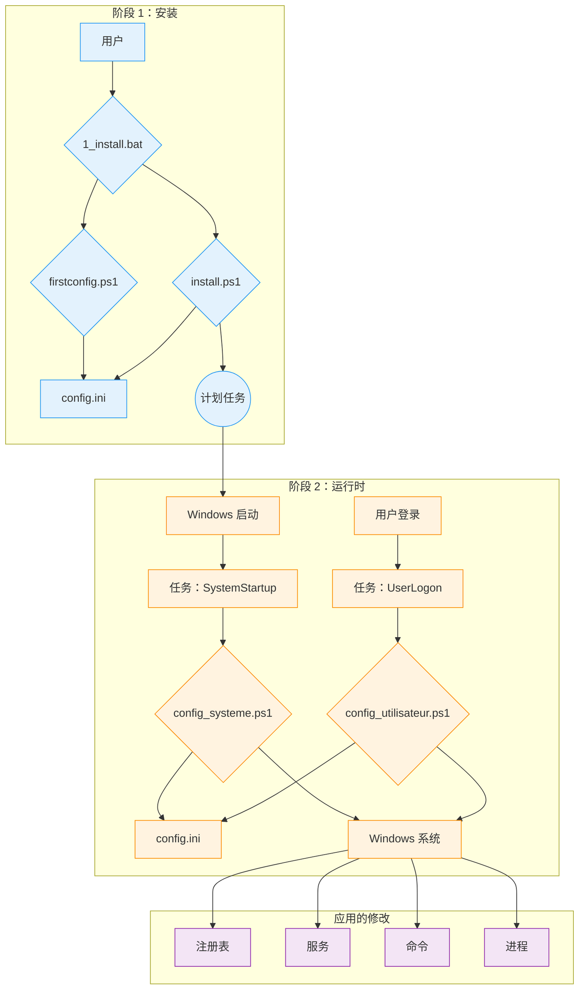

# WindowsOrchestrator 技术文档

本文档是 WindowsOrchestrator 项目的技术参考说明。它详细介绍了每个脚本的架构、组件和执行顺序。

[toc]

## 1. 项目概述

### 1.1. 项目行动

WindowsOrchestrator 项目可自动配置 Windows 操作系统。它运行修改系统设置和管理应用程序的脚本。脚本执行的操作将标准 Windows 安装转变为其行为由中央配置文件定义的环境。

脚本读取 config.ini 文件以执行修改注册表项、管理 Windows 服务、配置电源设置、创建计划任务以及管理用户进程生命周期的命令。

该项目提供了一组脚本，用于应用电源管理、系统更新、用户会话和应用程序生命周期的配置。

### 1.2. 工作原理

WindowsOrchestrator 的运行基于四个主要机制。

1.  **通过 Windows 原生工具执行**
    该项目使用 Windows 内置的功能和命令：PowerShell 5.1、任务计划程序、注册表编辑器和命令行实用程序（`powercfg`、`shutdown`）。该项目不需要安装任何外部依赖项。

2.  **通过集中式文件进行配置**
    脚本的执行逻辑与配置分离。脚本读取 `config.ini` 文件以确定要执行的操作。要更改脚本的行为，用户可以修改 `config.ini` 中的值。

3.  **执行上下文分离（系统 vs. 用户）**
    该项目使用两种不同的执行上下文：
    *   **`config_systeme.ps1`** 脚本以 `NT AUTHORITY\SYSTEM` 帐户的权限运行，并修改计算机的全局设置（HKLM 注册表、服务、计划任务）。
    *   **`config_utilisateur.ps1`** 脚本以登录用户的权限运行，并管理其会话的进程。

4.  **操作的幂等性**
    脚本的编写方式使其重复执行与单次执行产生相同的最终状态。在修改设置之前，脚本会检查系统的当前状态。如果所需状态已应用，脚本将不会重复修改操作。

## 2. 架构和关键组件

WindowsOrchestrator 的架构使用 Windows 的原生组件。每个组件都有明确定义的角色。

### 2.1. 架构图

执行流程和组件之间的交互由以下图表表示：

此图显示了由用户启动的**安装阶段**和由任务计划程序管理的自动化周期**运行时阶段**之间的分离。

### 2.2. 任务计划程序的作用

Windows 任务计划程序是自动化的核心组件。它在定义的时间以所需的权限级别执行配置脚本。

`install.ps1` 创建的两个主要任务是：

*   **`WindowsOrchestrator-SystemStartup`**
    *   **触发器：** “系统启动时”。
    *   **执行上下文：** `NT AUTHORITY\SYSTEM`。此帐户具有修改 `HKEY_LOCAL_MACHINE` (HKLM) 中注册表项、管理服务和运行系统命令所需的权限。
    *   **角色：** 执行所有计算机级别的配置。

*   **`WindowsOrchestrator-UserLogon`**
    *   **触发器：** 指定用户“登录时”。
    *   **执行上下文：** 登录用户的帐户。脚本以此用户的权限运行，允许它在用户会话中启动图形应用程序。
    *   **角色：** 执行所有特定于用户会话的配置。

### 2.3. `config.ini` 文件：配置的来源

`config.ini` 文件包含系统所需最终状态的描述。PowerShell 脚本（`config_systeme.ps1`、`config_utilisateur.ps1`）读取此文件并执行必要的命令，使系统符合定义的设置。

该机制具有几个事实特征：
*   脚本的行为由 config.ini 文件中包含的键值对确定。
*   执行逻辑包含在 PowerShell 脚本文件 (.ps1) 中，而控制此逻辑的参数则从 .ini 文件中读取。
*   脚本读取其根目录中存在的 config.ini 文件，这允许项目的不同实例根据其自己的 config.ini 文件的内容具有不同的行为。

### 2.4. 国际化 (i18n) 系统

该项目加载翻译后的文本，而无需修改源代码。

*   **文件结构：** 文本存储在 `i18n/` 目录子文件夹中的 `.psd1` 文件中。每个子文件夹都以区域性代码命名（例如 `fr-FR`、`en-US`）。

*   **检测和加载机制：**
    1.  在执行开始时，脚本运行 `(Get-Culture).Name` 命令以获取系统的区域性代码（例如 `"fr-FR"`）。
    2.  脚本构建相应语言文件的路径（例如 `i18n\fr-FR\strings.psd1`）。
    3.  **回退逻辑：** 如果此文件不存在，脚本将使用路径 `i18n\en-US\strings.psd1`。
    4.  `.psd1` 文件的内容由 `Invoke-Expression` 读取和解释，它将文本的哈希表加载到 `$lang` 变量中。

*   **在代码中使用：**
    要显示消息，代码通过键访问 `$lang` 哈希表（例如 `$lang.Uninstall_StartMessage`）。如果找不到键，日志记录函数将使用包含英文文本的 `-DefaultMessage` 参数。

要添加新语言，用户必须复制 `en-US` 文件夹，使用新的区域性代码重命名它，并翻译 `strings.psd1` 文件中的值。

## 3. 生命周期和执行顺序

本节将项目的过程分解为按时间顺序排列的执行顺序。

### 3.1. 完整的安装顺序

1.  **阶段 1 - 启动和配置（用户上下文）**
    *   用户运行 `1_install.bat`。
    *   批处理脚本执行 `management\firstconfig.ps1`。
    *   **`firstconfig.ps1` 运行：**
        *   它检查 `config.ini` 文件是否存在。如果不存在，则从 `management/defaults/default_config.ini` 模板创建它。如果存在，它会询问用户是否要替换它。
        *   它显示一个 Windows 窗体 GUI，预先填充了从 `config.ini` 读取的值。
        *   单击“保存并关闭”后，脚本会将界面字段中的值写入 `config.ini`。
        *   `firstconfig.ps1` 脚本终止。

2.  **阶段 2 - 提升和安装（管理员上下文）**
    *   `1_install.bat` 脚本恢复。
    *   它执行一个 PowerShell 命令，该命令使用 `Start-Process PowerShell -Verb RunAs` 来启动 `install.ps1`。
    *   Windows 触发**用户帐户控制 (UAC)** 提示。用户必须授予权限。
    *   **`install.ps1` 以管理员权限运行：**
        *   它检查 `config_systeme.ps1` 和 `config_utilisateur.ps1` 文件是否存在。
        *   它运行 `Register-ScheduledTask` 命令来创建两个任务：
            *   **`WindowsOrchestrator-SystemStartup`**，它在启动时 (`-AtStartup`) 使用 `NT AUTHORITY\SYSTEM` 帐户运行 `config_systeme.ps1`。
            *   **`WindowsOrchestrator-UserLogon`**，它在用户登录时 (`-AtLogOn`) 运行 `config_utilisateur.ps1`。
        *   为了应用配置，脚本通过 `Start-Process -Wait` 运行 `config_systeme.ps1`，然后运行 `config_utilisateur.ps1`。
    *   `install.ps1` 脚本终止。

### 3.2. 启动执行顺序（运行时 - 系统级别）

1.  **触发器：** Windows 操作系统启动。
2.  **任务执行：** 任务计划程序运行 `WindowsOrchestrator-SystemStartup` 任务。
3.  **脚本启动：** 任务使用 `NT AUTHORITY\SYSTEM` 帐户权限执行 `powershell.exe` 以启动 `config_systeme.ps1`。
4.  **`config_systeme.ps1` 的操作：**
    *   脚本解析 `config.ini` 并加载其内容。
    *   它检查网络连接 (`Test-NetConnection 8.8.8.8 -Port 53`)。
    *   它执行 `[SystemConfig]` 中定义的配置块。对于每个操作：
        *   它读取键的值。
        *   它检查系统的当前状态（注册表值、服务状态）。
        *   如果当前状态与所需状态不同，它将执行修改命令（`Set-ItemProperty`、`powercfg` 等）。
        *   它将操作或错误记录在列表中。
    *   它发送 Gotify 通知（如果启用）。
5.  **顺序结束：** 脚本终止。

### 3.3. 登录执行顺序（运行时 - 用户级别）

1.  **触发器：** 用户登录。
2.  **任务执行：** 任务计划程序运行 `WindowsOrchestrator-UserLogon` 任务。
3.  **脚本启动：** 任务使用用户权限执行 `powershell.exe` 以启动 `config_utilisateur.ps1` (`-WindowStyle Hidden`)。
4.  **`config_utilisateur.ps1` 的操作：**
    *   脚本解析 `config.ini`。
    *   它从 `[Process]` 部分读取参数。
    *   它执行进程管理逻辑：
        1.  它解析进程路径中的环境变量。
        2.  它搜索与名称匹配并属于当前用户的现有进程（通过 SID 验证）。
        3.  如果找到任何进程，它将终止它们 (`Stop-Process -Force`)。
        4.  它启动进程的新实例。
    *   它发送 Gotify 通知（如果启用）。
5.  **顺序结束：** 脚本终止。

### 3.4. 卸载顺序

1.  **触发器：** 用户运行 `2_uninstall.bat`。
2.  **提升：** `2_uninstall.bat` 脚本启动 `management\uninstall.ps1`，后者使用 `Start-Process -Verb RunAs` 重新启动自身。用户必须接受 UAC 提示。
3.  **`uninstall.ps1` 的操作：**
    *   脚本向用户提问以禁用自动登录。
    *   它还原系统注册表项：
        *   Windows 更新 (`NoAutoUpdate` -> `0`)。
        *   快速启动 (`HiberbootEnabled` -> `1`)。
        *   OneDrive（删除 `DisableFileSyncNGSC`）。
        *   自动登录 (`AutoAdminLogon` -> `0`)（如果请求）。
    *   它运行 `Unregister-ScheduledTask` 以删除四个计划任务。
    *   它显示摘要并通知文件未被删除。
4.  **顺序结束：** 脚本终止。

## 4. 安装和卸载过程

本节介绍批处理脚本为安装、激活、卸载和还原系统而执行的操作顺序。

### 4.1. 安装过程

该过程通过运行 `1_install.bat` 文件启动。它分为两个不同的阶段。

#### 4.1.1. 阶段 1：配置（用户上下文）

1.  `1_install.bat` 文件通过 `powershell.exe` 命令执行 `management\firstconfig.ps1` 脚本。
2.  `firstconfig.ps1` 脚本检查项目根目录下是否存在 `config.ini` 文件。
    *   如果 `config.ini` 文件不存在，则通过复制 `management/defaults/default_config.ini` 文件来创建它。
    *   如果 `config.ini` 文件存在，则会显示一个 `System.Windows.Forms.MessageBox` 对话框，询问用户是否要用模板替换现有文件。
3.  然后，脚本会显示一个图形用户界面 (Windows Forms)，其字段预先填充了从 `config.ini` 文件中读取的值。
4.  当用户单击“保存并关闭”按钮时，界面字段中的值将通过 `Set-IniValue` 函数写入 `config.ini` 文件。脚本终止。

#### 4.1.2. 阶段 2：任务安装（管理员上下文）

1.  控制权返回到 `1_install.bat` 脚本。它执行一个 `powershell.exe` 命令，其唯一作用是通过 `Start-Process PowerShell -Verb RunAs` 命令启动 PowerShell 的第二个实例。
2.  此操作会触发用户帐户控制 (UAC) 提示。用户必须授予权限才能继续。
3.  `management\install.ps1` 脚本以管理员权限运行并执行以下操作：
    *   它通过 `Register-ScheduledTask` 创建 **`WindowsOrchestrator-SystemStartup`** 计划任务。触发器设置为 `-AtStartup`，执行主体为 `NT AUTHORITY\SYSTEM` (`-UserId "NT AUTHORITY\SYSTEM"`)。操作是执行 `config_systeme.ps1` 脚本。
    *   它通过 `Register-ScheduledTask` 创建 **`WindowsOrchestrator-UserLogon`** 计划任务。触发器设置为 `-AtLogOn`，适用于当前用户，执行主体为该用户 (`-UserId "$($env:USERDOMAIN)\$($env:USERNAME)"`)。操作是执行 `config_utilisateur.ps1` 脚本。

4.  为了立即应用配置，`install.ps1` 随后会按顺序执行 `config_systeme.ps1` 和 `config_utilisateur.ps1` 脚本，并等待每个进程完成 (`-Wait`)。

#### 4.1.3. 安装后系统状态

*   两个计划任务 `WindowsOrchestrator-SystemStartup` 和 `WindowsOrchestrator-UserLogon` 在 Windows 任务计划程序中创建并处于活动状态。
*   项目根目录下存在一个 `config.ini` 文件，其中包含用户定义的配置。
*   项目根目录下存在一个 `Logs` 目录，其中包含初始执行的日志文件。
*   `config.ini` 中定义的系统设置已首次应用。

### 4.2. 卸载过程

该过程通过运行 `2_uninstall.bat` 文件启动。

#### 4.2.1. 权限提升

1.  `2_uninstall.bat` 文件执行 `management\uninstall.ps1` 脚本。
2.  `uninstall.ps1` 脚本检查其自身的权限级别。如果不是管理员，它会通过 `Start-Process powershell.exe -Verb RunAs` 重新启动自身，这会触发用户必须验证的 UAC 提示。

#### 4.2.2. 脚本执行的操作

以管理员权限运行的 `management\uninstall.ps1` 脚本执行以下操作：

1.  **用户交互：** 脚本通过 `Read-Host` 在控制台中显示提示，询问用户是否要禁用自动登录。用户的响应存储在一个变量中。
2.  **还原系统设置：**
    *   如果用户回答 `y` 或 `yes`，脚本会将字符串值 `"0"` 写入 `HKLM:\SOFTWARE\Microsoft\Windows NT\CurrentVersion\Winlogon\AutoAdminLogon` 注册表项。
    *   它将 DWORD 值 `0` 写入 `HKLM:\...\WindowsUpdate\AU\NoAutoUpdate` 项。
    *   它将 DWORD 值 `0` 写入 `HKLM:\...\WindowsUpdate\AU\NoAutoRebootWithLoggedOnUsers` 项。
    *   它将 DWORD 值 `1` 写入 `HKLM:\...\Power\HiberbootEnabled` 项。
    *   它通过 `Remove-ItemProperty` 从 `HKLM:\...\OneDrive` 项中删除 `DisableFileSyncNGSC` 值。
    *   它通过 `Set-Service` 将 `wuauserv` 服务的启动类型更改为 `Automatic`。
3.  **删除计划任务：**
    *   脚本遍历预定义的任务名称列表，并为每个任务执行 `Unregister-ScheduledTask -Confirm:$false`。删除的任务是：
        *   `WindowsOrchestrator-SystemStartup`
        *   `WindowsOrchestrator-UserLogon`
        *   `WindowsOrchestrator-SystemScheduledReboot`
        *   `WindowsOrchestrator-SystemPreRebootAction`

#### 4.2.3. 卸载后系统状态

*   四个与项目相关的计划任务已从任务计划程序中删除。所有自动化都已停止。
*   上面列出的注册表和服务设置已还原为其默认值。
*   `powercfg` 命令修改的电源设置不会被卸载脚本更改。
*   项目目录，包括所有脚本、`config.ini` 文件和日志，不会被删除，并保留在磁盘上。

## 5. 深入配置指南 (`config.ini`)

`config.ini` 文件是项目的声明性控制中心。本指南描述了每个键、其对脚本执行的影响、其可能的值以及其与其他设置的交互。默认值是在 `management/defaults/default_config.ini` 文件中指定的值。

### 5.1. `[SystemConfig]` 部分

本节管理影响整个系统的设置，并且仅由 `config_systeme.ps1` 读取。

---

**`AutoLoginUsername`**

*   **角色：** 指定将写入 `DefaultUserName` 注册表项的用户名。预重启操作逻辑也使用此值来解析 `%USERPROFILE%` 路径。
*   **可能的值：** 表示本地或域用户名的字符串（例如 `Admin`、`DOMAIN\User`）。如果该值留空，脚本将尝试读取 `DefaultUserName` 注册表项中已存在的值。
*   **默认值：** ""（空字符串）
*   **相互依赖关系：** 如果 `EnableAutoLogin` 为 `true`，则此参数是必需的。`%USERPROFILE%` 变量在 `PreRebootActionCommand` 键中使用也需要此参数。

---

**`EnableAutoLogin`**

*   **角色：** 控制 Windows 自动登录的状态。
*   **脚本操作：** 如果值为 `true`，脚本会将 `"1"` 写入 `HKLM:\SOFTWARE\Microsoft\Windows NT\CurrentVersion\Winlogon\AutoAdminLogon` 注册表项。如果值为 `false`，则写入 `"0"`。
*   **可能的值：** `true`、`false`
*   **默认值：** `false`
*   **相互依赖关系：** 需要正确配置 `AutoLoginUsername` 才能完全正常工作。**开发人员说明：** 脚本不处理密码 (`DefaultPassword`)，密码必须带外配置（例如，使用 Sysinternals AutoLogon 工具）。

---

**`DisableFastStartup`**

*   **角色：** 控制 Windows 快速启动功能 (Hiberboot)。
*   **脚本操作：** 如果为 `true`，则将值 `0` (DWORD) 写入 `HKLM:\...\Power\HiberbootEnabled` 注册表项。如果为 `false`，则写入 `1`。
*   **可能的值：** `true`、`false`
*   **默认值：** `true`
*   **相互依赖关系：** 无。

---

**`DisableSleep`** 和 **`DisableScreenSleep`**

*   **角色：** 管理计算机和屏幕的睡眠状态。
*   **脚本操作：**
    *   对于 `DisableSleep=true`，执行 `powercfg /change standby-timeout-ac 0` 和 `powercfg /change hibernate-timeout-ac 0` 命令。
    *   对于 `DisableScreenSleep=true`，执行 `powercfg /change monitor-timeout-ac 0` 命令。
*   **可能的值：** `true`、`false`
*   **默认值：** `DisableSleep=true`、`DisableScreenSleep=false`
*   **相互依赖关系：** 无。

---

**`DisableWindowsUpdate`**

*   **角色：** 完全禁用 Windows 更新服务。
*   **脚本操作：** 如果为 `true`，脚本将执行三个操作：
    1.  将值 `1` (DWORD) 写入 `HKLM:\...\WindowsUpdate\AU\NoAutoUpdate` 项。
    2.  将 `wuauserv` 服务的启动类型更改为 `Disabled`。
    3.  停止 `wuauserv` 服务 (`Stop-Service`)。
*   **可能的值：** `true`、`false`
*   **默认值：** `true`
*   **相互依赖关系：** 无。

---

**`DisableAutoReboot`**

*   **角色：** 如果用户会话处于活动状态，则阻止 Windows 在更新后自动重启。
*   **脚本操作：** 如果为 `true`，则将值 `1` (DWORD) 写入 `HKLM:\...\WindowsUpdate\AU\NoAutoRebootWithLoggedOnUsers` 注册表项。
*   **可能的值：** `true`、`false`
*   **默认值：** `true`
*   **相互依赖关系：** 此设置主要在 `DisableWindowsUpdate` 为 `false` 时相关。

---

**`ScheduledRebootTime`**

*   **角色：** 安排计算机每日重启。
*   **脚本操作：** 如果提供了值，脚本将创建/更新一个计划任务 (`WindowsOrchestrator-SystemScheduledReboot`)，该任务在指定时间执行 `shutdown.exe /r /f /t 60`。如果该值为空，则删除计划任务。
*   **可能的值：** `HH:MM` 格式的字符串（例如 `03:00`），或空字符串以禁用。
*   **默认值：** `03:00`
*   **相互依赖关系：** 脚本为预重启操作和重启创建两个单独的计划任务。Windows 任务计划程序在指定时间执行每个任务，而不检查其时间顺序。

---

**`PreRebootAction...`**（4 个键的组）

*   **角色：** 在计划重启之前执行自定义命令。仅当 `PreRebootActionTime` 和 `PreRebootActionCommand` 均不为空时，此块才处于活动状态。
*   **脚本操作：** 创建/更新一个计划任务 (`WindowsOrchestrator-SystemPreRebootAction`)，该任务执行指定的命令。脚本解析 `PreRebootActionCommand` 中的环境变量 (`%USERPROFILE%`) 和相对路径。
*   **键：**
    *   `PreRebootActionTime`：触发时间 (`HH:MM`)。
    *   `PreRebootActionCommand`：可执行文件或脚本的路径。
    *   `PreRebootActionArguments`：要传递给命令的参数。
    *   `PreRebootActionLaunchMethod`：执行方法（`direct`、`powershell`、`cmd`）。
*   **默认值：** `02:55`、`"PreReboot.bat"`、`""`、`cmd`
*   **相互依赖关系：** “WindowsOrchestrator-SystemPreRebootAction”任务的执行独立于“WindowsOrchestrator-SystemScheduledReboot”任务的存在。

---

**`DisableOneDrive`**

*   **角色：** 通过系统策略禁用 OneDrive 集成。
*   **脚本操作：** 如果为 `true`，则将值 `1` (DWORD) 写入 `HKLM:\...\OneDrive\DisableFileSyncNGSC` 注册表项。如果为 `false`，则删除该项。
*   **可能的值：** `true`、`false`
*   **默认值：** `true`
*   **相互依赖关系：** 无。

### 5.2. `[Process]` 部分

本节由 `config_utilisateur.ps1` 读取，描述了如何管理主要的业务应用程序。操作基于以下相互依赖的三个键：

*   **`ProcessName`（“什么”）**
    *   **角色：** 定义要启动的可执行文件或脚本的完整路径。这是操作的主要目标。
    *   **脚本操作：** 脚本使用此值来标识要停止的进程，并作为启动命令的目标。它支持在运行时动态解析的系统和用户环境变量（例如 `%USERPROFILE%`、`%PROGRAMFILES%`）。

*   **`ProcessArguments`（“用什么”）**
    *   **角色：** 指定要传递给 `ProcessName` 中定义的可执行文件/脚本的命令行参数。
    *   **脚本操作：** 此字符串将附加到执行命令。如果为空，则不传递任何参数。

*   **`LaunchMethod`（“如何”）**
    *   **角色：** 指定用于启动 `ProcessName` 的命令解释器。此选择对于兼容性至关重要。
    *   **脚本操作：** 脚本根据值以不同方式构造最终命令：
        *   `direct`：直接启动可执行文件。命令是 `ProcessName "ProcessArguments"`。这是 `.exe` 文件的标准方法。
        *   `cmd`：通过 `cmd.exe` 命令解释器启动。生成的命令是 `cmd.exe /c ""ProcessName" ProcessArguments"`。这是批处理脚本（`.bat`、`.cmd`）的推荐方法。
        *   `powershell`：通过 PowerShell 启动。生成的命令是 `powershell.exe -NoProfile -ExecutionPolicy Bypass -Command "& 'ProcessName' ProcessArguments'"`。这是运行其他 PowerShell 脚本（`.ps1`）的理想方法。

### 5.3. `[Logging]` 部分

本节配置日志文件的行为。

*   **`EnableLogRotation`**
    *   **角色：** 启用或禁用日志归档机制。
    *   **脚本操作：** 如果为 `true`，则在写入日志文件 (`log.txt`) 之前，将调用 `Rotate-LogFile` 函数。它将 `log.txt` 重命名为 `log.1.txt`，将 `log.1.txt` 重命名为 `log.2.txt`，依此类推，直到达到限制，然后删除最旧的一个。如果为 `false`，则不调用此函数，日志文件将无限增长。
*   **`MaxSystemLogsToKeep` 和 `MaxUserLogsToKeep`**
    *   **角色（预期）：** 在 `default_config.ini` 中提供这些键以定义要保留的已归档日志文件的数量。
    *   **脚本操作（当前）：** config_systeme.ps1 脚本不读取 MaxSystemLogsToKeep 和 MaxUserLogsToKeep 键。Rotate-LogFile 函数使用由 $DefaultMaxLogs 变量定义的固定值 7 调用。

### 5.4. `[Gotify]` 部分

本节控制向 Gotify 服务器发送状态通知。

*   **`EnableGotify`**：如果为 `true`，脚本将在执行结束时尝试发送通知。
*   **`Url`**：Gotify 实例的基本 URL（例如 `http://gotify.example.com`）。
*   **`Token`**：在 Gotify 中生成的用于授权发送消息的应用程序令牌。
*   **`Priority`**：定义 Gotify 中消息优先级的整数。
*   **`GotifyTitle...`**（4 个键的组）：
    *   **角色：** 通知标题的模板。
    *   **脚本操作：** 在发送通知之前，脚本从相应的键（例如 `GotifyTitleErrorSystem`）中获取字符串，并将文字字符串 `%COMPUTERNAME%` 和 `%USERNAME%` 替换为相应环境变量的值。

## 6. 详细脚本说明（代码参考）

本节用作源代码的参考。它分解了项目中每个主要脚本的逻辑和内部机制。

### 6.1. 编排脚本 (`management/`)

这些脚本管理项目的生命周期（安装、初始配置、卸载）。它们旨在由用户手动运行。

#### **`firstconfig.ps1`**

*   **角色：** 提供图形用户界面 (GUI) 以辅助配置 `config.ini` 文件。
*   **GUI 逻辑：**
    *   脚本使用通过 `Add-Type` 加载的 .NET 程序集 `System.Windows.Forms` 和 `System.Drawing` 来动态构建界面对象（窗体、标签、文本框、复选框、按钮）。
    *   控件的定位由变量（`$xPadding`、`$yCurrent`）管理，这些变量在添加每个元素后递增。
    *   界面语言从 `strings.psd1` 文件动态加载。
*   **`config.ini` 管理：**
    *   **读取：** 启动时，脚本使用本地 `Get-IniValue` 函数从 `config.ini` 读取当前值。此函数逐行读取文件以提取值。`true`/`false` 值将转换为 `[bool]` PowerShell 类型以用于 `CheckBoxes`。
    *   **写入：** 单击“保存”按钮时，`Add_Click` 事件会为每个参数调用本地 `Set-IniValue` 函数。此函数在将文件内容写入磁盘（使用 UTF-8 编码）之前在内存中重建文件内容。

#### **`install.ps1`**

*   **角色：** 通过安装计划任务和执行运行时脚本的初始运行来创建系统持久性。
*   **自我提升机制：** 脚本通过 `New-Object Security.Principal.WindowsPrincipal` 检查其权限级别。如果不是“Administrator”，它会使用 `Start-Process powershell.exe -Verb RunAs` 重新启动自身。
*   **任务创建逻辑：**
    *   脚本使用本机 cmdlet `New-ScheduledTaskAction`、`New-ScheduledTaskTrigger`、`New-ScheduledTaskPrincipal`、`New-ScheduledTaskSettingsSet` 和 `Register-ScheduledTask`。
    *   **主体管理：**
        *   对于 `...-SystemStartup`，它使用 `-UserId "NT AUTHORITY\SYSTEM" -RunLevel Highest`。
        *   对于 `...-UserLogon`，它使用 `-UserId "$($env:USERDOMAIN)\$($env:USERNAME)" -LogonType Interactive`。
*   **安装后执行：**
    *   注册任务后，脚本通过 `Start-Process -Wait` 执行 `config_systeme.ps1`，然后执行 `config_utilisateur.ps1`。

#### **`uninstall.ps1`**

*   **角色：** 删除自动化组件并还原关键系统设置。
*   **还原逻辑：**
    *   脚本在其代码中包含硬编码的 Windows“默认”值以还原系统状态。
    *   它使用与 `config_systeme.ps1` 相同的 cmdlet（`Set-ItemProperty`、`Set-Service`），但使用相反的值。
    *   操作封装在 `try...catch` 块中。
*   **清理逻辑：**
    *   它使用包含四个计划任务名称的预定义列表 (`$TasksToRemove`)。
    *   它遍历此列表并运行 `Get-ScheduledTask` 以检查任务是否存在，然后运行 `Unregister-ScheduledTask -Confirm:$false` 以删除它。

### 6.2. 运行时脚本（根）

这些脚本包含主要的业务逻辑，并由计划任务自动执行。

#### **`config_systeme.ps1`**

*   **脚本架构：** 脚本分为几个区域：基本函数、实用函数、初始化和主执行块 (`try...catch...finally`)。
*   **关键函数：**
    *   `Get-IniContent`：解析 `config.ini` 并将其转换为嵌套的 PowerShell 哈希表 (`$ini['Section']['Key']`)。
    *   `Get-ConfigValue`：这是访问配置的包装器。它处理缺少的键/部分，提供默认值并执行类型转换。
    *   `Add-Action` / `Add-Error`：这些函数集中进行日志记录。它们将消息添加到用于构建 Gotify 报告的全局列表（`$Global:ActionsEffectuees`、`$Global:ErreursRencontrees`）中。
*   **执行逻辑：** 脚本的主体是一系列配置块。每个块都是幂等的：它在写入之前首先读取系统的当前状态（注册表值、服务状态）。

#### **`config_utilisateur.ps1`**

*   **角色：** 确保 `[Process]` 中定义的业务应用程序处于所需状态（单个、新启动的实例）。
*   **进程管理逻辑：**
    1.  **路径解析：** `ProcessName` 由 `[System.Environment]::ExpandEnvironmentVariables()` 处理以解析 `%USERPROFILE%` 等变量。
    2.  **所有者识别：** 搜索现有进程使用 `Get-Process` 按名称查找进程，然后使用 `Get-CimInstance Win32_Process` 检索每个进程的所有者。它将进程所有者的 SID 与当前用户的 SID (`[System.Security.Principal.WindowsIdentity]::GetCurrent().User.Value`) 进行比较。
    3.  **停止和重启：** 如果找到匹配的进程，则通过 `Stop-Process -Force` 终止它。然后，使用 `Start-Process` 启动一个新实例。对 `Start-Process` 的调用使用“Splatting” (`@startProcessSplat`)。

### 6.3. 实用脚本和启动器

这些脚本要么是支持工具，要么是集成示例。

#### **`Close-AppByTitle.ps1`**

*   **与 `user32.dll` 的交互：**
    *   它通过 `Add-Type -TypeDefinition` 将 C# 类注入内存。此 C# 代码使用 `[DllImport("user32.dll")]` 属性向 PowerShell 公开 Windows API 函数。
    *   `EnumWindows` 函数与 PowerShell 脚本块一起用作“回调”。对于 API 找到的每个窗口，都会执行此 PowerShell 块。在此块中检查窗口标题。
    *   通过其 `handle` 识别目标窗口后，将调用 `SetForegroundWindow` 以使其获得焦点，然后 `[System.Windows.Forms.SendKeys]::SendWait()` 模拟击键。

#### **`PreReboot.bat` 和 `LaunchApp.bat`**

*   **可移植性：** 这些启动器的操作依赖于特殊的批处理脚本变量 `%~dp0`，它解析为脚本所在目录的完整路径。

#### **`management/tools/Find-WindowInfo.ps1`**

*   **实用性：** 此脚本是一个调试和配置工具。
*   **操作：** 它使用与 `Close-AppByTitle.ps1` 相同的 C# 代码注入和 `EnumWindows` API 调用技术。它显示可见窗口的格式化列表，以及进程名称及其 PID。

## 7. 维护和调试过程

本节提供诊断问题和测试更改的实用指南。

### 7.1. 理解和使用日志 (`Logs/`)

*   **位置：** 日志在 `Logs/` 子文件夹中创建。
    *   `config_systeme_ps_log.txt`：包含系统脚本的日志。
    *   `config_utilisateur_log.txt`：包含用户脚本的日志。
*   **日志消息结构：** `YYYY-MM-DD HH:mm:ss [LEVEL] [Context] - Message`
*   **如何识别操作和错误：**
    *   **成功操作：** `ACTION: ...`
    *   **捕获的错误：** `CAPTURED ERROR: ...`
    *   **致命错误：** `FATAL SCRIPT ERROR ...`

### 7.2. 手动调试脚本

#### **使用 `SYSTEM` 权限运行 `config_systeme.ps1`**

1.  **先决条件：** 从 Microsoft Sysinternals 套件下载 `PsExec.exe`。
2.  **执行过程：**
    *   以管理员身份打开命令提示符。
    *   运行命令：`PsExec.exe -s -i powershell.exe`
    *   将打开一个新的 PowerShell 窗口。`whoami` 命令返回 `nt authority\system`。
    *   在此窗口中，导航到项目目录并运行 `.\config_systeme.ps1`。

#### **在用户会话中测试 `config_utilisateur.ps1`**

1.  **执行过程：**
    *   使用目标用户帐户登录到 Windows 会话。
    *   打开标准的 PowerShell 控制台。
    *   导航到项目目录并运行 `.\config_utilisateur.ps1`。

#### **检查计划任务的状态**

1.  **打开工具：** 运行 `taskschd.msc`。
2.  **查找任务：** 选择“任务计划程序库”。
3.  **分析信息：**
    *   检查“状态”、“触发器”和“上次运行结果”列（代码 `0x0` 表示成功）。
    *   有关每次执行的详细信息，请查阅“历史记录”选项卡。

### **7.3. 安全注意事项**

本节详细介绍了与项目操作相关的安全机制和影响。

*   **系统任务的执行上下文**  
    `install.ps1` 脚本将 `WindowsOrchestrator-SystemStartup` 计划任务配置为使用 `NT AUTHORITY\SYSTEM` 帐户的权限运行。此帐户在本地系统上具有广泛的权限，这对于允许 `config_systeme.ps1` 脚本修改 `HKEY_LOCAL_MACHINE` (HKLM) 配置单元中的注册表项和管理系统服务是必需的。

*   **权限提升机制 (UAC)**  
    安装 (`1_install.bat`) 和卸载 (`2_uninstall.bat`) 脚本不需要从管理员会话中启动。它们执行一个 `Start-Process -Verb RunAs` 命令，该命令会触发 Windows 用户帐户控制 (UAC) 提示。执行的继续取决于用户对此提示的验证。

*   **会话密码管理**  
    项目脚本**不以任何形式处理、请求或存储**用户密码。激活自动登录功能 (`EnableAutoLogin=true`) 只是将值 `"1"` 写入 `AutoAdminLogon` 注册表项。`DefaultPassword` 项永远不会由脚本写入。将密码安全地存储在注册表中的责任在于用户，通过外部工具（如 `Sysinternals AutoLogon`）。

*   **执行策略绕过**  
    启动脚本 (`.bat`) 和计划任务创建命令在调用 `powershell.exe` 时系统地使用 `-ExecutionPolicy Bypass` 参数。此参数允许脚本运行，而不管系统上配置的执行策略如何。此设置仅适用于正在启动的进程实例，不会永久修改系统的安全策略。

### **7.4. 已知限制**

本节记录了由于设计选择或表示此阶段未实现的功能而导致的行为。

*   **不还原电源设置**  
    `uninstall.ps1` 脚本不执行任何 `powercfg` 命令。因此，在卸载期间不会撤消 `config_systeme.ps1` 对计算机睡眠 (`standby-timeout-ac`) 或屏幕睡眠 (`monitor-timeout-ac`) 所做的更改。

*   **非活动日志轮换配置**  
    配置模板文件 (`default_config.ini`) 包含 `MaxSystemLogsToKeep` 和 `MaxUserLogsToKeep` 键。但是，`config_systeme.ps1` 中的 `Rotate-LogFile` 函数不读取这些键。它使用由脚本中的 `$DefaultMaxLogs` 变量定义的固定值 `7`。

*   **缺少重启任务的时间顺序验证**  
    `config_systeme.ps1` 脚本将预重启操作和计划重启的计划任务创建为两个独立的实体。脚本中没有逻辑来验证 `PreRebootActionTime` 的值在时间上是否早于 `ScheduledRebootTime` 的值。

## 8. 附录

### 8.1. 许可证

本项目根据 **GNU 通用公共许可证 v3 (GPLv3)** 的条款分发。许可证的全文可在项目根目录的 `LICENSE` 文件中找到。

### 8.2. 术语表

---
**UAC (User Account Control / 用户帐户控制)**
*   **定义：** 一种 Windows 安全机制，在允许需要管理员权限的操作之前需要用户确认。
*   **在项目中的上下文：** 由 `install.ps1` 和 `uninstall.ps1` 通过 `Start-Process` 命令的 `-Verb RunAs` 参数触发。
---
**计划任务 (Scheduled Task)**
*   **定义：** Windows“任务计划程序”服务的一个组件，允许自动执行脚本或程序。
*   **在项目中的上下文：** 自动化的核心机制。
---
**Windows 注册表 (Windows Registry)**
*   **定义：** Windows 存储配置设置的层次结构数据库。
*   **在项目中的上下文：** `config_systeme.ps1` 修改的主要目标。
---
**HKLM (HKEY_LOCAL_MACHINE)**
*   **定义：** 包含适用于整个计算机的设置的注册表配置单元。
*   **在项目中的上下文：** `config_systeme.ps1` 的所有注册表修改都位于 HKLM 中。
---
**SID (Security Identifier / 安全标识符)**

*   **定义：** 标识安全主体（用户、组）的唯一字符串。
*   **在项目中的上下文：** 由 `config_utilisateur.ps1` 用于识别进程的所有者。
---
**`NT AUTHORITY\SYSTEM` (SYSTEM 帐户)**
*   **定义：** 在本地系统上具有广泛权限的内部 Windows 服务帐户。
*   **在项目中的上下文：** `config_systeme.ps1` 的执行上下文。
---
**幂等性 (Idempotence)**
*   **定义：** 如果多次应用，产生与单次应用相同结果的操作属性。
*   **在项目中的上下文：** 脚本的设计原则，以确保稳定的最终状态。
---
**PowerShell 执行策略 (Execution Policy)**
*   **定义：** 一种 PowerShell 安全功能，用于确定是否可以运行脚本。
*   **在项目中的上下文：** 通过 `-ExecutionPolicy Bypass` 参数绕过，以确保脚本执行。
